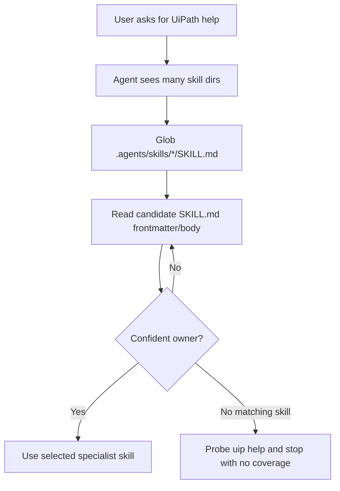
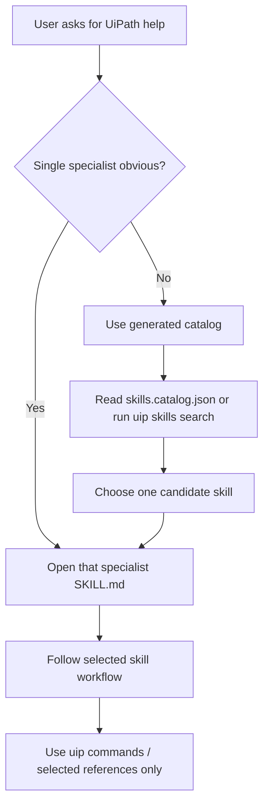
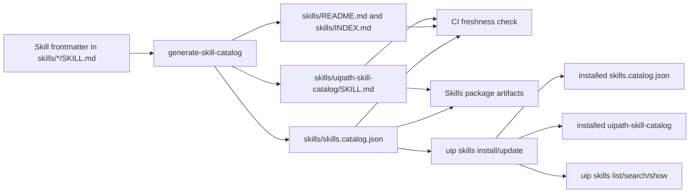

# UiPath Skill Discovery Catalog Design

## Executive Summary

UiPath skills are installed and packaged as many independent `SKILL.md` directories. For file-copy installs such as Codex, the backed product gap was simple: the installed skill root had no top-level catalog files and no CLI command to query the installed skill set.

The implemented architecture is progressive discovery:

1. Generate a compact catalog from `SKILL.md` frontmatter.
2. Let the agent, user, or CLI choose one likely owning skill from that catalog.
3. Load only that selected `SKILL.md`.
4. Follow that skill's references only when its workflow requires them.

The PR set implements this in two places:

- `UiPath/skills#380` adds generated source/package catalog artifacts and a generated `uipath-skill-catalog` skill to the skills repository.
- `UiPath/cli#1131` adds installed-skill catalog generation for file-copy agents and exposes `uip skills list`, `uip skills search`, and `uip skills show`.

This design does not claim a measured Claude performance improvement. Claude Code already has native skill metadata and may route directly to specialist skills without using this catalog. For Claude, the generated files are package documentation and a consistent artifact in the shipped skills repo. For Codex and other file-copy installs, the catalog is directly actionable because the install root now contains a discoverable catalog skill plus a machine-readable local API.

The evidence below should be read narrowly. It does not claim Claude Haiku needs a catalog to choose skills, and it does not claim Haiku or any other model is guaranteed to spontaneously call `uip skills search`. It supports only the file-copy/product-surface gap: without a catalog, prompts and harnesses had to supply routing tables or filesystem-walking instructions when they wanted deterministic installed-skill discovery.

## Problem Statement

For file-copy installs, `uip skills install` previously installed multiple UiPath skills without a stable "start here" surface. A prompt or agent workflow that wanted deterministic routing had to guess from directory names, inspect `SKILL.md` files, or carry its own routing map.

That is acceptable in a controlled harness. It is weaker as a product surface because the installed set is not self-describing at the package level. A package with many skills can expose a generated catalog built from the same metadata the individual skills already maintain.

## What Was Before

In Codex/file-copy mode, a local install produced sibling skill directories:

```text
.agents/skills/uipath-agents/SKILL.md
.agents/skills/uipath-case-management/SKILL.md
.agents/skills/uipath-coded-apps/SKILL.md
...
.agents/skills/uipath-test/SKILL.md
```

There was no top-level catalog file, no catalog skill, and no CLI command to query the installed skill set. The scenario harness compensated by telling agents how to route or by forcing them to walk the installed skill tree.

One archived skills-mode run captured that pre-fix behavior directly. The run used Claude Haiku as the leaf model in a Codex-style file-copy install. The harness prompt told the agent to list `.agents/skills/*/SKILL.md`, skim frontmatter, pick one skill, then read that skill in full. It also said no hard-coded mapping was provided. The prompt excerpt, installed-skill list, observed tool sequence, and structured verdict are embedded below.

The observed agent then:

- Globbed `.agents/skills/*/SKILL.md` and saw 14 installed skills.
- Read `uipath-human-in-the-loop/SKILL.md`.
- Read `uipath-platform/SKILL.md`.
- Read `uipath-rpa/SKILL.md`.
- After those reads and subsequent CLI help probes, concluded that no installed skill or `uip` command covered Action Center catalog administration.

The observer recorded this as a reinforced catalog-missing signal: `skills_read_before_pick = 3`, `catalog_signal_reinforced = true`.

## What Is Now

The implementation turns the skill set into a self-describing package.

In the skills repository, `UiPath/skills#380` adds:

- `scripts/generate-skill-catalog.mjs`
- `skills/skills.catalog.json`
- `skills/README.md`
- `skills/INDEX.md`
- `skills/uipath-skill-catalog/SKILL.md`
- nested `skills/uipath-skill-catalog/references/*` copies for packaged distribution
- `uipath-planner` catalog-first routing
- CI freshness checks for generated catalog artifacts
- smoke and e2e task coverage for catalog/planner routing
- CODEOWNERS coverage for the generator, root artifacts, catalog skill, and tests

In the CLI, `UiPath/cli#1131` adds:

- generated installed catalog artifacts after file-copy `install` and `update`
- a generated `uipath-skill-catalog` skill in file-copy roots
- `uip skills list`
- `uip skills search <goal>`
- `uip skills show <name>`
- generated ownership markers so user-owned root files and catalog skills are not overwritten or removed
- uninstall cleanup for generated-owned catalog artifacts only

The result is an explicit catalog layer that uses existing frontmatter as the source of truth without duplicating a hand-maintained routing table.

## Client Scope

| Dimension | Claude Code Plugin | Codex / File-Copy Agents |
|---|---|---|
| Packaging path | Claude installs the UiPath plugin package. | `uip skills install --agent codex --local` copies directories into `.agents/skills/<skill>/`. |
| Native skill discovery | Claude Code has native skill metadata; this design does not prove it needs a catalog to choose skills. | File-copy agents see files on disk; the installed filesystem is the discovery surface. |
| Catalog role | Package-level generated documentation and a consistent artifact shipped with the skills repo. | Direct product surface: an actual `uipath-skill-catalog` skill plus local `list/search/show` commands. |
| Primary value | Not a measured performance win. Keeps source/package metadata explicit and generated. | Avoids requiring every prompt/workflow to inspect many sibling `SKILL.md` files or maintain a private routing table. |
| Expected happy path | Claude may ignore the catalog and select `uipath-platform`, `uipath-rpa`, etc. directly through native skill matching. | Agent or user can search/list the compact catalog, select one skill, then open only that specialist skill. |
| Failure mode addressed | No backed Claude failure mode is claimed here. | Broad context loading, repeated Glob/Read discovery, and no installed-skills API. |
| Implementation location | Source/package artifacts in `UiPath/skills#380`. | Installed artifact generation and CLI commands in `UiPath/cli#1131`. |

## File-Copy Discovery Flow Before



The problem is not that the flow is impossible. The problem is that the first routing step scales with the number of installed skills and is repeated unless the harness, user, or client supplies a routing map.

## File-Copy Discovery Flow Now



The catalog introduces a bounded routing hop for clients and prompts that explicitly use it. The specialist skill remains the owner of implementation behavior.

## Packaging Architecture



Frontmatter stays authoritative. Generated catalog outputs are checked artifacts, not a parallel hand-authored source.

## Concrete Evidence: File-Copy Discovery Cost

The clearest catalog-missing signal used here came from a file-copy skills-mode run for the `orchestrator-action-catalog-encryption` scenario on CLI `1.0.0 @ 0fa5cf58`. The scenario needed Action Center catalog administration. No installed skill owned that goal, so this run isolates the cost of discovering that absence in a filesystem-installed skill set.

The prompt explicitly forced filesystem discovery and did not provide a routing table:

```text
skills mode, `uip skills install --agent codex --local` has populated
`.agents/skills/` in your workdir with UiPath CLI skills -- one directory
per skill, each containing a `SKILL.md` plus optional `references/`.

This gives you a local, filesystem-discoverable skill set. Read the
frontmatter to learn what each skill does, route to the best fit, and
then return to real `uip` commands. No hard-coded mapping is provided.

STEP 1 (Glob): list `.agents/skills/*/SKILL.md` to see what's available.
STEP 2 (Read): skim each SKILL.md's YAML frontmatter `description` field
and, based on this scenario's goal, pick the ONE skill that best fits.
STEP 3 (Read): Read the chosen SKILL.md in full.
```

The install produced 14 separate skill directories and no catalog:

```json
{
  "Result": "Success",
  "Code": "SkillsInstall",
  "Data": {
    "Skills": [
      "uipath-agents",
      "uipath-case-management",
      "uipath-coded-apps",
      "uipath-data-fabric",
      "uipath-diagnostics",
      "uipath-feedback",
      "uipath-human-in-the-loop",
      "uipath-maestro-flow",
      "uipath-planner",
      "uipath-platform",
      "uipath-rpa",
      "uipath-rpa-legacy",
      "uipath-servo",
      "uipath-test"
    ],
    "Agents": ["codex"],
    "Installed": 14
  }
}
```

The transcript shows the agent walked the installed set and then probed CLI help before it could conclude no skill applied:

```text
Glob  .agents/skills/*/SKILL.md
Read  .agents/skills/uipath-human-in-the-loop/SKILL.md
Read  .agents/skills/uipath-platform/SKILL.md
Read  .agents/skills/uipath-rpa/SKILL.md
Glob  .agents/skills/uipath-platform/references/*
Grep  action.*catalog|catalog.*encrypt|Action Center
Grep  action|catalog|catalog encrypt
Bash  uip --help-all | grep -i "action\|catalog"
Bash  uip or --help
Bash  uip resource --help
```

The observer verdict captured the routing cost as structured data:

```json
{
  "skill_discovery_cost": {
    "skills_read_before_pick": 3,
    "catalog_signal_reinforced": true
  },
  "prompt_critique": {
    "notes": [
      "Agent still performed 3 SKILL.md reads before realizing none covered Action Center (uipath-human-in-the-loop is the closest but is Flow-authoring, not catalog admin). This is the skill-catalog-overview-missing signal firing again."
    ]
  }
}
```

This evidence does not prove the CLI Action Center gap belongs in the catalog PR. It proves a separate point: in a file-copy install without a catalog, a prompt that requires deterministic skill routing may pay repeated `SKILL.md` discovery cost before it can decide the right outcome is "no matching skill / no CLI coverage."

## Concrete Evidence: Prompt Table Vs Frontmatter Discovery

There is a second useful Claude Haiku comparison for `agent-resume-screening`, but it should not be treated as proof that Claude benefits from the catalog. Both runs are skills-mode runs with the same installed skills. The variant is whether the prompt supplied an explicit hard-coded skill-picker table or required the agent to discover the correct skill from installed `SKILL.md` frontmatter.

The older prompt embedded an explicit routing table:

```text
Pick ONE skill for this scenario from this table:
  agent        -> uipath-agents
  flow, maestro -> uipath-maestro-flow
  codedapp     -> uipath-coded-apps
  codedagents  -> uipath-coded-workflows
  rpa          -> uipath-rpa-workflows
  solution, integration, testing, case, storage, orchestrator, platform -> uipath-platform

STEP 1 (Read): Read .claude/skills/<chosen-skill>/SKILL.md in full.
STEP 2 (Read, optional): Read .claude/skills/<chosen-skill>/references/*.md files the SKILL.md cites.
STEP 3 (Bash): Run uip commands following the patterns from the skill.
```

That table-guided run used Claude Haiku and recorded these metrics. The run also hit deploy/retry behavior, so these numbers are descriptive evidence for that run, not proof that the routing table caused the slower outcome:

```json
{
  "model": "haiku",
  "wall_clock": "302s",
  "agent_duration": 299,
  "realMetrics": {
    "num_turns": 48,
    "total_cost_usd": 0.4766408,
    "input_tokens": 3263396,
    "output_tokens": 15875,
    "suspect": false
  },
  "skillsConsulted": ["uipath-agents"],
  "steps": 30
}
```

The later prompt removed the table and required frontmatter discovery. Relevant excerpt:

```text
skills mode, `uip skills install --agent claude --local` has populated
`.claude/skills/` in your workdir with UiPath CLI skills -- one directory
per skill, each containing a `SKILL.md` plus optional `references/`.

No hard-coded mapping is provided.

STEP 1 (Glob): list `.claude/skills/*/SKILL.md` to see what's available.
STEP 2 (Read): skim each SKILL.md's YAML frontmatter `description` field
and, based on this scenario's goal, pick the ONE skill that best fits.
STEP 3 (Read): Read the chosen SKILL.md in full.
STEP 4 (Bash): Run `uip` commands following the patterns from the skill.
```

That frontmatter-discovery run also used Claude Haiku and recorded these metrics:

```json
{
  "model": "haiku",
  "wall_clock": "166s",
  "agent_duration": 163,
  "realMetrics": {
    "num_turns": 33,
    "total_cost_usd": 0.27766045,
    "input_tokens": 1897169,
    "output_tokens": 8838,
    "suspect": false
  },
  "skillsConsulted": ["uipath-agents"],
  "steps": 20,
  "observer_result": "PASS, composite 1.00"
}
```

The later run's archived observation recorded `uipath-agents` as the discovered skill, no hard-coded table, zero isolation breaches, and a PASS verdict. Its metrics were lower than the older table-guided run: 166s / $0.28 / 33 turns versus 302s / $0.48 / 48 turns. Because the older run also had retry/deploy differences, the comparison is useful for sufficiency of frontmatter routing in this case, not for causal performance attribution.

This evidence cuts both ways:

- Claude Haiku can route from frontmatter without an explicit skill table for a straightforward case.
- The hard-coded skill table was not necessary for the later successful run. The older table-guided run was slower and more expensive, but the comparison is confounded by retry/deploy differences.
- The harness had previously carried an explicit skill map in the prompt, which is exactly the kind of private routing surface that should not be hand-maintained in prompts.
- Even the successful no-table run still depended on explicit procedural prompt guidance: glob installed `SKILL.md` files, skim frontmatter, choose one, then read the chosen skill. That is good evidence that Haiku can follow the routing protocol when told the protocol exists. It is not a product guarantee that arbitrary user prompts will include the same protocol.
- This pair does not prove a generated catalog improves Claude. It only supports removing private hard-coded prompt maps and making any package-level routing surface generated from source metadata.

## Claims Supported And Not Supported

The design does not depend on a guarantee that Claude Haiku, or any other model, will spontaneously run `uip skills search`. That command is one supported access path for explicit prompts, users, scripts, and agents that already run CLI discovery commands.

Supported claims:

1. File-copy installs previously lacked root catalog artifacts and `uip skills list/search/show`.
2. The new CLI commands and generated files give users, scripts, and explicit prompts a deterministic installed-skill discovery surface.
3. The generated catalog is derived from existing `SKILL.md` frontmatter, avoiding a separate hand-maintained routing table.
4. The `agent-resume-screening` comparison shows Haiku can route from installed frontmatter when the prompt tells it to do so; it does not need a hard-coded skill table for that case.

Unsupported or unproven claims:

1. Claude needs this catalog to select skills.
2. Claude Haiku, Sonnet, or any other model will spontaneously use `uip skills search`.
3. The catalog measurably improves Claude Code's native skill routing.
4. Arbitrary customer prompts will route through the generated catalog skill without being told to do so.

## Main-Branch Reproduction

The pre-fix installed-CLI reproduction on `origin/main` was:

```bash
uip skills install --local --agent codex --output json
```

It installed skill directories but did not generate top-level discovery artifacts or a catalog skill:

```text
missing .agents/skills/README.md
missing .agents/skills/INDEX.md
missing .agents/skills/skills.catalog.json
missing .agents/skills/uipath-skill-catalog/SKILL.md
```

The discovery API was also absent:

```bash
uip skills search rpa --output json
```

Result:

```text
ValidationError: unknown command 'search'
```

That reproduction proves the gap existed in the installed product surface, not only in a synthetic scenario prompt.

## Design Rules

1. `SKILL.md` frontmatter remains the source of truth.
2. Generated catalogs must be deterministic, sorted, and checked in CI.
3. The generated catalog skill must not list itself as a normal specialist candidate.
4. Root catalog artifacts are generated conveniences; ownership markers prevent overwriting user-owned files.
5. The catalog routes only. It must not implement, deploy, or mutate project files.
6. A selected specialist skill owns the real workflow after routing.
7. CLI search must rank compact metadata, not full skill bodies.
8. Do not rely on spontaneous model use of `uip skills search`; expose the same catalog through root artifacts, an installed catalog skill, and explicit CLI commands.
9. Future scale work should consider compact/proxy installs if active roots grow to hundreds of skills.

## Why Root Files Alone Were Not Enough

The first version of the idea was to generate root-level `README.md`, `INDEX.md`, and `skills.catalog.json`. That helps humans and tools, but it does not guarantee a Codex-style agent will see the root files during normal skill discovery. Codex discovers `.agents/skills/<skill>/SKILL.md` entries.

The design therefore includes a real generated `uipath-skill-catalog/SKILL.md`. That makes the catalog visible through the same skill discovery mechanism as the specialist skills. Root files still exist for humans, tools, and deterministic JSON consumers.

## Claude Scope

Claude already receives skill metadata through its client/runtime, so the catalog should not be described as fixing Claude's ability to see or choose skills.

The backed scope for Claude is limited:

- the skills repository now carries generated package-level catalog artifacts
- reviewers and tooling can inspect the full UiPath skill set without opening every skill
- the package has the same generated source catalog used by file-copy install generation

This document does not claim a Claude-specific routing or cost improvement. If Claude's native matcher directly selects the right specialist, that is the desired path. The generated catalog is not meant to replace it.

## Validation Surfaces

The skills PR contains repo-verifiable validation surfaces:

- `validate-skills.yml` runs skill description validation and `node scripts/generate-skill-catalog.mjs --check`.
- `smoke-skills.yml` maps changed skills and changed task files to smoke task globs.
- Added task YAMLs cover catalog routing and planner catalog-first routing.
- CODEOWNERS covers the generator, design doc, root catalog artifacts, catalog skill, and catalog tests.

The CLI PR contains repo-verifiable validation surfaces:

- `catalogCommands.spec.ts` covers `uip skills list`, `search`, and `show` command behavior.
- `skillCatalog.spec.ts` covers catalog generation from `SKILL.md` frontmatter, root artifacts, generated catalog skill, user-owned file handling, generated cleanup, and search ranking.
- Updated service and uninstall specs cover install/update catalog writing and generated catalog cleanup.
- The main-branch reproduction above verifies the pre-fix absence of `uip skills search` and installed root catalog artifacts.

## Open Risks And Follow-Ups

| Risk | Treatment |
|---|---|
| Claude catalog skill may be redundant for native Claude skill routing. | Treat Claude benefit as unproven until measured. Keep direct specialist selection as the fast path. |
| Catalog descriptions are only as good as skill frontmatter. | Continue improving descriptions and add routing evals for near-miss skill pairs. |
| Hundreds of active skills may make even compact metadata noisy. | Consider a future compact/proxy mode where only catalog/search skills are active and specialists are loaded on demand. |
| Search scoring can drift as descriptions change. | Keep tests for representative ambiguous queries and short-token noise. |
| Scenario evidence mixes CLI coverage gaps with skill discovery gaps. | Treat Action Center missing CLI surface as separate; use the same run only for discovery-cost evidence. |

## References

- Issue: https://github.com/UiPath/skills/issues/338
- Skills PR: https://github.com/UiPath/skills/pull/380
- CLI PR: https://github.com/UiPath/cli/pull/1131
- Public CLI scenario gaps catalog: https://github.com/UiPath/cli-scenarios/tree/main/gaps
- Agent Skills specification: https://agentskills.io/specification
- Agent Skills implementor guide: https://agentskills.io/client-implementation/adding-skills-support
- Claude Code skills docs: https://code.claude.com/docs/en/skills
- Claude Code SDK skills docs: https://code.claude.com/docs/en/agent-sdk/skills
- Codex skills docs: https://developers.openai.com/codex/skills
