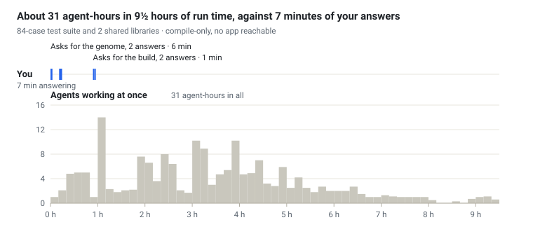
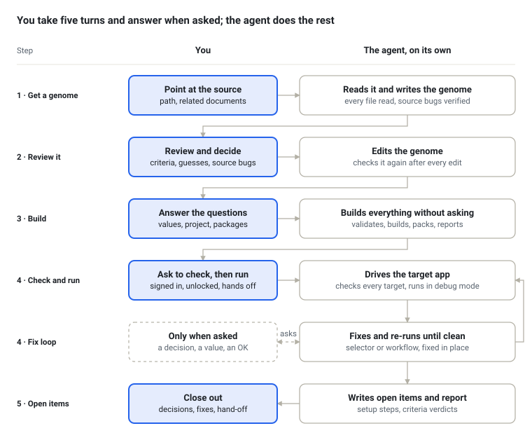

# Working with uipath-genome

uipath-genome turns a project, or an idea, into a genome: a markdown blueprint of the automation. The agent then builds the UiPath automation from it, runs it against the real applications and fixes what fails. You make a few decisions; the agent, with helper agents it starts in parallel, does the rest.

*Session logs of one run · 7–8 Oct 2026 · agents per 10 minutes of active time*

This run was compile-only: no app was reachable. The live-run loop comes from a smaller run (7 steps, three live runs), where the agent fixed every failure itself and your part was under a minute of decisions.

The chart is measured from the session logs of one run: an 84-case test suite and 2 shared libraries, rebuilt from an existing test suite. Your 7 minutes count only the time from each question to your answer. Not counted: the notes and answers files prepared before the run, the time spent reviewing the genome, and the decisions handed back after.

What that run produced:

| Output | Count |
| --- | --- |
| Genome | 9 files, 6,300 lines: 2 library genomes with 169 steps, 6 test groups with 84 cases |
| Projects | 2 shared libraries and 1 test project, all building with 0 errors, packed |
| Workflows | 351 XAML files, 79,600 lines: 222 in the libraries, which hold each app step once, and 129 in the test project, whose 84 cases call them |
| Activities | about 12,500, of which 1,329 UI actions |
| C# code | 26 files, 1,750 lines |
| UI targets | 343 Object Repository elements on 71 screens of 14 applications, carried over from the source and not yet confirmed on screen |
| Test checks | all 487 source checkpoints carried over, plus 69 added |
| Acceptance criteria | 334 assessed: 286 built but not yet run on screen, 5 met by a run that needs no app, 43 partial, 0 not met |
| Helper scripts | 72 scripts, 9,000 lines, that the agents wrote to register targets and check the build; kept in a working folder, not shipped |

## Who does what

*Who does what · the five steps below*

Blue boxes are your turns. Say "take the defaults" in the build request and the questions turn goes away.

## Before you start

- **Claude Code with the [UiPath skills](https://github.com/UiPath/skills).** Run `/uipath:install-permissions` once, so routine `uip` commands stop asking for approval.
- **For live runs:** the target apps installed and signed in on this machine, the UiPath browser extension, and the Windows session unlocked.
- **A test environment.** Live runs create real records. Everything else stays on this machine: nothing is published or deployed unless you ask.

## 1 · Get a genome

Say what you have. The agent writes the genome, checks it and asks what to change. Already have a genome? Go to step 2.

| You have | Say | The agent |
| --- | --- | --- |
| A project or solution | "Extract a genome from `<folder>`" | Reads every file and asks only for related documents (PDD, SOP). For a large project it proposes working in parts and waits for your OK |
| An idea, SOP or transcript | "Write a genome for `<idea>`" | Asks up to three rounds of questions |

You get one genome per project — a spec of its steps, business rules, acceptance criteria and the UiPath skill that builds each part — plus an overview genome when there are several. Ask for changes in plain words ("step 4 is wrong") and the agent edits the file.

## 2 · Review it

This is your main decision point. The build follows the genome, and the agent never changes it while building. Read these parts, in this order:

1. **Acceptance criteria** — the definition of done. Check that each one is testable on your data.
2. **Lines marked *[Inferred]*** — the agent's best reading where the source is silent. Confirm or correct them.
3. **Source defects** — bugs the agent found and verified in the source. By default the rebuild keeps the source's behaviour, bugs included, unless a comment or log text in the source says what was meant, or you decide otherwise. The agent lists the ones that need your decision.
4. **Configuration questions** — the values the build will ask you for, such as URLs, accounts and settings. Check the list now; you answer it in step 3.
5. **Not covered** — parts of the source that no step rebuilds. Ask now if you want them.

## 3 · Build

Say "Build `<name>-genome.md`". The agent asks its questions first, in batches of up to four, each with a recommended answer: the genome's open values, the project location, XAML or C#, where settings live and package versions. Then it builds without stopping.

You get:

- projects that build with 0 errors, packed on this machine;
- for a genome extracted from a project, the source's UI targets as Object Repository entries marked *inferred* until a check against the app confirms them, test data from the source's rows, and one credential asset per login account, never a password;
- a completion report with a verdict on every acceptance criterion: met, met in code (built but not yet run on screen), partial, not met, or not verifiable.

## 4 · Check, run and fix

**Prepare:** open the app in a test environment, sign in, and keep off the mouse and keyboard: the agent takes over the screen, so a VM or a spare machine works best. Tell it which window or URL it may use and what it must never close.

**Check the targets.** Say "Go through `<app>` and check every Object Repository element against its screens; fix what doesn't match." The agent drives the app without saving anything: it opens pages, menus and lists, types to show a popup, then cancels. It repairs each selector that doesn't match and lists the elements it could not reach. Some screens only appear with data the workflows pull from other systems, such as a record an upstream feed creates; the live run checks those.

**Run it.** Say "Run `<entry point>` live against `<app>` and fix what fails." The agent runs the automation in debug mode, so a failure pauses on the failing step with the app left as it was, and fixes it:

| Failure | Fix |
| --- | --- |
| A control is not found | Repairs the selector on the paused app and saves it in the Object Repository, so every workflow that uses it gets the fix |
| An error in the logic | Fixes the workflow and checks it again |
| The run passes but nothing changed | Checks the app's records, not just the green result |
| The genome is wrong | Notes it in the completion report, and asks you when the genome leaves a gap |

It re-runs until a run is clean; a failure it cannot fix goes into the completion report. You answer only when asked: a decision, a missing value, or an OK for another run that creates records.

## 5 · Open items

The run ends with two lists.

- **Setup for the target environment:** `<project>-open-items.md`, beside the project folder. It is a checklist for whoever deploys: folder and robots, packages, queues and assets, machine setup (apps, browser extension, network access), and triggers last. Credentials list the username only; the password is entered in Orchestrator.
- **Decisions for you:** in the completion report — criteria not yet met with the change each needs, missing source data, and corrections to the genome. Say "fix them" and the agent fixes and checks again. A genome correction is an edit to the genome, then a rebuild.
