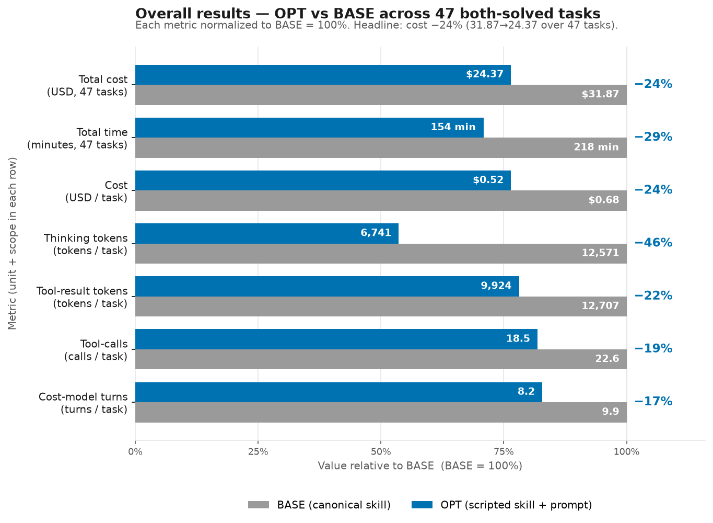

# maestro-bpmn skill optimization — cost-reduction report
Cost reduction is measured by 3 cost dimensions: (1) number of thinking tokens, (2) number of tool result tokens, and (3) number of tool calls/turns, which are targeted by 3 optimization techniques: (1) Scripted-skills, (2) thinking budget prompt, and (3) working style prompt.

- **Scripted skills**: turn deterministic procedures found in skills into scripts to reduce the number of tool calls/turns. It also reduces thinking tokens because agents don't think over encoded procedures. Depends on the skill, some scripts also reduce tool result tokens by writing tool results to a file.
- **Thinking budget prompt**: curb agent thinking softly to reduce the number of thinking tokens.
- **Working style prompt**: 7 bullet points targeting all 3 cost dimensions. 

## Script Generation of Maestro-bpmn

The skill covers five distinct work areas: authoring, validation, metadata management, operate (packaging / lifecycle), and diagnose. Below is a breakdown of each area and whether its procedures are codifiable.

**3 out of 14 areas** can be turned into scripts, and the corresponding scripts are: (1) check_metadata_drift.py, (2) generate_diagram.py, and (3) scaffold_metadata.py

Note that many areas are CLI calls which can be chained into one tool call by planning ahead given task requirements. The chaining is done through the working style prompt.

| # | Area | Codifiable? | Notes |
|---|------|-------------|-------|
| 1 | Registry discovery (pull / list / search / get, IS connections list) | No | CLI calls requiring user confirmation and intent mapping |
| 2 | Connector enrichment (`registry get --connection-id --object-name`) | No | CLI call; resource identifiers come from discovery or user |
| 3 | Template placeholder filling (`{id}`, `{name}`, `{incomingEdge}`, etc.) | No | Requires agent judgment for process structure and content |
| 4 | Structural BPMN authoring (process scaffold, sequence flows, gateways, events, boundary events, subprocesses, multi-instance markers) | No | Generative/creative; process shape comes from requirements |
| 5 | **Diagram generation (`bpmndi:BPMNDiagram`)** | **Yes — BUILD-MODEL** | Fixed sizes (tasks 100×80, events 36×36, gateways 50×50), left-to-right layout; fully deterministic given the process graph |
| 6 | **BPMN validation** | **Already scripted** | `validator/validate-bpmn.mjs` — runs all 19 PO.Frontend rules offline; this is an existing skill script, excluded per instructions |
| 7 | Expression authoring (`=vars.X`, `=bindings.X`, `=js:`, scoping rules) | No | Rules are explicit but application is part of authoring; a post-hoc syntax checker is a VALIDATE, but minor value |
| 8 | **Package metadata scaffolding** (`project.uiproj`, `operate.json`, `entry-points.json`, `bindings_v2.json`, `package-descriptor.json`) | **Yes — FORMAT-CONVERT / BUILD-MODEL** | `local-metadata-regeneration-guide.md` gives exact JSON shapes and derivation rules from BPMN root elements |
| 9 | **Package metadata drift check** | **Yes — VALIDATE** | `local-metadata-regeneration-guide.md` §Drift Handling gives explicit rules: `entry-points.json` ids must match root `uipath:entryPointId`s; `bindings_v2.json` version must be `"2.0"`; `operate.json` must point at the correct BPMN file |
| 10 | Packaging (`uip maestro bpmn pack`) | No | CLI call |
| 11 | Upload / publish / deploy | No | CLI calls; require explicit user consent |
| 12 | Run / debug / manage instances | No | CLI calls; require explicit user consent and post-run judgment |
| 13 | Diagnose priority ladder (incidents → variables → deployed asset → element executions → package files → traces) | No | CLI reads requiring interpretation and analysis at each step |
| 14 | Agent wrapper selection (processType → extension type) | No | A 4-row lookup table; too small to warrant a standalone script |


## Summary
### Overall Results


*OPT vs BASE across the 47 both-solved tasks, each metric normalized to BASE = 100%. Thinking tokens fall most (−46%); the headline is cost −24% ($31.87 → $24.37).*

**Where the $7.51 saving comes from**
| bucket | Δ tokens (sum) | share | cost-model term |
|---|---|---|---|
| **thinking** | −274,006 | **55%** | g·thk |
| **cache-read** | −8,243,216 | **33%** | r·(TR+G)·(T−t) |
| **non-thinking output** (output token - thinking) | −33,699 | 7% | g·(cl+tc) |
| cache-create + uncached input | −115,363 | 6% | w·TR |

### How Are results Collected
All 3 cost dimensions are collected and computed using data from task.json.

**Thinking tokens** → sum `output_tokens` of every *thinking-only* assistant message under `iterations[].messages[]` (a message whose `content_blocks` block-types are exactly `["thinking"]`):
  ```json
  { "role": "assistant", "content_blocks": [{"block_type": "thinking"}], "output_tokens": 9218 }
  ```
  → this message contributes 9218 thinking tokens.

**Tool-result tokens** → sum `result_tokens` of every entry in `iterations[].commands[]`:
  ```json
  { "tool_name": "Read", "parameters": {"file_path": ".../structural-bpmn.md"}, "result_tokens": 7125 }
  ```
  → 7125 tokens of tool result entered context on that call.

**Tool calls** → the count of `iterations[].commands[]` entries. Each entry is one call, e.g.:
  ```json
  { "tool_name": "Write", "parameters": {"file_path": ".../BusinessRuleDecision.bpmn"}, "result_tokens": 54 }
  ```
  Script invocations are `commands[]` where `tool_name=="Bash"` and `parameters.command` matches `python3 .../scaffold_metadata.py` (a `Read`/`grep` of the script source does not count).

**Cache-read & cache-create (and the other billed buckets)** → all four are direct integer fields inside the same `total_token_usage` object; no computation, just dictionary reads per `task.json`:
  - **cache-read** → `total_token_usage.cache_read_input_tokens` (context re-read from cache on a later turn; the `r` term)
  - **cache-create** → `total_token_usage.cache_creation_input_tokens` (tokens written into cache once; the `w` term)
  - **output** → `total_token_usage.output_tokens` (all generated tokens; the `g` term — thinking is the subset above)
  - **uncached input** → `total_token_usage.uncached_input_tokens`


## Case Analysis

**business-rule-task** (-45%, SCRIPT scaffold)
- Task: Author a Maestro BPMN process that uses a dedicated business rule task, proving the Orchestrator.BusinessRules row is covered by an eval and not only by static fixtures.
- Before (BASE): Reads 3 refs, reasons out all package metadata in a 9.2k burst, fishes for examples, then **hand-writes the bpmn + all 5 metadata files one Write at a time** (6 Writes).
- After (OPT): Reads 1 ref, inspects the registry template directly (grep/head/sed), writes just the bpmn, then runs `scaffold_metadata.py` to generate the 5 metadata files and `check_metadata_drift.py` to verify.
- **Why cheaper:** BASE spent a 9.2k-token burst deriving the 5 metadata files and then wrote each as its own output-token-heavy Write. OPT calls `scaffold_metadata.py`, which generates all five from the bpmn — so the derivation burst (billed 5×) simply doesn't happen, and the guide read is skipped. The saving is the killed burst (thinking −$0.10) + lighter context, not the collapsed Writes (worth pennies).

**script-jint-guidance** (-6%, SCRIPT+WS2)
- Task: Script task eval: agent authors a BPMN script task that follows the Jint runtime boundary instead of Node.js, browser, filesystem, or network APIs.
- Before (BASE): Runs 4 registry gets and hand-authors project.json after them.
- After (OPT): Runs scaffold+drift to emit project.json; fewer gets, 9→6 turns.
- **Why cheaper:** BASE ran 4 registry gets then hand-authored project.json; OPT lets scaffold+drift emit it. Fewer gets (−1.8k tool-results) and 9→6 turns; thinking rose so the net is modest.

**author-validate** (-37%, WS2/7)
- Task: Skill-guided evaluation: agent uses the uipath-maestro-bpmn skill to author a small registry-driven Maestro BPMN process (start -> exclusive gateway with two conditioned branches -> end), with a BPMN diagram, then validates it with a local well-formed-XML / structural check. Authoring only — no cloud effects.
- Before (BASE): Wraps authoring in a 9-call to-do list and hand-authors the full diagram inside the Write.
- After (OPT): Skips the to-dos, writes a semantics-only bpmn, and lets `generate_diagram.py` add the diagram.
- **Why cheaper:** BASE wrapped the run in a 9-call to-do list (each a turn that re-charges context) and hand-authored the diagram inside its Write. OPT drops the to-dos and lets `generate_diagram.py` add the diagram, shrinking the Write. Saving is the −8 turns (r term) + the smaller hand-written output.

**script-jint-lifecycle** (-34%, SCRIPT scaffold)
- Task: Author a complete Maestro BPMN script-task project, covering the full local lifecycle for the Jint-backed script path with package metadata.
- Before (BASE): Reasons out the lifecycle in an 8.2k burst, tracks with to-dos, and hand-writes bpmn + 5 metadata files.
- After (OPT): Reasons briefly, writes the bpmn, and runs `scaffold_metadata.py`+drift.
- **Why cheaper:** BASE derived the lifecycle metadata in an 8.2k burst then hand-wrote 5 files. OPT calls `scaffold_metadata.py`, removing that burst (5×) and the 5 Writes.

## Reference
### Per Task Table
**Script usage & benefit:** **24 of 47** tasks invoked a bundled script (scaffold_metadata / check_metadata_drift / generate_diagram). Of those, **19 got cheaper**, 1 was flat (agent-job), and **4 got *more* expensive** — gateway, subprocess, switch, rpa-job. The script was the **dominant** cost reduction driver in **7** tasks (the scaffold-metadata tasks: business-rule, calculator, hitl-rpa-wrappers, script-jint-lifecycle, script-jint-guidance, e2e-invoice, e2e-wiki). 

| # | task | Δcost | Δthinking tok ($) | Δtool-result tok | Δtool-calls | Δtime | scripts sc/dr/gd | attribution (ranked) |
|---|---|---|---|---|---|---|---|---|
| 1 | registry-discovery | $0.555→$0.145 (-74%) | +108 ($+0.002) | -6,920 | -25 | 152→82s (-46%) | 0/0/0 | WS6 (redirect `>file`) > WS7+WS2 (kill ~14 todo turns); thinking flat |
| 2 | hitl-multi-outcome-routing | $1.393→$0.502 (-64%) | -37,694 ($-0.565) | -3,006 | -21 | 749→198s (-73%) | 0/0/1 | RB1/RB2 (−38k thinking) > WS2+WS7 (no todos/fishing); generate_diagram minor |
| 3 | edit-group-to-subflow | $0.987→$0.448 (-55%) | -23,383 ($-0.351) | -6,614 | -8 | 539→194s (-64%) | 0/0/0 | RB1/RB2 (−23k thinking) > WS3/WS4 (no Glob/fixtures) > WS2/WS7 |
| 4 | timer-start | $0.824→$0.392 (-52%) | -10,567 ($-0.159) | +121 | -16 | 325→146s (-55%) | 0/0/0 | RB1/RB2 (−10.5k thinking) > WS7+WS2 (−16 todo turns); tool-results flat |
| 5 | hitl-schema-design | $1.014→$0.526 (-48%) | -20,928 ($-0.314) | -5,854 | -5 | 492→211s (-57%) | 0/0/1 | RB1/RB2 (28k→7k) > generate_diagram (DI layout) > WS3 (skip registry-md) |
| 6 | business-rule-task | $0.882→$0.482 (-45%) | -6,503 ($-0.098) | -8,541 | -13 | 287→178s (-38%) | 1/1/0 | SCRIPTS scaffold (obviates metadata-derivation burst + 5 Writes) >> WS3/WS7 > RB |
| 7 | hitl-result-downstream | $1.006→$0.572 (-43%) | -11,860 ($-0.178) | -1,305 | -16 | 458→261s (-43%) | 0/0/0 | RB1/RB2 > WS3+WS4 (collapse 8 registry re-reads) > WS2 |
| 8 | feet-inches | $1.108→$0.634 (-43%) | -21,214 ($-0.318) | -11,068 | -4 | 498→181s (-64%) | 2/1/0 | RB1/RB2 + WS4 (no fixture-fishing) co-primary; scaffold enabler (BASE wrote no metadata) |
| 9 | calculator | $1.090→$0.627 (-43%) | -16,586 ($-0.249) | -7,021 | -13 | 439→222s (-49%) | 1/1/0 | SCRIPTS scaffold (obviates 16.4k derivation burst) >> RB > WS (todos/registry-md) |
| 10 | author-validate | $0.515→$0.325 (-37%) | -2,468 ($-0.037) | -2,517 | -10 | 158→101s (-36%) | 0/0/1 | WS2/WS7 (−8 todo turns) > WS4 (skip registry-md) ≈ RB; generate_diagram small real win |
| 11 | hitl-rpa-wrappers | $0.780→$0.499 (-36%) | -8,854 ($-0.133) | -10,097 | -10 | 277→150s (-46%) | 1/1/0 | SCRIPTS scaffold primary; WS4 (no fishing)+WS3 (skip registry-md) strong; RB minor |
| 12 | loop-multiply | $0.729→$0.471 (-35%) | -6,876 ($-0.103) | -3,392 | -10 | 310→183s (-41%) | 0/0/2 | RB1/RB2 (~half) > WS2 (−15 turns) + WS4/WS7 (fixture hunt); generate_diagram no credit |
| 13 | script-jint-lifecycle | $0.795→$0.526 (-34%) | -5,912 ($-0.089) | -6,379 | -6 | 266→176s (-34%) | 1/1/0 | SCRIPTS scaffold (obviates 8.2k burst + 5 Writes) primary; RB secondary |
| 14 | e2e-wiki-pageviews | $1.220→$0.826 (-32%) | -32,009 ($-0.480) | -2,515 | -1 | 657→313s (-52%) | 1/1/0 | RB (−32k thinking) + SCRIPTS scaffold co-dominant; WS minor |
| 15 | edit-remove-node | $0.446→$0.309 (-31%) | +576 ($+0.009) | -899 | -10 | 102→81s (-21%) | 0/0/0 | WS7+WS2 (no todos, planned edits) + fewer turns (15→9); thinking ROSE (RB trade) |
| 16 | hitl-completed-wired | $0.604→$0.427 (-29%) | -4,886 ($-0.073) | +104 | +0 | 227→146s (-36%) | 0/0/0 | RB1/RB2 ≈100% (identical trajectory, only planning burst 9k→4k); nothing else moved |
| 17 | simple-approval-bpmn | $1.258→$0.890 (-29%) | -20,723 ($-0.311) | -449 | -2 | 743→445s (-40%) | 1/1/0 | RB1/RB2 = whole win (g-share 100%, tool-results flat); WS3 inspect-once secondary; scaffold negligible |
| 18 | dice-roller | $0.582→$0.419 (-28%) | -4,368 ($-0.066) | -6,392 | -3 | 191→121s (-37%) | 1/1/1 | WS3/WS6 (skip registry-md + find-dump) primary; RB (already low) secondary; scripts minor |
| 19 | multi-city-weather | $0.860→$0.630 (-27%) | -3,356 ($-0.050) | -7,080 | -6 | 421→362s (-14%) | 0/0/2 | WS4/WS2 (no rework/fewer turns) ≈ WS7 (skip 2816 doc + 2.7k find-dump) > RB2; generate_diagram no credit |
| 20 | edit-add-node | $0.446→$0.329 (-26%) | +2,257 ($+0.034) | -6,299 | +0 | 102→121s (+18%) | 0/0/0 | WS3/WS7 (skip 7125-tok structural read) = all of it; thinking ROSE (noise, paid for by lighter context) |
| 21 | reading-list | $0.822→$0.617 (-25%) | -8,866 ($-0.133) | -406 | -6 | 400→312s (-22%) | 0/0/0 | RB1/RB2 (modest, capped by retained 7.2k burst) > WS5 (write-once) > WS7/WS4 |
| 22 | hitl-boolean-decision | $1.414→$1.090 (-23%) | -21,361 ($-0.320) | -4,975 | +2 | 764→519s (-32%) | 0/0/0 | RB1/RB2 (4 bursts→2) > WS3+WS6+WS4 (dump→grep, drop fixtures) + fewer turns |
| 23 | parallel-fork-join | $0.477→$0.382 (-20%) | -2,817 ($-0.042) | +201 | -6 | 134→106s (-21%) | 0/0/0 | RB1/RB2 ≈ WS2/WS7 (−6 todo turns); identical reads |
| 24 | transform-map | $0.490→$0.404 (-18%) | -1,640 ($-0.025) | -1,146 | -2 | 206→148s (-28%) | 0/0/1 | WS7/WS5 (drop 3 inline-python probes) > RB2 > WS3 (lighter ref); generate_diagram trivial |
| 25 | transform-filter | $0.408→$0.338 (-17%) | +377 ($+0.006) | -1,946 | -1 | 131→135s (+3%) | 0/0/0 | WS3 (registry-md→expression swap) + WS2 (−2 turns); thinking ROSE (noise) |
| 26 | e2e-invoice-exception-triage | $0.991→$0.841 (-15%) | -2,088 ($-0.031) | -5,946 | +1 | 238→207s (-13%) | 1/1/0 | SCRIPTS scaffold+drift (replace 6-file hand-authoring + validation loop) dominant > WS4/WS5 |
| 27 | hitl-brownfield-insert | $0.495→$0.426 (-14%) | +179 ($+0.003) | -438 | -5 | 140→135s (-4%) | 0/0/0 | WS3+WS4 (collapse 5 registry-spelunk calls to 1) dominant; no scripts; thinking flat |
| 28 | terminate | $0.359→$0.319 (-11%) | +1,008 ($+0.015) | +58 | -1 | 161→104s (-35%) | 0/0/0 | WS2 (plan-up-front, 7→4 turns) dominant; RB2 explains thinking rise |
| 29 | operate-diagnose-minimal-fault-triage | $0.261→$0.233 (-11%) | +962 ($+0.014) | -94 | -7 | 76→76s (+0%) | 0/0/0 | WS7+WS4 (prune ~7 redundant probes, 17→10 calls) dominant; thinking rose |
| 30 | message-catch | $0.812→$0.726 (-11%) | -3,785 ($-0.057) | +1,047 | -3 | 241→196s (-18%) | 0/0/0 | RB1 (fetch template, don't re-derive; −3.8k thinking) dominant; WS4 secondary; no scripts |
| 31 | http-weather | $0.606→$0.544 (-10%) | +400 ($+0.006) | -33 | -8 | 196→201s (+3%) | 0/0/1 | WS2+WS7 (drop registry-discovery + todo churn, 30→22 calls) dominant; generate_diagram minor; thinking flat |
| 32 | api-workflow-task | $1.102→$0.995 (-10%) | +6,308 ($+0.095) | -13,692 | -21 | 384→455s (+19%) | 1/1/1 | WS3+RB2 (inspect-once replaced disk-crawl; tr 28k→14k) dominant; scripts secondary; thinking UP (paid back via turns) |
| 33 | script-jint-guidance | $0.485→$0.456 (-6%) | +1,285 ($+0.019) | -1,809 | -2 | 143→144s (+1%) | 1/1/0 | SCRIPTS scaffold+drift + WS2 co-dominant (fewer registry gets, 9→6 turns); RB explains thinking rise |
| 34 | e2e-customer-escalation | $0.817→$0.777 (-5%) | +1,024 ($+0.015) | -3,036 | -7 | 289→344s (+19%) | 1/1/1 | SCRIPTS scaffold moderate + WS6 (structured output vs find-dump); thinking a NEGATIVE contributor; net small |
| 35 | integration-service-boundary | $0.977→$0.965 (-1%) | -8,541 ($-0.128) | -1,549 | +4 | 465→346s (-26%) | 0/0/0 | RB2 halved thinking but NEUTRALIZED by WS4/WS6 slip (edit/validate/re-read tail); ≈noise; scaffold correctly NOT run (draft-boundary rule) |
| 36 | transform-group-by | $0.414→$0.410 (-1%) | -1,325 ($-0.020) | -2,763 | +0 | 172→163s (-5%) | 0/0/0 | ≈noise (−1%): WS3+RB present but cancelled — turns flat + re-added inline-python |
| 37 | agent-job | $0.768→$0.761 (-1%) | -9,294 ($-0.139) | -1,787 | +3 | 382→295s (-23%) | 0/0/1 | RB1/RB2 halved thinking but NO turn/big-read cut → $ ≈noise; generate_diagram negligible |
| 38 | edit-add-output | $0.273→$0.299 (+10%) | -55 ($-0.001) | -247 | +2 | 56→58s (+3%) | 0/0/0 | ≈noise (n=1, npm/validator variance); OPT actually dropped a re-read |
| 39 | smoke-registry-discovery | $0.158→$0.177 (+13%) | +258 ($+0.004) | -3,708 | +2 | 46→54s (+18%) | 0/0/0 | ≈noise (+2¢); partial WS6 win on tool-results (−3.7k) offset by +thinking/python probes |
| 40 | rpa-job | $0.379→$0.438 (+16%) | -3,223 ($-0.048) | -183 | +4 | 148→135s (-9%) | 0/0/1 | ≈noise + minor SCRIPT OVERHEAD (diagram pip-install on a task not needing it); thinking DOWN |
| 41 | event-trigger-start | $0.426→$0.517 (+22%) | -579 ($-0.009) | +105 | +3 | 179→237s (+32%) | 0/0/0 | ≈noise + one re-author cycle (write→get→rewrite); thinking down; small delta |
| 42 | switch | $0.248→$0.318 (+28%) | -2,721 ($-0.041) | +848 | +5 | 94→107s (+14%) | 0/0/1 | ≈noise (validator dance) + SCRIPT OVERHEAD (pip-install for diagram, tiny task); thinking DOWN 3× |
| 43 | timer | $0.194→$0.261 (+34%) | -1,560 ($-0.023) | +755 | +6 | 74→76s (+2%) | 0/0/0 | env NOISE (validator npm-dance BASE avoided); thinking DOWN; not the optimization |
| 44 | subprocess | $0.413→$0.557 (+35%) | +676 ($+0.010) | +2,717 | +5 | 182→192s (+5%) | 0/0/1 | mild BACKFIRE — WS3 violated (2 refs) + diagram script + verify re-read loop on a task that didn't need them |
| 45 | gateway-sequence-flows | $0.651→$0.978 (+50%) | +16,828 ($+0.252) | +1,398 | +8 | 255→507s (+99%) | 1/1/1 | BACKFIRE (real): WS1 'read scripts first' re-triggered a 4× re-planning spiral (+17k thinking); RB1/WS4 in reverse |
| 46 | edit-move-node | $0.203→$0.326 (+61%) | -330 ($-0.005) | +1,510 | +4 | 59→84s (+42%) | 0/0/0 | ≈noise + minor WS3/WS4 slip (re-read file already held; 3 edits vs 1 write) |
| 47 | edit-update-node | $0.139→$0.230 (+65%) | +120 ($+0.002) | +443 | +2 | 48→44s (-8%) | 0/0/0 | ≈noise (n=1, validator-copy dance); ~2 cents; thinking flat |

### Per Task Behavior

**registry-discovery** (-74%, WS6 redirect)
- Task: Registry discovery eval: agent uses the Maestro BPMN registry surface to discover documented agent, queue, and connector wrapper types and to save public-safe CLI evidence for the skill's supported-element map without inventing private resource metadata. Requires the `uip` CLI on PATH.
- Before (BASE): Loads skill, reads 2 refs, sets up a TaskCreate/Update to-do list, runs each registry pull/list/search/get and **pipes the JSON into context, then re-writes each result to an evidence file with a Write** (7 Writes).
- After (OPT): Loads skill, reads 1 ref, runs the same registry commands but **redirects each straight to a file (`>file`)** so the JSON never enters context, then lists the dir. No to-dos, no Writes.
- **Why cheaper:** BASE piped ~5.8k tokens of registry JSON into context and then spent 7 Write calls re-emitting it, plus a 12-call to-do list — and every one of those tokens/turns is re-charged on each later turn (the r·(T−t) term). OPT's `>file` redirects keep that JSON on disk (each result ~1 tok) and drop the to-dos, cutting tool-calls 32→7. Net −$0.41, almost all from the vanished tool-results and turns; thinking barely moved.

**hitl-multi-outcome-routing** (-64%, RB1/RB2)
- Task: Smoke test (ported from flow hitl/smoke_03): agent routes an Actions.HITL user task's outcome through an exclusive gateway into three distinct paths (approve / reject / escalate), with conditioned branches plus a default and a BPMN diagram.
- Before (BASE): Reasons out the whole multi-branch routing structure across 6 big thinking bursts (44.6k), fishes the filesystem for fixtures, tracks progress with ~11 to-do calls, then writes the bpmn + project file.
- After (OPT): Reasons once (6.1k), pulls the registry templates it needs, writes the bpmn, and calls `generate_diagram.py` for the diagram. No fishing, no to-dos.
- **Why cheaper:** BASE re-derived the routing structure in 6 thinking bursts (44.6k tokens) — thinking is billed at 5×, so that's the bulk of the bill. OPT reasons once (6.1k), so −37.7k thinking ≈ −$0.57 of the $0.89 saved; dropping the to-dos and fishing removes the rest.

**edit-group-to-subflow** (-55%, RB1/RB2)
- Task: Brownfield edit: extract a contiguous group of tasks from a valid Maestro BPMN into an embedded subprocess (with its own start/end and a diagram shape), keeping the remaining tail node in the main flow and behavior intact.
- Before (BASE): Re-derives the subflow structure over 5 thinking bursts and Globs/reads 3 example fixtures to copy the shape before editing the file.
- After (OPT): Reasons once (5.8k) from the reference and edits the file directly — no fixture hunting.
- **Why cheaper:** BASE reasoned the subflow out 5 times (29.4k) and read 3 example fixtures it then carried in context. OPT reasons once (5.8k) from the reference. −23k thinking (5×) is the main saving; the un-read fixtures cut re-charged context on top.

**timer-start** (-52%, RB+WS7)
- Task: Timer start-event eval: agent uses the uipath-maestro-bpmn skill to author a scheduled (timer) start event that fires on a recurring hourly cycle, using the registry Intsvc.TimerTrigger wrapper on a bpmn:startEvent with a bpmn:timerEventDefinition. Ports the Flow scheduled-trigger smoke test to a BPMN timer start event. Authoring only — a timer only fires in a live engine, so this validates the structure locally.
- Before (BASE): Wraps the work in an 18-call to-do checklist, does registry discovery in two rounds, reasons in 3 bursts, then writes the bpmn.
- After (OPT): Reasons once, chains the registry calls with redirects, writes the bpmn. No to-do ceremony.
- **Why cheaper:** Tool-results and turn count are flat here, so the win is pure generation: BASE spent 15k thinking across 3 bursts plus 16 to-do calls (each generating text); OPT reasons once with no to-dos. −10.6k thinking ≈ −$0.16 at the 5× rate.

**hitl-schema-design** (-48%, RB1/RB2)
- Task: Quality test (ported from flow hitl/quality_01): agent designs the HITL task data mapping well — context inputs presenting read-only data to the reviewer and typed output mappings capturing the reviewer's returned fields, each bound to a declared process variable (no dangling bindings).
- Before (BASE): Designs the HITL schema by hand across two ~15k/10k bursts and hand-authors the full diagram inside the Write.
- After (OPT): Reasons in two smaller bursts and delegates the diagram to `generate_diagram.py`.
- **Why cheaper:** BASE hand-reasoned the schema (28.3k, two big bursts) and hand-authored the diagram inside its Write. OPT reasons in ~7.4k and delegates the diagram to `generate_diagram.py`, so the DI layout is never derived in tokens. −20.9k thinking drives the −$0.31.

**business-rule-task** (-45%, SCRIPT scaffold)
- Task: Author a Maestro BPMN process that uses a dedicated business rule task, proving the Orchestrator.BusinessRules row is covered by an eval and not only by static fixtures.
- Before (BASE): Reads 3 refs, reasons out all package metadata in a 9.2k burst, fishes for examples, then **hand-writes the bpmn + all 5 metadata files one Write at a time** (6 Writes).
- After (OPT): Reads 1 ref, inspects the registry template directly (grep/head/sed), writes just the bpmn, then runs `scaffold_metadata.py` to generate the 5 metadata files and `check_metadata_drift.py` to verify.
- **Why cheaper:** BASE spent a 9.2k-token burst deriving the 5 metadata files and then wrote each as its own output-token-heavy Write. OPT calls `scaffold_metadata.py`, which generates all five from the bpmn — so the derivation burst (billed 5×) simply doesn't happen, and the guide read is skipped. The saving is the killed burst (thinking −$0.10) + lighter context, not the collapsed Writes (worth pennies).

**hitl-result-downstream** (-43%, RB+WS3/4)
- Task: Quality test (ported from flow hitl/quality_02): agent makes the human's decision actually drive downstream flow — an exclusive gateway condition references the HITL activity's output variable via a vars.<id> expression, and that variable is declared.
- Before (BASE): Explores the registry with 8 inline-python heredocs (re-opening registry.json field-by-field) plus 2 big bursts, then writes bpmn + project file.
- After (OPT): Inspects the registry once via 3 CLI gets, reasons in one 9.1k burst, writes the bpmn.
- **Why cheaper:** BASE re-opened the registry JSON field-by-field with 8 inline-python heredocs — each result re-charged every later turn — plus 2 big bursts. OPT inspects once via 3 gets and reasons once. −11.9k thinking + the collapsed re-reads.

**feet-inches** (-43%, RB+WS4)
- Task: Skill-guided evaluation (ported from the Flow feet_inches eval): agent uses the uipath-maestro-bpmn skill to author a BPMN process as a sequential pipeline of script tasks that pass a value through parse, convert, and format steps. Exercises a linear script-task chain with variable passing between nodes. Authoring only — no cloud effects.
- Before (BASE): Reasons across 4 bursts and fishes validator fixtures to copy a uiproj template, then writes bpmn + uiproj by hand.
- After (OPT): Reasons briefly, then runs `scaffold_metadata.py` to produce the metadata mechanically — no fixture hunting, no derivation.
- **Why cheaper:** BASE reasoned across 4 bursts (23k) and read 4+ validator fixtures to copy a template. OPT reasons briefly and lets `scaffold_metadata.py` produce the metadata mechanically — so both the derivation thinking and the fixture reads (re-charged every turn) disappear. −21k thinking + −11k tool-results.

**calculator** (-43%, SCRIPT scaffold)
- Task: Skill-guided evaluation (ported from the Flow calculator eval): agent uses the uipath-maestro-bpmn skill to author a BPMN process that routes on an operator variable through a multi-way exclusive gateway to one script task per arithmetic operation. Exercises multi-branch exclusive-gateway routing, script tasks, and BPMN DI. Authoring only — no cloud effects.
- Before (BASE): Works the whole calculator model out in a single 16.4k burst, then hand-writes the bpmn + 5 metadata files.
- After (OPT): Reasons in small bursts, writes the bpmn, and runs `scaffold_metadata.py`+`check_metadata_drift.py` for the metadata.
- **Why cheaper:** BASE worked the whole model out in one 16.4k burst, then hand-wrote 5 metadata files. OPT calls `scaffold_metadata.py`, so that 16.4k derivation (billed 5×) never happens. That single avoided burst is most of the −$0.46.

**author-validate** (-37%, WS2/7)
- Task: Skill-guided evaluation: agent uses the uipath-maestro-bpmn skill to author a small registry-driven Maestro BPMN process (start -> exclusive gateway with two conditioned branches -> end), with a BPMN diagram, then validates it with a local well-formed-XML / structural check. Authoring only — no cloud effects.
- Before (BASE): Wraps authoring in a 9-call to-do list and hand-authors the full diagram inside the Write.
- After (OPT): Skips the to-dos, writes a semantics-only bpmn, and lets `generate_diagram.py` add the diagram.
- **Why cheaper:** BASE wrapped the run in a 9-call to-do list (each a turn that re-charges context) and hand-authored the diagram inside its Write. OPT drops the to-dos and lets `generate_diagram.py` add the diagram, shrinking the Write. Saving is the −8 turns (r term) + the smaller hand-written output.

**hitl-rpa-wrappers** (-36%, SCRIPT scaffold)
- Task: Node wrapper eval: agent models HITL and RPA as BPMN-native wrappers using documented non-Integration-Service UiPath activity shells.
- Before (BASE): Reasons in 3 bursts, fishes fixtures, and hand-writes the bpmn + 5 metadata files.
- After (OPT): Reasons once, writes the bpmn, and runs `scaffold_metadata.py`+drift for the metadata.
- **Why cheaper:** BASE reasoned in 3 bursts, fished fixtures, and hand-wrote 5 metadata files. OPT reasons once and runs `scaffold_metadata.py`. The metadata-derivation thinking and the fished fixtures (−10.1k tool-results) both go away.

**loop-multiply** (-35%, RB+WS2)
- Task: Skill-guided evaluation (ported from the Flow loop_multiply eval): agent uses the uipath-maestro-bpmn skill to author a BPMN process that multiplies a collection of numbers using a sequential multi-instance marker over a script task. Exercises the multi-instance / loop-characteristics registry gap (sequential accumulation). Authoring only — no cloud effects.
- Before (BASE): Reasons in 2 bursts and spends ~5 turns hunting validator fixtures before writing bpmn + uiproj.
- After (OPT): Reasons once, writes the bpmn, and calls `generate_diagram.py`; no fixture hunt (43→28 turns).
- **Why cheaper:** BASE spent ~5 turns hunting validator fixtures, and 43 turns total each re-reading the shared 7.1k-tok reference (the r term compounds over turns). OPT cuts to 28 turns and skips the hunt, so that fixed reference is re-charged far fewer times; −6.9k thinking on top.

**script-jint-lifecycle** (-34%, SCRIPT scaffold)
- Task: Author a complete Maestro BPMN script-task project, covering the full local lifecycle for the Jint-backed script path with package metadata.
- Before (BASE): Reasons out the lifecycle in an 8.2k burst, tracks with to-dos, and hand-writes bpmn + 5 metadata files.
- After (OPT): Reasons briefly, writes the bpmn, and runs `scaffold_metadata.py`+drift.
- **Why cheaper:** BASE derived the lifecycle metadata in an 8.2k burst then hand-wrote 5 files. OPT calls `scaffold_metadata.py`, removing that burst (5×) and the 5 Writes.

**e2e-wiki-pageviews** (-32%, RB+SCRIPT)
- Task: Skill-guided e2e evaluation (ported from the Flow wiki_pageviews eval): agent uses the uipath-maestro-bpmn skill to author a synthetic BPMN process that fetches daily pageviews in a script task, routes an invalid-article failure through an exclusive gateway to an "Article not found" end, and on the success path keeps high-traffic days (filter) then totals them (aggregate) in two distinct script tasks. Includes full package metadata. Authoring only, public-safe, no cloud effects and no live HTTP connector — the fetch is a local script task.
- Before (BASE): Plans in a 20.9k burst and derives metadata in another 20.2k burst, then hand-writes bpmn + 5 metadata files.
- After (OPT): Reasons once (7.2k), writes the bpmn, and runs `scaffold_metadata.py`+drift for the metadata.
- **Why cheaper:** BASE spent two ~20k bursts — one planning, one deriving metadata — then hand-wrote 5 files. OPT trims the plan (RB) to one 7.2k burst and delegates metadata to `scaffold_metadata.py`. −32k thinking is the whole story.

**edit-remove-node** (-31%, WS7/2)
- Task: Brownfield edit: delete a middle task from an existing, valid Maestro BPMN and heal the sequence flow (source connects directly to the former successor), removing orphaned diagram interchange and preserving untouched content.
- Before (BASE): Opens a to-do list and loops edit→re-read→edit, re-reading the same bpmn 3 times.
- After (OPT): Plans the edit path up front and edits with fewer re-reads; no to-dos (15→9 turns).
- **Why cheaper:** Thinking barely changed; the win is turns. BASE looped edit→re-read→edit (re-reading the same bpmn 3×) inside a to-do list — 15 turns, each re-charging the resident file. OPT plans the edits and finishes in 9 turns, so the file is re-read far fewer times (r term).

**hitl-completed-wired** (-29%, RB (isolated))
- Task: Smoke test (ported from flow hitl/smoke_02): agent places an Actions.HITL user task and wires its completion outcome to a downstream step that reaches an end event — the BPMN equivalent of wiring the flow HITL "completed" port to the next node.
- Before (BASE): Reasons in one 9.0k planning burst, then writes the bpmn and validates. (Trajectory otherwise identical to OPT.)
- After (OPT): Reasons in one **4.0k** planning burst, then writes the bpmn and validates — the only difference from BASE.
- **Why cheaper:** The two runs are otherwise identical — same reads, gets, Write, validator sequence, 17 calls, 6 turns. The ONLY change is the planning burst shrank 9.0k→4.0k. So −4,886 thinking × the 5× rate ≈ the entire −$0.18. This is the cleanest proof the thinking-budget prompt alone reduces cost.

**simple-approval-bpmn** (-29%, RB1/RB2)
- Task: Authoring eval: agent composes a model-authored simple approval BPMN that combines StartAgentJob, an exclusive gateway, CreateQueueItem, a script task, declared root variables, numeric migration metadata, and BPMN DI. Mirrors the manual smoke "simple approval" scenario.
- Before (BASE): Over-reasons the agent-job/queue-item wrappers across 4 bursts (42k) between two Writes.
- After (OPT): Reasons the one hard judgment in ~21k (RB2), inspects templates with one inline-python dump, writes once, runs scaffold+drift.
- **Why cheaper:** Hardest task; tool-results are flat, so 100% of the saving is generation. BASE over-reasoned the agent-job/queue-item wrappers across 4 bursts (42k); OPT does the one hard judgment in 21k (RB2 halves it, can't remove it). −20.7k thinking ≈ −$0.31.

**dice-roller** (-28%, WS3/6)
- Task: Skill-guided evaluation (ported from the Flow dice_roller eval): agent uses the uipath-maestro-bpmn skill to author a BPMN process with a script task that produces a random die value and an exclusive gateway that classifies the result. Exercises script-task randomness and gateway-on-result routing. Authoring only — no cloud effects.
- Before (BASE): Reads registry-md and dumps the project tree with `find`, then writes bpmn + uiproj.
- After (OPT): Skips both, inspects lightly, writes the bpmn, and runs the scripts for metadata/diagram.
- **Why cheaper:** BASE read the 2.8k registry-md doc and dumped the project tree with `find` — both re-charged each later turn. OPT skips them. −6.4k tool-results is the win; thinking was already low.

**multi-city-weather** (-27%, WS4/2)
- Task: Skill-guided evaluation (ported from the Flow multi_city_weather eval): agent uses the uipath-maestro-bpmn skill to author a BPMN process that classifies a list of cities using a PARALLEL multi-instance marker over a per-item script task. Exercises the multi-instance / loop-characteristics registry gap (parallel fan-out with a collection output). Authoring only — no cloud effects and no live connector (the per-item work is a script task).
- Before (BASE): Reasons in 2 bursts, **writes the bpmn twice** (writes then rewrites) and dumps the tree with `find`.
- After (OPT): Reasons once, writes the bpmn a single time, and calls `generate_diagram.py`.
- **Why cheaper:** BASE wrote the bpmn, re-thought, and wrote it AGAIN, plus a `find` tree dump. OPT writes once. Removing the rework and dump cuts −7.1k tool-results and 4 turns.

**edit-add-node** (-26%, WS3/7)
- Task: Brownfield edit: insert a new script task into an existing, valid Maestro BPMN between two adjacent tasks, rewiring the sequence flow and diagram while preserving element ids, uipath:* payloads, and uipath:migrationVersion.
- Before (BASE): Reads the target file **and** the full 7,125-tok structural authoring guide, tracks with to-dos, then edits.
- After (OPT): Recognizes it's an edit — reads only the target file, pulls 2 small CLI templates, and edits. Skips the big guide.
- **Why cheaper:** The instructive one: OPT's thinking actually ROSE (+2.3k), yet cost fell $0.12 — because BASE read the full 7,125-tok structural guide and carried it for ~24 turns (w once + r every later turn ≈ 17k re-charged tokens). OPT recognized it's an edit and never read that guide. Pure context/re-read saving.

**reading-list** (-25%, RB+WS5)
- Task: Skill-guided evaluation (ported from the Flow reading_list eval): agent uses the uipath-maestro-bpmn skill to author a BPMN process that curates a book catalog through a filter script task then a map script task. Exercises a list-processing script composition with a hardcoded collection and staged transforms. Authoring only — no cloud effects.
- Before (BASE): Reasons in 3 bursts and authors with 4 Write/Edit churn ops plus `find` fishing.
- After (OPT): Reasons less and writes the file once.
- **Why cheaper:** BASE authored with 4 Write/Edit churn ops and 3 fishing calls; OPT writes once. −8.9k thinking (capped because OPT kept one 7.2k burst) plus fewer output-heavy Writes.

**hitl-boolean-decision** (-23%, RB+WS3/6)
- Task: Quality test (ported from flow hitl/quality_03): agent models the approval decision as a genuine boolean — a boolean-typed HITL output bound to a boolean-typed variable — and the gateway condition treats it as a boolean (not compared to a quoted string literal / stringly-typed).
- Before (BASE): Reasons across 4 bursts (48.7k), reads the catalog AND runs gets, and fishes 3 fixtures.
- After (OPT): Reasons in 2 bursts, dumps templates to /tmp then greps them, uses 1 fixture.
- **Why cheaper:** BASE reasoned across 4 bursts (48.7k), read the catalog AND ran gets, and pulled 3 fixtures. OPT reasons in 2 bursts and dumps templates to /tmp then greps them (keeping bulk out of context). −21k thinking dominates.

**parallel-fork-join** (-20%, RB≈WS2/7)
- Task: Skill-guided evaluation: agent uses the uipath-maestro-bpmn skill to author a parallel gateway fork into two concurrent branches that a parallel gateway synchronizes (join) before the end — the BPMN analogue of a Flow parallel-sync merge. Authoring only — no cloud effects.
- Before (BASE): Reasons in one 5.1k burst wrapped in a 6-call to-do list.
- After (OPT): Reasons in one 2.2k burst, no to-dos (identical reads otherwise).
- **Why cheaper:** BASE reasoned in one 5.1k burst wrapped in 6 to-do calls; OPT reasons in 2.2k with none. −2.8k thinking ≈ the −6 to-do turns; identical reads otherwise.

**transform-map** (-18%, WS7/5)
- Task: Skill-guided evaluation: agent uses the uipath-maestro-bpmn skill to author a Jint-safe script task that performs a map transform (uppercasing a field over a collection) — the BPMN analogue of a Flow Transform Map node. Authoring only — no cloud effects.
- Before (BASE): Reasons once then pokes the written XML with 3 inline-python probes to self-check.
- After (OPT): Reasons once, writes, and calls `generate_diagram.py`; no manual probes.
- **Why cheaper:** BASE self-checked the written XML with 3 inline-python probes whose output entered context; OPT skips them. Removing those probe results + −1.6k thinking.

**transform-filter** (-17%, WS3+2)
- Task: Skill-guided evaluation: agent uses the uipath-maestro-bpmn skill to author a Jint-safe script task that performs a filter transform (keeping rows whose amount meets a threshold) — the BPMN analogue of a Flow Transform Filter node. Authoring only — no cloud effects.
- Before (BASE): Reads the heavy registry-md reference before authoring.
- After (OPT): Reads the lighter expression-authoring reference instead (−2 turns).
- **Why cheaper:** BASE read the heavy 2.8k registry-md; OPT read the lighter 1.2k expression doc — so ~1,648 fewer tokens are re-charged every turn (r) — plus 2 fewer turns.

**e2e-invoice-exception-triage** (-15%, SCRIPT scaffold+drift)
- Task: Skill-guided e2e evaluation: agent uses the uipath-maestro-bpmn skill to author a synthetic BPMN Process Orchestration project with a script task, gateway branch, human review task, and complete package metadata. This exercises greenfield BPMN source authoring, diagram requirements, and local package-file consistency without cloud-side effects.
- Before (BASE): Reverse-engineers the metadata schema (grep validator samples + 2 heredocs), then hand-writes 6 metadata files and re-validates.
- After (OPT): Writes the bpmn, then runs `scaffold_metadata.py`+`check_metadata_drift.py` — 2 calls for the whole metadata phase.
- **Why cheaper:** BASE reverse-engineered the metadata schema (grep samples + 2 heredocs) then hand-wrote 6 files. OPT replaces that whole phase with `scaffold_metadata.py`+`check_metadata_drift.py` (2 calls). −5.9k tool-results and 16→11 turns; the derivation work disappears.

**hitl-brownfield-insert** (-14%, WS3/4)
- Task: Quality test (ported from flow hitl/quality_04): agent inserts a HITL approval gate into an EXISTING .bpmn (shipped as a fixture) with a surgical edit — preserving every original element ID and script, removing only the one edge it splices, and adding the HITL node with a diagram shape.
- Before (BASE): Digs the HITL schema out of registry.json with 4 inline-python heredocs, then edits the brownfield file.
- After (OPT): Gets the schema with one registry get + one burst, then edits directly.
- **Why cheaper:** BASE dug the HITL schema out of registry.json with 4 inline-python heredocs (each result re-charged); OPT gets it in one call. Collapsing those to 1 cuts 10→8 turns and the re-read tax.

**terminate** (-11%, WS2)
- Task: Skill-guided evaluation: agent uses the uipath-maestro-bpmn skill to author a process where one branch ends in a terminate end event (a hard stop of the whole instance) while a parallel branch ends normally. Authoring only — no cloud effects.
- Before (BASE): Reasons once then does the work spread over 7 turns.
- After (OPT): Reasons once up front then executes linearly in 4 turns.
- **Why cheaper:** BASE spread the work over 7 turns; OPT reasons once up front then executes linearly in 4. Fewer turns means the 7.1k reference is re-charged 3 fewer times. Thinking rose slightly (RB2 concentration) but turns win.

**operate-diagnose-minimal-fault-triage** (-11%, WS7/4)
- Task: Minimal lifecycle coverage for the uipath-maestro-bpmn skill's Operate and Diagnose guidance. The agent inspects a mocked failed BPMN run, follows the diagnostic priority ladder, and recommends the safe next operate action without performing lifecycle mutations.
- Before (BASE): Brute-forces the diagnosis with 11 CLI probes before writing the report.
- After (OPT): Runs 6 probes, reasons it has enough, then writes the report.
- **Why cheaper:** BASE brute-forced the diagnosis with 11 CLI probes (each result re-charged every later turn); OPT runs 6 and reasons it has enough. −7 probe calls (17→10) cut both generation and re-read.

**message-catch** (-11%, RB1)
- Task: Intermediate catch-event eval: agent uses the uipath-maestro-bpmn skill to add a mid-flow wait step that pauses the process until a message arrives, using the registry Maestro.ReceiveMessageEvent wrapper on a bpmn:intermediateCatchEvent while preserving the process start. Ports the Flow wait-for-email test to a BPMN intermediate catch event (internal message). Authoring only — a wait only resolves in a live engine, so this validates the structure locally.
- Before (BASE): Wraps the work in a 9-call to-do list and reasons the message schema out in 3 bursts.
- After (OPT): Fetches the registry template up front to copy field shapes, reasons in one burst; no to-dos.
- **Why cheaper:** BASE reasoned the message schema out in 3 bursts inside a 9-call to-do list; OPT fetches the registry template up front to copy field shapes instead of deriving them. −3.8k thinking (5×) outweighs the one template read.

**http-weather** (-10%, WS2/7)
- Task: HTTP activity eval: agent uses the uipath-maestro-bpmn skill to model a connectionless HTTP call to a public weather API (Open-Meteo) as a bpmn:sendTask with the registry Intsvc.HttpExecution wrapper in manual mode, capturing the response into a declared variable. Ports the Flow Open-Meteo weather single-node test to a connectionless BPMN HTTP node. Authoring only — no cloud effects, no live call.
- Before (BASE): Does heavy registry discovery (tools install/pull/searches) plus a 9-call to-do list, ~30 calls.
- After (OPT): Trims the discovery and to-do churn to ~22 calls; calls `generate_diagram.py`.
- **Why cheaper:** Thinking and tool-results are ~flat; the saving is entirely turns — BASE did heavy registry discovery + a 9-call to-do list (~30 calls), OPT trims to ~22. Fewer turns = smaller re-read multiplier on the fixed references.

**api-workflow-task** (-10%, WS3+RB2)
- Task: Author a Maestro BPMN API workflow invocation, covering the Orchestrator.ExecuteApiWorkflowAsync service-task row with an eval.
- Before (BASE): **Searches the disk** for the answer — Glob storms over *.uiproj/operate.json, reads fixtures, wanders into other runs' outputs (27.9k tool-results).
- After (OPT): **Reasons** the structure out instead (two ~10k bursts), pulls what it needs, runs scaffold+diagram+drift.
- **Why cheaper:** The clearest 'reason, don't crawl' case: BASE searched the disk (Glob storms, fixtures, other runs' outputs) piling 27.9k tokens of results into context, re-charged every turn. OPT reasons the structure out instead (thinking rose +6.3k) but tool-results fall to 14k over fewer turns — and the re-read saving on −13.7k tokens beats the extra thinking. Net −$0.11.

**script-jint-guidance** (-6%, SCRIPT+WS2)
- Task: Script task eval: agent authors a BPMN script task that follows the Jint runtime boundary instead of Node.js, browser, filesystem, or network APIs.
- Before (BASE): Runs 4 registry gets and hand-authors project.json after them.
- After (OPT): Runs scaffold+drift to emit project.json; fewer gets, 9→6 turns.
- **Why cheaper:** BASE ran 4 registry gets then hand-authored project.json; OPT lets scaffold+drift emit it. Fewer gets (−1.8k tool-results) and 9→6 turns; thinking rose (concentration) so the net is modest.

**e2e-customer-escalation** (-5%, SCRIPT+WS6)
- Task: Skill-guided e2e evaluation (ported from the Flow customer_escalation eval): agent uses the uipath-maestro-bpmn skill to author a synthetic BPMN process that classifies an inbound request with two script tasks, routes on the combined signal through an exclusive gateway, and escalates via a human user task on the high-touch path while a standard path generates a ticket in a script task. Includes full package metadata. Authoring only, public-safe, no cloud effects and no live connector.
- Before (BASE): Reasons in one 10.4k burst, hand-writes 6 metadata files, and dumps the tree with `find`.
- After (OPT): Reasons in smaller bursts and runs scaffold+diagram+drift with structured output (but thinking rose, so only −5%).
- **Why cheaper:** OPT's scaffold+diagram+drift removed the 6-file hand-authoring (−3k tool-results), BUT its thinking ROSE +1,024 (billed 5×), which ate most of the gain — so only −5%. Shows scripts help the tool-result bucket but can't overcome a thinking increase.

**integration-service-boundary** (-1%, RB (neutralized))
- Task: Integration Service boundary eval: agent creates BPMN source shape and an explicit CLI-enrichment handoff without hand-authoring connector-owned connection metadata or running cloud-side commands.
- Before (BASE): Reasons the draft boundary in two big bursts (10k+5k), writes the draft, validates.
- After (OPT): Reasons in half the thinking and **correctly only greps scaffold_metadata to learn a field — never runs it** (draft-boundary rule), but then spends an edit/validate/re-read fix-tail that eats the saving.
- **Why cheaper:** RB2 halved thinking (−8.5k, would be −$0.13) but OPT then ran an edit→validate→re-read fix-tail whose re-charged reads and re-runs clawed the saving back to a wash. Note: it correctly only *grep'd* scaffold_metadata to learn a field and never ran it (the draft-boundary task forbids generating those files).

**transform-group-by** (-1%, noise)
- Task: Skill-guided evaluation: agent uses the uipath-maestro-bpmn skill to author a Jint-safe script task that performs a group-by transform (grouping rows by a field and producing an aggregation) — the BPMN analogue of a Flow Transform Group By node. Authoring only — no cloud effects.
- Before (BASE): Reads 3 refs, reasons in one 4.5k burst.
- After (OPT): Reads 2 refs, reasons less, but adds 2 inline-python probes — net wash.
- **Why cheaper:** Real savings (−1.3k thinking, registry-md skipped) were cancelled by an unchanged turn count and 2 re-added inline-python probes whose output re-entered context. Net ~0.

**agent-job** (-1%, RB (no $))
- Task: Resource-node eval: agent uses the uipath-maestro-bpmn skill to model a low-code (Agent Builder) agent invocation as a bpmn:serviceTask with the registry Orchestrator.StartAgentJob wrapper, binding job arguments as input and capturing the agent response into a declared variable. Ports the Flow low-code agent single-node test to BPMN. Authoring only — no cloud effects.
- Before (BASE): Reasons the agent-job wrapper out across 3 bursts (21.8k) before one Write.
- After (OPT): Inspects templates with 4 inline-python reads to cut reasoning to 12.9k — but turns and big reads are unchanged, so cost is flat.
- **Why cheaper:** Thinking dropped a lot (−9,294, ~$0.14 at 5×) — yet cost is flat. Why: turns (11→11) and the big reference reads are unchanged, and on this input-heavy/small-output task the re-read floor (r term over the fixed context × turns) dominates the bill, so cutting output alone doesn't move it. Shows the cost model's carry term, not the generation term, sets the floor here.

**edit-add-output** (+10%, noise)
- Task: Brownfield edit: add a new output mapping to an existing script task in a valid Maestro BPMN and declare the backing variable in BPMN.Variables, without disturbing the existing output, variables, or preserve-only payloads.
- Before (BASE): Reads the target + structural guide, edits, does the validator dance.
- After (OPT): Nearly identical; drops one re-read but pays one more validator-setup turn.
- **Why MORE expensive:** Thinking and tool-results are flat; the +$0.03 is one extra validator-setup turn (npm variance). A few cents on a $0.27 task at n=1 — noise, not the optimization.

**smoke-registry-discovery** (+13%, noise/WS6)
- Task: Skill-guided evaluation: agent uses the uipath-maestro-bpmn skill to discover Maestro BPMN extension types via the registry CLI (pull, list/search, get) before authoring anything. Tests that the skill teaches the registry-driven discovery loop instead of hand-authoring uipath:* XML from prose.
- Before (BASE): `tee`s the registry JSON into context (2,444 tok).
- After (OPT): Redirects it to files instead (WS6), then parses with 3 inline-python turns — a slight net loss.
- **Why MORE expensive:** OPT's `>file` redirects halved tool-results (WS6 working), but that was outweighed by higher thinking + 3 inline-python parse turns, so +2¢ net. Direction of the WS6 lever is right; the task is too small to net out.

**rpa-job** (+16%, SCRIPT OVERHEAD)
- Task: Resource-node eval: agent uses the uipath-maestro-bpmn skill to model an RPA job invocation as a bpmn:serviceTask with the registry Orchestrator.StartJob wrapper, binding job arguments as input and capturing the job response into a declared variable. Differentiates from the hitl/rpa wrapper-presence eval by grading input/output variable binding. Authoring only — no cloud effects.
- Before (BASE): Reasons once, writes, validates.
- After (OPT): Reasons less, but adds `pip install` + `generate_diagram.py` + a validator copy — extra turns on a task that didn't need a script.
- **Why MORE expensive:** OPT's thinking actually FELL, yet cost rose 16% — because it added `pip install` + `generate_diagram.py` + a validator copy, and those 4 extra turns re-charge the whole context (r term). Script overhead on a task that didn't need a diagram.

**event-trigger-start** (+22%, noise)
- Task: Connector trigger start-event eval: agent uses the uipath-maestro-bpmn skill to start a process from an Integration Service connector event (e.g. an email received) using the registry Intsvc.EventTrigger wrapper on a bpmn:startEvent, kept as a public-safe draft because connection binding and trigger properties are CLI-owned enrichment. Ports the Flow connector-trigger inbox test to a BPMN connector-trigger start event. Authoring only — no cloud effects.
- Before (BASE): Reasons in 2 bursts, writes once.
- After (OPT): Writes, fetches more registry info, then rewrites — one extra author cycle.
- **Why MORE expensive:** OPT wrote the bpmn, fetched more registry info, then rewrote it — one extra author cycle that raised output tokens. Thinking fell; small delta, mostly this rework.

**switch** (+28%, SCRIPT OVERHEAD)
- Task: Skill-guided evaluation: agent uses the uipath-maestro-bpmn skill to author a multi-way exclusive gateway (the BPMN analogue of a Flow Switch) that maps a quarter number to a season name across 3+ conditioned branches plus a default. Authoring only — no cloud effects.
- Before (BASE): Reasons in one 3.7k burst, writes, validates in place.
- After (OPT): Reasons less but pays `pip install` + `generate_diagram.py` + 2 redundant python checks.
- **Why MORE expensive:** OPT's thinking fell 3× — the +$0.07 is entirely `pip install` + validator copy + 2 redundant inline-python checks. Script overhead exceeds the tiny hand-authoring it would replace.

**timer** (+34%, env noise)
- Task: Skill-guided evaluation: agent uses the uipath-maestro-bpmn skill to author an intermediate timer catch event (the BPMN analogue of a Flow Delay) that waits a fixed ISO-8601 duration between the start and end. Authoring only — no cloud effects.
- Before (BASE): Writes, validates with npm-install-in-place — 7 turns.
- After (OPT): Same authoring, but the validator needed a copy-to-/tmp dance — 13 turns (environment luck).
- **Why MORE expensive:** OPT's thinking halved; the regression is purely the validator npm-copy dance (mkdir/cp/rebuild) that BASE happened to avoid by installing in place — an environment confound, not the skill.

**subprocess** (+35%, BACKFIRE)
- Task: Skill-guided evaluation: agent uses the uipath-maestro-bpmn skill to encapsulate logic inside a container (an embedded bpmn:subProcess or a bpmn:callActivity) — the BPMN analogue of a Flow Subflow. Authoring only — no cloud effects.
- Before (BASE): Reasons once, writes, validates.
- After (OPT): Reads a 2nd reference, runs a diagram script, and re-reads its output twice — overhead it didn't need.
- **Why MORE expensive:** OPT read a 2nd reference (a WS3 slip), ran a diagram script, and re-read its output twice — +2,717 tool-results and extra turns on a task BASE solved with one burst + one Write. Overhead the task didn't need.

**gateway-sequence-flows** (+50%, BACKFIRE)
- Task: Authoring eval: agent creates a BPMN skeleton with gateway branching, joining, default routing, sequence-flow conditions, and BPMN DI.
- Before (BASE): Reads 3 refs, reasons the 10-node process out **once** (11.8k), writes it, validates.
- After (OPT): **Reads the skill's script source, and each read re-triggers a full re-plan** — plans the same process 4 times (27k) before writing. The optimization backfires.
- **Why MORE expensive:** The real backfire: OPT read the script *source* files, and each read re-triggered a full 're-plan the BPMN' burst — 4 bursts (8.3+2.5+8.7+7.3k = 27k) vs BASE's single 11.8k. That +16.8k thinking × 5× is the entire +$0.33. WS1 ('understand scripts first') fought RB1/WS4 ('act, don't re-derive').

**edit-move-node** (+61%, noise)
- Task: Brownfield edit: reorder two adjacent tasks in an existing, valid Maestro BPMN by rewiring the sequence flows (BPMN has no positional move — the edit is a pure rewiring), keeping both node payloads and the diagram consistent.
- Before (BASE): Writes the whole file once, validates.
- After (OPT): Does 3 sequential edits, then re-reads the file it already had — more tool-results.
- **Why MORE expensive:** OPT did 3 sequential edits then re-read the file it already had; that re-read + npm outputs doubled tool-results. ~12¢ on a $0.20 task at n=1 — noise plus a small WS3/WS4 slip.

**edit-update-node** (+65%, env noise)
- Task: Brownfield edit: change one script task's logic (a threshold constant) in an existing, valid Maestro BPMN without restructuring the process or touching any sibling node, ids, or preserve-only payloads.
- Before (BASE): Reads, edits, validates — short validator copy.
- After (OPT): Same, but a longer validator-copy dance (environment luck).
- **Why MORE expensive:** Thinking flat; the +$0.09 is a longer validator-copy dance (environment luck). n=1 noise on a $0.14 task.
