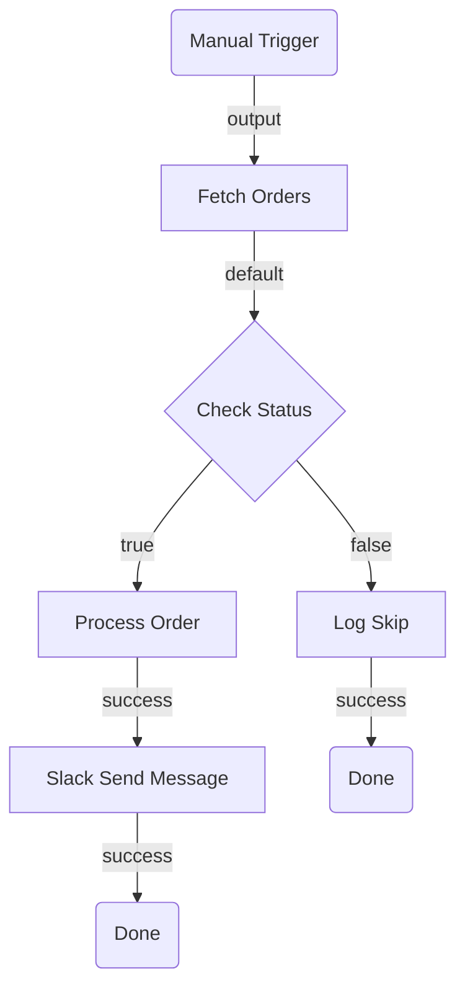
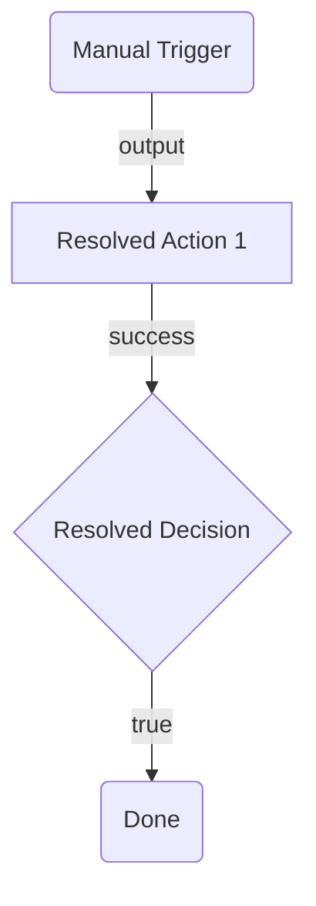

# Planning Guide

Two-phase planning methodology for UiPath Flow projects. Phase 1 designs the topology (what nodes to use and how they connect). Phase 2 resolves implementation details (exact types, connections, field values). Both phases operate at the topology level and are mode-neutral -- the same planning process applies whether you build with CLI or JSON authoring.

> **When to plan:** New flows with 3+ nodes, or major restructuring of an existing flow.
> **When to skip:** Small targeted edits (add/remove a single node, change an expression, fix wiring). Use the recipes in the SKILL.md Common Edits section instead.

---

## Phase 1: Discovery & Architecture

Design the flow topology -- select node types, define edges, identify expected inputs and outputs. This phase produces a mermaid diagram and structured tables for review before any implementation work begins.

> **Registry rules for Phase 1:**
> - `registry search` and `registry list` are ALLOWED -- use them to discover what connectors, resources, and operations exist before committing to a topology.
> - `registry get` is NOT allowed -- detailed metadata, connection binding, and reference field resolution are handled in Phase 2.

### Process

1. Analyze the user's requirements.
2. **Discover capabilities** -- if the flow uses connector or resource nodes, run `registry search` / `registry list` to confirm they exist and identify available operations (see [Capability Discovery](#capability-discovery)).
3. Select node types from the [Node Catalog](#node-catalog) below. For each selected node type, read its reference file (linked in the catalog) for port details and key inputs.
4. Define edges (how nodes connect) -- see [Wiring Rules](#wiring-rules) and the [Standard Port Reference](#standard-port-reference).
5. Identify suspected inputs and outputs for each node.
6. Generate a mermaid diagram.
7. Validate the mermaid syntax (see [Mermaid Validation Rules](#mermaid-validation-rules)).
8. Present the plan for user review.
9. Iterate until approved, then proceed to [Phase 2: Implementation Resolution](#phase-2-implementation-resolution).

### Capability Discovery

**When to run:** The flow uses connector nodes (external services) or resource nodes (RPA processes, agents, other flows). **Skip** if the flow only uses OOTB nodes (scripts, HTTP, branching, loops).

Discovery answers "what can I work with?" before you commit to a topology. This prevents designing around a connector that does not exist, an operation the connector does not support, or an RPA process / agent that has not been published yet.

```bash
# Registry should already be refreshed (Step 3 in Quick Start runs `registry pull`)
uip flow registry search <keyword> --output json    # search by service, resource name, or category
uip flow registry search outlook --output json       # example: does an Outlook connector exist?
uip flow registry search "invoice process" --output json  # example: is an RPA process published?
uip flow registry search agent --output json         # example: what agents are available?
uip flow registry list --output json                 # list all available node types
```

> **Auth note:** Without `uip login`, the registry shows OOTB nodes only. After login, tenant-specific connector and resource nodes are also available. If the flow requires connectors or resources, verify login status first: `uip login status --output json`.

#### Check Connector Connections

For each connector found in registry search, verify a healthy connection exists. See [connector-guide.md](connectors/connector-guide.md) for the full connection check workflow.

```bash
uip is connections list "<connector-key>" --output json
```

- If a default enabled connection exists (`IsDefault: Yes`, `State: Enabled`), record the connection ID for Phase 2.
- **If no connection exists**, surface it in the **Open Questions** section of the architectural plan so the user can create it while reviewing. Creating a connection may involve OAuth flows or admin approval -- front-loading this avoids blocking Phase 2.

> This is a lightweight existence check, not full connection binding. Phase 2 will ping the connection, fetch enriched metadata, and resolve reference fields.

**What to record from discovery:**

- **Connectors:** Whether a connector exists for each external service, available operations (from node type names), and whether a healthy connection exists. Field details require `registry get --connection-id` in Phase 2.
- **Resources:** Whether a published node exists for each RPA process, agent, or flow referenced in the requirements (e.g., `uipath.core.rpa-workflow.invoice-abc123`). Input/output schemas require `registry get` in Phase 2.
- **Gaps:** Services with no connector -- fall back to `core.action.http`. Resources not yet published -- use `core.logic.mock` placeholder. Connectors with no connection -- flag in Open Questions for the user to create.

Use these findings to select the right node types from the [Node Catalog](#node-catalog). If a connector does not exist, fall back to `core.action.http` or note it as a gap in Open Questions.

> **Do NOT run `registry get` during discovery.** Search results give you node type names -- enough to know what connectors and operations exist. `is connections list` confirms connection availability. Detailed field metadata (required fields, types, enums, reference resolution) requires `registry get --connection-id` and belongs to Phase 2.

### Node Catalog

Each node type has a reference file with full ports, inputs, and definition. **Read the relevant reference** when selecting that node type for your flow.

#### Triggers

| Node Type | Reference | When to Select |
| --- | --- | --- |
| `core.trigger.manual` | [trigger-manual.md](nodes/trigger-manual.md) | Flow is started on demand by a user or API call |
| `core.trigger.scheduled` | [trigger-scheduled.md](nodes/trigger-scheduled.md) | Flow runs on a recurring schedule |

**Rules:**

- Every flow must have exactly one trigger node.
- The trigger is always the first node in the topology.
- `core.trigger.manual` has no inputs and outputs on port `output`.

#### Actions

| Node Type | Reference | When to Select |
| --- | --- | --- |
| `core.action.script` | [action-script.md](nodes/action-script.md) | Custom logic, data transformation, computation, formatting |
| `core.action.http` | [action-http.md](nodes/action-http.md) | Call a REST API where no connector exists, or quick prototyping |
| `core.action.transform` | [action-transform.md](nodes/action-transform.md) | Declarative map, filter, or group-by on a collection |
| `core.action.transform.filter` | [action-transform-filter.md](nodes/action-transform-filter.md) | Filter items from a collection based on a condition |
| `core.logic.delay` | [logic-delay.md](nodes/logic-delay.md) | Pause execution for a duration or until a specific date |
| `core.action.queue.create` | [action-queue-create.md](nodes/action-queue-create.md) | Distribute work to robots -- fire-and-forget |
| `core.action.queue.create-and-wait` | [action-queue-create-and-wait.md](nodes/action-queue-create-and-wait.md) | Distribute work to robots -- wait for result |

#### Control Flow

| Node Type | Reference | When to Select |
| --- | --- | --- |
| `core.logic.decision` | [logic-decision.md](nodes/logic-decision.md) | Binary branching (if/else) based on a boolean condition |
| `core.logic.switch` | [logic-switch.md](nodes/logic-switch.md) | Multi-way branching (3+ paths) based on ordered case expressions |
| `core.logic.loop` | [logic-loop.md](nodes/logic-loop.md) | Iterate over a collection of items |
| `core.logic.foreach` | [logic-foreach.md](nodes/logic-foreach.md) | For-each iteration over a collection |
| `core.logic.while` | [logic-while.md](nodes/logic-while.md) | Repeat while a condition is true |
| `core.logic.merge` | [logic-merge.md](nodes/logic-merge.md) | Synchronize parallel branches before continuing |
| `core.control.end` | [control-end.md](nodes/control-end.md) | Graceful flow completion (one per terminal path) |
| `core.logic.terminate` | [control-terminate.md](nodes/control-terminate.md) | Abort entire flow immediately on fatal error |
| `core.subflow` | _(see [subflow-guide.md](subflow-guide.md))_ | Group related steps into a reusable container with isolated scope |

#### Connector Nodes

Connector nodes call external services via Integration Service. They are **not** built-in -- they come from the registry after `uip login` + `uip flow registry pull`.

| When to Select | Reference |
| --- | --- |
| A pre-built connector exists for the target service (Jira, Slack, Salesforce, etc.) | [connector-guide.md](connectors/connector-guide.md) |

**In Phase 1:** Use [Capability Discovery](#capability-discovery) to confirm the connector exists and note it as `connector: <service-name>` with the intended operation. Phase 2 resolves the exact type, connection, and fields via [connector-guide.md](connectors/connector-guide.md).

#### Resource Nodes (External Automations)

Resource nodes invoke published UiPath automations. They are tenant-specific and appear in the registry after `uip login` + `uip flow registry pull`. All resource nodes share the same ports (`input`, `output`, `error`), `model` shape, and bindings pattern. See [resource-node-guide.md](dynamic-nodes/resource-node-guide.md) for the shared structure.

| Category | Node Type Pattern | Reference |
| --- | --- | --- |
| RPA Workflow | `uipath.core.rpa-workflow.{key}` | [rpa-workflow-guide.md](dynamic-nodes/rpa-workflow-guide.md) |
| Agent | `uipath.core.agent.{key}` | [agent-guide.md](dynamic-nodes/agent-guide.md) |
| Agentic Process | `uipath.core.agentic-process.{key}` | [agentic-process-guide.md](dynamic-nodes/agentic-process-guide.md) |
| API Workflow | `uipath.core.api-workflow.{key}` | [api-workflow-guide.md](dynamic-nodes/api-workflow-guide.md) |
| Human-in-the-Loop | `uipath.human-in-the-loop` | [hitl.md](nodes/hitl.md) |

#### Placeholders and Mocks

| Node Type | Reference | When to Select |
| --- | --- | --- |
| `core.logic.mock` | [logic-mock.md](nodes/logic-mock.md) | Step is TBD, resource does not exist yet, or prototyping. Placeholder with `input` -> `output` |
| `core.mock.blank` | [mock-blank.md](nodes/mock-blank.md) | Blank pass-through placeholder |
| `core.mock.node` | [mock-node.md](nodes/mock-node.md) | Mock node with configurable error behavior |

### Standard Port Reference

Use this when defining edges. Every edge requires a `sourcePort` and `targetPort`. For the full port table with handle constraints, see [edge-wiring-guide.md](edge-wiring-guide.md).

| Node Type | Input Port(s) | Output Port(s) |
| --- | --- | --- |
| `core.trigger.manual` | -- | `output` |
| `core.trigger.scheduled` | -- | `output` |
| `core.action.script` | `input` | `success` |
| `core.action.http` | `input` | `default`, `branch-{id}` (dynamic per branch) |
| `core.action.transform` | `input` | `output` |
| `core.action.transform.filter` | `input` | `output` |
| `core.logic.delay` | `input` | `output` |
| `core.logic.decision` | `input` | `true`, `false` |
| `core.logic.switch` | `input` | `case-{id}` (dynamic per case), `default` |
| `core.logic.loop` | `input`, `loopBack` | `success`, `output` |
| `core.logic.foreach` | `input`, `loopBack` | `success`, `output` |
| `core.logic.while` | `input`, `loopBack` | `success`, `output` |
| `core.logic.merge` | `input` (multiple) | `output` |
| `core.control.end` | `input` | -- |
| `core.logic.terminate` | `input` | -- |
| `core.subflow` | `input` | `output`, `error` |
| `core.logic.mock` | `input` | `output` |
| `core.mock.blank` | `input` | `output` |
| `core.mock.node` | `input` | `output` |
| `core.action.queue.create` | `input` | `success` |
| `core.action.queue.create-and-wait` | `input` | `success` |
| Resource nodes (`uipath.core.*`) | `input` | `output`, `error` |
| Connector nodes (`uipath.connector.*`) | `input` | `success` |

### Selecting External Service Nodes

When the flow needs to call an external service, use this decision order -- prefer higher tiers:

1. **Pre-built Integration Service connector** -- Use when a connector exists and covers the use case. See [connector-guide.md](connectors/connector-guide.md).
2. **HTTP Request within a connector** -- Use when a connector exists but lacks the specific endpoint. See the HTTP Fallback section in [connector-guide.md](connectors/connector-guide.md).
3. **Standalone HTTP Request** (`core.action.http`) -- Use for one-off API calls to services without connectors. See [action-http.md](nodes/action-http.md).
4. **RPA workflow node** -- Use only when the target system has no API (legacy desktop apps, terminals). See [rpa-workflow-guide.md](dynamic-nodes/rpa-workflow-guide.md).

### Wiring Rules

Apply these when defining edges in the topology:

1. Edges connect a **source port** (output) on one node to a **target port** (input) on another.
2. Trigger nodes have no input port -- they are always edge sources, never targets.
3. End/Terminate nodes have no output port -- they are always edge targets, never sources.
4. Every non-trigger node must have at least one incoming edge.
5. Every non-terminal node must have at least one outgoing edge.
6. Decision nodes produce exactly two outgoing edges: one from `true`, one from `false`.
7. Switch nodes produce one outgoing edge per case + optionally one from `default`.
8. Loop nodes: the `loopBack` port receives the edge returning from the last node inside the loop body; `success` fires after all iterations.
9. Merge nodes accept multiple incoming edges (one per parallel path being synchronized).
10. Do not create cycles except through Loop's `loopBack` mechanism.
11. **No dangling nodes** -- every node must be connected by at least one edge. A node with no incoming and no outgoing edges is invalid. Verify every node in the node table appears in the edge table as either a source or target.

### Common Topology Patterns

Use these as building blocks when designing your flow.

#### Linear Pipeline

```
Trigger -> Action A -> Action B -> Action C -> End
```

#### Conditional Branch

```
Trigger -> Fetch Data -> Decision
  |-- true -> Process -> End
  |-- false -> Log Skip -> End
```

#### Parallel Execution with Merge

```
Trigger -> Prepare
  |-- Call API A --+
  |-- Call API B --+
                   +-- Merge -> Combine -> End
```

#### Loop Over Collection

```
Trigger -> Fetch List -> Loop
  |-- [loop body] Process Item -> (loopBack)
  |-- success -> Summarize -> End
```

#### Error Handling

```
Trigger -> HTTP Request -> Decision (error?)
  |-- true -> Log Error -> Terminate
  |-- false -> Process -> End
```

#### Orchestration (Mixed Resources)

```
Trigger -> Script (prepare) -> RPA Process (extract) -> Agent (classify) -> Decision
  |-- approved -> Script (format) -> End
  |-- rejected -> Human Task (review) -> End
```

#### Scheduled Batch Processing

```
Scheduled Trigger -> HTTP (fetch batch) -> Loop
  |-- Queue Create (per item) -> (loopBack)
  |-- success -> Script (summary) -> End
```

### Mermaid Validation Rules

LLM-generated mermaid frequently contains syntax errors. After generating the diagram, **check every rule below** before presenting it to the user. Fix violations before outputting.

#### Syntax Rules

1. **First line must be `graph TD` or `graph LR`** -- use `graph` not `flowchart` (the `flowchart` keyword is not supported by all renderers). `TD` = top-down, `LR` = left-right.
2. **Node IDs must be alphanumeric + underscores only** -- no hyphens, dots, or spaces in IDs. Use `fetchData` not `fetch-data` or `fetch.data`.
3. **Node IDs must not start with or equal a reserved word** -- mermaid reserves these as keywords: `end`, `subgraph`, `graph`, `flowchart`, `direction`, `click`, `style`, `classDef`, `class`, `linkStyle`, `callback`, `default`. IDs that start with these (e.g., `endWarm`, `defaultPath`, `styleNode`) break the parser. Use alternatives like `warmEnd`, `pathDefault`, `nodeStyle` -- or use a prefix like `done_warm`, `finish_warm`.
4. **Node labels must be plain text** -- no quotes inside shape delimiters. Use `A[Fetch Data]` not `A["Fetch Data"]`.
5. **No special characters in labels** -- these break mermaid parsing even when quoted:
   - `>` and `<` (interpreted as shape operators or HTML) -- replace with words like "over" or "under"
   - `(`, `)`, `[`, `]`, `{`, `}` (conflict with shape delimiters)
   - `:`, `;`, `?`, `&`, `"` (unreliable across renderers)
   - Use plain alphanumeric text and spaces only
6. **Use only universally supported shapes** -- `(text)` for rounded rectangle, `[text]` for rectangle, `{text}` for diamond. Do NOT use `([text])` (stadium), `{{text}}` (hexagon), or other extended shapes -- they are not supported by all renderers.
7. **Edge labels use `|label|` between arrow and target** -- `A -->|success| B` not `A -->success B` or `A --success--> B`.
8. **No empty labels** -- `A --> B` is fine, but `A -->|| B` is invalid.
9. **Subgraph IDs must be unique** and not collide with node IDs.
10. **Subgraph blocks must be closed** -- every `subgraph` needs a matching `end`.
11. **No semicolons** -- mermaid uses newlines, not semicolons, to separate statements.
12. **No blank lines inside the mermaid block** -- blank lines between node definitions and edges can prevent rendering in some mermaid implementations. Keep all lines contiguous.

#### Structural Rules

1. **Every node defined must be connected** -- no orphan nodes floating in the diagram.
2. **Edge directions must match the flow** -- trigger at the top, End at the bottom (for TB layouts).
3. **Decision nodes must show both branches** -- `true` and `false` edges, each labeled.
4. **Switch nodes must show all case edges** -- one per case plus optional default.
5. **Loop structures**: show the loop body and the loopBack edge returning to the loop node.
6. **Parallel branches** must visually fork from one node and converge at a Merge node.

#### Validation Procedure

After generating the mermaid block:

1. First line is `graph TD` or `graph LR` -- not `flowchart`.
2. Check each node ID contains only `[a-zA-Z0-9_]`.
3. Check no node ID starts with or equals a reserved word (`end`, `subgraph`, `graph`, `flowchart`, `direction`, `click`, `style`, `classDef`, `class`, `linkStyle`, `callback`, `default`).
4. Check no labels contain `>`, `<`, `:`, `;`, `?`, `&`, `(`, `)`, or quotes -- replace with plain words.
5. Only `(text)`, `[text]`, and `{text}` shapes are used -- no `([text])`, `{{text}}`, or other extended shapes.
6. Check each edge has valid `-->`, `-->|label|` syntax.
7. Check all subgraphs are closed.
8. Verify every node in the node table appears in the diagram.
9. Verify every edge in the edge table appears in the diagram.
10. Check for blank lines inside the mermaid block -- remove any empty lines between statements.
11. If any rule is violated, fix it before outputting.

### Output Format: `.arch.plan.md`

Generate a `<SolutionName>.arch.plan.md` file in the **solution directory** (the folder containing the `.uipx` file, not the project subfolder). The plan covers the entire solution -- which may contain multiple projects in the future.

#### 1. Summary

2-3 sentences describing what the flow does end-to-end.

#### 2. Flow Diagram (Mermaid)

A mermaid flowchart showing all nodes, edges, and branching logic.

**Requirements:**

- Use `graph TD` (top-down) for most flows; `graph LR` (left-right) only for very linear flows with few branches. Do NOT use `flowchart` -- it is not supported by all mermaid renderers.
- Use `subgraph` blocks to group related sections -- required for flows with 10+ nodes.
- Label every edge with the port name (e.g., `-->|success|`, `-->|true|`, `-->|false|`).
- **Labels must be plain text only** -- no special characters inside shape delimiters (see [Mermaid Validation Rules](#mermaid-validation-rules)).
- Do NOT put node types in diagram labels -- node types belong in the Node Table only.
- Do NOT use quotes inside shape delimiters -- use `[Text]` not `["Text"]`.
- Use only these universally supported node shapes:
  - Triggers: rounded rectangle `(Trigger Name)`
  - Actions: rectangle `[Action Name]`
  - Control flow: diamond `{Decision Name}` for Decision/Switch
  - End/Terminate: rounded rectangle `(Done)`
  - Connectors: rectangle `[Connector Service Operation]`
  - Placeholders: rectangle `[Mock Description]`

**Example:**

````markdown

````

#### 3. Node Table

| # | Node ID | Name | Category | Node Type | Inputs | Outputs | Notes |
| --- | --- | --- | --- | --- | --- | --- | --- |
| 1 | trigger | Manual Trigger | trigger | `core.trigger.manual` | -- | Trigger event | -- |
| 2 | fetchOrders | Fetch Orders | action | `core.action.http` | `method: GET`, `url: <ORDERS_API_URL>` | `output.body` (order list), `output.statusCode` | Phase 2: confirm URL and auth |
| 3 | checkStatus | Check Status | control | `core.logic.decision` | `expression: =js:$vars.fetchOrders.output.statusCode === 200` | Routes to `true` or `false` | -- |

**Column definitions:**

- **Node ID**: Short camelCase identifier used in the mermaid diagram and edge table.
- **Inputs**: Best-guess input values based on user requirements. Use `<PLACEHOLDER>` for values Phase 2 must resolve (URLs, IDs, connection details).
- **Outputs**: What downstream nodes are expected to consume via `$vars.{nodeId}.*`.
- **Notes**: Implementation concerns for Phase 2 (e.g., "Phase 2: resolve Jira project ID", "Phase 2: bind Slack connection").

#### 4. Edge Table

| # | Source Node | Source Port | Target Node | Target Port | Condition/Label |
| --- | --- | --- | --- | --- | --- |
| 1 | trigger | output | fetchOrders | input | -- |
| 2 | fetchOrders | default | checkStatus | input | -- |
| 3 | checkStatus | true | processOrder | input | Status is 200 |
| 4 | checkStatus | false | logSkip | input | Status is not 200 |

**Rules:**

- Source/target ports must match the [Standard Port Reference](#standard-port-reference).
- Every node (except the trigger) must appear as a target at least once.
- Every node (except End/Terminate) must appear as a source at least once.

#### 5. Inputs and Outputs

| Direction | Name | Type | Description |
| --- | --- | --- | --- |
| `in` | ordersApiUrl | `string` | Base URL for the orders API |
| `out` | processedCount | `number` | Number of orders successfully processed |
| `inout` | errorLog | `array` | Accumulates error messages across the flow |

#### 6. Connector Summary (omit if no connectors)

| Node ID | Service | Intended Operation | Phase 2 Action |
| --- | --- | --- | --- |
| notifySlack | Slack | Send message to channel | Resolve connector key, bind connection, resolve channel ID |
| createTicket | Jira | Create issue | Resolve connector key, bind connection, resolve project/issue type IDs |

#### 7. Open Questions (omit if none)

Prefix each with `**[REQUIRED]**` or `**[OPTIONAL]**`:

- **[REQUIRED]** Which Slack channel should notifications go to?
- **[OPTIONAL]** Should the error handler retry before terminating?

### Node Selection Heuristics

Quick decision guide. For full details, read the linked reference file.

#### "I need to call an external service"

1. Is there a connector? -> [connector-guide.md](connectors/connector-guide.md)
2. No connector, but has a REST API? -> [action-http.md](nodes/action-http.md)
3. No API at all (desktop app, terminal)? -> [rpa-workflow-guide.md](dynamic-nodes/rpa-workflow-guide.md) or `core.logic.mock` if unpublished

#### "I need to branch"

- Two paths -> [logic-decision.md](nodes/logic-decision.md)
- Three or more paths -> [logic-switch.md](nodes/logic-switch.md)
- Branch on HTTP response status -> [action-http.md](nodes/action-http.md) built-in branches

#### "I need to transform data"

- Standard map/filter/group-by -> [action-transform.md](nodes/action-transform.md)
- Filter items from a collection -> [action-transform-filter.md](nodes/action-transform-filter.md)
- Custom logic, string manipulation, computation -> [action-script.md](nodes/action-script.md)

#### "I need to end the flow"

- Normal completion -> [control-end.md](nodes/control-end.md) (one per terminal path)
- Fatal error, abort everything -> [control-terminate.md](nodes/control-terminate.md)

#### "I need to wait"

- Fixed duration -> [logic-delay.md](nodes/logic-delay.md)
- Wait until a specific time -> [logic-delay.md](nodes/logic-delay.md)
- Wait for external work to complete -> `core.action.queue.create-and-wait`

#### "I need human involvement"

- Human approval or data entry -> [hitl.md](nodes/hitl.md) or `core.logic.mock` if the app does not exist

#### "The flow needs something outside flow capabilities"

1. Add a `core.logic.mock` placeholder.
2. Note what needs to be created and which skill handles it:
   - Desktop/browser automation or coded workflow (C#) -> `uipath-rpa`
   - Agent -> `uipath-agents`
3. Phase 2 will check whether the resource has been published and replace the mock.

### GATE: User Approval Required

**Do not proceed to Phase 2 until the user explicitly approves the architectural plan.**

Present the `.arch.plan.md` to the user. Iterate on feedback until approved.

---

## Phase 2: Implementation Resolution

Resolve all implementation details for the approved architectural plan. This phase takes the `.arch.plan.md` and produces an `.impl.plan.md` with concrete, build-ready values.

> **Prerequisite:** The user must have explicitly approved the architectural plan (`.arch.plan.md`) before starting this phase.

### Validation Strategy by Mode

How you validate node types depends on the implementation mode:

| Mode | OOTB Nodes | Dynamic/Connector Nodes |
| --- | --- | --- |
| **CLI** | `registry get` mandatory for all node types | `registry get` mandatory (with `--connection-id` for connectors) |
| **JSON Authoring** | Use bundled reference files in `nodes/` -- no registry call needed | `registry get` mandatory (dynamic nodes are not bundled) |

In both modes, the goal is the same: confirm ports, required inputs, and output schemas match your plan. The difference is the source of truth -- CLI mode always uses the live registry; JSON mode uses the bundled reference files for OOTB nodes (which are validated against the registry at authoring time) and only calls the registry for dynamic/connector nodes.

### Process

#### Step 1 -- Identify Nodes and Validate

Scan the approved `.arch.plan.md` node table and connector summary. Categorize each node:

| Category | How to Identify | Action |
| --- | --- | --- |
| Connector nodes | Node type starts with `uipath.connector.*` or Notes say "connector:" | Run Step 2 (follow [connector-guide.md](connectors/connector-guide.md)) |
| Resource nodes | Node type starts with `uipath.core.*` or Notes say "resource:" | Run Step 3 (follow the relevant resource guide -- see table below) |
| Mock placeholders | Node type is `core.logic.mock` | Run Step 4 (check if published, replace if available) |
| OOTB nodes | Everything else (Script, HTTP, Decision, Loop, etc.) | Run Step 1a below |

**All nodes must be validated before proceeding to the build step.**

#### Step 1a -- Validate Node Types

For each node type in your plan, confirm ports, required inputs, and output schemas.

**CLI mode:** Run `registry get` for every node type:

```bash
uip flow registry pull --force
uip flow registry get <nodeType> --output json
```

**JSON Authoring mode:** Read the bundled reference file for OOTB nodes (no registry call needed). For dynamic/connector nodes, run `registry get` as in CLI mode.

**Reference files for validation:**

| Node Type | Reference |
| --- | --- |
| `core.trigger.manual` | [trigger-manual.md](nodes/trigger-manual.md) |
| `core.trigger.scheduled` | [trigger-scheduled.md](nodes/trigger-scheduled.md) |
| `core.action.script` | [action-script.md](nodes/action-script.md) |
| `core.action.http` | [action-http.md](nodes/action-http.md) |
| `core.action.transform` | [action-transform.md](nodes/action-transform.md) |
| `core.action.transform.filter` | [action-transform-filter.md](nodes/action-transform-filter.md) |
| `core.logic.delay` | [logic-delay.md](nodes/logic-delay.md) |
| `core.logic.decision` | [logic-decision.md](nodes/logic-decision.md) |
| `core.logic.switch` | [logic-switch.md](nodes/logic-switch.md) |
| `core.logic.loop` | [logic-loop.md](nodes/logic-loop.md) |
| `core.logic.foreach` | [logic-foreach.md](nodes/logic-foreach.md) |
| `core.logic.while` | [logic-while.md](nodes/logic-while.md) |
| `core.logic.merge` | [logic-merge.md](nodes/logic-merge.md) |
| `core.control.end` | [control-end.md](nodes/control-end.md) |
| `core.logic.terminate` | [control-terminate.md](nodes/control-terminate.md) |
| `core.subflow` | _(see [subflow-guide.md](subflow-guide.md))_ |
| `core.action.queue.*` | _(see relevant queue node reference)_ |
| `uipath.core.agent.*` | [agent-guide.md](dynamic-nodes/agent-guide.md) |
| `uipath.core.rpa-workflow.*` | [rpa-workflow-guide.md](dynamic-nodes/rpa-workflow-guide.md) |
| `uipath.core.agentic-process.*` | [agentic-process-guide.md](dynamic-nodes/agentic-process-guide.md) |
| `uipath.core.api-workflow.*` | [api-workflow-guide.md](dynamic-nodes/api-workflow-guide.md) |
| `uipath.human-in-the-loop` | [hitl.md](nodes/hitl.md) |
| `uipath.connector.*` | [connector-guide.md](connectors/connector-guide.md) |

For each node type, record:

- Input port names (must match `targetPort` in edges)
- Output port names (must match `sourcePort` in edges)
- Required input fields (`required: true` in `inputDefinition`)
- Output variable schema (`outputDefinition`)

Update your node table if any ports or required fields differ from the architectural plan.

#### Step 2 -- Resolve Connector Nodes

For each connector node, follow the configuration workflow in [connector-guide.md](connectors/connector-guide.md). The guide covers connection binding, metadata retrieval, field resolution, and validation.

Record the connection ID and resolved field values for the build step.

#### Step 3 -- Resolve Resource Nodes

For each resource node (RPA workflow, agent, flow, API workflow, agentic process), follow the discovery and validation steps in the relevant guide under [dynamic-nodes/](dynamic-nodes/). See [resource-node-guide.md](dynamic-nodes/resource-node-guide.md) for the shared structure.

```bash
uip flow registry get "<node-type>" --output json
```

Record `inputDefinition` and `outputDefinition` for the node table.

If Phase 1 flagged a resource as not found, re-check in case it was published since planning:

```bash
uip flow registry pull --force
uip flow registry search "<resource-name>" --output json
```

If still not found, keep the `core.logic.mock` placeholder and note the gap.

#### Step 4 -- Replace Mock Nodes

For each `core.logic.mock` node in the architectural plan:

1. Check if the resource has been published since planning: `uip flow registry search "<name>" --output json`
2. If published: replace the mock with the real resource node type, update inputs/outputs.
3. If not published: keep the mock and note it in the "Open Questions" section for user resolution.

#### Step 5 -- Replace Placeholders

Update the node table from the `.arch.plan.md`:

- Replace `<PLACEHOLDER>` values with resolved IDs.
- Replace `connector: <service>` annotations with actual node types.
- Replace `resource: <name>` annotations with actual node types.
- Update inputs with resolved reference field values.
- Update outputs based on `outputDefinition` from registry.

#### Step 6 -- Write the Implementation Plan

Generate a `<SolutionName>.impl.plan.md` file in the **solution directory** (same location as the `.arch.plan.md`).

#### Step 7 -- Get Approval

Present a short summary in chat:

1. Registry validation results -- confirm all node ports and inputs match the plan.
2. How many connector/resource nodes were resolved.
3. Any port or input field changes discovered during validation.
4. Any mock placeholders remaining.
5. Any required fields that need user input.
6. Any connections that need to be created.

Tell the user to review `<SolutionName>.impl.plan.md`, including the updated mermaid diagram and registry confirmations. Do NOT proceed to the build step until the user explicitly approves.

### Product Heuristics

These are org-wide "when to use what" rules that cannot be encoded in individual node descriptions. They reflect how UiPath's products fit together and which approach to prefer for a given task.

#### Connecting to External Services

See [Selecting External Service Nodes](#selecting-external-service-nodes) for the 4-tier decision order (connector -> HTTP within connector -> standalone HTTP -> RPA).

#### Agent Nodes vs Workflow Logic

- **Agent nodes** for ambiguous input, reasoning, judgment, NLG.
- **Script/Decision/Switch** for structured input, deterministic logic, data transformation.

**Anti-pattern:** Do not use an agent node for tasks that can be done with a Decision + Script. Agents are slower, more expensive (LLM tokens), and less predictable.

**Hybrid pattern:** Use workflow nodes for the deterministic parts (fetch data, transform, route) and agent nodes for the ambiguous parts (classify intent, draft response, extract entities). The flow orchestrates; the agent reasons.

### Expressions and Variables

For the **complete reference** on variables (declaration, types, scoping, variable updates) and expressions (`=js:`, templates, Jint constraints), see [variables-guide.md](variables-guide.md).

#### Quick Reference

Nodes communicate data through `$vars`. Every node's output is accessible downstream via `$vars.{nodeId}.{outputProperty}`.

```javascript
$vars.rollDice.output.roll              // Script return value
$vars.fetchData.output.body             // HTTP response body
$vars.fetchData.output.statusCode       // HTTP status code
$vars.someNode.error.message            // Error information
iterator.currentItem                     // Loop item (inside loop body)
```

**Expression prefixes:**

- `=js:` -- Full JavaScript expression evaluated by Jint: `=js:$vars.count > 10`
- `{ }` -- Template interpolation for string fields: `Order {$vars.orderId} is {$vars.status}`

**Variable directions** (`variables.globals`):

- `in` -- External input (read-only after start)
- `out` -- Workflow output (must be mapped on End nodes)
- `inout` -- State variable (updated via `variableUpdates`)

### Wiring Rules with Connection Constraints

#### Port Compatibility

- Edges connect a **source** port (output) on one node to a **target** port (input) on another.
- Source handles have `type: "source"`, target handles have `type: "target"`.
- You cannot wire two source ports together or two target ports together.

#### Connection Constraints

Some nodes enforce connection rules via `constraints` in their handle configuration:

| Constraint | Meaning |
| --- | --- |
| `minConnections: N` | Handle must have at least N edges (validation error if not met) |
| `maxConnections: N` | Handle accepts at most N edges |
| `forbiddenSourceCategories: ["trigger"]` | Cannot receive connections from trigger nodes |
| `forbiddenTargetCategories: ["trigger"]` | Cannot connect output to trigger nodes |

**Key rules:**

- Trigger nodes can only have outgoing connections (no input port).
- End/Terminate nodes can only have incoming connections (no output port).
- Control flow outputs generally cannot loop back to triggers.
- Decision and Switch nodes cannot receive connections from agent resource nodes.

#### Dynamic Ports

Some nodes create ports based on their configuration:

- **HTTP Request** -- One port per `branches` entry: `branch-{id}`. See [action-http.md](nodes/action-http.md).
- **Switch** -- One port per `cases` entry: `case-{id}`. See [logic-switch.md](nodes/logic-switch.md).
- **Loop** -- `success` port fires after completion, `output` port carries aggregated results. See [logic-loop.md](nodes/logic-loop.md).

When wiring to dynamic ports, the port ID must match the configured item's `id`.

### Output Format: `.impl.plan.md`

Generate a `<SolutionName>.impl.plan.md` file in the **solution directory** (same location as the `.arch.plan.md`).

````markdown
# <SolutionName> Implementation Plan

## Summary

2-3 sentences describing what the flow does end-to-end and what was resolved in this phase (connectors bound, resources confirmed, registry validations performed).

## Flow Diagram (Mermaid)

Copy the mermaid diagram from `.arch.plan.md`, then update node labels if any node types changed due to mock replacement or connector resolution. Use the same diagram from architectural planning -- it remains the visual reference for the flow structure.



## Resolved Node Table

| # | Node ID | Name | Node Type | Inputs | Outputs | Connection ID | Notes |
| --- | --- | --- | --- | --- | --- | --- | --- |

## Resolved Edge Table

(Copy from `.arch.plan.md` -- update only if node IDs changed due to mock replacement)

## Bindings

| Connector Key | Connection ID | Activity | Verified |
| --- | --- | --- | --- |

## Global Variables

(Copy from `.arch.plan.md` Inputs and Outputs section)

## Changes from Architectural Plan

- List what changed between `.arch.plan.md` and this plan
- Record any node type changes (connector resolutions, mock replacements)
- Note any port or input field changes discovered during registry validation

## Open Questions

Prefix each with `**[REQUIRED]**` or `**[OPTIONAL]**`. If there are no open questions, write "No open questions -- all details resolved."

- **[REQUIRED]** Which connection should be used for the Slack connector?
- **[OPTIONAL]** Should the retry count be increased from the default?
````

**Column additions beyond the architectural plan:**

- **Connection ID**: The bound connection UUID (connector nodes only).
- **Verified**: Whether the connection was pinged successfully.

### GATE: User Approval Required

**Do not proceed to the build step until the user explicitly approves the implementation plan.**

---

## Handoff to Build

When both plans are approved:

1. The `.arch.plan.md` defines the topology (nodes, edges, variables, mermaid diagram).
2. The `.impl.plan.md` provides build-ready details (resolved types, connections, field values, validated ports).
3. Follow the Quick Start Step 4 in the SKILL.md to build the flow from the approved implementation plan.
4. For each node, read its reference file for the full definition, ports, and implementation details.
5. For connector nodes, follow [connector-guide.md](connectors/connector-guide.md).
6. For dynamic resource nodes, follow [resource-node-guide.md](dynamic-nodes/resource-node-guide.md).
