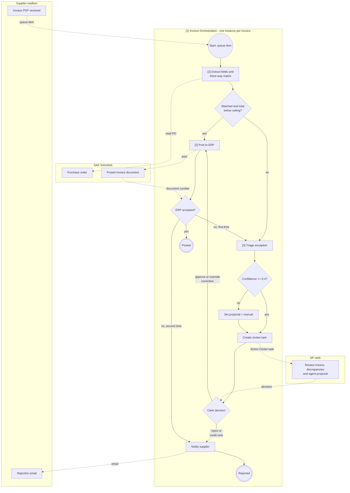
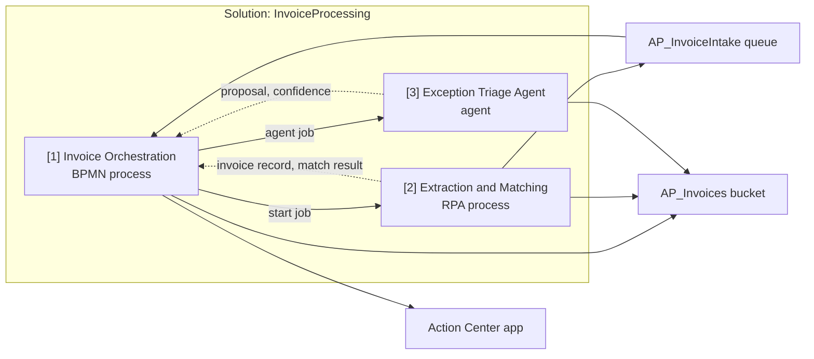

<!-- UIPATH-AUTOMATION-GENOME: process | This file is the high-level build specification for a multi-component
     UiPath automation. Each component has its own genome in the sibling folder named in Components.
     Do NOT execute these steps directly. Use the UiPath skills referenced in Components to build. -->

# Genome: Invoice Processing

> End-to-end accounts-payable intake: receive supplier invoices, extract and validate their data, triage exceptions with an AI agent and human reviewers, and post approved invoices to the ERP.

> **This is a UiPath automation blueprint.** Do not execute these steps directly. Build each component with the skill named in **Components**, then wire them per **Handoffs** and **Deployment**.

## Overview

Accounts Payable receives roughly 400 supplier invoices a day as PDF attachments in a shared mailbox. Each invoice must be matched to a purchase order, checked against vendor and amount limits, and posted to the ERP within two business days. Today clerks do this by hand; invoices without a PO or with mismatched totals stall for a week.

The automated process runs as one long-running BPMN process per invoice. An RPA robot extracts the invoice fields and performs the three-way match. Clean invoices post straight to the ERP. Invoices that fail a rule go to an AI agent that classifies the exception and proposes a resolution; the agent's proposal is confirmed or overridden by an AP clerk in Action Center before posting or rejection. The process is complete when the invoice is either posted with an ERP document number or rejected with a reason sent to the supplier.

## Actors and Systems

| Actor / System | Role | Notes |
|----------------|------|-------|
| AP clerk | Human — confirms or overrides agent proposals on exception invoices | Works in Action Center; SLA 1 business day per task |
| AP team lead | Human — receives daily failure digest | Email |
| Shared AP mailbox (Exchange Online) | System — invoice intake channel | PDFs arrive as attachments |
| Document Understanding | System — invoice field extraction | Pre-trained invoice model |
| SAP S/4HANA | System — purchase orders (read), invoice posting (write) | Accessed through the SAP GUI |
| Orchestrator | Platform — queues, assets, storage, persistence | |

## Components

| # | Component | Type | Skill | Genome | Summary |
|---|-----------|------|-------|--------|---------|
| 1 | Invoice Orchestration | BPMN process | `uipath-maestro-bpmn` | [invoice-orchestration-genome.md](invoice-processing-genome/invoice-orchestration-genome.md) | One instance per invoice; sequences extraction, matching, triage, human review, posting |
| 2 | Invoice Extraction and Matching | RPA process | `uipath-rpa` | [invoice-extraction-genome.md](invoice-processing-genome/invoice-extraction-genome.md) | Reads the mailbox, extracts fields with Document Understanding, three-way matches against SAP, posts approved invoices |
| 3 | Exception Triage Agent | Agent | `uipath-agents` | [exception-triage-agent-genome.md](invoice-processing-genome/exception-triage-agent-genome.md) | Classifies match failures and proposes a resolution with a confidence score |

Build order follows the table: the BPMN process references the robot's entry point and the agent by name, so build the robot and the agent first, then the process, then wire. **Handoffs** row 1 forces that order.

## Process Map

1. **Intake** — component 2 (dispatcher entry point): every 15 minutes, new mailbox attachments become queue items; each item starts one instance of component 1.
2. **Extract and match** — component 1 invokes component 2 (performer entry point): fields extracted, PO looked up, three-way match evaluated; exits with `matched` or `exception` plus the discrepancy list.
3. **Post** — on `matched`, component 1 invokes component 2 (posting entry point); exits when an ERP document number is returned.
4. **Triage** — on `exception`, component 1 invokes component 3 with the invoice record and discrepancies; exits with a proposed resolution (`repost-with-correction`, `request-supplier-credit-note`, `reject`) and a confidence score.
5. **Human review** — component 1 creates an Action Center task for the AP clerk carrying the invoice, the discrepancies, and the agent's proposal; exits when the clerk submits `Approve proposal`, `Override`, or `Reject`.
6. **Resolve** — component 1 routes: approved or overridden `repost-with-correction` → step 3 with the corrected fields; `request-supplier-credit-note` or `reject` → supplier notification and close.

BPMN-style process view — one lane per actor or system; circles are start and end events, rectangles tasks prefixed with the component number, diamonds gateways, dashed arrows message or data flows across lanes.

Component view — build-time dependencies and run-time data between the three projects:

## Handoffs

| From | To | Mechanism | Data passed | Failure behaviour |
|------|----|-----------|-------------|-------------------|
| Component 2 (dispatcher) | Component 1 | Queue item on `AP_InvoiceIntake`; queue trigger starts one process instance per item | `MailId`, `PdfBucketPath`, `ReceivedAt`, `SenderAddress` | Queue item retried 2× by Orchestrator, then Failed with the mail ID in the reason |
| Component 1 | Component 2 (performer) | Start job, wait for completion | In: `PdfBucketPath`; out: invoice record (`VendorId`, `VendorName`, `InvoiceNumber`, `InvoiceDate`, `PoNumber`, line items, `Subtotal`, `Tax`, `Total`, `Currency`), `MatchResult` (`matched` / `exception`), `Discrepancies[]` (field, expected, actual) | Job faulted → retry once after 5 minutes, then route to Triage with a single discrepancy `extraction-failed` |
| Component 1 | Component 3 | Agent job | Invoice record, `Discrepancies[]`, PO summary | Agent unavailable or confidence below 0.4 → proposal `manual`, straight to Human review |
| Component 1 | AP clerk | Action Center task (Validation app) | Invoice record, discrepancies, agent proposal and rationale, PDF link | Task not completed within 1 business day → reassign to team lead and flag SLA breach |
| Component 1 | Component 2 (posting) | Start job, wait for completion | Invoice record (possibly corrected) | ERP rejects (duplicate or locked period) → Discrepancy `erp-rejected` with the ERP message, back to Triage; second rejection → Reject and notify supplier |

## Platform Dependencies

| Resource | Type | Shared by | Purpose |
|----------|------|-----------|---------|
| AP_InvoiceIntake | Queue | 1, 2 | One item per received invoice; the trigger for the process |
| AP_Invoices | Storage bucket | 1, 2, 3, clerk | PDFs and extraction JSON referenced by every component |
| SAP_AP_Robot | Credential asset | 2 | SAP GUI login for the robot |
| AP_Mailbox connection | Integration Service connection (Exchange Online) | 2 | Reads the shared mailbox |
| Finance/AP | Orchestrator folder | all | Home of every resource and process |

## Configuration Questions

1. Which mailbox receives supplier invoices? (default: ap-invoices@contoso.com, folder Inbox/Suppliers)
2. What is the auto-approval ceiling above which every invoice needs human review even when matched? (default: €25,000)
3. What tolerance applies to line and total mismatches before an exception is raised? (default: 1% or €5, whichever is greater)
4. Below which agent confidence does the proposal skip straight to human review as `manual`? (default: 0.4)
5. Who receives the daily failure digest? (default: ap-lead@contoso.com)
6. Which SAP company codes are in scope? (default: 1000, 2000)

## Business Rules

- Every invoice needs a PO. An invoice without a PO number, or whose PO is not open, is an exception, never an auto-reject.
- Auto-approval requires all of: vendor active in SAP, PO open with sufficient remaining value, every line within tolerance, total ≤ the auto-approval ceiling, no duplicate (vendor + invoice number) in SAP.
- The agent proposes; a human decides. No exception invoice is posted or rejected without an AP clerk's decision.
- An invoice is posted at most once. A second posting attempt after an ERP rejection requires a corrected record.

## Error Handling and Recovery

- Component 2 unavailable (no robot, licence exhausted): queue items wait; process instances time out after 4 hours and raise an alert to the team lead; nothing is lost because the queue item stays `New`.
- Component 3 unavailable: proposal `manual`, human review proceeds without a suggestion.
- Human review SLA breach (1 business day): reassign to the team lead, add the invoice to the daily digest.
- Process instance stuck longer than 5 business days: terminate with reason `stale`, queue item marked Failed with the instance ID, invoice listed in the digest.
- Duplicate queue item for the same mail ID: second instance detects the existing invoice in SAP or an open instance for the same invoice number and closes itself as `duplicate`.

## Acceptance Criteria

- [ ] Given a PDF invoice arrives in the AP mailbox, a queue item exists within 15 minutes and exactly one process instance starts for it.
- [ ] Given a clean invoice (active vendor, open PO, lines within tolerance, total below the ceiling), the invoice is posted in SAP with a document number and the instance completes without any Action Center task.
- [ ] Given an invoice whose total exceeds the PO remaining value by more than the tolerance, an Action Center task is created carrying the discrepancy and an agent proposal, and no posting happens before the clerk decides.
- [ ] Given the clerk approves a `repost-with-correction` proposal, the corrected record is posted and the ERP document number appears on the instance.
- [ ] Given the clerk chooses Reject, the supplier receives a rejection email with the reason and the instance completes as rejected.
- [ ] Given the agent is unavailable, the Action Center task is still created with proposal `manual`.
- [ ] Given SAP rejects a posting as duplicate, the instance returns to triage once, and a second rejection ends as Reject with a supplier notification.
- [ ] Given a review task open longer than one business day, the task is reassigned to the team lead and the invoice appears in the next daily digest.

## Deployment

- **Packaging:** one solution `InvoiceProcessing` (`uipath-solution`) containing the three projects; queues, bucket, asset, and connection declared as solution resources.
- **Entry points and triggers:** component 2 dispatcher on a 15-minute time trigger; component 1 on a queue trigger for `AP_InvoiceIntake`; components 2 (performer, posting) and 3 started only by component 1.
- **Environments:** folder `Finance/AP` in tenant `Finance`; a `Finance/AP-Test` folder with the same resources for UAT.

## Complexity

complex

## Tags

accounts-payable, invoice, document-understanding, sap, three-way-match, bpmn, agent, human-in-the-loop, action-center, queues
