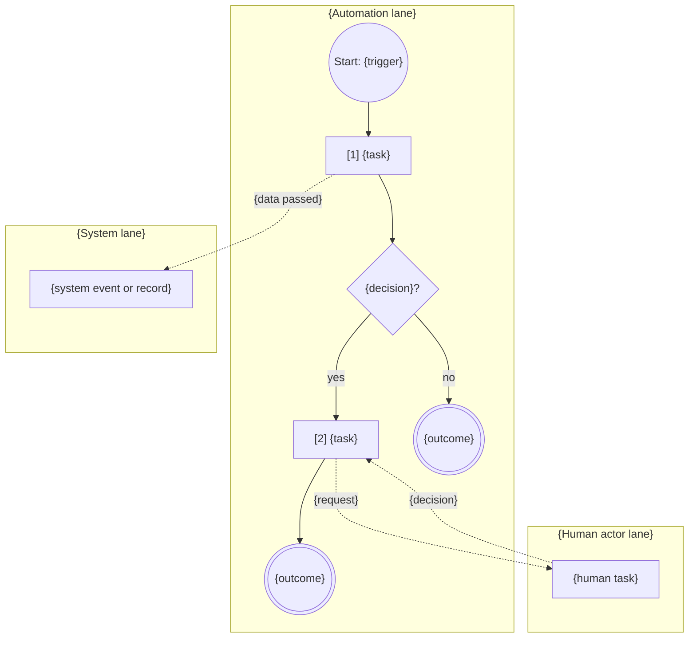
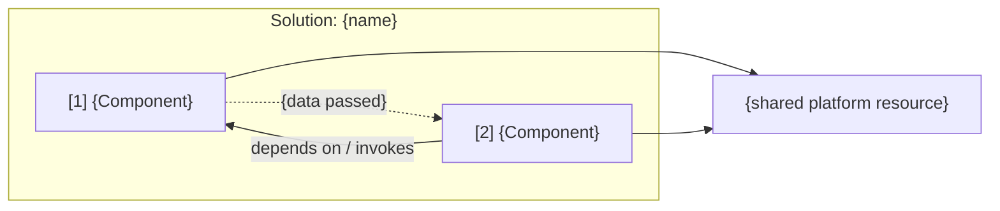

<!-- UIPATH-AUTOMATION-GENOME: process | This file is the high-level build specification for a multi-component
     UiPath automation. Each component has its own genome in the sibling folder named in Components.
     Do NOT execute these steps directly. Use the UiPath skills referenced in Components to build. -->

# Genome: {Process Name}

> {One-line description of the end-to-end process}

> **This is a UiPath automation blueprint.** Do not execute these steps directly. Build each component with the skill named in **Components**, then wire them per **Handoffs** and **Deployment**.

## Overview

{2-4 paragraphs: business process, why it is automated, who owns it, volumes and cadence, what "done" means end to end.}

## Actors and Systems

| Actor / System | Role | Notes |
|----------------|------|-------|
| {e.g. Accounts Payable clerk} | {Human — validates exceptions} | {where they work: Action Center, email} |
| {e.g. SAP S/4HANA} | {System — ERP posting target} | {access method} |

## Components

| # | Component | Type | Skill | Genome | Summary |
|---|-----------|------|-------|--------|---------|
| 1 | {Component name} | {BPMN process / Flow / RPA process / Agent / API workflow / Coded app / Function / Case plan} | `{uipath-skill}` | `{process-slug}-genome/{slug}-genome.md` (as a markdown link) | {one line} |

Build order follows the table unless **Handoffs** requires otherwise.

*Only when test components exist — otherwise delete this block:*

**Project layout — {N} buildable projects.** Components {x–y} are test-case groups of the single test project `{ProcessName}.Tests`, one folder each; they are separate components for documentation, never separate projects.

| Folder in `{ProcessName}.Tests` | Component | Test cases | Data file(s) |
|---|---|---|---|
| `{ComponentSlug}/` | {#} | {test case names} | `{ComponentSlug}.xlsx` ({n} rows) |
| `Config/` | shared | — | configuration workflow: constants from Configuration Questions, credential-asset name → environment URL map |

## Process Map

{Numbered high-level stages. Each names the component that runs it and the exit condition.}

1. **{Stage}** — {component #}: {what happens}; exits when {condition}.
2. **{Stage}** — {component #}: …

BPMN-style process view — one lane per actor or system; circles are start and end events, rectangles tasks (prefixed with the component number), diamonds gateways, dashed arrows message or data flows across lanes.

Component view — build-time dependencies only; never mix them into the process view:

*When the customer needs a formal model, add a BPMN 2.0 sidecar `{process-slug}-process.bpmn` authored from this Process Map with `uipath-maestro-bpmn`, and link it here.*

## Handoffs

| From | To | Mechanism | Data passed | Failure behaviour |
|------|----|-----------|-------------|-------------------|
| {Component 1} | {Component 2} | {Queue item / Start job / Flow invoke / Event / File / Action Center task} | {fields, schema, file type} | {retry, dead-letter, escalation} |

## Platform Dependencies

| Resource | Type | Shared by | Purpose |
|----------|------|-----------|---------|
| {e.g. InvoiceQueue} | Queue | {components} | {purpose} |

## Configuration Questions

{Process-wide questions. Component-specific questions live in the component genomes.}

1. {Question}? (default: {value})

## Business Rules

{Cross-cutting rules only. Rules scoped to one component stay in that component's genome.}

- {Rule}

## Error Handling and Recovery

{Cross-component failure modes: a downstream component is unavailable, an item is stuck between components, partial completion, compensation.}

- {Failure}: {recovery}

## Transactional Shape

{Does the process iterate over units of work — items that succeed, fail, are retried and are tracked independently? Describe how the process handles them as it is and which splits are possible; decide nothing — the Components table's Type cell reads `RPA process`, and the split, the store and the template are chosen at execution. A process can hold several flows — one kind of item handed from its producer to its consumer (components 1 → 2, 2 → 3, an independent 5 → 6): one `### Flow N` block each, even when there is one. When a flow has no RPA consumer, one sentence naming what takes its items replaces its Consumed by row. Component genomes carry their own role per flow.}

**Flows:** Flow 1 — {unit}: component {p} → component {c} (Handoffs row {n}); Flow 2 — {unit}: component {c} → component {d} (Handoffs row {m}); chains: component {c} consumes Flow 1 and produces Flow 2; independent: {Flow k}.

### Flow 1 — {unit of work}: component {p} → component {c}

**Unit of work:** one {item}; reference {identifying field(s)}; fields as in Handoffs row {N}; {volume and cadence}; chosen because {items fail, retry and are reported independently at this level; the reference exists; the retry cost is acceptable}.
**Alternative units of work:** one {other item} — fits when {condition}. *(every viable granularity, or "none")*

**As-is** — how the process handles the units today:

| Aspect | As-is |
|---|---|
| Produced by | {component # and steps that create items; how often; one source or several; guarded by a lock or ledger?} |
| Consumed by | {component # and steps that take items; one robot or several; how items are picked; order} |
| Item store | {queue / table / in-memory list / folder}; per-item state as {status, tags, fields, output} |
| Coordination | {parent items, ledgers, locks, tag joins — what each is for; "none"} |
| Item kinds | {one kind, or several routed inside the consumer — what differs} |
| Step groups | consumer once per run: {steps}; per item: {steps}; at the end: {steps} |

| Outcome | When | Effect |
|---|---|---|
| Success | every per-item step completed | item recorded as done with {result} |
| Business exception | {component #} Step {N} rules: {names} | no retry; item recorded with the reason; run continues |
| System exception | every other failure — {component #} Step {N} handlers: {names} | applications reopened, item retried {n}×, then recorded as failed with the reason; run stops after {m} consecutive |

**Split options** — for the unit of work and each alternative unit; runner counts are deployment settings, never options; none asserted:

| Unit of work | Option | Processes | Item store | Requires | Changes against as-is |
|---|---|---|---|---|---|
| {unit} | A — one process, both roles | one RPA process (REFramework direct mode or a plain per-item loop) | in-process list (one job, one runner); no queue | {nothing else touches the items; one runner; a rerun is safe} | {…} |
| {unit} | B — a producer process and a consumer process | two RPA processes (two projects, or two entry points each published as a process), each with its own trigger and runner count | one Orchestrator queue per unit of work | {several consumer runners, retries across runs, different cadences, machines, credentials or ownership} | {…} |
| {unit} | C — one process, both roles, with a queue | one RPA process, one entry point and one trigger: every job produces behind a once-guard, then consumes the queue (REFramework queue mode, producer steps in its initialisation); any number of identical runners | one Orchestrator queue per unit of work | {several runners, retries across runs or a later reader of the items, while both roles share cadence, machines, credentials and owner; population once per period (unique reference or kept ledger)} | {…} |
| {alternative unit} | A — one process, both roles | … | … | … | {…} |
| {alternative unit} | B — a producer process and a consumer process | … | … | … | {…} |
| {alternative unit} | C — one process, both roles, with a queue | … | … | … | {…} |

**Evidence:** {facts only — robots, schedules, sources, applications per item kind, whether items survive a run today}.
**Configuration:** settings — questions {a, b}; constants — questions {c, d}; assets — every Credential and Text row of Platform Dependencies.
**Traceability:** {per-item record and where it lands; the upstream reference a chained item carries; screenshot on system exception; run summary; which component reports on them}.

### Flow 2 — {…}

{same block}

*Stub when none: "Not transactional: {reason — the run is one unit of work; one item's work started per item by {caller}; a library; a test-case group; a coordinator whose per-item lifecycle is the orchestration's}."*

## Acceptance Criteria

{End-to-end criteria that span components. Component-level criteria stay in the component genomes.}

- [ ] Given {input at the process entry}, {observable outcome at the process exit} within {time or condition}
- [ ] When {component} fails at {stage}, {recovery behaviour is observable}

## Deployment

- **Packaging:** {single solution (`uipath-solution`) / independent packages} — {solution name}
- **Entry points and triggers:** {schedule, queue trigger, connector trigger, manual}
- **Environments:** {folders, tenants, feeds}

## Complexity

{medium | complex}

## Tags

{comma-separated: domain, applications, platform features}

## Source Map

*Extraction only — omit for authored genomes.*

| Component | Source artifact | Notes |
|-----------|-----------------|-------|
| Source framework | {framework name as SKILL.md § Source Frameworks spells it} {version the export states} | |
| Source export | {root path as read at extraction} | {identity: database or tenant, export date, process count — what recognises a moved copy} |
| {Component} | {Source framework}: {project / solution / object} — `{Name}` ({id}) per object where names repeat | {ambiguity or unresolved reference} |
| Excluded / unreachable | {objects the genome does not cover, by name} | {why} |
| Inventory | {processes, windows, controls (n without a locator), recordsets, rows, credential accounts} | {counts the inventory script reported; execution re-derives the catalogs from the export} |
| Related resources | {path or link} — {kind} | {what it settled, or "not read" and why} |
| Resource discrepancies | {resource}: {what it says} | {what the source does} |
