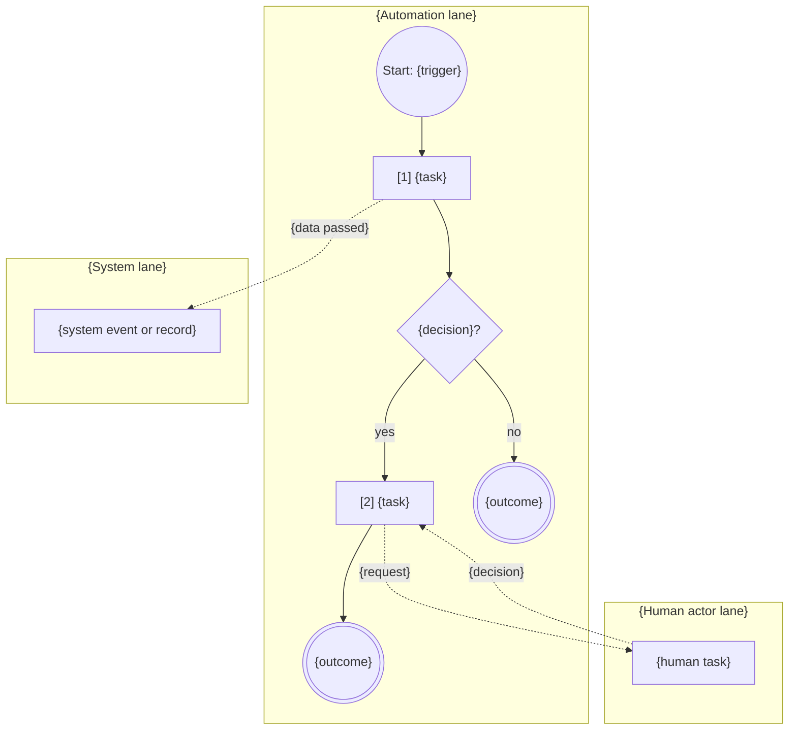
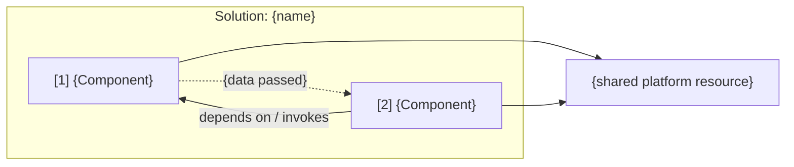

<!-- UIPATH-AUTOMATION-GENOME: process | This file is the high-level build specification for a multi-component
     UiPath automation. Each component has its own genome in the sibling folder named in Components.
     Do NOT execute these steps directly. Use the UiPath skills referenced in Components to build. -->

# Genome: {Process Name}

> {One-line description of the end-to-end process}

> **This is a UiPath automation blueprint.** Do not execute these steps directly. Build each component with the skill named in **Components**, then wire them per **Handoffs** and **Deployment**.

## Overview

{2-4 paragraphs: business process, why it is automated, who owns it, volumes and cadence, what "done" means end to end.}

## Actors and Systems

| Actor / System | Role | Notes |
|----------------|------|-------|
| {e.g. Accounts Payable clerk} | {Human — validates exceptions} | {where they work: Action Center, email} |
| {e.g. SAP S/4HANA} | {System — ERP posting target} | {access method} |

## Components

| # | Component | Type | Skill | Genome | Summary |
|---|-----------|------|-------|--------|---------|
| 1 | {Component name} | {BPMN process / Flow / RPA process / Agent / API workflow / Coded app / Function / Case plan} | `{uipath-skill}` | `{process-slug}-genome/{slug}-genome.md` (as a markdown link) | {one line} |

Build order follows the table unless **Handoffs** requires otherwise.

## Process Map

{Numbered high-level stages. Each names the component that runs it and the exit condition.}

1. **{Stage}** — {component #}: {what happens}; exits when {condition}.
2. **{Stage}** — {component #}: …

BPMN-style process view — one lane per actor or system; circles are start and end events, rectangles tasks (prefixed with the component number), diamonds gateways, dashed arrows message or data flows across lanes.

Component view — build-time dependencies only; never mix them into the process view:

*When the customer needs a formal model, add a BPMN 2.0 sidecar `{process-slug}-process.bpmn` authored from this Process Map with `uipath-maestro-bpmn`, and link it here.*

## Handoffs

| From | To | Mechanism | Data passed | Failure behaviour |
|------|----|-----------|-------------|-------------------|
| {Component 1} | {Component 2} | {Queue item / Start job / Flow invoke / Event / File / Action Center task} | {fields, schema, file type} | {retry, dead-letter, escalation} |

## Platform Dependencies

| Resource | Type | Shared by | Purpose |
|----------|------|-----------|---------|
| {e.g. InvoiceQueue} | Queue | {components} | {purpose} |

## Configuration Questions

{Process-wide questions. Component-specific questions live in the component genomes.}

1. {Question}? (default: {value})

## Business Rules

{Cross-cutting rules only. Rules scoped to one component stay in that component's genome.}

- {Rule}

## Error Handling and Recovery

{Cross-component failure modes: a downstream component is unavailable, an item is stuck between components, partial completion, compensation.}

- {Failure}: {recovery}

## Acceptance Criteria

{End-to-end criteria that span components. Component-level criteria stay in the component genomes.}

- [ ] Given {input at the process entry}, {observable outcome at the process exit} within {time or condition}
- [ ] When {component} fails at {stage}, {recovery behaviour is observable}

## Deployment

- **Packaging:** {single solution (`uipath-solution`) / independent packages} — {solution name}
- **Entry points and triggers:** {schedule, queue trigger, connector trigger, manual}
- **Environments:** {folders, tenants, feeds}

## Complexity

{medium | complex}

## Tags

{comma-separated: domain, applications, platform features}

## Source Map

*Extraction only — omit for authored genomes.*

| Component | Source artifact | Notes |
|-----------|-----------------|-------|
| {Component} | {Source framework}: {project / solution / object} | {ambiguity or unresolved reference} |
