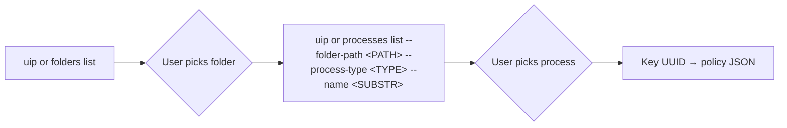

# Resource Lookup Guide

How to resolve human-readable process / folder / user names into the UUIDs the access-policy JSON requires. Run these when the user says things like "the Invoice Agent", "the Production Flow in Shared", or "the build-bot service account" without supplying a UUID — never guess a UUID, and never ask the user to leave the chat to find one unless the lookup returns no match.

> For full option details on any command, use `--help` (e.g., `uip or processes list --help`).

> **When to use this guide**
>
> - Phase 1 ([planning-arch.md](./planning-arch.md)) — the **Resources** / **Actor Process** / **Actor Identity** summary references a specific named entity but the user did not supply its UUID.
> - Phase 2 ([planning-impl.md](./planning-impl.md)) — composing a `selectors[].values`, `executableRule.values[].values`, or `actorRule.values[].values` array that needs specific UUIDs.
> - Update flow, when the user wants to add a specific process or identity to an existing block.

All commands assume the user is already logged in (`uip login status --output json`). Every command uses `--output json` so the agent can parse the result programmatically.

---

## Common flags (every `uip or ... list` command)

`--output json`, `--limit`, `--offset`, `--order-by`, and `--login-validity` are shared with `uip gov access-policy` — see [access-policy-commands.md § Common flags](./access-policy-commands.md#common-flags-shared-across-uip-list-commands) for the canonical descriptions. The `uip or`-only flags below extend that set:

| Flag | Purpose |
|------|---------|
| `--output-filter <expr>` | JMESPath filter on the JSON response (e.g. `"Data[?contains(Name, 'Invoice')].Key"`). |
| `--all-fields` | Returns the full DTO instead of the curated summary — use when you need a field not shown by default (e.g. confirming the exact `ProcessType` string). |
| `--tenant <name>` | Override the tenant selected during `uip login`. Rarely needed. |

> Default `--limit` for `uip or ... list` is 50 (max typically 1000); `uip gov access-policy list` defaults to 20.

### Pagination

List responses include a `Pagination` block with `Returned`, `Limit`, `Offset`, and `HasMore`. When `HasMore == true`, increment `--offset` by `--limit` and fetch again until `HasMore == false` or `Returned < Limit`. If the user's tenant has hundreds of processes, prefer a **server-side filter** (`--process-type`, `--name`) over paging through everything.

---

## 1. Processes (Resource or Actor Process UUIDs)

`uip or processes list` returns Orchestrator processes filtered by folder and process type. The returned `Key` field is the UUID you paste into the policy JSON.

### The two-step lookup — folders first, processes second

**Processes are folder-scoped** — `uip or processes list` **requires** `--folder-path` (or `--folder-key`). If the user has not said which folder the process lives in, do NOT guess a folder name. Run folder discovery first, present the folder list, and ask the user to pick before searching for the process.



**Step 1 — list folders.** See [§ 2 Folders](#2-folders) for the command and filter patterns. Grab `FullyQualifiedName` (e.g. `"Shared"`, `"Prod/Agents"`) for the next step.

**Step 2 — list processes in that folder:**

```bash
uip or processes list \
  --folder-path "<FOLDER_PATH>" \
  --process-type "<ORCHESTRATOR_PROCESS_TYPE>" \
  --name "<SUBSTRING>" \
  --limit 50 \
  --output json
```

| Flag | Required? | Purpose |
|------|-----------|---------|
| `--folder-path "<PATH>"` **or** `--folder-key "<UUID>"` | **Yes (one of)** | Mandatory. Processes are folder-scoped; the command fails without it. Use `FullyQualifiedName` from `uip or folders list` for `--folder-path`. |
| `--process-type "<TYPE>"` | Recommended | Filters server-side by Orchestrator `ProcessType` — narrows to the right access-policy block (see mapping below). Note the Orchestrator value is **different** from the access-policy enum. |
| `--name "<SUBSTRING>"` | Optional | Case-insensitive substring match on the process name. Use whenever the user named the process ("the Invoice agent" → `--name "Invoice"`). |

### Access-policy type → Orchestrator `--process-type`

The access-policy `resourceType` / `executableRule.values[].type` enums are **not the same strings** as Orchestrator's `ProcessType`. You must translate before passing `--process-type`. The table below is the authoritative mapping (confirmed against the `ProcessType` field returned by the Releases API):

| Access-policy type | Orchestrator `--process-type` value | Block(s) | Notes |
|--------------------|-------------------------------------|----------|-------|
| `Agent` | `Agent` | Selection Rule, Actor Process Rule | Same string on both sides. |
| `AgenticProcess` | `ProcessOrchestration` | Selection Rule, Actor Process Rule | **Rename** — Orchestrator calls maestro / agentic processes `ProcessOrchestration`. |
| `RPAWorkflow` | `Process` | **Selection Rule only** — not valid as Actor Process | **Rename** — Orchestrator's legacy RPA process is just `Process`. |
| `APIWorkflow` | `Api` | **Selection Rule only** — not valid as Actor Process | **Rename** — Orchestrator uses `Api`, not `ApiWorkflow`. |
| `CaseManagement` | `CaseManagement` | Selection Rule, Actor Process Rule | **Unconfirmed** — likely same string but not verified against the Releases API. Re-run with `--all-fields` on first use to confirm, and update this row if it drifts. |
| `Flow` | `Flow` | Selection Rule, Actor Process Rule | **Unconfirmed** — likely same string but not verified against the Releases API. Re-run with `--all-fields` on first use to confirm, and update this row if it drifts. |

> **Verify if in doubt.** If a lookup returns zero rows for a `--process-type` value and the user is sure the process exists, re-run with `--all-fields` (and drop `--process-type`), then inspect the `ProcessType` string in the response to confirm the exact enum the tenant uses. Fix the mapping row here if you find a drift.

### Response shape (default)

```json
{
  "Code": "ProcessList",
  "Data": [
    {
      "Key": "c3d4e5f6-0000-0000-0000-000000000001",
      "Name": "InvoiceProcessing",
      "ProcessKey": "InvoiceProcessing",
      "ProcessVersion": "1.0.2",
      "Description": "",
      "IsLatestVersion": true
    }
  ]
}
```

- `Key` — the **process UUID** to paste into the policy JSON. Use it as `selectors[].values[i]` when this process is the Resource being protected, or as `executableRule.values[j].values[i]` when this process is the Actor Process. This is the API-expected identifier — **not** the folder UUID, **not** `ProcessKey` (which is a dotted string identifier, not a UUID), and **not** `ProcessVersion`.
- `Name` — the human-readable name. Present this to the user when asking them to confirm a match.
- `ProcessKey` / `ProcessVersion` — informational only. The access-policy API does not accept these in `values`.

> **"Process" vs "Release".** The CLI says "process"; the Orchestrator REST API calls it a "Release". Same entity. `Key` from `processes list` equals the `Key` from `/odata/Releases` — both are valid process UUIDs to paste into the policy.

### Presenting matches to the user

When multiple candidates come back, show them as a compact table and ask the user to pick. **Never silently pick the first row.**

```text
Found 3 processes matching "Invoice" in folder "Shared":

  #  Name                          Version   Key (UUID)
  1  InvoiceProcessing             1.0.2     c3d4e5f6-0000-...-0001
  2  InvoiceProcessing-staging     1.0.1     c3d4e5f6-0000-...-0002
  3  InvoiceApproval               0.9.0     c3d4e5f6-0000-...-0003

Which one do you want to add to the policy? (1 / 2 / 3 / none)
```

If no matches, report the miss plainly and offer to broaden the search (drop `--name`, switch folder, drop `--process-type`) before giving up.

### Get a single process by UUID

Use this to confirm a UUID the user already supplied (e.g. from a previous policy or an Orchestrator URL):

```bash
uip or processes get "<PROCESS_UUID>" --output json
```

No folder context required — the UUID is globally unique.

---

## 2. Folders

Folders are **tenant-scoped**. Run this first when the user names a folder ("the Shared folder", "Prod/Agents") without giving the exact path, or when `processes list` fails with a folder-not-found error.

```bash
uip or folders list --output json
```

Parse `.Data[]` for `FullyQualifiedName` (e.g. `"Shared"`, `"Prod/Agents"`) and `Key` (the UUID). Either value works as `--folder-path` / `--folder-key` on subsequent calls. Prefer `--folder-path` in chat transcripts — it is human-readable.

Filter client-side with `--output-filter` when the tenant has many folders:

```bash
uip or folders list \
  --output json \
  --output-filter "Data[?contains(FullyQualifiedName, 'Prod')]"
```

---

## 3. Users (Actor Identity UUIDs)

For the `actorRule.values[].type: "User"` entry, resolve user names to UUIDs with:

```bash
uip or users list --output json
```

Parse `.Data[]` for `Key` (UUID), `UserName`, and `Name`. Filter client-side when the tenant is large:

```bash
uip or users list \
  --output json \
  --output-filter "Data[?contains(UserName, 'admin')]"
```

For the currently authenticated user (useful when the intent is "only me"):

```bash
uip or users current --output json
```

### Robots resolve to `type: User`

A robot is a kind of user in the UiPath identity model (Critical Rule #16). To use a robot in `actorRule`, the policy emits `type: "User"` with the robot's **linked user UUID**, never `type: "Robot"`. Resolve the robot to its user identity in three steps:

1. **Ask for the robot's linked username / email** from Orchestrator or Admin. Do not bypass the CLI by sourcing auth tokens into direct REST calls.
2. **Resolve the username / email to a User UUID** with `uip or users list --output json --output-filter "Data[?UserName == '<USERNAME>']"`. The user `Key` is the UUID to use in the policy.
3. **Emit `type: "User"`** in the policy JSON — see [plugins/actor/impl.md — Example E](./plugins/actor/impl.md#e-robot-only-trigger-resolves-to-user).

If the robot has no linked user (rare for modern Orchestrator deployments), surface this as an Open question on the Phase 1 Spec and stop — do not invent a UUID.

### Groups — no `uip or` wrapper

`Group` is supported in `actorRule.values[].type` but has no `uip or` wrapper today. Ask the user to paste the Group UUID from the Admin portal and surface it as an **Open question** on the Phase 1 Spec until supplied. Never fabricate.

### ExternalApplication — not supported

`ExternalApplication` is not a valid `actorRule.values[].type` today (Critical Rule #16). If the user names a service principal / S2S app / registered application, refuse and route them to one of these workarounds:
- Use the `User` account that the application authenticates as.
- Use a `Group` containing the application's identity.
- Omit the Actor Identity rule entirely so the policy applies regardless of identity.

---

## 4. Resource Catalog tags

Resource Catalog tags are tenant-scoped labels that feed `selectors[].tags.values[]` and `executableRule.tags.values[]` (see [plugins/tags/impl.md](./plugins/tags/impl.md)). A policy that references a tag name not present in the **policy's tenant** silently matches nothing at runtime — always verify before approving the Spec.

### Default call

```bash
uip admin rcs tag list --output json
```

With no `--tenant`, the command targets the tenant in the current `uip login` context — and that is **also** the tenant the access policy will be authored in (the policy's `tenantId` comes from the safe auth-context workflow). This default is the only mode that proves a tag will resolve at evaluation time. Run it before approving any Spec or update that introduces a tag the user named; if the tag is missing from `Data.value[].displayName`, prompt the user to pick a returned tag, or to add the missing one to the Resource Catalog of the policy's tenant before retrying. Never invent a tag, and never silently substitute a near-match.

| Flag | Required? | Purpose |
|------|-----------|---------|
| `--type Label\|KeyValue` | Optional | Defaults to `Label` (the type used by `tags.values[]` in `ToolUsePolicy` access policies). Pass `KeyValue` only when the user is asking about key/value tags, which the access-policy schema does **not** consume. |
| `--starts-with <PREFIX>` | Optional | Server-side prefix filter (case-insensitive on `normalizedName`). Use whenever the user named a tag substring ("anything starting with prod"). |
| `--limit <N>` | Optional | Page size (default `100`). |
| `--skip <N>` | Optional | Row offset (default `0`). |
| `--tenant <NAME>` | Optional | **Targets a different tenant in the same organization.** Do NOT pass this when verifying tags for the policy under construction — see [Tenant alignment](#tenant-alignment) below. |

### Response shape

```json
{
  "Code": "RcsTagList",
  "Data": {
    "count": 2,
    "value": [
      { "displayName": "Production", "normalizedName": "production" },
      { "displayName": "Development", "normalizedName": "development" }
    ]
  }
}
```

- `displayName` — the value to paste into `tags.values[]` in the policy JSON. The existing skill examples (e.g. `Production`, `Development`, `PII`) all use this form verbatim.
- `normalizedName` — informational; what `--starts-with` matches against. Do not put this into the policy JSON.

### Tenant alignment

The access-policy `tenantId` is gathered from the safe auth-context workflow and pinned at `create` time — the policy can only ever resolve tags from **that** tenant at evaluation.

- **Default (no `--tenant`)** — verify tags for the in-flight policy. Use this for every Phase 1 / Phase 2 confirmation prompt.
- **`--tenant <OTHER_NAME>`** — comparison only (e.g. "do these tag names also exist in our staging tenant?"). Never use a result from another tenant as evidence that a tag will work in the policy's tenant. If the user explicitly asks to check a different tenant, run the call but surface a one-line warning: `Tags from <OTHER_NAME> do not affect a policy authored in <POLICY_TENANT>; copy the tag in the Resource Catalog of <POLICY_TENANT> if it is missing there.`

To recover the policy's tenant name for the warning above, prefer login status:

```bash
uip login status --output json
```

---

## 5. Robot lookups resolve to User identity

`Robot` lookups are not wrapped by `uip or` in all CLI versions. Do **not** bypass the CLI by sourcing auth tokens into direct REST calls from this skill. Instead, resolve robot intent through the linked user identity:

1. Ask the user for the robot's linked username, email, or user display name as shown in Orchestrator / Admin.
2. Run `uip or users list --output json` with the broadest safe filter the CLI supports, then match the returned user record.
3. Use the User UUID in `actorRule.values[]` with `type: "User"`.
4. If the user cannot identify the linked user, treat the robot identity as a blocking Open question in the Phase 1 Spec. Do not fabricate a UUID and do not print auth tokens while troubleshooting.

| Identity type | Endpoint / source | What to do with it |
|---------------|------------------|--------------------|
| **Robot** (intermediate lookup) | User-supplied linked username / email from Orchestrator or Admin | Resolve username / email → User UUID via `uip or users list`, then emit `type: "User"`. |
| **Group** | Identity service — ask the user to paste the UUID from Admin portal | Use directly as `type: "Group"`. |

If `uip or users list` returns an authorization error, ask the user to `uip login` and retry. Never commit or echo tokens.

---

## 6. When the lookup still cannot resolve the name

1. **Surface the miss** — tell the user exactly which query you ran and what came back empty. Include the folder, `--process-type`, and `--name` values you used.
2. **Suggest broadening the search** — drop `--process-type`, drop `--name`, try a parent folder.
3. **Never fabricate a UUID.** If the lookup fails and the user cannot supply one, pause the flow and treat the missing UUID as a blocking **Open question** on the Phase 1 Spec (see [planning-arch.md](./planning-arch.md) — Open questions).

---

## 7. Recap — one command per lookup type

> Processes are folder-scoped — always run [§ 2 Folders](#2-folders) first if you do not know the folder path. Translate the access-policy type to the Orchestrator `--process-type` using the [mapping table above](#access-policy-type--orchestrator---process-type) before calling `processes list`.

| I need to find... | Command |
|-------------------|---------|
| A folder path / UUID by display name | `uip or folders list --output json` → filter on `FullyQualifiedName` |
| A process / agent / flow / case-management UUID by name | `uip or processes list --folder-path "<PATH>" --process-type "<ORCHESTRATOR_TYPE>" --name "<SUBSTR>" --output json` — paste the response's `Key` into `values[]`. Do not use `ProcessKey` (dotted string), `ProcessVersion`, or the folder UUID. |
| All processes of a given access-policy type in a folder | `uip or processes list --folder-path "<PATH>" --process-type "<ORCHESTRATOR_TYPE>" --output json` — paste each row's `Key` into `values[]`. |
| Details on a specific process UUID | `uip or processes get "<UUID>" --output json` |
| A user UUID by username / display name | `uip or users list --output json` → filter on `UserName` or `Name` |
| The currently authenticated user's UUID | `uip or users current --output json` |
| A Resource Catalog tag name (for `tags.values[]`) | `uip admin rcs tag list --output json` — paste each row's `displayName` into `tags.values[]`. Do NOT pass `--tenant` when verifying tags for the policy under construction (see [§ 4 Tenant alignment](#tenant-alignment)). |
| A robot's User UUID (for `actorRule`) | Ask for the robot's linked username / email from Orchestrator or Admin (see [§ 5](#5-robot-lookups-resolve-to-user-identity)), then `uip or users list --output json` to resolve that identity → User UUID |
| A group UUID | Admin portal — paste into the Phase 1 Spec as an Open question |
| An external application UUID | **Not supported** by access policies today (Critical Rule #16) — route to a `User` or `Group` workaround |
