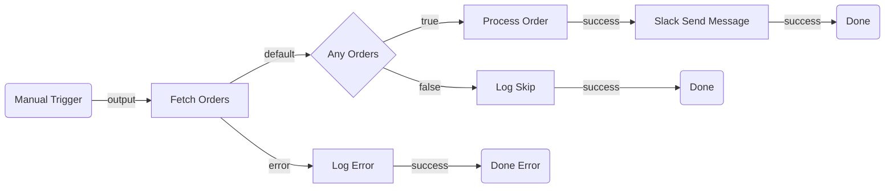
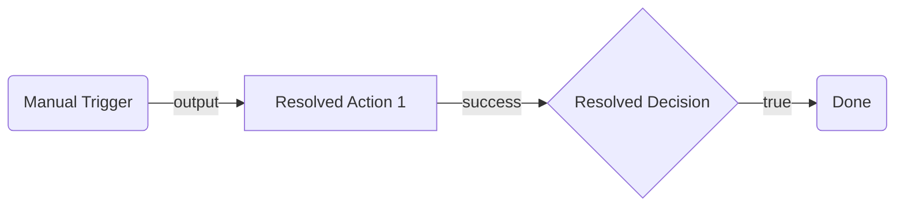

# Planning Guide: Discovery, Design & Implementation

Discover available capabilities, design the flow topology, and resolve all implementation details — producing a build-ready plan. This guide covers two phases:

1. **Phase 1 — Architectural Design**: Select node types, define edges, generate a mermaid diagram
2. **Phase 2 — Implementation Resolution**: Validate against the registry, resolve connections and references, finalize values

> **Registry rules by phase:**
> - **Phase 1:** `registry search` and `registry list` are ALLOWED for discovery. `registry get` is NOT allowed.
> - **Phase 2:** `registry get` is REQUIRED for every node type. `registry pull --force` before starting.

---

## Phase 1: Architectural Design

### Process

1. Analyze the user's requirements
2. **Discover capabilities** — if the flow uses connector or resource nodes, run `registry search` / `registry list` to confirm they exist and identify available operations (see [Capability Discovery](#capability-discovery))
3. Select node types from the [Plugin Index](#plugin-index) below — read each relevant plugin's `guide.md` for selection heuristics, ports, and key inputs
4. Define edges (how nodes connect) — see [Wiring Rules](#wiring-rules) and each plugin's port documentation
5. Identify suspected inputs and outputs for each node
6. Generate a mermaid diagram
7. Validate the mermaid syntax (see [Mermaid Validation Rules](#mermaid-validation-rules))
8. Present the plan for user review
9. Iterate until approved, then proceed to [Phase 2](#phase-2-implementation-resolution)

---

## Capability Discovery

**When to run:** The flow uses connector nodes (external services) or resource nodes (RPA processes, agents, other flows). **Skip** if the flow only uses OOTB nodes (scripts, HTTP, branching, loops).

Discovery answers "what can I work with?" before you commit to a topology. This prevents designing around a connector that doesn't exist, an operation the connector doesn't support, or an RPA process / agent that hasn't been published yet.

```bash
# Registry should already be refreshed (Step 3 in Quick Start runs `registry pull`)
uip maestro flow registry search <keyword> --output json    # search by service, resource name, or category
uip maestro flow registry search outlook --output json       # example: does an Outlook connector exist?
uip maestro flow registry search "invoice process" --output json  # example: is an RPA process published?
uip maestro flow registry search agent --output json         # example: what agents are available?
uip maestro flow registry list --output json                 # list all available node types
```

> **Auth note:** Without `uip login`, the registry shows OOTB nodes only. After login, tenant-specific connector and resource nodes are also available. If the flow requires connectors or resources, verify login status first: `uip login status --output json`.

**In-solution discovery (no login required):**
```bash
uip maestro flow registry list --local --output json     # discover sibling projects in the same .uipx solution
```
Run from inside the flow project directory. If the resource (RPA, agent, flow, API workflow) exists as a sibling project in the same solution, it appears here without needing to be published. Prefer in-solution resources over mock placeholders.

### Check Connector Connections

For each connector found in registry search, verify a healthy connection exists. See [plugins/connector/guide.md](plugins/connector/guide.md) for the full connection check workflow.

```bash
uip is connections list "<connector-key>" --output json
```

- If a default enabled connection exists (`IsDefault: Yes`, `State: Enabled`), record the connection ID for Phase 2.
- **If no connection exists**, surface it in the **Open Questions** section of the architectural plan so the user can create it while reviewing. Creating a connection may involve OAuth flows or admin approval — front-loading this avoids blocking Phase 2.

> This is a lightweight existence check, not full connection binding. Phase 2 will ping the connection, fetch enriched metadata, and resolve reference fields.

**What to record from discovery:**
- **Connectors:** Whether a connector exists for each external service, available operations (from node type names), and whether a healthy connection exists. Field details require `registry get --connection-id` in Phase 2.
- **Resources:** Whether a published or in-solution node exists for each RPA process, agent, or flow referenced in the requirements. Check in-solution first (`registry list --local`), then the tenant registry. Input/output schemas require `registry get` (with `--local` for in-solution) in Phase 2.
- **Gaps:** Services with no connector -> fall back to `core.action.http`. Resources in the same solution but unpublished -> use `--local` discovery (no mock needed). Resources not in the solution and not yet published -> use `core.logic.mock` placeholder. Connectors with no connection -> flag in Open Questions for the user to create.

Use these findings to select the right node types from the [Plugin Index](#plugin-index). If a connector doesn't exist, fall back to `core.action.http` or note it as a gap in Open Questions.

> **Do NOT run `registry get` during discovery.** Search results give you node type names — enough to know what connectors and operations exist. `is connections list` confirms connection availability. Detailed field metadata (required fields, types, enums, reference resolution) requires `registry get --connection-id` and belongs to Phase 2.

---

## Plugin Index

Each plugin has a `guide.md` with full selection heuristics, ports, key inputs, JSON structure, and configuration. **Read the relevant plugin's guide.md** when selecting that node type for your flow.

### Triggers

| Node Type | Plugin | When to Select |
| --- | --- | --- |
| `core.trigger.manual` | _(inline — no plugin)_ | Flow is started on demand by a user or API call |
| `core.trigger.scheduled` | [scheduled-trigger](plugins/scheduled-trigger/guide.md) | Flow runs on a recurring schedule |
| IS connector trigger | [connector-trigger](plugins/connector-trigger/guide.md) | Flow starts when an external event fires (e.g., email received, issue created). Node type: `uipath.connector.trigger.<key>.<trigger>` |

**Rules:**
- Every flow must have exactly one trigger node
- The trigger is always the first node in the topology
- IS connector triggers replace the manual trigger as the start node — they cannot coexist with `core.trigger.manual` or `core.trigger.scheduled`
- `core.trigger.manual` has no inputs and outputs on port `output` — it is simple enough to use without a plugin reference

### Actions

| Node Type | Plugin | When to Select |
| --- | --- | --- |
| `core.action.script` | [script](plugins/script/guide.md) | Custom logic, data transformation, computation, formatting |
| `core.action.http.v2` | [http](plugins/http/guide.md) | Call a REST API — connector mode (IS auth) or manual mode (raw URL). Replaces deprecated `core.action.http` |
| `core.action.transform` | [transform](plugins/transform/guide.md) | Declarative map, filter, or group-by on a collection |
| `core.logic.delay` | [delay](plugins/delay/guide.md) | Pause execution for a duration or until a specific date |
| `core.action.queue.create` | [queue](plugins/queue/guide.md) | Distribute work to robots — fire-and-forget |
| `core.action.queue.create-and-wait` | [queue](plugins/queue/guide.md) | Distribute work to robots — wait for result |
| `uipath.human-in-the-loop` | [hitl](plugins/hitl/guide.md) | Pause flow for a human to review, approve, or fill in data — inline schema, no app required |

### Control Flow

| Node Type | Plugin | When to Select |
| --- | --- | --- |
| `core.logic.decision` | [decision](plugins/decision/guide.md) | Binary branching (if/else) based on a boolean condition |
| `core.logic.switch` | [switch](plugins/switch/guide.md) | Multi-way branching (3+ paths) based on ordered case expressions |
| `core.logic.loop` | [loop](plugins/loop/guide.md) | Iterate over a collection of items |
| `core.logic.merge` | [merge](plugins/merge/guide.md) | Synchronize parallel branches before continuing |
| `core.control.end` | [end](plugins/end/guide.md) | Graceful flow completion (one per terminal path) |
| `core.logic.terminate` | [terminate](plugins/terminate/guide.md) | Abort entire flow immediately on fatal error |
| `core.subflow` | [subflow](plugins/subflow/guide.md) | Group related steps into a reusable container with isolated scope |

### Connector Nodes

Connector nodes call external services via Integration Service. They are **not** built-in — they come from the registry after `uip login` + `uip maestro flow registry pull`.

| When to Select | Plugin |
| --- | --- |
| A pre-built connector exists for the target service (Jira, Slack, Salesforce, etc.) | [connector](plugins/connector/guide.md) |

**In this phase:** Use [Capability Discovery](#capability-discovery) to confirm the connector exists and note it as `connector: <service-name>` with the intended operation. Phase 2 resolves the exact type, connection, and fields via [connector/guide.md](plugins/connector/guide.md).

### Agent Nodes

Agent nodes invoke AI agents for reasoning, judgment, or natural language tasks. Two kinds exist — pick based on reuse and lifecycle:

| Node Type Pattern | Plugin | When to Select |
| --- | --- | --- |
| `uipath.agent.autonomous` | [inline-agent](plugins/inline-agent/guide.md) | Agent is defined **inside** this flow project (scaffolded via `uip agent init --inline-in-flow`), tightly coupled to this flow, no separate versioning or cross-flow reuse |
| `uipath.core.agent.{key}` | [agent](plugins/agent/guide.md) | Agent is a **published tenant resource** (appears in the registry after `uip login` + `uip maestro flow registry pull`); reusable across flows, independently versioned |

See [inline-agent/guide.md — Inline vs Published Agent Decision Table](plugins/inline-agent/guide.md#inline-vs-published-agent-decision-table) for the full decision matrix.

### Resource Nodes (External Automations)

Resource nodes invoke published UiPath automations. They are tenant-specific and appear in the registry after `uip login` + `uip maestro flow registry pull`.

| Category | Node Type Pattern | Plugin |
| --- | --- | --- |
| RPA Process | `uipath.core.rpa.{key}` | [rpa](plugins/rpa/guide.md) |
| Agent | `uipath.core.agent.{key}` | [agent](plugins/agent/guide.md) |
| Agentic Process | `uipath.core.agentic-process.{key}` | [agentic-process](plugins/agentic-process/guide.md) |
| Flow | `uipath.core.flow.{key}` | [flow](plugins/flow/guide.md) |
| API Workflow | `uipath.core.api-workflow.{key}` | [api-workflow](plugins/api-workflow/guide.md) |
| Human Task (app-based) | `uipath.core.human-task.{key}` | [hitl](plugins/hitl/guide.md) |

### Placeholders

| Node Type | When to Select |
| --- | --- |
| `core.logic.mock` | Step is TBD, resource doesn't exist yet, or prototyping. Placeholder with `input` -> `output` |

---

## Selecting External Service Nodes

When the flow needs to call an external service, use this decision order — prefer higher tiers:

1. **Pre-built Integration Service connector** — Use when a connector exists and covers the use case. See [connector](plugins/connector/guide.md).
2. **Managed HTTP Request** (`core.action.http.v2`) — connector mode: use when a connector exists but lacks the specific curated activity. Manual mode: use for one-off API calls to services without connectors. See [http](plugins/http/guide.md).
3. **RPA workflow node** — Use only when the target system has no API (legacy desktop apps, terminals). See [rpa](plugins/rpa/guide.md).

---

## Standard Port Reference

Use this when defining edges. Every edge requires a `sourcePort` and `targetPort`.

| Node Type | Input Port(s) | Output Port(s) |
| --- | --- | --- |
| `core.trigger.manual` | — | `output` |
| `core.trigger.scheduled` | — | `output` |
| `uipath.connector.trigger.*` | — | `output` |
| `core.action.script` | `input` | `success`, `error` |
| `core.action.http.v2` | `input` | `default`, `error`, `branch-{id}` (dynamic per `inputs.branches` entry) |
| `core.action.transform` | `input` | `output`, `error` |
| `core.logic.delay` | `input` | `output` |
| `core.logic.decision` | `input` | `true`, `false` |
| `core.logic.switch` | `input` | `case-{id}` (dynamic per case), `default` |
| `core.logic.loop` | `input`, `loopBack` | `success`, `output`, `error` |
| `core.logic.merge` | `input` (multiple) | `output` |
| `core.control.end` | `input` | — |
| `core.logic.terminate` | `input` | — |
| `core.subflow` | `input` | `output`, `error` |
| `core.logic.mock` | `input` | `output` |
| `uipath.agent.autonomous` | `input` | `success`, `error`, `tool`, `context`, `escalation` |
| `uipath.core.agent.*` | `input` | `output`, `error` |
| `uipath.core.rpa.*` | `input` | `output`, `error` |
| `uipath.core.hitl.*` | `input` | `output`, `error` |
| `uipath.core.flow.*` | `input` | `output`, `error` |
| `uipath.core.agentic-process.*` | `input` | `output`, `error` |
| `uipath.core.api-workflow.*` | `input` | `output`, `error` |
| `uipath.connector.*` (activities) | `input` | `output`, `error` |
| `core.action.queue.create` | `input` | `success` |
| `core.action.queue.create-and-wait` | `input` | `success` |
| `uipath.human-in-the-loop` | `input` | `completed` |
| `uipath.core.human-task.{key}` | `input` | `output` |

> **`error` is an implicit source port** on every action node (any node with `supportsErrorHandling: true`). Wire it whenever the flow needs to survive a failed HTTP call, script exception, transform error, agent fault, etc. — otherwise the flow faults as a whole. This is a **different mechanism** from content-based `inputs.branches` on HTTP. See [Implicit error port on action nodes](flow-file-format.md#implicit-error-port-on-action-nodes) for wiring, when it fires, and the decision matrix vs branches/decision/switch.

---

## Wiring Rules

Apply these when defining edges in the topology:

1. Edges connect a **source port** (output) on one node to a **target port** (input) on another
2. Trigger nodes have no input port — they are always edge sources, never targets
3. End/Terminate nodes have no output port — they are always edge targets, never sources
4. Every non-trigger node must have at least one incoming edge
5. Every non-terminal node must have at least one outgoing edge
6. Decision nodes produce exactly two outgoing edges: one from `true`, one from `false`
7. Switch nodes produce one outgoing edge per case + optionally one from `default`
8. Loop nodes: the `loopBack` port receives the edge returning from the last node inside the loop body; `success` fires after all iterations
9. Merge nodes accept multiple incoming edges (one per parallel path being synchronized)
10. Do not create cycles except through Loop's `loopBack` mechanism
11. **No dangling nodes** — every node must be connected by at least one edge. A node with no incoming and no outgoing edges is invalid. Verify every node in the node table appears in the edge table as either a source or target.
12. **Wire the `error` source port whenever the requirements specify a failure fallback** — e.g., "if the call fails", "return X for invalid input", "if the article doesn't exist", "handle timeouts". Without an `error` edge on the action node, the failure faults the whole flow instead of routing to the handler. Applies to every action node in the Standard Port Reference with `error` listed. See [Error Handling](#error-handling-implicit-error-port) and [Implicit error port on action nodes](flow-file-format.md#implicit-error-port-on-action-nodes).

### Port Compatibility

- Edges connect a **source** port (output) on one node to a **target** port (input) on another
- Source handles have `type: "source"`, target handles have `type: "target"`
- You cannot wire two source ports together or two target ports together

### Connection Constraints

Some nodes enforce connection rules via `constraints` in their handle configuration:

| Constraint                               | Meaning                                                         |
| ---------------------------------------- | --------------------------------------------------------------- |
| `minConnections: N`                      | Handle must have at least N edges (validation error if not met) |
| `maxConnections: N`                      | Handle accepts at most N edges                                  |
| `forbiddenSourceCategories: ["trigger"]` | Cannot receive connections from trigger nodes                   |
| `forbiddenTargetCategories: ["trigger"]` | Cannot connect output to trigger nodes                          |

**Key rules:**

- Trigger nodes can only have outgoing connections (no input port)
- End/Terminate nodes can only have incoming connections (no output port)
- Control flow outputs generally cannot loop back to triggers
- Decision and Switch nodes cannot receive connections from agent resource nodes

### Dynamic Ports

Some nodes create ports based on their configuration:

- **HTTP Request** — One port per `branches` entry: `branch-{id}`. See [http/guide.md](plugins/http/guide.md).
- **Switch** — One port per `cases` entry: `case-{id}`. See [switch/guide.md](plugins/switch/guide.md).
- **Loop** — `success` port fires after completion, `output` port carries aggregated results. See [loop/guide.md](plugins/loop/guide.md).

When wiring to dynamic ports, the port ID must match the configured item's `id`.

---

## Common Topology Patterns

Use these as building blocks when designing your flow.

### Linear Pipeline

```
Trigger -> Action A -> Action B -> Action C -> End
```

### Conditional Branch

```
Trigger -> Fetch Data -> Decision
  |-- true -> Process -> End
  |-- false -> Log Skip -> End
```

### Parallel Execution with Merge

```
Trigger -> Prepare
  |-- Call API A --+
  |-- Call API B --+
                   +-- Merge -> Combine -> End
```

### Loop Over Collection

```
Trigger -> Fetch List -> Loop
  |-- [loop body] Process Item -> (loopBack)
  |-- success -> Summarize -> End
```

### Error Handling (implicit `error` port)

Wire the action node's implicit `error` source port directly to a handler — this catches node-level failures (network errors, timeouts, non-2xx HTTP responses, script exceptions, transform faults). Do NOT put a Decision downstream to check for errors — by the time execution reaches the Decision, a failing node has already faulted the flow.

```
Trigger -> HTTP Request
  |-- default -> Process -> End (success)
  |-- error   -> Log Error -> End (error path with descriptive output)
```

Use a downstream Decision/Switch only for **content-based routing on a successful response** (e.g., `items.length > 0`), not as a failure detector. HTTP also supports `inputs.branches` for that. See [Implicit error port on action nodes](flow-file-format.md#implicit-error-port-on-action-nodes) — the `Error port vs other branching` table spells out when to use each.

**Plan the error edge in Phase 1.** If the requirements mention "if the call fails", "invalid input", "article not found", or any failure fallback, add an edge from the action node's `error` port to a handler in the edge table — don't leave it to the build step.

### Orchestration (Mixed Resources)

```
Trigger -> Script (prepare) -> RPA Process (extract) -> Agent (classify) -> Decision
  |-- approved -> Script (format) -> End
  |-- rejected -> Human Task (review) -> End
```

### Scheduled Batch Processing

```
Scheduled Trigger -> HTTP (fetch batch) -> Loop
  |-- Queue Create (per item) -> (loopBack)
  |-- success -> Script (summary) -> End
```

---

## Node Selection Heuristics

Quick decision guide. For full details, read the linked plugin's `guide.md`.

### "I need to call an external service"

1. Is there a connector with a curated activity? Run `uip maestro flow registry list --output json` and check for typed nodes matching `uipath.connector.<key>.<operation>`. If the desired operation appears as a node type, it is a curated activity -> [connector](plugins/connector/guide.md)
2. Connector exists but the operation is not listed as a curated node type? -> `core.action.http.v2` connector mode — see [http](plugins/http/guide.md)
3. No connector exists, but has a REST API? -> `core.action.http.v2` manual mode — see [http](plugins/http/guide.md)
4. No API at all (desktop app, terminal)? -> [rpa](plugins/rpa/guide.md) or `core.logic.mock` if unpublished

### "I need to branch"

- Two paths -> [decision](plugins/decision/guide.md)
- Three or more paths -> [switch](plugins/switch/guide.md)
- Branch on HTTP response status -> [http](plugins/http/guide.md) built-in branches

### "I need to transform data"

- Standard map/filter/group-by -> [transform](plugins/transform/guide.md)
- Custom logic, string manipulation, computation -> [script](plugins/script/guide.md)

### "I need to end the flow"

- Normal completion -> [end](plugins/end/guide.md) (one per terminal path)
- Fatal error, abort everything -> [terminate](plugins/terminate/guide.md)

### "I need to wait"

- Fixed duration -> [delay](plugins/delay/guide.md)
- Wait until a specific time -> [delay](plugins/delay/guide.md)
- Wait for external work to complete -> [queue](plugins/queue/guide.md) (`create-and-wait`)

### "I need human involvement"

- Human approval or data entry -> [hitl](plugins/hitl/guide.md) or `core.logic.mock` if the app doesn't exist

### "I need an AI agent"

- Agent is tightly coupled to this flow, not reused -> [inline-agent](plugins/inline-agent/guide.md) (`uipath.agent.autonomous`)
- Agent is a published tenant resource, reused across flows -> [agent](plugins/agent/guide.md) (`uipath.core.agent.{key}`)

### "The flow needs something outside flow capabilities"

1. Add a `core.logic.mock` placeholder
2. Note what needs to be created and which skill handles it:
   - Desktop/browser automation or coded workflow (C#) -> `uipath-rpa`
   - Agent -> `uipath-agents`
3. Phase 2 will check whether the resource has been published and replace the mock

---

## Phase 1 Output Format

Generate a `<SolutionName>.arch.plan.md` file in the **solution directory** (the folder containing the `.uipx` file, not the project subfolder). The plan covers the entire solution — which may contain multiple projects in the future.

### 1. Summary

2-3 sentences describing what the flow does end-to-end.

### 2. Flow Diagram (Mermaid)

A mermaid flowchart showing all nodes, edges, and branching logic.

**Requirements:**

- Use `graph LR` (left-right) for all flows — Flow uses a horizontal canvas. Do NOT use `graph TD` (top-down) — it produces vertical diagrams that conflict with the horizontal node layout. Do NOT use `flowchart` — it is not supported by all mermaid renderers.
- Use `subgraph` blocks to group related sections — required for flows with 10+ nodes
- Label every edge with the port name (e.g., `-->|success|`, `-->|true|`, `-->|false|`)
- **Labels must be plain text only** — no special characters inside shape delimiters. The following break mermaid parsing:
  - `>` and `<` (interpreted as shape operators or HTML) — replace with words like "over" or "under"
  - `(`, `)`, `[`, `]`, `{`, `}` (conflict with shape delimiters)
  - `:`, `;`, `?`, `&`, `"` (unreliable across renderers)
  - Use plain alphanumeric text and spaces only
- Do NOT put node types in diagram labels — node types belong in the Node Table only
- Do NOT use quotes inside shape delimiters — use `[Text]` not `["Text"]`
- Use only these universally supported node shapes:
  - Triggers: rounded rectangle `(Trigger Name)`
  - Actions: rectangle `[Action Name]`
  - Control flow: diamond `{Decision Name}` for Decision/Switch
  - End/Terminate: rounded rectangle `(Done)`
  - Connectors: rectangle `[Connector Service Operation]`
  - Placeholders: rectangle `[Mock Description]`

**Example:**

````markdown

````

### 3. Node Table

| # | Node ID | Name | Category | Node Type | Inputs | Outputs | Notes |
| --- | --- | --- | --- | --- | --- | --- | --- |
| 1 | trigger | Manual Trigger | trigger | `core.trigger.manual` | — | Trigger event | — |
| 2 | fetchOrders | Fetch Orders | action | `core.action.http.v2` | `method: GET`, `url: <ORDERS_API_URL>` | `output.body` (order list), `error` (on HTTP failure) | Phase 2: confirm URL and auth |
| 3 | checkHasOrders | Any Orders | control | `core.logic.decision` | `expression: $vars.fetchOrders.output.body.length > 0` | Routes to `true` or `false` | — |
| 4 | logError | Log Error | action | `core.action.script` | `script: return { message: $vars.fetchOrders.error.message };` | `output.message` | Handles failed HTTP call |

**Column definitions:**

- **Node ID**: Short camelCase identifier used in the mermaid diagram and edge table
- **Inputs**: Best-guess input values based on user requirements. Use `<PLACEHOLDER>` for values Phase 2 must resolve (URLs, IDs, connection details)
- **Outputs**: What downstream nodes are expected to consume via `$vars.{nodeId}.*`
- **Notes**: Implementation concerns for Phase 2 (e.g., "Phase 2: resolve Jira project ID", "Phase 2: bind Slack connection")

### 4. Edge Table

| # | Source Node | Source Port | Target Node | Target Port | Condition/Label |
| --- | --- | --- | --- | --- | --- |
| 1 | trigger | output | fetchOrders | input | — |
| 2 | fetchOrders | default | checkHasOrders | input | Call succeeded |
| 3 | fetchOrders | error | logError | input | HTTP failure fallback |
| 4 | checkHasOrders | true | processOrder | input | Has orders |
| 5 | checkHasOrders | false | logSkip | input | No orders |

> **Always include an `error`-port edge in the edge table whenever the requirements describe a failure fallback** (e.g., "return X if the API fails", "route to Y if the article doesn't exist", "handle timeouts gracefully"). Without the edge, the flow faults on failure instead of routing to the handler. See [Error Handling (implicit `error` port)](#error-handling-implicit-error-port).

**Rules:**

- Source/target ports must match the [Standard Port Reference](#standard-port-reference)
- Every node (except the trigger) must appear as a target at least once
- Every node (except End/Terminate) must appear as a source at least once

### 5. Inputs & Outputs

| Direction | Name | Type | Description |
| --- | --- | --- | --- |
| `in` | ordersApiUrl | `string` | Base URL for the orders API |
| `out` | processedCount | `number` | Number of orders successfully processed |
| `inout` | errorLog | `array` | Accumulates error messages across the flow |

### 6. Connector Summary (omit if no connectors)

| Node ID | Service | Intended Operation | Phase 2 Action |
| --- | --- | --- | --- |
| notifySlack | Slack | Send message to channel | Resolve connector key, bind connection, resolve channel ID |
| createTicket | Jira | Create issue | Resolve connector key, bind connection, resolve project/issue type IDs |

### 7. Open Questions (omit if none)

Prefix each with `**[REQUIRED]**` or `**[OPTIONAL]**`:

- **[REQUIRED]** Which Slack channel should notifications go to?
- **[OPTIONAL]** Should the error handler retry before terminating?

---

## Mermaid Validation Rules

LLM-generated mermaid frequently contains syntax errors. After generating the diagram, **check every rule below** before presenting it to the user. Fix violations before outputting.

### Syntax Rules

1. **First line must be `graph LR`** (horizontal — matches the Flow canvas) — use `graph` not `flowchart` (the `flowchart` keyword is not supported by all renderers).
2. **Node IDs must be alphanumeric + underscores only** — no hyphens, dots, or spaces in IDs. Use `fetchData` not `fetch-data` or `fetch.data`
3. **Node IDs must not start with or equal a reserved word** — mermaid reserves these as keywords: `end`, `subgraph`, `graph`, `flowchart`, `direction`, `click`, `style`, `classDef`, `class`, `linkStyle`, `callback`, `default`. IDs that start with these (e.g., `endWarm`, `defaultPath`, `styleNode`) break the parser. Use alternatives like `warmEnd`, `pathDefault`, `nodeStyle` — or use a prefix like `done_warm`, `finish_warm`.
4. **Node labels must be plain text** — no quotes inside shape delimiters. Use `A[Fetch Data]` not `A["Fetch Data"]`.
5. **No special characters in labels** — these break mermaid parsing even when quoted:
   - `>` and `<` (interpreted as shape operators or HTML) — replace with words like "over" or "under"
   - `(`, `)`, `[`, `]`, `{`, `}` (conflict with shape delimiters)
   - `:`, `;`, `?`, `&`, `"` (unreliable across renderers)
   - Use plain alphanumeric text and spaces only
6. **Use only universally supported shapes** — `(text)` for rounded rectangle, `[text]` for rectangle, `{text}` for diamond. Do NOT use `([text])` (stadium), `{{text}}` (hexagon), or other extended shapes — they are not supported by all renderers.
7. **Edge labels use `|label|` between arrow and target** — `A -->|success| B` not `A -->success B` or `A --success--> B`
8. **No empty labels** — `A --> B` is fine, but `A -->|| B` is invalid
9. **Subgraph IDs must be unique** and not collide with node IDs
10. **Subgraph blocks must be closed** — every `subgraph` needs a matching `end`
11. **No semicolons** — mermaid uses newlines, not semicolons, to separate statements
12. **No blank lines inside the mermaid block** — blank lines between node definitions and edges can prevent rendering in some mermaid implementations. Keep all lines contiguous.

### Structural Rules

1. **Every node defined must be connected** — no orphan nodes floating in the diagram
2. **Edge directions must match the flow** — trigger at the top, End at the bottom (for TB layouts)
3. **Decision nodes must show both branches** — `true` and `false` edges, each labeled
4. **Switch nodes must show all case edges** — one per case plus optional default
5. **Loop structures**: show the loop body and the loopBack edge returning to the loop node
6. **Parallel branches** must visually fork from one node and converge at a Merge node

### Validation Procedure

After generating the mermaid block:

1. First line is `graph LR` — not `flowchart`
2. Check each node ID contains only `[a-zA-Z0-9_]`
3. Check no node ID starts with or equals a reserved word (`end`, `subgraph`, `graph`, `flowchart`, `direction`, `click`, `style`, `classDef`, `class`, `linkStyle`, `callback`, `default`)
4. Check no labels contain `>`, `<`, `:`, `;`, `?`, `&`, `(`, `)`, or quotes — replace with plain words
5. Only `(text)`, `[text]`, and `{text}` shapes are used — no `([text])`, `{{text}}`, or other extended shapes
6. Check each edge has valid `-->`, `-->|label|` syntax
7. Check all subgraphs are closed
8. Verify every node in the node table appears in the diagram
9. Verify every edge in the edge table appears in the diagram
10. Check for blank lines inside the mermaid block — remove any empty lines between statements
11. If any rule is violated, fix it before outputting

---

## Phase 2: Implementation Resolution

> **Prerequisite:** The user must have explicitly approved the architectural plan (`.arch.plan.md`) before starting this phase.
>
> **Always validate with the registry,** even for OOTB nodes. This phase ensures that every node type (built-in or connector-based) is confirmed against the current registry state. Port names, input requirements, and output schemas can change — do not assume OOTB nodes match the planning guides without verification.

### Step 1 — Identify Nodes and Validate with Registry

Scan the approved `.arch.plan.md` node table and connector summary. Validate each node type against the registry to confirm ports, inputs, and outputs are current:

| Category          | How to identify                                                      | Action                                                                                                                                                                                                                                                                     |
| ----------------- | -------------------------------------------------------------------- | -------------------------------------------------------------------------------------------------------------------------------------------------------------------------------------------------------------------------------------------------------------------------- |
| Connector nodes   | Node type starts with `uipath.connector.*` or Notes say "connector:" | Run Step 2 (follow [connector/guide.md](plugins/connector/guide.md))                                                                                                                                                                                                         |
| Resource nodes    | Node type starts with `uipath.core.*` or Notes say "resource:"       | Run Step 3 (follow the relevant resource plugin: [rpa](plugins/rpa/guide.md), [agent](plugins/agent/guide.md), [agentic-process](plugins/agentic-process/guide.md), [flow](plugins/flow/guide.md), [api-workflow](plugins/api-workflow/guide.md), [hitl](plugins/hitl/guide.md)) |
| Mock placeholders | Node type is `core.logic.mock`                                       | Run Step 4 (check if published, replace if available)                                                                                                                                                                                                                      |
| OOTB nodes        | Everything else (Script, HTTP, Decision, Loop, etc.)                 | Run Step 1a below (validate with registry using the relevant plugin's `guide.md`)                                                                                                                                                                                           |

**All nodes, including OOTB, must be validated via registry in Step 1a before proceeding.**

#### Step 1a — Validate All Node Types with Registry

Even built-in nodes can change. For each node type in your plan, read the relevant plugin's `guide.md` for the registry validation command and expected ports/inputs:

```bash
uip maestro flow registry pull --force
uip maestro flow registry get <nodeType> --output json
```

**Plugin guide.md files for registry validation:**

| Node Type                       | Plugin guide.md                                                 |
| ------------------------------- | -------------------------------------------------------------- |
| `core.action.script`            | [script/guide.md](plugins/script/guide.md)                       |
| `core.action.http`              | [http/guide.md](plugins/http/guide.md)                           |
| `core.action.transform`         | [transform/guide.md](plugins/transform/guide.md)                 |
| `core.logic.delay`              | [delay/guide.md](plugins/delay/guide.md)                         |
| `core.logic.decision`           | [decision/guide.md](plugins/decision/guide.md)                   |
| `core.logic.switch`             | [switch/guide.md](plugins/switch/guide.md)                       |
| `core.logic.loop`               | [loop/guide.md](plugins/loop/guide.md)                           |
| `core.logic.merge`              | [merge/guide.md](plugins/merge/guide.md)                         |
| `core.control.end`              | [end/guide.md](plugins/end/guide.md)                             |
| `core.logic.terminate`          | [terminate/guide.md](plugins/terminate/guide.md)                 |
| `core.subflow`                  | [subflow/guide.md](plugins/subflow/guide.md)                     |
| `core.trigger.scheduled`        | [scheduled-trigger/guide.md](plugins/scheduled-trigger/guide.md) |
| `core.action.queue.*`           | [queue/guide.md](plugins/queue/guide.md)                         |
| `uipath.agent.autonomous`       | [inline-agent/guide.md](plugins/inline-agent/guide.md)           |
| `uipath.core.agent.*`           | [agent/guide.md](plugins/agent/guide.md)                         |
| `uipath.core.rpa.*`             | [rpa/guide.md](plugins/rpa/guide.md)                             |
| `uipath.core.agentic-process.*` | [agentic-process/guide.md](plugins/agentic-process/guide.md)     |
| `uipath.core.flow.*`            | [flow/guide.md](plugins/flow/guide.md)                           |
| `uipath.core.api-workflow.*`    | [api-workflow/guide.md](plugins/api-workflow/guide.md)           |
| `uipath.core.hitl.*`            | [hitl/guide.md](plugins/hitl/guide.md)                           |
| `uipath.connector.*`            | [connector/guide.md](plugins/connector/guide.md)                 |
| `uipath.connector.trigger.*`    | [connector-trigger/guide.md](plugins/connector-trigger/guide.md) |

For each node type, record:

- Input port names (must match `targetPort` in edges)
- Output port names (must match `sourcePort` in edges)
- Required input fields (`required: true` in `inputDefinition`)
- Output variable schema (`outputDefinition`)

Update your node table if any ports or required fields differ from the planning guide.

### Step 2 — Resolve Connector Nodes

For each connector node, follow the Configuration Workflow in [connector/guide.md](plugins/connector/guide.md). The guide covers connection binding, metadata retrieval, field resolution, and validation.

Record the connection ID and resolved field values for the build step.

### Step 3 — Resolve Resource Nodes

For each resource node (RPA process, agent, flow, API workflow, human task), follow the discovery and validation steps in the relevant resource plugin's `guide.md`.

```bash
uip maestro flow registry get "<node-type>" --output json
```

Record `inputDefinition` and `outputDefinition` for the node table.

If Phase 1 flagged a resource as not found, check two sources:

**1. In-solution discovery (preferred — no login required):**
```bash
uip maestro flow registry list --local --output json
```
Run from the flow project directory. If the resource exists as a sibling project in the same `.uipx` solution, it appears here — use `registry get "<nodeType>" --local --output json` to get the full manifest.

**2. Tenant registry (if not in solution):**
```bash
uip maestro flow registry pull --force
uip maestro flow registry search "<resource-name>" --output json
```

If found in neither, keep the `core.logic.mock` placeholder and note the gap.

### Step 4 — Replace Mock Nodes

For each `core.logic.mock` node in the architectural plan:

1. Check in-solution discovery first: `uip maestro flow registry list --local --output json`
2. If found locally: replace the mock with the in-solution resource node type, update inputs/outputs
3. If not found locally, check tenant registry: `uip maestro flow registry search "<name>" --output json`
4. If published: replace the mock with the real resource node type, update inputs/outputs
5. If not found in either: keep the mock and note it in the "Open Questions" section for user resolution

### Step 5 — Replace Placeholders

Update the node table from the `.arch.plan.md`:

- Replace `<PLACEHOLDER>` values with resolved IDs
- Replace `connector: <service>` annotations with actual node types
- Replace `resource: <name>` annotations with actual node types
- Update inputs with resolved reference field values
- Update outputs based on `outputDefinition` from registry

### Step 6 — Write the Implementation Plan

Generate a `<SolutionName>.impl.plan.md` file in the **solution directory** (same location as the `.arch.plan.md`).

#### Output Format

````markdown
# <SolutionName> Implementation Plan

## Summary

2-3 sentences describing what the flow does end-to-end and what was resolved in this phase (connectors bound, resources confirmed, registry validations performed).

## Flow Diagram (Mermaid)

Copy the mermaid diagram from `.arch.plan.md`, then update node labels if any node types changed due to mock replacement or connector resolution. Use the same diagram from architectural planning — it remains the visual reference for the flow structure.


````

## Resolved Node Table

| #   | Node ID | Name | Node Type | Inputs | Outputs | Connection ID | Notes |
| --- | ------- | ---- | --------- | ------ | ------- | ------------- | ----- |

## Resolved Edge Table

(Copy from `.arch.plan.md` — update only if node IDs changed due to mock replacement)

## Bindings

| Connector Key | Connection ID | Activity | Verified |
| ------------- | ------------- | -------- | -------- |

## Global Variables

(Copy from `.arch.plan.md` Inputs and Outputs section)

## Changes from Architectural Plan

- List what changed between `.arch.plan.md` and this plan
- Record any node type changes (connector resolutions, mock replacements)
- Note any port or input field changes discovered during registry validation

## Open Questions

Prefix each with `**[REQUIRED]**` or `**[OPTIONAL]**`. If there are no open questions, write "No open questions — all details resolved."

- **[REQUIRED]** Which connection should be used for the Slack connector?
- **[OPTIONAL]** Should the retry count be increased from the default?

````

#### Column Additions

The implementation plan adds these columns beyond the architectural plan:

- **Connection ID**: The bound connection UUID (connector nodes only)
- **Verified**: Whether the connection was pinged successfully

### Step 7 — Get Approval

Present a short summary in chat:

1. Registry validation results — confirm all OOTB node ports and inputs match the plan
2. How many connector/resource nodes were resolved
3. Any port or input field changes discovered during validation
4. Any mock placeholders remaining
5. Any required fields that need user input
6. Any connections that need to be created

Tell the user to review `<SolutionName>.impl.plan.md`, including the updated mermaid diagram and registry confirmations. Do NOT proceed to the build step until the user explicitly approves.

---

## Product Heuristics

These are org-wide "when to use what" rules that can't be encoded in individual node descriptions. They reflect how UiPath's products fit together and which approach to prefer for a given task.

### Connecting to External Services

See [Selecting External Service Nodes](#selecting-external-service-nodes) for the 4-tier decision order (connector -> HTTP within connector -> standalone HTTP -> RPA).

### Agent Nodes vs Workflow Logic

See [agent/guide.md](plugins/agent/guide.md) for the full decision table. Summary:

- **Agent nodes** for ambiguous input, reasoning, judgment, NLG
- **Script/Decision/Switch** for structured input, deterministic logic, data transformation

**Anti-pattern:** Don't use an agent node for tasks that can be done with a Decision + Script. Agents are slower, more expensive (LLM tokens), and less predictable.

**Hybrid pattern:** Use workflow nodes for the deterministic parts (fetch data, transform, route) and agent nodes for the ambiguous parts (classify intent, draft response, extract entities). The flow orchestrates; the agent reasons.

---

## Expressions and Variables

For the **complete reference** on variables (declaration, types, scoping, variable updates) and expressions (`=js:`, templates, Jint constraints), see [variables-and-expressions.md](variables-and-expressions.md).

### Quick Reference

Nodes communicate data through `$vars`. Every node's output is accessible downstream via `$vars.{nodeId}.{outputProperty}`.

```javascript
$vars.rollDice.output.roll              // Script return value
$vars.fetchData.output.body             // HTTP response body
$vars.fetchData.output.statusCode       // HTTP status code
$vars.someNode.error.message            // Error information
iterator.currentItem                     // Loop item (inside loop body)
```

**Expression prefixes:**

- `=js:` — Full JavaScript expression evaluated by Jint: `=js:$vars.count > 10`
- `{ }` — Template interpolation for string fields: `Order {$vars.orderId} is {$vars.status}`

**Variable directions** (`variables.globals`):

- `in` — External input (read-only after start)
- `out` — Workflow output (must be mapped on End nodes)
- `inout` — State variable (updated via `variableUpdates`)
