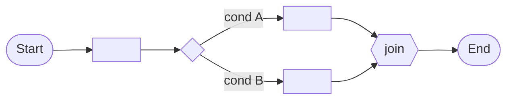

# Solution Design Document — <PROCESS_NAME>

> **Template:** Maestro BPMN — standards-based BPMN 2.0 process orchestration: pools/lanes, gateways, events, boundary timeouts, subprocesses, and multi-instance loops over RPA, agents, API workflows, connectors, and HITL.
> **Phase 2 sections:** §3, §4, §5, §6, §7, §8, §9, §12. **Phase 3 sections:** all others.

---

## Document History

| Date | Version | Author | Role | Comments |
|---|---|---|---|---|
| <DATE> | 1.0 | <AUTHOR> | Generated by AI Agent | Initial SDD generated from PDD |

---

<!-- DO NOT RENAME: uipath-planner detects SDDs via this exact heading or the marker below. -->
<!-- planner-handoff:v1 -->
## Planner Handoff

| Field | Value |
|---|---|
| **Execution autonomy** | <autonomous \| interactive> |
| **Delivery model** | <cloud \| automation-suite <VERSION_IF_KNOWN> \| standalone \| unspecified> |
| **SDD scope** | <single-product \| solution> |
| **Project list section** | §4 Activities Inventory + §9 Integrated Components |
| **Tasks file** | `<PROCESS_NAME_KEBAB>-tasks.md` |
| **Generated by** | uipath-planner |
| **Generation date** | <YYYY-MM-DD> |

---

<!--
EMIT THIS BLOCK ONLY when Execution autonomy: autonomous.
Skip entirely in interactive mode (decisions were checkpoint-reviewed).
See sdd-generation-guide.md Phase 3 Step 2 item 3 for the format spec.
Non-RPA scope: rows collapse to scope + product-specific Level-1.5-equivalent.
-->
## Decisions Made

> Autonomous mode picked the architectural decisions below without a user checkpoint. Override by rerunning in Interactive mode or by editing the relevant SDD section.

| # | Decision | Picked | One-sentence reason |
|---|---|---|---|
| 1 | **Scope** (Level 1) | <SINGLE_PRODUCT_OR_SOLUTION_COMPOSITION> | <REASON> |
| 2 | **Process trigger (start event)** | <MANUAL_START \| TIMER_START \| MESSAGE_START> | <REASON_FROM_PDD> |

---

<!--
EMIT THIS BLOCK ALWAYS (both execution modes).
Durable copy of the Phase 1 Recommended Scope summary — the SDD record of the
Constraint Gate outcome. See product-selection-guide.md → Summary block for the full format.
-->
## Recommended Scope

**Recommendation:** <SINGLE_PRODUCT | SOLUTION(<PRODUCT_1>, ...)>
**Delivery model:** <cloud | automation-suite <version-if-known> | standalone | unspecified — assumed cloud [SME REVIEW]>
**Blocked by platform:** <PRODUCT → ALTERNATIVE_APPLIED (matrix | user exclusion), ... | none>

---

<!--
EMIT THIS BLOCK ONLY when at least one [SME REVIEW] item remains after Step 1.5 resolution.
Skip entirely when no review items are open.
See sdd-generation-guide.md Phase 3 Step 2 item 4 for the format spec.
-->
## Action Required — SME Review Items

| # | Section | Item | Question |
|---|---|---|---|
| 1 | <SECTION> | <ITEM> | <QUESTION> |

> These items are marked `[SME REVIEW]` in the document. The automation can be built with defaults, but these must be verified before production.

---

## Table of Contents

1. Process Overview
2. Process Diagram
3. Pools & Lanes
4. Activities Inventory
5. Gateways & Sequence Flows
6. Events
7. Data Objects & Variables
8. Subprocesses & Call Activities
9. Integrated Components
10. Error Handling & Retry
11. Triggers
12. Project Structure
13. Testing Strategy
14. Next Steps

---

## 1. Process Overview

| Field | Value |
|---|---|
| **Process name** | <PROCESS_NAME> |
| **Objective** | <OBJECTIVE> |
| **Department / Function** | <DEPARTMENT> — <FUNCTION> |
| **Trigger type** | <MANUAL / TIMER / MESSAGE> |
| **Expected execution volume** | <EXECUTIONS_PER_DAY> |
| **Long-running characteristic** | <TYPICAL_DURATION> / <MAX_DURATION> |
| **Source PDD** | <PATH_OR_LINK_TO_PDD> |

### In Scope

- <ACTIVITY_1>

### Out of Scope

- <ACTIVITY_1>

### Assumptions

<!-- Assumptions the design relies on. Verify before build; promote to [SME REVIEW] if unconfirmed. -->

- <ASSUMPTION_1>
- <ASSUMPTION_2>
- <ASSUMPTION_3>

---

## 2. Process Diagram

<!-- Build from the Phase 1 extracted steps. One node per BPMN element.
     Show gateways as diamonds, parallel branches with fork/join, boundary/timer events annotated. -->



---

## 3. Pools & Lanes

<!-- Participant pools and the lanes/roles that own activities. One row per lane. -->

| Pool | Lane | Role / Participant | Owns Activities (node keys) | Notes |
|---|---|---|---|---|
| <POOL_NAME> | <LANE_NAME> | <ROLE> | <NODE_KEYS_FROM_§4> | <NOTES> |

---

## 4. Activities Inventory

<!-- List every activity in execution order. This section is parsed by the planner (Lane A) to derive tasks.
     BPMN element type values:
     - serviceTask (automated call), scriptTask (inline expression), businessRuleTask
     - userTask (HITL) — flag in §9 HITL Touchpoints
     - RPA-job (invokes a Studio process), agent (invokes a UiPath Agent), API-workflow (invokes an API Workflow), connector (Integration Service)
     - callActivity (invokes a separate Maestro / agentic / case instance), subProcess (embedded grouping) -->

| # | Node Key | BPMN Element Type | Description | Inputs | Outputs | Integrated Component | Notes |
|---|---|---|---|---|---|---|---|
| 1 | `start` | startEvent | <DESCRIPTION> | — | — | — | Trigger type: <MANUAL/TIMER/MESSAGE> |
| 2 | `<NODE_KEY>` | <ELEMENT_TYPE> | <DESCRIPTION> | <INPUTS> | <OUTPUTS> | <RPA/AGENT/API/CONNECTOR/HITL/—> | <NOTES> |

---

## 5. Gateways & Sequence Flows

### Gateways

<!-- exclusive (XOR), parallel (AND fork/join), inclusive (OR), event-based (race). -->

| Gateway Key | Type | Incoming | Outgoing | Default Flow | Purpose |
|---|---|---|---|---|---|
| `<GATEWAY_KEY>` | <exclusive / parallel / inclusive / event-based> | <SOURCE_NODES> | <TARGET_NODES> | <DEFAULT_BRANCH_OR_—> | <PURPOSE> |

### Sequence Flows

| Flow Key | Source | Target | Condition Expression | Notes |
|---|---|---|---|---|
| `<FLOW_KEY>` | `<SOURCE_NODE>` | `<TARGET_NODE>` | <EXPRESSION_OR_—> | <NOTES> |

---

## 6. Events

<!-- Event kinds: start / intermediate-catch / intermediate-throw / boundary / end.
     Definitions authored here: none, message, timer, error, terminate.
     (Signal / escalation / conditional / compensate are preserve-only — do not author unless the PDD requires them.) -->

| Event Key | Event Kind | Definition | Attached To (boundary) | Interrupting? | Timer / Message / Error detail |
|---|---|---|---|---|---|
| `<EVENT_KEY>` | <start / intermediate-catch / intermediate-throw / boundary / end> | <none / message / timer / error / terminate> | `<ACTIVITY_KEY_OR_—>` | <yes / no / —> | <DETAIL> |

---

## 7. Data Objects & Variables

<!-- Process variables and data objects passed between nodes. -->

| Name | Direction | Type | Scope | Default | Description |
|---|---|---|---|---|---|
| <VAR_NAME> | <IN / INOUT / OUT> | <TYPE> | <process / subprocess> | <DEFAULT_VALUE> | <DESCRIPTION> |

---

## 8. Subprocesses & Call Activities

<!-- subProcess = runs in the SAME instance (embedded grouping). callActivity = invokes a SEPARATE instance (Maestro / agentic / case). -->

### Subprocesses

| Subprocess Key | Kind | Nested Scope Summary | Scoped Variables | Multi-instance? |
|---|---|---|---|---|
| `<SUBPROCESS_KEY>` | <embedded / event / expanded> | <SUMMARY> | <VARS> | <yes: sequential/parallel — no> |

### Call Activities

| Call Activity Key | Invokes | Target Process | Input / Output Mapping |
|---|---|---|---|
| `<CALL_KEY>` | <separate Maestro / agentic / case instance> | `<TARGET_PROCESS>` | <MAPPING> |

---

## 9. Integrated Components

<!-- Flag the automation types the process orchestrates, keyed on Node Key from §4. Each flagged item creates an implementation task. -->

### RPA Processes Invoked

| Process Name | Called From Node | Purpose |
|---|---|---|
| `<PROCESS_NAME>` | `<NODE_KEY>` | <PURPOSE> |

### Agents Invoked

| Agent Name | Called From Node | Purpose |
|---|---|---|
| `<AGENT_NAME>` | `<NODE_KEY>` | <PURPOSE> |

### API Workflows Invoked

| API Workflow Name | Called From Node | Purpose |
|---|---|---|
| `<API_WORKFLOW_NAME>` | `<NODE_KEY>` | <PURPOSE> |

### Integration Service Connectors

| Connector | Called From Node | Operation |
|---|---|---|
| <CONNECTOR_NAME> (Salesforce/Jira/etc.) | `<NODE_KEY>` | <OPERATION> |

### Integration Service Connections

<!-- Every Integration Service connection and how it is provisioned: reuse an existing IS connector, custom-build a connector, or call the system over direct HTTP. Complements the Integration Service Connectors table above (connector + node + operation). -->

| Connector | System | Access Method (Integration Service — <slug> / Custom connector — <slug> / Direct HTTP) | Used By |
|---|---|---|---|
| <CONNECTOR_NAME> | <SYSTEM> | <Integration Service — <slug> / Custom connector — <slug> / Direct HTTP> | <NODES> |

### HITL Touchpoints

<!-- Flag userTask nodes. Implementation routes to uipath-human-in-the-loop skill. -->

| Node Key | HITL Type | Purpose | Approval Criteria |
|---|---|---|---|
| `<NODE_KEY>` | <QUICKFORM / APPTASK> | <PURPOSE> | <WHO_APPROVES_AND_WHAT_CRITERIA> |

---

## 10. Error Handling & Retry

| Scope | Mechanism | Trigger | Retry Policy | Action |
|---|---|---|---|---|
| Process-level | Unhandled exception | Any activity fails | <RETRY_OR_—> | <FAIL / NOTIFY / COMPENSATE> |
| Activity-level | <boundary error event / retry / error-mapping> | <CONDITION> | <RETRY_COUNT_AND_BACKOFF> | <ACTION> |

---

## 11. Triggers

<!-- How the process instance starts. -->

| Trigger Type | Configuration | Notes |
|---|---|---|
| <MANUAL / TIMER START / MESSAGE START> | <CRON_OR_MESSAGE_SPEC> | <NOTES> |

---

## 12. Project Structure

```text
<BPMN_PROJECT_NAME>/
├── project.json
├── content/
│   └── <PROCESS_NAME>.bpmn
├── entry-points.json
└── bindings_v2.json
```

### Orchestrator Deployment Target

- [ ] Studio Web (default)
- [ ] Orchestrator (`.uipx`-wrapped solution → `uipath-solution`; non-solution single package → `uipath-platform`)

### Solution / Project Breakdown

<!-- Every buildable project in the solution: its product, source repo, Orchestrator folder, and run mode. One row per project (single row for a single-project solution). -->

| Project | Product (RPA / API / Agent / …) | GitHub Repository | Folder | Attended / Unattended |
|---|---|---|---|---|
| <PROJECT_NAME> | <PRODUCT> | <GIT_URL_OR_REPO> | <FOLDER_PATH> | <ATTENDED / UNATTENDED / N-A> |

### Reusable Components

<!-- Components reused from an existing library vs. new reusable components this build will publish. -->

| Type (reused / new-reusable) | Name | Details |
|---|---|---|
| reused | <COMPONENT_NAME> | <SOURCE_LIBRARY_AND_VERSION> |
| new-reusable | <COMPONENT_NAME> | <WHAT_IT_ENCAPSULATES_AND_CONSUMERS> |

### Environments (DEV / UAT / PROD)

<!-- Per-environment Orchestrator/tenant and folder targets. Fill with [SME REVIEW] if the deployment team has not confirmed. -->

| Item | DEV | UAT | PROD | Used By |
|---|---|---|---|---|
| Orchestrator + Tenant/Service | <URL_OR_TENANT> | <URL_OR_TENANT> | <URL_OR_TENANT> | <PROJECTS_OR_ALL> |
| Folder | <FOLDER_PATH> | <FOLDER_PATH> | <FOLDER_PATH> | <PROJECTS_OR_ALL> |

### Non-Functional Requirements

<!-- Consolidated NFRs for the process and the components it orchestrates. Fill each row with the concrete design decision; use [SME REVIEW] where unconfirmed. -->

| Dimension | Requirement / Design decision |
|---|---|
| **Security** | <credentials in Orchestrator credential / secret assets; least-privilege Integration Service connection scope; do not expose entity / API calls in the network trace> |
| **Performance** | <database vs file storage; webhooks vs polling; avoid license-consuming Windows processes where a headless / cross-platform path exists> |
| **Scalability** | <expected concurrent process instances; multi-instance subprocess fan-out; peak-window sizing> |
| **Availability / Resilience** | <boundary-timeout / retry behavior; idempotency of invoked components; graceful degradation> |
| **Logging & Monitoring** | <log level and sinks; alerting on instance failure; Maestro / Insights dashboards> |
| **Compliance** | <REGULATION_OR_—> |

---

## 13. Testing Strategy

### Canonical Test Case

| Input Variable | Value |
|---|---|
| <VAR_NAME> | `<TEST_VALUE>` |

### Happy Path Assertions

1. <ASSERTION_1>

### Gateway / Branch Coverage

<!-- Exercise every outgoing path of every gateway in §5. -->

| Gateway Key | Path | Setup | Expected Route |
|---|---|---|---|
| `<GATEWAY_KEY>` | <BRANCH> | <SETUP> | <EXPECTED> |

### Boundary-Event & Timeout Scenarios

| Event Key | Setup | Expected Behavior |
|---|---|---|
| `<EVENT_KEY>` | <TRIGGER_THE_TIMEOUT_OR_ERROR> | <EXPECTED_INTERRUPT_OR_ESCALATION> |

### Error Path Scenarios

| Scenario | Setup | Expected Process Behavior |
|---|---|---|
| <SCENARIO_NAME> | <SETUP> | <EXPECTED> |

### End-to-End Orchestration Test

<!-- One run exercising the full path across every integrated component in §9. -->

1. <STEP_1>

---

## 14. Next Steps

This SDD captures architecture and decisions. To generate the implementation task list and execute the build, load `uipath-planner` with this SDD path:

> Load `uipath-planner`. SDD path: `<this-file>`.

The planner detects the `## Planner Handoff` header, parses §4 Activities Inventory and §9 Integrated Components, derives the per-skill task list (routing each task to `uipath-maestro-bpmn`, `uipath-rpa`, `uipath-agents`, `uipath-api-workflow`, `uipath-platform`, `uipath-human-in-the-loop`, etc.), writes `<PROCESS_NAME_KEBAB>-tasks.md` alongside this SDD, and emits live `TaskCreate` calls. If `Execution autonomy: interactive`, it enters plan mode for task review before execution.

Implementation tasks **do not live in this SDD** — they live in the planner's output.

---

**End of Solution Design Document.**
