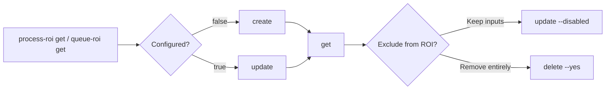

# Business ROI Configuration

Set, read, and clear the Business ROI inputs Orchestrator keeps per process and per queue: manual time per item, volume, employee cost, and an optional manual cost per item. Orchestrator's Business ROI page turns these inputs into savings figures; the CLI stores the inputs only.

> For full option details on any command, use `--help` (e.g., `uip or process-roi create --help`).

## When to Use

- A process or queue should report time and money saved on the Business ROI page
- ROI figures for a process or queue look wrong and you want to see or fix the stored inputs
- A process or queue should be excluded from ROI reporting (turn tracking off with `update --disabled`)

## Prerequisites

- Authenticated — verify with `uip login status`; if not logged in, ask the user to run `uip login` (it opens an interactive browser flow)
- The Business ROI feature is enabled on the tenant, and your folder role holds the `BusinessValue` permissions (View to read; Create, Edit, Delete to write)
- **Interactive login only.** The routes require the `OR.BusinessValue` scope, which Identity marks internal, so an External Application or a PAT cannot request it. Use a browser login; a client-credentials session fails with `invalid_scope` or a 403.

## Flow



---

## Command Groups

The two groups are identical apart from the parent they attach to:

| Group | Parent | Route behind it |
|-------|--------|-----------------|
| `uip or process-roi` | A process (release) | `api/Releases/<PROCESS_KEY>/ROIConfiguration` |
| `uip or queue-roi` | A queue definition | `api/QueueDefinitions/<QUEUE_KEY>/ROIConfiguration` |

Every verb takes one positional: the parent's **name or key (GUID)**. A key is global. A name is looked up by exact, case-sensitive match; when the same name exists in more than one folder you can see, add `--folder-path` or `--folder-key` to pick one. The folder flags scope the name lookup only — the ROI request itself always runs in the folder the parent lives in.

---

## Read the Configuration

```bash
uip or process-roi get "<PROCESS_NAME>" --folder-path "<FOLDER_PATH>" --output json
uip or queue-roi get <QUEUE_KEY> --output json
```

`Data.Configured` tells you whether anything is stored. A parent without a configuration is **not** an error: the command exits 0 with `Configured: false` and `Instructions` carrying the `create` command to run.

Configured output (PascalCase):

| Field | Meaning |
|-------|---------|
| `ProcessKey` / `QueueKey`, `ProcessName` / `QueueName`, `Folder` | The parent the configuration belongs to |
| `Configured` | `true` |
| `Enabled` | Whether ROI tracking is on; `false` is what the UI shows as "not applicable" |
| `ManualTimePerItem`, `ManualTimeUnit` | Human time per item, in `Seconds`, `Minutes`, or `Hours` |
| `ProcessVolume`, `ProcessVolumePeriod` | Items per `Day`, `Week`, `Month`, or `Year`; both null when not set |
| `EmployeeCost`, `EmployeeCostPeriod` | Fully loaded employee cost, `Annual` or `Hourly`; both null when not set |
| `ManualCostPerItem` | Manual override of the cost per item; null lets the UI compute it |
| `Currency` | Always `Usd` today; the API does not accept a currency |

## Create

```bash
uip or process-roi create "<PROCESS_NAME>" --folder-path "<FOLDER_PATH>" \
  --manual-time 15 --volume 1000 --employee-cost 60000 --output json
```

Only `--manual-time` is required. Key options:

| Option | Description |
|--------|-------------|
| `--manual-time <number>` | Whole number of `--time-unit` a human spends per item (required) |
| `--time-unit <unit>` | `Seconds`, `Minutes` (default), or `Hours` |
| `--volume <number>` | Items processed per `--volume-period` |
| `--volume-period <period>` | `Day`, `Week`, `Month`, or `Year`; defaults to `Month` when `--volume` is set |
| `--employee-cost <amount>` | Fully loaded cost of the employee doing the work, in USD |
| `--cost-period <period>` | `Annual` (default when `--employee-cost` is set) or `Hourly` |
| `--cost-per-item <amount>` | Manual cost per item; omit to let the UI compute it |
| `--disabled` | Create with ROI tracking off |

A period without its value (`--volume-period` without `--volume`) is rejected before any request. `create` fails with 409 when a configuration already exists; the error tells you to use `update`.

## Update

```bash
uip or process-roi update <PROCESS_KEY> --manual-time 20 --cost-per-item 2.5 --no-employee-cost --output json
uip or queue-roi update "<QUEUE_NAME>" --folder-path "<FOLDER_PATH>" --enabled --output json
```

`update` takes the same value flags as `create`, all optional, plus:

| Option | Description |
|--------|-------------|
| `--no-volume` | Clear the stored volume and its period |
| `--no-employee-cost` | Clear the stored employee cost and its period |
| `--no-cost-per-item` | Clear the manual cost per item so the UI computes it again |
| `--enabled` / `--disabled` | Turn ROI tracking on or off. `--disabled` keeps the inputs and is what the UI shows as "not applicable"; `--enabled` restores them |

Values you do not pass keep their current setting: the CLI reads the stored configuration first and sends the merged record, because the API replaces the whole record on every update. Pass at least one flag, or the command exits 3 before any request. When nothing is stored yet, `update` fails with `not_found` and points at `create`.

## Delete

```bash
uip or queue-roi delete <QUEUE_KEY> --yes --output json
```

Removes the configuration entirely (`get` then reports `Configured: false`). `--yes` is required; without it the command refuses with "Confirmation required". A parent with no configuration answers `not_found`.

---

## Complete Example

```bash
# 1. Check what is stored
uip or queue-roi get "<QUEUE_NAME>" --folder-path "<FOLDER_PATH>" --output json

# 2. Create the baseline (Configured was false)
uip or queue-roi create "<QUEUE_NAME>" --folder-path "<FOLDER_PATH>" \
  --manual-time 4 --time-unit Minutes --volume 500 --volume-period Week \
  --employee-cost 45 --cost-period Hourly --output json

# 3. Adjust one input; everything else is carried over
uip or queue-roi update "<QUEUE_NAME>" --folder-path "<FOLDER_PATH>" \
  --manual-time 6 --output json

# 4. Exclude the queue from ROI without losing the inputs
uip or queue-roi update "<QUEUE_NAME>" --folder-path "<FOLDER_PATH>" --disabled --output json

# 5. Bring it back
uip or queue-roi update "<QUEUE_NAME>" --folder-path "<FOLDER_PATH>" --enabled --output json
```

---

## Variations and Gotchas

- **Name vs key.** `--folder-path` / `--folder-key` are needed only when you pass a name and the same name exists in more than one folder you can see. An ambiguous name is rejected with the list of folders; an unknown name is `not_found` with a pointer to `processes list` / `queues list`.
- **Configured: false is success.** Do not treat a missing configuration as a failure; branch on `Data.Configured`.
- **Periods travel with their values.** Setting `--volume` or `--employee-cost` without a period fills the default (`Month`, `Annual`); clearing a value with `--no-*` clears its period too.
- **Server limits.** Inputs must be 0 or more and within the tenant's limits (by default 10,000 for manual time, 10,000,000 for volume and employee cost, 100,000 for cost per item). Orchestrator rejects the rest with `invalid_argument`.
- **403 has three causes.** The `OR.BusinessValue` scope missing from the login, the `BusinessValue` folder permission missing from your role, or the Business ROI feature not enabled on the tenant. The error names all three.
- **Not the Insights ROI dataset.** Insights keeps its own per-process and per-queue manual-time and hourly-cost table for its ROI dashboards; these commands do not write there.

---

## Related

- [run-jobs.md](run-jobs.md) — Creating and managing the processes these configurations attach to
- [process-queues.md](process-queues.md) — Creating and managing queues
- [orchestrator.md](orchestrator.md) — Common flags and the process/release naming
