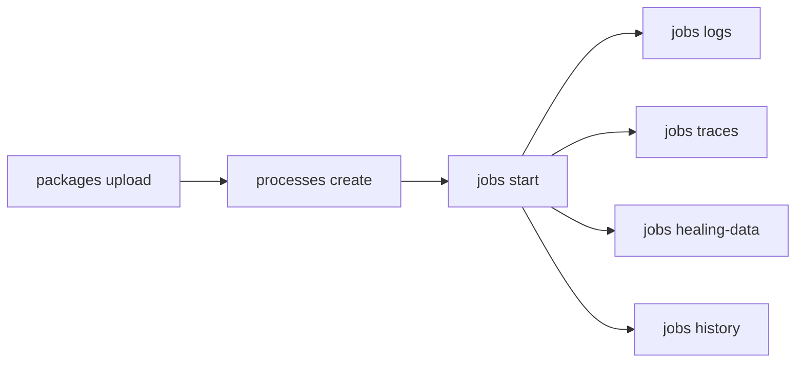

# Run Jobs

Upload automation packages, bind them as processes, start jobs, and monitor execution with logs, traces, healing data, and history.

> For full option details on any command, use `--help` (e.g., `uip or jobs start --help`)

## When to Use

- Deploying and running automations end-to-end
- Debugging failed or faulted jobs
- CI/CD execution and verification
- Monitoring long-running unattended processes

## Prerequisites

- Verify authentication with `uip login status`; if not logged in, ask the user to run `uip login` (it opens an interactive browser flow).
- Ensure the target folder exists with machines assigned (see [setup-environment.md](setup-environment.md)).
- Have a built `.nupkg` package ready to upload.

## Flow



## Step 1: Upload Package

Run:

```bash
uip or packages upload ./MyProcess.1.0.0.nupkg --output json
uip or packages upload ./MyProcess.1.0.0.nupkg --feed-id <feed-key> --output json
```

Use `--feed-id <feed-key>` for a custom feed instead of the tenant default.

## Step 2: Inspect Package

Run:

```bash
uip or packages list --search "MyProcess" --output json
uip or packages versions <package-id> --output json
uip or packages entry-points "MyProcess:1.0.0" --output json
uip or packages get "MyProcess:1.0.0" --output json
uip or packages download "MyProcess:1.0.0" --destination ./MyProcess.1.0.0.nupkg --output json
```

`packages get`, `packages versions`, and `processes create` use the **tenant** feed by default. For a folder-hierarchy feed, pass `--feed-id <feed-key>`; otherwise these commands can return empty / 404 even when the package exists. `processes create` itself no longer pre-checks the feed and succeeds in a folder feed regardless.

Entry points identify executable workflows. Require `--entry-point` for packages with multiple entry points. `packages get` accepts the `Id:Version` composite key returned by `packages list` / `packages versions`; `--all-fields` returns the raw DTO, including `tags`, `targetFramework`, and `isCompiled`.

## Step 3: Create Process

Run:

```bash
uip or processes list --folder-path "Production" --output json
uip or processes create --name "MyProcess" \
  --package-key "MyProcess" \
  --package-version "1.0.0" \
  --folder-path "Production" \
  --output json
```

Options:

| Option | Behavior |
|---|---|
| `--entry-point <path>` | Required for multi-entry-point packages. |
| `--auto-update` / `--no-auto-update` | Automatically pick the latest package version on deploy. |
| `--job-priority <Low\|Normal\|High>` | Default priority; CLI sets the matching `SpecificPriorityValue` band: Low=25, Normal=45, High=65. The API derives the band from that value, so the change applies. |
| `--specific-priority <1-100>` | Fine-grained priority override; mutually exclusive with `--job-priority`. |
| `--robot-size <Small\|Standard\|Medium\|Large>` | Cloud robot sizing for serverless runtimes. |
| `--input-arguments <json>` | Default input arguments, merged with per-job inputs. |
| `--environment-variables <pairs>` | Newline-separated `KEY=VALUE` pairs, **not** JSON; merged with per-job variables. |
| `--tags <list>` | Comma-separated tags. |
| `--hidden-for-attended` / `--visible-for-attended` | Toggle visibility to attended robot users. |
| `--auto-create-triggers` / `--no-auto-create-triggers` | Auto-create connected triggers on deploy. |
| `--retention-period <days>` + `--retention-action <Delete\|Archive\|None>` (+ `--retention-bucket <id>`) | Job retention policy; `--retention-period` must be 1-180 (validated client-side). |
| `--stale-retention-period <days>` + `--stale-retention-action <Delete\|Archive\|None>` | Stale-job retention policy. |

Runtime kind is not a process setting. Select `Unattended`, `Headless`, `NonProduction`, `AgentService`, or `Serverless` per job with `jobs start --runtime-type`.

### Inspect, Edit, Roll Back, or Delete Processes

Run:

```bash
uip or processes get <process-key-guid> --output json
uip or processes resources <process-key-guid> --output json
uip or processes update <process-key-guid> --description "Updated description" --output json
uip or processes update <process-key-guid> --environment-variables $'API_HOST=api.example.com\nRETRIES=3' --output json
uip or processes update <process-key-guid> --environment-variables '' --output json
uip or processes version-history <process-key-guid> --output json
uip or processes update-version <process-key-guid> --package-version 1.0.2 --output json
uip or processes rollback <process-key-guid> --output json
uip or processes delete <process-key-guid> --yes --output json
```

Run `processes resources` as the pre-flight check before `jobs start`. It reports one row per declared resource: `Queue`, `Asset`, `Bucket`, `Connection`, `Process`, `EventTrigger`, `HttpTrigger`, `Entity`, `MCPServer`, `IXP`, and `ProcessExecutionSettings`. Read `ValidationResult`: `Success` means the resource exists in the folder and `ResourceId` names it; `NotFound` means it is missing and `ValidationError` explains why; `Unknown` means it was not folder-validated, such as connections and execution settings. Filter broken rows with `--output-filter "[?ValidationResult=='NotFound']"`. Resource overwrites are applied first, so a resource redirected from the package default can still report `Success`.

Environment variables are newline-separated `KEY=VALUE` pairs, not JSON. Pass `''` to clear them; the CLI sends a bare newline because Orchestrator treats an empty body as “leave them alone.”

`processes update` maps `ReleaseDto` to `UiRelease` server-side, so missing request fields are nulled. The CLI spreads `currentRelease` as a baseline before applying overrides. If constructing the body manually, preserve `tags`, `arguments`, `videoRecordingSettings`, `targetFramework`, `robotSize`, `resourceOverwrites`, `remoteControlAccess`, `targetRuntime`, `publisherLicense`, and other existing fields.

## Step 4: Start Job

The process key comes from `uip or processes list`. Run:

```bash
uip or jobs start <process-key> --folder-path "Production" --output json
uip or jobs start <process-key> --folder-path "Production" \
  --input-arguments '{"invoiceId": "INV-001", "amount": 1500}' \
  --wait-for-completion --timeout 600 \
  --output json
```

Options:

- `--input-arguments <json>` / `--input-file <path>` — choose one. Inline JSON must be an object and is validated client-side; `--input-file` uploads a file as the job's `InputFile` argument.
- Job arguments have a **10K character cap**. Orchestrator caps serialized input/output arguments at 10,240 characters for classic `StartJob` runs; oversized output is silently dropped, the workflow receives `null`, and the job remains Successful. `StartAgentJob` is not subject to the same cap in practice. Robot 2025.10.1+ removes the cap entirely (“Support for large input and output arguments”). For large payloads, use a storage bucket / queue item reference or upgrade the Robot. The CLI automatically offloads JSON exceeding 10K characters to an InputFile.
- `--attachment <[name=]path>` — upload one or more attachments; repeat for multiple files. Pair with `--attachment-id <guid>` to reuse a prior upload.
- `--runtime-type <type>` — `Unattended`, `Headless`, `NonProduction`, `AgentService`, or `Serverless`.
- `--strategy <strategy>` — `ModernJobsCount` (default; N independent jobs with `--jobs-count`), `All` (every available robot), `Specific` (requires `--user-keys` / `--machine-keys`), or `JobsCount`; validated client-side. `--jobs-count` must be a whole number greater than 0.
- `--user-keys <guids>` / `--machine-keys <guids>` — comma-separated GUIDs. With `ModernJobsCount`, restrict the candidate pool; with `Specific`, they are required.
- `--healing-agent` / `--no-healing-agent` — enable or disable Autopilot for Robots for this job regardless of the process setting.
- `--reference <text>` — free-form external correlation reference.
- `--environment-variables <pairs>` — newline-separated `KEY=VALUE` pairs, not JSON; merged over folder-/process-level variables. Malformed lines are rejected before submission.
- `--run-as-me` — run under the caller's identity instead of resolving an unattended robot account.
- `--wait-for-completion` + `--timeout <seconds>` (default 300) + `--poll-interval <seconds>` (default 5) — poll until a terminal state.
- `--output-dir <path>` + `--no-download` — with `--wait-for-completion`, download `OutputFile` automatically unless `--no-download` is passed.
- `--job-priority <Low|Normal|High>` — runtime queue priority.

## Step 5: Monitor Job

`jobs get` is cross-folder; `jobs list` requires `--folder-path`, `--folder-key`, or `--all-folders`. A bare `jobs list` is rejected. Older CLI versions listed tenant-wide by default; pass `--all-folders` for that behavior.

Run:

```bash
uip or jobs get <job-key> --output json
uip or jobs list --state Running --folder-path "Production" --output json
uip or jobs list --process-name "MyProcess" --folder-path "Production" --output json
uip or jobs list --all-folders --state Faulted --output json
```

## Step 6: Get Logs

Run:

```bash
uip or jobs logs <job-key> --output json
uip or jobs logs <job-key> --level Error --output json
uip or jobs logs <job-key> --export --destination ./logs.csv
```

`--export` writes CSV instead of terminal output; combine it with `--destination` or `-d`. Logs are cross-folder.

## Step 7: Get Traces

Run:

```bash
uip or jobs traces <job-key> --output json
```

Traces are available only for UiPath Autopilot or Agent processes. A standard Process returns an empty list and an `Instructions` note stating this, distinguishing “no traces recorded” from “not an Agent process.” For span-level data, run `uip traces spans get [trace-id]` or `uip traces spans get --job-key <key>`; see [traces.md](../traces/traces.md). Traces are cross-folder.

## Step 8: Get Healing Data

Run:

```bash
uip or jobs healing-data <job-key> -o ./healing-data.zip
```

The ZIP contains screenshots and UI metadata from Autopilot self-healing attempts.

## Step 9: Job History

Run:

```bash
uip or jobs history <job-key> --output json
```

This returns the state-transition timeline and timestamps.

## Step 10: Stop, Restart, Resume

Run:

```bash
uip or jobs stop <job-key> --strategy SoftStop --output json
uip or jobs stop <job-key> --strategy Kill --output json
uip or jobs restart <job-key> --output json
uip or jobs resume <job-key> --input-arguments '{"approved": true}' --output json
```

`SoftStop` is best-effort; an activity that ignores the cancellation token can run to completion. `Kill` force-kills the job. Restart any finished outcome—faulted, stopped, or successful—and expect the new run in the same `{ Jobs: [...] }` shape as `jobs start`. Resume a suspended job with new input.

Jobs are immutable audit records; there is no `jobs delete`. They age out according to the binding process's retention period.

## Step 11: Manage Processes

Run:

```bash
uip or processes update-version <process-key> --output json
uip or processes rollback <process-key> --output json
uip or processes update <process-key> --output json
```

Use these commands to update, roll back, or edit a deployed process.

## Complete Example

```bash
uip or packages upload ./InvoiceProcessor.1.0.0.nupkg --output json
uip or packages entry-points "InvoiceProcessor:1.0.0" --output json
uip or processes create --name "InvoiceProcessor" \
  --package-key "InvoiceProcessor" --package-version "1.0.0" \
  --folder-path "Finance" --job-priority Normal \
  --output json
uip or jobs start <process-key> --folder-path "Finance" \
  --input-arguments '{"batchDate": "2026-04-22"}' \
  --wait-for-completion --timeout 600 --output json
uip or jobs logs <job-key> --level Error --output json
uip or jobs logs <job-key> --export --destination ./invoice-logs.csv
```

## Variations and Gotchas

### “Process” vs “Release”

The CLI calls this entity a “process”; the Orchestrator API calls it a “Release.” They are the same entity. `ReleaseKey` equals the process key from `uip or processes list`.

### Process Key vs Package Key

| Key | Source | Format |
|---|---|---|
| Process key | `uip or processes list` | GUID |
| Package key | `uip or packages list` | String ID |
| Package download key | `uip or packages download` | `PackageId:Version` |

### Job States

```text
Pending -> Running -> Successful
                   -> Faulted
                   -> Stopped
                   -> Suspended (awaiting input)
```

`Successful`, `Faulted`, and `Stopped` are final and immutable.

### Wait and Input Behavior

- `--wait-for-completion` polls every `--poll-interval` (default 5s) until a final state or `--timeout` (default 300s).
- `--input-arguments` accepts JSON; `--input-file` reads a file path.
- If JSON exceeds 10K characters, the CLI automatically offloads it to an InputFile (server-side).
- Use `uip or packages entry-points` to discover expected argument names and types.

### Cross-Folder Commands

These resolve the folder from the job key and require no `--folder-path`:

- `uip or jobs get <key>`
- `uip or jobs logs <key>`
- `uip or jobs traces <key>`
- `uip or jobs history <key>`
- `uip or jobs healing-data <key>`

### Package Download

Use the `PackageId:Version` format:

```bash
uip or packages download "MyProcess:1.0.0" --destination ./packages/ --output json
```

## Related

- [setup-environment.md](setup-environment.md) — Folder creation, machine assignment, user setup
- [traces.md](../traces/traces.md) — Deep-dive into LLM/agentic traces and spans
- Resources (assets, queues, buckets, triggers, webhooks, libraries) → [resources.md](resources.md)