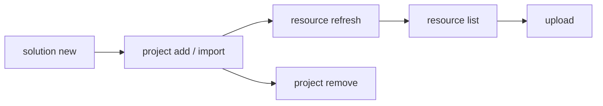

# Develop a Solution

Create a solution, add automation projects, and sync resource declarations.

> For full option details on any command, use `--help` (e.g., `uip solution project add --help`).

## When to Use

- Starting a new multi-project automation from scratch
- Organizing existing projects into a single deployable unit
- Managing resource declarations across projects before packing

## Prerequisites

- Authenticated (`uip login`) -- required for remote resource lookup during `resource refresh` and for `upload`
- Projects to add must contain `project.uiproj` or `project.json`

## Flow



---

## Step 1: Create a New Solution

```bash
uip solution new "InvoiceAutomation" --output json
```

Creates `InvoiceAutomation/InvoiceAutomation.uipx`. All projects must live inside this directory (or be imported into it).

## Step 2: Add Existing Projects

Register a project that already lives inside the solution directory.

```bash
uip solution project add ./InvoiceAutomation/Processor --output json

# With explicit solution file
uip solution project add ./InvoiceAutomation/Reporter ./InvoiceAutomation/InvoiceAutomation.uipx --output json
```

The `.uipx` is auto-discovered by walking up from the project path if not specified.

## Step 3: Import External Projects

Copy a project from outside the solution tree into the solution directory and register it.

```bash
uip solution project import --source /path/to/ExternalProject --output json
```

Unlike `add`, `import` copies source files into the solution directory first, then registers the copy.

## Step 4: Remove a Project

Unregister a project from the `.uipx` manifest. Does NOT delete files from disk.

```bash
uip solution project remove ./InvoiceAutomation/OldProject --output json
```

## Step 5: List Resources

Show resources declared in the solution, available in Orchestrator, or both.

```bash
uip solution resource list ./InvoiceAutomation --output json
uip solution resource list ./InvoiceAutomation --source local --output json
uip solution resource list ./InvoiceAutomation --kind Queue --search "Invoice" --output json
```

| Option | Values | Default |
|--------|--------|---------|
| `--kind <kind>` | `Queue`, `Asset`, `Bucket`, `Process`, `Connection` | All kinds |
| `--search <term>` | Name substring match | No filter |
| `--source <source>` | `all`, `local`, `remote` | `all` |

## Step 6: Refresh Resources

Re-scan all projects and sync resource declarations from their `bindings_v2.json` files. Refresh is the only way to reconcile a solution's local artefacts with cloud entities — run it after adding/importing projects, after editing `bindings_v2.json`, or before any `pack` / `upload`.

```bash
uip solution resource refresh ./InvoiceAutomation --output json
```

| Field | Meaning |
|-------|---------|
| `Created` | New local skeletons created (resource didn't exist in cloud) |
| `Imported` | Cloud resources imported into the solution (artefact files written + linked) |
| `Skipped` | Resources already tracked in the solution |
| `Warnings` | Bindings that couldn't be resolved (logged for follow-up) |

### What `refresh` actually does

1. **Discover bindings** — reads `bindings_v2.json` from each project (solution root copy is also read for agent projects).
2. **Discover cloud GUIDs** — for agent projects, supplements bindings with `<project>/resources/<X>/resource.json` files. These carry a `referenceKey` (GUID) for tools/escalations/contexts that the agent depends on; the GUID is the unambiguous cloud identity (binding names alone aren't unique across folders).
3. **Reconcile in-solution projects (`.uipx`)** — generates project artefact files (`process/<type>/`, `package/`) from SDK templates. Internal to the solution; no debug overwrite written.
4. **Sync external references** — for each cloud resource the solution depends on, calls Orchestrator/Apps APIs and writes:
   - The artefact files under `resources/solution_folder/<kind>/...`
   - A user-scoped debug overwrite at `userProfile/<userId>/debug_overwrites.json` linking the local skeleton to the cloud entity (key + folder + FQN). Studio Web's runtime needs the FQN populated to resolve "configured folder" lookups.

### App resources

When an agent's escalation channel (`channels[].properties.resourceKey`) points to an Action Center App, refresh imports four artefact files:

```
resources/solution_folder/app/<subType>/<AppName>.json
resources/solution_folder/appVersion/<AppVersionTitle>.json
resources/solution_folder/package/<AppVersionTitle>.json
resources/solution_folder/process/webApp/<AppName>.json
```

Plus debug overwrites for the App and its codeBehindProcess. The App's `spec.version` must match the cloud Apps service `semVersion` (current published) — otherwise Studio Web's Health Analyzer flags "App is no longer available".

### Folder disambiguation

When a name (e.g. `orders` queue) exists in multiple cloud folders, refresh prefers the folder declared in the binding's `folderPath`. Without a folder hint and multiple matches, refresh marks the binding unresolved and emits a warning rather than picking one silently.

The placeholder `solution_folder` (and `.`) in a binding's folder field means "no folder" / tenant scope — they're not real cloud folders.

## Step 7: Upload to Studio Web

Upload the solution for browser-based editing. Accepts a directory, `.uipx` file, or `.uis` archive.

```bash
uip solution upload ./InvoiceAutomation --output json
```

If the `SolutionId` in `.uipx` matches an existing Studio Web solution, the upload overwrites it.

## Step 8: Delete from Studio Web

Remove a solution from Studio Web by its UUID (returned by `upload`).

```bash
uip solution delete <solution-id> --output json
```

Deletes the Studio Web copy only -- local files and published packages are not affected.

---

## Complete Example

Create a solution with two projects, sync resources, and verify:

```bash
# 1. Create the solution
uip solution new "InvoiceAutomation" --output json

# 2. Add projects (already inside the solution directory)
uip solution project add ./InvoiceAutomation/Processor --output json
uip solution project add ./InvoiceAutomation/Reporter --output json

# 3. Sync resource declarations from project bindings
uip solution resource refresh ./InvoiceAutomation --output json

# 4. Verify resources are tracked
uip solution resource list ./InvoiceAutomation --source local --output json
```

---

## Variations and Gotchas

### `add` vs `import`

| | `project add` | `project import` |
|-|----------------|-------------------|
| Project location | Must already be inside the solution directory | Can be anywhere on disk |
| File handling | Registers only (no file copy) | Copies into solution tree, then registers |
| Use case | Project created inside the solution | Bringing in an external project |

### `remove` does not delete files

`project remove` unregisters from `.uipx` but leaves the project directory intact. Delete files manually if needed.

### `resource refresh` is the sync mechanism

Adding a project does not automatically sync its resources. The refresh scans all registered projects for `bindings_v2.json`, creates solution resources for untracked bindings, imports from Orchestrator when a match exists, and skips already-tracked bindings.

### Virtualizable vs non-virtualizable resources

| Virtualizable | Non-virtualizable |
|---------------|-------------------|
| Queue, Asset, Bucket | Process, Connection, App |
| Can exist as local placeholders (created at deploy time) | Must reference an existing Orchestrator/IS/Apps resource |

If a non-virtualizable resource isn't found in cloud, refresh emits a warning and the deployment will fail until the resource is provisioned (or the binding is fixed/removed).

### `bindings_v2.json` locations

Studio Web writes bindings in two places depending on project type:
- `<project>/bindings_v2.json` — for flow / RPA projects
- Solution root `bindings_v2.json` — added for agent projects (Studio Web mirrors them up)

Refresh reads both. Don't hand-edit these — they're regenerated whenever Studio Web saves the project.

### Per-user debug overwrites

`userProfile/<userId>/debug_overwrites.json` is per-user state (the `userId` is your UiPath user GUID). Refresh writes only your own entries; another user opening the bundled solution would have separate entries. The bundle (`.uis`) carries `userProfile/` for everyone who ran refresh; Studio Web picks the active user's at runtime.

### `upload` overwrites on matching SolutionId

The `SolutionId` in `.uipx` determines identity. If a Studio Web solution with the same ID exists, `upload` replaces it. To upload as a new solution, change the `SolutionId`.

### `delete` uses the solution UUID, not the name

Get the UUID from `upload` output or Studio Web -- the name string is not accepted.

### `.uipx` auto-discovery

When `[solutionFile]` is omitted, the CLI walks up from the project path looking for a single `.uipx` file. If multiple `.uipx` files exist in the same directory, specify which one explicitly.

---

## Related

- [Pack & Deploy](pack-and-deploy.md) -- Next step: pack, publish, and deploy the solution
- [solution.md](solution.md) -- Solution tool overview and full command tree
