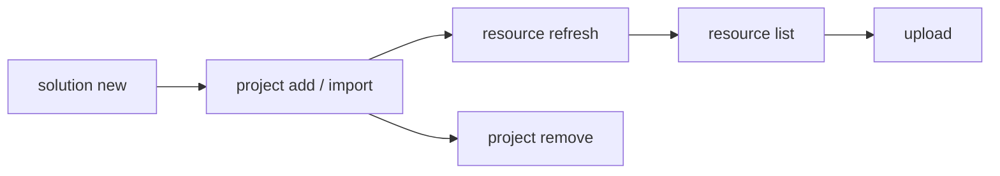

# Develop a Solution

Create a solution, add automation projects, and sync resource declarations.

> For full option details on any command, use `--help` (e.g., `uip solution project add --help`).

## When to Use

- Starting a new multi-project automation from scratch
- Organizing existing projects into a single deployable unit
- Managing resource declarations across projects before packing

## Prerequisites

- Authenticated (`uip login`) -- required for remote resource lookup during `resource refresh` and for `upload`
- Projects to add must contain `project.uiproj` or `project.json`

## Flow



---

## Step 1: Create a New Solution

```bash
uip solution new "InvoiceAutomation" --output json
```

Creates `InvoiceAutomation/InvoiceAutomation.uipx`. All projects must live inside this directory (or be imported into it).

> If the target folder already exists and is empty, `solution new` drops the `.uipx` inside without nesting or erroring. No need to pre-delete an empty target.

## Step 2: Add Existing Projects

Register a project that already lives inside the solution directory.

```bash
uip solution project add ./InvoiceAutomation/Processor --output json

# With explicit solution file
uip solution project add ./InvoiceAutomation/Reporter ./InvoiceAutomation/InvoiceAutomation.uipx --output json
```

The `.uipx` is auto-discovered by walking up from the project path if not specified. `Type` is auto-detected from `project.uiproj` / `project.json` — do not pass it.

`add` is transactional: on success, both the `.uipx` entry and the matching `resources/solution_folder/{package,process}/<name>.json` files are created together; on failure, nothing is mutated.

## Step 3: Import External Projects

Copy a project from outside the solution tree into the solution directory and register it.

```bash
uip solution project import --source /path/to/ExternalProject --output json
```

Unlike `add`, `import` copies source files into the solution directory first, then registers the copy.

> **Three names can diverge after `import`.** The destination folder name is the basename of `--source`. The `ProjectRelativePath` in `.uipx` matches the folder. The auto-generated package resource name is taken from the project metadata (e.g., `pyproject.toml [project].name` for Python coded agents) — which may differ from the folder. Rename the source directory to the intended project name **before** importing, or trace the relationship via the `projectKey` UUID inside the resource files.

## Step 4: Remove a Project

Unregister a project from the `.uipx` manifest. Does NOT delete files from disk.

```bash
uip solution project remove ./InvoiceAutomation/OldProject --output json
```

> **`project remove` leaves orphan package resources.** It removes the entry from `.uipx` Projects and deletes `resources/solution_folder/process/<kind>/<name>.json`, but leaves `resources/solution_folder/package/<name>.json` behind. The orphan blocks any future `project add` of a project with the same name. **If you plan to re-add with the same name, manually delete `resources/solution_folder/package/<name>.json` before re-adding.**

## Step 5: List Resources

Show resources declared in the solution, available in Orchestrator, or both.

```bash
uip solution resource list --solution-folder ./InvoiceAutomation --output json
uip solution resource list --solution-folder ./InvoiceAutomation --source local --output json
uip solution resource list --solution-folder ./InvoiceAutomation --kind Queue --search "Invoice" --output json
```

> The solution path is now a `--solution-folder` flag, not a positional argument. The positional form was removed in `solution-tool@1.0.0-alpha.20260429.5761` with no backward compatibility — running it produces `error: too many arguments for 'list'. Expected 0 arguments but got 1.`

| Option | Values | Default |
|--------|--------|---------|
| `--kind <kind>` | `Queue`, `Asset`, `Bucket`, `Process`, `Connection` | All kinds |
| `--search <term>` | Name substring match | No filter |
| `--source <source>` | `all`, `local`, `remote` | `all` |

## Step 6: Refresh Resources

Re-scan all projects and sync resource declarations from their `bindings_v2.json` files.

```bash
uip solution resource refresh --solution-folder ./InvoiceAutomation --output json
```

| Field | Meaning |
|-------|---------|
| `Created` | New resources added to the solution manifest |
| `Imported` | Resources matched and imported from Orchestrator |
| `Skipped` | Resources already tracked in the solution |
| `Warnings` | Any issues encountered during sync |

Run after adding/importing projects or editing any project's `bindings_v2.json`.

> The solution path is a `--solution-folder` flag, not a positional argument. The positional form was removed in `solution-tool@1.0.0-alpha.20260429.5761` with no backward compatibility. If you see `error: too many arguments for 'refresh'. Expected 0 arguments but got 1.`, you are running an old example — switch to `--solution-folder`.

> **`Result: Success` is unreliable — always check stderr.** Schema errors in `bindings_v2.json` are logged to stderr as `ERROR [ResourceBuilder:BindingsMetadataSerializer]` lines but the JSON returns `Result: Success` with `Created: 0, Imported: 0, Skipped: 0`. Treat `Created==0 && Imported==0 && Skipped==0` while bindings exist on disk as a refresh failure. Capture stderr and grep for `ERROR` before declaring success:
>
> ```bash
> uip solution resource refresh --solution-folder ./InvoiceAutomation --output json 2> refresh.err
> grep -i "ERROR" refresh.err && echo "REFRESH FAILED" || echo "ok"
> ```

## Step 7: Upload to Studio Web

Upload the solution for browser-based editing. Accepts a directory, `.uipx` file, or `.uis` archive.

```bash
uip solution upload ./InvoiceAutomation --output json
```

If the `SolutionId` in `.uipx` matches an existing Studio Web solution, the upload overwrites it.

## Step 8: Delete from Studio Web

Remove a solution from Studio Web by its UUID (returned by `upload`).

```bash
uip solution delete <solution-id> --output json
```

Deletes the Studio Web copy only -- local files and published packages are not affected.

---

## Complete Example

Create a solution with two projects, sync resources, and verify:

```bash
# 1. Create the solution
uip solution new "InvoiceAutomation" --output json

# 2. Add projects (already inside the solution directory)
uip solution project add ./InvoiceAutomation/Processor --output json
uip solution project add ./InvoiceAutomation/Reporter --output json

# 3. Sync resource declarations from project bindings
uip solution resource refresh --solution-folder ./InvoiceAutomation --output json

# 4. Verify resources are tracked
uip solution resource list --solution-folder ./InvoiceAutomation --source local --output json
```

---

## Field-tested gotchas

Durable CLI behaviors that have caught agents in practice. Treat each as a hard rule.

### Always verify state after every mutation

`add`, `remove`, and `refresh` can succeed in stdout but fail (or partially fail) on disk. After every mutation:

```bash
# 1. What does .uipx claim?
cat ./MySolution/MySolution.uipx | grep -A 2 ProjectRelativePath

# 2. What resource files actually exist?
ls -1 ./MySolution/resources/solution_folder/package/
ls -1 ./MySolution/resources/solution_folder/process/

# 3. The two sets MUST agree by name. If not, the solution is corrupt.
```

If `.uipx` and `resources/solution_folder/` disagree, follow the recovery procedure in the matching gotcha below.

### `bindings.json` vs `bindings_v2.json` — different files, different schemas

| File | Created by | Read by |
|---|---|---|
| `bindings.json` | `uipath init` (coded agent) | the agent at runtime |
| `bindings_v2.json` | nothing automatically | `uip solution resource refresh` |

Copying `bindings.json` → `bindings_v2.json` does **not** work — the schemas differ, and `resource refresh` will silently fail (see "false success" gotcha above). The `bindings_v2.json` schema is currently undocumented; hand-authoring it produces the opaque error `TypeError: Cannot read properties of undefined (reading 'toLowerCase')`. Until a worked example is published, author resource bindings inside Studio (which knows the live schema), then run `resource refresh`. If a project genuinely needs bindings that the agent must produce, surface the limitation to the user — do not invent a shape.

### `resource refresh` reports false success on schema errors

See [Step 6](#step-6-refresh-resources). Always capture stderr and grep for `ERROR`. The `Warnings` field stays empty even when the underlying parser throws.

### `project remove` leaves orphan package resources

See [Step 4](#step-4-remove-a-project). After `remove`, manually delete `resources/solution_folder/package/<name>.json` if you plan to re-add with the same name. To fully delete a project, also remove the project folder — `remove` does not touch source files.

---

## Variations and Gotchas

### `add` vs `import`

| | `project add` | `project import` |
|-|----------------|-------------------|
| Project location | Must already be inside the solution directory | Can be anywhere on disk |
| File handling | Registers only (no file copy) | Copies into solution tree, then registers |
| Use case | Project created inside the solution | Bringing in an external project |

### `remove` does not delete files

`project remove` unregisters from `.uipx` but leaves the project directory intact. Delete files manually if needed.

### `resource refresh` is the sync mechanism

Adding a project does not automatically sync its resources. The refresh scans all registered projects for `bindings_v2.json`, creates solution resources for untracked bindings, imports from Orchestrator when a match exists, and skips already-tracked bindings.

### Virtualizable vs non-virtualizable resources

| Virtualizable | Non-virtualizable |
|---------------|-------------------|
| Queue, Asset, Bucket | Process, Connection |
| Can exist as local placeholders (created at deploy time) | Must reference an existing Orchestrator resource |

### `upload` overwrites on matching SolutionId

The `SolutionId` in `.uipx` determines identity. If a Studio Web solution with the same ID exists, `upload` replaces it. To upload as a new solution, change the `SolutionId`.

### `delete` uses the solution UUID, not the name

Get the UUID from `upload` output or Studio Web -- the name string is not accepted.

### `.uipx` auto-discovery

When `[solutionFile]` is omitted, the CLI walks up from the project path looking for a single `.uipx` file. If multiple `.uipx` files exist in the same directory, specify which one explicitly.

---

## Cheat sheet

| Want to... | Command | Watch for |
|---|---|---|
| Create a fresh solution | `uip solution new <name>` | Accepts an existing empty directory; drops `.uipx` inside |
| Add a project already in the solution dir | `uip solution project add ./<dir>` | Transactional — `.uipx` and `resources/solution_folder/{package,process}/` agree on success |
| Pull in an external project | `uip solution project import --source <path>` | Rename source folder first to avoid 3-name divergence |
| Sync resource bindings | `uip solution resource refresh --solution-folder <solution-dir>` | **Note `--solution-folder` flag**, not positional. **Check stderr for ERROR**; `Result: Success` with 0/0/0 counts is suspicious if `bindings_v2.json` exists |
| Remove a project | `uip solution project remove ./<dir>` | Manually delete `resources/.../package/<name>.json` afterwards |
| List resources | `uip solution resource list --solution-folder <solution-dir> --source local` | Good sanity check after any mutation |
| Pack | `uip solution pack <solution-dir> <output-dir>` | See [pack-and-deploy.md](pack-and-deploy.md) for full pack/publish/deploy flow |

---

## Related

- [Pack & Deploy](pack-and-deploy.md) -- Next step: pack, publish, and deploy the solution
- [solution.md](solution.md) -- Solution tool overview and full command tree
