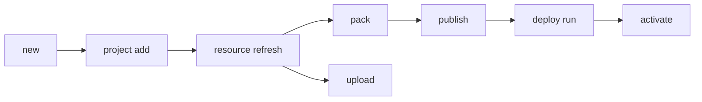

# Solutions (`uip solution`)

Create, pack, publish, deploy, and manage UiPath solution packages.

> For full option details on any command, use `--help` (e.g., `uip solution deploy run --help`).

---

## What is a Solution?

A UiPath Solution is a container that groups multiple automation projects (processes, libraries, tests) into a single deployable unit. Solutions enable:

- **Bundled deployment** -- Deploy multiple projects together as one package
- **Version management** -- Track and version the entire solution as a single entity
- **Configuration management** -- Apply environment-specific configuration at deploy time
- **Multi-environment promotion** -- Move solutions through dev, staging, and production

### Solution File Structure

```
MySolution/
├── MySolution.uipx          <- Solution manifest
├── ProjectA/                <- Automation project
│   ├── project.json / project.uiproj
│   └── *.cs / *.xaml
├── ProjectB/
└── config.json              <- Optional environment config
```

---

## Solution Lifecycle



Two distinct distribution paths from the same solution source:
- **`pack` → `publish` → `deploy run`** — promotes a versioned package to Orchestrator.
- **`upload`** — pushes the solution to Studio Web for browser-based debugging only. Does not produce a published package and cannot be deployed via `deploy run`.

Always run `resource refresh` before either path so the bundled artefact files and `userProfile/<userId>/debug_overwrites.json` reflect the current cloud state.

---

## Command Tree

```
uip solution
  ├── new <name>                          Create a new solution directory with .uipx manifest
  ├── delete <solution-id>                Delete a solution from Studio Web
  ├── upload <path>                       Upload solution to Studio Web
  ├── pack <solution> <output>            Pack into a deployable .zip package
  ├── publish <package>                   Upload packed solution to UiPath
  ├── project
  │     ├── add <projectPath> [solutionFile]    Register an existing subfolder in .uipx
  │     ├── remove <projectPath> [solutionFile] Unregister a project from .uipx
  │     └── import --source <path>              Copy external project into solution and register
  ├── resource
  │     ├── list                          List local, remote, or all resources (--solution-folder, default cwd)
  │     ├── refresh                       Sync resource declarations from project bindings (--solution-folder, default cwd)
  │     └── get <resource-key>            Get full configuration for a single resource — local or remote (--solution-folder, default cwd)
  ├── deploy
  │     ├── run -n <name>                 Deploy a published solution package
  │     ├── status <id>                   Check deployment status
  │     ├── list                          List deployments
  │     ├── activate <name>               Activate a deployment
  │     ├── uninstall <name>              Uninstall a deployment
  │     └── config
  │           ├── get <package-name>      Fetch default deploy config
  │           ├── set <file> ...          Set a resource property in config
  │           ├── link <file> <resource>  Link to an existing Orchestrator resource
  │           └── unlink <file> <resource> Remove a resource link
  └── packages
        ├── list                          List published solution packages
        └── delete <name> <version>       Delete a specific package version
```

---

## Workflow References

Each workflow doc covers a multi-command choreography for a specific goal. Load the one that matches your task.

| Workflow | File | Covers |
|----------|------|--------|
| Develop a Solution | [develop-solution.md](develop-solution.md) | Create, add projects, manage resources, upload |
| Pack & Deploy | [pack-and-deploy.md](pack-and-deploy.md) | Pack, publish, deploy run, deploy config |
| Activate & Manage | [activate-and-manage.md](activate-and-manage.md) | Activate, uninstall, packages list/delete |

---

## Related

- **Orchestrator** (`uip or`) -- Folders, processes, jobs, machines. See [orchestrator.md](../orchestrator/orchestrator.md).
- **Resources** (`uip resource`) -- Assets, queues, buckets used by solutions. See [resources.md](../resources/resources.md).
