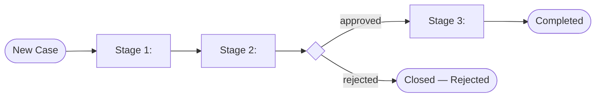

# Solution Design Document — <PROCESS_NAME>

<!-- Use this template when the primary product is Case Management.
     Case Management organizes work into stages with tasks, SLA rules, and escalation. -->

---

## Document History

| Date | Version | Author | Role | Comments |
|---|---|---|---|---|
| <DATE> | 1.0 | <AUTHOR> | Generated by AI Agent | Initial SDD generated from PDD |

---

## Table of Contents

1. Case Overview
2. Case Lifecycle Diagram
3. Stages
4. Tasks Grid
5. Entry / Exit Conditions
6. SLA Rules
7. Escalations
8. Task Type Registry
9. Integrated Components
10. Project Structure
11. Testing Strategy
12. Implementation Plan

---

# 1. Case Overview

| Field | Value |
|---|---|
| **Case name** | <CASE_NAME> |
| **Objective** | <OBJECTIVE> |
| **Case type** | <CASE_TYPE — invoice case, ticket case, claim case, etc.> |
| **Expected volume** | <CASES_PER_DAY> |
| **Typical case duration** | <DURATION_RANGE> |
| **Maximum case duration** | <HARD_MAX_BEFORE_BREACH> |

## In Scope

- <ACTIVITY_1>

## Out of Scope

- <ACTIVITY_1>

---

# 2. Case Lifecycle Diagram



---

# 3. Stages

<!-- Stages are BPMN-style phases in the case lifecycle. Each has entry/exit conditions and tasks. -->

| # | Stage Name | Purpose | Entry Condition | Exit Condition | SLA |
|---|---|---|---|---|---|
| 1 | <STAGE_NAME> | <PURPOSE> | <ENTRY_CONDITION> | <EXIT_CONDITION> | <SLA_DURATION> |

---

# 4. Tasks Grid

<!-- Tasks are organized as a 2D grid: tasks[lane][index].
     Lanes represent parallel execution tracks within a stage.
     Index is the sequence within a lane. -->

## Stage: <STAGE_NAME>

| Lane | Index | Task Name | Task Type | Purpose | Inputs | Outputs |
|---|---|---|---|---|---|---|
| 0 | 0 | <TASK_NAME> | <TASK_TYPE> | <PURPOSE> | <INPUT_FIELDS> | <OUTPUT_FIELDS> |
| 0 | 1 | <TASK_NAME> | <TASK_TYPE> | <PURPOSE> | <INPUT_FIELDS> | <OUTPUT_FIELDS> |
| 1 | 0 | <TASK_NAME> | <TASK_TYPE> | <PURPOSE> | <INPUT_FIELDS> | <OUTPUT_FIELDS> |

<!-- Repeat per stage. -->

---

# 5. Entry / Exit Conditions

## Stage entry conditions

| Stage | Condition | Notes |
|---|---|---|
| <STAGE_NAME> | <JSON_PATH_OR_EXPRESSION> | <NOTES> |

## Stage exit conditions

| Stage | Condition | Next Stage (on true) |
|---|---|---|
| <STAGE_NAME> | <EXPRESSION> | <TARGET_STAGE> |

## Case exit conditions

| Condition | Final Status |
|---|---|
| <EXPRESSION> | <COMPLETED / REJECTED / CANCELLED> |

## Task entry conditions

| Task | Condition |
|---|---|
| <TASK_NAME> | <EXPRESSION> |

---

# 6. SLA Rules

| SLA ID | Applies To | Type | Duration / Condition | At-Risk Threshold |
|---|---|---|---|---|
| SLA-01 | <STAGE_OR_CASE> | <TIME_BASED / CONDITION_BASED> | <DURATION_OR_EXPRESSION> | <PERCENTAGE_BEFORE_BREACH> |

---

# 7. Escalations

| Escalation ID | Trigger | Action | Notify |
|---|---|---|---|
| ESC-01 | <SLA_AT_RISK / SLA_BREACHED / CONDITION> | <REASSIGN / ESCALATE / AUTO_RESOLVE> | <ROLE_OR_EMAIL> |

---

# 8. Task Type Registry

<!-- Each task maps to a taskTypeId from the registry. Registry resolution happens at implementation time;
     this section lists the *kinds* of tasks needed so the registry query can target them. -->

| Task Name (from §4) | Task Type Kind | Implementation |
|---|---|---|
| <TASK_NAME> | RPA | Invokes a Studio RPA process |
| <TASK_NAME> | AGENT | Invokes a UiPath Agent |
| <TASK_NAME> | API_WORKFLOW | Invokes an API Workflow |
| <TASK_NAME> | CONNECTOR_ACTIVITY | Integration Service connector action |
| <TASK_NAME> | CONNECTOR_TRIGGER | Integration Service connector trigger |
| <TASK_NAME> | HITL | Human-in-the-loop approval task |

---

# 9. Integrated Components

## RPA Processes Invoked

| Process Name | Called From Task | Purpose |
|---|---|---|
| `<PROCESS_NAME>` | <TASK_NAME> | <PURPOSE> |

## Agents Invoked

| Agent Name | Called From Task | Purpose |
|---|---|---|
| `<AGENT_NAME>` | <TASK_NAME> | <PURPOSE> |

## API Workflows Invoked

| API Workflow Name | Called From Task | Purpose |
|---|---|---|
| `<API_WORKFLOW_NAME>` | <TASK_NAME> | <PURPOSE> |

## Integration Service Connectors

| Connector | Called From Task | Operation |
|---|---|---|
| <CONNECTOR_NAME> | <TASK_NAME> | <OPERATION> |

## HITL Tasks

<!-- Inline in Case Management — use HITL task type with inline schema (do NOT route to HITL skill; Case Mgmt handles it directly). -->

| Task Name | Stage | Approval Schema | Who Approves |
|---|---|---|---|
| <TASK_NAME> | <STAGE_NAME> | <SCHEMA_SUMMARY> | <ROLE_OR_USER> |

---

# 10. Project Structure

```text
<CASE_PROJECT_NAME>/
├── caseplan.json
├── sdd.md                   (this file — input to planning)
├── tasks.md                 (generated during planning)
├── registry-resolved.json   (audit trail)
└── content/
    └── <CASE_NAME>.bpmn     (auto-generated)
```

---

# 11. Testing Strategy

## Canonical Test Case

| Field | Value |
|---|---|
| <FIELD_NAME> | `<TEST_VALUE>` |

## Happy Path Assertions

1. <ASSERTION_1>

## SLA Breach Scenarios

| Scenario | Setup | Expected Escalation |
|---|---|---|
| <SCENARIO> | <SETUP> | <EXPECTED> |

---

# 12. Implementation Plan

| # | Task | Dependencies | SDD Sections | Description |
|---|---|---|---|---|
| 1 | Generate tasks.md from this SDD | — | §3, §4 | Run planning phase |
| 2 | Resolve registry taskTypeIds | 1 | §8 | Match task names to registry |
| 3 | Create RPA processes called by tasks | — | §9 RPA | One task per invoked process |
| 4 | Create Agents called by tasks | — | §9 Agents | One task per invoked agent |
| 5 | Create API Workflows called by tasks | — | §9 API Workflows | One task per invoked API workflow |
| 6 | Configure Integration Service connectors | — | §9 Connectors | Configure connectors |
| 7 | Build caseplan.json | 2, 3, 4, 5, 6 | §3-§8 | Full case plan generation |
| 8 | Configure SLA rules and escalations | 7 | §6, §7 | Wire up SLA + escalations |
| 9 | Deploy and test | 8 | §11 | Deploy case plan, run canonical case |

---

**End of Solution Design Document.**
