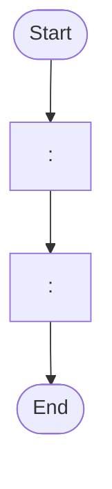

# Solution Design Document — <PROCESS_NAME>

<!-- Use this template when the primary product is RPA Process, RPA Library, or RPA Test Automation.
     Select the specific Project Type in §11 based on the PDD's intent. -->

---

## Document History

| Date | Version | Author | Role | Comments |
|---|---|---|---|---|
| <DATE> | 1.0 | <AUTHOR> | Generated by AI Agent | Initial SDD generated from PDD |

---

## Table of Contents

1. Process Overview
2. Process Map
3. Detailed Process Steps
4. Business Rules
5. Data Definitions
6. Value Mappings
7. Exception Handling
8. Error Handling
9. Application Inventory
10. Credentials & Assets
11. Project Structure
12. Implementation Mode
13. Testing Strategy
14. Implementation Plan

---

# 1. Process Overview

| Field | Value |
|---|---|
| **Process name** | <PROCESS_NAME> |
| **Objective** | <OBJECTIVE> |
| **Department / Function** | <DEPARTMENT> — <FUNCTION> |
| **Schedule** | <FREQUENCY_AND_HOURS> |
| **Volume** | <ITEMS_PER_DAY> (peak: <PEAK_PERIOD>) |
| **Avg. handling time (manual)** | <MANUAL_TIME> |
| **Avg. handling time (automated target)** | <AUTOMATED_TIME> |
| **Exception rate** | <ESTIMATED_RATE> |

## In Scope

- <ACTIVITY_1>
- ...

## Out of Scope

- <ACTIVITY_1>
- ...

---

# 2. Process Map

<!-- Build the process map STRICTLY from the steps extracted in Phase 1. Do not invent steps.
     Use mermaid flowchart syntax. One node per extracted step. -->



| Step | Description | Application |
|---|---|---|
| <STEP_NUMBER> | <SHORT_DESCRIPTION> | <APP_NAME> |

---

# 3. Detailed Process Steps

<!-- Single summary table for ALL steps. Add Step Details subsections ONLY for complex steps. -->

## Step Summary

| # | Action | Application | Input | Output | Rules | Errors |
|---|---|---|---|---|---|---|
| <STEP_NUMBER> | <ACTION> | <APP_NAME> | <INPUT> | <OUTPUT> | <BR_IDS> | <EXCEPTION_OR_ERROR_IDS> |

## Step Details

### Step <STEP_NUMBER> — <STEP_TITLE>

<DETAILED_DESCRIPTION_FOR_COMPLEX_STEPS_ONLY>

---

# 4. Business Rules

| ID | Rule Name | Description | Trigger Condition | Affected Steps |
|---|---|---|---|---|
| BR-01 | <RULE_NAME> | <DESCRIPTION> | <WHEN_DOES_IT_APPLY> | <STEP_NUMBERS> |

---

# 5. Data Definitions

<!-- Use ONLY the format matching the Implementation Mode from §12. Delete the unused format below.
     Type design constraints:
     - Keep types flat — no inheritance
     - Use `record` for immutable data, `class` for mutable
     - Maximum 15 properties per type
     - Default to `string` unless PDD specifies numeric, date, or boolean operations -->

## Option A — Coded C# / Hybrid Mode

### Transaction Data

```csharp
public record <TransactionDataType>
{
    public <TYPE> <FIELD_NAME> { get; init; }
}
```

### Output Data

```csharp
public record <OutputDataType>
{
    public <TYPE> <FIELD_NAME> { get; init; }
}
```

### Enums

```csharp
public enum <EnumName>
{
    <VALUE_1>,
    <VALUE_2>,
}
```

## Option B — XAML Mode

### Transaction Data (Dictionary)

| Key | Type | Source | Description |
|---|---|---|---|
| <KEY_NAME> | <TYPE> | <SOURCE_APP_AND_FIELD> | <DESCRIPTION> |

### Output Data (Dictionary)

| Key | Type | Description |
|---|---|---|
| <KEY_NAME> | <TYPE> | <DESCRIPTION> |

### Status/Category Values

| Variable | Allowed Values |
|---|---|
| <VARIABLE_NAME> | <COMMA_SEPARATED_VALUES> |

---

# 6. Value Mappings

## <MAPPING_NAME> — <SOURCE_APP> to <TARGET_APP>

| Source Value | Target Value |
|---|---|
| `<SOURCE_1>` | `<TARGET_1>` |

---

# 7. Exception Handling

| ID | Exception Name | Trigger Step | Trigger Condition | Action |
|---|---|---|---|---|
| B1 | <EXCEPTION_NAME> | <STEP_NUMBER> | <HOW_TO_DETECT> | <WHAT_TO_DO> |

**Default handler:** For any unanticipated business exception, <DEFAULT_ACTION>.

---

# 8. Error Handling

| ID | Error Name | Trigger Step | Trigger Condition | Retry Policy | Action |
|---|---|---|---|---|---|
| E1 | <ERROR_NAME> | <STEP_NUMBER> | <HOW_TO_DETECT> | <RETRY_COUNT_AND_BACKOFF> | <WHAT_TO_DO> |

**Default handler:** For any unanticipated system error, <DEFAULT_ACTION>.

---

# 9. Application Inventory

<!-- List all applications. For SaaS integrations (Salesforce, Jira, etc.), flag "Integration Service"
     in the Access Method column — the implementation plan will create a task to configure the connector. -->

| # | Application | Interface | Access Method | Role | Interaction Pattern | Session Management |
|---|---|---|---|---|---|---|
| 1 | <APP_NAME> | <WEB/DESKTOP/API> | <URL_OR_INTEGRATION_SERVICE> | <SOURCE/TARGET/UTILITY> | <READ/WRITE/READ-WRITE/TRANSIENT> | <PER_RUN/PER_ITEM> |

---

# 10. Credentials & Assets

| Asset Name | Type | Description | Notes |
|---|---|---|---|
| `<ASSET_NAME>` | <CREDENTIAL/TEXT/INT/BOOL> | <WHAT_IT_STORES> | <NOTES> |

---

# 11. Project Structure

## Project Type

<!-- Select ONE based on the PDD's intent: -->

- [ ] **Process** — standard end-to-end automation (default)
- [ ] **Library** — reusable component consumed by other automations
- [ ] **Test Automation** — test cases validating application behavior

## Recommended Structure

```text
<PROJECT_NAME>/
├── project.json
├── <MAIN_WORKFLOW>
├── <FOLDER>/
│   ├── <WORKFLOW_FILE>
│   └── ...
├── Data/
│   └── ...
└── Tests/
    └── ...
```

## Workflow Inventory

| # | Workflow File | Responsibility | PDD Steps | Inputs | Outputs |
|---|---|---|---|---|---|
| 1 | `<FILENAME>` | <RESPONSIBILITY> | <STEP_NUMBERS> | <INPUT_ARGS_WITH_TYPES> | <OUTPUT_ARGS_WITH_TYPES> |

## Workflow Dependencies

```text
<MAIN_WORKFLOW>
├── calls <WORKFLOW_1>
└── calls <WORKFLOW_2>
```

---

# 12. Implementation Mode

**Recommendation:** <XAML / Coded C# / Hybrid>

<2-3 sentence justification based on process characteristics.>

> **Note:** This is a preliminary recommendation. Detailed decision criteria will be applied during implementation and may adjust this choice.

---

# 13. Testing Strategy

## Canonical Test Case

| Field | Value |
|---|---|
| <FIELD_NAME> | `<TEST_VALUE>` |

## Happy Path Assertions

1. <ASSERTION_1>

## Exception Test Cases

| Exception ID | Test Setup | Trigger | Expected Outcome |
|---|---|---|---|
| B1 | <HOW_TO_SET_UP> | <WHAT_TRIGGERS_IT> | <EXPECTED_BEHAVIOR> |

## System Error Scenarios

| Error ID | Testable in Dev? | How to Simulate | Expected Outcome |
|---|---|---|---|
| E1 | <YES/NO> | <SIMULATION_METHOD> | <EXPECTED_BEHAVIOR> |

---

# 14. Implementation Plan

| # | Task | Dependencies | SDD Sections | Description |
|---|---|---|---|---|
| 1 | Create project scaffolding | — | §11, §12 | Create UiPath project (type: <PROJECT_TYPE>, mode: <IMPLEMENTATION_MODE>) |
| 2 | Define data models | — | §5, §6 | Create types/variables per chosen mode |
| 3 | Configure assets and credentials | — | §10 | Set up Orchestrator assets |
| 4 | Configure Integration Service connectors | — | §9 | Configure connectors for SaaS applications (if any) |
| 5 | Implement `<WORKFLOW_1>` | 1, 2 | §11 Workflow #1, §3 Steps <X-Y> | Build workflow per PDD steps |
| N-1 | Implement exception and error handling | 5..N-2 | §7, §8 | Wire up handlers |
| N | Implement test suite | 5..N-2 | §13 | Build tests |

---

**End of Solution Design Document.**
