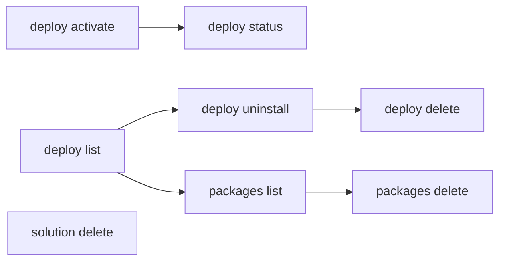

# Activate & Manage

Activate deployed solutions, uninstall deployments, and manage published solution packages.

> For full option details on any command, use `--help` (e.g., `uip solution deploy activate --help`).

## When to Use

- Activating a deployment that was not auto-activated
- Moving an existing deployment to another published version of its package in place — newer, or older to step back (when a redeploy is blocked because the deployment already exists)
- Cleaning up old or failed deployments
- Managing published package versions in the solution feed
- Removing solutions from Studio Web

## Prerequisites

- Authenticated — verify with `uip login status`; if not logged in, ask the user to run `uip login` (it opens an interactive browser flow)
- Solution deployed (see [pack-and-deploy.md](pack-and-deploy.md))

## Flow



---

## Step 1: Activate a Deployment

`solution deploy run` activates by default. Use `deploy activate` only when:
- the deploy was started with `--skip-activate`, or
- the previous activation failed (e.g. missing config) and you've fixed the cause and want to retry without redeploying.

Activation provisions all solution components (processes, queues, assets, etc.) in the target folder:

```bash
uip solution deploy activate "MyDeployment" --output json

# With custom polling
uip solution deploy activate "MyDeployment" --timeout 600 --poll-interval 10000 --output json
```

| Option | Description | Default |
|--------|-------------|---------|
| `<deployment-name>` | Name of the deployment to activate (required) | -- |
| `--timeout <seconds>` | Polling timeout | 360 |
| `--poll-interval <ms>` | Polling interval | 5000 |

## Step 2: Check Deployment Status

After activation (or any deployment operation), verify the state:

```bash
# By pipeline deployment ID (returned by deploy run)
uip solution deploy status <pipeline-deployment-id> --output json

# Or list all deployments and inspect
uip solution deploy list --output json
```

> `deploy status` reads the pipeline run against the **tenant** feed and takes
> no feed flag, so it cannot see a run in a Personal Workspace or a folder
> feed. For those, use `uip solution deploy list --personal-workspace` or
> `--feed <name-or-key>`, which do scope.

## Upgrade a Deployment In Place

When the package is **already deployed**, `deploy run` stops before installing and points you here (with a user session it checks the Solutions search first; an external app cannot read it and skips that check). Re-running `deploy run` under the same `--name` would not add a second copy — the install is keyed on the name, so it updates that deployment in place with the configuration you pass. To move a deployment to another version while keeping the values already set on it, upgrade it in place (the same as the Orchestrator UI's "Upgrade" button). `deploy upgrade` does that from the CLI, so you don't have to open the UI:

```bash
# By key (the Key from `deploy list`): name, package and feed are read from
# the deployment, so nothing else is needed
uip solution deploy upgrade <deployment-key> --output json

# By name, to the newest published version (default), waiting for it to finish
uip solution deploy upgrade --name <deployment-name> --package-name <pkg> --output json

# A specific version — the CI/CD form: no version lookup
uip solution deploy upgrade --name <deployment-name> --package-name <pkg> \
  --version 2.0.0 --output json

# A deployment in your Personal Workspace feed
uip solution deploy upgrade --name <deployment-name> --package-name <pkg> \
  --personal-workspace --output json

# Start it and return immediately
uip solution deploy upgrade --name <deployment-name> --package-name <pkg> \
  --no-wait --output json

# Discard the pending draft a rejected attempt left behind, then upgrade
uip solution deploy upgrade <deployment-key> --version 2.0.0 --discard-draft --output json
```

Find the deployment's key, name and package with `uip solution deploy list`. On success the output is `Code: SolutionDeployUpgrade`, `Data: { Status, Operation, DeploymentName, ToVersion, PipelineDeploymentId, DeploymentKey }`; the key form adds `FromVersion` (the version left behind) and `InstallDeploymentKey` — the key that stays the same across upgrades, so a pipeline that comes back later should store that one, not `DeploymentKey`, which changes with every upgrade. `Status` is the pipeline run's terminal status — `DeploymentSucceeded` once the upgrade landed, or `Accepted` with `--no-wait` (where `Operation` and `DeploymentKey` are absent, because no run has finished to report them). `PipelineDeploymentId` is what `uip solution deploy status` reads. With `--discard-draft`, `DiscardedDraftKey` names the draft that was deleted first; it is absent when there was none.

**Behavior and limits:**
- The deployment's **existing configuration is preserved** — the server carries each unchanged resource's configuration forward and takes only changed specs from the new package, so an upgrade does not regenerate a credential asset's secret. Resources the new version adds are created. This is the reason to use `deploy upgrade` rather than uninstall-and-redeploy.
- **Both forms work from CI/CD.** The key form resolves the key through a Pipelines lookup that external apps (client-credentials) can call, so it needs neither `--package-name` nor `--personal-workspace`: name, package and feed come from the deployment itself, and a key stored before an earlier upgrade still resolves to the deployment's current generation — so pass either the `Key` from `deploy list` or an `InstallDeploymentKey` you stored; both reach the live deployment. The name form needs `--package-name` because nothing name-keyed in Pipelines reports the package; with `--version` as well it makes no version lookup. It does check the name exists first — the install route treats an unknown name as a fresh install, so a typo fails with `ErrorCode: not_found` instead of creating a deployment. On a server that predates the by-key lookup, a key answers `ErrorCode: not_found` and the message points at the name form.
- **An external app can only upgrade tenant-feed deployments.** The server ignores the feed header on client-credentials requests, so a Personal Workspace or folder-feed deployment — addressed by key, or by name with `--personal-workspace` — is refused (`ErrorCode: permission_denied`) rather than silently creating a new tenant-feed deployment under the same name. Run those upgrades with a user session.
- **`Operation` is what tells you a version moved.** The install endpoint is unified, so asking for the version *already* deployed is a configuration change, not an upgrade. `Operation: "VersionChange"` means the version moved; `"ConfigurationChange"` means it did not and the configuration was re-applied instead. Read it rather than treating `DeploymentSucceeded` as proof of a new version — there is no pre-flight refusal: the name form makes no read that knows the deployed version, and the key form reports what the server did rather than second-guessing it (its `FromVersion` is there for the comparison if you want one).
- **The package is validated against the target before anything is installed.** The upgrade goes through the same Pipelines install as `deploy run`, which the server treats as an in-place upgrade when the deployment name already exists with the same package and a different version. Validation runs first, so a configuration the target rejects fails the command (exit `1`, `ErrorCode: invalid_argument`, `ValidationFailed` in `Message`) with the per-resource errors in `Instructions` and **the deployment still on its current version** — nothing is half-installed. Earlier CLI versions installed straight away and a late validation failure could strand the deployment in a state that offered only *Uninstall*.
- **A rejected attempt leaves a pending draft, and the draft owns the deployment until it is finished or discarded** — the same rule as the Orchestrator UI, which then offers only "continue editing" and "delete draft". The live version keeps running, but the next request for that deployment would reuse the draft rather than do what was asked. `Instructions` on the failure name the draft by its key. While it exists, `deploy upgrade` refuses the deployment before sending anything (`ErrorCode: invalid_argument`, naming the draft's key and the version it targets), because `upgrade` sends no configuration and could only re-run the rejected one. Two ways out:
  - **Drop the attempt:** once the cause is fixed, `deploy upgrade <deployment-or-draft-key> --discard-draft [--version <v>]` deletes the draft and upgrades the live version with its own configuration. It works from CI/CD by key; the name form finds the draft only with a user session. A draft still being validated cannot be discarded yet (`Retry: RetryLater`). On a server without the Pipelines discard endpoint the command says so and installs nothing — delete the draft in Orchestrator (Solutions → the deployment → Delete draft), then retry.
  - **Finish the attempt:** re-run the `deploy run` that failed, with the **same** `--package-version` and a corrected `--config-file` — the server re-validates the draft with the new file. Settings and resource links the file does not name keep the values the draft was rejected with, so name every one you mean to change.
  - A deployment whose *first* install never completed has nothing to upgrade: finish it with `deploy run`, or delete the draft in Orchestrator.
- By default the command **waits** for the install to reach a terminal state (`--timeout <seconds>`, default 300; `--poll-interval <ms>`, default 5000). Pass `--no-wait` to return as soon as the install is accepted.
- A failure reports the server's reason (for example `Solution folder not found` when the deployment's solution folder was deleted), not a bare status. The reason normally comes from the pipeline run itself; when the run record has already been recycled the CLI reads the deployment's validation result instead, and says `the server reported no reason.` only when the server genuinely gives none.
- After a successful upgrade the deployment can land in `ReadyToActivate` rather than `Active`. Check with `uip solution deploy list` and run `uip solution deploy activate <deployment-name>` if activation is pending.
- **Any published version of the same package is a valid target.** Omit `--version` to take the newest (one extra lookup), or pass `--version <version>` for a specific one — including an older version, to step back. Requesting the version already deployed is not refused; it comes back as `Operation: "ConfigurationChange"` (see above) — unless a pending draft is in the way, which is refused whatever the version (see above).
- The server decides what may be upgraded, and refuses synchronously — before any `PipelineDeploymentId` exists — when the deployment name does not exist, when it belongs to a different package than `--package-name`, when an operation is already in progress on it, when a pending draft for another version stands in the way (reported as the pending-draft refusal above), or when it is not in an upgradeable state. A deployment an **earlier CLI version** left in `ValidateError` (the late-validation state described above) is upgradeable on current Orchestrator, which is how you move it on; on an older Automation Solutions build it is refused, and uninstall-and-redeploy is the only way out.

## Step 3: Uninstall a Deployment

Remove a deployment, including all provisioned resources and the Orchestrator folder:

```bash
uip solution deploy uninstall "MyDeployment" --output json

# With custom polling
uip solution deploy uninstall "MyDeployment" --timeout 600 --poll-interval 10000 --output json
```

| Option | Description | Default |
|--------|-------------|---------|
| `<deployment-name>` | Name of the deployment to uninstall (required) | -- |
| `--timeout <seconds>` | Polling timeout | 360 |
| `--poll-interval <ms>` | Polling interval | 5000 |

This is destructive -- it removes the Orchestrator folder and all resources that were provisioned by the deployment.

### Then Delete the Deployment Record

Uninstall does not remove the deployment itself. It stays in `deploy list`, and Orchestrator refuses to uninstall it a second time. Remove it with:

```bash
uip solution deploy delete "MyDeployment" --yes --output json
```

The service offers one action per state, and `deploy list` reports which in `Actions`:

| Deployment state | `Actions` | What removes it |
|---|---|---|
| Installed | `SetupActivation, Uninstall, Upgrade` | `deploy uninstall` |
| Uninstalled | `Delete` | `deploy delete` |
| Never installed (`Draft`, e.g. a failed install) | `Install, Delete` | `deploy delete` |

So a full clean-up is two commands, and the two are never interchangeable. `deploy delete` reads the action list first: when the record lists actions but not `Delete` it refuses locally and names the command to run instead, so it cannot remove a live deployment's resources. A record that lists no actions at all is the exception — nothing is known about it, so the request goes to the server and the server decides.

The leftover record does not block a redeploy of the same package, so the delete is housekeeping. Do it when a tenant is shared, where uninstalled and failed deployments otherwise accumulate in every `deploy list`.

## Step 4: List Published Packages

View all solution packages that have been published to the feed:

```bash
uip solution packages list --output json

# Paginate and sort
uip solution packages list --limit 20 --sort-by "Name" --sort-order "Ascending" --output json
uip solution packages list --limit 50 --offset 50 --output json   # page 2

# Filter by name (server-side substring match on the package name, case-insensitive)
uip solution packages list --name "Invoice" --output json
```

| Option | Description | Default |
|--------|-------------|---------|
| `--limit <n>` | Number of results to return | 50 |
| `--offset <n>` | Number of results to skip (page start) | 0 |
| `--name <pattern>` | Server-side substring match on the package name | -- |
| `--sort-by <field>` | Sort field | -- |
| `--sort-order <dir>` | `Ascending` or `Descending` | -- |

The response's `Pagination` block reports `Total` (all matches on the server) and `HasMore`. If `HasMore` is `true`, re-run with `--offset <previous offset + Returned>` to fetch the next page — a package missing from the first page is not necessarily absent. The list is tenant-scoped: packages published on another tenant of the same organization do not appear; check the active tenant with `uip login status`.

## Step 5: Download a Package Version

Download a published solution package .zip from the solution feed:

```bash
# Latest ready/active version, saved as ./MySolution.<version>.zip
uip solution packages download "MySolution" --output json

# Specific version, saved to a directory or full file path
uip solution packages download "MySolution" "1.0.0" --destination ./packages/ --output json
uip solution packages download "MySolution" --package-version "1.0.0" --destination ./packages/MySolution.1.0.0.zip --output json
```

Use `--destination <path>` for the local output file or directory. Reserve `--output json` for the CLI response format when you need to parse the command result.

| Option | Description | Default |
|--------|-------------|---------|
| `<package-name>` | Published solution package name | -- |
| `[package-version]` | Package version to download | Latest ready/active version |
| `--package-version <version>` | Version selector alternative to the positional version | Latest ready/active version |
| `--destination <path>` | Local .zip file path or directory | Current directory |

## Step 6: Delete a Package Version

Remove a specific version of a published package from the solution feed:

```bash
uip solution packages delete "MySolution" "1.0.0" --output json
```

Arguments: `<package-name> <package-version>`. This deletes only the specified version, not all versions of the package.

## Step 7: Delete from Studio Web

Remove a solution from Studio Web (browser-based editor). This is separate from deployment management:

```bash
uip solution delete <solution-id> --output json
```

This removes the solution from Studio Web. It does **not** affect any deployed instances in Orchestrator.

---

## Complete Example

List deployments, uninstall an old one, and clean up the published package version:

```bash
# List current deployments
uip solution deploy list --limit 20 --output json

# Uninstall the old deployment
uip solution deploy uninstall "MySolution-v1" --output json

# Remove the record it leaves behind
uip solution deploy delete "MySolution-v1" --yes --output json

# Verify it was removed
uip solution deploy list --output json

# Clean up the old package version from the feed
uip solution packages list --output json
uip solution packages delete "MySolution" "1.0.0" --output json
```

---

## Variations and Gotchas

### `deploy uninstall` vs `solution delete`

These are different operations targeting different systems:

| Command | What it removes | System |
|---------|----------------|--------|
| `deploy uninstall <name>` | Orchestrator folder, provisioned resources | Orchestrator |
| `deploy delete <name>` | The deployment left behind by an uninstall, a superseded version, or a failed install | Orchestrator |
| `solution delete <id>` | Solution project | Studio Web |

Uninstalling a deployment does not remove the package from the solution feed. Deleting from Studio Web does not affect Orchestrator deployments.

### Activation Provisions Components

Activation is not instant. It provisions processes, queues, assets, and other resources in the Orchestrator folder. The command polls until completion or timeout. For large solutions, consider increasing `--timeout`.

### `packages delete` Deletes One Version

`packages delete` takes both a name **and** a version. It deletes only that specific version. To remove all versions, you must delete each one individually.

### `packages download` Uses `--destination` for Files

`--output` is the global CLI response format flag (`json`, `table`, `yaml`, `plain`). For downloaded solution package files, use `--destination <path>` so commands can also keep `--output json` for parseable results.

### Uninstall is Destructive

`deploy uninstall` removes the Orchestrator folder and all resources inside it. There is no undo. Verify the deployment name carefully before running this command.

### Polling Units

Same as `deploy run`: `--poll-interval` is in **milliseconds** (default 5000ms), `--timeout` is in **seconds** (default 360s).

---

## Related

- [pack-and-deploy.md](pack-and-deploy.md) -- Pack, publish, and deploy solutions
- [scenarios.md](scenarios.md) -- Multi-project recipes for resource-handling patterns
- [solution-overview.md](solution-overview.md) -- Solution overview and lifecycle
