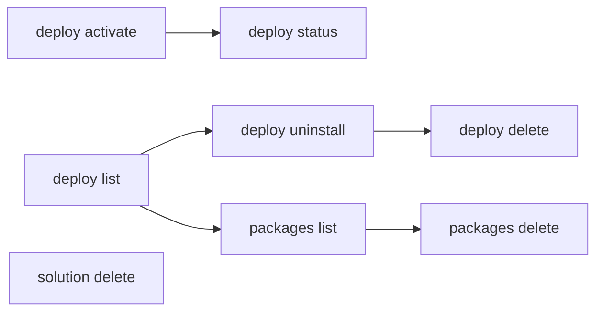

# Activate & Manage

Activate deployed solutions, uninstall deployments, and manage published solution packages.

> For full option details on any command, use `--help` (e.g., `uip solution deploy activate --help`).

## When to Use

- Activating a deployment that was not auto-activated
- Upgrading an existing deployment to a newer package version in place (when a redeploy is blocked because the deployment already exists)
- Cleaning up old or failed deployments
- Managing published package versions in the solution feed
- Removing solutions from Studio Web

## Prerequisites

- Authenticated — verify with `uip login status`; if not logged in, ask the user to run `uip login` (it opens an interactive browser flow)
- Solution deployed (see [pack-and-deploy.md](pack-and-deploy.md))

## Flow



---

## Step 1: Activate a Deployment

`solution deploy run` activates by default. Use `deploy activate` only when:
- the deploy was started with `--skip-activate`, or
- the previous activation failed (e.g. missing config) and you've fixed the cause and want to retry without redeploying.

Activation provisions all solution components (processes, queues, assets, etc.) in the target folder:

```bash
uip solution deploy activate "MyDeployment" --output json

# With custom polling
uip solution deploy activate "MyDeployment" --timeout 600 --poll-interval 10000 --output json
```

| Option | Description | Default |
|--------|-------------|---------|
| `<deployment-name>` | Name of the deployment to activate (required) | -- |
| `--timeout <seconds>` | Polling timeout | 360 |
| `--poll-interval <ms>` | Polling interval | 5000 |

## Step 2: Check Deployment Status

After activation (or any deployment operation), verify the state:

```bash
# By deployment name (preferred): the record's state, found across feeds
uip solution deploy status "MyDeployment" --output json

# By deployment key (from deploy list, or VersionChangeKey from deploy upgrade): same, and it says when the key is superseded
uip solution deploy status <deployment-key> --output json

# By pipeline deployment ID (returned by deploy run): progress and errors of that run
uip solution deploy status <pipeline-deployment-id> --output json

# Or list all deployments and inspect
uip solution deploy list --output json
```

With a deployment name or key the answer is `Data: { DeploymentKey, Superseded, CurrentDeploymentKey, InstallDeploymentKey, Name, PackageName, PackageVersion, NewPackageVersionAvailable, Operation, OperationStatus, ActivationStatus, Actions, PendingResources?, NextSteps? }`. The state fields describe the **current** record of that deployment: `Superseded: true` means the key you passed belongs to an earlier record (every operation creates a new one) and `CurrentDeploymentKey` is the one to use from now on. `NextSteps` is present exactly when the deployment is not live; `PendingResources` lists the resources that still need configuration (`Kind`, `Name`, `Type`). A key outside the tenant feed needs `--personal-workspace` or `--feed <name-or-key>`, as with `deploy list`.

## Upgrade a Deployment In Place

`deploy run` fails with HTTP 400 when a deployment for the solution **already exists** — you can't redeploy over it, you have to upgrade it in place (the same as the Orchestrator UI's "Upgrade" button). `deploy upgrade` does that from the CLI, so you don't have to open the UI:

```bash
# Upgrade to the newest published version (default), waiting for it to finish
uip solution deploy upgrade <deployment-key> --output json

# A deployment in your Personal Workspace feed
uip solution deploy upgrade <deployment-key> --personal-workspace --output json

# Start it and return immediately
uip solution deploy upgrade <deployment-key> --no-wait --output json
```

Find `<deployment-key>` with `uip solution deploy list`. On success the output is `Code: SolutionDeployUpgrade`, `Data: { Status, DeploymentName, FromVersion, ToVersion, VersionChangeKey, ActivationStatus, Actions }`, plus `PendingResources` and `NextSteps` when the deployment is not live. `Status` is the deployment operation status — `Successful` once the upgrade landed, or `Draft` with `--no-wait`. `ActivationStatus` is the second axis: whether the new version **runs** (see below).

**Behavior and limits:**
- The deployment's **existing configuration is preserved** — values already set on the deployment carry over instead of being reset to the package defaults, so an upgrade does not regenerate a credential asset's secret. Resources the new version adds are created. This is the reason to use `deploy upgrade` rather than uninstall-and-redeploy.
- **The upgrade takes two server steps, and the command does both.** The upgrade call only *queues* the move: it creates a second deployment record (operation `VersionChange`, status `Draft`) and leaves the live version alone. Nothing advances that draft on its own — it sits in `Draft` indefinitely — so the command then installs it. `VersionChangeKey` in the output is that new record's key; it is **not** the key you passed in.
- By default the command **waits** for the install to reach a terminal state (`--timeout <seconds>`, default 300; `--poll-interval <ms>`, default 5000). Pass `--no-wait` to return as soon as the install is accepted.
- A failed install reports the server's reason (for example `Solution folder not found` when the deployment's solution folder was deleted), not a bare `Failed`.
- **`Status: Draft` after the command returned is only normal with `--no-wait`.** Everywhere else it means the install of the version-change record never completed — validation rejected something. The draft does not advance on its own and cannot be activated; the live version stays on the old one. The command's message carries the server's reason — act on that, then retry `deploy upgrade`. Note the retry can itself be refused with `Another upgrade has already started for this deployment` while the draft record is still queued. There is no `--config-file` on this path (the upgrade keeps the deployment's existing configuration), and `deploy run` is refused too, because the original deployment is still there. See [A deploy that stops in `Draft`](pack-and-deploy.md#a-deploy-that-stops-in-draft) for the equivalent on a fresh deploy.
- **`Status: Successful` does not mean the new version runs.** Read `ActivationStatus` in the same output. `NeedsSetupToActivate` means the new version is installed but does not run until "Setup activation" is completed in Orchestrator (Tenant > Solutions > Deployments; the UI shows the deployment as **Inactive (Needs setup)**) — typically an Integration Service connection whose configuration the upgrade could not carry over; `PendingResources` names it and `NextSteps` says what to do. The old version keeps running meanwhile. Do **not** run the upgrade again: the content is already there. The CLI has no command for this step on an existing deployment (`deploy config link` only serves a new `deploy run`, and `deploy upgrade` takes no config file), and `deploy activate` is refused with `4007 … cannot be activated` until it is done. `ReadyToActivate` / `Inactive` is different: run `uip solution deploy activate <deployment-name>`.
- Only the **latest** published version is a valid target today. Omit `--version` to take the newest; passing an older `--version` is rejected.
- **A key is one record, not the deployment.** `deploy run`, `deploy upgrade` and the Orchestrator wizard each create a new deployment record with its own key; `deploy list` shows the newest one. A key from before an upgrade is *superseded* and still answers as it was — old version, `Active`, `Upgrade` offered — so upgrading it is refused: the service answers `4005 Another upgrade has already started for this deployment`, or, when that old record is already at the newest version, the CLI refuses before the request. Neither means an upgrade is running: the CLI answers `deployment_superseded` and names the current record, its version and whether a newer version exists. Take the current key from `deploy list` (or from `deploy status <old-key>` → `CurrentDeploymentKey`). A `4005` on a key that *is* current means an operation really is in progress — wait for `deploy list` to show `Successful`, then retry.
- **An abandoned "Setup activation" has an exit.** Starting the wizard in Orchestrator and leaving it creates an `ActivationSetup` / `Draft` record on top (`Actions: [Install, Delete]`). `uip solution deploy delete <deployment-name> --yes` removes that record alone; the installed record is the head again, still `NeedsSetupToActivate`, folder and resources untouched. Finishing the wizard instead lands `ActivationSetup` / `Successful` / `Active`.
- The deployment must be a healthy, successfully-installed one. A deployment that never installed cleanly is rejected by the server.

## Step 3: Uninstall a Deployment

Remove a deployment, including all provisioned resources and the Orchestrator folder:

```bash
uip solution deploy uninstall "MyDeployment" --output json

# With custom polling
uip solution deploy uninstall "MyDeployment" --timeout 600 --poll-interval 10000 --output json
```

| Option | Description | Default |
|--------|-------------|---------|
| `<deployment-name>` | Name of the deployment to uninstall (required) | -- |
| `--timeout <seconds>` | Polling timeout | 360 |
| `--poll-interval <ms>` | Polling interval | 5000 |

This is destructive -- it removes the Orchestrator folder and all resources that were provisioned by the deployment.

### Then Delete the Deployment Record

Uninstall does not remove the deployment itself. It stays in `deploy list`, and Orchestrator refuses to uninstall it a second time. Remove it with:

```bash
uip solution deploy delete "MyDeployment" --yes --output json
```

The service offers one action per state, and `deploy list` reports which in `Actions`:

| Deployment state | `Actions` | What removes it |
|---|---|---|
| Installed | `SetupActivation, Uninstall, Upgrade` | `deploy uninstall` |
| Uninstalled | `Delete` | `deploy delete` |
| Never installed (`Draft`, e.g. a failed install) | `Install, Delete` | `deploy delete` |

So a full clean-up is two commands, and the two are never interchangeable. `deploy delete` reads the action list first: when the record lists actions but not `Delete` it refuses locally and names the command to run instead, so it cannot remove a live deployment's resources. A record that lists no actions at all is the exception — nothing is known about it, so the request goes to the server and the server decides.

The leftover record does not block a redeploy of the same package, so the delete is housekeeping. Do it when a tenant is shared, where uninstalled and failed deployments otherwise accumulate in every `deploy list`.

## Step 4: List Published Packages

View all solution packages that have been published to the feed:

```bash
uip solution packages list --output json

# Paginate and sort
uip solution packages list --limit 20 --sort-by "Name" --sort-order "Ascending" --output json
uip solution packages list --limit 50 --offset 50 --output json   # page 2

# Filter by name (server-side substring match on the package name, case-insensitive)
uip solution packages list --name "Invoice" --output json
```

| Option | Description | Default |
|--------|-------------|---------|
| `--limit <n>` | Number of results to return | 50 |
| `--offset <n>` | Number of results to skip (page start) | 0 |
| `--name <pattern>` | Server-side substring match on the package name | -- |
| `--sort-by <field>` | Sort field | -- |
| `--sort-order <dir>` | `Ascending` or `Descending` | -- |

The response's `Pagination` block reports `Total` (all matches on the server) and `HasMore`. If `HasMore` is `true`, re-run with `--offset <previous offset + Returned>` to fetch the next page — a package missing from the first page is not necessarily absent. The list is tenant-scoped: packages published on another tenant of the same organization do not appear; check the active tenant with `uip login status`.

## Step 5: Download a Package Version

Download a published solution package .zip from the solution feed:

```bash
# Latest ready/active version, saved as ./MySolution.<version>.zip
uip solution packages download "MySolution" --output json

# Specific version, saved to a directory or full file path
uip solution packages download "MySolution" "1.0.0" --destination ./packages/ --output json
uip solution packages download "MySolution" --package-version "1.0.0" --destination ./packages/MySolution.1.0.0.zip --output json
```

Use `--destination <path>` for the local output file or directory. Reserve `--output json` for the CLI response format when you need to parse the command result.

| Option | Description | Default |
|--------|-------------|---------|
| `<package-name>` | Published solution package name | -- |
| `[package-version]` | Package version to download | Latest ready/active version |
| `--package-version <version>` | Version selector alternative to the positional version | Latest ready/active version |
| `--destination <path>` | Local .zip file path or directory | Current directory |

## Step 6: Delete a Package Version

Remove a specific version of a published package from the solution feed:

```bash
uip solution packages delete "MySolution" "1.0.0" --output json
```

Arguments: `<package-name> <package-version>`. This deletes only the specified version, not all versions of the package.

## Step 7: Delete from Studio Web

Remove a solution from Studio Web (browser-based editor). This is separate from deployment management:

```bash
uip solution delete <solution-id> --output json
```

This removes the solution from Studio Web. It does **not** affect any deployed instances in Orchestrator.

---

## Complete Example

List deployments, uninstall an old one, and clean up the published package version:

```bash
# List current deployments
uip solution deploy list --limit 20 --output json

# Uninstall the old deployment
uip solution deploy uninstall "MySolution-v1" --output json

# Remove the record it leaves behind
uip solution deploy delete "MySolution-v1" --yes --output json

# Verify it was removed
uip solution deploy list --output json

# Clean up the old package version from the feed
uip solution packages list --output json
uip solution packages delete "MySolution" "1.0.0" --output json
```

---

## Variations and Gotchas

### `deploy uninstall` vs `solution delete`

These are different operations targeting different systems:

| Command | What it removes | System |
|---------|----------------|--------|
| `deploy uninstall <name>` | Orchestrator folder, provisioned resources | Orchestrator |
| `deploy delete <name>` | The deployment left behind by an uninstall, a superseded version, or a failed install | Orchestrator |
| `solution delete <id>` | Solution project | Studio Web |

Uninstalling a deployment does not remove the package from the solution feed. Deleting from Studio Web does not affect Orchestrator deployments.

### Activation Provisions Components

Activation is not instant. It provisions processes, queues, assets, and other resources in the Orchestrator folder. The command polls until completion or timeout. For large solutions, consider increasing `--timeout`.

### `packages delete` Deletes One Version

`packages delete` takes both a name **and** a version. It deletes only that specific version. To remove all versions, you must delete each one individually.

### `packages download` Uses `--destination` for Files

`--output` is the global CLI response format flag (`json`, `table`, `yaml`, `plain`). For downloaded solution package files, use `--destination <path>` so commands can also keep `--output json` for parseable results.

### Uninstall is Destructive

`deploy uninstall` removes the Orchestrator folder and all resources inside it. There is no undo. Verify the deployment name carefully before running this command.

### Polling Units

Same as `deploy run`: `--poll-interval` is in **milliseconds** (default 5000ms), `--timeout` is in **seconds** (default 360s).

---

## Related

- [pack-and-deploy.md](pack-and-deploy.md) -- Pack, publish, and deploy solutions
- [scenarios.md](scenarios.md) -- Multi-project recipes for resource-handling patterns
- [solution-overview.md](solution-overview.md) -- Solution overview and lifecycle
