<!-- pdd:doc header="Insurance Claim Denial Management and Appeals {{RUN_TOKEN}} | Process Definition Document" footer="Confidential | BlueMountain Health System" client="BlueMountain Health System" author="Revenue Cycle Automation Team" date="29 September 2026" version="1.0" process="Insurance Claim Denial Management and Appeals {{RUN_TOKEN}}" -->

# Insurance Claim Denial Management and Appeals {{RUN_TOKEN}}

<!-- pdd:section id=business-context sources=as-is/overview.md,as-is/pain-points.md,to-be/overview.md,to-be/benefits.md reproj=g0 -->
## 1. Business Context

### 1.1 Problem Statement

BlueMountain Health System manages a long-running, document-heavy denial and appeals process through fax/mail, spreadsheets, and inboxes. The current approach obscures ownership and deadlines; missing the contractual 60-day Level 1 filing window permanently forfeits appeal rights, while payer requests can return cases to documentation gathering for weeks or months.

### 1.2 Objectives

- Establish one controlled denial case per incoming correspondence, with accountable ownership and status visibility.
- Protect the 60-day Level 1 filing deadline through receipt-based calculation, reminders, and escalation.
- Preserve evidence, submission proof, payer correspondence, and decision history in an auditable record.
- Apply physician-only control to peer-to-peer initiation while retaining human clinical, coding, financial, and closure judgment.

### 1.3 Expected Value

The future process improves visibility, timeliness, evidence traceability, and control consistency without automating clinical, coding, financial, or payer-strategy decisions. Measured acceptance signals are defined in Section 10.

[Refine section](delegate:refine-section?section=business-context)

<!-- pdd:section id=scope sources=as-is/scope.md,entities/applications/ reproj=g0 -->
## 2. Scope

### 2.1 Process Identity

| Item | Value |
| --- | --- |
| Process name | Insurance Claim Denial Management and Appeals |
| Process group | Revenue Cycle Automation, Phase 2 |
| Process identifier | BMHS-RCM-DENIALS-02 |
| Industry | Healthcare revenue cycle |

*Table 1: Process identity.*

### 2.2 Scope Boundaries

| In Scope | Out of Scope |
| --- | --- |
| Fax/mail denial intake and case tracking | Payer portal access, submission, or status checks |
| Evidence gathering and appeal coordination | EDI claim handling and automated claim resubmission |
| Level 1/2 appeal packet preparation and proof tracking | Patient billing and collections |
| Physician-only peer-to-peer support | Automated payer, settlement, write-off, or closure decisions |

*Table 2: Scope boundaries.*

### 2.3 Systems and Applications

| System | Role in Process | Access Type |
| --- | --- | --- |
| **Fax and mail intake** | Receives payer correspondence | Read |
| **Spreadsheets and inboxes** | Current manual tracking | Both |
| **Case Management Platform** | Proposed future case system of record | Both |

*Table 3: Systems and applications.*

[Refine section](delegate:refine-section?section=scope)

<!-- pdd:section id=current-state sources=as-is/overview.md,as-is/diagram.md,as-is/steps/,as-is/metrics.md,as-is/pain-points.md,as-is/stages/,as-is/stages.md,as-is/attachments.md reproj=g0 -->
## 3. Current State

### 3.1 Overview

The current workflow begins with denial/EOB correspondence received by fax or mail. Billing Specialists manually log, assess, document, submit, and follow up on denials using spreadsheets and inboxes, while Clinical Coders and physicians contribute when required.

### 3.2 Current Flow

| # | Current step |
| --- | --- |
| 1 | Receive and manually log denial correspondence. |
| 2 | Assess denial reason, amount, and appealability. |
| 3 | Gather clinical and coding evidence. |
| 4 | Submit reconsideration or formal appeal by fax/certified mail. |
| 5 | Track payer response and return to evidence gathering when requested. |
| 6 | Record overturned, upheld, or partial-settlement outcome. |

### 3.3 Metrics

| Metric | Current signal | Measurement method |
| --- | --- | --- |
| Priority denial mix | CO-16 and CO-97 are approximately 67% of FY2024 volume | Revenue Cycle reporting |
| Initial appeal deadline | 60 days from denial receipt | Contractual requirement |
| Case duration | Four to five months may occur | Stakeholder discovery note |
| Stage SLAs | Not documented | Open item |

*Table 4: Current-state metrics.*

### 3.4 Pain Points

| Where | What breaks | Impact |
| --- | --- | --- |
| Intake and tracking | Work is dispersed across spreadsheets and inboxes | Ownership and status are not visible |
| Deadline monitoring | Filing date may be missed | Appeal right is permanently forfeited |
| Evidence gathering | Payer requests restart informal record chasing | Cases can remain open for months |
| Role control | Non-physicians may attempt peer-to-peer contact | Payer rejects unauthorized requests |

*Table 5: Current-state pain points.*

```mermaid diagramFamily=case-design
flowchart LR
  denialReceived(("Denial received"))
  subgraph intake["Intake"]
    logDenial["Log denial"]
  end
  subgraph assessment["Assessment"]
    assessAppeal["Assess appealability"]
  end
  subgraph evidence["Evidence Gathering"]
    gatherDocs["Gather documents"]
    requestClinical["Request clinical support"]
  end
  subgraph appeal["Appeal Submission"]
    submitAppeal["Submit appeal"]
  end
  subgraph response["Payer Response"]
    trackResponse["Track payer response"]
  end
  subgraph resolution["Resolution"]
    recordOutcome["Record outcome"]
  end
  denialReceived --> logDenial
  logDenial --> assessAppeal
  assessAppeal -->|Appealable| gatherDocs
  assessAppeal -->|Do not appeal| recordOutcome
  gatherDocs --> requestClinical
  requestClinical --> submitAppeal
  submitAppeal --> trackResponse
  trackResponse -->|More records needed| gatherDocs
  trackResponse -->|Payer outcome| recordOutcome
  class denialReceived kind-event
  class logDenial kind-task,case-task-action,owner-billing-specialist
  class assessAppeal kind-decision,owner-billing-specialist
  class gatherDocs kind-task,case-task-action,owner-billing-specialist
  class requestClinical kind-task,case-task-action,owner-attending-physician
  class submitAppeal kind-task,case-task-action,owner-billing-specialist
  class trackResponse kind-task,case-task-action,owner-billing-specialist
  class recordOutcome kind-task,case-task-action,owner-billing-specialist,case-ends-case
```

[Open AS-IS diagram](delegate:open-diagram?which=as-is&anchor=current-state)

[Refine section](delegate:refine-section?section=current-state)

<!-- pdd:section id=target-state sources=to-be/overview.md,to-be/diagram.md,to-be/case-details.md,to-be/transformation-decisions.md,to-be/stages/,to-be/decisions-and-routes.md,to-be/data-and-evidence.md,to-be/exception-handling.md,to-be/slas.md,to-be/personas.md,to-be/benefits.md reproj=g0 -->
## 4. Future State

### 4.1 Vision

Each denial is managed as a controlled case with immutable correspondence, visible receipt-based deadline control, structured evidence states, accountable work queues, and human-authorized outcomes. Proposed UiPath capabilities support document intake/extraction, routing, reminders, packet preparation, audit updates, and human work items; clinical, coding, financial, submission, and closure judgment remains with people.

```mermaid diagramFamily=case-design
flowchart LR
  correspondenceReceived(("Correspondence received"))
  subgraph controlled_intake["Controlled Intake"]
    createCase["Create case"]
    reviewIntake["Review intake exception"]
  end
  subgraph triage_routing["Triage and Routing"]
    validateCase["Validate case"]
    routeCase["Route case work"]
  end
  subgraph evidence_management["Evidence Management"]
    manageEvidence["Manage evidence"]
    assessEvidence["Assess evidence"]
  end
  subgraph appeal_preparation["Appeal Preparation and Submission"]
    preparePacket["Prepare appeal packet"]
    recordSubmission["Record submission proof"]
  end
  subgraph payer_response["Payer Response Management"]
    processResponse["Process payer response"]
  end
  subgraph peer_to_peer["Peer-to-Peer Review"]
    physicianPeerReview["Conduct peer review"]
  end
  subgraph closure_review["Closure Review"]
    authorizeClosure["Authorize closure"]
  end
  correspondenceReceived --> createCase
  createCase -->|Matched| validateCase
  createCase -. uncertainty .-> reviewIntake
  reviewIntake -. corrected .-> validateCase
  validateCase --> routeCase
  routeCase -->|Evidence required| manageEvidence
  routeCase -->|Policy decision| authorizeClosure
  manageEvidence --> assessEvidence
  assessEvidence -->|Complete| preparePacket
  assessEvidence -. inadequate .-> manageEvidence
  preparePacket --> recordSubmission
  recordSubmission --> processResponse
  processResponse -->|More information| manageEvidence
  processResponse -->|Peer-to-peer eligible| physicianPeerReview
  physicianPeerReview --> processResponse
  processResponse -->|Outcome received| authorizeClosure
  class correspondenceReceived kind-event
  class createCase kind-task,case-task-rpa,owner-case-automation
  class reviewIntake kind-task,case-task-action,owner-billing-specialist
  class validateCase kind-task,case-task-action,owner-billing-specialist
  class routeCase kind-decision,owner-billing-specialist
  class manageEvidence kind-task,case-task-action,owner-billing-specialist
  class assessEvidence kind-task,case-task-action,owner-billing-specialist
  class preparePacket kind-task,case-task-rpa,owner-case-automation
  class recordSubmission kind-task,case-task-action,owner-billing-specialist
  class processResponse kind-task,case-task-rpa,owner-case-automation
  class physicianPeerReview kind-task,case-task-action,owner-attending-physician
  class authorizeClosure kind-task,case-task-action,owner-revenue-cycle-supervisor,case-ends-case
```

[Open TO-BE diagram](delegate:open-diagram?which=to-be&anchor=target-state)

### 4.2 Target Flow

| # | Stage | Owner | Required for completion |
| --- | --- | --- | --- |
| 1 | Controlled Intake | Case Automation / Billing Specialist | Yes |
| 2 | Triage and Routing | Billing Specialist | Yes |
| 3 | Evidence Management | Billing Specialist | Yes when appeal path selected |
| 4 | Appeal Preparation and Submission | Billing Specialist | Conditional |
| 5 | Payer Response Management | Billing Specialist | Conditional |
| 6 | Peer-to-Peer Review | Attending/Treating Physician | Conditional |
| 7 | Closure Review | Revenue Cycle Supervisor | Yes |

*Table 6: Future case stages.*

### 4.2.1 Future Work Details

> **Controlled Intake:** Converts fax/mail correspondence to a controlled, matched case while preserving the original and receipt timestamp.

| # | Case task | Case task type | Case work pattern | Activation | System(s) | Description |
| --- | --- | --- | --- | --- | --- |
| 1 | Create case | rpa | Legacy UI/RPA automation | On event; run once | Fax/mail intake; case platform | Create case, capture receipt timestamp, and link correspondence. |
| 2 | Review intake exception | action | Human action/review | On event | Case platform | Resolve unreadable, duplicate, unmatched, or uncertain intake. |

> **Triage and Routing:** Validates the denial context and assigns accountable next work.

| # | Case task | Case task type | Case work pattern | Activation | System(s) | Description |
| --- | --- | --- | --- | --- | --- |
| 1 | Validate case | action | Human action/review | In order | Case platform | Confirm match, identifiers, amount, and denial context. |
| 2 | Route case work | action | Human action/review | In order | Case platform | Select evidence, policy-review, appeal, or closure route. |

> **Evidence Management:** Maintains the evidence requirement, request, receipt, adequacy, and rework history.

| # | Case task | Case task type | Case work pattern | Activation | System(s) | Description |
| --- | --- | --- | --- | --- | --- |
| 1 | Manage evidence | action | Human action/review | On demand | Case platform | Request and track clinical/coding evidence. |
| 2 | Assess evidence | action | Human action/review | In order | Case platform | Record adequacy or return to evidence follow-up. |

> **Appeal Preparation and Submission:** Produces an evidence-complete package and retains human transmission proof.

| # | Case task | Case task type | Case work pattern | Activation | System(s) | Description |
| --- | --- | --- | --- | --- | --- |
| 1 | Prepare appeal packet | rpa | System workflow/process | In order | Case platform | Assemble the applicable packet checklist and documents. |
| 2 | Record submission proof | action | Human action/review | In order | Fax/certified mail; case platform | Billing Specialist submits through approved channel and records proof. |

> **Payer Response, Peer-to-Peer, and Closure:** Routes payer correspondence, restricts physician-only peer-to-peer, and requires human outcome authorization.

| # | Case task | Case task type | Case work pattern | Activation | System(s) | Description |
| --- | --- | --- | --- | --- | --- |
| 1 | Process payer response | rpa | System workflow/process | On event | Case platform | Index correspondence and create the next work item. |
| 2 | Conduct peer review | action | Human action/review | On demand | Case platform | Available only to attending/treating physician. |
| 3 | Authorize closure | action | Human action/review | In order | Case platform | Approve final outcome, closure reason, and archive readiness. |

### 4.3 What Changes

| Area | AS-IS | TO-BE | Why | How |
| --- | --- | --- | --- | --- |
| Tracking | Spreadsheets/inboxes | One case record | Visibility and accountability | Case state, owner, history, queues |
| Deadline control | Manual awareness | Receipt-based deadline clock | Avoid permanent forfeiture | Calculation, reminders, escalation |
| Evidence | Informal restarts | Managed requirement and evidence states | Preserve rework history | Structured requests and adequacy review |
| Peer-to-peer | Informal role exposure | Physician-only action | Enforce payer/internal restriction | Role-based task access |
| Closure | Informal outcome recording | Human-authorized closure gate | Preserve financial accountability | Required outcome evidence and rationale |

### 4.4 Case Work Summary

The proposed lifecycle contains human review/action work for intake exceptions, triage, evidence, submission, peer-to-peer, and closure; deterministic automation for intake, packet assembly, and response indexing. Policy-dependent write-off, PR-1, partial-settlement, SLA, and closure rules remain open configuration decisions.

[Refine section](delegate:refine-section?section=target-state)

<!-- pdd:section id=business-rules sources=as-is/business-rules.md,to-be/business-rules.md reproj=g0 -->
## 5. Business Rules

| Rule ID | Description |
| --- | --- |
| BR-001 | File initial Level 1 reconsideration within 60 days of denial receipt; retain deadline calculation and submission proof. |
| BR-002 | Only attending or treating physicians may initiate peer-to-peer review. |
| BR-003 | Use fax or certified/mailed correspondence; do not use payer portals, EDI, or automated resubmission in this phase. |
| BR-004 | Do not automatically write off, appeal, settle, or close a case where policy authority is unresolved. |
| BR-005 | Preserve original correspondence, evidence, packet versions, responses, submissions, decisions, and case transitions. |

*Table 7: Business rules.*

==TBD: confirm the final write-off threshold and exception authority before rule configuration==

==TBD: confirm PR-1 routing and partial-settlement authority before rule configuration==

[Refine section](delegate:refine-section?section=business-rules)

<!-- pdd:section id=data-model sources=entities/artifacts/,as-is/data-inputs-outputs.md reproj=g0 -->
## 6. Data Model

### 6.1 Entities

| Entity | Description |
| --- | --- |
| Denial case | Controlled record representing a denial lifecycle. |
| Denial/EOB | Original payer correspondence that triggers the case. |
| Evidence item | Requested or received documentation with adequacy state. |
| Appeal packet | Versioned set of appeal documents and rationale. |
| Submission confirmation | Fax/mail proof linked to appeal level and timestamp. |
| Payer response | Incoming request, decision, or outcome correspondence. |

### 6.2 Data Inputs and Outputs

| Artifact | Source / Destination | Format | Consumed / Produced By |
| --- | --- | --- | --- |
| **Denial/EOB** | Payer → BlueMountain | Fax or mailed document | Intake and Billing Specialist |
| **Appeal package** | BlueMountain → payer | Fax/certified mail packet | Billing Specialist, Coder, Physician |
| **Submission proof** | Delivery channel → case | Fax/mail confirmation | Billing Specialist |

*Table 8: Data inputs and outputs.*

### 6.3 Field-Level Data Dictionary

| Field | Type | Format / Pattern | Valid values / range | Mandatory | Privacy class |
| --- | --- | --- | --- | --- | --- |
| Case ID | Identifier | System-generated | Unique | Yes | Internal |
| Receipt timestamp | Date/time | ISO date-time | Valid received time | Yes | Internal |
| Denial code | Text | CARC code | Source correspondence | Yes when present | Internal |
| Claim amount | Currency | USD | Non-negative | Yes when present | Financial |
| Level 1 deadline | Date | Calculated | Receipt + 60 days | Yes | Internal |
| Patient/member identifier | Text | Source identifier | Source correspondence | As available | PII/PHI |

### 6.4 Data Flow and Lineage

| # | Data movement |
| --- | --- |
| 1 | Fax/mail correspondence enters controlled intake and is retained as the immutable original. |
| 2 | Case metadata, receipt timestamp, and matched claim context are recorded. |
| 3 | Evidence and packet versions are linked to the case and appeal level. |
| 4 | Submission proof and payer response update the case history. |
| 5 | Human-authorized outcome and closure reason are archived with audit history. |

### 6.5 Integrations

| Integration (System → System) | Fields passed | Connector / type | Endpoint + Auth |
| --- | --- | --- | --- |
| Fax/mail intake → Case platform | Correspondence, receipt timestamp, extracted identifiers | Proposed file/API or controlled UI integration | Not confirmed |
| Case platform → Approved outbound channel | Appeal packet and correspondence | Human-controlled fax/mail preparation | Not confirmed |

==TBD: confirm the integration endpoint and authentication at SDD==

[Refine section](delegate:refine-section?section=data-model)

<!-- pdd:section id=people sources=entities/people/ reproj=g0 -->
## 7. People

### 7.1 Roles and Personas

| Stakeholder | Responsibility |
| --- | --- |
| Billing Specialist | Primary case owner; validates intake, gathers evidence, submits Levels 1/2, and records correspondence. |
| Clinical Coder | Reviews coding-related denials and provides coding rationale. |
| Attending or Treating Physician | Sole authorized initiator of peer-to-peer review; supplies clinical evidence. |
| Revenue Cycle Supervisor | Monitors aging/deadline risk and performs authorized escalation or closure review. |
| Payer | Issues denials, requests information, and communicates outcomes. |
| Case Automation | Creates/updates case records, calculates deadlines, indexes documents, routes work, and records audit events. |

*Table 9: Roles and personas.*

[Refine section](delegate:refine-section?section=people)

<!-- pdd:section id=raci sources=entities/people/ reproj=g0 -->
## 7.2 RACI

| Activity/Stage | Responsible | Accountable | Consulted | Informed |
| --- | --- | --- | --- | --- |
| Controlled Intake | Case Automation; Billing Specialist for exceptions | Revenue Cycle Supervisor | Billing Specialist | Case owner |
| Triage and Routing | Billing Specialist | Revenue Cycle Supervisor | Clinical Coder | Attending/Treating Physician where needed |
| Evidence Management | Billing Specialist | Revenue Cycle Supervisor | Clinical Coder; Physician | Case owner |
| Appeal Submission | Billing Specialist | Revenue Cycle Supervisor | Clinical Coder; Physician | Case owner |
| Peer-to-Peer Review | Attending/Treating Physician | Attending/Treating Physician | Billing Specialist | Revenue Cycle Supervisor |
| Closure Review | Revenue Cycle Supervisor | Revenue Cycle Supervisor | Billing Specialist | Relevant clinical/coding contributors |

*Table 10: RACI matrix.*

[Refine section](delegate:refine-section?section=raci)

<!-- pdd:section id=exceptions sources=as-is/exception-handling.md,to-be/exception-handling.md reproj=g0 -->
## 8. Exceptions and Error Handling

### 8.1 Known Exceptions

| Exception | Trigger | AS-IS Handling | TO-BE Handling |
| --- | --- | --- | --- |
| Intake uncertainty | Unreadable, unmatched, duplicate, or uncertain correspondence | Manual follow-up | Controlled exception-review work item and held case state |
| Evidence gap | Payer requests additional records or evidence is inadequate | Informal record chasing | Return to Evidence Management with tracked requirement, owner and history |
| Deadline risk | Level 1 not submitted before day 60 | May be missed | Visible warning and supervisor escalation; forfeiture recorded if missed |
| Unauthorized peer-to-peer | Non-physician attempts initiation | Payer rejects request | Physician-only task access |
| Submission failure | Fax/mail transmission fails or is returned | Not documented | Rework/exception queue with retained delivery attempt |

*Table 11: Known exceptions.*

### 8.2 Exception Data State Transitions

| Exception | Affected record | State on entry | State on resolution | State on terminal failure |
| --- | --- | --- | --- | --- |
| Intake uncertainty | Denial case | Intake exception hold | Routed | Held with reason |
| Evidence gap | Evidence item/case | Evidence follow-up required | Evidence adequate | Authorized closure/escalation |
| Deadline risk | Denial case | Deadline at risk | Submitted | Forfeited/closed with reason |
| Submission failure | Appeal packet | Submission exception | Submission confirmed | Escalated for human disposition |

### 8.3 HITL & Action Center Task Form Specifications

| Escalation point | Trigger | Fields surfaced | Available actions → resulting state | Task SLA | Assignee role |
| --- | --- | --- | --- | --- |
| Intake exception review | Unreadable, unmatched, duplicate or uncertain correspondence | Correspondence image, candidate match, identifiers, exception reason | Correct → Routed; hold → Intake exception hold | Not confirmed | Billing Specialist |
| Policy decision | Unresolved threshold/PR-1/authority rule | Claim amount, code, evidence, policy issue | Route → selected work; defer → policy hold | Not confirmed | Revenue Cycle Supervisor |
| Closure review | Payer outcome received | Outcome, payment detail, evidence, submission proof | Approve → Closed; return → active stage | Not confirmed | Revenue Cycle Supervisor |

<!-- doc:placeholder kind="screenshot" -->
> [!NOTE]
> **Screenshot Placeholder**
> Insert screenshot: case review form showing deadline, evidence status, route actions, and closure decision.

[Refine section](delegate:refine-section?section=exceptions)

<!-- pdd:section id=compliance sources=as-is/compliance.md,to-be/business-rules.md reproj=g0 -->
## 9. Compliance and Regulatory

### 9.1 Compliance Traceability Matrix

| Requirement / Rule | Enforced at | Evidence retained |
| --- | --- | --- |
| BR-001 — 60-day filing deadline | Triage, appeal preparation and escalation | Receipt timestamp, calculated due date, warning/escalation history, submission proof |
| BR-002 — physician-only peer-to-peer | Peer-to-Peer Review | Role authorization, request, physician outcome |
| BR-003 — approved channels | Appeal Submission | Packet version and fax/certified-mail proof |
| BR-004 — human policy/closure authority | Policy and Closure Review | Decision rationale, actor, timestamp, outcome |
| BR-005 — auditable history | All stages | Correspondence, evidence, transition, packet and decision history |

*Table 12: Compliance traceability.*

### 9.2 Audit and Traceability

The case retains receipt time, deadline calculation, owner/queue assignment, evidence state, work decisions, packet versions, transmission proof, payer responses, closure reason, and reopening history. PHI-bearing correspondence and clinical records require role-based, minimum-necessary handling; retention duration and legal-hold procedures are not confirmed.

==TBD: obtain RCM-POL-07 and confirm records-retention and legal-hold obligations==

[Refine section](delegate:refine-section?section=compliance)

<!-- pdd:section id=kpis sources=to-be/benefits.md reproj=g0 -->
## 10. KPIs and Acceptance Criteria

### 10.1 KPIs

| KPI | Target / acceptance signal |
| --- | --- |
| Level 1 filing timeliness | 100% of eligible cases submitted before the confirmed 60-day deadline; no preventable deadline breach |
| Deadline capture completeness | Every intake case has receipt timestamp and calculated deadline or an explicit exception reason |
| Evidence completeness | Measured baseline and target to be confirmed |
| Payer response aging | Measured baseline and target to be confirmed |
| Closure completeness | Every closed case has authorized outcome, rationale, and required evidence |
| Intake exception rate | Baseline and acceptable threshold to be confirmed |

*Table 13: KPIs and acceptance signals.*

### 10.2 Acceptance Criteria

- A case is created or routed to intake exception review for every received denial correspondence.
- The case records the original correspondence and receipt timestamp.
- Level 1 deadline is calculated from receipt and becomes visible to the assigned owner.
- Only the physician role can initiate peer-to-peer work.
- Human transmission proof is required before an appeal is marked submitted.
- A case cannot close without a human-authorized outcome, reason, and retained evidence.

==TBD: approve stage-level SLA, KPI baseline, and target values==

[Refine section](delegate:refine-section?section=kpis)

<!-- pdd:section id=assumptions-risks sources=queries/,as-is/scope.md reproj=g0 -->
## 11. Assumptions, Constraints, Dependencies and Risks

### 11.1 Assumptions

| Assumption | Detail |
| --- | --- |
| Current channels | Fax and mail remain the approved payer channels for this phase. |
| Priority volume | CO-16 and CO-97 remain the priority design focus because they represent approximately 67% of FY2024 claim-count volume. |

### 11.2 Constraints

| Constraint | Detail |
| --- | --- |
| Submission channels | No payer portal, EDI, or automated resubmission in scope. |
| Human judgment | Automation must not determine appealability, coding, medical necessity, financial acceptance, or closure. |
| Policy gaps | $500 threshold, PR-1 routing, SLAs, settlement authority, and loop limit are not confirmed. |

### 11.3 Dependencies

| Dependency | Type (hard/soft) | Detail |
| --- | --- |
| RCM-POL-07 | Hard | Required to validate code-specific appeal operating rules. |
| Policy decisions | Hard | Required before threshold, PR-1, settlement and loop rules can be configured. |
| Intake and case-system interfaces | Hard | Repository, endpoint, authentication and claim-data access are not confirmed. |
| KPI baseline collection | Soft | Needed to set performance targets beyond deadline compliance. |

### 11.4 Risks

| Risk | Mitigation |
| --- | --- |
| Deadline breach | Receipt-based countdown, warnings, escalation and submission proof. |
| Incorrect automated routing | Human validation and exception review; no automated financial/clinical decision. |
| Evidence loss or unclear provenance | Immutable original, linked evidence state and audit history. |
| Policy misconfiguration | Keep unresolved decisions in controlled human review until approved. |

[Refine section](delegate:refine-section?section=assumptions-risks)

<!-- pdd:section id=glossary sources=entities/ reproj=g0 -->
## 12. Glossary

| Term | Definition |
| --- | --- |
| Appeal packet | The versioned correspondence and evidence package prepared for payer review. |
| CARC | Claim Adjustment Reason Code. |
| Case | The controlled record for one denial lifecycle. |
| CO-16 | Denial for missing information needed for adjudication. |
| CO-97 | Bundling denial where service is considered included in another payment. |
| EOB | Explanation of Benefits/denial correspondence. |
| Evidence state | Status of an evidence requirement, such as requested, received, adequate, or inadequate. |
| Level 1 reconsideration | Initial written request asking the payer to reconsider a denial. |
| Peer-to-peer | Physician-to-medical-director clinical discussion; physician-only initiation. |
| PR-1 | Deductible amount/patient responsibility code; routing remains open. |

[Refine section](delegate:refine-section?section=glossary)

<!-- pdd:section id=next-steps sources=queries/open-questions.md reproj=g0 -->
## 13. Next Steps

| # | Action item |
| --- | --- |
| 1 | Obtain and review RCM-POL-07. |
| 2 | Confirm the director-approved write-off threshold in writing. |
| 3 | Confirm PR-1 routing and any exception scenarios. |
| 4 | Define stage-level SLAs, warning points, and escalation actions. |
| 5 | Define partial-settlement and unresolved-case closure authority. |
| 6 | Define documentation-loop escalation or closure policy. |
| 7 | Confirm intake, claim-data, and case-platform integration interfaces and authentication. |

[Refine section](delegate:refine-section?section=next-steps)

<!-- pdd:section id=appendix-a sources=derived reproj=g0 -->
## Appendix A: Process Map and Diagrams

The current and future process maps are embedded in Sections 3.4 and 4.1. The future map is the proposed case-lifecycle view for controlled intake, triage, evidence management, appeal preparation, payer response, physician-only peer-to-peer work, and authorized closure.

<!-- doc:placeholder kind="integration-diagram" -->
> [!NOTE]
> **Integration Diagram Placeholder**
> Insert diagram: fax/mail intake, proposed case platform, claim-data source, human work queues, outbound fax/certified-mail preparation, and audit history.

[Refine section](delegate:refine-section?section=appendix-a)
