<!-- pdd:doc header="Cobalt Claim File Request & Delivery {{RUN_TOKEN}} | Process Definition Document" footer="Confidential | Cobalt Mutual" client="Cobalt Mutual" author="UiPath Business Analysis Team" date="29 September 2026" version="1.0" process="Cobalt Claim File Request & Delivery {{RUN_TOKEN}}" -->

# Cobalt Claim File Request & Delivery {{RUN_TOKEN}}
<!-- pdd:section id=business-context sources=as-is/overview.md,as-is/pain-points.md,to-be/overview.md,to-be/benefits.md reproj=g0 -->
# 1. Business Context

## 1.1 Problem Statement
**MTS** legal-support tasks require processors to navigate several claim platforms, request channels, **Outlook**, **SharePoint**, **TeamConnect**, and **iManage** before a complete claim-document package can be delivered. The SOP documents manual classification, document assembly, follow-up, and completion updates, but does not provide volume, handling-time, backlog, or error-rate measurements. This creates operational risk at system handoffs, especially where restricted access, incomplete instructions, external responses, or release decisions require human judgment.

## 1.2 Objectives
- Create one controlled case for each matter/claim document request.
- Automate deterministic classification, checklist creation, status tracking, deadline monitoring, drafting, and approved status synchronization.
- Retain processors for ambiguous instructions, access, exception handling, NMN validation, and external-release approval.
- Preserve evidence for request, receipt, delivery, decision, and escalation actions.

## 1.3 Expected Value
The future process improves visibility, ownership, evidence quality, and operational consistency while retaining human decisions where they matter. Quantitative targets require baseline measurement; see Section 10.

[Refine section](delegate:refine-section?section=business-context)

<!-- pdd:section id=scope sources=as-is/scope.md,entities/applications/ reproj=g0 -->
# 2. Scope

## 2.1 Process Identity

| Process name | Process group | Process identifier | Industry |
|---|---|---|---|
| Cobalt Claim File Request & Delivery | Legal-support claims operations | To be assigned | Insurance |

## 2.2 Scope Boundaries

| In Scope | Out of Scope |
|---|---|
| MTS legal-support document tasks | Claim adjudication and coverage decisions |
| Policy Atlas, CRV, CLCC, ECM, and Venture routes | Reserve management and payment authorization |
| Claim notes, files, policy/UW, recordings, estimates, and instructed footage | Claim settlement activities |
| NMN, SharePoint delivery, iManage filing, and MTS completion | Outside counsel review of delivered content |

## 2.3 Systems and Applications

| System | Role in Process | Access Type |
|---|---|---|
| **MTS** | Task, instruction, matter, and completion system of record | Both |
| **Policy Atlas**, **CRV**, **CLCC**, **ECM**, **Venture Atlas** | Claim data and document retrieval/request routes | Both |
| **TeamConnect** | NMN template generation | Read/write |
| **Outlook** | Requests, notifications, and follow-ups | Read/write |
| **SharePoint** | Outside counsel package delivery | Read/write |
| **iManage** | NMN and correspondence filing | Read/write |
| **UiPath Maestro**, **Action Center**, and case automation | Future orchestration, human actions, and evidence tracking | Read/write |

[Refine section](delegate:refine-section?section=scope)

<!-- pdd:section id=current-state sources=as-is/overview.md,as-is/diagram.md,as-is/steps/,as-is/metrics.md,as-is/pain-points.md,as-is/stages.md,as-is/stages/,as-is/attachments.md reproj=g0 -->
# 3. Current State

## 3.1 Overview
The current process begins with an assigned MTS task and ends when required documents are delivered and the MTS task is completed. A processor manually interprets instructions, retrieves or requests documents, prepares notifications where eligible, assembles files, delivers to outside counsel, and manages exceptions across several systems.

## 3.2 Current Flow

| # | Current step |
|---|---|
| 1 | Intake and assign the MTS matter task. |
| 2 | Validate matter, claim, requirements, and eligibility. |
| 3 | Retrieve or request notes, claim files, policy/UW, recordings, estimates, or footage. |
| 4 | Prepare and file an eligible NMN. |
| 5 | Package, name, upload, and check in delivery files. |
| 6 | Resolve access, data, request, and response exceptions. |
| 7 | Update MTS actions and complete the task. |

## 3.3 Metrics

| Metric | Current signal | Measurement method |
|---|---|---|
| Policy/UW rush request | 3 business days in documented Policy Atlas/CRV scenarios | SOP |
| ECM policy/UW request | 10 business days non-rush; 3 business days rush | SOP |
| Missing-response follow-up | 3 business days where documented | SOP |
| Transcript turnaround | 4 business days standard; 2 business days rush | SOP |
| Volume, backlog, handling time, FTE | Not provided | Open measurement item |

## 3.4 Pain Points

| Where | What breaks | Impact |
|---|---|---|
| Multi-system work | Processors manually pivot between MTS, claim systems, forms, mailboxes, and repositories | Risk of delayed or inconsistent execution |
| Classification | Instructions, claim route, and required documents are interpreted manually | Risk of incorrect routing or incomplete package |
| Follow-up | External dependency tracking is email-driven | Risk of missed SLA and unclear ownership |
| Packaging | Files require manual naming, conversion, combination, and validation | Risk of control failure or rework |

```mermaid diagramFamily=case-design
flowchart LR
  caseStart(("MTS task assigned"))
  subgraph intake["Intake and Triage"]
    validate["Validate matter and claim"]
  end
  subgraph acquisition["Document Acquisition"]
    retrieve["Retrieve or request documents"]
  end
  subgraph notification["Notification and Correspondence"]
    prepareNmn["Prepare eligible NMN"]
  end
  subgraph delivery["Package and Deliver"]
    deliverFiles["Deliver document package"]
  end
  subgraph exceptions["Exception Resolution"]
    resolveIssue["Resolve access or data issue"]
  end
  subgraph completion["Completion"]
    closeTask["Update MTS and complete"]
  end
  caseStart --> validate
  validate -->|complete instruction| retrieve
  validate -. missing data or access .-> resolveIssue
  resolveIssue -. resolved .-> validate
  retrieve -->|documents ready| prepareNmn
  prepareNmn -->|NMN eligible or not required| deliverFiles
  deliverFiles --> closeTask
  class caseStart kind-event
  class validate kind-task,case-task-action,owner-northgate-processor,system-mts
  class retrieve kind-task,case-task-action,owner-northgate-processor,system-claim-platform
  class prepareNmn kind-task,case-task-action,owner-northgate-processor,system-teamconnect
  class deliverFiles kind-task,case-task-action,owner-northgate-processor,system-sharepoint
  class resolveIssue kind-task,case-task-action,owner-northgate-processor,system-outlook
  class closeTask kind-task,case-task-action,owner-northgate-processor,system-mts,case-ends-case
```

[Open AS-IS diagram](delegate:open-diagram?which=as-is&anchor=current-state)

[Refine section](delegate:refine-section?section=current-state)

<!-- pdd:section id=target-state sources=to-be/overview.md,to-be/diagram.md,to-be/case-details.md,to-be/transformation-decisions.md,to-be/stages/,to-be/decisions-and-routes.md,to-be/data-and-evidence.md,to-be/exception-handling.md,to-be/slas.md,to-be/personas.md,to-be/benefits.md reproj=g0 -->
# 4. Future State

## 4.1 Vision
The future process is a UiPath-orchestrated case lifecycle. **UiPath Maestro** and case automation create and route cases, track document requirements, monitor timing, execute deterministic work, and preserve evidence; **Action Center** retains processor judgment for ambiguity, restricted access, NMN validation, exceptions, and final delivery release.

```mermaid diagramFamily=case-design
flowchart LR
  caseStart(("Eligible MTS task"))
  subgraph intake["Intake and Triage"]
    createCase["Create and classify case"]
    reviewIntake["Review ambiguous instruction"]
  end
  subgraph acquisition["Document Acquisition"]
    acquireDocs["Retrieve or request documents"]
    waitResponse["Wait for external response"]
  end
  subgraph notification["Notification and Correspondence"]
    releaseNmn["Validate and release NMN"]
  end
  subgraph delivery["Package and Deliver"]
    approveDelivery["Approve external delivery"]
    uploadPackage["Upload approved package"]
  end
  subgraph exceptions["Exception Resolution"]
    resolveException["Resolve or escalate exception"]
  end
  subgraph completion["Completion"]
    closeCase["Update MTS and close"]
  end
  caseStart --> createCase
  createCase -->|complete| acquireDocs
  createCase -. ambiguous .-> reviewIntake
  reviewIntake -. corrected .-> createCase
  acquireDocs --> waitResponse
  waitResponse -->|received or resolved| releaseNmn
  releaseNmn --> approveDelivery
  approveDelivery -->|approved| uploadPackage
  approveDelivery -. correction required .-> resolveException
  uploadPackage --> closeCase
  acquireDocs -. access or data issue .-> resolveException
  resolveException -. resolved .-> acquireDocs
  class caseStart kind-event
  class createCase kind-task,case-task-process,owner-uipath-case-automation,system-mts
  class reviewIntake kind-task,case-task-action,owner-northgate-processor,system-action-center
  class acquireDocs kind-task,case-task-rpa,owner-uipath-case-automation,system-claim-platform
  class waitResponse kind-task,case-task-wait-for-timer,owner-uipath-case-automation
  class releaseNmn kind-task,case-task-action,owner-northgate-processor,system-action-center
  class approveDelivery kind-task,case-task-action,owner-northgate-processor,system-action-center
  class uploadPackage kind-task,case-task-rpa,owner-uipath-case-automation,system-sharepoint
  class resolveException kind-task,case-task-action,owner-northgate-processor,system-action-center
  class closeCase kind-task,case-task-rpa,owner-uipath-case-automation,system-mts,case-ends-case
```

[Open TO-BE diagram](delegate:open-diagram?which=to-be&anchor=target-state)

## 4.2 Target Flow

| # | Stage | Owner | Required for completion |
|---|---|---|---|
| 1 | Intake and Triage | UiPath Case Automation / Northgate Processor | Yes |
| 2 | Document Acquisition | UiPath Case Automation / Northgate Processor | Yes |
| 3 | Notification and Correspondence | Northgate Processor | Conditional |
| 4 | Package and Deliver | Northgate Processor | Yes |
| 5 | Exception Resolution | Northgate Processor / escalation owner | Conditional |
| 6 | Completion | UiPath Case Automation / Northgate Processor | Yes |

## 4.2.1 Future Work Details

### Intake and Triage
> Create a traceable case and route unclear work to a processor.

| Case task | Type | Pattern | Automation-to-processor handoff |
|---|---|---|---|
| Create case | process | System workflow | None; records source payload |
| Classify request | agent | AI reasoning | Ambiguous data creates a review action |
| Resolve ambiguity | action | Human review | Processor corrects classification; case returns to intake |

### Document Acquisition
> Track every document requirement through receipt, approved no-record outcome, or escalation.

| Case task | Type | Pattern | Automation-to-processor handoff |
|---|---|---|---|
| Create checklist | process | System workflow | None |
| Retrieve direct documents | rpa | Legacy UI automation | Failure or restricted access creates an action |
| Submit request | action | Human review | Processor submits source-specific requests |
| Wait for response | wait-for-timer | Timer wait | At-risk timer creates follow-up action |

### Notification and Correspondence
> Apply documented NMN eligibility and retain a human release control.

| Case task | Type | Pattern | Automation-to-processor handoff |
|---|---|---|---|
| Evaluate NMN eligibility | api-workflow | System workflow | Exclusion/ambiguity is shown to processor |
| Draft NMN | process | System workflow | Draft, recipient data, and pleadings are presented for release |
| Validate and release NMN | action | Human review | Processor sends/corrects/rejects draft |
| File correspondence | action | Human action | Processor confirms iManage filing |

### Package and Deliver
> Apply packaging controls before human-authorized external delivery.

| Case task | Type | Pattern | Automation-to-processor handoff |
|---|---|---|---|
| Validate package controls | process | System workflow | Failures create correction action |
| Prepare package | rpa | Legacy UI automation | Completed package is submitted for release |
| Approve external delivery | action | Human review | Processor approves, corrects, or rejects package |
| Upload and check in | rpa | Legacy UI automation | Delivery confirmation returns to case |

### Exception Resolution
> Make every exception state, owner, response deadline, and terminal decision visible.

| Case task | Type | Pattern | Automation-to-processor handoff |
|---|---|---|---|
| Create exception action | action | Human review | Processor selects resolution or escalation |
| Request external resolution | execute-connector-activity | Connector/API operation | Approved request is sent and retained |
| Wait for response | wait-for-connector | External event wait | Response updates case state |
| Escalate overdue item | action | Human review | Manager/specialist selects next outcome |

## 4.3 What Changes

| Area | AS-IS | TO-BE | Why | How |
|---|---|---|---|---|
| Intake | Manual MTS interpretation | Automated case creation/classification with review | Reduce re-keying and missed routing | Case orchestration and processor action |
| Document tracking | Email/system-dependent manual tracking | Requirement-level checklist and timers | Visible ownership and SLA control | Case activities and timed actions |
| Handoffs | Informal status handoff | Explicit action form with state transition | Prevent silent failure | Action Center assignment and audit history |
| Delivery | Manual checks and release | Automated controls plus processor approval | Protect external delivery | Validation gate before upload |

## 4.4 Case Work Summary
- System workflow/process: 5 core activities.
- Legacy UI/RPA automation: 3 activities.
- Human review/action: 7 activities, concentrated at ambiguity, external release, and exception decisions.
- External/timer waits: 2 activities.

[Refine section](delegate:refine-section?section=target-state)

<!-- pdd:section id=business-rules sources=as-is/business-rules.md,to-be/business-rules.md reproj=g0 -->
# 5. Business Rules

| Rule ID | Description |
|---|---|
| BR-001 | MTS instructions override the default delivery route; a processor confirms exceptions before release. |
| BR-002 | Each claim retains an independent document checklist and completion state. |
| BR-003 | NMN is excluded for D-file, subpoena, absent H-number, and MTS no-NMN conditions. |
| BR-004 | External delivery requires processor approval after package controls pass. |
| BR-005 | Protected documents are separated and payment-card-information documents are excluded from combined packages. |

[Refine section](delegate:refine-section?section=business-rules)

<!-- pdd:section id=data-model sources=entities/artifacts/,as-is/data-inputs-outputs.md reproj=g0 -->
# 6. Data Model

## 6.1 Entities

| Entity | Description |
|---|---|
| Claim-file request case | Managed record for one MTS matter/claim document request |
| Document requirement | Required document type and lifecycle status |
| Document package | Named files approved for delivery |
| Human action | Processor decision, correction, approval, or escalation record |

## 6.2 Data Inputs and Outputs

| Artifact | Source / Destination | Format | Consumed / Produced By |
|---|---|---|---|
| MTS matter task | MTS / case automation | Web record | Intake and completion |
| Claim documents | Claim systems / SharePoint or directed recipient | PDF, ZIP, email attachment | Acquisition and delivery |
| NMN | TeamConnect/MTS / Outlook/iManage | Template and email | Notification |

## 6.3 Field-Level Data Dictionary

| Field | Type | Format / Pattern | Valid values / range | Mandatory | Privacy class |
|---|---|---|---|---|---|
| Matter number | Text | MTS identifier | Valid MTS matter | Yes | Not confirmed |
| Claim number | Text | Platform-specific identifier | Valid claim format | Yes | Not confirmed |
| Document state | Choice | Case status | Required, Requested, Received, Exception, Delivered, N/A | Yes | Internal |
| Release decision | Choice | Action outcome | Approve, Correct, Reject, Escalate | Conditional | Internal |

## 6.4 Data Flow & Lineage

| # | Data movement |
|---|---|
| 1 | MTS task data creates the case and requirement checklist. |
| 2 | Claim systems and request channels provide source documents or request evidence. |
| 3 | Automation assembles status, controls, and package metadata. |
| 4 | Processor actions record decisions and trigger resulting states. |
| 5 | Approved material is delivered and MTS is updated. |

## 6.5 Integrations

| Integration | Fields passed | Connector / type | Endpoint + Auth |
|---|---|---|---|
| MTS to case automation | Matter, task, claim, instructions, status | Not confirmed | Not confirmed |
| Claim platforms to automation | Claim ID, documents, policy data | Not confirmed | Not confirmed |
| Case automation to SharePoint | Package and destination | Not confirmed | Not confirmed |

==TBD: confirm integration endpoints and authentication during solution design==

[Refine section](delegate:refine-section?section=data-model)

<!-- pdd:section id=people sources=entities/people/ reproj=g0 -->
# 7. People

## 7.1 Roles & Personas

| Stakeholder | Responsibility |
|---|---|
| Northgate Processor | Performs source-system work, validates exceptions, approves NMN and external delivery. |
| UiPath Case Automation | Creates/routs cases, tracks requirements, monitors timing, performs deterministic work, and records evidence. |
| Case Admin | Clarifies matter data, H-number, adjuster, or instruction issues. |
| Handling Adjuster | Grants access and supplies claim information. |
| Manager / Specialist | Resolves escalated source, policy, and access exceptions. |
| Outside Counsel Recipient | Receives approved document packages. |

[Refine section](delegate:refine-section?section=people)

<!-- pdd:section id=raci sources=entities/people/ reproj=g0 -->
# 7.2 RACI

| Activity/Stage | Responsible | Accountable | Consulted | Informed |
|---|---|---|---|---|
| Intake and triage | UiPath Case Automation / Northgate Processor | Northgate Processor | Case Admin | Manager |
| Document acquisition | Northgate Processor | Northgate Processor | Handling Adjuster | Case Admin |
| NMN release | Northgate Processor | Northgate Processor | Case Admin | Litigation Specialist |
| Delivery release | Northgate Processor | Northgate Processor | Case Admin | Outside Counsel Recipient |
| Exception escalation | Manager / Specialist | Northgate Processor | Handling Adjuster | Case Admin |

[Refine section](delegate:refine-section?section=raci)

<!-- pdd:section id=exceptions sources=as-is/exception-handling.md,to-be/exception-handling.md reproj=g0 -->
# 8. Exceptions and Error Handling

## 8.1 Known Exceptions

| Exception | Trigger | AS-IS Handling | TO-BE Handling |
|---|---|---|---|
| Incomplete instruction | Missing/contradictory MTS data | Processor contacts case admin | Action Center review; return to intake or escalate |
| Restricted access | Claim system rejects access | Email adjuster | Create access action and track response |
| No source record | Request/source says no record | Processor records outcome | Evidence-backed no-record decision or escalation |
| Overdue response | SOP follow-up timing reached | Manual email follow-up | Timer creates processor action and escalation path |
| Package failure | Protected/PCI/control issue | Manual rework | Validation failure creates correction action |

## 8.2 Exception Data State Transitions

| Exception | Affected record | State on entry | State on resolution | State on terminal failure |
|---|---|---|---|---|
| Missing data | Case | Exception | Intake ready | Escalated |
| Restricted access | Document requirement | Access pending | Acquisition ready | Escalated |
| No record | Document requirement | Awaiting response | Not applicable / documented no record | Escalated |
| Package failure | Delivery package | Validation failed | Ready for approval | Escalated |

## 8.3 HITL & Action Center Task Form Specifications

| Escalation point | Trigger | Fields surfaced | Available actions → resulting state | Task SLA | Assignee role |
|---|---|---|---|---|---|
| Intake ambiguity | Incomplete/contradictory instruction | MTS task, matter, claim, extracted requirement | Correct → Intake ready; Escalate → Escalated | Not confirmed | Northgate Processor |
| Access exception | Restricted claim | Claim ID, error, adjuster details | Request access → Awaiting response; Escalate → Escalated | SOP timing where applicable | Northgate Processor |
| NMN release | Eligible NMN draft | Template, recipients, pleadings, eligibility result | Approve → NMN sent; Correct → Draft; Reject → Bypass | Before delivery | Northgate Processor |
| Delivery release | Package ready | Files, controls, recipient, MTS instruction | Approve → Deliver; Correct → Package rework; Escalate → Exception | Before delivery | Northgate Processor |

<!-- doc:placeholder kind="screenshot" -->
> [!NOTE]
> **Screenshot Placeholder**
> Insert screenshot: Action Center delivery-release form showing package controls and Approve / Correct / Escalate actions.

[Refine section](delegate:refine-section?section=exceptions)

<!-- pdd:section id=compliance sources=as-is/compliance.md,to-be/business-rules.md reproj=g0 -->
# 9. Compliance and Regulatory

## 9.1 Compliance Traceability Matrix

| Requirement / Rule | Enforced at | Evidence retained |
|---|---|---|
| BR-001 MTS instruction priority | Delivery release | MTS instruction and action outcome |
| BR-002 Independent claim checklist | Acquisition and completion | Case activity history |
| BR-003 NMN eligibility exclusions | Notification | Eligibility result and processor action |
| BR-004 External release approval | Delivery | Approval and delivery confirmation |
| BR-005 Protected/PCI document control | Package validation | Validation result and separate-delivery evidence |

## 9.2 Audit & Traceability
The future case timestamps intake, classification, requests, receipts, actions, approvals, exception routing, delivery, and MTS completion. Retention duration, legal-hold requirements, and formal privacy classification are not confirmed in the supplied SOP.

==TBD: confirm retention, legal-hold, privacy, and audit-evidence requirements with Cobalt Mutual compliance stakeholders==

[Refine section](delegate:refine-section?section=compliance)

<!-- pdd:section id=kpis sources=to-be/benefits.md reproj=g0 -->
# 10. KPIs and Acceptance Criteria

## 10.1 KPIs

| KPI | Target / acceptance signal |
|---|---|
| Requirement tracking completeness | Every required document has a visible case state and owner. |
| Delivery control adherence | No external delivery occurs without a recorded processor release decision. |
| Exception traceability | Every exception reaches resolution, approved no-record outcome, or escalation. |
| SLA monitoring | Timer-driven actions are created at documented follow-up points. |

## 10.2 Acceptance Criteria
- An eligible MTS task creates one auditable case per matter/claim combination.
- Ambiguous, restricted, incomplete, and externally dependent items create an assigned human action rather than being silently closed.
- NMN exclusions are applied before drafting or release.
- Delivery package control failures prevent upload until a processor resolves or escalates the item.
- MTS completion occurs only when the document checklist is fully resolved.

==TBD: define measured volume, backlog, cycle-time, quality, and service-level acceptance thresholds==

[Refine section](delegate:refine-section?section=kpis)

<!-- pdd:section id=assumptions-risks sources=queries/,as-is/scope.md reproj=g0 -->
# 11. Assumptions, Constraints, Dependencies and Risks

## 11.1 Assumptions

| Assumption | Detail |
|---|---|
| Source-bounded scope | PDD covers claim-file request and delivery, not adjudication or settlement. |
| Human control | Processors retain judgment, access, release, and exception decisions. |

## 11.2 Constraints

| Constraint | Detail |
|---|---|
| Legacy applications | Integration/access mechanisms are not confirmed. |
| Source evidence | SOP provides operational procedures but no workload baseline. |
| Privacy/retention | Not confirmed. |

==TBD: confirm privacy class, retention, legal hold, and peak-load constraints==

## 11.3 Dependencies

| Dependency | Type | Detail |
|---|---|---|
| MTS access and event/status capability | Hard | Required to create and complete cases. |
| Claim-system access | Hard | Required for retrieval and request workflows. |
| SharePoint and iManage access | Hard | Required for delivery and evidence filing. |
| Technical integration discovery | Hard | Determines API, connector, or UI automation approach. |
| Operational KPI baseline | Soft | Required to quantify benefits and targets. |

## 11.4 Risks

| Risk | Mitigation |
|---|---|
| Automation acts on unclear instructions | Mandatory processor action for ambiguity. |
| Unsupported access/integration | Technical discovery and exception route before automation release. |
| Incomplete package reaches recipient | Automated controls plus processor release gate. |
| SLA breaches remain unresolved | Timer actions and escalation ownership. |

[Refine section](delegate:refine-section?section=assumptions-risks)

<!-- pdd:section id=glossary sources=entities/ reproj=g0 -->
# 12. Glossary

| Term | Definition |
|---|---|
| CLCC | Commercial Lines Claim Center claim system. |
| MTS | Matter/task system and operational source of truth for this process. |
| ECM | Workers’ Compensation claim system route. |
| H-file / D-file | Matter classifications governing NMN and handling rules. |
| NMN | New Matter Notification. |
| SOP | Standard Operating Procedure. |
| UW | Underwriting file. |

[Refine section](delegate:refine-section?section=glossary)

<!-- pdd:section id=next-steps sources=queries/open-questions.md reproj=g0 -->
# 13. Next Steps

| # | Action item |
|---|---|
| 1 | Confirm workload, quality, backlog, and cycle-time baseline metrics. |
| 2 | Confirm retention, legal-hold, privacy, and audit requirements. |
| 3 | Complete technical discovery for MTS, claim systems, TeamConnect, SharePoint, iManage, and mail integration. |
| 4 | Confirm Action Center task-field design, assignee groups, escalation roles, and approval authorities. |
| 5 | Validate future case stages and human handoff actions with processors and process owner during solution design. |

[Refine section](delegate:refine-section?section=next-steps)

<!-- pdd:section id=appendix-a sources=to-be/diagram.md,as-is/diagram.md reproj=g0 -->
# Appendix A: Process Map and Diagrams

The approved current-state and future-state case maps are embedded in Sections 3.4 and 4.1. The future map is the primary business-process model for automation design; its stage and action definitions make the automation-to-processor handoffs visible.

<!-- doc:placeholder kind="integration-diagram" -->
> [!NOTE]
> **Integration Diagram Placeholder**
> Insert diagram: MTS task event into case automation; claim-system/document sources; Action Center human handoffs; Outlook/TeamConnect communications; SharePoint and iManage evidence destinations; timer-based escalation loop.

[Refine section](delegate:refine-section?section=appendix-a)
