<!-- pdd:doc header="Commercial Credit Evaluation & Approval {{RUN_TOKEN}} | Process Definition Document" footer="Confidential | Commercial Credit Business" client="Commercial Credit Business" author="Business Analysis Team" date="29 September 2026" version="1.0" process="Commercial Credit Evaluation & Approval {{RUN_TOKEN}}" -->

# Commercial Credit Evaluation & Approval {{RUN_TOKEN}}

<!-- pdd:section id=business-context sources=as-is/overview.md,as-is/pain-points.md,to-be/overview.md,to-be/benefits.md reproj=g0 -->
# 1. Business Context

## 1.1 Problem Statement
Commercial credit evaluation is an evidence-intensive process that spans **Salesforce**, analyst-managed files, credit/compliance sources and downstream line activation. Analysts manually consolidate client evidence, re-key financial information, compare sources, maintain query lists and rework reports when decisions change. This creates handling effort, fragmented traceability and avoidable risk of inconsistent information.

## 1.2 Objectives
- Automate intake preparation, evidence indexing, validation, reconciliation and case tracking.
- Keep Credit accountable for financial interpretation, risk judgment, exceptions and final decisions.
- Produce a complete, versioned decision package and controlled activation handoff.
- Improve visibility of missing evidence, discrepancies, queries and blocked cases.

## 1.3 Expected Value
The future process reduces low-value manual preparation, makes work status and evidence lineage visible, and strengthens decision consistency and auditability. KPI targets will be established in Section 10 once operational baseline data is available.

[Refine section](delegate:refine-section?section=business-context)

<!-- pdd:section id=scope sources=as-is/scope.md,entities/applications/ reproj=g0 -->
# 2. Scope

## 2.1 Process Identity
| Process name | Process group | Process identifier | Industry |
|---|---|---|---|
| Commercial Credit Evaluation & Approval | Commercial Banking | Not confirmed | Banking |

## 2.2 Scope Boundaries
| In Scope | Out of Scope |
|---|---|
| Proposal intake and Credit assignment | Loan origination and disbursement |
| Evidence collection and due diligence | Post-disbursement monitoring |
| Financial analysis and query resolution | Customer sales origination activities |
| Credit decision, reporting and line activation | Credit-policy threshold definition |

## 2.3 Systems and Applications
| System | Role in Process | Access Type |
|---|---|---|
| **Salesforce** | Proposal, status, attachment and decision-communication record | both |
| **External and internal credit sources** | Credit, registry, compliance and payment-performance due diligence | read |

[Refine section](delegate:refine-section?section=scope)

<!-- pdd:section id=current-state sources=as-is/overview.md,as-is/diagram.md,as-is/steps/,as-is/metrics.md,as-is/pain-points.md,as-is/stages/,as-is/attachments.md reproj=g0 -->
# 3. Current State

## 3.1 Overview
The current workflow begins when Commercial Banking submits a Salesforce proposal and ends when Credit records the final resolution and approved lines are activated. Analysts collect evidence, perform external/internal checks, re-enter and adjust financial data, manage clarification requests through relationship managers, and prepare the final decision output.

## 3.2 Current Flow
| # | Current step |
|---|---|
| 1 | Commercial Banking creates the proposal and obtains regional approval. |
| 2 | Credit management assigns the case to a Credit Analyst. |
| 3 | The analyst collects CPS, financial and supporting evidence. |
| 4 | The analyst reviews credit, related-party, compliance and internal-bank information. |
| 5 | The analyst enters, reconciles and adjusts financial data. |
| 6 | The analyst consolidates queries through the Relationship Manager. |
| 7 | The analyst records a preliminary/final credit resolution. |
| 8 | Credit publishes the report and line letter, then activates approved lines. |

## 3.3 Metrics
| Metric | Current signal | Measurement method |
|---|---|---|
| Workload and volume | Not documented | To be captured from operational reporting |
| Turnaround time | Not documented | To be captured from case timestamps |
| Backlog and ageing | Not documented | To be captured from Salesforce/case reporting |

## 3.4 Pain Points
| Where | What breaks | Impact |
|---|---|---|
| Evidence handling | Information is distributed across files, email, Salesforce and external reports. | Manual navigation and fragmented audit trail. |
| Financial analysis | Data is manually compared and re-entered. | Analyst effort and transcription risk. |
| Query management | Queries are maintained in working files and email. | Rework and limited ageing visibility. |

```mermaid diagramFamily=case-design
flowchart LR
  caseStart(("Proposal submitted"))
  subgraph intake["Intake and assignment"]
    approveProposal["Approve proposal"]
    assignAnalyst["Assign credit analyst"]
  end
  subgraph diligence["Evidence and due diligence"]
    collectEvidence["Collect client evidence"]
    runChecks["Run credit checks"]
  end
  subgraph analysis["Financial analysis"]
    analyseFinancials["Analyse financials"]
    recordQueries["Record queries"]
  end
  subgraph query["Query resolution"]
    obtainResponse["Obtain client response"]
  end
  subgraph decision["Decision and activation"]
    finaliseDecision["Finalize credit decision"]
    activateLines["Activate approved lines"]
  end
  caseStart --> approveProposal
  approveProposal --> assignAnalyst
  assignAnalyst --> collectEvidence
  collectEvidence --> runChecks
  runChecks --> analyseFinancials
  analyseFinancials -->|Questions| recordQueries
  recordQueries -. response needed .-> obtainResponse
  obtainResponse -. reassess .-> analyseFinancials
  analyseFinancials -->|Complete| finaliseDecision
  finaliseDecision --> activateLines
  class caseStart kind-event
  class approveProposal kind-task,case-task-action,owner-commercial-banking,system-salesforce
  class assignAnalyst kind-task,case-task-action,owner-credit-manager,system-salesforce
  class collectEvidence kind-task,case-task-action,owner-credit-analyst,system-salesforce
  class runChecks kind-task,case-task-rpa,owner-credit-analyst,system-external-credit-sources
  class analyseFinancials kind-task,case-task-action,owner-credit-analyst,system-financial-analysis
  class recordQueries kind-task,case-task-action,owner-credit-analyst
  class obtainResponse kind-task,case-task-wait-for-connector,owner-relationship-manager
  class finaliseDecision kind-task,case-task-action,owner-credit-analyst,system-credit-reporting
  class activateLines kind-task,case-task-action,owner-credit-operations,case-ends-case
```

[Open AS-IS diagram](delegate:open-diagram?which=as-is&anchor=current-state)

[Refine section](delegate:refine-section?section=current-state)

<!-- pdd:section id=target-state sources=to-be/overview.md,to-be/diagram.md,to-be/case-details.md,to-be/transformation-decisions.md,to-be/stages/,to-be/decisions-and-routes.md,to-be/data-and-evidence.md,to-be/exception-handling.md,to-be/slas.md,to-be/personas.md,to-be/benefits.md reproj=g0 -->
# 4. Future State

## 4.1 Vision
The future process is a human-governed credit case lifecycle. **UiPath** automation prepares and validates evidence, reconciles sources, tracks queries and assembles the decision package; Credit Analysts and Credit Approvers remain responsible for credit judgment, exceptions and final authority. The target state prevents activation until required approvals, evidence and blocking controls are satisfied.

```mermaid diagramFamily=case-design
flowchart LR
  caseStart(("Proposal received"))
  subgraph intake_triage["Intake and triage"]
    createCase["Create case record"]
    classifyCase["Classify request"]
    checklist["Generate checklist"]
  end
  subgraph evidence_preparation["Evidence preparation"]
    ingestEvidence["Ingest evidence"]
    extractData["Extract source data"]
    checkEvidence["Check completeness"]
  end
  subgraph verification_reconciliation["Verification and reconciliation"]
    retrieveChecks["Retrieve source checks"]
    reconcile["Reconcile information"]
    reviewVariance["Review variance"]
  end
  subgraph analyst_assessment["Analyst assessment"]
    assessCase["Assess credit risk"]
    draftDecision["Draft decision package"]
  end
  subgraph query_resolution["Query resolution"]
    issueQuery["Issue tracked query"]
    waitResponse["Wait for response"]
    updateEvidence["Update evidence"]
  end
  subgraph decision_activation["Decision and activation"]
    approveDecision["Approve or reject"]
    activateLine["Activate approved line"]
  end
  caseStart --> createCase
  createCase --> classifyCase
  classifyCase --> checklist
  checklist --> ingestEvidence
  ingestEvidence --> extractData
  extractData --> checkEvidence
  checkEvidence --> retrieveChecks
  retrieveChecks --> reconcile
  reconcile --> reviewVariance
  reviewVariance --> assessCase
  assessCase -->|Queries required| issueQuery
  issueQuery -. customer response .-> waitResponse
  waitResponse -. evidence received .-> updateEvidence
  updateEvidence -. reassess .-> assessCase
  assessCase -->|Decision ready| draftDecision
  draftDecision --> approveDecision
  approveDecision -->|Approved| activateLine
  approveDecision -->|Rejected| activateLine
  class caseStart kind-event
  class createCase kind-task,case-task-api-workflow,owner-automation-service,system-salesforce
  class classifyCase kind-task,case-task-agent,owner-automation-service,system-salesforce
  class checklist kind-task,case-task-api-workflow,owner-automation-service
  class ingestEvidence kind-task,case-task-process,owner-automation-service
  class extractData kind-task,case-task-agent,owner-automation-service
  class checkEvidence kind-task,case-task-api-workflow,owner-automation-service
  class retrieveChecks kind-task,case-task-execute-connector-activity,owner-automation-service,system-external-credit-sources
  class reconcile kind-task,case-task-api-workflow,owner-automation-service
  class reviewVariance kind-task,case-task-action,owner-credit-analyst
  class assessCase kind-task,case-task-action,owner-credit-analyst
  class draftDecision kind-task,case-task-action,owner-credit-analyst
  class issueQuery kind-task,case-task-agent,owner-automation-service
  class waitResponse kind-task,case-task-wait-for-connector,owner-relationship-manager
  class updateEvidence kind-task,case-task-process,owner-automation-service
  class approveDecision kind-task,case-task-action,owner-credit-approver
  class activateLine kind-task,case-task-api-workflow,owner-automation-service,case-ends-case
```

[Open TO-BE diagram](delegate:open-diagram?which=to-be&anchor=target-state)

## 4.2 Target Flow
| # | Stage | Owner | Required for completion |
|---|---|---|---|
| 1 | Intake and triage | Relationship Manager / Automation service | yes |
| 2 | Evidence preparation | Automation service / Credit Analyst | yes |
| 3 | Verification and reconciliation | Automation service / Credit Analyst | yes |
| 4 | Analyst assessment | Credit Analyst | yes |
| 5 | Query resolution | Relationship Manager / Credit Analyst | conditional |
| 6 | Decision and activation | Credit Approver / Credit Analyst | yes |

## 4.2.1 Future Work Details
### Intake and triage
> Creates a controlled case and product/evidence context.

| # | Case task | Case task type | Case work pattern | Activation | System(s) | Description |
|---|---|---|---|---|---|---|
| 1 | Create case work record | api-workflow | system workflow/process | on event | Salesforce | Generates the canonical case record. |
| 2 | Classify request and facility | agent | AI agent reasoning | in order | Salesforce | Proposes classification for analyst review where ambiguous. |
| 3 | Generate evidence checklist | api-workflow | system workflow/process | in order | Case workspace | Produces required and conditional evidence list. |

### Evidence preparation
> Produces a traceable evidence register before analysis.

| # | Case task | Case task type | Case work pattern | Activation | System(s) | Description |
|---|---|---|---|---|---|---|
| 1 | Ingest and classify evidence | process | system workflow/process | side by side | Document workspace | Indexes originals and maintains evidence provenance. |
| 2 | Extract financial and ownership data | agent | AI agent reasoning | in order | Document workspace | Extracts structured values for review. |
| 3 | Detect missing, stale and duplicate items | api-workflow | system workflow/process | in order | Case workspace | Creates visible deficiency work items. |

### Verification and reconciliation
> Compares declared information with permitted independent sources.

| # | Case task | Case task type | Case work pattern | Activation | System(s) | Description |
|---|---|---|---|---|---|---|
| 1 | Retrieve permitted source checks | execute-connector-activity | connector/API operation | side by side | Credit/compliance sources | Retrieves verification results. |
| 2 | Reconcile declared and source values | api-workflow | system workflow/process | in order | Case workspace | Creates discrepancy register. |
| 3 | Review material variances | action | human action/review | on demand | Action Center | Analyst records disposition and rationale. |

### Analyst assessment
> Retains human credit interpretation and recommendation ownership.

| # | Case task | Case task type | Case work pattern | Activation | System(s) | Description |
|---|---|---|---|---|---|---|
| 1 | Review normalized financial workspace | action | human action/review | in order | Analysis workspace | Assesses risk and financial performance. |
| 2 | Record financial adjustments and rationale | action | human action/review | on demand | Analysis workspace | Documents adjustments with source rationale. |
| 3 | Draft recommendation, lines and conditions | action | human action/review | in order | Decision workspace | Produces decision-ready assessment. |

### Query resolution
> Resolves decision-critical evidence gaps and returns to assessment.

| # | Case task | Case task type | Case work pattern | Activation | System(s) | Description |
|---|---|---|---|---|---|---|
| 1 | Generate consolidated query | agent | AI agent reasoning | on demand | Case workspace | Drafts tracked, non-duplicative query for analyst review. |
| 2 | Obtain customer response | wait-for-connector | external event wait | on event | Salesforce/email channel | Waits for Relationship Manager-mediated response. |
| 3 | Re-run extraction and reconciliation | process | system workflow/process | on event | Case workspace | Updates evidence and findings. |

### Decision and activation
> Applies authority and protects final handoff.

| # | Case task | Case task type | Case work pattern | Activation | System(s) | Description |
|---|---|---|---|---|---|---|
| 1 | Assemble versioned decision package | process | system workflow/process | in order | Decision workspace | Produces final evidence-backed package. |
| 2 | Approve, reject or authorize exception | action | human action/review | in order | Action Center | Credit authority records decision. |
| 3 | Publish outcome and activate approved line | api-workflow | system workflow/process | in order | Salesforce/downstream system | Requires acknowledgement; failures remain exceptions. |

## 4.3 What Changes
| Area | AS-IS | TO-BE | Why | How |
|---|---|---|---|---|
| Evidence | Fragmented documents and manual review | Indexed evidence register | Reduce search and omission risk | Automated classification and validation |
| Reconciliation | Analyst-led comparison and re-keying | Automated comparison with human disposition | Focus judgment on material variances | Source-linked discrepancy work items |
| Queries | Working-file/email tracking | Managed query objects | Make ageing and ownership visible | Routed tasks with responses linked to evidence |
| Decision package | Manually assembled and re-exported | Versioned controlled package | Improve consistency and traceability | Automated assembly; human approval |
| Activation | Manual downstream entry | Authority-gated handoff with acknowledgement | Prevent silent incomplete activation | Monitored, recoverable integration |

## 4.4 Case Work Summary
The design uses system workflow/process, connector/API operations and AI-agent reasoning for preparation and tracking; human actions remain for financial judgment, material variances, approval and exceptions. Authority thresholds and KPI/SLA values remain open decisions.

[Refine section](delegate:refine-section?section=target-state)

<!-- pdd:section id=business-rules sources=as-is/business-rules.md,to-be/business-rules.md reproj=g0 -->
# 5. Business Rules

| Rule ID | Description |
|---|---|
| BR-001 | A case cannot progress to analyst assessment until required evidence is classified and deficiencies are visible. |
| BR-002 | Material discrepancies, adverse findings and compliance observations require human disposition with linked evidence. |
| BR-003 | Financial adjustments, queries, exceptions, decisions and handoffs retain source, timestamp, actor and rationale. |
| BR-004 | Final approval, exception authorization and line activation require delegated human authority. |
| BR-005 | Activation must return a success/failure acknowledgement; unconfirmed activation stays open. |

[Refine section](delegate:refine-section?section=business-rules)

<!-- pdd:section id=data-model sources=entities/artifacts/,as-is/data-inputs-outputs.md reproj=g0 -->
# 6. Data Model

## 6.1 Entities
| Entity | Description |
|---|---|
| Credit case | Managed record for one evaluation/revalidation. |
| Evidence item | Source file, report or response with provenance and status. |
| Discrepancy/query | Tracked issue, owner, evidence, response and disposition. |
| Credit decision package | Versioned assessment, rationale, lines, conditions and approvals. |
| Activation acknowledgement | Downstream confirmation or failure record. |

## 6.2 Data Inputs and Outputs
| Artifact | Source / Destination | Format | Consumed / Produced By |
|---|---|---|---|
| **CPS** | Customer/Commercial Banking → Credit case | PDF or Excel | Credit Analyst / automation |
| **Financial evidence** | Customer → analysis workspace | statements, declarations, schedules | Credit Analyst / automation |
| **External reports** | Source systems → decision package | web result/export/PDF | automation / Credit Analyst |
| **Final resolution** | Credit → Salesforce/downstream activation | PDF and system record | Credit / automation |

## 6.3 Field-Level Data Dictionary
| Field | Type | Format / Pattern | Valid values / range | Mandatory | Privacy class |
|---|---|---|---|---|---|
| Case ID | string | system-generated | unique | yes | Internal |
| Customer legal identifier | string | jurisdictional identifier | valid registered value | yes | Confidential |
| Financial period | date | YYYY-MM-DD | reporting period | yes | Confidential |
| Decision outcome | enum | system value | approved, rejected, withdrawn, held | yes | Confidential |
| Approval rationale | text | narrative | human-authored | yes | Confidential |

## 6.4 Data Flow and Lineage
| # | Data movement |
|---|---|
| 1 | Salesforce proposal creates the case context. |
| 2 | Evidence is indexed and linked to its source, period and requirement. |
| 3 | Extracted and external values are reconciled to a discrepancy register. |
| 4 | Analyst dispositions and decision rationale are attached to the package. |
| 5 | Final outcome publishes to Salesforce and activation returns an acknowledgement. |

## 6.5 Integrations
| Integration (System → System) | Fields passed | Connector / type | Endpoint + Auth |
|---|---|---|---|
| Salesforce → case workspace | Proposal, case status, attachments | API/connector | Not confirmed |
| Credit/compliance sources → case workspace | Verification results and report references | API/connector | Not confirmed |
| Case workspace → downstream activation | Approved lines, conditions, decision status | API/connector | Not confirmed |

==TBD: Confirm the integration endpoints and authentication at solution design.==

[Refine section](delegate:refine-section?section=data-model)

<!-- pdd:section id=people sources=entities/people/ reproj=g0 -->
# 7. People

## 7.1 Roles and Personas
| Stakeholder | Responsibility |
|---|---|
| Relationship Manager | Coordinates customer evidence and queries; receives decision outcome. |
| Credit Analyst | Assesses evidence, records adjustments, evaluates risk and prepares recommendation. |
| Credit Approver | Applies delegated decision/exception authority. |
| Compliance | Disposes active compliance observations and required restrictions. |
| Automation service | Creates/tracks case work, prepares evidence, reconciles, assembles outputs and records handoffs. |

[Refine section](delegate:refine-section?section=people)

<!-- pdd:section id=raci sources=entities/people/ reproj=g0 -->
# 7.2 RACI

> [!WARNING]
> **Needs capture:** Confirm the formal stage-level RACI and delegated authorities. This section will auto-fill when the wiki source is available.

[Refine section](delegate:refine-section?section=raci)

<!-- pdd:section id=exceptions sources=as-is/exception-handling.md,to-be/exception-handling.md reproj=g0 -->
# 8. Exceptions and Error Handling

## 8.1 Known Exceptions
| Exception | Trigger | AS-IS Handling | TO-BE Handling |
|---|---|---|---|
| Evidence deficiency | Missing/incomplete/conflicting evidence | Analyst raises a consolidated query. | Create tracked deficiency and pause decision progression. |
| Material variance | Declared and source data differ | Analyst investigates and adjusts conservatively. | Show source-linked variance for human disposition. |
| Compliance alert | Active compliance observation | Consult Compliance. | Route to Compliance action and block approval/activation. |
| Activation failure | No documented recovery path | Not confirmed. | Keep in activation exception until recovered or cancelled. |

## 8.2 Exception Data State Transitions
| Exception | Affected record | State on entry | State on resolution | State on terminal failure |
|---|---|---|---|---|
| Evidence deficiency | Credit case | held for information | returned to assessment | withdrawn/held |
| Material variance | Discrepancy item | under review | resolved/accepted risk | held/rejected |
| Compliance alert | Credit case | compliance review | released with disposition | rejected/held |
| Activation failure | Activation record | pending confirmation | activated | cancelled/open exception |

## 8.3 HITL & Action Center Task Form Specifications
| Escalation point | Trigger | Fields surfaced | Available actions → resulting state | Task SLA | Assignee role |
|---|---|---|---|---|---|
| Material variance review | Material reconciliation break | Source values, variance, evidence, rationale | accept/requery/reject → resolved/query/held | Not confirmed | Credit Analyst |
| Credit decision | Decision package complete | Recommendation, conditions, exceptions, evidence | approve/reject/return → activation/closed/assessment | Not confirmed | Credit Approver |

[Refine section](delegate:refine-section?section=exceptions)

<!-- pdd:section id=compliance sources=as-is/compliance.md,to-be/business-rules.md reproj=g0 -->
# 9. Compliance and Regulatory

## 9.1 Compliance Traceability Matrix
| Requirement / Rule | Enforced at | Evidence retained |
|---|---|---|
| Signed CPS/client declaration | Evidence preparation | Original signed CPS and evidence register |
| BR-001 evidence completeness | Evidence preparation | Checklist status and deficiency work items |
| BR-002 human disposition | Verification and reconciliation | Finding, linked evidence and disposition |
| BR-003 audit lineage | All stages | Source, timestamps, actor and rationale |
| BR-004 delegated authority | Decision and activation | Approval/exception action record |
| BR-005 activation acknowledgement | Decision and activation | Downstream success/failure acknowledgement |

## 9.2 Audit and Traceability
The future design records original evidence, extracted values, reconciliation outcomes, query history, adjustments, decision actions and handoff acknowledgements with timestamps and accountable actors. Retention periods, formal regulations and privacy classes require confirmation.

[Refine section](delegate:refine-section?section=compliance)

<!-- pdd:section id=kpis sources=to-be/benefits.md reproj=g0 -->
# 10. KPIs and Acceptance Criteria

> [!WARNING]
> **Needs capture:** Establish workload, turnaround, quality and ageing baselines plus approved target thresholds. This section will auto-fill when the wiki source is available.

[Refine section](delegate:refine-section?section=kpis)

<!-- pdd:section id=assumptions-risks sources=queries/,as-is/scope.md reproj=g0 -->
# 11. Assumptions, Constraints, Dependencies and Risks

## 11.1 Assumptions
| Assumption | Detail |
|---|---|
| Human-governed credit decision | User confirmed automation supports, rather than replaces, analyst/approver judgment. |
| Customer communication model | Relationship Manager remains the normal customer-facing intermediary. |

## 11.2 Constraints
| Constraint | Detail |
|---|---|
| Approval thresholds | Not confirmed |
| Regulatory/retention requirements | Not confirmed |
| System endpoints and authentication | Not confirmed |

==TBD: Confirm approval authority, regulatory/retention requirements and integration constraints.==

## 11.3 Dependencies
| Dependency | Type | Detail |
|---|---|---|
| Salesforce integration | hard | Required to create/update case context and publish outcomes. |
| Credit/compliance source access | hard | Required to complete due diligence. |
| Downstream line activation interface | hard | Required to activate approved lines and receive acknowledgement. |
| Operational baseline data | soft | Required to set KPI targets and SLA thresholds. |

## 11.4 Risks
| Risk | Mitigation |
|---|---|
| Incorrect extraction or reconciliation | Retain original evidence and require human review of material/low-confidence outputs. |
| Automation bypasses human controls | Enforce authority-gated approval, exception and activation actions. |
| Incomplete integration | Use monitored acknowledgements and keep failures in a visible exception state. |

[Refine section](delegate:refine-section?section=assumptions-risks)

<!-- pdd:section id=glossary sources=entities/ reproj=g0 -->
# 12. Glossary

| Term | Definition |
|---|---|
| Credit case | The managed record for a commercial credit evaluation or revalidation. |
| CPS | Client basic-information declaration used in credit assessment. |
| Relationship Manager | Commercial Banking intermediary between Credit and the customer. |
| Evidence register | Controlled list of source documents, reports, statuses and provenance. |
| Discrepancy | A material mismatch requiring analyst disposition. |
| Activation acknowledgement | Downstream confirmation that an approved line was activated or failed. |

[Refine section](delegate:refine-section?section=glossary)

<!-- pdd:section id=next-steps sources=queries/open-questions.md reproj=g0 -->
# 13. Next Steps

| # | Action item |
|---|---|
| 1 | Confirm client organization name and formal process identifier. |
| 2 | Confirm approval authority thresholds and exception/escalation matrix. |
| 3 | Confirm exact system names, integration endpoints, access and authentication. |
| 4 | Capture volume, backlog, service-level and quality baseline data. |
| 5 | Confirm compliance, privacy, retention and audit obligations. |
| 6 | Validate activation failure/retry ownership and closure criteria. |

[Refine section](delegate:refine-section?section=next-steps)

<!-- pdd:section id=appendix-a sources=derived reproj=g0 -->
# Appendix A: Process Map and Diagrams

The current and future process maps are embedded in Sections 3.4 and 4.1. The future map is the agreed case-lifecycle view, showing automated preparation and control work alongside human analyst and approval actions.

<!-- doc:placeholder kind="integration-diagram" -->
> [!NOTE]
> **Integration Diagram Placeholder**
> Insert diagram: Salesforce intake, evidence/document workspace, permitted credit and compliance sources, decision workspace, Action Center and downstream line activation, including failure acknowledgement route.

[Refine section](delegate:refine-section?section=appendix-a)
