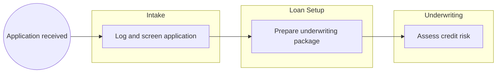

<!-- pdd:doc header="Mid-Market Term Loan Origination {{RUN_TOKEN}} | Process Definition Document" footer="Confidential | Accrual Capital" client="Accrual Capital" author="Business Analysis Team" date="29 September 2026" version="1.0" process="Mid-Market Term Loan Origination {{RUN_TOKEN}}" -->

# Mid-Market Term Loan Origination {{RUN_TOKEN}}
<!-- pdd:section id=business-context sources=as-is/overview.md,as-is/pain-points.md,to-be/overview.md,to-be/benefits.md reproj=g0 -->
# 1. Business Context
## 1.1 Problem Statement
Accrual Capital originates approximately 600 mid-market term loans each month, but the 45-day average cycle time and 72% on-time-close rate are constrained by fragmented records, manual handoffs, and email/Excel coordination. Manual PDF-to-Excel financial spreading consumes about four hours per file, while DSCR/LTV defects occur in 18% of files and ECOA adverse-action timeliness is only 89%.
## 1.2 Objectives
- Reduce cycle time to 22 calendar days or less through controlled evidence, orchestration, and visible work queues.
- Raise on-time close performance to at least 95% with explicit readiness, timer, and escalation controls.
- Reduce DSCR/LTV rework below 3% through governed workpapers and independent validation.
- Achieve 100% on-time ECOA adverse-action delivery and fully auditable OFAC/BOI controls.
## 1.3 Expected Value
The future operating model gives borrowers clearer progress, gives staff a trusted case record, and gives Compliance evidence that is timely, attributable, and examination-ready. Measured targets are defined in Section 10.
[Refine section](delegate:refine-section?section=business-context)

<!-- pdd:section id=scope sources=as-is/scope.md,entities/applications/ reproj=g0 -->
# 2. Scope
## 2.1 Process Identity
| Process name | Process group | Process identifier | Industry |
|---|---|---|---|
| Mid-Market Term Loan Origination | Commercial Lending Operations | CLO-MMTL-001 | Commercial banking |
## 2.2 Scope Boundaries
| In Scope | Out of Scope |
|---|---|
| $1M–$25M commercial term loans | Loan servicing after post-close handoff |
| Borrower request through archive | Portfolio monitoring after archival |
| $4M real-estate-secured reference case | Product-pricing policy design |
## 2.3 Systems and Applications
| System | Role in Process | Access Type |
|---|---|---|
| **Experian**, **D&B**, **Plaid** | Credit and cash-flow evidence | both |
| **IXP** | Document extraction | both |
| **Databricks**, **Snowflake** | Risk and income models | both |
| **DocuSign**, **Fedwire/SWIFT** | Execution and funding | both |
| Core banking and WORM archive | Boarding and retention | both |
[Refine section](delegate:refine-section?section=scope)

<!-- pdd:section id=current-state sources=as-is/overview.md,as-is/diagram.md,as-is/stages.md,as-is/stages/,as-is/steps/,as-is/metrics.md,as-is/pain-points.md reproj=g0 -->
# 3. Current State
## 3.1 Overview
The current process moves an application through Intake, Loan Setup, Underwriting, QA/QC, Closing, and Resolved stages, with Customer Comms, Conditions Resolution, Credit Committee, Withdrawal, and Declined paths. Evidence and status reside across email, unversioned Excel, connected services, core banking, and compliance storage.
## 3.2 Current Flow
| # | Current step |
|---|---|
| 1 | Intake: log request, validate completeness, run manual OFAC/CIP and eligibility checks. |
| 2 | Loan Setup: collect credit, cash-flow, collateral, title/UCC, and financial evidence. |
| 3 | Underwriting: calculate DSCR/LTV, run risk models, and issue decision. |
| 4 | Conditions / Credit Committee: resolve conditional approval or exception routes. |
| 5 | QA/QC: complete independent compliance and calculation review. |
| 6 | Closing: prepare documents, obtain signature, execute funding. |
| 7 | Resolved: board, score EPD, audit, and archive. |
## 3.3 Metrics
| Metric | Current signal | Measurement method |
|---|---|---|
| Monthly originations | Approximately 600 | Operational volume |
| Average cycle time | 45 days | SME-provided metric |
| On-time close rate | 72% | Against committed dates |
| DSCR/LTV QA error rate | 18% | QA finding rate |
| ECOA timeliness | 89% | 30-day compliance metric |
| Conditions round-trips | 3.2 per file | Operational metric |
## 3.4 Pain Points
| Where | What breaks | Impact |
|---|---|---|
| Loan Setup | PDF financials re-keyed into unversioned Excel | Four hours per file and calculation defects |
| Conditions | Email/Excel tracking | 3.2 round-trips per file |
| Compliance | Manual clocks and checklists | ECOA timeliness at 89% |
| All stages | No unified case record | Status chasing and weak evidence traceability |

[Open AS-IS diagram](delegate:open-diagram?which=as-is&anchor=current-state)
[Refine section](delegate:refine-section?section=current-state)

<!-- pdd:section id=target-state sources=to-be/overview.md,to-be/diagram.md,to-be/case-details.md,to-be/transformation-decisions.md,to-be/stages/ reproj=g0 -->
# 4. Future State
## 4.1 Vision
A controlled case-management lifecycle will provide the authoritative application record, automate evidence collection and monitoring, retain human judgment at credit, compliance, committee, and funding decisions, and enforce auditable controls across every route.

```mermaid diagramFamily=case-design
flowchart LR
  caseStart(("Borrower request"))
  subgraph intake["Guided Intake"]
    createCase["Create case and screen"]
  end
  subgraph evidenceAnalysis["Evidence and Financial Analysis"]
    prepareEvidence["Prepare controlled evidence"]
  end
  subgraph underwriting["Underwriting"]
    assessRisk["Assess risk and decide"]
  end
  subgraph conditions["Conditions Resolution"]
    clearConditions["Clear atomic conditions"]
  end
  subgraph qaQc["Compliance QA and QC"]
    approveCompliance["Approve compliance review"]
  end
  subgraph closing["Controlled Closing"]
    closeFund["Close and fund loan"]
  end
  subgraph postClose["Post-Close and Archive"]
    reconcileArchive["Reconcile and archive loan"]
  end
  caseStart --> createCase
  createCase --> prepareEvidence
  prepareEvidence --> assessRisk
  assessRisk -->|conditions| clearConditions
  assessRisk -->|approve| approveCompliance
  clearConditions --> approveCompliance
  approveCompliance --> closeFund
  closeFund --> reconcileArchive
  class caseStart kind-event
  class createCase kind-task,case-task-action,owner-loan-officer
  class prepareEvidence kind-task,case-task-agent,owner-loan-officer
  class assessRisk kind-task,case-task-action,owner-underwriter
  class clearConditions kind-task,case-task-action,owner-loan-officer
  class approveCompliance kind-task,case-task-action,owner-compliance-analyst
  class closeFund kind-task,case-task-action,owner-closing-officer
  class reconcileArchive kind-task,case-task-api-workflow,owner-loan-officer,case-ends-case
```

[Open TO-BE diagram](delegate:open-diagram?which=to-be&anchor=target-state)
## 4.2 Target Flow
| # | Stage | Owner | Required for completion |
|---|---|---|---|
| 1 | Guided Intake and Compliance Gate | Loan Officer | yes |
| 2 | Evidence and Financial Analysis | Loan Officer / Credit Analyst | yes |
| 3 | Underwriting and Decision | Underwriter | yes |
| 4 | Compliance QA/QC | Compliance Analyst / Supervisory Principal | yes |
| 5 | Controlled Closing and Funding | Closing Officer | yes |
| 6 | Post-Close and Archive | Loan Officer | yes |
| 7 | Borrower Response, Conditions, Credit Committee, Withdrawal, Declined | Assigned role | conditional |
## 4.2.1 Future Work Details
### Guided Intake and Compliance Gate
> Create a traceable case and block progression until mandatory compliance evidence is complete.
| Case task | Type | Work pattern | Activation | System(s) | Description |
|---|---|---|---|---|---|
| Create case and checklist | action | Human action/review | in order | Case platform | Loan Officer creates and owns the application case. |
| Run screening and capture disposition | api-workflow | System workflow/process | in order | Screening services | Retains OFAC timestamp, list version, and disposition. |
### Evidence and Financial Analysis
> Replace manual re-keying with reconciled evidence and controlled workpapers.
| Case task | Type | Work pattern | Activation | System(s) | Description |
|---|---|---|---|---|---|
| Extract and reconcile financials | agent | AI agent reasoning | in order | IXP / controlled workpaper | Human validation required for material fields. |
| Retrieve external reports | execute-connector-activity | Connector/API operation | side by side | Experian, D&B, Plaid | Links source evidence to the case. |
### Underwriting and Decision
> Retain human decision authority while governing inputs, formulas, and rationale.
| Case task | Type | Work pattern | Activation | System(s) | Description |
|---|---|---|---|---|---|
| Calculate governed metrics | api-workflow | System workflow/process | in order | Controlled workpaper | Stores formula version, source links, and reviewer evidence. |
| Issue credit decision | action | Human action/review | in order | Case platform | Approve, condition, decline, or escalate. |
## 4.3 What Changes
| Area | AS-IS | TO-BE | Why | How |
|---|---|---|---|---|
| Record | Fragmented evidence | Authoritative case record | Eliminate status chasing | Stage, evidence, owner, timer, and audit history in one lifecycle |
| Spreading | Manual Excel re-keying | Controlled reconciled workpapers | Reduce errors below 3% | Extraction, validation, versioning, review |
| Conditions | Informal email/notes | Atomic conditions | Reduce round-trips below 1.5 | Owner, due date, evidence, status, aging |
| SLA | Informal pauses | Explicit timers | Deliver 22-day cycle and 95% close rate | Pause reasons, warning and escalation rules |
## 4.4 Case Work Summary
The proposal uses human actions for judgment, approvals, and sign-off; API workflows for controls, calculations, notices, and reconciliation; connector operations for external evidence; agents for document/evidence reasoning; and event/timer waits for borrower response.
[Refine section](delegate:refine-section?section=target-state)

<!-- pdd:section id=business-rules sources=as-is/business-rules.md,to-be/business-rules.md reproj=g0 -->
# 5. Business Rules
| Rule ID | Description |
|---|---|
| BR-001 | OFAC-screen all parties and retain timestamp, list version, and disposition. |
| BR-002 | Complete CIP identity verification for borrower principals before stage progression. |
| BR-003 | Require Credit Analyst support for loans above $5M. |
| BR-004 | Route loans above $15M, complex collateral, covenant exceptions, or fraud suspicion to Credit Committee. |
| BR-007 | Do not enter QA/QC until all atomic conditions are accepted. |
| BR-010 | Deliver ECOA adverse-action notice within 30 days of completed application; send FCRA co-notice where applicable. |
| BR-011 | Verify BOI before Underwriting completes for entities formed after 2024-01-01. |
[Refine section](delegate:refine-section?section=business-rules)

<!-- pdd:section id=data-model sources=entities/artifacts/,as-is/data-inputs-outputs.md reproj=g0 -->
# 6. Data Model
## 6.1 Entities
| Entity | Description |
|---|---|
| Loan application case | Authoritative lifecycle record |
| Borrower and principal | Applicant identity and ownership data |
| Evidence item | Versioned document, report, or verification result |
| Condition | Atomic requirement with owner, due date, evidence, and status |
| Credit decision | Decision, rationale, authority, and notice requirement |
## 6.2 Data Inputs and Outputs
| Artifact | Source / Destination | Format | Consumed / Produced By |
|---|---|---|---|
| Financial statements | Borrower to controlled workpaper | PDF / structured data | Evidence Analysis |
| Credit and cash-flow evidence | Experian, D&B, Plaid to case | API report | Loan Setup / Underwriting |
| Closing package | Case to DocuSign and archive | Controlled documents | Closing Officer |
## 6.3 Field-Level Data Dictionary
| Field | Type | Format / Pattern | Valid values / range | Mandatory | Privacy class |
|---|---|---|---|---|---|
| Loan amount | Decimal | Currency | $1M–$25M | yes | Confidential |
| DSCR | Decimal | x ratio | Decision-driving | yes | Confidential |
| OFAC disposition | Choice | Controlled value | clear / potential match / true match | yes | Restricted |
| BOI verification status | Choice | Controlled value | pending / verified / exception | conditional | PII |
## 6.4 Data Flow & Lineage
| # | Data movement |
|---|---|
| 1 | Borrower evidence enters the case record and retains source linkage. |
| 2 | Extracted data is reconciled to controlled workpapers. |
| 3 | Underwriting decision and conditions are recorded against the evidence. |
| 4 | Closing and funding evidence is reconciled to core boarding and archive. |
## 6.5 Integrations
| Integration | Fields passed | Connector / type | Endpoint + Auth |
|---|---|---|---|
| Case platform → Experian/D&B/Plaid | Applicant and verification data | API / connector | Not confirmed |
| Case platform → DocuSign/Fedwire/SWIFT | Approved terms and funding controls | API / connector | Not confirmed |
==TBD: Confirm integration endpoints and authentication at SDD.==
[Refine section](delegate:refine-section?section=data-model)

<!-- pdd:section id=people sources=entities/people/ reproj=g0 -->
# 7. People
## 7.1 Roles & Personas
| Stakeholder | Responsibility |
|---|---|
| Loan Officer | Case owner, borrower communication, intake and post-close work |
| Credit Analyst | Supports loans above $5M and financial analysis |
| Underwriter | Credit risk assessment and final decision |
| Compliance Analyst | QA/QC and notice-control review |
| Supervisory Principal | Required QA/QC sign-off |
| Closing Officer | Closing and controlled funding |
| Credit Committee | Exception authority and rationale |
| Borrower | Provides application, documents, and signatures |
## 7.2 RACI
| Activity / Stage | Responsible | Accountable | Consulted | Informed |
|---|---|---|---|---|
| Intake | Loan Officer | Loan Officer | Compliance | Borrower |
| Underwriting | Underwriter | Underwriter | Credit Analyst / Committee | Loan Officer |
| QA/QC | Compliance Analyst | Supervisory Principal | Underwriter | Closing Officer |
| Closing | Closing Officer | Closing Officer | Compliance | Loan Officer |
[Refine section](delegate:refine-section?section=people)

<!-- pdd:section id=raci sources=entities/people/ reproj=g0 -->
# 7.2 RACI
The RACI is defined in Section 7.1 and is maintained as the authoritative ownership model for this process.
[Refine section](delegate:refine-section?section=raci)

<!-- pdd:section id=exceptions sources=as-is/exception-handling.md,to-be/exception-handling.md reproj=g0 -->
# 8. Exceptions and Error Handling
## 8.1 Known Exceptions
| Exception | Trigger | AS-IS Handling | TO-BE Handling |
|---|---|---|---|
| Non-response | Documents missing for five business days | Manual tracking and email | Timed borrower-response stage with pause/restart evidence and withdrawal route |
| Conditions | Conditional approval | Email/Excel notes | Atomic condition records and aging alerts |
| Credit Committee | >$15M, complex collateral, covenant exception, or fraud suspicion | Informal packet and return | Controlled packet, authority, rationale, and return to Underwriting |
| Decline | Formal decision | Manual notice tracking | Reason-coded notice workflow and delivery evidence |
## 8.2 Exception Data State Transitions
| Exception | Affected record | State on entry | State on resolution | State on terminal failure |
|---|---|---|---|---|
| Borrower response | Application case | paused | returned to prior stage | withdrawn / archived |
| Conditions | Condition record | open | accepted and released | returned to Underwriting |
| OFAC true match | Application case | compliance hold | cleared by authorized disposition | blocked / escalated |
## 8.3 HITL & Action Center Task Form Specifications
| Escalation point | Trigger | Fields surfaced | Available actions → resulting state | Task SLA | Assignee role |
|---|---|---|---|---|---|
| Credit decision | Complete underwriting workbench | DSCR, LTV, risk evidence, rationale | approve / condition / decline / committee | 5 business days | Underwriter |
| Compliance sign-off | QA/QC complete | control checklist, defects, evidence | approve / return for remediation | 2 business days | Supervisory Principal |
[Refine section](delegate:refine-section?section=exceptions)

<!-- pdd:section id=compliance sources=as-is/compliance.md,to-be/business-rules.md reproj=g0 -->
# 9. Compliance and Regulatory
## 9.1 Compliance Traceability Matrix
| Requirement / Rule | Enforced at | Evidence retained |
|---|---|---|
| OFAC | Guided Intake and pre-close control | timestamp, list version, disposition |
| CIP | Guided Intake | verification evidence |
| Reg B / ECOA | Decision and decline route | reason codes, notice, delivery evidence |
| BSA/AML | QA/QC and retention | review evidence and five-year file retention |
| CRA | Commercial lending reporting control | assessment-area and reporting evidence |
| Reg Z / ATR where applicable | Underwriting and QA/QC | applicability decision and review evidence |
| OCC underwriting standards | Underwriting and QA/QC | governed workpaper, rationale, review |
| Corporate Transparency Act | Intake gate before Underwriting completion | BOI verification record |
## 9.2 Audit & Traceability
The case records actor, timestamp, source/version, decision, disposition, evidence reference, timer event, and approval history. Credit files are retained under the BSA five-year rule; control evidence must remain retrievable with the loan record.
[Refine section](delegate:refine-section?section=compliance)

<!-- pdd:section id=kpis sources=to-be/benefits.md reproj=g0 -->
# 10. KPIs & Acceptance Criteria
## 10.1 KPIs
| KPI | Target / acceptance signal |
|---|---|
| Average cycle time | At or below 22 calendar days |
| On-time close rate | At or above 95% |
| DSCR/LTV rework rate | Under 3% |
| Adverse-action delivery | 100% within the ECOA 30-day window |
| Conditions-clearing round-trips | Under 1.5 per file |
| Credit-file retention | 100% retained per BSA five-year rule |
| OFAC evidence | 100% logged with timestamp, list version, and disposition |
| BOI verification | 100% completed before Underwriting completes for entities formed after 2024-01-01 |
## 10.2 Acceptance Criteria
- KPI calculation definitions, authoritative source, denominator, exclusions, and reporting cadence are approved before release.
- No case may progress through a mandatory compliance hold without an authorized disposition and evidence.
- Funding remains unavailable until all configured closing and QC controls are complete.
[Refine section](delegate:refine-section?section=kpis)

<!-- pdd:section id=assumptions-risks sources=queries/,as-is/scope.md reproj=g0 -->
# 11. Assumptions, Constraints, Dependencies and Risks
## 11.1 Assumptions
| Assumption | Detail |
|---|---|
| Central case record | A selected platform will become authoritative for the application lifecycle. |
| Human accountability | Credit, QA/QC sign-off, committee authority, and funding control remain human decisions. |
## 11.2 Constraints
| Constraint | Detail |
|---|---|
| Regulatory controls | Compliance obligations must remain enforced and evidenced. |
| Backlog and headcount | Not confirmed. |
==TBD: Confirm backlog, staffing capacity, and peak-load sizing.==
## 11.3 Dependencies
| Dependency | Type | Detail |
|---|---|---|
| Target case platform | hard | Authoritative lifecycle and timer record |
| External-service connectivity | hard | Screening, reports, e-signature, funding, core banking, archive |
| Legal/Compliance validation | hard | Product applicability, BOI, retention, and notice design |
## 11.4 Risks
| Risk | Mitigation |
|---|---|
| Integration or data-quality failure | Controlled exception state, evidence, owner, and recovery route |
| Unclear policy applicability | Legal/Compliance validation before production release |
[Refine section](delegate:refine-section?section=assumptions-risks)

<!-- pdd:section id=glossary sources=entities/ reproj=g0 -->
# 12. Glossary
| Term | Definition |
|---|---|
| BOI | Beneficial ownership information. |
| CIP | Customer Identification Program. |
| DSCR | Debt-service coverage ratio. |
| ECOA | Equal Credit Opportunity Act. |
| EPD | Early-payment-default score. |
| LTV | Loan-to-value ratio. |
| OFAC | Office of Foreign Assets Control. |
| WORM | Write once, read many compliant storage. |
[Refine section](delegate:refine-section?section=glossary)

<!-- pdd:section id=next-steps sources=queries/open-questions.md reproj=g0 -->
# 13. Next Steps
| # | Action item |
|---|---|
| 1 | Select the target case platform and accountable system-of-record owner. |
| 2 | Confirm endpoints, authentication, and data contracts for every connected system. |
| 3 | Define KPI formulas, reporting source, cadence, exclusions, and owner. |
| 4 | Confirm SLA warning, pause, restart, and escalation rules. |
| 5 | Validate legal/compliance applicability and evidence requirements with Legal and Compliance. |
| 6 | Confirm backlog, role headcount, and peak-load sizing. |
[Refine section](delegate:refine-section?section=next-steps)

<!-- pdd:section id=appendix-a sources=derived reproj=g0 -->
# Appendix A: Process Map and Diagrams
The current and future case maps are embedded in Sections 3 and 4. An integration sequence diagram remains to be produced after target-system interfaces and authentication patterns are confirmed.
<!-- doc:placeholder kind="integration-diagram" -->
> [!NOTE]
> **Integration Diagram Placeholder**
> Insert integration sequence showing case platform interactions with screening, evidence extraction, credit, risk, e-signature, funding, core banking, and archive systems.
[Refine section](delegate:refine-section?section=appendix-a)
