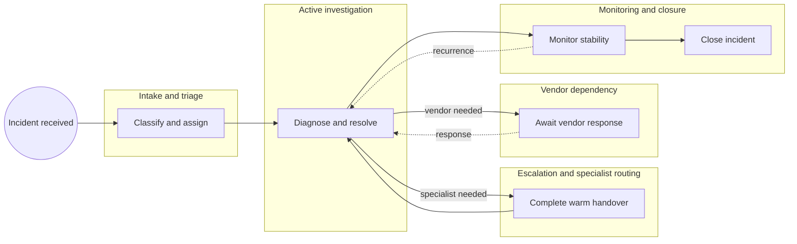
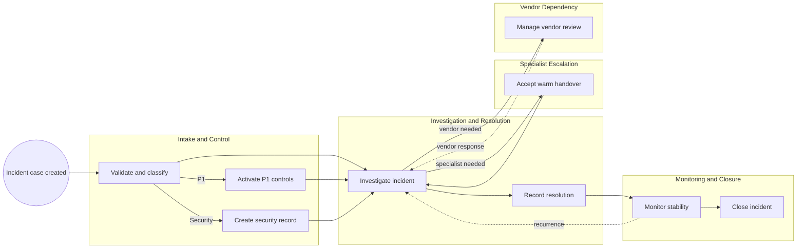

<!-- pdd:doc header="IT Incident Management (ITIL v4) {{RUN_TOKEN}} | Process Definition Document" footer="Confidential | Skjoldvik Digital Services" client="Skjoldvik Digital Services" author="UiPath Business Analysis" date="29 September 2026" version="1.0" process="IT Incident Management (ITIL v4) {{RUN_TOKEN}}" -->

# IT Incident Management (ITIL v4) {{RUN_TOKEN}}

<!-- pdd:section id=business-context sources=as-is/overview.md,as-is/pain-points.md,to-be/overview.md,to-be/benefits.md reproj=g0 -->
# 1. Business Context
## 1.1 Problem Statement
Skjoldvik Digital Services manages incidents across **ServiceNow**, specialist teams, vendors, **Microsoft Teams**, and a separate ISO register. Three of eight P1 incidents missed the four-hour target in Q1 2026; the documented causes include vendor dependency and delayed specialist escalation. The future process must make contractual deadlines, communications, and security evidence enforceable rather than dependent on manual coordination.
## 1.2 Objectives
- Enforce P1 direct-to-L2 routing, bridge activation, and swarming.
- Make SLA acknowledgement, resolution, vendor-review, monitoring, and PIR deadlines visible and actionable.
- Enforce simultaneous Security classification and ISO register creation.
- Create auditable warm handovers and mandatory Teams status communications.
## 1.3 Expected Value
The design improves control reliability, handover quality, incident traceability, and stakeholder confidence. Measurable acceptance criteria are defined in Section 10.
[Refine section](delegate:refine-section?section=business-context)

<!-- pdd:section id=scope sources=as-is/scope.md,entities/applications/ reproj=g0 -->
# 2. Scope
## 2.1 Process Identity
| Process name | Process group | Process identifier | Industry |
|---|---|---|---|
| IT Incident Management (ITIL v4) | IT Operations | IM-ITIL-001 | Telecom managed services |

## 2.2 Scope Boundaries
| In Scope | Out of Scope |
|---|---|
| Incident intake, triage, assignment and resolution | Change management |
| L1/L2/specialist escalation and vendor coordination | Problem management and root-cause analysis |
| SLA tracking, Teams communications and security control | Service requests and capacity management |
| Monitoring, closure and P1/P2 PIR | |

## 2.3 Systems and Applications
| System | Role in Process | Access Type |
|---|---|---|
| **ServiceNow** | Current incident system of record | both |
| **Jira Service Management** | Target/parallel incident system during migration | both |
| **Microsoft Teams** | Mandatory real-time stakeholder communications | write |
| ISO 27001 Information Security Incident Register | Security incident compliance record | write |
| **UiPath Case Management** | Lifecycle orchestration, timers, controls and evidence | both |
[Refine section](delegate:refine-section?section=scope)

<!-- pdd:section id=current-state sources=as-is/overview.md,as-is/diagram.md,as-is/stages.md,as-is/metrics.md,as-is/exception-handling.md reproj=g0 -->
# 3. Current State
## 3.1 Overview
The current process receives incidents through portal, telephone, and monitored email, then triages them in **ServiceNow**. Work can move non-linearly among L1, L2, specialist teams, and vendors; current controls depend heavily on manual coordination.
## 3.2 Current Flow
| # | Current step |
|---|---|
| 1 | Receive incident through portal, telephone, or email. |
| 2 | L1 triages, assigns priority/category and resolver group; P1 routes directly to L2. |
| 3 | Resolver investigates and communicates status. |
| 4 | Escalate through a warm handover when specialist expertise is required. |
| 5 | Manage vendor dependency while the incident remains active. |
| 6 | Record resolution; P1/P2 enter five-business-day Monitoring. |
| 7 | Close after stability is proven; complete PIR for P1/P2. |
## 3.3 Metrics
| Metric | Current signal | Measurement method |
|---|---|---|
| Intake mix | Portal 55%, telephone 30%, email 15% | Meeting notes |
| P1 performance | 3 of 8 P1 cases missed 4-hour target in Q1 2026 | Meeting notes |
| P1 acknowledgement / resolution | 15 minutes / 4 hours | Contractual SLA |
| P2 acknowledgement / resolution | 30 minutes / 8 hours | Contractual SLA |
## 3.4 Pain Points
| Where | What breaks | Impact |
|---|---|---|
| Vendor dependency | No formal external-delay treatment | P1 SLA breaches |
| Security classification | Register entries were delayed | ISO 27001 non-conformity |
| Stakeholder updates | Email-only communication used | Notification compliance failure |
| Early closure | Unstable resolution recurred | Re-escalation and client complaint |

[Open AS-IS diagram](delegate:open-diagram?which=as-is&anchor=current-state)
[Refine section](delegate:refine-section?section=current-state)

<!-- pdd:section id=target-state sources=to-be/overview.md,to-be/diagram.md,to-be/case-details.md,to-be/transformation-decisions.md,to-be/stages/,to-be/business-rules.md reproj=g0 -->
# 4. Future State
## 4.1 Vision
Each incident becomes a controlled case orchestrated by **UiPath Case Management** across ServiceNow/Jira Service Management, Teams, and the ISO register. Automation performs deterministic controls and notifications; people retain diagnosis, remediation, escalation judgement, and PIR authorship.

[Open TO-BE diagram](delegate:open-diagram?which=to-be&anchor=target-state)
## 4.2 Target Flow
| # | Stage | Owner | Required for completion |
|---|---|---|---|
| 1 | Intake and Control | L1 Service Desk / L2 for P1 | yes |
| 2 | Investigation and Resolution | Assigned resolver team | yes |
| 3 | Specialist Escalation | L2 or receiving specialist lead | conditional |
| 4 | Vendor Dependency | Vendor Specialist / Service Delivery Manager | conditional |
| 5 | Monitoring and Closure | Assigned resolver team | yes |

## 4.2.1 Future Work Details
### Intake and Control
> Classify the incident, activate obligations, and establish accountable ownership.

| Case task | Type | Work pattern | Activation | System(s) | Description |
|---|---|---|---|---|---|
| Validate incident record | action | human action/review | in order | ServiceNow/Jira | Completes intake data. |
| Launch P1 bridge and swarm | api-workflow | system workflow/process | on event, P1 only | Teams | Creates bridge and L2 assignments. |
| Create security register entry | execute-connector-activity | connector/API operation | on event, Security only | ISO register | Hard control paired with classification. |
| Send Teams notice | execute-connector-activity | connector/API operation | side by side | Teams | Retains notification evidence. |

### Investigation and Resolution
> Diagnose, remediate, record evidence, and route work dynamically.

| Case task | Type | Work pattern | Activation | System(s) | Description |
|---|---|---|---|---|---|
| Review and record findings | action | human action/review | in order/on demand | incident system | Maintains diagnostic context. |
| Monitor resolution SLA | wait-for-timer | timer wait | on event | case platform | Raises at-risk or breach event. |
| Record resolution evidence | action | human action/review | in order | incident system | Enables Monitoring route. |

### Specialist Escalation and Vendor Dependency
> Preserve ownership, handover evidence, SLA visibility, and an explicit return to investigation.

| Case task | Type | Work pattern | Activation | System(s) | Description |
|---|---|---|---|---|---|
| Capture/accept warm handover | action | human action/review | in order | Teams/case platform | Requires receiving-team acknowledgement. |
| Conduct vendor review | action | human action/review | on timer, P1/P2 | case platform | Records 60-minute review evidence. |

### Monitoring and Closure
> Prevent premature closure and return recurrence to active work.

| Case task | Type | Work pattern | Activation | System(s) | Description |
|---|---|---|---|---|---|
| Start and monitor stability timer | wait-for-timer | timer wait | in order, P1/P2 | case platform | Five full business days. |
| Route recurrence | api-workflow | system workflow/process | on event | case platform | Returns to Investigation and resets timer. |
| Close incident | action | human action/review | in order | incident system | Requires closure evidence and Teams notice. |

## 4.3 What Changes
| Area | AS-IS | TO-BE | Why | How |
|---|---|---|---|---|
| SLA management | Manual tracking | Case timers and at-risk routes | Prevent breaches | Timed case activities and event evidence |
| Security | Delayed register risk | Blocking paired activity | Correct audit finding | Connector activity at classification |
| Handover | Assignment-field transfer | Required acceptance | Preserve diagnosis context | Structured action and acknowledgement |
| Communications | Inconsistent updates | Event-driven Teams notices | Meet directive | Teams connector activity |
| Monitoring | Manual follow-up | Enforced timer/rework loop | Prevent premature closure | Timer and recurrence route |

## 4.4 Case Work Summary
The design uses human actions for diagnosis and judgement, connector/API operations for ISO and Teams controls, and timer waits for SLA, vendor review, monitoring, and PIR obligations.
[Refine section](delegate:refine-section?section=target-state)

<!-- pdd:section id=business-rules sources=as-is/business-rules.md,to-be/business-rules.md reproj=g0 -->
# 5. Business Rules
| Rule ID | Description |
|---|---|
| BR-001 | P1 bypasses L1 and activates bridge/swarming immediately. |
| BR-002 | Handover requires documented findings, acknowledgement, and briefing evidence. |
| BR-003 | Security classification and ISO register entry occur simultaneously. |
| BR-004 | Teams provides mandated real-time communications; P1 updates occur within 10 minutes. |
| BR-005 | P1/P2 Monitoring lasts five full business days and cannot be waived. |
| BR-006 | Recurrence returns the case to Investigation and resets Monitoring. |
| BR-007 | P1/P2 PIR is due within five business days after formal closure. |
| BR-008 | Vendor-pending cases remain SLA-visible; P1/P2 reviews occur every 60 minutes. |
[Refine section](delegate:refine-section?section=business-rules)

<!-- pdd:section id=data-model sources=entities/artifacts/,as-is/data-inputs-outputs.md reproj=g0 -->
# 6. Data Model
## 6.1 Entities
| Entity | Description |
|---|---|
| Incident case | Primary record containing priority, state, owner, timestamps and evidence. |
| Handover record | Findings, actions tried, receiving acknowledgement and briefing evidence. |
| ISO security register entry | Separate compliance record linked to a Security incident. |
| PIR report | P1/P2 closure follow-up delivered to Problem Management. |
## 6.2 Data Inputs and Outputs
| Artifact | Source / Destination | Format | Consumed / Produced By |
|---|---|---|---|
| Incident ticket | ServiceNow/Jira Service Management | system record | all stages |
| Teams notification | case platform / stakeholders | message | control and status events |
| ISO register entry | case platform / Information Security Officer | system record | Security Control |
| PIR report | process owner / Problem Management | report | PIR obligation |
## 6.3 Field-Level Data Dictionary
| Field | Type | Format / Pattern | Valid values / range | Mandatory | Privacy class |
|---|---|---|---|---|---|
| Incident reference | string | platform-generated | unique | yes | internal |
| Priority | enum | P1–P4 | P1, P2, P3, P4 | yes | internal |
| Security classification | enum | category | Security / non-Security | yes | internal |
| Resolver group | string | team name | named support group | yes | internal |
| SLA timestamps | datetime | ISO 8601 | event time | yes | internal |
==TBD: confirm personal-data fields and privacy classification during solution design==
[Refine section](delegate:refine-section?section=data-model)

<!-- pdd:section id=people sources=entities/people/ reproj=g0 -->
# 7. People
## 7.1 Roles & Personas
| Stakeholder | Responsibility |
|---|---|
| L1 Service Desk | Intake, triage and standard resolution. |
| L2 Engineer / Team Lead | P1 response, complex diagnosis and escalation. |
| Specialist Team | Network, Security or Application remediation. |
| Service Delivery Manager | P1/vendor oversight and escalation accountability. |
| Assigned Resolver Team | Investigation, Monitoring and closure evidence. |
| Information Security Officer | Owns ISO register. |
| Incident Management Process Owner | Owns PIR completion. |
| UiPath Case Orchestration | Executes controls, timers, routes and connector activities. |
## 7.2 RACI
| Activity/Stage | Responsible | Accountable | Consulted | Informed |
|---|---|---|---|---|
| Intake and Control | L1 Service Desk | Service Delivery Manager | L2 / Security | stakeholders |
| Investigation and Resolution | Assigned Resolver Team | Service Delivery Manager | specialists | stakeholders |
| Monitoring and Closure | Assigned Resolver Team | Service Delivery Manager | requester | stakeholders |
| PIR | Process Owner | Head of IT Operations | Problem Management | affected stakeholders |
[Refine section](delegate:refine-section?section=people)

<!-- pdd:section id=raci sources=entities/people/ reproj=g0 -->
# 7.2 RACI
The RACI model is defined in Section 7.1 and applies to all case stages.
[Refine section](delegate:refine-section?section=raci)

<!-- pdd:section id=exceptions sources=as-is/exception-handling.md,to-be/exception-handling.md reproj=g0 -->
# 8. Exceptions and Error Handling
## 8.1 Known Exceptions
| Exception | Trigger | AS-IS Handling | TO-BE Handling |
|---|---|---|---|
| Specialist escalation | Capability/diagnostic need | Manual assignment | Required handover and acceptance route |
| Vendor dependency | Internal resolution unavailable | Pending Vendor, manually managed | SLA-visible secondary stage with reviews |
| Security classification | Threat indicator | Delayed register risk | Blocking ISO-register activity |
| Recurrence | Failure during Monitoring | Reopen/re-escalate | Event route to Investigation and timer reset |
| Cancellation | Any lifecycle state | Not documented | Open control decision |
## 8.2 Exception Data State Transitions
| Exception | Affected record | State on entry | State on resolution | State on terminal failure |
|---|---|---|---|---|
| Vendor dependency | Incident case | Pending Vendor | In Progress | SLA-visible escalation |
| Recurrence | Incident case | Monitoring | In Progress | not applicable |
| Security control failure | Incident case | Control blocked | Security route complete | Escalated/held |
## 8.3 HITL & Action Center Task Form Specifications
| Escalation point | Trigger | Fields surfaced | Available actions → resulting state | Task SLA | Assignee role |
|---|---|---|---|---|---|
| Warm handover | specialist route | findings, actions tried, impact, priority | Accept → In Progress; reject → sender rework | aligned to incident SLA | receiving specialist |
| Vendor review | P1/P2 vendor timer | vendor reference, SLA clock, latest update | Review recorded → Pending Vendor | 60 minutes | Service Delivery Manager |
[Refine section](delegate:refine-section?section=exceptions)

<!-- pdd:section id=compliance sources=as-is/compliance.md,to-be/business-rules.md reproj=g0 -->
# 9. Compliance and Regulatory
## 9.1 Compliance Traceability Matrix
| Requirement / Rule | Enforced at | Evidence retained |
|---|---|---|
| ISO 27001 A.5.24/A.5.26 / BR-003 | Security Control | register reference, classification timestamp, engineer |
| CIO Directive IT-DIR-2026-017 / BR-004 | lifecycle status events | Teams event log and timestamps |
| IM-POL-012 / BR-005/006 | Monitoring and Closure | resolution, timer, recurrence and closure events |
| Managed Services Agreement Schedule 3 / BR-001/008 | Intake, Investigation, Vendor Dependency | acknowledgement, SLA, review and breach events |
| PIR requirement / BR-007 | Post-closure PIR | report and publication timestamp |
## 9.2 Audit & Traceability
The future case timestamps priority, assignment, handover, notification, vendor review, resolution, Monitoring, recurrence, closure, and PIR events. Cross-system evidence links the incident reference to Teams and ISO register records.
[Refine section](delegate:refine-section?section=compliance)

<!-- pdd:section id=kpis sources=to-be/benefits.md reproj=g0 -->
# 10. KPIs and Acceptance Criteria
## 10.1 KPIs
| KPI | Target / acceptance signal |
|---|---|
| P1 acknowledgement | Resolver group assigned within 15 minutes of creation. |
| P1 resolution | Resolved within 4 hours of creation, with breach recorded where missed. |
| P2 acknowledgement/resolution | 30 minutes / 8 hours. |
| P1 Teams update | Delivered within 10 minutes of each status change. |
| Security register dependency | Zero Security classifications without a paired register entry. |
| Monitoring | Zero P1/P2 closures before five full business days after resolution. |
| PIR | P1/P2 report published within five business days of formal closure. |
## 10.2 Acceptance Criteria
- A P1 creation event activates L2 bridge/swarming and notification evidence.
- A Security classification cannot proceed without ISO-register evidence.
- A warm handover cannot complete without receiving-team acknowledgement.
- A recurrence resets Monitoring and returns the case to Investigation.
[Refine section](delegate:refine-section?section=kpis)

<!-- pdd:section id=assumptions-risks sources=queries/,as-is/scope.md reproj=g0 -->
# 11. Assumptions, Constraints, Dependencies and Risks
## 11.1 Assumptions
| Assumption | Detail |
|---|---|
| Parallel transition | ServiceNow and Jira Service Management operate in parallel for up to three months. |
| Case approach | Case management is the recommended lifecycle control model. |
## 11.2 Constraints
| Constraint | Detail |
|---|---|
| Contractual SLA | P1/P2 targets remain in force. |
| Platform neutrality | Automation must not depend on a proprietary incident-platform workflow engine. |
| Vendor SLA treatment | Not confirmed. |
==TBD: confirm contractual treatment of vendor-caused delays==
## 11.3 Dependencies
| Dependency | Type | Detail |
|---|---|---|
| Incident-system access | hard | ServiceNow and Jira read/write/event capability. |
| Teams integration | hard | Channel routing and permission model. |
| ISO register integration | hard | Create record and return reference. |
| Vendor engagement channel | soft | Vendor-specific communication/API mechanism. |
## 11.4 Risks
| Risk | Mitigation |
|---|---|
| Unapproved SLA-clock handling | Keep SLA visible; require policy decision before any exclusion. |
| Incomplete P3/P4 closure design | Confirm route before implementation. |
| Cancellation controls undefined | Define authorisation, reason and evidence requirements. |
[Refine section](delegate:refine-section?section=assumptions-risks)

<!-- pdd:section id=glossary sources=entities/ reproj=g0 -->
# 12. Glossary
| Term | Definition |
|---|---|
| ITIL v4 | IT service-management framework informing this process. |
| PIR | Post-Incident Review required for P1/P2. |
| P1–P4 | Priority categories from Critical to Low. |
| SLA | Service Level Agreement commitment. |
| Warm handover | Documented, acknowledged transfer of incident context and ownership. |
[Refine section](delegate:refine-section?section=glossary)

<!-- pdd:section id=next-steps sources=queries/open-questions.md reproj=g0 -->
# 13. Next Steps
| # | Action item |
|---|---|
| 1 | Confirm vendor-caused delay treatment and breach-reporting logic. |
| 2 | Define cancellation authority, reasons, communication and audit evidence. |
| 3 | Confirm P3/P4 post-resolution closure route. |
| 4 | Confirm whether PIR completion is lifecycle completion or a tracked post-closure obligation. |
| 5 | Capture volume, backlog, peak periods, capacity and business-calendar rules. |
| 6 | Validate ServiceNow, Jira, Teams and ISO-register integration interfaces. |
[Refine section](delegate:refine-section?section=next-steps)

<!-- pdd:section id=appendix-a sources=derived reproj=g0 -->
# Appendix A: Process Map and Diagrams
The current and future case maps are embedded in Sections 3 and 4 respectively. The future case map is the recommended business process model of record.

<!-- doc:placeholder kind="integration-diagram" -->
> [!NOTE]
> **Integration Diagram Placeholder**
> Insert sequence diagram for incident system, UiPath case orchestration, Microsoft Teams, ISO register, and vendor communications.
[Refine section](delegate:refine-section?section=appendix-a)
