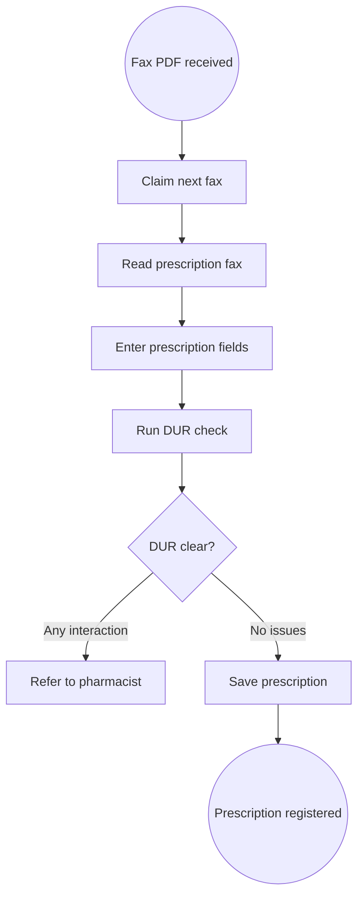
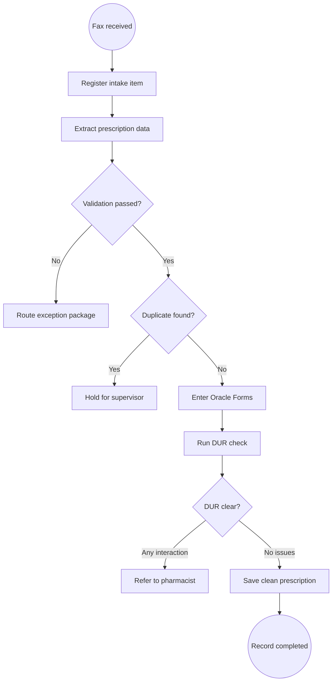

<!-- pdd:doc header="KoreMed Prescription Fax Intake {{RUN_TOKEN}} | Process Definition Document" footer="Confidential | KoreMed Pharmaceuticals" client="KoreMed Pharmaceuticals" author="KoreMed Automation Project Team" date="29 September 2026" version="1.0" process="KoreMed Prescription Fax Intake {{RUN_TOKEN}}" -->

# KoreMed Prescription Fax Intake {{RUN_TOKEN}}

<!-- pdd:section id=business-context sources=as-is/overview.md,as-is/pain-points.md,to-be/overview.md,to-be/benefits.md reproj=g0 -->
# 1. Business Context

## 1.1 Problem Statement
KoreMed Seoul HQ receives 200–250 prescription faxes on a typical weekday, with 300+ at seasonal peaks. Pharmacy staff manually interpret PDFs and re-key information into **Oracle Forms**, taking approximately 2–4 minutes for a clean item while poor image quality drives most exceptions. The process must complete entry or safe routing within two hours of receipt and protect sensitive RRN-related data under PIPA.

## 1.2 Objectives
- Automate capture, extraction, validation, duplicate screening, Oracle entry, DUR execution, and clean-record registration while retaining the two-hour receipt-to-entry-or-route requirement.
- Preserve mandatory pharmacist review for every DUR interaction and human judgement for identified business and technical exceptions.
- Improve traceability through retained source faxes, timestamped processing history, reason-coded routing, and Oracle/DUR outcome evidence.
- Keep patient and extracted prescription data on-premises and leave Oracle Forms 11.2 unchanged.

## 1.3 Expected Value
The future process reduces manual transcription for clean prescriptions, improves visibility of aging work, and gives pharmacists, supervisors, and IT complete exception context. Qualitative improvements in auditability, exception handling, and capacity are expected; measured acceptance criteria are defined in Section 10.

[Refine section](delegate:refine-section?section=business-context)

<!-- pdd:section id=scope sources=as-is/scope.md,entities/applications/ reproj=g0 -->
# 2. Scope

## 2.1 Process Identity

*Table: Process identity*

| Item | Value |
|---|---|
| Process name | KoreMed Prescription Fax Intake |
| Process group | Pharmacy Operations |
| Process identifier | KOREMED-RX-FAX-INTAKE |
| Industry | Pharmaceutical pharmacy operations |

## 2.2 Scope Boundaries

*Table: Scope boundaries*

| In Scope | Out of Scope |
|---|---|
| Incoming prescription fax PDF capture | Dispensing and fulfillment |
| On-premises extraction and validation | Inventory management |
| Oracle Forms 11.2 entry and DUR interaction | Billing and reimbursement |
| Exception packaging, routing, monitoring, and reconciliation | Patient counselling |
| Pharmacist, supervisor, and IT handoffs | Oracle Forms upgrades, patches, or redesign |

## 2.3 Systems and Applications

*Table: Systems and applications*

| System | Role in Process | Access Type |
|---|---|---|
| **Fax server/shared folder** | Receives and stores incoming prescription PDFs | Read / write metadata |
| **Oracle Forms 11.2** | Authoritative prescription-entry system and DUR UI | Write through controlled UI |
| **HIRA DUR** | Returns in-screen drug-utilization result | Both through Oracle Forms UI |
| **In-house formulary** | Validates medication-code availability | Read |
| **UiPath RPA runtime** | Orchestrates approved on-premises automation units | Both |

[Refine section](delegate:refine-section?section=scope)

<!-- pdd:section id=current-state sources=as-is/overview.md,as-is/diagram.md,as-is/steps/,as-is/metrics.md,as-is/pain-points.md reproj=g0 -->
# 3. Current State

## 3.1 Overview
The current workflow starts when a prescription fax PDF lands in the shared fax-server folder. Available pharmacy staff manually claim, read, and re-key required data into **Oracle Forms** `PH-ENTRY-01`, trigger the in-screen HIRA DUR check, and save only when no issues are reported. Assignment ownership and several non-DUR exception routes are not consistently documented.

## 3.2 Current Flow

*Table: Current process flow*

| # | Current step |
|---|---|
| 1 | Receive and manually claim an incoming fax PDF. |
| 2 | Visually interpret patient, prescription, and prescriber information. |
| 3 | Enter mandatory fields in Oracle Forms `PH-ENTRY-01`. |
| 4 | Run the existing in-screen DUR check. |
| 5 | Save a clean record or refer a flagged item to a pharmacist. |

## 3.3 Metrics

*Table: Current metrics*

| Metric | Current signal | Measurement method |
|---|---|---|
| Daily volume | 200–250 typical weekday; 300+ seasonal/post-holiday | Pharmacy Operations discovery call |
| Clean-item handling time | Approximately 2–4 minutes | Pharmacy Operations discovery call |
| Service level | Entry or routing within 2 hours of receipt | Pharmacy director policy |
| Exception rate | Approximately 15% | Manual data, February–April 2026 |
| Image-quality exception share | Approximately 60% of exceptions | Manual data, February–April 2026 |
| DUR-flag share | Approximately 20% of exceptions | Manual data, February–April 2026 |

## 3.4 Pain Points

*Table: Current pain points*

| Where | What breaks | Impact |
|---|---|---|
| Fax pickup | Unclear ownership can leave faxes unattended | Risk to the 2-hour service level |
| Fax reading | Blurry images create ambiguous identifiers and medication details | Manual rework and exception volume |
| Data entry | Staff re-key data across systems | 2–4 minutes per clean item |
| Exception handling | Reviewers must locate fax, extracted values, and DUR evidence | Slower clinical and operational decisions |

[Open AS-IS diagram](delegate:open-diagram?which=as-is&anchor=current-state)

[Refine section](delegate:refine-section?section=current-state)

<!-- pdd:section id=target-state sources=to-be/overview.md,to-be/diagram.md,to-be/delivery-model.md,to-be/steps/,to-be/exception-handling.md,to-be/benefits.md reproj=g0 -->
# 4. Future State

## 4.1 Vision
An on-premises **UiPath RPA** process creates a tracked intake item at fax receipt, extracts and validates data, screens duplicates, enters clean items in unchanged Oracle Forms, runs the existing in-screen HIRA DUR check, and saves only no-issues results. Pharmacists retain every clinical DUR decision; supervisors retain duplicate decisions and SLA escalation; IT retains unreadable-file and technical-recovery work.

[Open TO-BE diagram](delegate:open-diagram?which=to-be&anchor=target-state)

## 4.2 Target Flow

*Table: Target automation flow*

| # | Automation unit / step | Mode | Owner or system | Input | Output | Exception path |
|---|---|---|---|---|---|---|
| 1 | Capture and track fax | Fully Automated | Fax server / UiPath RPA | Fax PDF | Tracked intake item | IT route for unreadable file |
| 2 | Extract and validate | Fully Automated | On-premises extraction | Fax PDF | Validated data | Pharmacist review package |
| 3 | Screen duplicates | Fully Automated | Duplicate-control logic | Validated data | Cleared or held item | Supervisor review |
| 4 | Enter Oracle Forms | Fully Automated | Oracle Forms 11.2 | Cleared data | Unsaved entry | Pharmacist route after one validation failure |
| 5 | Run DUR and save | Fully Automated | Oracle Forms / HIRA DUR | Oracle entry | Registration or DUR evidence | Pharmacist review for any interaction |
| 6 | Route human review | Human Review | Pharmacist, supervisor, or IT | Reason-coded exception | Review item | Named non-DUR queue owner pending |
| 7 | Monitor and reconcile | Fully Automated | UiPath RPA monitoring | Item status history | Alert and final disposition | Operations/IT recovery route |

## 4.2.1 Future Work Details

### Capture and track fax
**Trigger:** Incoming fax PDF. **Mode:** Fully Automated. **Action:** preserve source PDF, create intake ID, timestamp receipt, and start the SLA clock. **Output:** auditable intake item.

### Extract, validate, and screen duplicates
**Trigger:** Tracked intake item. **Mode:** Fully Automated. **Action:** perform on-premises extraction; enforce mandatory fields, 85% confidence threshold, formulary, date, field-length, and duplicate rules. **Human review:** low-confidence, missing, expired, no-match, or duplicate items are packaged with evidence.

### Enter Oracle Forms, run DUR, and save
**Trigger:** Cleared intake item. **Mode:** Fully Automated. **Action:** use a dedicated account to enter approved values, click the existing DUR control, save only after a no-issues response, and retain confirmation evidence. **Human review:** every DUR interaction stops automation and routes to a pharmacist.

### Route, monitor, and reconcile
**Trigger:** Any exception or active intake item. **Mode:** Human Review plus Fully Automated monitoring. **Action:** route evidence-rich exception packages, monitor SLA aging, alert supervisors, and reconcile every receipt to a final state.

## 4.3 What Changes

*Table: Transformation summary*

| Area | AS-IS | TO-BE | Why | How |
|---|---|---|---|---|
| Fax intake | Manual pickup | Tracked intake item at receipt | Prevent unattended work | Automated capture and SLA clock |
| Data handling | Visual reading and re-keying | On-premises extraction and validation | Reduce manual effort and errors | Confidence-gated automation |
| Oracle/DUR | Manual UI activity | Controlled RPA UI activity | Preserve system and clinical controls | Existing screen and DUR button remain unchanged |
| Exceptions | Fragmented handoff context | Evidence-rich, reason-coded routing | Improve review quality and auditability | Human review packages and status tracking |

The design automates deterministic work while preserving judgement-based pharmacy, supervisory, and IT decisions.

## 4.4 Automation Work Summary
- Six automation units are fully automated.
- One unit is a human-review route with evidence prepared automatically.
- Open implementation decisions concern extraction technology, non-DUR queue ownership, notification endpoints, continuity handling, and retention.

[Refine section](delegate:refine-section?section=target-state)

<!-- pdd:section id=business-rules sources=as-is/business-rules.md,to-be/business-rules.md reproj=g0 -->
# 5. Business Rules

*Table: Business rules*

| Rule ID | Description |
|---|---|
| BR-001 | Record receipt immediately and complete entry or routing within two hours. |
| BR-002 | Process patient and extracted prescription data on-premises only. |
| BR-003 | Keep Oracle Forms 11.2 unchanged and use its existing UI with dedicated non-concurrent service accounts. |
| BR-004 | Run the existing in-screen DUR check and save only a no-issues result. |
| BR-005 | Route every DUR interaction, regardless of severity, to pharmacist review without a save attempt. |
| BR-006 | Route any mandatory field with OCR confidence below 85% to human review. |
| BR-007 | Hold potential duplicates matching the reviewed 24-hour criteria for supervisor decision. |
| BR-008 | Attempt a technical validation once, then hand off; do not retry business-rule failures automatically. |
| BR-009 | Retry only approved transient technical failures and reconcile each received fax to a final state. |

[Refine section](delegate:refine-section?section=business-rules)

<!-- pdd:section id=data-model sources=entities/artifacts/,as-is/data-inputs-outputs.md reproj=g0 -->
# 6. Data Model

## 6.1 Entities

| Entity | Description |
|---|---|
| Prescription intake item | Tracked record representing one received fax and its lifecycle. |
| Original fax PDF | Immutable source document retained with receipt evidence. |
| Extracted prescription values | Patient, medication, prescriber, date, dosage, quantity, and days-supply values. |
| DUR result | In-screen HIRA response that determines save versus pharmacist review. |
| Oracle Forms transaction | Downstream prescription record and registration confirmation. |
| Exception package | Source evidence, reason code, routing destination, and handoff history. |

## 6.2 Data Inputs and Outputs

*Table: Data lineage artifacts*

| Artifact | Source / Destination | Format | Consumed / Produced By |
|---|---|---|---|
| **Prescription fax** | Fax server to RPA | PDF | Fax capture and extraction |
| **Prescription fields** | Fax extraction to Oracle Forms | Structured values | Validation and Oracle entry |
| **DUR result** | Oracle Forms/HIRA to intake item | In-screen response | DUR decision and pharmacist review |
| **Exception package** | RPA to human/IT queue | Evidence bundle | Pharmacist, supervisor, or IT support |

## 6.3 Field-Level Data Dictionary

| Field | Type | Format / Pattern | Valid values / range | Mandatory | Privacy class |
|---|---|---|---|---|---|
| Patient ID | Text | Up to 12 alphanumeric characters | Registered or temporary visit ID | Yes | PII |
| RRN last 6 digits | Numeric | Exactly 6 digits | Numeric only | Yes | Sensitive PII |
| Medication code | Text | Up to 12 characters | HIRA national drug code / formulary match | Yes | Operational |
| Dosage | Text | Up to 20 characters | Prescription value | Yes | Clinical data |
| Quantity | Numeric | Up to 4 digits | Positive prescription quantity | Yes | Clinical data |
| Days supply | Numeric | Up to 3 digits | Positive duration | Yes | Clinical data |
| Prescriber licence | Text | Up to 15 alphanumeric characters | Valid licence identifier | Yes | Professional identifier |
| Prescription date | Date | YYYY-MM-DD | Not older than 30 days for straight-through processing | Yes | Clinical data |

## 6.4 Data Flow and Lineage

| # | Data movement |
|---|---|
| 1 | Fax server receives and retains the original prescription PDF. |
| 2 | On-premises extraction derives prescription fields and confidence evidence. |
| 3 | Validation and duplicate screening determine a clean or exception route. |
| 4 | Clean values are entered into Oracle Forms and checked through HIRA DUR. |
| 5 | The intake item records Oracle/DUR evidence, handoff evidence, and final status. |

## 6.5 Integrations

| Integration (System → System) | Fields passed | Connector / type | Endpoint + Auth |
|---|---|---|---|
| Fax server → UiPath RPA | PDF and receipt metadata | File-based intake | Internal location; not confirmed |
| UiPath RPA → Oracle Forms | Approved prescription fields | Controlled UI automation | Dedicated Oracle account |
| Oracle Forms → HIRA DUR | Medication code, RRN last 6, prescriber licence | Existing in-screen application interaction | Existing Oracle-managed exchange |

==TBD: confirm the integration endpoint and authentication at SDD==

[Refine section](delegate:refine-section?section=data-model)

<!-- pdd:section id=people sources=entities/people/ reproj=g0 -->
# 7. People

## 7.1 Roles & Personas

| Stakeholder | Responsibility |
|---|---|
| Pharmacy intake staff | Current-state fax handling and exception support. |
| UiPath RPA runtime | Executes approved deterministic intake units and records evidence. |
| Dispensing pharmacist | Reviews every DUR interaction and specified clinical/data exceptions. |
| Pharmacy supervisor | Decides potential duplicates and receives SLA alerts. |
| IT support | Investigates unreadable files and technical failures. |
| Pharmacy Operations Manager | Accountable business owner for intake operations. |
| Data Protection Officer | Governs PIPA and on-premises processing requirements. |

[Refine section](delegate:refine-section?section=people)

<!-- pdd:section id=raci sources=entities/people/ reproj=g0 -->
# 7.2 RACI

> [!WARNING]
> **Needs capture:** Confirm the operational RACI, including the accountable owner and queue assignment for non-DUR exceptions. This section will auto-fill when the wiki source is available.

[Refine section](delegate:refine-section?section=raci)

<!-- pdd:section id=exceptions sources=as-is/exception-handling.md,to-be/exception-handling.md reproj=g0 -->
# 8. Exceptions and Error Handling

## 8.1 Known Exceptions

| Exception | Trigger | AS-IS Handling | TO-BE Handling |
|---|---|---|---|
| Low confidence / missing data | Mandatory data cannot be read reliably | Manual interpretation or ad hoc follow-up | Reason-coded pharmacist review package with fax and extraction detail |
| DUR interaction | Any HIRA interaction result | Pharmacist is called; save remains unavailable | Stop processing; send pharmacist fax, values, and full DUR report |
| Duplicate | Same reviewed identifiers/medication/date within 24 hours | Manual determination | Hold and alert supervisor with comparison evidence |
| Expired prescription | Date exceeds 30 days | Clinical review required | Pharmacist review with elapsed-days evidence |
| Oracle validation failure | UI field validation error | Manual correction | One bot attempt, captured error, then pharmacist route |
| Unreadable fax | Corrupt, blank, or inaccessible PDF | Manual/IT investigation | IT route and supervisor alert |

## 8.2 Exception Data State Transitions

| Exception | Affected record | State on entry | State on resolution | State on terminal failure |
|---|---|---|---|---|
| Data or clinical review | Intake item | Pending Human Review | Saved Clean or Routed Exception Closed | Closed Exception |
| Duplicate | Intake item | Duplicate Hold | Released for processing or Duplicate Suppressed | Duplicate Suppressed |
| Unreadable/technical | Intake item | Pending IT Recovery | Returned to processing or Routed Exception Closed | Closed Exception |
| DUR interaction | Intake item | DUR Exception | Pharmacist disposition recorded | Closed Exception |

## 8.3 HITL Task Form Specifications

| Escalation point | Trigger | Fields surfaced | Available actions → resulting state | Task SLA | Assignee role |
|---|---|---|---|---|---|
| Pharmacist review | DUR flag or clinical/data exception | Original fax, extracted values, reason, DUR report where applicable | Correct/release → pending processing; route/close → closed exception | Within remaining 2-hour intake window | Dispensing pharmacist |
| Supervisor review | Potential duplicate or SLA alert | Matching values, receipt time, current status | Release → pending processing; suppress/close → duplicate suppressed | Before SLA breach where possible | Pharmacy supervisor |
| IT recovery | Unreadable PDF or technical interruption | File name, source path, timestamps, error evidence | Recover → pending processing; close → closed exception | Per support procedure, not confirmed | IT support |

<!-- doc:placeholder kind="screenshot" -->
> [!NOTE]
> **Screenshot Placeholder**
> Insert screenshot: pharmacist exception-review form showing original fax, extracted fields, DUR report, reason code, and available actions.

[Refine section](delegate:refine-section?section=exceptions)

<!-- pdd:section id=compliance sources=as-is/compliance.md,to-be/business-rules.md reproj=g0 -->
# 9. Compliance and Regulatory

## 9.1 Compliance Traceability Matrix

| Requirement / Rule | Enforced at | Evidence retained |
|---|---|---|
| PIPA on-premises handling | Capture, extraction, storage, and monitoring | Processing location, access, and event history |
| Mandatory HIRA DUR | Oracle Forms DUR step | DUR result and timestamp |
| Pharmacist review of any DUR interaction | DUR exception route | Fax, extracted values, DUR report, reviewer disposition |
| Two-hour policy | Intake tracking and SLA monitor | Receipt timestamp, status history, alert evidence |
| BR-001 to BR-009 | Respective automation unit and exception route | Intake ID, attempt history, reason codes, Oracle/DUR outcomes, and reconciliation record |

## 9.2 Audit & Traceability
Each intake item must retain its receipt timestamp, original fax, extraction/validation result, duplicate decision, Oracle attempt outcome, DUR result, routing history, and final disposition. Evidence supports the two-hour service window and enables reconciliation of every received fax to a saved, routed, held, or closed state. Retention duration remains an open Privacy and Pharmacy Operations decision.

[Refine section](delegate:refine-section?section=compliance)

<!-- pdd:section id=kpis sources=to-be/benefits.md reproj=g0 -->
# 10. KPIs and Acceptance Criteria

## 10.1 KPIs

*Table: KPI targets and acceptance signals*

| KPI | Target / acceptance signal |
|---|---|
| Receipt-to-entry-or-route SLA attainment | Every intake item is entered or routed within 2 hours of receipt. |
| DUR control adherence | 100% of saved prescriptions show a no-issues DUR result; 100% of interaction flags route to pharmacist review. |
| Processing traceability | Every received fax has an intake ID, source evidence, processing status, and terminal/open state. |
| Reconciliation completeness | Received count reconciles to saved, routed, held, duplicate-suppressed, or failed items with no unexplained orphan. |
| Straight-through processing and accuracy | ==TBD: establish baseline and approved acceptance threshold before go-live== |

## 10.2 Acceptance Criteria
- The bot does not modify Oracle Forms 11.2 and uses the existing in-screen DUR control.
- The bot does not save a prescription with any DUR interaction.
- OCR confidence below 85% on any mandatory field creates a review route with source evidence.
- Potential duplicates are held for supervisor decision rather than entered or discarded.
- Patient and extracted data remain on-premises except for the existing permitted HIRA exchange.

[Refine section](delegate:refine-section?section=kpis)

<!-- pdd:section id=assumptions-risks sources=queries/,as-is/scope.md reproj=g0 -->
# 11. Assumptions, Constraints, Dependencies and Risks

## 11.1 Assumptions

| Assumption | Detail |
|---|---|
| Task route | The fixed fax-to-Oracle sequence is suitable for RPA with human-review handoffs. |
| Human review | Pharmacists, supervisors, and IT support retain judgement-based decisions. |

## 11.2 Constraints

| Constraint | Detail |
|---|---|
| Oracle Forms | Version 11.2 is accreditation-linked and cannot be upgraded, patched, or redesigned. |
| Privacy | Patient and extracted data must remain on-premises under PIPA. |
| DUR | Existing in-screen HIRA DUR check is mandatory before save. |
| Service level | Every item must be entered or routed within two hours of receipt. |

## 11.3 Dependencies

| Dependency | Type | Detail |
|---|---|---|
| On-premises extraction component | Hard | Technology selection and threshold governance remain open. |
| Non-DUR exception owner and queue | Hard | Required to route business exceptions. |
| Supervisor notification endpoint | Hard | Mailbox and in-app destination remain open. |
| Oracle/HIRA continuity procedure | Hard | Retry, reconciliation, and recovery ownership require agreement. |

## 11.4 Risks

| Risk | Mitigation |
|---|---|
| Low-quality fax increases review volume | Use 85% threshold, source evidence, and pharmacist review routing. |
| Clinical interaction is bypassed | Save only after no-issues DUR; route every interaction to pharmacist review. |
| Technical failure causes lost work | Durable tracking, status history, SLA monitoring, and reconciliation. |
| Unresolved queue ownership delays go-live | Confirm queue names, owners, and notifications before production readiness. |

==TBD: confirm evidence retention, technical continuity, and non-DUR queue ownership before go-live==

[Refine section](delegate:refine-section?section=assumptions-risks)

<!-- pdd:section id=glossary sources=entities/ reproj=g0 -->
# 12. Glossary

*Table: Glossary*

| Term | Definition |
|---|---|
| DUR | Drug Utilization Review performed through the HIRA service from Oracle Forms. |
| HIRA | Korean Health Insurance Review and Assessment Service. |
| HITL | Human-in-the-loop review where a person makes a required decision. |
| OCR | Optical character recognition used to extract data from fax PDFs. |
| PIPA | Personal Information Protection Act governing sensitive personal information handling. |
| RRN | Korean Resident Registration Number; this process uses the last six digits. |
| SLA | Service-level requirement; KoreMed requires entry or routing within two hours of receipt. |
| Straight-through processing | Automated completion of a clean item without human intervention. |

[Refine section](delegate:refine-section?section=glossary)

<!-- pdd:section id=next-steps sources=queries/open-questions.md reproj=g0 -->
# 13. Next Steps

| # | Action item |
|---|---|
| 1 | Confirm named owner, queue, and operating procedure for non-DUR exceptions. |
| 2 | Select approved on-premises OCR/document-extraction technology and threshold governance. |
| 3 | Confirm supervisor alert mailbox, in-app destination, escalation coverage, and response expectations. |
| 4 | Define Oracle Forms and HIRA outage continuity, retry, and reconciliation procedure. |
| 5 | Confirm evidence-retention and audit-log requirements with Privacy and Pharmacy Operations. |
| 6 | Establish baseline and acceptance targets for straight-through processing, extraction accuracy, review turnaround, and backlog aging. |

[Refine section](delegate:refine-section?section=next-steps)

<!-- pdd:section id=appendix-a sources=to-be/diagram.md,as-is/diagram.md reproj=g0 -->
# Appendix A: Process Map and Diagrams

The current-state and future-state process maps are embedded in Sections 3 and 4. The future-state map is the approved automation model for the KoreMed prescription fax-intake subprocess.

<!-- doc:placeholder kind="integration-diagram" -->
> [!NOTE]
> **Integration Diagram Placeholder**
> Insert diagram: fax server to on-premises extraction, Oracle Forms, HIRA DUR, human-review queues, SLA monitoring, and reconciliation paths.

[Refine section](delegate:refine-section?section=appendix-a)
