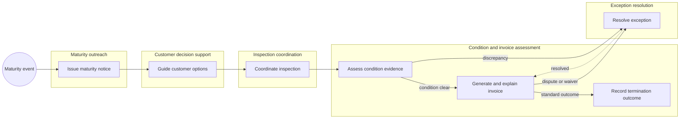

<!-- pdd:doc header="Alder Lease Termination {{RUN_TOKEN}} | Process Definition Document" footer="Confidential | Alder Motor Financial Services" client="Alder Motor Financial Services" author="Local Developer" date="29 September 2026" version="1.0" process="Alder Lease Termination {{RUN_TOKEN}}" -->

# Alder Lease Termination {{RUN_TOKEN}}

<!-- pdd:section id=business-context sources=as-is/overview.md,as-is/pain-points.md,to-be/overview.md,to-be/benefits.md reproj=g0 -->
# 1. Business Context

## 1.1 Problem Statement
Alder Motor Financial Services (AMFS) needs to improve the end-of-lease termination journey, which the supplied discovery discussion identifies as a source of customer decision friction, inspection failures, invoice questions, financial leakage and manual exception work. The current process spans **Automotive Finance**, **eTrail/Salesforce**, **CondiTrack**, and **OpenLane**, but detailed system boundaries and operational measures are not yet captured. Brand renewal rate and customer experience are central business outcomes, not secondary benefits.

## 1.2 Objectives
- Provide clear, controlled end-of-lease guidance through CSR assistance first and eligible self-service later.
- Improve evidence traceability and financial determination quality through a linked termination case.
- Make loyalty and brand-renewal disposition visible in the process outcome.
- Reduce avoidable manual searching, follow-up and exception rework while retaining human approval for high-judgment decisions.

## 1.3 Expected Value
Expected value is qualitative until AMFS supplies baselines and targets: a clearer customer journey, stronger loyalty opportunity, improved invoice confidence, more controlled exception handling, and less fragmented operational work. Measured targets belong in Section 10.

[Refine section](delegate:refine-section?section=business-context)

<!-- pdd:section id=scope sources=as-is/scope.md,entities/applications/ reproj=g0 -->
# 2. Scope

## 2.1 Process Identity

*Table 1. Process identity*

| Process name | Process group | Process identifier | Industry |
|---|---|---|---|
| Alder Lease Termination | End-of-lease servicing | Not confirmed | Automotive finance |

## 2.2 Scope Boundaries

*Table 2. Scope boundaries*

| In Scope | Out of Scope |
|---|---|
| Lease termination at normal maturity and early termination where applicable | Broader vehicle sales or OEM product strategy |
| Customer option guidance and loyalty/renewal outcome capture | Detailed customer-portal implementation design |
| Inspection coordination, condition evidence, invoice determination and exceptions | Contract/rate-rule authoring not evidenced in source material |
| Phased CSR-assistance and eligible self-service vision | Unconfirmed downstream legal, compliance and collections processes |

==TBD: confirm termination types, route eligibility and the final boundary with related finance processes==

## 2.3 Systems and Applications

*Table 3. Systems and applications*

| System | Role in Process | Access Type |
|---|---|---|
| **Automotive Finance** | Lease and vehicle context used for customer support and future case initiation | Read; write scope not confirmed |
| **eTrail/Salesforce** | Governed CSR scripts and knowledge guidance | Read |
| **CondiTrack** | Inspection scheduling and condition evidence | Both proposed; interface not confirmed |
| **OpenLane** | Auction/condition evidence used for comparison | Read proposed |
| **UiPath Case Management** | Proposed linked-case orchestration, work, evidence and audit history | Both proposed |

[Refine section](delegate:refine-section?section=scope)

<!-- pdd:section id=current-state sources=as-is/overview.md,as-is/diagram.md,as-is/steps/,as-is/metrics-and-volumes.md,as-is/pain-points.md,as-is/stages.md,as-is/stages/,as-is/attachments.md reproj=g0 -->
# 3. Current State

## 3.1 Overview
The current state is a **provisional, source-derived working hypothesis**, not a detailed operating procedure. A termination begins around maturity or customer contact, then moves through customer guidance, inspection, condition/invoice assessment, exception resolution and closure. It is long-running, changes teams, involves approvals and can return for rework.

## 3.2 Current Flow

*Table 4. Current flow by stage*

| # | Current step |
|---|---|
| 1 | Issue the 150-day end-of-term letter. |
| 2 | CSR retrieves lease context and controlled guidance to explain options. |
| 3 | Coordinate CondiTrack inspection activity and follow up on missed contact or no-show. |
| 4 | Compare condition evidence where CondiTrack and OpenLane information differs. |
| 5 | Generate and explain the final invoice. |
| 6 | Resolve a dispute, goodwill decision or financial anomaly before closure. |

## 3.3 Metrics

*Table 5. Current metrics and signals*

| Metric | Current signal | Measurement method |
|---|---|---|
| Net Promoter Score | Relevant business outcome; baseline unavailable | AMFS customer-experience reporting |
| Brand renewal rate | Significant loyalty measure; baseline unavailable | AMFS loyalty reporting |
| Invoice reliability/leakage | Material concern; baseline unavailable | Finance analysis required |
| Volume, handle time, SLA, backlog | Not supplied | Operations reporting required |

## 3.4 Pain Points

*Table 6. Current pain points*

| Where | What breaks | Impact |
|---|---|---|
| Customer decision support | Options and next steps are unclear; guidance can require manual article search | Friction and loyalty risk |
| Inspection coordination | Missed reminders, missed vendor contact and no-shows | Delayed or confusing experience |
| Condition and invoice assessment | Evidence can differ and invoicing is complex | Disputes, waivers and financial-control risk |
| Exception work | Handling is not confirmed as traceable end-to-end | Rework and limited control visibility |

[Open AS-IS diagram](delegate:open-diagram?which=as-is&anchor=current-state)

[Refine section](delegate:refine-section?section=current-state)

<!-- pdd:section id=target-state sources=to-be/overview.md,to-be/diagram.md,to-be/case-details.md,to-be/transformation-decisions.md,to-be/stages/,to-be/decisions-and-routes.md,to-be/data-and-evidence.md,to-be/exception-handling.md,to-be/slas.md,to-be/personas.md,to-be/benefits.md reproj=g0 -->
# 4. Future State

## 4.1 Vision
The future state creates one governed termination case that carries customer, lease, vehicle, inspection, evidence, financial and loyalty context across the lifecycle. **UiPath Case Management** is proposed to orchestrate case work; AI-assisted reasoning supports eligible-option assembly, deterministic automation supports calculations and integration work, and people retain approval and exception decisions. Phase 1 equips the CSR; Phase 2 provides eligible customer self-service.

```mermaid diagramFamily=case-design
flowchart LR
  caseStart(("Termination trigger"))
  subgraph initiate["Initiate termination case"]
    createCase["Create linked case"]
    validateContext["Validate case context"]
  end
  subgraph options["Guide options and retention"]
    assembleOptions["Assemble eligible options"]
    inspectionRequired{"Inspection required?"}
    deliverGuidance["Deliver controlled guidance"]
  end
  subgraph inspection["Orchestrate inspection"]
    scheduleInspection["Schedule inspection"]
    monitorInspection["Monitor inspection result"]
  end
  subgraph assessment["Assess condition and financial outcome"]
    reconcileEvidence["Reconcile condition evidence"]
    calculateOutcome["Calculate financial outcome"]
    approveOutcome["Approve determination"]
  end
  subgraph exceptions["Resolve exception or dispute"]
    holdAction["Hold affected action"]
    resolveDispute["Resolve exception"]
  end
  subgraph closure["Close and measure loyalty outcome"]
    recordLoyalty["Record loyalty outcome"]
    closeCase["Archive and close case"]
  end
  caseStart --> createCase
  createCase --> validateContext
  validateContext --> assembleOptions
  assembleOptions --> inspectionRequired
  inspectionRequired -->|Yes| scheduleInspection
  inspectionRequired -->|No| deliverGuidance
  scheduleInspection --> monitorInspection
  monitorInspection --> deliverGuidance
  deliverGuidance --> reconcileEvidence
  reconcileEvidence -->|evidence consistent| calculateOutcome
  reconcileEvidence -->|variance or dispute| holdAction
  calculateOutcome --> approveOutcome
  approveOutcome -->|approved| recordLoyalty
  approveOutcome -->|exception| holdAction
  holdAction --> resolveDispute
  resolveDispute -. resolved .-> reconcileEvidence
  recordLoyalty --> closeCase
  class caseStart kind-event
  class createCase kind-task,case-task-api-workflow
  class validateContext kind-task,case-task-action
  class assembleOptions kind-task,case-task-agent
  class inspectionRequired kind-decision
  class deliverGuidance kind-task,case-task-action,owner-csr
  class scheduleInspection kind-task,case-task-execute-connector-activity,system-conditrack
  class monitorInspection kind-task,case-task-wait-for-connector,system-conditrack
  class reconcileEvidence kind-task,case-task-api-workflow
  class calculateOutcome kind-task,case-task-rpa
  class approveOutcome kind-task,case-task-action
  class holdAction kind-task,case-task-api-workflow
  class resolveDispute kind-task,case-task-action
  class recordLoyalty kind-task,case-task-api-workflow
  class closeCase kind-task,case-task-api-workflow,case-ends-case
```

[Open TO-BE diagram](delegate:open-diagram?which=to-be&anchor=target-state)

## 4.2 Target Flow

*Table 7. Target case stages*

| # | Stage | Owner | Required for completion |
|---|---|---|---|
| 1 | Initiate termination case | Case-operations owner | Yes |
| 2 | Guide options and retention | CSR / Customer | Yes |
| 3 | Orchestrate inspection | Inspection coordinator | Conditional |
| 4 | Assess condition and financial outcome | Finance/assessment owner | Yes |
| 5 | Resolve exception or dispute | Exception owner / approver | Conditional |
| 6 | Close and measure loyalty outcome | Case owner | Yes |

## 4.2.1 Future Work Details

### Initiate termination case
> [!NOTE]
> Establishes a linked case and validates the minimum context before downstream work.

| Case task | Type | Work pattern | Activation | System(s) |
|---|---|---|---|---|
| Create linked case | api-workflow | System workflow/process | On event | Case platform |
| Validate case context | action | Human action/review | In order | Automotive Finance |
| Capture termination date | api-workflow | System workflow/process | In order | Automotive Finance |

### Guide options and retention
> [!NOTE]
> Makes compliant, loyalty-aware customer guidance available through CSR assistance and later eligible self-service.

| Case task | Type | Work pattern | Activation | System(s) |
|---|---|---|---|---|
| Assemble eligible options | agent | AI agent reasoning | In order | Automotive Finance |
| Retrieve approved script | execute-connector-activity | Connector/API operation | In order | eTrail/Salesforce |
| Deliver guidance | action | Human action/review or self-service | On demand | CSR/customer channel |

### Orchestrate inspection
> [!NOTE]
> Coordinates CondiTrack appointments and resolves missed-contact or vendor-response issues.

| Case task | Type | Work pattern | Activation | System(s) |
|---|---|---|---|---|
| Schedule inspection | execute-connector-activity | Connector/API operation | In order | CondiTrack |
| Wait for result | wait-for-connector | External event wait | On event | CondiTrack |
| Follow up failed appointment | action | Human action/review | On demand | Customer-contact channel |

### Assess condition and financial outcome
> [!NOTE]
> Reconciles evidence, prepares financial outcome and retains human approval for sensitive determinations.

| Case task | Type | Work pattern | Activation | System(s) |
|---|---|---|---|---|
| Reconcile evidence | api-workflow | System workflow/process | In order | CondiTrack / OpenLane |
| Calculate outcome | rpa | Legacy UI/RPA automation | In order | Automotive Finance/billing |
| Approve determination | action | Human action/review | In order | Case platform |

### Resolve exception or dispute
> [!NOTE]
> Holds affected actions, preserves evidence and routes waiver, dispute or variance decisions.

| Case task | Type | Work pattern | Activation | System(s) |
|---|---|---|---|---|
| Hold affected action | api-workflow | System workflow/process | On event | Case platform |
| Reconcile evidence | api-workflow | System workflow/process | In order | Evidence sources |
| Review adjustment or waiver | action | Human action/review | In order | Case platform |

### Close and measure loyalty outcome
> [!NOTE]
> Records final financial and loyalty disposition, retains evidence and closes the case.

| Case task | Type | Work pattern | Activation | System(s) |
|---|---|---|---|---|
| Record final disposition | api-workflow | System workflow/process | In order | Case platform |
| Record renewal outcome | api-workflow | System workflow/process | In order | Loyalty reporting |
| Archive and close case | api-workflow | System workflow/process | In order | Case platform |

## 4.3 What Changes

*Table 8. Transformation summary*

| Area | AS-IS | TO-BE | Why | How |
|---|---|---|---|---|
| Customer guidance | Fragmented research and script retrieval | Linked context and controlled guidance | Reduce friction and support renewal | CSR workspace then eligible self-service |
| Inspection | Reactive follow-up | Case-tracked appointment and outreach | Improve completion and experience | CondiTrack event tracking and assigned follow-up |
| Financial determination | Complex/manual quality risk | Deterministic preparation plus approval | Improve accuracy and traceability | Reconciliation, RPA and human sign-off |
| Exceptions | Ad hoc and weakly traceable | Controlled hold, owner, evidence and return path | Reduce leakage and rework | Secondary exception stage |
| Loyalty | Strategic measure outside process flow | Loyalty disposition at closure | Make renewal an operational outcome | Record outcome in case and reporting |

## 4.4 Case Work Summary
The proposed design uses API workflows for case state, evidence, holds, disposition and closure; connector activity and external-event waits for inspection; RPA for deterministic financial preparation; an agent for option assembly; and human actions for validation, customer guidance, approvals and exception decisions.

[Refine section](delegate:refine-section?section=target-state)

<!-- pdd:section id=business-rules sources=as-is/business-rules.md,to-be/business-rules.md reproj=g0 -->
# 5. Business Rules

*Table 9. Business rules*

| Rule ID | Description |
|---|---|
| BR-001 | Approved customer script content must remain governed through the existing ECM process and the version used should be retained in the case. |
| BR-002 | Script changes follow ECM submission and deployment. |
| BR-003 | The five-day early-return example requires confirmation of complete applicability conditions. |
| BR-004 | Condition discrepancies require comparison of available CondiTrack and OpenLane evidence before responsibility or waiver treatment. |
| BR-005 | Hold affected financial action when evidence is inconsistent, a dispute is active, or material exception work is unresolved. |
| BR-006 | Require human approval before a sensitive financial determination is issued; thresholds are not confirmed. |
| BR-007 | Do not close a case until required work is complete and a terminal outcome is recorded. |

[Refine section](delegate:refine-section?section=business-rules)

<!-- pdd:section id=data-model sources=entities/artifacts/,as-is/data-inputs-outputs.md reproj=g0 -->
# 6. Data Model

## 6.1 Entities

| Entity | Description |
|---|---|
| Termination case | Linked business record for a customer lease-termination event. |
| Lease and vehicle | Context used to guide options, inspect and determine financial outcome. |
| Inspection evidence | Appointment, result, photos and vendor response. |
| Financial determination | Calculation inputs, outcome, approval and notice. |
| Loyalty disposition | Renewal/brand outcome captured at closure. |

## 6.2 Data Inputs and Outputs

*Table 10. Data inputs and outputs*

| Artifact | Source / Destination | Format | Consumed / Produced By |
|---|---|---|---|
| 150-day letter | AMFS to customer | Letter | Maturity outreach |
| Lease/vehicle information | Automotive Finance to case | Application data | Guidance and assessment |
| Approved script | eTrail/Salesforce to CSR | Knowledge article | Customer guidance |
| Inspection/auction evidence | CondiTrack/OpenLane to case | Findings/photos | Assessment and exception handling |
| Final invoice | AMFS to customer | Invoice | Assessment and customer support |

## 6.3 Field-Level Data Dictionary

| Field | Type | Format / Pattern | Valid values / range | Mandatory | Privacy class |
|---|---|---|---|---|---|
| Lease identifier | String | Not confirmed | Valid active lease | Yes | Confidential |
| Customer identity/contact | String | Not confirmed | Verified customer | Yes | PII |
| Vehicle VIN | String | VIN | Valid vehicle | Yes | Confidential |
| Termination date | Date | Not confirmed | Authoritative event date | Yes | Confidential |
| Financial outcome | Choice | Not confirmed | Invoice/refund/no balance/adjusted | Yes | Confidential |
| Loyalty disposition | Choice | Not confirmed | Renewal/other outcome | Proposed | Confidential |

## 6.4 Data Flow & Lineage

| # | Data movement |
|---|---|
| 1 | Maturity/customer event creates or links the termination case. |
| 2 | Automotive Finance supplies lease and vehicle context. |
| 3 | eTrail/Salesforce supplies current approved guidance. |
| 4 | CondiTrack and OpenLane provide condition evidence. |
| 5 | Financial determination and approval are retained in the case. |
| 6 | Closure records financial and loyalty disposition. |

## 6.5 Integrations

| Integration | Fields passed | Connector / type | Endpoint + Auth |
|---|---|---|---|
| Automotive Finance → case | Lease, vehicle, customer context | API/workflow proposed | Not confirmed |
| eTrail/Salesforce → guidance | Script content/version | Connector proposed | Not confirmed |
| CondiTrack → case | Appointment and inspection evidence | Connector proposed | Not confirmed |
| OpenLane → case | Condition/auction evidence | API proposed | Not confirmed |

==TBD: confirm integration endpoints and authentication at SDD==

[Refine section](delegate:refine-section?section=data-model)

<!-- pdd:section id=people sources=entities/people/ reproj=g0 -->
# 7. People

## 7.1 Roles & Personas

| Stakeholder | Responsibility |
|---|---|
| Customer | Receives guidance and uses eligible self-service capability in Phase 2. |
| CSR | Provides controlled customer guidance in Phase 1 and initiates/escalates work. |
| Inspection coordinator | Monitors inspection appointment and follow-up work. |
| Finance/assessment owner | Reviews evidence and financial determination. |
| Exception owner / approver | Resolves disputes, waivers and material exceptions. |
| Case owner | Oversees case completion and closure. |
| CondiTrack | Inspection-service system persona. |
| Automotive Finance | Lease-context source system persona. |
| eTrail/Salesforce | Controlled-knowledge source system persona. |
| OpenLane | Auction/condition-evidence system persona. |

[Refine section](delegate:refine-section?section=people)

<!-- pdd:section id=raci sources=entities/people/ reproj=g0 -->
# 7.2 RACI

> [!WARNING]
> **Needs capture:** named business owners and RACI assignments require AMFS validation. This section will auto-fill when the wiki source is available.

*Table 11. Proposed interim RACI*

| Activity/Stage | Responsible | Accountable | Consulted | Informed |
|---|---|---|---|---|
| Customer guidance | CSR | Service owner — not confirmed | Customer | Case owner |
| Inspection coordination | Inspection coordinator — not confirmed | Operations owner — not confirmed | CondiTrack | Customer/CSR |
| Financial determination | Finance/assessment owner — not confirmed | Finance owner — not confirmed | CSR | Customer |
| Exception decision | Exception owner/approver — not confirmed | Business owner — not confirmed | Finance/CSR | Case owner |

[Refine section](delegate:refine-section?section=raci)

<!-- pdd:section id=exceptions sources=as-is/exception-handling.md,to-be/exception-handling.md reproj=g0 -->
# 8. Exceptions and Error Handling

## 8.1 Known Exceptions

| Exception | Trigger | AS-IS Handling | TO-BE Handling |
|---|---|---|---|
| Inspection failure/no-show | Missed contact or appointment | Follow-up owner not confirmed | Case follow-up work, evidence and reschedule/exception route |
| Evidence variance | CondiTrack/OpenLane conflict | Investigation/waiver possible | Hold action, reconcile evidence, assign owner and return to assessment |
| Invoice dispute | Customer questions charge | Explanation/escalation not fully documented | Hold affected outcome, evidence-based review and documented decision |
| Waiver request | Customer or evidence issue | Approval controls not confirmed | Human review and approval with retained decision evidence |
| System/data failure | Unavailable/inconsistent data | Not documented | Halt irreversible action; controlled manual fallback and reconciliation |

## 8.2 Exception Data State Transitions

| Exception | Affected record | State on entry | State on resolution | State on terminal failure |
|---|---|---|---|---|
| Dispute/variance | Termination case and financial action | Held and flagged | Released to reassessment | Transferred/escalated |
| Failed inspection contact | Inspection work item | Follow-up required | Completed/rescheduled | Owned exception |
| System/data failure | Affected work item | Paused | Reconciled and resumed | Escalated for manual resolution |

## 8.3 HITL & Action Center Task Form Specifications

| Escalation point | Trigger | Fields surfaced | Available actions → resulting state | Task SLA | Assignee role |
|---|---|---|---|---|---|
| Financial approval | Determination prepared | Case, evidence, inputs, proposed outcome | Approve → issue; return → reassess; reject → exception | Not confirmed | Finance/assessment approver |
| Waiver/dispute review | Active dispute or waiver | Customer issue, evidence, prior actions, recommendation | Approve/deny/request evidence → documented route | Not confirmed | Exception approver |

<!-- doc:placeholder kind="screenshot" -->
> [!NOTE]
> **Screenshot Placeholder**
> Insert screenshot: human review form showing evidence, financial determination and Approve / Return / Escalate actions.

[Refine section](delegate:refine-section?section=exceptions)

<!-- pdd:section id=compliance sources=as-is/compliance.md,to-be/business-rules.md reproj=g0 -->
# 9. Compliance and Regulatory

## 9.1 Compliance Traceability Matrix

> [!WARNING]
> **Needs capture:** AMFS regulatory obligations, privacy classification, retention policy and formal compliance evidence are not supplied. This section will auto-fill when the wiki source is available.

| Requirement / Rule | Enforced at | Evidence retained |
|---|---|---|
| BR-001 controlled guidance | Guide options and retention | Script version and interaction record |
| BR-002 ECM change governance | Knowledge-content change process | ECM approval/deployment record |
| BR-004 condition evidence | Assessment/exception stage | Inspection and auction evidence |
| BR-005 financial hold | Exception stage | Hold reason, owner and timestamp |
| BR-006 human approval | Financial assessment | Approval and decision record |
| BR-007 closure control | Closure stage | Completion/terminal-outcome record |

## 9.2 Audit & Traceability
The proposed case retains timestamps, source evidence, calculation inputs, communications, approvals, exception history and closure outcome. Required retention duration, privacy rules and formal regulatory mapping remain open.

[Refine section](delegate:refine-section?section=compliance)

<!-- pdd:section id=kpis sources=to-be/benefits.md reproj=g0 -->
# 10. KPIs and Acceptance Criteria

## 10.1 KPIs

> [!WARNING]
> **Needs capture:** AMFS KPI baselines, targets and acceptance thresholds are not supplied. This section will auto-fill when the wiki source is available.

*Table 12. Proposed KPI catalogue*

| KPI | Target / acceptance signal |
|---|---|
| Net Promoter Score | Baseline and target not confirmed |
| Brand renewal rate | Baseline and target not confirmed |
| Inspection completion | Target not confirmed |
| Invoice accuracy | Target not confirmed |
| Dispute/waiver resolution time | Target not confirmed |
| Evidence completeness / clean-close rate | Target not confirmed |

## 10.2 Acceptance Criteria
- Every termination case records a valid trigger, case owner, evidence trail and terminal outcome.
- Affected financial actions are held when an active exception requires review.
- Controlled guidance identifies the approved content version used.
- Human approval is retained for sensitive financial determination.
- KPI definitions, baselines and acceptance thresholds are agreed before production acceptance.

[Refine section](delegate:refine-section?section=kpis)

<!-- pdd:section id=assumptions-risks sources=queries/,as-is/scope.md reproj=g0 -->
# 11. Assumptions, Constraints, Dependencies and Risks

## 11.1 Assumptions

| Assumption | Detail |
|---|---|
| Phased delivery | CSR assistance precedes eligible customer self-service. |
| Linked case spine | One case holds the termination lifecycle, evidence and outcome. |
| Human financial control | Human approval remains for sensitive decisions. |

## 11.2 Constraints

| Constraint | Detail |
|---|---|
| Source maturity | The primary source is a discovery transcript, not an operating procedure. |
| Controlled scripts | eTrail/ECM governance remains authoritative. |
| Privacy/compliance | Not confirmed |

==TBD: confirm privacy, retention, regulatory and peak-load constraints==

## 11.3 Dependencies

| Dependency | Type | Detail |
|---|---|---|
| Automotive Finance access/interface | Hard | Required for lease/vehicle context and possible financial processing. |
| eTrail/Salesforce access | Hard | Required for governed guidance retrieval. |
| CondiTrack and OpenLane data availability | Hard | Required for inspection and condition evidence. |
| AMFS RACI, rules and thresholds | Hard | Required to finalize controls and acceptance criteria. |
| Customer portal channel | Soft | Required only for Phase 2 self-service. |

## 11.4 Risks

| Risk | Mitigation |
|---|---|
| Incomplete source detail produces incorrect controls | Validate RACI, rules, outcomes and SLA during detailed discovery. |
| Integration/data gaps delay delivery | Confirm ownership, interface pattern and authentication early. |
| Automation makes unsupported financial decisions | Hold action and retain human approval for sensitive outcomes. |
| Loyalty measurement is inconsistently defined | Agree definition, source and attribution before KPI design. |

[Refine section](delegate:refine-section?section=assumptions-risks)

<!-- pdd:section id=glossary sources=entities/ reproj=g0 -->
# 12. Glossary

*Table 13. Glossary*

| Term | Definition |
|---|---|
| CondiTrack | Inspection service named in the discovery discussion. |
| Brand renewal rate | AMFS loyalty measure relating to return to a AMFS-financed Alder; final definition requires validation. |
| CSR | Customer service representative. |
| ECM | Existing governed process for controlled script changes. |
| eTrail | Internal repository of CSR guidance, described as a Salesforce application. |
| NPS | Net Promoter Score. |
| OpenLane | Auction/condition-evidence source named in the discovery discussion. |
| AMFS | Alder Motor Financial Services. |

[Refine section](delegate:refine-section?section=glossary)

<!-- pdd:section id=next-steps sources=queries/open-questions.md reproj=g0 -->
# 13. Next Steps

| # | Action item |
|---|---|
| 1 | Validate full termination types, route eligibility and mutually exclusive terminal outcomes. |
| 2 | Confirm RACI, named owners, approvers, stage entry/exit controls and escalation destinations. |
| 3 | Capture invoice, waiver, dispute and compliance rules with evidence and thresholds. |
| 4 | Confirm systems of record, integration methods, endpoint/authentication and access model. |
| 5 | Establish volume, backlog, SLA, NPS and brand-renewal baselines and targets. |
| 6 | Define Phase 2 self-service eligibility, customer-channel controls and change-management approach. |

[Refine section](delegate:refine-section?section=next-steps)

<!-- pdd:section id=appendix-a sources=derived reproj=g0 -->
# Appendix A: Process Map and Diagrams

The confirmed current-state and future-state case maps are embedded in Sections 3.4 and 4.1. The future map is the proposed process-model reference for the phased termination case.

<!-- doc:placeholder kind="integration-diagram" -->
> [!NOTE]
> **Integration Diagram Placeholder**
> Insert diagram: Automotive Finance, eTrail/Salesforce, CondiTrack, OpenLane, customer/CSR channels and the proposed linked termination case, including evidence and exception-return paths.

[Refine section](delegate:refine-section?section=appendix-a)
