<!-- pdd:doc header="AML Suspicious Activity Alert Triage and Investigation Case Management {{RUN_TOKEN}} | Process Definition Document" footer="Confidential | Madrileño Trust & Securities" client="Madrileño Trust & Securities" author="Digital Transformation Office" date="29 September 2026" version="1.0" process="AML Suspicious Activity Alert Triage and Investigation Case Management {{RUN_TOKEN}}" -->

# AML Suspicious Activity Alert Triage and Investigation Case Management {{RUN_TOKEN}}

<!-- pdd:section id=business-context sources=as-is/overview.md,as-is/pain-points.md,to-be/overview.md,to-be/benefits.md reproj=g0 -->
# 1. Business Context

## 1.1 Problem Statement
**Featurespace ARIC** alerts are currently managed through SharePoint, spreadsheets, Word forms and email, with alert data manually re-keyed and evidence/approvals fragmented. The Compliance Director reported two missed SAR/CPI statutory deadlines in the preceding year; waits for internal documentation can consume the invisible deadline. The resulting process creates material regulatory, audit, transcription and tipping-off exposure.

## 1.2 Objectives
- Replace fragmented tracking with one restricted, auditable AML case record.
- Make the statutory filing clock, workload, ownership and deadline risk visible in real time.
- Automate repeatable intake, routing, data movement, validation and evidence capture while retaining accountable human judgment.
- Enforce PEP escalation, maker-checker approval, need-to-know access and controlled filing handoffs.

## 1.3 Expected Value
The target state improves operational control, regulatory defensibility, confidential-data segregation and management visibility. Quantified acceptance signals are defined in Section 10.

[Refine section](delegate:refine-section?section=business-context)

<!-- pdd:section id=scope sources=as-is/scope.md,entities/applications/ reproj=g0 -->
# 2. Scope

## 2.1 Process Identity

*Table: Process identity*

| Item | Value |
|---|---|
| Process name | AML Suspicious Activity Alert Triage and Investigation Case Management |
| Process group | Financial Crime Compliance |
| Process identifier | MT-AML-CASE-001 |
| Industry | Spanish securities and financial services |

## 2.2 Scope Boundaries

*Table: Scope boundaries*

| In Scope | Out of Scope |
|---|---|
| Alert triage and routing | Account blocking and payment blocking |
| Investigation, evidence and escalation | Transaction reversal |
| SAR/CPI preparation and SEPBLAC filing | Fraud Operations protective-action workflow |
| Closure, retention and QA | AML-disclosing customer communication |

## 2.3 Systems and Applications

*Table: Systems and applications*

| System | Role in Process | Access Type |
|---|---|---|
| **Featurespace ARIC** | Alert source, score and transaction context | Read / integration |
| **SharePoint** | Current manual case tracking | Read / write |
| **SEPBLAC PEC** | Authorised regulatory submission and acknowledgement channel | Write / acknowledgement read |
| **UiPath Case Management** | Recommended future restricted case lifecycle, queues, clocking and approvals | Read / write |

[Refine section](delegate:refine-section?section=scope)

<!-- pdd:section id=current-state sources=as-is/overview.md,as-is/diagram.md,as-is/stages.md,as-is/metrics.md,as-is/pain-points.md reproj=g0 -->
# 3. Current State

## 3.1 Overview
The current process begins with an ARIC alert and uses manual SharePoint, email, spreadsheets and document attachments to manage triage, investigation, approval and filing. Alert data is re-keyed, evidence may be reopened through duplicated work, and the filing clock is not reliably visible across the working team.

## 3.2 Current Flow

*Table: Current case lifecycle*

| # | Current step |
|---|---|
| 1 | ARIC generates an alert; qualifying low-risk retail alerts are dismissed with recorded rationale. |
| 2 | L1 opens and assigns standard or priority investigation cases. |
| 3 | L1 collects KYC, transaction and supporting evidence, requesting documents through permitted intermediaries. |
| 4 | A PEP or priority condition escalates to Senior Analyst or Compliance Director. |
| 5 | Investigator recommends filing or no action; an independent reviewer approves or returns rework. |
| 6 | Approved SAR/CPI is filed through PEC, or approved no-action closure is retained. |

## 3.3 Metrics

*Table: Current timing baselines*

| Metric | Current signal | Measurement method |
|---|---|---|
| Standard L1 triage | 1 business day | Decision-table SLA |
| Priority / PEP L1 triage | 4 business hours | Decision-table SLA |
| Standard case SLA | 15 business days | Decision-table SLA |
| Priority / PEP total SLA | 10 business days | Decision-table SLA |
| SAR/CPI filing deadline | 10 business days from formal case opening | Internal policy |
| Missed filing incidents | 2 in previous year | Compliance Director statement |

## 3.4 Pain Points

*Table: Current pain points*

| Where | What breaks | Impact |
|---|---|---|
| Deadline management | Clock is invisible during evidence waits | Missed statutory filing deadlines |
| Case tracking | Fragmented SharePoint, spreadsheets and email | Incomplete audit trail and rework |
| Data capture | ARIC data is manually copied | Transcription risk |
| Access | Broad visibility | Tipping-off exposure |
| Approval / versions | Closure rationale and SAR draft versions are weakly controlled | Regulatory defensibility risk |

```mermaid diagramFamily=case-design
flowchart LR
  alertStart(("ARIC alert received"))
  subgraph intake["Alert intake and routing"]
    routeAlert["Route alert"]
    dismissAlert["Record auto-dismissal"]
  end
  subgraph triage["Case triage and assignment"]
    openCase["Open investigation case"]
    assignCase["Assign investigator"]
  end
  subgraph investigate["Investigation and evidence"]
    gatherEvidence["Gather evidence"]
    requestDocuments["Request documents"]
    reviewProfile["Review customer profile"]
  end
  subgraph approval["Escalation and approval"]
    escalatePep["Escalate PEP case"]
    reviewRecommendation["Review recommendation"]
  end
  subgraph reporting["Disposition and reporting"]
    draftSar["Draft SAR or CPI"]
    approveClosure["Approve no-action closure"]
    fileSar["File SAR or CPI"]
  end
  subgraph closure["Closure and retention"]
    retainCase["Retain closed case"]
  end
  alertStart --> routeAlert
  routeAlert -->|Dismiss| dismissAlert
  routeAlert -->|Open| openCase
  openCase --> assignCase
  assignCase --> gatherEvidence
  gatherEvidence -. documents needed .-> requestDocuments
  requestDocuments -. response received .-> gatherEvidence
  gatherEvidence --> reviewProfile
  reviewProfile -->|PEP| escalatePep
  reviewProfile -->|No PEP| reviewRecommendation
  escalatePep --> reviewRecommendation
  reviewRecommendation -->|File| draftSar
  reviewRecommendation -->|No file| approveClosure
  draftSar --> fileSar
  fileSar --> retainCase
  approveClosure --> retainCase
  class alertStart kind-event
  class routeAlert kind-decision,owner-l1-analyst,system-featurespace-aric
  class dismissAlert kind-task,case-task-action,owner-l1-analyst,system-sharepoint,case-ends-case
  class openCase kind-task,case-task-action,owner-l1-analyst,system-sharepoint
  class assignCase kind-task,case-task-action,owner-l1-analyst,system-sharepoint
  class gatherEvidence kind-task,case-task-action,owner-l1-analyst,system-sharepoint
  class requestDocuments kind-task,case-task-action,owner-l1-analyst,system-email
  class reviewProfile kind-task,case-task-action,owner-l1-analyst,system-sharepoint
  class escalatePep kind-task,case-task-action,owner-compliance-director,system-email
  class reviewRecommendation kind-decision,owner-senior-analyst,system-sharepoint
  class draftSar kind-task,case-task-action,owner-senior-analyst,system-word
  class approveClosure kind-task,case-task-action,owner-senior-analyst,system-sharepoint
  class fileSar kind-task,case-task-action,owner-sepblac-liaison-officer,system-sepblac-pec
  class retainCase kind-task,case-task-action,owner-compliance-director,system-sharepoint,case-ends-case
```

[Open AS-IS diagram](delegate:open-diagram?which=as-is&anchor=current-state)

[Refine section](delegate:refine-section?section=current-state)

<!-- pdd:section id=target-state sources=to-be/overview.md,to-be/diagram.md,to-be/case-details.md,to-be/stages/,to-be/business-rules.md,to-be/exception-handling.md,to-be/slas.md,to-be/personas.md,to-be/benefits.md reproj=g0 -->
# 4. Future State

## 4.1 Vision
The future process is a controlled AML case lifecycle that integrates ARIC intake, centralises restricted evidence, calculates SLA clocks, automates routing and validation, and records all approvals and regulatory handoffs. UiPath Case Management is the recommended platform pattern because it manages stages, owners, timers, evidence and human approvals; legal and compliance decisions remain human-controlled.

```mermaid diagramFamily=case-design
flowchart LR
  caseStart(("Eligible alert received"))
  subgraph intake["Alert intake and routing"]
    ingestAlert["Ingest ARIC alert"]
    routeCase["Apply routing rules"]
    reviewRoute["Review routing exception"]
  end
  subgraph opening["Case opening and assignment"]
    createCase["Create case record"]
    startClock["Calculate filing clock"]
    assignInvestigator["Assign investigator"]
  end
  subgraph investigation["Investigation and evidence"]
    retrieveData["Retrieve case data"]
    analyseCase["Analyse activity"]
    requestInfo["Request documents"]
    logEvidence["Log evidence"]
  end
  subgraph decision["Escalation and decision control"]
    detectEscalation["Detect PEP or SLA risk"]
    reviewDecision["Review recommendation"]
    approvePep["Approve PEP disposition"]
  end
  subgraph filing["SAR CPI filing and acknowledgement"]
    assembleFiling["Assemble filing package"]
    submitFiling["Submit through PEC"]
    awaitReceipt["Capture acknowledgement"]
  end
  subgraph closure["Closure retention and QA"]
    approveClosure["Approve closure rationale"]
    retainRecord["Apply retention controls"]
  end
  caseStart --> ingestAlert
  ingestAlert --> routeCase
  routeCase -->|Open case| createCase
  routeCase -. routing exception .-> reviewRoute
  reviewRoute -. confirmed route .-> createCase
  createCase --> startClock
  startClock --> assignInvestigator
  assignInvestigator --> retrieveData
  retrieveData --> analyseCase
  analyseCase -. documents needed .-> requestInfo
  requestInfo -. response received .-> logEvidence
  analyseCase --> logEvidence
  logEvidence --> detectEscalation
  detectEscalation --> reviewDecision
  reviewDecision -->|PEP| approvePep
  approvePep -->|File| assembleFiling
  reviewDecision -->|File| assembleFiling
  reviewDecision -->|No file| approveClosure
  reviewDecision -. rework .-> analyseCase
  assembleFiling --> submitFiling
  submitFiling --> awaitReceipt
  awaitReceipt --> retainRecord
  approveClosure --> retainRecord
  class caseStart kind-event
  class ingestAlert kind-task,case-task-execute-connector-activity,owner-aml-case-platform,system-featurespace-aric
  class routeCase kind-decision,owner-aml-case-platform,system-case-platform
  class reviewRoute kind-task,case-task-action,owner-l1-analyst,system-case-platform
  class createCase kind-task,case-task-api-workflow,owner-aml-case-platform,system-case-platform
  class startClock kind-task,case-task-api-workflow,owner-aml-case-platform,system-case-platform
  class assignInvestigator kind-task,case-task-api-workflow,owner-aml-case-platform,system-case-platform
  class retrieveData kind-task,case-task-api-workflow,owner-aml-case-platform,system-case-platform
  class analyseCase kind-task,case-task-action,owner-l1-analyst,system-case-platform
  class requestInfo kind-task,case-task-action,owner-legal-relationship-management,system-case-platform
  class logEvidence kind-task,case-task-action,owner-l1-analyst,system-case-platform
  class detectEscalation kind-task,case-task-api-workflow,owner-aml-case-platform,system-case-platform
  class reviewDecision kind-decision,owner-senior-analyst,system-case-platform
  class approvePep kind-task,case-task-action,owner-compliance-director,system-case-platform
  class assembleFiling kind-task,case-task-api-workflow,owner-aml-case-platform,system-case-platform
  class submitFiling kind-task,case-task-action,owner-sepblac-liaison-officer,system-sepblac-pec
  class awaitReceipt kind-task,case-task-wait-for-connector,owner-aml-case-platform,system-sepblac-pec
  class approveClosure kind-task,case-task-action,owner-senior-analyst,system-case-platform
  class retainRecord kind-task,case-task-api-workflow,owner-aml-case-platform,system-case-platform,case-ends-case
```

[Open TO-BE diagram](delegate:open-diagram?which=to-be&anchor=target-state)

## 4.2 Target Flow

*Table: Future stages*

| # | Stage | Owner | Required for completion |
|---|---|---|---|
| 1 | Alert Intake and Routing | AML Case Platform / L1 Analyst | Yes |
| 2 | Case Opening and Assignment | AML Case Platform / L1 Analyst | Yes |
| 3 | Investigation and Evidence Management | L1 Analyst | Yes |
| 4 | Escalation and Decision Control | Senior Analyst / Compliance Director | Yes |
| 5 | SAR/CPI Filing and Acknowledgement | SEPBLAC Liaison Officer | Conditional |
| 6 | Closure, Retention and QA | Senior Analyst / Compliance Director | Yes |

## 4.2.1 Future Work Details

### Alert Intake and Routing
> Creates a traceable intake item and performs controlled first routing.

| Case activity | Type | Pattern | Outcome |
|---|---|---|---|
| Ingest, enrich and deduplicate ARIC alert | Connector / API workflow | Automated system workflow | Immutable payload and linked-alert context |
| Apply approved routing rules | API workflow | Automated system workflow | Dismissal or case-open decision |
| Review routing exception | Human action | Human review | Auditable override rationale |

### Case Opening and Assignment
> Creates the restricted case and makes the statutory clock visible.

| Case activity | Type | Pattern | Outcome |
|---|---|---|---|
| Create case and calculate deadline | API workflow | Automated system workflow | Case ID, opening date and day-10 deadline |
| Assign queue and investigator | API workflow | Automated system workflow | Named owner and priority queue |
| Review priority exception | Human action | Human review | Approved priority override |

### Investigation and Evidence Management
> Preserves evidence provenance while keeping investigation judgment with the analyst.

| Case activity | Type | Pattern | Outcome |
|---|---|---|---|
| Retrieve approved customer and transaction data | API workflow | Automated system workflow | Evidence records |
| Analyse activity and customer profile | Human action | Analyst review | Investigation analysis |
| Issue neutral RFI and monitor response | Human action / timer wait | Human review with timer | Attributed response or escalation |
| Record evidence and gaps | Human action | Analyst review | Evidence log and recommendation input |

### Escalation and Decision Control
> Applies maker-checker control, PEP governance and structured rework.

| Case activity | Type | Pattern | Outcome |
|---|---|---|---|
| Detect PEP and deadline risk | API workflow | Automated system workflow | Escalation event |
| Review file/no-file recommendation | Human action | Independent review | File, no-file or rework decision |
| Approve PEP disposition | Human action | Director approval | Documented PEP approval |

### SAR/CPI Filing and Acknowledgement
> Delivers an approved, validated regulatory package through the authorised channel.

| Case activity | Type | Pattern | Outcome |
|---|---|---|---|
| Assemble and validate package | API workflow | Automated system workflow | Versioned, validated package |
| Submit through PEC | Human action | Authorised human submission | Receipt |
| Capture acknowledgement or rejection | Connector wait | External-event wait | Filing identifier, acknowledgement or correction task |

### Closure, Retention and QA
> Closes only after approval or acknowledgement and retains a defensible record.

| Case activity | Type | Pattern | Outcome |
|---|---|---|---|
| Approve closure rationale | Human action | Independent approval | Closure decision |
| Apply retention controls | API workflow | Automated system workflow | Restricted retained record |
| Select and review QA sample | API workflow / human action | Scheduled system workflow and human review | QA finding |

## 4.3 What Changes

| Area | AS-IS | TO-BE | Why | How |
|---|---|---|---|---|
| Intake | Manual re-keying | Automated ARIC intake and enrichment | Reduce transcription risk | Connector/API integration |
| Clock | Invisible manual tracking | Case-level business-calendar timer and day-8 escalation | Prevent deadline breaches | Automated timer and dashboard |
| Evidence | Email and duplicate attachments | Structured evidence workspace and RFI tasks | Preserve provenance and rework history | Restricted case record |
| PEP | Manual notification | Immediate event-driven Director escalation | Enforce mandatory control | PEP-triggered action |
| Approval | Inconsistent closure trail | Maker-checker decision and rework action | Independent defensible decision | Human approval tasks |
| Filing | Informal package handoff | Validated, versioned PEC handoff | Controlled submission and reconciliation | Package validation and receipt capture |

## 4.4 Case Work Summary
The future lifecycle uses automated connector/API work for intake, clocking, enrichment, validation, retention and monitoring; human actions for investigation, approvals and authorised filing; and external/timer waits for RFI and PEC acknowledgement events.

[Refine section](delegate:refine-section?section=target-state)

<!-- pdd:section id=business-rules sources=as-is/business-rules.md,to-be/business-rules.md reproj=g0 -->
# 5. Business Rules

*Table: Business rules*

| Rule ID | Description |
|---|---|
| BR-001 | Apply approved ARIC routing rules; qualifying low-risk retail alerts are dismissed with recorded rationale and no investigation case. |
| BR-002 | Priority routing applies to high score or prior-SAR history; score 1–2 non-retail alerts use standard investigation. |
| BR-003 | PEP identification at any stage triggers immediate Compliance Director escalation and blocks disposition without approval. |
| BR-004 | Formal opening creates an immutable 10-business-day SAR/CPI deadline; unresolved cases at day 8 escalate. |
| BR-005 | Investigator and approver must be distinct roles; no filing or closure proceeds without documented rationale and approval. |
| BR-006 | Access is restricted by role and need-to-know; access, exports, overrides and disclosure decisions are logged. |
| BR-007 | Filing package validation must pass mandatory fields, approvals and version controls before PEC submission. |

[Refine section](delegate:refine-section?section=business-rules)

<!-- pdd:section id=data-model sources=to-be/data-and-evidence.md,as-is/data-inputs-outputs.md reproj=g0 -->
# 6. Data Model

## 6.1 Entities

| Entity | Description |
|---|---|
| AML Case | Restricted work record holding ownership, priority, deadline, evidence, decisions and outcome. |
| ARIC Alert | Immutable monitoring alert, score, scenario and transaction payload. |
| Subject | Customer or entity under review; identifier data is PII. |
| Evidence Item | Attributed source, extract, correspondence or analysis record. |
| Approval | Timestamped independent decision, authority and rationale. |
| Filing Package | Versioned SAR/CPI content, validation outcome, receipt and acknowledgement. |

## 6.2 Data Inputs and Outputs

| Artifact | Source / Destination | Format | Consumed / Produced By |
|---|---|---|---|
| ARIC alert payload | ARIC → Case platform | API event | Intake workflow |
| Investigation evidence | KYC/internal sources → Case platform | Records and attachments | L1 Analyst |
| SAR/CPI package | Case platform → PEC | Validated electronic package | Liaison Officer |
| Filing acknowledgement | PEC → Case platform | External acknowledgement | Filing workflow |

## 6.3 Field-Level Data Dictionary

| Field | Type | Format / Pattern | Valid values / range | Mandatory | Privacy class |
|---|---|---|---|---|---|
| Alert ID | String | Immutable source ID | ARIC identifier | Yes | Restricted |
| Subject ID | String | Tokenised where feasible | Customer/entity identifier | Yes | PII |
| Risk score | Integer | 1–10 | 1–10 | Yes | Restricted |
| Case opening date | Date/time | Immutable timestamp | Business-calendar clock start | Yes | Restricted |
| Filing deadline | Date/time | Derived | Opening + 10 business days | Yes | Restricted |
| PEP flag | Boolean | True / False | Current case status | Yes | Restricted |
| Disposition | Choice | Controlled list | File / No file / Rework | Yes | Restricted |

## 6.4 Data Flow and Lineage

| # | Data movement |
|---|---|
| 1 | ARIC creates source alert payload. |
| 2 | Intake workflow preserves payload and creates/links case record. |
| 3 | Investigation adds retrieved data, evidence, RFIs and analysis. |
| 4 | Approval records recommendation, reviewer and rationale. |
| 5 | Filing workflow creates validated version, PEC receipt and acknowledgement. |
| 6 | Closure workflow retains the restricted case/audit package. |

## 6.5 Integrations

| Integration | Fields passed | Connector / type | Endpoint + Auth |
|---|---|---|---|
| ARIC → Case platform | Alert, score, subjects, transactions, scenario | API / connector | Not confirmed |
| KYC/CDD → Case platform | Customer profile and risk information | API / approved retrieval | Not confirmed |
| Case platform → PEC | Approved SAR/CPI package | Authorised submission handoff | Not confirmed |

==TBD: confirm the integration endpoint and authentication during solution design==

[Refine section](delegate:refine-section?section=data-model)

<!-- pdd:section id=people sources=to-be/personas.md reproj=g0 -->
# 7. People

## 7.1 Roles and Personas

| Stakeholder | Responsibility |
|---|---|
| AML Case Platform | Automated intake, routing, clocks, controls, audit and work distribution. |
| L1 Analyst | Investigates assigned cases, gathers evidence and recommends disposition. |
| Senior Analyst | Reviews recommendations, manages priority cases, returns rework and approves permitted decisions. |
| Compliance Director | Approves PEP dispositions, owns escalations and oversees QA. |
| SEPBLAC Liaison Officer | Submits approved filings through PEC and captures receipt. |
| Legal / Relationship Management | Sends neutral evidence requests without AML rationale. |
| Fraud Operations | Receives protective-action referral without AML case visibility. |

[Refine section](delegate:refine-section?section=people)

<!-- pdd:section id=raci sources=to-be/personas.md,to-be/stages/ reproj=g0 -->
## 7.2 RACI

*Table: RACI by stage*

| Activity / Stage | Responsible | Accountable | Consulted | Informed |
|---|---|---|---|---|
| Alert intake and routing | AML Case Platform / L1 Analyst | Compliance Director | Senior Analyst | L1 Analyst |
| Case opening and assignment | AML Case Platform | Senior Analyst | L1 Analyst | Compliance Director |
| Investigation and evidence | L1 Analyst | Senior Analyst | Legal / Relationship Management | Compliance Director as needed |
| PEP / decision approval | Senior Analyst / Compliance Director | Compliance Director | L1 Analyst | Liaison Officer |
| Filing and acknowledgement | SEPBLAC Liaison Officer | Compliance Director | Senior Analyst | L1 Analyst |
| Closure, retention and QA | Senior Analyst / AML Case Platform | Compliance Director | L1 Analyst | Audit / QA |

[Refine section](delegate:refine-section?section=raci)

<!-- pdd:section id=exceptions sources=as-is/exception-handling.md,to-be/exception-handling.md reproj=g0 -->
# 8. Exceptions and Error Handling

## 8.1 Known Exceptions

| Exception | Trigger | AS-IS Handling | TO-BE Handling |
|---|---|---|---|
| PEP identified | Flag at intake or investigation | Manual notification | Immediate Director escalation and disposition gate |
| Missing evidence | Delayed / unavailable data | Email follow-up | Timed RFI/data-quality task and escalation |
| Rework | Reviewer needs more information | Informal return | Structured rework route to investigation |
| PEC rejection/outage | Submission fails/unavailable | Manual follow-up | Preserve attempt, correction/contingency task and deadline escalation |
| Protective-action need | Urgent risk outside AML scope | Ad hoc referral | Recorded Fraud Operations referral; AML case continues |

## 8.2 Exception Data State Transitions

| Exception | Affected record | State on entry | State on resolution | State on terminal failure |
|---|---|---|---|---|
| Evidence gap | AML Case / RFI | Under Investigation | Evidence updated | Escalated with documented limitation |
| PEP escalation | AML Case | Pending Decision | Director-approved route | Escalated / held |
| PEC rejection | Filing Package | Filing In Progress | Resubmitted | Contingency escalation |
| Tipping-off concern | AML Case | Restricted / incident flagged | Contained and reviewed | Legal/Compliance incident record |

## 8.3 Human-in-the-Loop Specifications

| Escalation point | Trigger | Fields surfaced | Available actions → resulting state | Task SLA | Assignee role |
|---|---|---|---|---|---|
| PEP review | PEP flag | Subject, evidence, score, deadline | Approve / return → Filing or Investigation | Immediate | Compliance Director |
| Recommendation review | Investigator submits | Evidence checklist, rationale, filing clock | File / no file / rework → Filing, Closure or Investigation | Before day 8 | Senior Analyst |
| Closure approval | No-file recommendation | Rationale, evidence, monitoring decision | Approve / return → Closed or Investigation | Before closure | Senior Analyst / Director |
| PEC submission | Approved filing | Validated package, version, deadline | Submit / reject → Filing or Investigation | Before day 10 | Liaison Officer |

[Refine section](delegate:refine-section?section=exceptions)

<!-- pdd:section id=compliance sources=as-is/compliance.md,to-be/business-rules.md reproj=g0 -->
# 9. Compliance and Regulatory

## 9.1 Compliance Traceability Matrix

| Requirement / Rule | Enforced at | Evidence retained |
|---|---|---|
| Ten-business-day SAR/CPI filing duty | Case opening clock, day-8 escalation and filing stage | Opening date, deadline events, package, receipt |
| Article 24 tipping-off prohibition | Restricted access and neutral RFI workflow | Access log, RFI wording and approvals |
| PEP enhanced handling | PEP trigger and Director approval stage | Flag history, escalation and approval |
| Independent closure approval | Decision and Closure stages | Recommendation, rationale and approver audit |
| Ten-year retention | Closure and retention stage | Case package, evidence, filing and logs |
| BR-001 to BR-007 | Intake through filing/closure controls | Rule results, overrides, approvals and validations |

## 9.2 Audit and Traceability
Every alert, case opening, assignment, timer event, evidence item, access, approval, version, submission, receipt, acknowledgement and exception is attributable and timestamped in the restricted case record. The retained package provides evidence of the filing window, independent decision, confidentiality control and minimum ten-year retention obligation.

[Refine section](delegate:refine-section?section=compliance)

<!-- pdd:section id=kpis sources=to-be/benefits.md reproj=g0 -->
# 10. KPIs and Acceptance Criteria

## 10.1 KPIs

*Table: KPI acceptance signals*

| KPI | Target / acceptance signal |
|---|---|
| Case-clock completeness | 100% of formally opened cases contain opening date, deadline, priority and owner. |
| PEP escalation | 100% of identified PEP cases create Director escalation and documented disposition approval. |
| On-time SAR/CPI submission | 100% of confirmed-suspicion filings are submitted by the statutory day-10 deadline. |
| Closure control | 100% of closed cases retain rationale and independent approval. |
| Auditability | 100% of case access, approvals, timer events and filing versions are auditable. |

## 10.2 Acceptance Criteria
- A qualifying low-risk retail alert can be dismissed with documented rationale without opening a case.
- A formal case opening creates an immutable business-calendar deadline and a named owner.
- A PEP flag blocks disposition until Compliance Director approval is recorded.
- A filing cannot progress to PEC submission until validation and independent approval pass.
- A no-action closure cannot complete without independent approval.
- Customer-facing users cannot retrieve AML case information through normal customer workflows.

[Refine section](delegate:refine-section?section=kpis)

<!-- pdd:section id=assumptions-risks sources=queries/open-questions.md,as-is/scope.md reproj=g0 -->
# 11. Assumptions, Constraints, Dependencies and Risks

## 11.1 Assumptions

| Assumption | Detail |
|---|---|
| Case platform pattern | UiPath Case Management is a recommended implementation pattern; business approval covers required behaviour, not a binding product choice. |
| ARIC availability | ARIC can provide the alert payload required for controlled intake. |

## 11.2 Constraints

| Constraint | Detail |
|---|---|
| Regulatory deadline | SAR/CPI deadline is 10 business days from formal case opening. |
| Confidentiality | Investigation data must remain inaccessible to customer-facing staff. |
| Scope | Protective account actions remain with Fraud Operations. |
| Capacity | Current/future volumes, backlog and peak demand are not confirmed. |

==TBD: obtain operational volume, backlog, peak-period and effort data for capacity sizing==

## 11.3 Dependencies

| Dependency | Type | Detail |
|---|---|---|
| ARIC integration | Hard | Endpoint, authentication and payload contract require confirmation. |
| KYC/CDD data access | Hard | Approved retrieval, permitted fields and availability require confirmation. |
| PEC handoff | Hard | Authorised submission and acknowledgement integration/operating procedure require confirmation. |
| Legal/Relationship Management RFI process | Soft | Neutral wording and escalation rules must be agreed. |
| PEC outage contingency | Hard | Approved channel and Legal/Compliance procedure require confirmation. |

## 11.4 Risks

| Risk | Mitigation |
|---|---|
| Deadline breach during evidence delay | Immutable clock, day-8 escalation, visible work queues and contingency route. |
| Tipping-off exposure | Need-to-know access, segregation, neutral RFIs and audit logging. |
| Data/integration failure | Data-quality exception, alternate manual retrieval, audit and remediation task. |
| Incorrect automation of legal judgment | Keep disposition, approval and authorised submission as human-controlled actions. |

[Refine section](delegate:refine-section?section=assumptions-risks)

<!-- pdd:section id=glossary sources=as-is/overview.md,to-be/case-details.md,to-be/data-and-evidence.md reproj=g0 -->
# 12. Glossary

*Table: Glossary*

| Term | Definition |
|---|---|
| AML | Anti-money laundering. |
| ARIC | Featurespace transaction-monitoring platform that generates the alert and score. |
| CPI | Comunicación por Indicio; SEPBLAC suspicious-activity communication. |
| PEC | SEPBLAC electronic communications platform. |
| PEP | Politically Exposed Person requiring enhanced due diligence and Director escalation. |
| RFI | Controlled request for information or supporting documentation. |
| SAR/CPI | The suspicious-activity regulatory report referred to in this process. |
| Tipping-off | Prohibited disclosure of an AML alert, investigation or prospective filing. |

[Refine section](delegate:refine-section?section=glossary)

<!-- pdd:section id=next-steps sources=queries/open-questions.md reproj=g0 -->
# 13. Next Steps

| # | Action item |
|---|---|
| 1 | Confirm ARIC, KYC/CDD and PEC endpoint, authentication and data-contract requirements. |
| 2 | Obtain operational volume, backlog, peak-period and effort data for sizing. |
| 3 | Confirm approved PEC outage contingency and escalation procedure with Legal and Compliance. |
| 4 | Validate final platform selection, licensing and implementation architecture. |
| 5 | Convert this approved PDD into a solution design and implementation backlog. |

[Refine section](delegate:refine-section?section=next-steps)

<!-- pdd:section id=appendix-a sources=to-be/diagram.md,as-is/diagram.md reproj=g0 -->
# Appendix A: Process Map and Diagrams

The current and future case maps are embedded in Sections 3.4 and 4.1. The future map is the process-model baseline for subsequent solution design; an integration-sequence diagram is required once endpoint and authentication details are confirmed.

<!-- doc:placeholder kind="integration-diagram" -->
> [!NOTE]
> **Integration Diagram Placeholder**
> Insert diagram: ARIC intake, case platform, KYC/CDD retrieval, neutral RFI path, PEC submission/acknowledgement and audit-log flows.

[Refine section](delegate:refine-section?section=appendix-a)
