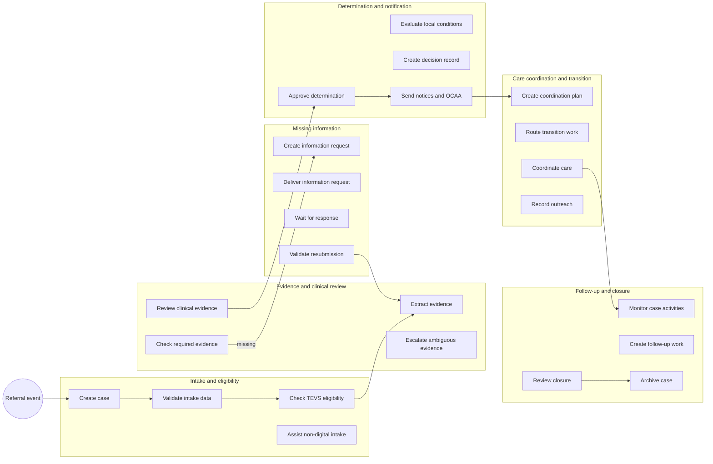

<!-- pdd:doc header="San Aurelio Medicaid Referral Authorization and Care Coordination {{RUN_TOKEN}} | Process Definition Document" footer="Confidential | San Aurelio Medicaid Health Plan" client="San Aurelio Medicaid Health Plan" author="Local Developer" date="29 September 2026" version="1.0" process="San Aurelio Medicaid Referral Authorization and Care Coordination {{RUN_TOKEN}}" -->

# San Aurelio Medicaid Referral Authorization and Care Coordination {{RUN_TOKEN}}
<!-- pdd:section id=business-context sources=as-is/overview.md,as-is/pain-points.md,to-be/overview.md,to-be/benefits.md reproj=g0 -->
# 1. Business Context
## 1.1 Problem Statement
The current referral case spans intake, eligibility, clinical review, determination, notification, coordination, and closure. Manual touches, fragmented San Aurelio checks, and unequal digital access delay member status visibility while OCAA reporting and decision conditions require reliable evidence.
## 1.2 Objectives
- Reduce human involvement in deterministic intake, validation, routing, notification, reporting, monitoring, and archival work.
- Reduce time to decision while retaining human clinical judgment and care coordination.
- Preserve non-digital member support and OCAA reporting for every decision.
## 1.3 Expected Value
The future process improves consistency, traceability, accessibility, and coordination. Quantified targets remain open pending a baseline.
[Refine section](delegate:refine-section?section=business-context)

<!-- pdd:section id=scope sources=as-is/scope.md,entities/applications/ reproj=g0 -->
# 2. Scope
## 2.1 Process Identity
| Process name | Process group | Process identifier | Industry |
|---|---|---|---|
| San Aurelio Medicaid Referral Authorization and Care Coordination | Utilization management and care coordination | SAM-REF-AUTH-CC | Healthcare |
## 2.2 Scope Boundaries
| In Scope | Out of Scope |
|---|---|
| Referral intake through closure | Clinical treatment delivery |
| TEVS secondary eligibility check | Authoritative income-threshold maintenance |
| Decision, notification, OCAA reporting | SA-27 universal routing rule until confirmed |
| Care coordination and admission/discharge follow-up |  |
## 2.3 Systems and Applications
| System | Role in Process | Access Type |
|---|---|---|
| **TEVS** | Secondary Medicare Plus San Aurelio eligibility check | Read |
| **OCAA** | Anonymous decision-report recipient | Write |
[Refine section](delegate:refine-section?section=scope)

<!-- pdd:section id=current-state sources=as-is/overview.md,as-is/diagram.md,as-is/steps/,as-is/metrics.md,as-is/pain-points.md,as-is/stages.md,as-is/stages/,as-is/attachments.md reproj=g0 -->
# 3. Current State
## 3.1 Overview
A long-running referral case moves from intake and eligibility through documentation/clinical review, determination, notification, care coordination, follow-up, and closure. The process owner confirmed the incomplete-documentation rework loop and post-decision lifecycle; named systems, owners, timing, and volumes remain gaps.
## 3.2 Current Flow
| # | Current step |
|---|---|
| 1 | Register referral or admission notification |
| 2 | Verify coverage and conditional TEVS eligibility |
| 3 | Review documentation and clinical evidence |
| 4 | Request missing information and re-review |
| 5 | Determine authorization and local conditions |
| 6 | Notify member/provider and report to OCAA |
| 7 | Coordinate care and transitions |
| 8 | Monitor follow-up |
| 9 | Close and archive the case |
## 3.3 Metrics
| Metric | Current signal | Measurement method |
|---|---|---|
| Human touches | Baseline missing | Case activity/contact-log analysis |
| Time to decision | Baseline missing | Receipt-to-determination timestamps |
| Volume, backlog, FTEs | Missing | Queue and roster reports |
## 3.4 Pain Points
| Where | What breaks | Impact |
|---|---|---|
| Intake and review | High manual involvement and fragmented local checks | Delayed decision visibility |
| Member communication | Some members cannot rely on digital channels | Accessibility risk |
| Decision reporting | OCAA reporting is a required separate control | Compliance risk |

```mermaid diagramFamily=case-design
flowchart LR
  caseStart(("Referral received"))
  subgraph intakeEligibility["Intake and eligibility"]
    registerRequest["Register request"]
    verifyEligibility["Verify eligibility"]
  end
  subgraph documentationClinicalReview["Documentation and clinical review"]
    reviewDocumentation["Review documentation"]
    documentationComplete{"Documentation complete?"}
    requestInformation["Request information"]
  end
  subgraph decisionNotification["Decision and notification"]
    determineAuthorization["Determine authorization"]
    notifyPartiesOcaa["Notify parties and OCAA"]
  end
  subgraph careCoordinationTransition["Care coordination and transition"]
    coordinateTransition["Coordinate care transition"]
  end
  subgraph followUp["Follow-up"]
    monitorFollowUp["Monitor follow-up"]
  end
  subgraph closureArchive["Closure and archive"]
    closeArchiveCase["Close and archive case"]
  end
  caseStart --> registerRequest
  registerRequest --> verifyEligibility
  verifyEligibility --> reviewDocumentation
  reviewDocumentation --> documentationComplete
  documentationComplete -->|complete| determineAuthorization
  documentationComplete -->|incomplete| requestInformation
  requestInformation -. information received .-> reviewDocumentation
  determineAuthorization --> notifyPartiesOcaa
  notifyPartiesOcaa --> coordinateTransition
  coordinateTransition --> monitorFollowUp
  monitorFollowUp --> closeArchiveCase
  class caseStart kind-event
  class registerRequest kind-task,case-task-action
  class verifyEligibility kind-task,case-task-action,system-tevs
  class reviewDocumentation kind-task,case-task-action
  class documentationComplete kind-decision
  class requestInformation kind-task,case-task-action
  class determineAuthorization kind-task,case-task-action
  class notifyPartiesOcaa kind-task,case-task-action
  class coordinateTransition kind-task,case-task-action
  class monitorFollowUp kind-task,case-task-action
  class closeArchiveCase kind-task,case-task-action,case-ends-case
```

[Open AS-IS diagram](delegate:open-diagram?which=as-is&anchor=current-state)
[Refine section](delegate:refine-section?section=current-state)

<!-- pdd:section id=target-state sources=to-be/overview.md,to-be/diagram.md,to-be/case-details.md,to-be/transformation-decisions.md,to-be/stages/,to-be/decisions-and-routes.md,to-be/data-and-evidence.md,to-be/exception-handling.md,to-be/slas.md,to-be/personas.md,to-be/benefits.md reproj=g0 -->
# 4. Future State
## 4.1 Vision
UiPath case management orchestrates deterministic validation, routing, reporting, monitoring, and evidence handling while human reviewers retain clinical judgment, non-digital support, coordination, and closure decisions. The design does not permit automation to independently issue a medical-necessity denial or modification.
## 4.2 Target Flow
| # | Stage | Owner | Required for completion |
|---|---|---|---|
| 1 | Intake and eligibility | Automation / intake staff | Yes |
| 2 | Evidence and clinical review | Automation / clinical reviewer | Yes |
| 3 | Missing information | Automation / intake staff | Conditional |
| 4 | Determination and notification | Clinical decision-maker / automation | Yes |
| 5 | Care coordination and transition | Care coordinator | Yes |
| 6 | Follow-up and closure | Care coordinator / case owner | Yes |
## 4.2.1 Future Work Details
- **Intake and eligibility:** Create the case, validate intake, conditionally check TEVS, and route non-digital intake to staff assistance.
- **Evidence and clinical review:** Extract and check evidence; a clinical reviewer resolves sufficiency and ambiguity.
- **Missing information:** Generate a tracked request, record delivery, monitor the response, and return validated evidence to review.
- **Determination and notification:** Apply San Aurelio conditions, require authorized human determination, create the decision record, and produce member/provider notices plus OCAA reporting.
- **Care coordination and transition:** Create coordination activities, route admission/discharge work, and retain human coordination and outreach.
- **Follow-up and closure:** Monitor open activities, create follow-up work, require human closure review, and archive the audit record.
## 4.3 What Changes
| Area | AS-IS | TO-BE | Why | How |
|---|---|---|---|---|
| Intake | Manual assembly | Event-driven case creation | Reduce touches | Automated validation and routing |
| Evidence | Rework is loosely managed | Tracked missing-information stage | Improve visibility | Timers and return route |
| Decision reporting | Separate burden | OCAA report built into decision | Improve compliance | De-identified report with evidence |
| Follow-up | Limited structure | Managed activities and closure gate | Improve completion | Timers, human review, archive |
## 4.4 Case Work Summary
Automation handles API workflow, connector, agent, and timer work; human actions remain at clinical decision, non-digital support, coordination, and closure.

[Open TO-BE diagram](delegate:open-diagram?which=to-be&anchor=target-state)
[Refine section](delegate:refine-section?section=target-state)

<!-- pdd:section id=business-rules sources=as-is/business-rules.md,to-be/business-rules.md reproj=g0 -->
# 5. Business Rules
| Rule ID | Description |
|---|---|
| BR-001 | Check Medicare Plus San Aurelio eligibility through TEVS when applicable, using the documented age and residency criteria. |
| BR-002 | Apply an in-network provider condition when required. |
| BR-003 | Apply a San Aurelio physical-care location condition when required. |
| BR-004 | Report every positive or negative decision to OCAA using a case number and otherwise anonymous information. |
| BR-005 | Treat hospital admission notification separately from prior authorization. |
| BR-006 | Do not hard-code approximate income ranges without authoritative validation. |
| BR-007 | Do not require SA-27 until its referral-case trigger is confirmed. |
[Refine section](delegate:refine-section?section=business-rules)

<!-- pdd:section id=data-model sources=entities/artifacts/,as-is/data-inputs-outputs.md reproj=g0 -->
# 6. Data Model
## 6.1 Entities
| Entity | Description |
|---|---|
| Referral case | End-to-end business record for request, decision, coordination, and closure. |
| Hospital admission/discharge form | Admission, discharge, diagnosis/procedure, provider, and H&P-related evidence. |
| SA-27 | Fixed-medication-expense certification evidence when applicable. |
| OCAA decision report | Anonymous report with OCAA case number. |
## 6.2 Data Inputs and Outputs
| Artifact | Source / Destination | Format | Consumed / Produced By |
|---|---|---|---|
| Referral request | Member, provider, or hospital / case | Not confirmed | Intake |
| Hospital form | Hospital / case | PDF | Intake and transition |
| SA-27 | Member, physician, pharmacist / case | Form | Trigger not confirmed |
| OCAA report | Case / OCAA | Not confirmed | Determination notification |
## 6.3 Field-Level Data Dictionary
| Field | Type | Valid values / range | Mandatory | Privacy class |
|---|---|---|---|---|
| Member identifier | String | Plan format not confirmed | Yes | PII |
| Date of birth | Date | Date | Conditional | PII |
| TEVS eligibility result | Boolean/text | Eligible, ineligible, exception | Conditional | Sensitive |
| OCAA case number | String | OCAA format not confirmed | Reportable decision | Tokenized |
## 6.4 Data Flow and Lineage
1. Intake data creates the case. 2. Eligibility and evidence enrich it. 3. Human determination updates it. 4. Notifications/OCAA reporting consume the final decision. 5. Coordination, follow-up, and archive complete the record.
## 6.5 Integrations
| Integration | Fields passed | Connector / type | Endpoint + Auth |
|---|---|---|---|
| Case → TEVS | Age/residency and eligibility query | Connector/API proposed | Not confirmed |
| Case → OCAA | Anonymous decision and case number | API/file proposed | Not confirmed |
==TBD: confirm the integration endpoint and authentication at SDD==
[Refine section](delegate:refine-section?section=data-model)

<!-- pdd:section id=people sources=entities/people/ reproj=g0 -->
# 7. People
## 7.1 Roles and Personas
| Stakeholder | Responsibility |
|---|---|
| Member / representative | Supplies referral and evidence; receives accessible communication. |
| Provider / hospital | Submits request, admission/discharge evidence, and additional information. |
| Intake staff | Supports non-digital intake and delivery exceptions. |
| UM Clinical Reviewer | Performs clinical sufficiency review and ambiguity escalation. |
| Authorized clinical decision-maker | Makes/approves the final clinical determination. |
| Care coordinator / case owner | Coordinates care, follow-up, and closure review. |
| TEVS | Secondary eligibility source. |
| OCAA | Recipient of anonymous decision reporting. |
| Automation services | Perform deterministic validation, routing, reporting, monitoring, and archival. |
[Refine section](delegate:refine-section?section=people)

<!-- pdd:section id=raci sources=entities/people/ reproj=g0 -->
# 7.2 RACI
> [!WARNING]
> **Needs capture:** Confirm accountable business teams and named owner roles for each stage. This section will auto-fill when the wiki source is available.
[Refine section](delegate:refine-section?section=raci)

<!-- pdd:section id=exceptions sources=as-is/exception-handling.md,to-be/exception-handling.md reproj=g0 -->
# 8. Exceptions and Error Handling
## 8.1 Known Exceptions
| Exception | Trigger | AS-IS Handling | TO-BE Handling |
|---|---|---|---|
| Incomplete documentation | Missing evidence | Request and re-review | Tracked missing-information stage, timer, return to review |
| Secondary coverage | Other insurance / applicability | TEVS check | Conditional connector/API check with exception review |
| San Aurelio constraint | Network/location rule | Apply condition | Rule-guided proposal with human decision authority |
| Non-digital member | Digital channel unsuitable | Not documented | Staff-assisted intake/communication activity |
## 8.2 Exception Data State Transitions
| Exception | Affected record | State on entry | State on resolution | State on terminal failure |
|---|---|---|---|---|
| Missing evidence | Referral case | Pending information | Evidence review | Policy outcome not confirmed |
| Integration failure | Referral case | Exception review | Resume stage | Downtime policy not confirmed |
## 8.3 HITL Specifications
| Escalation point | Trigger | Fields surfaced | Available actions → resulting state | Assignee role |
|---|---|---|---|---|
| Clinical review | Ambiguity / clinical judgment | Case evidence and proposed conditions | Approve, modify, request information → determined/pending | Clinical reviewer |
| Closure review | Coordination complete | Case activity and evidence checklist | Close, return to follow-up → archived/active | Care coordinator |
[Refine section](delegate:refine-section?section=exceptions)

<!-- pdd:section id=compliance sources=as-is/compliance.md,to-be/business-rules.md reproj=g0 -->
# 9. Compliance and Regulatory
## 9.1 Compliance Traceability Matrix
| Requirement / Rule | Enforced at | Evidence retained |
|---|---|---|
| BR-001 TEVS eligibility | Intake and eligibility | Query result and exception disposition |
| BR-002 / BR-003 local conditions | Determination | Decision rationale and conditions |
| BR-004 OCAA reporting | Determination notification | OCAA case number and delivery evidence |
| BR-005 admission-notification distinction | Intake | Case classification |
| BR-007 SA-27 uncertainty | Evidence review | Trigger decision when policy exists |
## 9.2 Audit and Traceability
The case retains intake, validation, review, decision, notification, OCAA, coordination, follow-up, and closure evidence. Retention duration and audit-lock policy remain open.
[Refine section](delegate:refine-section?section=compliance)

<!-- pdd:section id=kpis sources=to-be/benefits.md reproj=g0 -->
# 10. KPIs and Acceptance Criteria
> [!WARNING]
> **Needs capture:** Confirm numeric baselines, targets, and policy timelines. This section will auto-fill when the wiki source is available.
## 10.1 KPIs
- SLA compliance rate, first-pass documentation completeness, AIR aging, determination-to-notification turnaround, OCAA reporting completeness, automation exception rate, and archive completeness will be measured once plan targets are confirmed.
## 10.2 Acceptance Criteria
- Every reportable decision produces a OCAA evidence record.
- A case requiring clinical judgment cannot progress to final determination without a human action.
- A non-digital communication path remains available.
- Closure is blocked or routed for review when required evidence is missing.
[Refine section](delegate:refine-section?section=kpis)

<!-- pdd:section id=assumptions-risks sources=queries/,as-is/scope.md reproj=g0 -->
# 11. Assumptions, Constraints, Dependencies and Risks
## 11.1 Assumptions
| Assumption | Detail |
|---|---|
| TEVS access | A supported connection can perform the required check. |
| Evidence automation | Evidence can be classified with human exception review. |
| Human decision authority | Authorized clinicians retain final determination authority. |
## 11.2 Constraints
| Constraint | Detail |
|---|---|
| Member access | Digital-only communications are not acceptable. |
| San Aurelio controls | Local conditions and OCAA reporting are mandatory. |
## 11.3 Dependencies
| Dependency | Type | Detail |
|---|---|---|
| TEVS connection | Hard | Eligibility result required when applicable. |
| OCAA reporting channel | Hard | Required for all positive/negative decisions. |
| Policy definitions | Hard | SA-27 trigger, closure, SLA, retention, and appeals. |
## 11.4 Risks
| Risk | Mitigation |
|---|---|
| Unconfirmed thresholds/system interfaces | Keep configurable; do not hard-code. |
| Automation overreach into clinical judgment | Require human review actions. |
| Incomplete post-discharge design | Validate activities/ownership before build. |
[Refine section](delegate:refine-section?section=assumptions-risks)

<!-- pdd:section id=glossary sources=entities/ reproj=g0 -->
# 12. Glossary
| Term | Definition |
|---|---|
| OCAA | San Aurelio consumer-affairs agency receiving anonymous decision reporting. |
| SA-27 | San Aurelio Medicaid fixed-medication-expense certification form. |
| TEVS | Named local-government system used for the stated secondary eligibility check. |
| Prior authorization | Payer review before specified services. |
| UM | Utilization management review of clinical appropriateness. |
| AIR | Additional Information Request for missing or clarifying documentation. |
[Refine section](delegate:refine-section?section=glossary)

<!-- pdd:section id=next-steps sources=queries/open-questions.md reproj=g0 -->
# 13. Next Steps
| # | Action item |
|---|---|
| 1 | Confirm SA-27 referral-case trigger and authoritative income thresholds. |
| 2 | Identify named case, care-management, claims, document, notification, and audit systems. |
| 3 | Confirm owners, SLA clocks, escalation paths, volumes, and current baselines. |
| 4 | Confirm post-discharge activities, closure/reopen/retention rules, and appeal handling. |
| 5 | Validate TEVS and OCAA interface, authentication, and data-sharing controls. |
[Refine section](delegate:refine-section?section=next-steps)

<!-- pdd:section id=appendix-a sources=derived reproj=g0 -->
# Appendix A: Process Map and Diagrams
The approved current and proposed future case maps are embedded in Sections 3 and 4. An integration sequence diagram remains to be produced after TEVS, OCAA, and core-system interfaces are confirmed.
<!-- doc:placeholder kind="integration-diagram" -->
> [!NOTE]
> **Integration Diagram Placeholder**
> Insert integration sequence showing case intake, TEVS eligibility check, decision notification, OCAA reporting, and audit archive.
[Refine section](delegate:refine-section?section=appendix-a)
