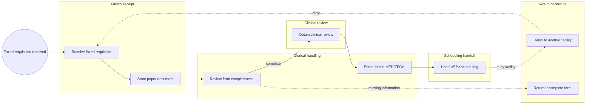

<!-- pdd:doc header="Medical Image Requisition Intake and Case Management {{RUN_TOKEN}} | Process Definition Document" footer="Confidential | Silverpine Health" client="Silverpine Health" author="Business Analysis Team" date="29 September 2026" version="1.0" process="Medical Image Requisition Intake and Case Management {{RUN_TOKEN}}" -->

# Medical Image Requisition Intake and Case Management {{RUN_TOKEN}}
<!-- pdd:section id=business-context sources=as-is/overview.md,as-is/pain-points.md,to-be/overview.md,to-be/benefits.md reproj=g0 -->
# 1. Business Context

## 1.1 Problem Statement
Silverpine Health manages approximately 227,000 medical imaging requisitions annually through a predominantly fax- and paper-based workflow. Clerks manually review and physically route documents before re-entering information into **MEDITECH**, creating avoidable delay, duplicate work, data-entry risk, fragmented cross-site visibility, and a risk of lost or delayed requisitions.

## 1.2 Objectives
- Reduce average time from requisition submission to clinical review by 50% within six months of go-live.
- Reduce average time from requisition submission to scheduled appointment by 30–40% within six months of go-live.
- Reduce lost or missed requisitions to below 0.1% through digital tracking and audit logs.
- Track 100% of requisitions with SLA clocks and escalation alerts for priorities P1–P5 at go-live.
- Support at least 250,000 annual requisitions with 10% yearly growth.

## 1.3 Expected Value
The proposed case-management process replaces paper queues and facility silos with a traceable requisition record, structured work queues, auditable actions, and shared operational visibility. It preserves clinical judgement and existing scheduling practices in the initial release; the measurable targets are defined in Section 10.

[Refine section](delegate:refine-section?section=business-context)

<!-- pdd:section id=scope sources=as-is/scope.md,entities/applications/ reproj=g0 -->
# 2. Scope

## 2.1 Process Identity
| Process name | Process group | Process identifier | Industry |
|---|---|---|---|
| Medical Image Requisition Intake and Case Management | Medical Imaging Operations | To be assigned | Public healthcare |

## 2.2 Scope Boundaries
| In Scope | Out of Scope |
|---|---|
| Fax requisition receipt and structured extraction | Direct appointment scheduling from the case application |
| Clerk acceptance, data correction, and clinical routing | Practitioner submission through the application |
| Technologist and radiologist review work queues | Replacing MEDITECH as scheduling system of record |
| Manual MEDITECH handoff and appointment-status synchronization | |
| Facility recommendations and authority-wide pipeline visibility | |

## 2.3 Systems and Applications
| System | Role in Process | Access Type |
|---|---|---|
| Fax platform | Receives inbound requisitions; vendor and interface are not confirmed. | Both |
| **MEDITECH** | Receives manually entered scheduling data and provides appointment status for tracking. | Both |
| Change Healthcare PACS | Supplies prior-imaging information for review; retrieval method is not confirmed. | Read |
| UiPath case application | Holds case data, queues, comments, audit history, routing, and work actions. | Both |
| Location-search capability | Supports facility recommendations from patient address. | Read |

[Refine section](delegate:refine-section?section=scope)

<!-- pdd:section id=current-state sources=as-is/overview.md,as-is/diagram.md,as-is/metrics.md,as-is/pain-points.md reproj=g0 -->
# 3. Current State

## 3.1 Overview
Most requisitions are received by fax at individual facilities, reviewed manually, stored and passed as paper, and ultimately re-keyed into **MEDITECH**. The process lacks a single, authority-wide queue and relies on re-faxing when facility capacity requires rerouting.

## 3.2 Current Flow
| # | Current step |
|---|---|
| 1 | A referring physician sends a faxed medical imaging requisition to a facility. |
| 2 | A clerk receives and stores the paper document. |
| 3 | The clerk checks completeness and clarity. |
| 4 | Incomplete forms are returned; busy-site work may be re-faxed elsewhere. |
| 5 | Documents are physically routed for clinical review. |
| 6 | A clerk manually enters the requisition into MEDITECH for scheduling handoff. |

## 3.3 Metrics
| Metric | Current signal | Measurement method |
|---|---|---|
| Annual requisition volume | Approximately 227,000 annually. | Project readiness sign-off |
| X-ray volume | 77,000 annually. | Dashboard reference |
| CT and MRI volume | 150,000 annually. | Dashboard reference |
| Growth | 10% yearly growth. | Project readiness sign-off |
| Turnaround and loss baselines | Not confirmed. | Required pre-go-live measurement |

## 3.4 Pain Points
| Where | What breaks | Impact |
|---|---|---|
| Fax intake | Paper forms require manual completeness review. | Delay and handling effort |
| Facility handling | Binders and physical handoffs are used. | Poor visibility and loss/delay risk |
| Cross-site routing | Re-faxing is needed when facilities are busy. | Rework and siloed capacity decisions |
| MEDITECH handoff | Clerks re-enter data manually. | Duplicate work and data-entry risk |

[Open AS-IS diagram](delegate:open-diagram?which=as-is&anchor=current-state)
[Refine section](delegate:refine-section?section=current-state)

<!-- pdd:section id=target-state sources=to-be/overview.md,to-be/diagram.md,to-be/case-details.md,to-be/stages/,to-be/decisions-and-routes.md,to-be/data-and-evidence.md,to-be/exception-handling.md,to-be/slas.md,to-be/personas.md,to-be/benefits.md reproj=g0 -->
# 4. Future State

## 4.1 Vision
Each faxed requisition becomes a digitally tracked case with structured extraction, role- and facility-scoped queues, human verification at clinical decision points, an auditable transition history, and MEDITECH appointment-status reconciliation. **UiPath Document Understanding** supports extraction, the case application orchestrates work and evidence, and clinical and clerical staff remain accountable for review and MEDITECH handoff decisions.

```mermaid diagramFamily=case-design
flowchart LR
  caseStart(("Fax requisition received"))
  subgraph intake["Intake and Extraction"]
    extractData["Extract requisition data"]
    createCase["Create requisition case"]
  end
  subgraph acceptance["New Requisition Acceptance"]
    validateData["Validate extracted data"]
    acceptCase["Accept or decline requisition"]
  end
  subgraph clerkReview["Clerk Review"]
    routeReview["Route clinical review"]
  end
  subgraph technologistReview["Technologist Review"]
    technicalReview["Complete technical review"]
  end
  subgraph radiologistReview["Radiologist Review"]
    specialistReview["Complete radiologist review"]
  end
  subgraph readyScheduling["Ready for Scheduling"]
    enterMeditech["Enter requisition in MEDITECH"]
  end
  subgraph meditechTracking["MEDITECH Tracking"]
    syncStatus["Synchronize appointment status"]
  end
  subgraph returnProvider["Return to Provider"]
    returnFax["Send return communication"]
  end
  subgraph discontinued["Discontinued"]
    closeDiscontinued["Retain declined case audit"]
  end
  caseStart --> extractData
  extractData --> createCase
  createCase --> validateData
  validateData --> acceptCase
  acceptCase -->|accepted| routeReview
  acceptCase -. declined .-> closeDiscontinued
  routeReview -->|technical review| technicalReview
  routeReview -->|radiologist review| specialistReview
  routeReview -->|no further review| enterMeditech
  technicalReview -->|radiologist review| specialistReview
  technicalReview -->|ready| enterMeditech
  specialistReview --> enterMeditech
  enterMeditech --> syncStatus
  syncStatus -. three no shows .-> returnFax
  class caseStart kind-event
  class extractData kind-task,case-task-agent,owner-system
  class createCase kind-task,case-task-process,owner-system,system-case-application
  class validateData kind-task,case-task-action,owner-clerk,system-case-application
  class acceptCase kind-decision,owner-clerk
  class routeReview kind-decision,owner-clerk
  class technicalReview kind-task,case-task-action,owner-technologist,system-case-application
  class specialistReview kind-task,case-task-action,owner-radiologist,system-case-application
  class enterMeditech kind-task,case-task-action,owner-clerk,system-meditech
  class syncStatus kind-task,case-task-process,owner-system,system-meditech
  class returnFax kind-task,case-task-process,owner-system,case-ends-case
  class closeDiscontinued kind-task,case-task-process,owner-system,case-ends-case
```

[Open TO-BE diagram](delegate:open-diagram?which=to-be&anchor=target-state)

## 4.2 Target Flow
| # | Stage | Owner | Required for completion |
|---|---|---|---|
| 1 | Intake and Extraction | System with Clerk exception review | Yes |
| 2 | New Requisition Acceptance | Clerk | Yes |
| 3 | Clerk Review | Clerk | Yes |
| 4 | Technologist Review | Technologist | Conditional |
| 5 | Radiologist Review | Radiologist | Conditional |
| 6 | Ready for Scheduling | Clerk | Yes |
| 7 | MEDITECH Tracking | System; Clerk for exceptions | Yes |
| 8 | Return to Provider | Clerk | Conditional |
| 9 | Discontinued | Clerk | Conditional |

## 4.2.1 Future Work Details
### Intake and Extraction
> Receive the source document, extract configured fields, and create a traceable case.

| Case activity | Type | Owner | Output |
|---|---|---|---|
| Receive fax requisition | Process | System | Source document |
| Extract requisition fields | Agent | System | Structured data |
| Create requisition case | Process | System | New case |

### New Requisition Acceptance
> A Clerk validates the extracted data and determines whether the requisition proceeds or is discontinued.

| Case activity | Type | Owner | Output |
|---|---|---|---|
| Compare extracted values to source | Action | Clerk | Validated data |
| Correct mismatched fields | Action | Clerk | Audited correction |
| Accept or decline requisition | Action | Clerk | Route decision |

### Clinical Review and Scheduling Handoff
> Clerks, Technologists, and Radiologists route and complete the required clinical review before a Clerk enters the requisition in MEDITECH.

| Case activity | Type | Owner | Output |
|---|---|---|---|
| Route clinical review | Action | Clerk | Selected review path |
| Complete technical review | Action | Technologist | Technical assessment and protocol direction |
| Complete radiologist review | Action | Radiologist | Specialist direction |
| Enter requisition in MEDITECH | Action | Clerk | MEDITECH record and identifier |

### MEDITECH Tracking and Exceptions
> The case reconciles appointment status and routes eligible exceptions to a Clerk.

| Case activity | Type | Owner | Output |
|---|---|---|---|
| Synchronize appointment status | Process | System | Pending, Booked, Completed, or No Show status |
| Send return communication | Process with Clerk decision | Clerk and System | Provider return notice |
| Retain discontinued case audit | Process | System | Closed auditable record |

## 4.3 What Changes
| Area | AS-IS | TO-BE | Why | How |
|---|---|---|---|---|
| Intake | Faxed paper is manually handled. | Fax is retained as source evidence and extracted into a case. | Reduce handling and improve traceability. | Structured extraction and case creation. |
| Work visibility | Facility binders and physical handoffs. | Role-based work queues and authority-wide central visibility. | Eliminate silos. | Stage management and access controls. |
| Clinical routing | Informal physical routing. | Explicit clerk, technologist, and radiologist routes. | Improve accountability and visibility. | Case transitions, comments, and audit events. |
| Scheduling handoff | Manual re-entry into MEDITECH. | Manual entry remains, with linked identifier and synchronization. | Preserve v1 scope while establishing tracking. | Clerk action and MEDITECH reconciliation. |

## 4.4 Case Work Summary
The future state includes human review actions for clerical and clinical judgement, system processes for case creation and status reconciliation, and document-extraction/AI support for inbound data. Direct scheduling automation, integration interface details, extraction thresholds, and escalation logic remain open decisions.

[Refine section](delegate:refine-section?section=target-state)

<!-- pdd:section id=business-rules sources=as-is/business-rules.md,to-be/business-rules.md reproj=g0 -->
# 5. Business Rules

| Rule ID | Description |
|---|---|
| BR-001 | A Clerk reviews extracted values against the source requisition before accepting it; corrections are retained in the audit history. |
| BR-002 | A potential duplicate may be declined with a documented reason. |
| BR-003 | A case requiring technical or radiologist review must complete the required review before scheduling handoff. |
| BR-004 | A MEDITECH identifier must be recorded before appointment-status synchronization begins. |
| BR-005 | After three no-show events, the case may route to Return to Provider for Clerk evaluation. |

[Refine section](delegate:refine-section?section=business-rules)

<!-- pdd:section id=data-model sources=entities/artifacts/,as-is/data-inputs-outputs.md reproj=g0 -->
# 6. Data Model

## 6.1 Entities
| Entity | Description |
|---|---|
| Medical imaging requisition case | Traceable operational record for one requisition lifecycle. |
| Source requisition | Original faxed requisition and supporting pages. |
| Patient identifier bundle | Patient demographics and identifiers needed for review and handoff. |
| Clinical review/protocol | Clerical, technical, and radiologist directions and comments. |
| MEDITECH linkage | Identifier and synchronized appointment status. |
| Audit event | Timestamped user or system action, route decision, and reason. |

## 6.2 Data Inputs and Outputs
| Artifact | Source / Destination | Format | Consumed / Produced By |
|---|---|---|---|
| Medical imaging requisition | Referring Physician to case application | Faxed form/image | Intake and Extraction |
| Extracted requisition data | Case application | Structured fields | Clerk Acceptance |
| Prior imaging context | PACS to case application | Not confirmed | Clerk and clinical review |
| MEDITECH identifier/status | MEDITECH to case application | Not confirmed | Scheduling handoff and tracking |

## 6.3 Field-Level Data Dictionary
| Field | Type | Format / Pattern | Valid values / range | Mandatory | Privacy class |
|---|---|---|---|---|---|
| Patient identifiers | Text | Per Silverpine Health standard | PHN, MRN, demographics | Yes | PHI |
| Priority | Code | P1–P5 | P1, P2, P3, P4, P5 | Yes when specified | PHI |
| Requested exam/modality | Text/code | Requisition-defined | X-ray, CT, MRI, ultrasound, other | Yes | PHI |
| Clinical history | Free text | Requisition-defined | Not confirmed | Required on form | PHI |
| MEDITECH identifier | Text | Not confirmed | Not confirmed | Required for tracking | PHI |

## 6.4 Data Flow and Lineage
| # | Data movement |
|---|---|
| 1 | Faxed requisition is received and retained as case evidence. |
| 2 | Configured fields are extracted into the case for Clerk verification. |
| 3 | Verified data and clinical direction support MEDITECH entry. |
| 4 | MEDITECH identifier links the case to downstream appointment status. |
| 5 | Status, comments, decisions, and audit events remain attached to the case. |

## 6.5 Integrations
| Integration | Fields passed | Connector / type | Endpoint + Auth |
|---|---|---|---|
| Fax platform → case application | Source document, receive time | Not confirmed | Not confirmed |
| Case application → MEDITECH | Requisition data, identifier | Manual entry in v1; synchronization proposed | Not confirmed |
| PACS → case application | Previous imaging context | Not confirmed | Not confirmed |

==TBD: confirm integration endpoints, authentication, error handling, and reconciliation controls at solution design==

[Refine section](delegate:refine-section?section=data-model)

<!-- pdd:section id=people sources=entities/people/ reproj=g0 -->
# 7. People

## 7.1 Roles and Personas
| Stakeholder | Responsibility |
|---|---|
| Central Clerk | Oversees authority-wide queue volume and may forward requisitions between facilities. |
| Clerk | Validates data, corrects fields, accepts/declines, routes clinical review, enters MEDITECH details, and handles return decisions. |
| Technologist | Performs technical review and adds protocol direction. |
| Radiologist | Performs specialist review and final protocol direction where needed. |
| Referring Physician | Sends requisitions and receives returned/declined communications. |
| Department Manager | Views departmental requisition and pipeline status. |
| System | Executes extraction, case creation, audit logging, and status synchronization. |

[Refine section](delegate:refine-section?section=people)

<!-- pdd:section id=raci sources=entities/people/ reproj=g0 -->
# 7.2 RACI

> [!WARNING]
> **Needs capture:** A validated per-stage RACI, including accountable operational owner and consulted/informed parties, must be confirmed. This section will auto-fill when the wiki source is available.

| Activity/Stage | Responsible | Accountable | Consulted | Informed |
|---|---|---|---|---|
| Intake and Extraction | System / Clerk exception review | Not confirmed | IT and Medical Imaging | Department Manager |
| Acceptance and Clerk Review | Clerk | Not confirmed | Technologist/Radiologist as needed | Central Clerk |
| Clinical Review | Technologist or Radiologist | Not confirmed | Clerk | Referring Physician as needed |
| MEDITECH Handoff | Clerk | Not confirmed | Scheduling operations | Department Manager |

[Refine section](delegate:refine-section?section=raci)

<!-- pdd:section id=exceptions sources=as-is/exception-handling.md,to-be/exception-handling.md reproj=g0 -->
# 8. Exceptions and Error Handling

## 8.1 Known Exceptions
| Exception | Trigger | AS-IS Handling | TO-BE Handling |
|---|---|---|---|
| Incomplete or illegible form | Required information is unusable. | Returned manually. | Route to Return to Provider with a structured reason. |
| Potential duplicate | Matching requisition is identified. | Not consistently tracked. | Clerk decline with reason and audit record. |
| Additional clinical review | Clerk or Technologist identifies need. | Paper handoff. | Explicit route to Technologist or Radiologist Review. |
| No show | Appointment status indicates no show. | Not confirmed. | After three no shows, route to Return to Provider for Clerk review. |
| Integration outage | MEDITECH, PACS, or fax workflow unavailable. | Not confirmed. | Continuity and reconciliation process to be designed. |

## 8.2 Exception Data State Transitions
| Exception | Affected record | State on entry | State on resolution | State on terminal failure |
|---|---|---|---|---|
| Duplicate | Requisition case | Pending Acceptance | Accepted if not duplicate | Discontinued |
| Incomplete form | Requisition case | Acceptance/Review hold | Returned corrected form resumes review | Return to Provider |
| No show | Requisition case | MEDITECH Tracking | Continued tracking | Return to Provider |
| Integration outage | Requisition case | Exception hold | Reconciled to appropriate stage | Not confirmed |

## 8.3 HITL and Action Form Specifications
| Escalation point | Trigger | Fields surfaced | Available actions → resulting state | Task SLA | Assignee role |
|---|---|---|---|---|---|
| Acceptance review | Extracted data requires verification. | Source form, extracted values, facility options. | Correct/Accept → Clerk Review; Decline → Discontinued. | Not confirmed | Clerk |
| Clinical routing | Review requirement is identified. | Requisition, history, comments. | Route to Technologist/Radiologist/Ready for Scheduling. | Not confirmed | Clerk |
| Return decision | Incomplete form or eligible no-show return. | Reason, history, provider details. | Return → Return to Provider; resume tracking where appropriate. | Not confirmed | Clerk |

[Refine section](delegate:refine-section?section=exceptions)

<!-- pdd:section id=compliance sources=as-is/compliance.md,to-be/business-rules.md reproj=g0 -->
# 9. Compliance and Regulatory

> [!WARNING]
> **Needs capture:** Authoritative Silverpine Health privacy, retention, access-control, clinical-policy, and audit-evidence requirements must be confirmed. This section will auto-fill when the wiki source is available.

## 9.1 Compliance Traceability Matrix
| Requirement / Rule | Enforced at | Evidence retained |
|---|---|---|
| BR-001 Source validation | New Requisition Acceptance | Correction and acceptance audit events |
| BR-002 Duplicate decision | New Requisition Acceptance | Decline reason and actor/timestamp |
| BR-003 Clinical review route | Clerk/Technologist/Radiologist Review | Route history, comments, and protocol direction |
| BR-004 MEDITECH linkage | Ready for Scheduling | MEDITECH identifier and handoff timestamp |
| BR-005 No-show return | MEDITECH Tracking | Status history and return decision |

## 9.2 Audit and Traceability
The future process must retain source documents, extracted and corrected values, stage transitions, user or system actor, timestamps, comments, reasons, MEDITECH linkage, and appointment-status updates. Retention duration, authoritative system of record, and privacy controls require Silverpine Health confirmation.

[Refine section](delegate:refine-section?section=compliance)

<!-- pdd:section id=kpis sources=to-be/benefits.md reproj=g0 -->
# 10. KPIs and Acceptance Criteria

## 10.1 KPIs
| KPI | Target / acceptance signal |
|---|---|
| Submission to clinical review | 50% reduction in average turnaround time within six months of go-live. |
| Submission to scheduled appointment | 30–40% reduction within six months of go-live. |
| Lost or untracked requisitions | Below 0.1% within three months of go-live. |
| Priority tracking | 100% tracked with SLA clock and escalation alerts at go-live. |
| P1/P2 scheduling compliance | At least 95% within defined priority thresholds within six months of go-live. |
| Scalability | At least 250,000 annual requisitions with 10% yearly growth without performance degradation. |

## 10.2 Acceptance Criteria
- The solution records a traceable case for every processed inbound requisition.
- Clerks can view the source requisition and correct extracted data before acceptance.
- Accepted cases can be routed to the required clinical-review role.
- Clerks can record a MEDITECH identifier and the case can reflect synchronized downstream status.
- All decline, correction, routing, and return actions produce an audit record.

[Refine section](delegate:refine-section?section=kpis)

<!-- pdd:section id=assumptions-risks sources=queries/,as-is/scope.md reproj=g0 -->
# 11. Assumptions, Constraints, Dependencies and Risks

## 11.1 Assumptions
| Assumption | Detail |
|---|---|
| MEDITECH remains scheduling system of record | The v1 case application does not perform direct appointment scheduling. |
| Clinical judgement remains human-led | Clerks, Technologists, and Radiologists retain review and route decisions. |
| Fax remains a v1 intake channel | The solution begins with inbound fax receipt and extraction. |

## 11.2 Constraints
| Constraint | Detail |
|---|---|
| Scope | Direct web-app scheduling and practitioner self-submission are excluded from v1. |
| Privacy and security | PHI/PII controls are required; authoritative requirements are not confirmed. |
| Capacity | The solution must support 250,000 annual requisitions with 10% yearly growth. |

==TBD: confirm privacy classification, retention requirements, access model, and approved hosting/integration constraints==

## 11.3 Dependencies
| Dependency | Type | Detail |
|---|---|---|
| Fax platform | Hard | Vendor, document-delivery pattern, and exception behavior are not confirmed. |
| MEDITECH access | Hard | Requires agreed data-entry, polling/synchronization, test access, and reconciliation approach. |
| PACS access | Soft | Previous-imaging context is proposed; retrieval interface and permitted data are not confirmed. |
| Representative samples and labelled dataset | Hard | Required to establish extraction quality and regression testing. |
| Medical Imaging SMEs | Hard | Required to define rules, SLA thresholds, exception routes, and acceptance criteria. |

## 11.4 Risks
| Risk | Mitigation |
|---|---|
| Extraction is inaccurate for production document variation. | Obtain representative samples, define labels, measure accuracy, and retain human verification. |
| Integration constraints delay delivery. | Validate interfaces, credentials, ownership, and continuity procedures early. |
| Unconfirmed SLAs make escalation design unreliable. | Capture priority thresholds, at-risk points, owners, and required response before build. |
| Privacy/control expectations are incomplete. | Obtain authoritative Silverpine Health policy and security review before production deployment. |

[Refine section](delegate:refine-section?section=assumptions-risks)

<!-- pdd:section id=glossary sources=entities/ reproj=g0 -->
# 12. Glossary

| Term | Definition |
|---|---|
| Case | One traceable operational record representing a medical imaging requisition through its lifecycle. |
| Clerk | Facility-scoped user who validates, routes, and hands off requisitions. |
| MEDITECH | Current scheduling-system context for manual requisition entry and downstream status tracking. |
| PACS | Picture archiving and communication system used for imaging context. |
| PHI | Personal health information. |
| Priority P1–P5 | Requisition priority values shown in the supplied form and future tracking requirement. |
| Return to Provider | Exception outcome in which a requisition is returned to the referring provider with a reason. |
| SLA clock | Time measurement used to monitor prioritised work and escalation. |

[Refine section](delegate:refine-section?section=glossary)

<!-- pdd:section id=next-steps sources=queries/open-questions.md reproj=g0 -->
# 13. Next Steps

| # | Action item |
|---|---|
| 1 | Confirm fax-platform vendor, routing, failure handling, and source-document retention approach. |
| 2 | Confirm MEDITECH and PACS integration capabilities, ownership, authentication, and reconciliation controls. |
| 3 | Define P1–P5 thresholds, stage SLA targets, at-risk alerts, escalation owners, and response routes. |
| 4 | Confirm privacy classification, retention, role-based access, audit evidence, and security requirements. |
| 5 | Obtain representative requisition samples and establish a labelled ground-truth dataset for extraction evaluation. |
| 6 | Validate detailed RACI and operational ownership for each lifecycle stage. |
| 7 | Baseline current turnaround, backlog, rework, and lost/untracked requisition rates before go-live. |

[Refine section](delegate:refine-section?section=next-steps)

<!-- pdd:section id=appendix-a sources=to-be/diagram.md reproj=g0 -->
# Appendix A: Process Map and Diagrams

The current-state and future-state maps are embedded in Sections 3 and 4. The future map is the business process model for the confirmed case lifecycle. An integration sequence diagram should be produced during solution design after fax, MEDITECH, PACS, security, and error-handling interfaces are confirmed.

<!-- doc:placeholder kind="integration-diagram" -->
> [!NOTE]
> **Integration Diagram Placeholder**
> Insert a sequence diagram showing fax intake, extraction, case creation, PACS retrieval, MEDITECH handoff/status synchronization, audit logging, retry handling, and continuity processing.

[Refine section](delegate:refine-section?section=appendix-a)
