<!-- pdd:doc header="Nordvik Retail Digital Account Onboarding {{RUN_TOKEN}} | Process Definition Document" footer="Confidential | Nordvik Capital Bank" client="Nordvik Capital Bank" author="Business Analysis Team" date="29 September 2026" version="1.0" process="Nordvik Retail Digital Account Onboarding {{RUN_TOKEN}}" -->

# Nordvik Retail Digital Account Onboarding {{RUN_TOKEN}}

<!-- pdd:section id=business-context sources=as-is/overview.md,as-is/pain-points.md,to-be/overview.md,to-be/benefits.md reproj=g0 -->
# 1. Business Context

## 1.1 Problem Statement
Nordvik Capital Bank's retail digital account-opening process has a predictable sequence but still relies on manual handoffs, especially when screening alerts require review. The supplied process material estimates that 30% of applications retain manual steps, while unactioned KYC has been identified as a regulatory SLA risk. **Microsoft Dynamics CRM**, **Signicat**, **Trapets**, **BilagCloud**, **Scrive**, **Temenos T24**, and **ServiceNow** participate in the process.

## 1.2 Objectives
- Orchestrate the retail digital onboarding journey from application submission to documented terminal outcome.
- Preserve the 48-hour KYC escalation control through an assigned compliance task and immutable audit event.
- Enforce the overdraft-only eligibility gate before any **Experian NO** credit request.
- Replace manual signature chasing and routine handoffs with event-driven progression.
- Retain authorized human decisions for compliance, sanctions, and fraud dispositions.

## 1.3 Expected Value
The target design improves operational visibility, regulatory evidence, customer responsiveness, and recoverability of exception work. It removes avoidable manual coordination while retaining human judgment where policy requires it; KPI thresholds and validation measures are defined in Section 10.

[Refine section](delegate:refine-section?section=business-context)

<!-- pdd:section id=scope sources=as-is/scope.md,entities/applications/ reproj=g0 -->
# 2. Scope

## 2.1 Process Identity

| Process attribute | Value |
|---|---|
| Process name | Nordvik Retail Digital Account Onboarding |
| Process group | Retail Banking Operations |
| Process identifier | NCB-RETAIL-ONBOARDING |
| Industry | Norwegian retail banking |

## 2.2 Scope Boundaries

| In Scope | Out of Scope |
|---|---|
| Digital onboarding for Norwegian retail current accounts | Wealth-management onboarding |
| Current-account onboarding with an overdraft facility | Private-banking onboarding |
| Application submission through activated account or documented terminal outcome | Business account opening and corporate KYC |
| KYC, sanctions, fraud, conditional credit, signature, provisioning, and post-opening completion | Periodic KYC refresh |
| Required audit, privacy, escalation, retry, and notification controls | Address or identity maintenance after onboarding |

## 2.3 Systems and Applications

| System | Role in Process | Access Type |
|---|---|---|
| **Microsoft Dynamics CRM** | Application record, status and customer updates | Both |
| **Signicat** | Document OCR and validation | Both |
| **Trapets** | KYC, sanctions/PEP screening, monitoring profile | Both |
| **BilagCloud** | Fraud and device-risk outcome | Both |
| **Experian NO** | Conditional overdraft credit check | Both |
| **Scrive** | E-signature package and completion event | Both |
| **Temenos Document Generation** | Terms and disclosure generation | Write |
| **Temenos T24** | Core account provisioning | Write |
| **ServiceNow** | Provisioning-failure incident | Write |

[Refine section](delegate:refine-section?section=scope)

<!-- pdd:section id=current-state sources=as-is/overview.md,as-is/diagram.md,as-is/pain-points.md reproj=g0 -->
# 3. Current State

## 3.1 Overview
The current process is a structured digital workflow that starts when a customer submits an application and ends in activation, rejection, abandonment, or suspension. It combines automated platform calls with human review of selected risk outcomes, and its primary weakness is delay at manual handoffs and review queues.

## 3.2 Current Flow

| # | Current step |
|---|---|
| 1 | Customer submits application and supporting identity information through the online portal; Dynamics CRM creates or updates the record. |
| 2 | Signicat validates identity documents and compares extracted data to the application. |
| 3 | Trapets KYC, Trapets sanctions/PEP, and BilagCloud fraud checks run in parallel. |
| 4 | Experian NO credit checking runs only for an overdraft request. |
| 5 | Potential sanctions matches, high fraud outcomes, and Medium-risk cases receive human review. |
| 6 | The rules engine routes Low risk to approval, Medium risk to Compliance, and High risk to rejection. |
| 7 | Temenos generates disclosures; Scrive collects e-signature for up to seven calendar days. |
| 8 | Temenos T24 provisions the account, using up to three retries at 30-second intervals. |
| 9 | Trapets monitoring, CRM updates, and welcome communications run after successful provisioning. |

## 3.3 Metrics

| Metric | Current signal | Measurement method |
|---|---|---|
| Manual-touch share | Approximately 30% of applications retain manual steps | Kickoff estimate; measurement period not documented |
| KYC completion SLA | 48 hours | CH-AML-04 policy requirement |
| Medium-risk review SLA | 72 hours from score assignment | Legacy process and risk decision table |
| Signature timeout | Seven calendar days | Legacy process and kickoff transcript |
| T24 retry policy | Three attempts, 30 seconds apart | IT Operations policy |

## 3.4 Pain Points

| Where | What breaks | Impact |
|---|---|---|
| Screening-alert queue | Potential Trapets matches require manual review and handoff | Delays can consume days and threaten KYC SLA compliance |
| Signature follow-up | Staff manually check for Scrive completion | Delayed customer progression and manual effort |
| T24 provisioning | Intermittent API failures require controlled recovery | Provisioning can stall without retry and IT escalation |
| Process control | KYC cannot remain unactioned | Regulatory inspection and audit exposure |

```mermaid diagramFamily=generic
flowchart TB
  submitted(("Submit application"))
  validateDocs["Validate documents"]
  documentsValid{"Documents valid?"}
  rejectDocument(("Reject application"))
  runChecks["Run background checks"]
  kycTimer{"KYC within SLA?"}
  escalateKyc["Escalate KYC"]
  scoreRisk["Calculate risk score"]
  riskRoute{"Risk route?"}
  complianceReview["Review Medium risk"]
  reviewDecision{"Review approved?"}
  generateTerms["Generate disclosures"]
  waitSignature["Wait for signature"]
  signed{"Signed in time?"}
  provisionAccount["Provision account"]
  provisioned{"Account provisioned?"}
  escalateT24["Escalate provisioning"]
  finalizeOnboarding["Finalize onboarding"]
  accountActive(("Account activated"))
  rejected(("Application rejected"))
  abandoned(("Application abandoned"))
  submitted --> validateDocs
  validateDocs --> documentsValid
  documentsValid -->|Yes| runChecks
  documentsValid -->|No| rejectDocument
  rejectDocument --> rejected
  runChecks --> kycTimer
  kycTimer -->|Complete| scoreRisk
  kycTimer -->|Overdue| escalateKyc
  escalateKyc --> scoreRisk
  scoreRisk --> riskRoute
  riskRoute -->|Low| generateTerms
  riskRoute -->|Medium| complianceReview
  riskRoute -->|High| rejected
  complianceReview --> reviewDecision
  reviewDecision -->|Approve| generateTerms
  reviewDecision -->|Reject| rejected
  generateTerms --> waitSignature
  waitSignature --> signed
  signed -->|Yes| provisionAccount
  signed -->|No| abandoned
  provisionAccount --> provisioned
  provisioned -->|Yes| finalizeOnboarding
  provisioned -->|Third failure| escalateT24
  finalizeOnboarding --> accountActive
  class submitted kind-event,mode-manual,system-online-portal,icon-play
  class validateDocs kind-task,mode-automated,system-signicat
  class documentsValid kind-decision,mode-automated,system-signicat
  class rejectDocument kind-event,mode-automated,system-dynamics-crm
  class runChecks kind-subprocess,mode-automated,system-trapets
  class kycTimer kind-decision,mode-automated,system-trapets
  class escalateKyc kind-task,mode-automated,owner-compliance-manager
  class scoreRisk kind-task,mode-automated,system-bilagcloud
  class riskRoute kind-decision,mode-automated,system-bilagcloud
  class complianceReview kind-task,mode-review,owner-compliance
  class reviewDecision kind-decision,mode-review,owner-compliance
  class generateTerms kind-task,mode-automated,system-temenos
  class waitSignature kind-wait,mode-automated,system-scrive
  class signed kind-decision,mode-automated,system-scrive
  class provisionAccount kind-task,mode-automated,system-temenos-t24
  class provisioned kind-decision,mode-automated,system-temenos-t24
  class escalateT24 kind-task,mode-automated,owner-it-operations
  class finalizeOnboarding kind-subprocess,mode-automated,system-dynamics-crm
  class accountActive kind-event,mode-automated,icon-target
  class rejected kind-event,mode-automated,icon-target
  class abandoned kind-event,mode-automated,icon-target
```

[Open AS-IS diagram](delegate:open-diagram?which=as-is&anchor=current-state)
[Refine section](delegate:refine-section?section=current-state)

<!-- pdd:section id=target-state sources=to-be/overview.md,to-be/diagram.md,to-be/delivery-model.md,to-be/exception-handling.md,to-be/benefits.md reproj=g0 -->
# 4. Future State

## 4.1 Vision
UiPath orchestrates an event-driven retail onboarding flow while specialist platforms remain the systems of record. Fully automated validation, routing, timers, notifications, controlled retries, and evidence capture remove routine coordination; Compliance and Fraud retain review authority for the decisions they are authorized to make.

```mermaid diagramFamily=generic
flowchart TB
  submitted(("Application submitted"))
  validate["Validate application"]
  documents["Validate documents"]
  eligible{"Overdraft requested?"}
  runChecks["Run parallel checks"]
  kycSla{"KYC within 48 hours?"}
  kycTask["Create KYC review task"]
  risk["Calculate risk score"]
  route{"Risk route?"}
  review["Complete human review"]
  disclosures["Generate disclosures"]
  signature["Wait for signature"]
  signed{"Signed in time?"}
  provision["Provision account"]
  provisioned{"Provisioning succeeds?"}
  incident["Create IT incident"]
  complete["Complete onboarding"]
  activated(("Account activated"))
  rejected(("Application rejected"))
  abandoned(("Application abandoned"))
  suspended(("Application suspended"))
  submitted --> validate
  validate --> documents
  documents --> eligible
  eligible -->|Yes| runChecks
  eligible -->|No| runChecks
  runChecks --> kycSla
  kycSla -->|Complete| risk
  kycSla -->|Overdue| kycTask
  kycTask --> risk
  risk --> route
  route -->|Low| disclosures
  route -->|Medium or alert| review
  route -->|High| rejected
  review --> disclosures
  disclosures --> signature
  signature --> signed
  signed -->|Yes| provision
  signed -->|No| abandoned
  provision --> provisioned
  provisioned -->|Yes| complete
  provisioned -->|Third failure| incident
  incident --> suspended
  complete --> activated
  class submitted kind-event,mode-automated,system-dynamics-crm,icon-play
  class validate kind-task,mode-automated,system-dynamics-crm
  class documents kind-task,mode-automated,system-signicat
  class eligible kind-decision,mode-automated,system-experian-no
  class runChecks kind-subprocess,mode-automated,system-trapets
  class kycSla kind-decision,mode-automated,system-trapets
  class kycTask kind-task,mode-review,owner-compliance-manager
  class risk kind-task,mode-automated,system-bilagcloud
  class route kind-decision,mode-automated,system-bilagcloud
  class review kind-task,mode-review,owner-compliance
  class disclosures kind-task,mode-automated,system-temenos
  class signature kind-wait,mode-automated,system-scrive
  class signed kind-decision,mode-automated,system-scrive
  class provision kind-task,mode-automated,system-temenos-t24
  class provisioned kind-decision,mode-automated,system-temenos-t24
  class incident kind-task,mode-automated,system-servicenow
  class complete kind-subprocess,mode-automated,system-dynamics-crm
  class activated kind-event,mode-automated,icon-target
  class rejected kind-event,mode-automated,icon-target
  class abandoned kind-event,mode-automated,icon-target
  class suspended kind-event,mode-automated,icon-target
```

[Open TO-BE diagram](delegate:open-diagram?which=to-be&anchor=target-state)

## 4.2 Target Flow

| # | Automation unit / step | Mode | Owner or system | Input | Output | Exception path |
|---|---|---|---|---|---|---|
| 1 | Create and validate onboarding transaction | Fully Automated | UiPath / Dynamics CRM | Application payload | Correlated application ID | Invalid data held or rejected per configured validation |
| 2 | Validate identity documents | Fully Automated | Signicat | Identity documents | Document outcome | Incomplete/poor-quality route remains open |
| 3 | Initiate parallel checks | Fully Automated | Trapets, BilagCloud, Experian NO | Applicant and conditional product data | KYC, sanctions, fraud, credit outcomes | Dependency failure is held and monitored |
| 4 | Enforce KYC timer | Human Review | Compliance Manager | KYC timer breach | Assigned task and audit event | Flow pauses pending authorized disposition |
| 5 | Calculate and route risk | Fully Automated | Rules engine | Check outcomes | Low, Medium, or High route | Unresolved KYC/sanctions combination remains open |
| 6 | Review alerts and Medium risk | Human Review | Compliance / Fraud | Contextual reports and evidence | Clear, approve, or reject decision | SLA breach response remains open |
| 7 | Generate terms and manage signature | Fully Automated | Temenos / Scrive | Approval and product details | Signed package or timeout | Seven-day timeout abandons application |
| 8 | Provision account | Fully Automated | Temenos T24 | Signed application | Account details | Third failure creates ServiceNow incident and suspends application |
| 9 | Complete onboarding | Fully Automated | Trapets, Dynamics CRM, notifications | Account details | Monitoring configured, CRM updated, welcome sent | Post-opening failure is visible for recovery |

## 4.2.1 Future Work Details

### Automated validation and checks
**Trigger:** Digital application submission. **Systems:** Dynamics CRM, Signicat, Trapets, BilagCloud, Experian NO. **Human review:** none until a flagged outcome occurs. The flow must validate overdraft eligibility before credit processing and preserve a correlation ID, timestamps, outcome, and evidence reference for every automated decision.

### Timers, review, and decision routing
**Trigger:** KYC timer breach, potential sanctions or fraud alert, or Medium composite risk. **Mode:** Human Review. **Human review:** Compliance Manager, Compliance Analyst, or Fraud Analyst acts on context-rich tasks. The flow resumes only after an explicit authorized outcome; it does not silently progress while a mandatory control remains unresolved.

### Signature, provisioning, and completion
**Trigger:** Approved application. **Systems:** Temenos Document Generation, Scrive, Temenos T24, ServiceNow, Trapets, Dynamics CRM. **Exception path:** Scrive timeout produces abandonment; T24 retries three times, then opens a `CBS_PROVISIONING_FAILURE` incident and suspends the transaction.

## 4.3 What Changes

| Area | AS-IS | TO-BE | Why | How |
|---|---|---|---|---|
| Handoffs | Manual queue monitoring and follow-up | Event-driven orchestration and assigned tasks | Reduce delay and lost work | UiPath reacts to system events and timers |
| KYC control | Escalation requirement is operationally sensitive | Formal timer, task, and audit event | Meet non-negotiable 48-hour requirement | Timer starts at KYC initiation and generates contextual task on breach |
| Credit eligibility | Credit branch is absent from legacy diagram | Hard pre-call overdraft gate | Prevent unlawful processing | Validate requested product before Experian invocation |
| Signature | Manual checking of completion | Scrive event and timeout route | Improve customer progression | Callback resumes flow; timer abandons after seven days |
| T24 recovery | Intermittent failures require intervention | Controlled retry and suspension | Avoid silent failure and uncontrolled retry | Three 30-second retries, then ServiceNow incident |

## 4.4 Automation Work Summary

The target design contains seven fully automated units and two Human Review units. No AI-agent decisioning is proposed. The remaining unresolved policy decisions are deliberately excluded from final automated routing until governance confirms them.

[Refine section](delegate:refine-section?section=target-state)

<!-- pdd:section id=business-rules sources=as-is/business-rules.md,to-be/business-rules.md reproj=g0 -->
# 5. Business Rules

| Rule ID | Description |
|---|---|
| BR-001 | Experian credit data must be requested only when the customer has selected an overdraft facility. |
| BR-002 | KYC, sanctions, and fraud checks must run in parallel; credit checking is conditional. |
| BR-003 | KYC must complete or generate an assigned Compliance Manager task within 48 hours of initiation. |
| BR-004 | Low risk is automatically approved; Medium risk requires second-line Compliance review; High risk is automatically rejected according to the approved decision table. |
| BR-005 | The `ESCALATED` KYC plus `MATCH_CLEARED` sanctions combination is not a finalized automation rule. |
| BR-006 | Unsigned Scrive packages must be abandoned after seven calendar days. |
| BR-007 | T24 provisioning retries at most three times, 30 seconds apart; retry exhaustion creates an IT incident and suspends the application. |
| BR-008 | Every automated decision must retain the required immutable audit evidence for five years. |

[Refine section](delegate:refine-section?section=business-rules)

<!-- pdd:section id=data-model sources=as-is/current-process-evidence.md reproj=g0 -->
# 6. Data Model

## 6.1 Entities

| Entity | Description |
|---|---|
| Application | Correlated retail onboarding transaction and lifecycle record. |
| Applicant | Customer applying for a current account or overdraft facility. |
| Document validation outcome | Signicat extraction and validation result. |
| Screening and fraud outcomes | KYC, sanctions/PEP, and BilagCloud results used in routing. |
| Credit result | Experian outcome for eligible overdraft applications only. |
| Risk score | Low, Medium, or High composite outcome. |
| Review task | Assigned human decision task with evidence and permitted actions. |
| Signature package | Temenos-generated terms and Scrive signing status. |
| Account | T24-provisioned account number, sort code, and IBAN. |

## 6.2 Data Inputs and Outputs

| Artifact | Source / Destination | Format | Consumed / Produced By |
|---|---|---|---|
| Application data | Portal to Dynamics CRM | Digital record | Intake and validation |
| Identity documents | Applicant to Signicat | Image/document | Document validation |
| Screening outcomes | Trapets and BilagCloud to orchestrated flow | API response | Risk routing and review |
| Credit result | Experian NO to orchestrated flow | API response | Overdraft risk routing |
| Disclosure package | Temenos to Scrive | Digital signing package | Customer signature |
| Account identifiers | T24 to CRM and customer communications | API response | Post-opening completion |

## 6.3 Field-Level Data Dictionary

| Field | Type | Format / Pattern | Valid values / range | Mandatory | Privacy class |
|---|---|---|---|---|---|
| Application ID | String | Correlation identifier | Unique | Yes | Internal |
| Account type | Enumeration | Product selection | Current Account; Current Account + Overdraft | Yes | Internal |
| National ID number | String | Norwegian fødselsnummer | Validated by KYC process | Yes | PII |
| Document outcome | Enumeration | Signicat status | Valid; Invalid; unresolved incomplete state | Yes | Sensitive operational data |
| Composite risk score | Enumeration | Rules outcome | Low; Medium; High | Yes | Confidential |
| Credit result | Enumeration | Experian response | Pass; Fail; Not Applicable | Conditional | PII / confidential |

## 6.4 Data Flow and Lineage

| # | Data movement |
|---|---|
| 1 | Portal captures the application and creates or updates the Dynamics CRM record. |
| 2 | Signicat validates identity documentation and returns a document outcome. |
| 3 | Trapets, BilagCloud, and conditional Experian return outcomes using the application correlation ID. |
| 4 | The rules engine derives a composite risk route and creates review tasks where required. |
| 5 | Temenos and Scrive exchange disclosure and signing status. |
| 6 | T24 returns account identifiers; post-opening systems receive the final account and monitoring context. |

## 6.5 Integrations

| Integration | Fields passed | Connector / type | Endpoint + Auth |
|---|---|---|---|
| Dynamics CRM → Signicat | Applicant identity and document references | API | Not confirmed |
| Orchestrator → Trapets | Identity and screening request data | API | Not confirmed |
| Orchestrator → BilagCloud | Device and application risk inputs | API | Not confirmed |
| Orchestrator → Experian NO | Eligible overdraft application data | API | Not confirmed |
| Temenos → Scrive | Terms and customer contact details | API/event | Not confirmed |
| Orchestrator → T24 | Approved account-opening data | API | Not confirmed |
| Orchestrator → ServiceNow | Application context and failure outcome | API | Not confirmed |

==TBD: Confirm integration endpoints, authentication, idempotency controls, and correlation fields during solution design.==

[Refine section](delegate:refine-section?section=data-model)

<!-- pdd:section id=people sources=as-is/current-process-evidence.md reproj=g0 -->
# 7. People

## 7.1 Roles and Personas

| Stakeholder | Responsibility |
|---|---|
| Applicant | Submits application, documents, and signature. |
| Retail Banking Operations | Owns the operating process and outcome management. |
| Compliance Manager | Receives 48-hour KYC escalation tasks and owns compliance queue oversight. |
| Compliance Analyst | Disposes sanctions alerts and reviews Medium-risk cases. |
| Fraud Analyst | Reviews high-fraud outcomes. |
| IT Operations | Resolves T24 retry-exhaustion incidents. |
| UiPath orchestration service | Coordinates events, timers, routing, tasks, and audit evidence. |
| System services | Dynamics CRM, Signicat, Trapets, BilagCloud, Experian NO, Scrive, Temenos, T24, and ServiceNow execute their documented functions. |

[Refine section](delegate:refine-section?section=people)

<!-- pdd:section id=raci sources=as-is/current-process-evidence.md,to-be/delivery-model.md reproj=g0 -->
# 7.2 RACI

| Activity / Stage | Responsible | Accountable | Consulted | Informed |
|---|---|---|---|---|
| Application intake and validation | UiPath orchestration service | Retail Banking Operations | IT | Applicant |
| KYC timer breach | Compliance Manager | Compliance Manager | Retail Banking Operations | Compliance Analyst |
| Sanctions and Medium-risk review | Compliance Analyst | Compliance Manager | Fraud Analyst as needed | Retail Banking Operations |
| High-fraud review | Fraud Analyst | Retail Banking Operations | Compliance | Applicant where permitted |
| T24 provisioning failure | IT Operations | IT Operations | Retail Banking Operations | Applicant |
| Post-opening completion | UiPath orchestration service | Retail Banking Operations | IT | Applicant |

[Refine section](delegate:refine-section?section=raci)

<!-- pdd:section id=exceptions sources=as-is/exception-handling.md,to-be/exception-handling.md reproj=g0 -->
# 8. Exceptions and Error Handling

## 8.1 Known Exceptions

| Exception | Trigger | AS-IS Handling | TO-BE Handling |
|---|---|---|---|
| Invalid document | Signicat validation fails | Reject and notify | Automated rejection, notification, and CRM update |
| Incomplete or poor-quality document | Validation cannot complete | Not documented | Open policy decision; do not assume a re-upload or rejection route |
| KYC timer breach | KYC incomplete at 48 hours | Escalate to Compliance Manager | Assigned contextual task, audit event, and controlled hold |
| Sanctions or fraud alert | Potential match or high risk | Analyst review | Context-rich human-review task; clear resumes, reject ends process |
| Medium-risk review SLA breach | Review exceeds 72 hours | Not documented | Open policy decision; do not infer escalation or terminal outcome |
| Unsigned package | Seven days without signature | Abandon and notify | Automated timeout, abandonment, and notification |
| T24 retry exhaustion | Third provisioning failure | Create IT incident and suspend | Automated ServiceNow incident and Suspended state |

## 8.2 Exception Data State Transitions

| Exception | Affected record | State on entry | State on resolution | State on terminal failure |
|---|---|---|---|---|
| KYC timer breach | Application | Pending KYC Review | Released to risk routing | Held pending authorized decision |
| Sanctions/fraud alert | Application | Pending Human Review | Cleared / risk routed | Declined |
| Signature timeout | Application | Pending Signature | Signed / ready to provision | Abandoned |
| T24 retry exhaustion | Application | Retry Pending | Provisioned | Suspended |

## 8.3 Human Review Task Form Specifications

| Escalation point | Trigger | Fields surfaced | Available actions → resulting state | Task SLA | Assignee role |
|---|---|---|---|---|---|
| KYC breach | 48-hour KYC timer | Application ID, submitted-document references, elapsed time, KYC status | Review / hold / reject → controlled routing | Immediate escalation | Compliance Manager |
| Sanctions/fraud alert | Potential match or high-fraud outcome | Application ID, source report, evidence references, prior outcomes | Clear → resume; Reject → Declined | Per operational queue | Compliance Analyst / Fraud Analyst |
| Medium risk | Medium composite score | CRM record, Trapets, BilagCloud, conditional credit result | Approve → disclosures; Reject → Declined | 72 hours | Compliance Analyst |

[Refine section](delegate:refine-section?section=exceptions)

<!-- pdd:section id=compliance sources=as-is/compliance.md,to-be/business-rules.md reproj=g0 -->
# 9. Compliance and Regulatory

## 9.1 Compliance Traceability Matrix

| Requirement / Rule | Enforced at | Evidence retained |
|---|---|---|
| 48-hour KYC requirement | Timer and assigned Compliance Manager task | Initiation timestamp, breach timestamp, task context, task outcome |
| Parallel sanctions screening | Background-check orchestration | Screening request and response timestamps |
| Overdraft-only credit processing | Eligibility gate before Experian request | Account type, gate outcome, request correlation ID |
| Document-image minimisation | Post-OCR storage control | Deletion event and retention evidence |
| T24 retry policy | Provisioning retry unit | Attempt count, timestamps, response/error, ServiceNow incident |
| Five-year audit retention | Audit logging service | UTC timestamp, application ID, step, input-data hash, outcome, actor |
| BR-005 unresolved risk route | Governance control | Open-item record and future committee decision |

## 9.2 Audit and Traceability
Every automated and human decision must be timestamped and correlated to the application ID across the participating systems. Evidence must show the decision input reference, rule or task outcome, actor or system identity, and next route; immutable audit records are retained for five years.

[Refine section](delegate:refine-section?section=compliance)

<!-- pdd:section id=kpis sources=to-be/benefits.md reproj=g0 -->
# 10. KPIs and Acceptance Criteria

## 10.1 KPIs

| KPI | Target / acceptance signal |
|---|---|
| KYC escalation compliance | 100% of KYC cases exceeding 48 hours create an assigned Compliance Manager task and audit event. |
| Credit eligibility compliance | Zero Experian requests for standard current-account applications. |
| Signature automation | 100% of Scrive completion and seven-day timeout events update the application without manual polling. |
| T24 controlled recovery | 100% of retry-exhaustion cases create `CBS_PROVISIONING_FAILURE` and enter Suspended state. |
| Review visibility | All Medium-risk, potential sanctions, and high-fraud outcomes create traceable review work. |

## 10.2 Acceptance Criteria
- The flow must not advance to account opening until required validation and approved routing are complete.
- Independent KYC, sanctions, and fraud checks must run in parallel.
- Credit processing must be blocked unless the requested product includes an overdraft facility.
- Human reviewers must see application context and return an explicit decision.
- Every terminal route must be Activated, Declined, Abandoned, or Suspended.
- Open governance decisions must remain visible and must not be silently translated into production rules.

[Refine section](delegate:refine-section?section=kpis)

<!-- pdd:section id=assumptions-risks sources=queries/open-questions.md,as-is/scope.md reproj=g0 -->
# 11. Assumptions, Constraints, Dependencies and Risks

## 11.1 Assumptions

| Assumption | Detail |
|---|---|
| Current systems remain in place | The target design orchestrates existing specialist platforms rather than replacing them. |
| Event capability is available | Scrive completion and required platform outcomes can be consumed through supported events, APIs, or equivalent monitored integrations. |

## 11.2 Constraints

| Constraint | Detail |
|---|---|
| Scope | Restricted to Norwegian retail current accounts and overdraft accounts. |
| Privacy | No credit request for a standard current account; document images removed from intermediate storage within 24 hours after OCR confirmation. |
| Human authority | Compliance and Fraud retain documented decision authority. |
| Policy | KYC escalation, signing timeout, and T24 retry limits are fixed operating controls. |

## 11.3 Dependencies

| Dependency | Type | Detail |
|---|---|---|
| Signicat availability and integration | Hard | Required for document validation. |
| Trapets availability and integration | Hard | Required for KYC and sanctions screening. |
| BilagCloud availability and integration | Hard | Required for fraud outcome. |
| Experian NO integration | Hard for overdraft; not applicable for standard accounts | Must be gated by account type. |
| Scrive event integration | Hard | Required for event-driven signing completion and timeout management. |
| T24 and ServiceNow integration | Hard | Required for provisioning, controlled retry, and incident escalation. |
| Risk committee decision | Hard before production for unresolved risk route | Determines routing for escalated KYC plus cleared sanctions match. |

## 11.4 Risks

| Risk | Mitigation |
|---|---|
| Unresolved risk-table conflict produces inconsistent routing | Keep rule open and block final production configuration pending governance decision. |
| Incomplete-document route is undefined | Do not implement a presumed re-upload or rejection path; obtain policy decision. |
| Medium-risk review SLA breach has no route | Obtain owner-approved escalation or terminal-state policy before go-live. |
| External-system outage causes stranded transactions | Use visible hold states, monitoring, correlation IDs, and controlled reprocessing. |

[Refine section](delegate:refine-section?section=assumptions-risks)

<!-- pdd:section id=glossary sources=as-is/current-process-evidence.md reproj=g0 -->
# 12. Glossary

| Term | Definition |
|---|---|
| AML | Anti-Money Laundering controls. |
| CDD | Customer Due Diligence. |
| KYC | Know Your Customer verification and risk controls. |
| PEP | Politically Exposed Person. |
| SLA | Service-level agreement or required service window. |
| STP | Straight-through processing without human review. |
| T24 | Temenos core-banking platform used for account provisioning. |
| UBO | Ultimate Beneficial Owner; not in scope for the retail process described here. |

[Refine section](delegate:refine-section?section=glossary)

<!-- pdd:section id=next-steps sources=queries/open-questions.md reproj=g0 -->
# 13. Next Steps

| # | Action item |
|---|---|
| 1 | Obtain risk-committee decision for the `ESCALATED` KYC plus `MATCH_CLEARED` sanctions route. |
| 2 | Define policy and customer communication for incomplete or poor-quality document submissions. |
| 3 | Define escalation, hold, or terminal handling for a breached 72-hour Medium-risk review SLA. |
| 4 | Confirm integration endpoints, authentication, correlation, idempotency, and outage-recovery behavior during solution design. |
| 5 | Validate actual application volumes, queue aging, end-to-end cycle times, and baseline manual-touch rate. |
| 6 | Execute acceptance testing for clean processing, timer breach, review approval/rejection, signature timeout, T24 retry exhaustion, and post-opening recovery. |

[Refine section](delegate:refine-section?section=next-steps)

<!-- pdd:section id=appendix-a sources=as-is/diagram.md,to-be/diagram.md reproj=g0 -->
# Appendix A: Process Map and Diagrams

The current-state and future-state diagrams are embedded in Sections 3 and 4 and are the process-map references for this document. An integration-sequence visual should be added during solution design once endpoints, event mechanisms, authentication, idempotency, and recovery contracts are confirmed.

<!-- doc:placeholder kind="integration-diagram" -->
> [!NOTE]
> **Integration Diagram Placeholder**
> Insert an integration sequence diagram showing the portal, Dynamics CRM, Signicat, Trapets, BilagCloud, conditional Experian NO, Scrive, Temenos, T24, ServiceNow, monitoring, and notification interactions.

[Refine section](delegate:refine-section?section=appendix-a)
