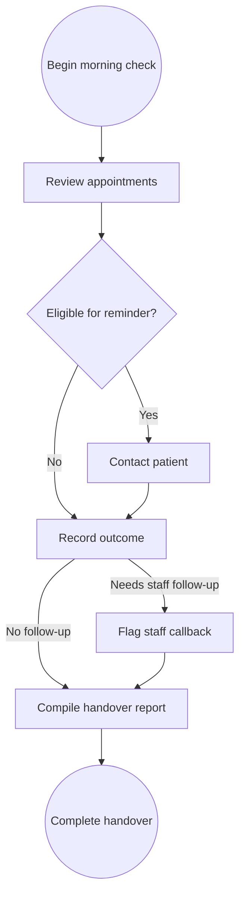
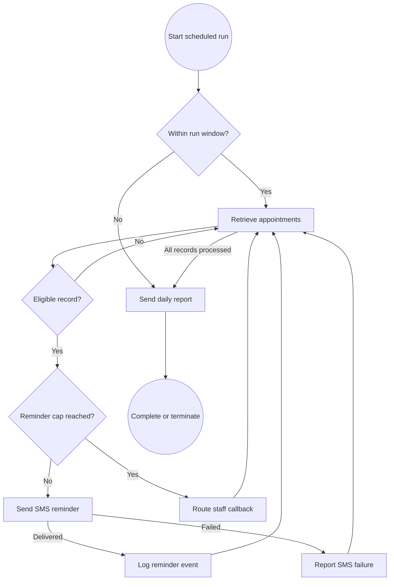

<!-- pdd:doc header="Morning Appointment Confirmation Batch {{RUN_TOKEN}} | Process Definition Document" footer="Confidential | Sakura Medical Partners" client="Sakura Medical Partners" author="Local Developer" date="29 September 2026" version="1.0" process="Morning Appointment Confirmation Batch {{RUN_TOKEN}}" -->

# Morning Appointment Confirmation Batch {{RUN_TOKEN}}

<!-- pdd:section id=business-context sources=as-is/overview.md,as-is/pain-points.md,to-be/overview.md,to-be/benefits.md reproj=g0 -->
# 1. Business Context

## 1.1 Problem Statement
Sakura Medical Partners Shinjuku currently uses front-desk staff to complete a daily morning confirmation check across the next 48 hours of appointments. The manual activity consumes an estimated 20–25 minutes during opening preparation, requires staff to review **DK-Medical v3.2**, manage outreach history, and compile a handover summary before the clinic's formal opening. The process must preserve patient-data residency and must never alter an appointment.

## 1.2 Objectives
- Automate routine appointment retrieval, eligibility evaluation, SMS dispatch, outcome logging, and reporting within the 08:00–08:30 JST operating window.
- Retain staff involvement only for records requiring a direct callback or review of an SMS delivery failure.
- Enforce the documented confirmation rules consistently, including the two-reminder cap and read-only appointment access.
- Provide an auditable daily handover report to clinic operations management by 08:30 JST.

## 1.3 Expected Value
The future process reduces interruption to opening preparation, makes reminder handling consistent, and gives operations a focused exception list rather than a full manual review. It also improves traceability of sends, skip reasons, failures, and time-window overruns; measured acceptance signals are defined in Section 10.

[Refine section](delegate:refine-section?section=business-context)

<!-- pdd:section id=scope sources=as-is/scope.md,entities/applications/ reproj=g0 -->
# 2. Scope

## 2.1 Process Identity

| Process name | Process group | Process identifier | Industry |
|---|---|---|---|
| Morning Appointment Confirmation Batch | Clinic operations | SMP-APPT-CONF | Healthcare |

## 2.2 Scope Boundaries

| In Scope | Out of Scope |
|---|---|
| Morning confirmation review for appointments in the next 48 hours | Appointment cancellation |
| Eligibility evaluation, reminder history, and approved SMS outreach | Appointment rescheduling |
| Reminder-event logging and exception routing | Appointment booking |
| Daily operations handover report | Changes to appointment details |
| Staff callback follow-up for flagged records | Online booking portal |

## 2.3 Systems and Applications

| System | Role in Process | Access Type |
|---|---|---|
| **DK-Medical v3.2** | Appointment source of truth; supplies records for evaluation | Read |
| **NTT Docomo Business SMS Gateway** | Sends approved reminder messages | Write |
| **Reminder History Store** | Retains scheduling-cycle reminder count and events | Both |

[Refine section](delegate:refine-section?section=scope)

<!-- pdd:section id=current-state sources=as-is/overview.md,as-is/diagram.md,as-is/steps/,as-is/metrics.md,as-is/pain-points.md reproj=g0 -->
# 3. Current State

## 3.1 Overview
The current workflow is a manual front-desk activity performed before the clinic opens. Staff review appointments in **DK-Medical v3.2**, identify records requiring confirmation activity, contact patients, record outcomes, flag exceptions, and compile a handover report. The documents confirm the workload and business rules but do not evidence every detailed staff interaction.

## 3.2 Current Flow

| # | Current step |
|---|---|
| 1 | Begin the morning confirmation check during opening preparation. |
| 2 | Review appointments in the next 48 hours in **DK-Medical v3.2**. |
| 3 | Exclude confirmed, cancelled, and imminent appointments. |
| 4 | Contact eligible unconfirmed patients. |
| 5 | Record reminder and outreach outcomes. |
| 6 | Flag records needing direct staff callback. |
| 7 | Compile and distribute the operations handover summary. |

## 3.3 Metrics

| Metric | Current signal | Measurement method |
|---|---|---|
| Frequency | Daily morning activity | Consultation notes |
| Coverage window | Next 48 hours of appointments | Consultation notes |
| Manual effort | 20–25 minutes each morning | Clinic Operations Manager estimate |
| Handover deadline | Before 09:00 opening handover; target completion by 08:30 | Consultation notes |

## 3.4 Pain Points

| Where | What breaks | Impact |
|---|---|---|
| Opening preparation | Routine confirmation work competes with front-desk opening duties | Estimated 20–25 minutes daily of manual work |
| Appointment review | Staff must assess eligibility and reminder history manually | Inconsistent handling risk |
| Handover preparation | Staff compile the daily summary manually | Operations needs prompt visibility of exceptions |

[Open AS-IS diagram](delegate:open-diagram?which=as-is&anchor=current-state)

[Refine section](delegate:refine-section?section=current-state)

<!-- pdd:section id=target-state sources=to-be/overview.md,to-be/diagram.md,to-be/delivery-model.md,to-be/steps/,to-be/exception-handling.md,to-be/benefits.md reproj=g0 -->
# 4. Future State

## 4.1 Vision
The future state is an unattended scheduled RPA batch that begins at 08:00 JST, evaluates the next 48 hours of **DK-Medical v3.2** appointments, dispatches approved reminders through the **NTT Docomo Business SMS Gateway**, records outcomes, and emails a daily handover report by 08:30 JST. Staff remain in the loop only for direct callbacks and delivery-failure follow-up. The automation operates only when the underlying environment and logging arrangement meet Japan-residency requirements.

[Open TO-BE diagram](delegate:open-diagram?which=to-be&anchor=target-state)

## 4.2 Target Flow

| # | Automation unit / step | Mode | Owner or system | Input | Output | Exception path |
|---|---|---|---|---|---|---|
| 1 | Run-window control | Fully Automated | Scheduler | Current time | Run status | Stop and report unprocessed records after 08:30 |
| 2 | Retrieve appointments | Fully Automated | DK-Medical v3.2 | Next-48-hour query | Appointment records | Report if time window ends |
| 3 | Evaluate eligibility and history | Fully Automated | DK-Medical / reminder-history store | Status, appointment time, prior reminders | Eligible, skipped, or escalation route | Skip confirmed, cancelled, or imminent records |
| 4 | Send and log reminder | Fully Automated | NTT Docomo / reminder-history store | Eligible record and approved template | Reminder event | Route delivery failure to report; no same-run retry |
| 5 | Escalate exception | Fully Automated then Manual | Front-desk staff | Two-reminder or failure outcome | Callback item | Staff telephone follow-up |
| 6 | Send daily report | Fully Automated | Operations distribution list | Aggregated outcomes | Email handover report | Include unprocessed records if cutoff exceeded |

## 4.2.1 Future Work Details

### Run-window control
**Trigger:** Daily schedule at 08:00 JST. **Mode:** Fully Automated. **Systems:** Scheduler and run monitor. **Inputs / outputs:** Current time and run status; completion or incomplete-run warning. **Exception path:** Stop safely after 08:30 JST and report remaining records.

### Evaluate eligibility and send reminder
**Trigger:** Appointment retrieved during the run. **Mode:** Fully Automated. **Systems:** DK-Medical v3.2, reminder-history store, NTT Docomo Business SMS Gateway. **Inputs / outputs:** Appointment record, history count, patient mobile number, approved template; reminder event or skip reason. **Decision points:** Appointment status, time-to-appointment, and reminder count. **Exception path:** Delivery failure is reported; two prior reminders route to manual follow-up.

### Escalate exceptions and send report
**Trigger:** A callback, delivery failure, cutoff condition, or completed population. **Mode:** Automated routing and report delivery; Manual direct patient callback. **Systems:** Follow-up destination and operations email list. **Outputs:** Callback list and daily confirmation report. **Exception path:** Sunday schedule and recipients remain open decisions.

## 4.3 What Changes

| Area | AS-IS | TO-BE | Why | How |
|---|---|---|---|---|
| Appointment review | Staff inspect records manually | Batch retrieves records automatically | Reduce opening-preparation work | Scheduled read-only retrieval |
| Eligibility | Staff apply rules manually | Rules enforced per record | Improve consistency | Status, timing, and history decisions |
| Messaging | Staff initiate reminders | SMS dispatch automated | Remove repetitive outreach | NTT Docomo API using approved templates |
| Escalations | Staff identify exceptions during review | Exceptions surfaced directly | Focus staff on human work | Callback and delivery-failure routes |
| Handover | Staff compile summary | Report sent automatically | Timely operations visibility | Aggregated outcome email |

## 4.4 Automation Work Summary

| Mode | Count | Summary |
|---|---:|---|
| Fully Automated | 5 | Run control, retrieval, evaluation, SMS/logging, and reporting |
| Manual | 1 | Direct staff callback for escalated records |

[Refine section](delegate:refine-section?section=target-state)

<!-- pdd:section id=business-rules sources=as-is/business-rules.md,to-be/business-rules.md reproj=g0 -->
# 5. Business Rules

| Rule ID | Description |
|---|---|
| BR-001 | Review appointments in the next 48 hours. |
| BR-002 | Do not contact an appointment already confirmed. |
| BR-003 | Do not contact a cancelled appointment; record the skip reason. |
| BR-004 | Do not send a reminder for an unconfirmed appointment within four hours of the run time. |
| BR-005 | Send the first reminder only when no prior reminder exists in the scheduling cycle. |
| BR-006 | Send the second reminder only when exactly one prior reminder exists. |
| BR-007 | After two or more reminders, flag for staff callback; do not send additional SMS. |
| BR-008 | Never cancel, reschedule, book, or modify an appointment. |
| BR-009 | Do not operate outside 08:00–08:30 JST; stop and report unprocessed records after cutoff. |

==TBD: Confirm the eligibility outcome for an appointment exactly four hours after the scheduled run==

[Refine section](delegate:refine-section?section=business-rules)

<!-- pdd:section id=data-model sources=entities/artifacts/,as-is/data-inputs-outputs.md reproj=g0 -->
# 6. Data Model

## 6.1 Entities

| Entity | Description |
|---|---|
| Appointment | DK-Medical appointment record evaluated by the batch. |
| Reminder history | Scheduling-cycle record of previous reminder events. |
| SMS outcome | Sent, skipped, failed, or escalation outcome per appointment. |
| Manual follow-up item | Record requiring front-desk telephone callback. |
| Daily confirmation report | Operations email summary of the daily batch. |

## 6.2 Data Inputs and Outputs

| Artifact | Source / Destination | Format | Consumed / Produced By |
|---|---|---|---|
| **Appointment record** | DK-Medical v3.2 | Application record | Consumed by automation |
| **Reminder-history record** | Local history store | Log record | Consumed and produced by automation |
| **Daily confirmation report** | Automation to operations distribution list | Email summary | Produced by automation; consumed by clinic operations management |

## 6.3 Field-Level Data Dictionary

| Field | Type | Format / Pattern | Valid values / range | Mandatory | Privacy class |
|---|---|---|---|---|---|
| Appointment ID | Identifier | System identifier | Unique appointment key | Yes | Internal |
| Patient ID | Identifier | System identifier | Unique patient key | Yes | PII |
| Appointment status | Text | DK-Medical value | Confirmed, Cancelled, Unconfirmed | Yes | Internal |
| Appointment date/time | Date-time | JST | Next 48-hour window | Yes | PII |
| Patient mobile number | Text | Telephone number | Valid mobile number | Required for SMS | PII |
| Prior reminder count | Integer | 0+ | 0, 1, 2 or more | Yes | Internal |
| Reminder sequence | Integer | 1 or 2 | 1, 2 | When sent | Internal |

## 6.4 Data Flow and Lineage

| # | Data movement |
|---|---|
| 1 | DK-Medical supplies appointment status, time, identifiers, and contact details to the batch. |
| 2 | The reminder-history store supplies the scheduling-cycle reminder count. |
| 3 | Eligible data is passed to NTT Docomo only to send the approved SMS. |
| 4 | The reminder event, skip reason, failure, or escalation outcome is retained in the local history or follow-up destination. |
| 5 | Aggregated non-sensitive operational outcomes are emailed to the operations distribution list. |

## 6.5 Integrations

| Integration (System → System) | Fields passed | Connector / type | Endpoint + Auth |
|---|---|---|---|
| DK-Medical → Automation | Appointment and contact data | API or UI not confirmed | Not confirmed |
| Automation → NTT Docomo | Mobile number, approved template, appointment details | Carrier API | Not confirmed |
| Automation → Reminder-history store | Appointment ID, patient ID, sequence, timestamp, outcome | Local file or lightweight database | Not confirmed |

==TBD: Confirm the integration endpoints, authentication, and approved storage design at solution-design stage==

[Refine section](delegate:refine-section?section=data-model)

<!-- pdd:section id=people sources=entities/people/ reproj=g0 -->
# 7. People

## 7.1 Roles and Personas

| Stakeholder | Responsibility |
|---|---|
| Front-Desk Staff | Performs current manual work; receives escalated callbacks and delivery failures for direct telephone follow-up. |
| Clinic Operations Management | Receives the daily confirmation report and manages operational handover. |
| IT Compliance | Verifies Japan-resident execution, middleware, and logging environment before go-live. |
| RPA Automation | Executes the future scheduled batch, enforces rules, and produces the report. |

[Refine section](delegate:refine-section?section=people)

<!-- pdd:section id=raci sources=entities/people/ reproj=g0 -->
# 7.2 RACI

> [!WARNING]
> **Needs capture:** Confirm accountable business owner and operational escalation ownership. This section will auto-fill when the wiki source is available.

| Activity / Stage | Responsible | Accountable | Consulted | Informed |
|---|---|---|---|---|
| Daily batch execution | RPA Automation | Clinic Operations Management | IT Compliance | Front-Desk Staff |
| Exception callback | Front-Desk Staff | Clinic Operations Management | — | RPA Automation |
| Data-residency approval | IT Compliance | Clinic Operations Management | — | Front-Desk Staff |

[Refine section](delegate:refine-section?section=raci)

<!-- pdd:section id=exceptions sources=as-is/exception-handling.md,to-be/exception-handling.md reproj=g0 -->
# 8. Exceptions and Error Handling

## 8.1 Known Exceptions

| Exception | Trigger | AS-IS Handling | TO-BE Handling |
|---|---|---|---|
| Cancelled appointment | Appointment status is Cancelled | Skip and record reason | Automated skip and logged reason |
| Imminent appointment | Under four hours until appointment | Skip | Automated skip with reason |
| Reminder cap reached | Two or more reminders in scheduling cycle | Staff identifies callback need | Automation creates callback item; staff calls patient |
| SMS delivery failure | NTT Docomo API failure | Staff handles failure | Log and include in report; no same-run retry; staff follows up |
| Window exceeded | Work remains after 08:30 JST | Manual completion | Safe termination; report unprocessed records for staff completion |

## 8.2 Exception Data State Transitions

| Exception | Affected record | State on entry | State on resolution | State on terminal failure |
|---|---|---|---|---|
| Reminder cap reached | Appointment follow-up | Unconfirmed | Requires Staff Callback | Requires Staff Callback |
| SMS delivery failure | Reminder event | Eligible for reminder | Staff follow-up initiated | SMS Delivery Failure |
| Window exceeded | Batch record | Pending evaluation | Processed manually | Not Processed — Window Exceeded |

## 8.3 Human-in-the-Loop Specification

| Escalation point | Trigger | Fields surfaced | Available actions → resulting state | Task SLA | Assignee role |
|---|---|---|---|---|---|
| Staff callback | Two prior reminders | Appointment ID, patient ID, appointment time, reminder history | Call patient → follow-up outcome recorded | Before appointment time | Front-Desk Staff |
| Delivery failure | SMS API failure | Appointment ID, patient ID, error detail | Review and contact patient → follow-up outcome recorded | Before appointment time | Front-Desk Staff |

<!-- doc:placeholder kind="screenshot" -->
> [!NOTE]
> **Screenshot Placeholder**
> Insert screenshot: staff follow-up view showing appointment identifiers, reminder history, error detail, and callback outcome controls.

[Refine section](delegate:refine-section?section=exceptions)

<!-- pdd:section id=compliance sources=as-is/compliance.md,to-be/business-rules.md reproj=g0 -->
# 9. Compliance and Regulatory

## 9.1 Compliance Traceability Matrix

| Requirement / Rule | Enforced at | Evidence retained |
|---|---|---|
| Japan-only patient-data residency | SMS gateway, RPA execution environment, middleware, and logging environment | Environment and vendor compliance verification |
| BR-001: 48-hour appointment review | Retrieval query | Run log and report totals |
| BR-002 / BR-003: confirmed and cancelled exclusions | Eligibility evaluation | Skip reason log |
| BR-004: imminent appointment exclusion | Eligibility evaluation | Skip reason `Within 4-hour window` |
| BR-005 / BR-006: sequence-controlled reminder sends | Reminder-history check and SMS dispatch | Reminder sequence and timestamp |
| BR-007: two-reminder cap and callback route | Reminder-history check | Callback item and report entry |
| BR-008: no appointment modification | DK-Medical access control and process logic | Read-only configuration and audit log |
| BR-009: fixed execution window | Scheduler and run monitor | Start/end timestamps and incomplete-run warning |

## 9.2 Audit and Traceability
The process records run timing, appointment disposition, skip reasons, reminder sequence, SMS delivery outcome, escalation outcome, and cutoff-related incomplete work. Evidence must be retained in a Japan-resident environment and cross-referenced by appointment and patient identifiers.

==TBD: IT Compliance must approve the Japan-resident execution, middleware, and log-storage environment before go-live==

[Refine section](delegate:refine-section?section=compliance)

<!-- pdd:section id=kpis sources=to-be/benefits.md reproj=g0 -->
# 10. KPIs and Acceptance Criteria

## 10.1 KPIs

| KPI | Target / acceptance signal |
|---|---|
| Daily report delivery | Report is sent to operations by 08:30 JST when the batch completes within the permitted window. |
| Operating-window adherence | Automation runs only from 08:00 to 08:30 JST and self-terminates after cutoff. |
| Reminder-cap compliance | No appointment receives more than two SMS messages during its scheduling cycle. |
| Appointment integrity | Zero automated cancellations, reschedules, bookings, or appointment modifications. |
| Exception visibility | Callback, SMS-failure, and unprocessed-record outcomes are included in the daily report. |

## 10.2 Acceptance Criteria
- The batch retrieves and evaluates the next-48-hour appointment population without changing appointment data.
- Every processed record follows the documented status, timing, and reminder-history decision rules.
- Successful reminders retain a timestamp and sequence number.
- SMS API failures are logged, appear in the report, and are not retried in the same run.
- If the 08:30 cutoff is reached, remaining records are reported as not processed.

[Refine section](delegate:refine-section?section=kpis)

<!-- pdd:section id=assumptions-risks sources=queries/,as-is/scope.md reproj=g0 -->
# 11. Assumptions, Constraints, Dependencies and Risks

## 11.1 Assumptions

| Assumption | Detail |
|---|---|
| Approved SMS templates exist | Patient communications has approved the reminder wording described in the consultation. |
| NTT Docomo service is domestic | The business SMS gateway routes domestically as stated in the source material. |
| Staff own exception callbacks | Front-desk staff remain responsible for direct telephone follow-up. |

## 11.2 Constraints

| Constraint | Detail |
|---|---|
| Operating window | The process must execute only between 08:00 and 08:30 JST. |
| Appointment integrity | The automation is read-only for appointment records. |
| Reminder limit | No more than two SMS reminders per appointment per scheduling cycle. |
| Data residency | Patient data must not be stored or routed outside Japan. |
| Scope | Booking, cancellation, rescheduling, and online booking portal work are excluded. |

## 11.3 Dependencies

| Dependency | Type (hard/soft) | Detail |
|---|---|---|
| DK-Medical access | hard | Read access to the next-48-hour appointment data and required fields. |
| NTT Docomo SMS service | hard | Approved business account and working API integration. |
| Reminder-history store | hard | Japan-resident local store and confirmed data model for scheduling-cycle reminder count. |
| Manual follow-up destination | hard | Approved CSV, DK-Medical field, or equivalent staff worklist. |
| IT Compliance approval | hard | Japan-resident execution, middleware, and log-storage confirmation. |
| Sunday scheduling decision | soft | Determines whether special Sunday clinics are included and who receives reports. |

## 11.4 Risks

| Risk | Mitigation |
|---|---|
| Patient-data residency breach | Do not go live until IT Compliance verifies every execution and storage component. |
| Repeated patient outreach | Enforce history-based two-reminder cap and retain auditable sequence records. |
| Late-run disruption | Use fixed scheduler guard and safe termination after 08:30 JST. |
| Incomplete callback handoff | Confirm destination and ownership before implementation. |

[Refine section](delegate:refine-section?section=assumptions-risks)

<!-- pdd:section id=glossary sources=entities/ reproj=g0 -->
# 12. Glossary

| Term | Definition |
|---|---|
| DK-Medical v3.2 | Sakura Medical Partners' appointment source-of-truth system. |
| NTT Docomo Business SMS Gateway | Domestic carrier API used to send approved patient reminder messages. |
| Reminder-history store | Local store tracking reminder events within an appointment's scheduling cycle. |
| Scheduling cycle | Period from entry into the 48-hour query window until the appointment occurs. |
| Manual follow-up | Staff telephone callback for an appointment after two reminders or an SMS delivery failure. |
| PII | Personally identifiable information, including patient contact and appointment information. |
| RPA | Robotic process automation used for deterministic scheduled process execution. |

[Refine section](delegate:refine-section?section=glossary)

<!-- pdd:section id=next-steps sources=queries/open-questions.md reproj=g0 -->
# 13. Next Steps

| # | Action item |
|---|---|
| 1 | Confirm the outcome for appointments exactly four hours after the 08:00 run. |
| 2 | Confirm the reminder-history technology and manual follow-up destination. |
| 3 | Confirm Sunday scheduling and any different Sunday report recipients. |
| 4 | Obtain IT Compliance approval for Japan-resident RPA execution, middleware, and logging. |
| 5 | Validate DK-Medical access method, required fields, and read-only permissions. |
| 6 | Validate NTT Docomo API endpoint, authentication, and failure response behavior. |
| 7 | Perform functional, cutoff-window, exception, and compliance acceptance testing before go-live. |

[Refine section](delegate:refine-section?section=next-steps)

<!-- pdd:section id=appendix-a sources=derived reproj=g0 -->
# Appendix A: Process Map and Diagrams

The current-state and future-state process maps are embedded in Sections 3 and 4 respectively. The future-state map is the business process model of record for the proposed appointment confirmation batch.

<!-- doc:placeholder kind="integration-diagram" -->
> [!NOTE]
> **Integration Diagram Placeholder**
> Insert diagram: DK-Medical appointment retrieval, reminder-history lookup and write-back, NTT Docomo SMS dispatch, manual follow-up destination, and operations-report email distribution.

[Refine section](delegate:refine-section?section=appendix-a)