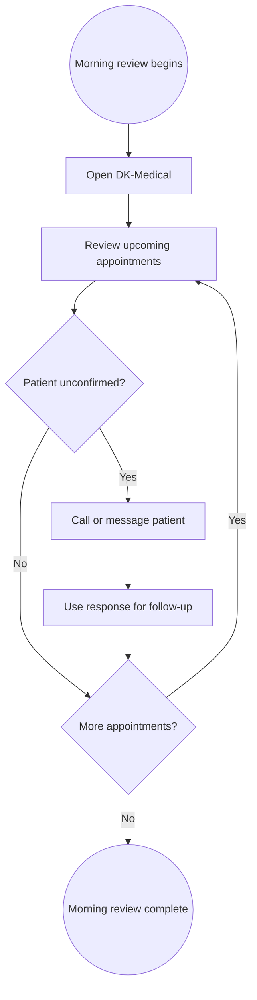
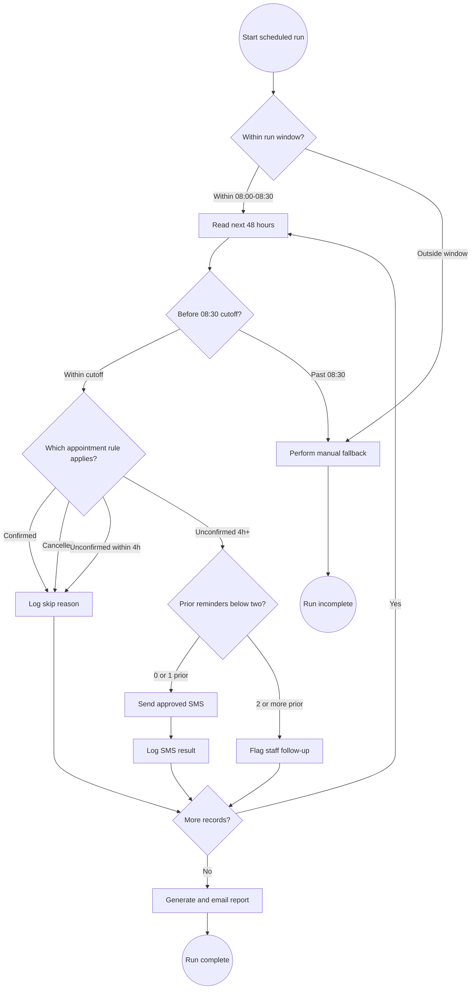

<!-- pdd:doc header="Morning Appointment Confirmation and Reminder Batch {{RUN_TOKEN}} | Process Definition Document" footer="Confidential | Sakura Medical Partners" client="Sakura Medical Partners" author="UiPath Business Analysis Team" date="09 October 2026" version="1.0" process="Morning Appointment Confirmation and Reminder Batch {{RUN_TOKEN}}" -->

# Morning Appointment Confirmation and Reminder Batch {{RUN_TOKEN}}

<!-- pdd:section id=business-context sources=as-is/overview.md,as-is/pain-points.md,to-be/overview.md,to-be/benefits.md reproj=g0 -->
# 1. Business Context

This section frames the operational problem and the intended value of automating the confirmed morning appointment follow-up task. The scope is based on the Operations Call Notes dated 10 June 2026 and the Reminder Exception Handling Decision Table dated 11 June 2026.

## 1.1 Problem Statement

Before the clinic opens, front-desk and operations staff spend approximately 20–25 minutes reviewing **DK-Medical v3.2** and manually calling or messaging patients who have not confirmed appointments in the next 48 hours. This work pulls staff away from opening preparation and creates pressure around the 09:00 handover. The current materials do not define a consistent manual log for contact outcomes, while the target process handles patient data subject to Japan-resident processing requirements and must not modify appointment records.

## 1.2 Objectives

- Replace the approximately 20–25 minute manual morning review and routine contact workload with a scheduled unattended batch, while retaining staff callback work for patients who remain unconfirmed after two reminders.
- Deliver the operations summary by 08:30 JST so the team has visibility before the 09:00 handover.
- Apply the confirmed next-48-hour, appointment-status, four-hour, and reminder-count rules consistently.
- Keep appointment records read-only, enforce the two-reminder maximum, and retain manual handling for exhausted reminders.
- Keep patient data and reminder history on Japan-resident infrastructure, subject to final environment verification.

## 1.3 Expected Value

The future design is expected to protect opening preparation, make the reminder decision logic repeatable, improve operational visibility through a daily report, and reduce the risk of accidental appointment changes. It also preserves human judgment where a patient needs a direct callback rather than an automated cancellation decision. Measured acceptance targets are defined in Section 10.

[Refine section](delegate:refine-section?section=business-context)

<!-- pdd:section id=scope sources=as-is/overview.md,queries/open-questions.md,entities/applications/ reproj=g0 -->
# 2. Scope

This section defines the source-bounded scope of the morning appointment confirmation and reminder task. The online booking portal and all appointment-record transactions remain outside the process.

## 2.1 Process Identity

**Table 1. Process identity**

| Field | Value |
|---|---|
| Process name | Morning Appointment Confirmation and Reminder Batch |
| Process group | Clinic operations / front desk |
| Process identifier | Not assigned |
| Industry | Healthcare |

==TBD: Assign the process identifier during solution setup==

## 2.2 Scope Boundaries

**Table 2. In-scope and out-of-scope boundaries**

| In Scope | Out of Scope |
|---|---|
| Daily 08:00 JST scheduled batch | Online booking portal project |
| Next-48-hour appointment read from DK-Medical | Appointment booking |
| Status, four-hour, and reminder-count evaluation | Appointment cancellation |
| NTT Docomo reminder SMS | Appointment rescheduling |
| Reminder history and operations report | Any wider patient-portal redesign |
| Manual callback flag after two reminders | Automated cancellation decisions |

Sunday special-clinic policy is not excluded from the business requirement, but it is not yet defined and remains a dependency for go-live.

## 2.3 Systems and Applications

**Table 3. Systems and applications**

| System | Role in Process | Access Type |
|---|---|---|
| **DK-Medical v3.2** | Appointment source of truth; provides status, appointment timing, IDs, and patient contact data | Read |
| **NTT Docomo business SMS gateway** | Sends approved appointment reminder messages | Write |

The reminder log and operations email destination are process artifacts or channels whose final technology choices are not confirmed; see Section 11.

[Refine section](delegate:refine-section?section=scope)

<!-- pdd:section id=current-state sources=as-is/overview.md,as-is/diagram.md,as-is/steps/,as-is/metrics.md,as-is/pain-points.md reproj=g0 -->
# 3. Current State

## 3.1 Overview

Before clinic opening, front-desk and operations staff manually review the next 48 hours of appointments in **DK-Medical v3.2**, identify patients who have not confirmed, and call or message them. The manual activity takes approximately 20–25 minutes and the current materials do not specify a consistent system for recording contact outcomes or assembling the operational summary.

## 3.2 Current Flow

**Table 4. Current manual flow**

| # | Current step |
|---|---|
| 1 | Begin the morning review as part of opening preparation. |
| 2 | Open DK-Medical v3.2. |
| 3 | Review appointment records in the next 48 hours. |
| 4 | Identify appointments whose patients have not confirmed. |
| 5 | Call or message the patient manually. |
| 6 | Use any response for operational follow-up. |
| 7 | Continue until the relevant appointment workload has been reviewed. |
| 8 | Finish the review before the clinic opening handover. |

## 3.3 Metrics

**Table 5. Current baseline metrics**

| Metric | Current signal | Measurement method |
|---|---|---|
| Manual batch duration | Approximately 20–25 minutes | Clinic operations estimate |
| Frequency | Daily morning activity | Source narrative |
| Staff involvement | Front-desk / operations staff; headcount not provided | Source narrative |
| Appointment volume | Not provided | Open item |
| Backlog / aging | Not provided | Open item |
| Timing pressure | Activity occurs before the 09:00 handover | Operational schedule |

## 3.4 Pain Points

**Table 6. Current pain points**

| Where | What breaks | Impact |
|---|---|---|
| Pre-opening preparation | Staff manually review and contact patients | Approximately 20–25 minutes of staff time is diverted from opening preparation |
| Before handover | Contact work must be completed before the clinic opens | Creates pressure around the 09:00 handover |
| Contact follow-up | Current outcome-recording method is not specified | Operations visibility and auditability are inconsistent |

**Figure 1. Current-state simple flow map**

[Open AS-IS diagram](delegate:open-diagram?which=as-is&anchor=current-state)

[Refine section](delegate:refine-section?section=current-state)

<!-- pdd:section id=target-state sources=to-be/overview.md,to-be/diagram.md,to-be/delivery-model.md,to-be/steps/,to-be/exception-handling.md,to-be/benefits.md reproj=g0 -->
# 4. Future State

## 4.1 Vision

The future state is a scheduled unattended batch that starts at 08:00 JST, reads the next 48 hours from **DK-Medical v3.2**, applies the confirmed appointment and reminder rules, sends eligible messages through the **NTT Docomo business SMS gateway**, records outcomes, flags human callbacks after two reminders, and emails the operations report. The design retains manual work only for patient callbacks and for fallback handling when the hard operating window cannot be met; the specific Japan-resident UiPath runtime and connector pattern are solution-design decisions.

**Figure 2. Future-state automation map**

[Open TO-BE diagram](delegate:open-diagram?which=to-be&anchor=target-state)

## 4.2 Target Flow

The target flow is organized as automation units rather than lifecycle stages.

### Unit 1 — Schedule and window guard

| Field | Definition |
|---|---|
| Mode | Fully Automated; manual fallback on a missed window |
| Owner or system | Automation runtime; operations staff for fallback |
| Input | Current JST time and configured operating window |
| Output / exception | Valid run context, or incomplete-run condition |

### Unit 2 — Retrieve and classify appointments

| Field | Definition |
|---|---|
| Mode | Fully Automated |
| Owner or system | DK-Medical v3.2 |
| Input | Status, appointment time, IDs, contact data, reminder count |
| Output / exception | Skip, send, or follow-up route; appointment records remain unchanged |

### Unit 3 — Send eligible reminder

| Field | Definition |
|---|---|
| Mode | Fully Automated |
| Owner or system | NTT Docomo business SMS gateway |
| Input | Approved template, patient mobile, appointment details, sequence |
| Output / exception | Delivery response; failure is logged and reported without same-session retry |

### Unit 4 — Record reminder outcome

| Field | Definition |
|---|---|
| Mode | Fully Automated |
| Owner or system | Japan-resident reminder log, final technology not confirmed |
| Input | Event, sequence, timestamp, result, reason, IDs |
| Output / exception | Auditable event and report counters |

### Unit 5 — Flag manual follow-up

| Field | Definition |
|---|---|
| Mode | Automated flagging followed by Manual callback |
| Owner or system | Automation plus front-desk / operations staff |
| Input | Two-or-more reminder history and appointment details |
| Output / exception | Staff-actionable callback item; no automated cancellation |

### Unit 6 — Generate and email report

| Field | Definition |
|---|---|
| Mode | Fully Automated |
| Owner or system | Automation plus operations distribution list |
| Input | Appointment totals, skips, reminders, failures, callbacks, cutoff results |
| Output / exception | Daily operations report; incomplete-run categories included when needed |

## 4.2.1 Future Work Details

### Unit 1 — Schedule and window guard

> Starts and bounds the timed batch so clinic opening operations are protected.

| Field | Detail |
|---|---|
| Trigger | Daily schedule at 08:00 JST |
| System / mode | Automation runtime; Fully Automated |
| Inputs | Current time and 08:00–08:30 window |
| Outputs | Valid run context or incomplete-run condition |
| Rules | No execution outside the window; stop when 08:30 is reached |
| Exception path | Log incomplete run and return remaining work to staff |
| Human review | Operations staff perform the manual fallback |

### Unit 2 — Retrieve and classify appointments

> Reads the source record and applies the first matching appointment rule.

| Field | Detail |
|---|---|
| Trigger | Valid run context |
| System / mode | DK-Medical v3.2; Fully Automated |
| Inputs | Next-48-hour appointments, status, time, IDs, contact data, reminder count |
| Outputs | Skip, send, or manual-follow-up route |
| Rules | Confirmed, cancelled, and unconfirmed-within-four-hours records are skipped; eligible unconfirmed records proceed |
| Exception path | If access is unavailable, use the defined operational fallback; exact technical recovery is not confirmed |
| Human review | None for normal rule evaluation |

### Unit 3 — Send eligible reminder

> Sends the first or second approved SMS for an eligible appointment.

| Field | Detail |
|---|---|
| Trigger | Eligible unconfirmed appointment with zero or one prior reminder |
| System / mode | NTT Docomo business SMS gateway; Fully Automated |
| Inputs | Patient mobile, appointment date/time, doctor, template, sequence |
| Outputs | Delivery response |
| Rules | Never exceed two reminders in the scheduling cycle |
| Exception path | Log API failure, report it, and do not retry in the same session |
| Human review | None for normal delivery |

### Unit 4 — Record reminder outcome

> Maintains history and evidence without writing to the appointment record.

| Field | Detail |
|---|---|
| Trigger | Skip, SMS attempt, delivery response, or cutoff event |
| System / mode | Japan-resident reminder log; Fully Automated |
| Inputs | Appointment ID, patient ID, sequence, timestamp, result, reason |
| Outputs | Reminder history, event evidence, and report counters |
| Rules | Counts persist through the scheduling cycle until the appointment occurs |
| Exception path | Final log technology and retention are not confirmed |
| Human review | None for normal logging |

### Unit 5 — Flag manual follow-up

> Stops automated messaging after the hard reminder limit and routes the patient to staff.

| Field | Detail |
|---|---|
| Trigger | Two or more prior reminders and the appointment remains unconfirmed |
| System / mode | Follow-up queue or DK-Medical flag; automated flag plus Manual callback |
| Inputs | Appointment and patient IDs, appointment details, reminder history |
| Outputs | Requires Staff Callback item and report entry |
| Rules | No additional SMS and no appointment cancellation, rescheduling, or booking |
| Exception path | Queue or field mapping is not confirmed |
| Human review | Front-desk / operations staff call the patient directly |

### Unit 6 — Generate and email report

> Gives operations a consistent pre-handover view of the batch outcome.

| Field | Detail |
|---|---|
| Trigger | All records processed or cutoff reached |
| System / mode | Approved email channel; Fully Automated |
| Inputs | Totals, confirmations, reminders, callbacks, failures, and unprocessed records |
| Outputs | Confirmation report to the operations distribution list |
| Rules | Deliver by 08:30 when the batch completes within the window |
| Exception path | Sunday recipients and exact list are not confirmed |
| Human review | Operations staff use the report and perform callbacks |

## 4.3 What Changes

### Review and selection

| Field | Detail |
|---|---|
| Area | Review and selection |
| AS-IS | Staff manually review upcoming records and identify unconfirmed patients. |
| TO-BE | The batch reads the next 48 hours and applies ordered status, timing, and reminder rules. |
| Why | Reduce repetitive work and variation. |
| How | Scheduled unattended processing with read-only source access. |

### Routine patient contact

| Field | Detail |
|---|---|
| Area | Routine reminder contact |
| AS-IS | Staff call or message patients manually. |
| TO-BE | Eligible reminders are sent through the NTT Docomo business SMS API. |
| Why | Reduce routine handling time and standardize approved wording. |
| How | First and second messages are selected from reminder history. |

### History and visibility

| Field | Detail |
|---|---|
| Area | Logging and reporting |
| AS-IS | Current manual outcome logging and report assembly are not specified. |
| TO-BE | Reminder outcomes, skips, failures, callbacks, and cutoff results feed a daily report. |
| Why | Improve auditability and operational visibility. |
| How | Use a separate Japan-resident reminder log and automated report generation. |

### Human escalation

| Field | Detail |
|---|---|
| Area | Exhausted reminders and failures |
| AS-IS | Current exception handling is not fully documented. |
| TO-BE | Two-reminder cases become staff callbacks; SMS failures are reported without same-session retry. |
| Why | Preserve human judgment and prevent unsafe auto-cancellation. |
| How | Create a follow-up item and retain the appointment unchanged. |

The net-new reasoning is to keep the timed automation bounded: the report and manual callback flag complete the automated batch, while staff callback work continues as a human operational follow-up rather than delaying the 08:30 report.

## 4.4 Automation Work Summary

| Work type | Count | Decision status |
|---|---:|---|
| Fully Automated | 5 primary units | Confirmed future design |
| Manual | 1 follow-up unit plus cutoff fallback | Confirmed future design |
| Agent / Human Review / Assisted | 0 | Not proposed for this deterministic task |

Open implementation choices are the unattended DK-Medical access route, Japan-resident runtime, reminder-log technology, follow-up queue mapping, and Sunday policy.

[Refine section](delegate:refine-section?section=target-state)

<!-- pdd:section id=business-rules sources=as-is/business-rules.md,to-be/business-rules.md reproj=g0 -->
# 5. Business Rules

The current rules describe the manual selection and contact activity. The future rules add deterministic controls for the scheduled batch and take precedence where they change the way the task executes.

**Table 7. Business rules**

| Rule ID | Description |
|---|---|
| BR-001 | Staff focus manual contact on patients who have not confirmed. |
| BR-002 | The current manual contact method may be a phone call or message; the selection rule is not specified. |
| BR-003 | Run once daily at 08:00 JST and do not execute outside 08:00–08:30. |
| BR-004 | Read appointments in the next 48 hours from DK-Medical v3.2; appointment records are read-only to the automation. |
| BR-005 | Skip confirmed appointments, cancelled appointments, and unconfirmed appointments less than four hours from the run time. |
| BR-006 | Send the first SMS with zero prior reminders and the second SMS with one prior reminder. |
| BR-007 | Never send more than two reminders within the scheduling cycle; after two reminders, flag staff follow-up and never auto-cancel. |
| BR-008 | On SMS API failure, log the error, include it in the report, and do not retry in the same session. |
| BR-009 | Keep patient personal data and reminder logs on Japan-resident infrastructure, subject to verification before go-live. |
| BR-010 | At the 08:30 cutoff, stop processing, log an incomplete run, report remaining records, and use manual fallback. |

The future rule evidence and the control-to-task mapping are detailed in Sections 8 and 9.

[Refine section](delegate:refine-section?section=business-rules)

<!-- pdd:section id=data-model sources=entities/artifacts/,as-is/data-inputs-outputs.md,entities/applications/dk-medical.md reproj=g0 -->
# 6. Data Model

The process reads appointment and patient-contact data, derives reminder decisions, and produces reminder events, follow-up items, and an operations report. Patient name, phone number, and appointment details are personal data and require Japan-resident handling.

## 6.1 Entities

| Entity | Description |
|---|---|
| Appointment record | Primary business record in DK-Medical; read-only to the automation. |
| Patient contact | Name, mobile number, and appointment details used for approved communication. |
| Reminder event | A skip, reminder attempt, delivery result, or failure recorded outside the appointment record. |
| Scheduling cycle | Period from entry into the 48-hour window until the appointment occurs; reminder counts do not reset between daily runs. |
| Manual follow-up item | Record routed to staff after two reminders without confirmation. |
| Confirmation report | Daily summary consumed by operations staff and clinic managers. |

## 6.2 Data Inputs and Outputs

**Table 8. Data lineage artifacts**

| Artifact | Source / Destination | Format | Consumed / Produced By |
|---|---|---|---|
| **Appointment record** | DK-Medical v3.2 | Application record; exact interface format not confirmed | Read by retrieval and classification |
| **Patient contact data** | DK-Medical or staff-accessible contact view | Name, mobile, appointment details | Used by SMS unit |
| **Reminder event** | Japan-resident reminder log | Local flat file or lightweight database; choice not confirmed | Produced by logging unit and read for reminder count |
| **Manual follow-up item** | CSV queue or DK-Medical flag field; choice not confirmed | Queue/flag record | Produced by escalation unit; consumed by staff |
| **Confirmation report** | Operations distribution list | Email summary | Produced by report unit; consumed by operations and clinic managers |

## 6.3 Field-Level Data Dictionary

### Appointment status

**Type:** Enumeration

**Format / Pattern:** DK-Medical status value

**Valid values / range:** Confirmed, Cancelled, Unconfirmed

**Mandatory:** Yes for routing

**Privacy class:** Operational record; linked to PII

### Appointment time

**Type:** Date-time

**Format / Pattern:** DK-Medical appointment date and time in the clinic's time zone

**Valid values / range:** Used to calculate hours from the 08:00 JST run

**Mandatory:** Yes for routing

**Privacy class:** PII when linked to a patient

### Appointment ID

**Type:** Identifier

**Format / Pattern:** DK-Medical identifier; exact pattern not confirmed

**Valid values / range:** Non-empty unique appointment reference

**Mandatory:** Yes for logging

**Privacy class:** PII-linked identifier

### Patient ID

**Type:** Identifier

**Format / Pattern:** DK-Medical identifier; exact pattern not confirmed

**Valid values / range:** Non-empty patient reference

**Mandatory:** Yes for reminder history

**Privacy class:** PII

### Patient mobile number

**Type:** String

**Format / Pattern:** Mobile number accepted by the SMS gateway; exact validation rule not confirmed

**Valid values / range:** Reachable mobile number

**Mandatory:** Required to send SMS

**Privacy class:** PII

### Prior reminder count

**Type:** Integer

**Format / Pattern:** Count in the reminder log for the scheduling cycle

**Valid values / range:** 0, 1, 2 or more

**Mandatory:** Yes for reminder routing

**Privacy class:** Operational history linked to PII

### Reminder sequence

**Type:** Integer

**Format / Pattern:** 1 or 2

**Valid values / range:** Maximum 2 per scheduling cycle

**Mandatory:** Required for a sent reminder

**Privacy class:** Operational history linked to PII

### Event timestamp

**Type:** Date-time

**Format / Pattern:** Execution timestamp in JST or an agreed canonical format

**Valid values / range:** Must be present for audit events

**Mandatory:** Yes for logged events

**Privacy class:** Operational metadata

### Delivery result

**Type:** Enumeration / detail

**Format / Pattern:** Gateway response and failure detail

**Valid values / range:** Success, failure, or provider response; exact codes not confirmed

**Mandatory:** Required after an SMS attempt

**Privacy class:** Operational data linked to PII

### Skip reason

**Type:** Enumeration

**Format / Pattern:** Controlled reason text

**Valid values / range:** Confirmed, Cancelled, Within 4-hour window

**Mandatory:** Required for a skipped record

**Privacy class:** Operational data linked to PII

## 6.4 Data Flow and Lineage

| # | Data movement |
|---|---|
| 1 | Read next-48-hour appointment records from DK-Medical. |
| 2 | Read reminder history keyed by appointment ID and patient ID from the separate log. |
| 3 | Apply appointment status, four-hour, and reminder-count rules. |
| 4 | Send approved patient and appointment details to the NTT Docomo SMS gateway only for eligible records. |
| 5 | Write reminder, skip, failure, and cutoff events to the approved log. |
| 6 | Write eligible two-reminder records to the follow-up queue or agreed flag field. |
| 7 | Aggregate results into the confirmation report and email it to operations. |

## 6.5 Integrations

| Integration | Fields passed | Connector / type | Endpoint + Auth |
|---|---|---|---|
| DK-Medical → automation | Status, appointment time, IDs, contact details | API or UI access; not confirmed | Not confirmed |
| Reminder log → automation | Appointment ID, patient ID, prior reminder count | Local file or lightweight database; not confirmed | Not confirmed |
| Automation → NTT Docomo | Mobile number, template, date/time, doctor, sequence | Business SMS carrier API | Existing account; endpoint and authentication not confirmed |
| Automation → follow-up destination | Appointment and patient IDs, reason, appointment details | CSV queue or DK-Medical flag field; not confirmed | Not confirmed |
| Automation → operations | Report counts and exception categories | Email channel | Distribution list and authentication not confirmed |

==TBD: Confirm the integration endpoints, authentication, and Japan-resident execution path at solution design==

[Refine section](delegate:refine-section?section=data-model)

<!-- pdd:section id=people sources=entities/people/ reproj=g0 -->
# 7. People

## 7.1 Roles and Personas

The following catalog is the single actor list for the process, including human participants, systems, governance roles, and delivery roles.

| Stakeholder | Responsibility |
|---|---|
| Front-desk / operations staff | Perform the current manual activity, receive the report, complete manual callbacks, and use fallback handling. |
| Clinic operations manager — Yuki Tanaka | Process owner and requirements stakeholder for Sakura Medical Shinjuku. |
| Clinic managers | Consume the confirmation report and operational follow-up information. |
| Omiya-san / operations representative | Provides the unresolved Sunday scheduling decision. |
| IT Compliance — Ishikawa-san | Confirms PIPA-aligned Japan-resident handling and certification requirements. |
| Patient communications team | Owns approved SMS template copy. |
| IT consultant / Adachi Systems — Kenji Adachi | Reference-process author and technical consultation role. |
| UiPath Business Analysis Team | Produces and maintains the process definition. |
| DK-Medical v3.2 | Appointment source of truth; provides read-only appointment and contact data. |
| NTT Docomo business SMS gateway | Sends approved reminder messages. |
| Reminder log | Stores reminder history and processing evidence outside the appointment record. |
| Operations distribution list | Receives the daily confirmation report; exact membership is not confirmed. |

[Refine section](delegate:refine-section?section=people)

<!-- pdd:section id=raci sources=entities/people/,to-be/delivery-model.md reproj=g0 -->
# 7.2 RACI

The RACI below assigns responsibility for the confirmed current and future work. Automated work is assigned to the automation runtime, while accountability remains with clinic operations.

### Retrieve and classify appointments

**Activity:** Read the next 48 hours and apply routing rules

**Responsible:** Automation runtime

**Accountable:** Clinic operations manager

**Consulted:** IT Compliance; IT consultant / Adachi Systems

**Informed:** Front-desk / operations staff

### Send reminder

**Activity:** Send an approved SMS for an eligible appointment

**Responsible:** Automation runtime and NTT Docomo gateway

**Accountable:** Clinic operations manager

**Consulted:** Patient communications team; IT Compliance

**Informed:** Front-desk / operations staff

### Record outcome

**Activity:** Record skip, reminder, failure, and cutoff events

**Responsible:** Automation runtime and reminder log

**Accountable:** Clinic operations manager

**Consulted:** IT Compliance; IT consultant / Adachi Systems

**Informed:** Clinic managers

### Flag and complete callback

**Activity:** Route patients after two reminders and call them directly

**Responsible:** Automation runtime for the flag; front-desk / operations staff for the callback

**Accountable:** Clinic operations manager

**Consulted:** Patient communications team where message handling is relevant

**Informed:** Clinic managers

### Produce report

**Activity:** Generate and email the daily confirmation report

**Responsible:** Automation runtime

**Accountable:** Clinic operations manager

**Consulted:** Front-desk / operations staff; clinic managers

**Informed:** Operations distribution list recipients

[Refine section](delegate:refine-section?section=raci)

<!-- pdd:section id=exceptions sources=as-is/exception-handling.md,to-be/exception-handling.md reproj=g0 -->
# 8. Exceptions and Error Handling

The current materials do not define a complete manual exception procedure. The future design makes the documented operational exceptions explicit and ensures each path either reaches a terminal outcome or returns to the record loop.

## 8.1 Known Exceptions

**Table 9. Exception handling**

| Exception | Trigger | AS-IS Handling | TO-BE Handling |
|---|---|---|---|
| Run outside window | Activity starts outside 08:00–08:30 | Not documented | Do not process; log skipped run and use manual fallback |
| Window exceeded | Processing reaches 08:30 | Not documented | Stop, log incomplete run, report remaining records, and return work to staff |
| SMS delivery failure | Gateway does not return success | Not documented | Log error, report SMS Delivery Failure, and do not retry in same session |
| Two reminders without confirmation | Prior count is 2 or more | Not documented | Flag Requires Staff Callback; staff call directly; never auto-cancel |
| Invalid contact detail | Not documented for current or future process | Not documented | Handling and validation rule require confirmation before go-live |
| Sunday special clinic | Sunday policy is not agreed | Not documented | Do not assume weekday behavior until schedule and recipient rules are confirmed |

## 8.2 Exception Data State Transitions

### Incomplete run

**Exception:** Window exceeded

**Affected record:** Unprocessed appointment records

**State on entry:** Pending processing

**State on resolution:** Marked not processed; manual staff work resumes

**State on terminal failure:** Incomplete run warning retained in the report and log

### SMS delivery failure

**Exception:** NTT Docomo API failure

**Affected record:** Eligible unconfirmed appointment

**State on entry:** Ready for reminder attempt

**State on resolution:** SMS Delivery Failure recorded; operations review required

**State on terminal failure:** No same-session retry; appointment remains unchanged

### Two-reminder escalation

**Exception:** Appointment remains unconfirmed after two reminders

**Affected record:** Appointment and associated follow-up item

**State on entry:** Two reminders recorded; still unconfirmed

**State on resolution:** Requires Staff Callback; staff call the patient

**State on terminal failure:** Appointment remains active and unmodified; no automated cancellation

## 8.3 HITL and Action Task Form Specifications

### Staff callback task

**Escalation point:** After two reminders without confirmation

**Trigger:** Prior reminder count is two or more and appointment remains unconfirmed

**Fields surfaced:** Appointment ID, patient ID, patient name, mobile number, appointment date/time, doctor name, reminder history, escalation reason, and source report timestamp

**Available actions → resulting state:** Callback completed → staff outcome recorded; Unable to reach → retain follow-up status; Patient requests change → route to normal staff scheduling process outside this automation

**Task SLA:** Before the appointment time; exact response target is not confirmed

**Assignee role:** Front-desk / operations staff

<!-- doc:placeholder kind="screenshot" -->
> [!NOTE]
> **Screenshot Placeholder**
> Insert screenshot: the staff follow-up view showing the appointment, reminder history, escalation reason, callback outcome actions, and appointment-record protection notice.

[Refine section](delegate:refine-section?section=exceptions)

<!-- pdd:section id=compliance sources=as-is/compliance.md,to-be/business-rules.md reproj=g0 -->
# 9. Compliance and Regulatory

The source materials identify a non-negotiable Japan-resident processing requirement attributed to PIPA and the clinic's certification obligations. The future design enforces privacy and record-protection controls through the runtime, logging, SMS, and appointment-access boundaries.

## 9.1 Compliance Traceability Matrix

**Table 10. Compliance and business-rule traceability**

| Requirement / Rule | Enforced at | Evidence retained |
|---|---|---|
| BR-003: 08:00–08:30 execution window | Schedule and window guard | Run timestamp, cutoff event, incomplete-run warning |
| BR-004: Read-only appointment records | DK-Medical access and workflow design | Access configuration and event log showing no appointment transaction |
| BR-005: Status and four-hour exclusions | Appointment classification | Skip reason and timestamp |
| BR-006: Sequence-specific reminders | Reminder count and SMS unit | Reminder sequence and gateway response |
| BR-007: Two-reminder hard cap and no auto-cancel | Reminder count, follow-up flag, and access permissions | Reminder history, follow-up item, no-modification control evidence |
| BR-008: No same-session retry after SMS failure | SMS error route | Gateway response, failure record, report entry |
| BR-009: Japan-resident processing | Runtime, middleware, SMS, and log deployment | Environment and residency verification evidence |
| BR-010: Cutoff termination and fallback | Cutoff guard and report generation | Incomplete-run log and not-processed report entries |
| PIPA / certification data residency requirement | All patient-data movements and stores | Residency attestations and deployment configuration |

## 9.2 Audit and Traceability

The future process should timestamp each reminder, skip, failure, cutoff, and follow-up event and cross-reference it using appointment ID and patient ID. The daily report provides operational evidence of what was processed, what failed, what requires human callback, and what remained unprocessed. Retention duration, access permissions, and the final Japan-resident environment are not yet confirmed.

==TBD: Confirm retention duration, access permissions, and residency evidence before go-live==

[Refine section](delegate:refine-section?section=compliance)

<!-- pdd:section id=kpis sources=as-is/metrics.md,to-be/benefits.md,to-be/steps/06-generate-operations-report.md reproj=g0 -->
# 10. KPIs and Acceptance Criteria

The current baseline is an estimated 20–25 minutes for the manual morning batch. The future design has one explicit operational deadline, while volume, success-rate, and delivery-failure thresholds still require agreement.

## 10.1 KPIs

**Table 11. KPI and acceptance signals**

| KPI | Target / acceptance signal |
|---|---|
| Report delivery | Operations report delivered by 08:30 JST for a valid completed run |
| Window compliance | Zero routine execution outside the 08:00–08:30 window |
| Appointment-record protection | Zero automated booking, cancellation, rescheduling, or other appointment modification |
| Reminder cap | Zero appointments receiving more than two reminders in a scheduling cycle |
| Data residency | Zero patient-data transfers to non-Japan-resident storage or processing |
| Manual workload | Improvement from the current approximately 20–25 minute manual batch; exact target not confirmed |
| SMS failure visibility | Every gateway failure appears in the log and daily report |
| Cutoff visibility | Every incomplete run identifies remaining records as not processed |

==TBD: Confirm numeric success-rate, volume, and SMS-failure thresholds at solution design==

## 10.2 Acceptance Criteria

- The scheduled run starts at 08:00 JST and refuses execution outside the permitted window.
- The batch reads the next 48 hours and applies the confirmed status, four-hour, and reminder-count rules in order.
- Appointment records remain unchanged by the automation.
- No appointment receives more than two reminders in its scheduling cycle.
- SMS failures are logged, reported, and not retried in the same session.
- Two-reminder appointments are routed to staff callback and are not auto-cancelled.
- A completed run produces the required operations summary by 08:30.
- A cutoff run stops safely, logs incompleteness, and identifies remaining records.
- Patient data and logs use a verified Japan-resident execution and storage arrangement.

[Refine section](delegate:refine-section?section=kpis)

<!-- pdd:section id=assumptions-risks sources=queries/open-questions.md,to-be/overview.md,to-be/constraints.md,to-be/exception-handling.md reproj=g0 -->
# 11. Assumptions, Constraints, Dependencies and Risks

## 11.1 Assumptions

| Assumption | Detail |
|---|---|
| Unattended access is feasible | The design assumes a compliant unattended API or UI route to DK-Medical; the exact route is not confirmed. |
| Manual callback is outside the timed batch | The automation flags the case and reports it; staff callback continues as operational follow-up. |
| Next-48-hour scope carries forward | The source confirms Tuesday and Wednesday are reviewed on a Tuesday morning check. |
| Approved SMS templates remain available | Patient communications has approved template copy and a follow-up template is available for implementation. |
| Operations can perform fallback work | If the window is missed, staff can complete the remaining review manually. |

## 11.2 Constraints

| Constraint | Detail |
|---|---|
| Operating window | The automation must run only from 08:00 to 08:30 JST and must not interfere with the 09:00 handover. |
| Appointment protection | No booking, cancellation, rescheduling, or other appointment-record modification is permitted. |
| Reminder maximum | No more than two SMS reminders per appointment in a scheduling cycle. |
| Data residency | Patient data, SMS processing, execution, middleware, and logs must use Japan-resident infrastructure. |
| Retry behavior | SMS failures are logged and not retried in the same session. |
| Scope | The online booking portal and appointment transactions are out of scope. |

==TBD: Confirm the Japan-resident execution environment and middleware before go-live==

## 11.3 Dependencies

| Dependency | Type | Detail |
|---|---|---|
| DK-Medical access | Hard | Read access to the next-48-hour records and confirmation status; endpoint, auth, and UI/API pattern are not confirmed. |
| NTT Docomo account and API | Hard | Existing business account, approved templates, endpoint, and authentication must be available. |
| Japan-resident runtime and middleware | Hard | IT Compliance must verify storage and processing location before patient data is used. |
| Reminder log | Hard | An approved flat file or lightweight database must persist counts across daily runs. |
| Follow-up destination | Hard | IT must select a CSV queue or DK-Medical flag field and map the required fields. |
| Operations distribution list | Hard | Report recipients and authentication must be configured. |
| Sunday policy | Soft until clarified | Omiya-san / operations must confirm whether the batch runs for special Sunday clinics and whether recipients differ. |

## 11.4 Risks

| Risk | Mitigation |
|---|---|
| Run exceeds 08:30 | Enforce a cutoff check, log incomplete work, report remaining records, and use manual fallback. |
| Reminder history is unavailable or duplicated | Use a separate keyed log and validate appointment ID / patient ID uniqueness. |
| SMS delivery fails | Record provider response, include it in the report, and retain staff visibility. |
| Runtime or log storage violates residency requirements | Require IT Compliance verification before go-live and retain evidence. |
| Sunday behavior is incorrect | Do not enable Sunday assumptions until the policy is confirmed. |
| Follow-up queue mapping is ambiguous | Complete field mapping and staff-view validation before build completion. |

[Refine section](delegate:refine-section?section=assumptions-risks)

<!-- pdd:section id=glossary sources=entities/,as-is/business-rules.md,to-be/business-rules.md reproj=g0 -->
# 12. Glossary

**Table 12. Process terms**

| Term | Definition |
|---|---|
| API | Application Programming Interface used to exchange data or invoke a service. |
| Confirmation report | Daily operations summary of appointments, confirmations, reminders, failures, callbacks, and unprocessed records. |
| DK-Medical v3.2 | Clinic appointment system and source of truth for appointment status and appointment data. |
| Japan-resident processing | Processing and storage arrangement in which patient data remains within Japan. |
| JST | Japan Standard Time, the time zone used for the run schedule. |
| Manual callback | Direct staff call to a patient after the two-reminder limit is reached. |
| NTT Docomo business SMS gateway | Existing carrier API arrangement used for standard patient text messages. |
| PIPA | Personal Information Protection Act requirements referenced by the clinic's compliance stakeholder. |
| Scheduling cycle | Period from entry into the 48-hour query window until the appointment occurs; reminder counts do not reset during that period. |
| SMS | Short Message Service text message sent to a patient's mobile phone. |
| Unconfirmed appointment | Appointment whose confirmation status in DK-Medical is not confirmed and is eligible for the defined routing rules. |

[Refine section](delegate:refine-section?section=glossary)

<!-- pdd:section id=next-steps sources=queries/open-questions.md,to-be/overview.md,to-be/constraints.md reproj=g0 -->
# 13. Next Steps

The following actions close the remaining technical, compliance, and operational dependencies before solution design and build.

**Table 13. Next steps**

| # | Action item |
|---|---|
| 1 | Confirm the Japan-resident execution environment, middleware, and logging arrangement with IT Compliance. |
| 2 | Confirm the DK-Medical API or screen access method, endpoint, authentication, and read-only permissions. |
| 3 | Confirm the NTT Docomo endpoint, authentication, approved first and follow-up templates, and delivery response codes. |
| 4 | Select the reminder-log technology, retention period, access permissions, and keying strategy. |
| 5 | Select and test the manual follow-up destination, including the CSV or DK-Medical flag-field mapping. |
| 6 | Confirm Sunday scheduling behavior and any different report recipients for special Sunday clinics. |
| 7 | Confirm the operations distribution list and report delivery authentication. |
| 8 | Test cutoff handling, SMS failure handling, duplicate prevention, and appointment-record read-only protection. |
| 9 | Establish numeric success-rate, volume, backlog, and SMS-failure acceptance thresholds. |
| 10 | Obtain clinic operations, patient communications, IT, and compliance sign-off before go-live. |

[Refine section](delegate:refine-section?section=next-steps)

<!-- pdd:section id=appendix-a sources=as-is/diagram.md,to-be/diagram.md reproj=g0 -->
# Appendix A: Process Map and Diagrams

The confirmed current-state simple flow map is embedded in Section 3.4 and the confirmed future-state automation map is embedded in Section 4.1. Both maps are the process-model views for this task and should be reviewed together with the detailed rules, exceptions, and assumptions in this document.

<!-- doc:placeholder kind="integration-diagram" -->
> [!NOTE]
> **Integration Diagram Placeholder**
> Insert an integration sequence showing the scheduled automation runtime, DK-Medical read, reminder-log read/write, NTT Docomo SMS call, follow-up queue or flag write, and operations-report email. Mark Japan-resident data boundaries, authentication points, and the read-only appointment-record boundary.

[Refine section](delegate:refine-section?section=appendix-a)
