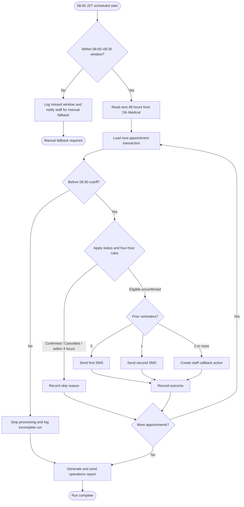

# Morning Appointment Confirmation and Reminder Batch {{RUN_TOKEN}} — Solution Design Document
# Solution Design Document — Morning Appointment Confirmation and Reminder Batch

## Document History

| Date | Version | Author | Role | Comments |
|---|---|---|---|---|
| 2026-10-09 | 1.0 | UiPath Business Analysis Team | Generated by uipath-planner | Initial SDD generated from the confirmed PDD |

<!-- DO NOT RENAME: uipath-planner detects SDDs via this exact heading or the marker below. -->
<!-- planner-handoff:v1 -->
## Planner Handoff

| Field | Value |
|---|---|
| **Status** | draft |
| **Execution autonomy** | interactive |
| **Delivery model** | cloud |
| **SDD scope** | single-product |
| **Project list section** | §11 Project Structure |
| **Tasks file** | morning-appointment-confirmation-and-reminder-batch-tasks.md |
| **Generated by** | uipath-planner |
| **Generation date** | 2026-10-09 |
| **Template validation** | passed |

## Recommended Scope

**Recommendation:** SINGLE_PRODUCT — UiPath RPA Process
**Delivery model:** cloud — Japan-region Automation Cloud tenant required for production
**Blocked by platform:** none for the recommended RPA scope
**Need profile:** A deterministic 08:00 JST batch must read structured appointment data, apply fixed rules, send approved SMS messages, persist outcomes, and finish by 08:30 JST.

**Architecture decision:** Use one unattended RPA Process with REFramework-style per-appointment transaction handling. Do not split into Dispatcher/Performer/Reporting projects unless independent scaling, ownership, deployment cadence, or queue-isolated recovery is confirmed.

## Action Required — SME Review Items

| # | Section | Item | Question | Default applied | Blocking |
|---|---|---|---|---|---|
| 1 | §9 Application Inventory | DK-Medical access | Is a stable DK-Medical API available, or must the robot use the UI? | API-first adapter with Japan-hosted Windows UI fallback | yes |
| 2 | §9 Application Inventory | NTT Docomo access | Which approved endpoint, authentication method, and response codes are available? | Direct HTTPS from the approved robot network path | yes |
| 3 | §5 Data Definitions | Reminder history store | Which existing Japan-resident structured resource should persist reminder events? | Existing approved Japan-resident store; Orchestrator Storage Bucket or Data Fabric entity preferred | no |
| 4 | §9 Application Inventory | Staff callback destination | Is Action Center approved for callback actions and which staff group receives them? | Asynchronous Action Center action without batch wait | no |
| 5 | §16 Deployment Environment | Automation Cloud residency | Is the production tenant on an eligible Japan region and plan? | Japan-region tenant required; no production use until verified | yes |
| 6 | §16 Deployment Environment | Report delivery | Which Japan-resident mail relay or approved connection sends the report? | Approved Japan-resident SMTP, Graph, or equivalent relay; no default platform notification for PII | yes |
| 7 | §16 Deployment Environment | Retention and access | What retention, purge, and access rules apply to reminder history and reports? | Least privilege and the shortest approved retention period | no |
| 8 | §16 Deployment Environment | Existing resources | Which tenant assets, connections, queues, libraries, and robot host are available? | Reuse existing approved resources; CLI discovery unavailable in this environment | no |

## Table of Contents

1. Process Overview
2. Process Map
3. Detailed Process Steps
4. Business Rules
5. Data Definitions
6. Value Mappings
7. Exception Handling
8. Error Handling
9. Application Inventory
10. Master Project Architecture
11. Project Structure
13. Implementation Mode
14. Packages
15. Credentials & Assets
16. Deployment Environment
17. Testing Strategy
18. Next Steps

## 1. Process Overview

| Field | Value |
|---|---|
| **Process name** | Morning Appointment Confirmation and Reminder Batch |
| **Objective** | Automate the daily appointment confirmation/reminder batch while preserving staff callbacks and appointment-record protection. |
| **Department / Function** | Clinic operations — front desk and morning appointment follow-up |
| **Schedule** | Daily at 08:00 JST; hard operating window ends at 08:30 JST |
| **Volume** | [SME REVIEW] daily appointment volume not recorded in the PDD |
| **Avg. handling time (manual)** | Approximately 20–25 minutes |
| **Avg. handling time (automated target)** | Complete the valid batch by 08:30 JST; per-item timing [SME REVIEW] |
| **Exception rate** | [SME REVIEW] baseline not recorded; gateway failures and incomplete runs must be counted |
| **Source PDD** | drafts/morning-appointment-confirmation-and-reminder-batch-PDD.md |

### Delivery Team

| Role | Name | Contact |
|---|---|---|
| SME / Process Owner | Yuki Tanaka — Clinic operations manager | [SME REVIEW] |
| IT Compliance | Ishikawa-san | [SME REVIEW] |
| Patient Communications | Patient communications team | [SME REVIEW] |
| Technical Consultant | Kenji Adachi — Adachi Systems | [SME REVIEW] |

### In Scope

- Daily 08:00 JST scheduled processing of appointments in the next 48 hours.
- Read-only retrieval and classification from DK-Medical v3.2.
- Status, four-hour, and reminder-count rule evaluation.
- First and second SMS reminders through the NTT Docomo business SMS gateway.
- Reminder, skip, failure, cutoff, and follow-up event recording.
- Staff callback action creation after two reminders without confirmation.
- Daily operations report delivery before the 09:00 handover when the batch completes within the window.
- Japan-resident processing, storage, logging, and report-channel controls.

### Out of Scope

- Appointment booking, cancellation, rescheduling, or other appointment-record updates.
- Online booking portal redesign.
- Automated cancellation decisions.
- Automated completion of the staff callback.
- Assumption of weekday behavior for Sunday special clinics.

### Assumptions

- DK-Medical provides a compliant unattended access path, either API or UI.
- The NTT Docomo business SMS account and approved templates remain available.
- Staff can perform manual fallback when the window is missed or exceeded.
- The production Automation Cloud tenant and all patient-data stores are Japan-resident.
- Reminder history persists across daily runs and is keyed by appointment and patient identifiers.

## 2. Process Map



| Step | Description | Application |
|---|---|---|
| 1 | Validate schedule and operating window | Orchestrator / robot runtime |
| 2 | Retrieve next-48-hour appointments | DK-Medical v3.2 |
| 3 | Load and validate one appointment transaction | RPA process and reminder store |
| 4 | Apply ordered status and four-hour rules | RPA process |
| 5 | Read prior reminder count and select route | Reminder history store |
| 6 | Send first or second approved SMS | NTT Docomo business SMS gateway |
| 7 | Record skip, send, failure, cutoff, and follow-up outcome | Reminder history store |
| 8 | Create staff callback action after two reminders | Action Center or approved follow-up destination |
| 9 | Generate and deliver operations report | Japan-resident mail channel |
| 10 | Stop safely and hand remaining work to staff | RPA process / front-desk operations |

## 3. Detailed Process Steps

### Step Summary

| # | Action | Application | Input | Output | Rules | Errors |
|---|---|---|---|---|---|---|
| 1 | Start scheduled run and enforce window | Orchestrator / robot | JST time, schedule | Valid run context or fallback status | BR-003, BR-010 | E-001, E-002 |
| 2 | Retrieve appointments in next 48 hours | DK-Medical | Look-ahead window, read credentials | Appointment collection | BR-004 | E-003 |
| 3 | Load one transaction and reminder history | RPA and reminder store | Appointment ID, patient ID | Validated transaction context | BR-009 | E-004, E-005 |
| 4 | Classify appointment | RPA rules | Status, appointment time, run time | Skip, eligible, or follow-up route | BR-005 | B-001 |
| 5 | Select reminder sequence | Reminder store and RPA | Prior count | Sequence 1, sequence 2, or callback | BR-006, BR-007 | B-002 |
| 6 | Send approved SMS | NTT Docomo gateway | Mobile, template, appointment details | Provider response | BR-008 | E-006 |
| 7 | Record event outcome | Reminder store | Decision, result, timestamp, IDs | Auditable event | BR-007, BR-009 | E-005 |
| 8 | Create staff callback action | Action Center / follow-up destination | Appointment and reminder history | Staff-actionable callback item | BR-007 | E-007 |
| 9 | Generate and deliver report | Approved Japan-resident mail channel | Batch counters and exceptions | Operations report | BR-010 | E-008 |
| 10 | Complete or fall back | RPA and staff | Run status, remaining records | Completed or manual-fallback outcome | BR-003, BR-010 | E-002 |

### Step 2 — Retrieve and classify appointment source data

The process reads the next 48 hours from DK-Medical without modifying appointment records. The access layer will expose a stable internal contract to the rest of the workflow so API and UI access can be substituted without changing business rules.

### Step 6 — Send reminder

The process sends only the approved first or second message selected by the reminder count. A provider failure is recorded and reported; the same session does not retry that SMS.

### Step 9 — Generate operations report

The report includes totals, skip reasons, reminder sequence counts, SMS failures, callback actions, cutoff results, and any records not processed. Patient details are restricted to the approved recipient group and are not written to normal robot logs.

## 4. Business Rules

| ID | Rule Name | Description | Trigger Condition | Validation | Affected Steps |
|---|---|---|---|---|---|
| BR-001 | Daily schedule | Start one batch daily at 08:00 JST. | Scheduled trigger fires | Time zone = Asia/Tokyo | 1 |
| BR-002 | Hard operating window | Process only during 08:00–08:30 JST. | Run starts or continues | Current time within configured window | 1, 10 |
| BR-003 | Look-ahead window | Read appointments in the next 48 hours. | Valid run context | Appointment time in configured look-ahead range | 2 |
| BR-004 | Read-only appointment source | Never book, cancel, reschedule, or otherwise modify appointments. | Any DK-Medical interaction | Access policy is read-only | 2, 4 |
| BR-005 | Status exclusions | Skip Confirmed and Cancelled appointments. | Appointment retrieved | Status ∈ {Confirmed, Cancelled, Unconfirmed} | 4 |
| BR-006 | Four-hour exclusion | Skip unconfirmed appointments within four hours of the run. | Status = Unconfirmed | HoursToAppointment < 4 | 4 |
| BR-007 | Reminder sequence | Send sequence 1 with zero prior reminders and sequence 2 with one. | Eligible unconfirmed appointment | PriorReminderCount ∈ {0, 1} | 5, 6 |
| BR-008 | Reminder cap | Never send more than two reminders in a scheduling cycle. | PriorReminderCount ≥ 2 | ReminderSequence ∈ {1, 2}; no third sequence | 5, 6, 8 |
| BR-009 | SMS failure handling | Log and report gateway failures without same-session retry. | Provider response is failure | Failure is recorded before transaction completion | 6, 7, 9 |
| BR-010 | Human follow-up | Route appointments with two or more reminders to staff; never auto-cancel. | PriorReminderCount ≥ 2 and still unconfirmed | Follow-up action created or fallback reported | 7, 8 |
| BR-011 | Japan residency | Keep patient data, processing, storage, logs, and reporting on approved Japan-resident infrastructure. | Any patient-data movement | Residency evidence present before production | 2, 6, 7, 9 |
| BR-012 | Cutoff fallback | Stop at 08:30, report remaining records, and return work to staff. | Current time reaches cutoff | Remaining records marked NotProcessed | 1, 9, 10 |

## 5. Data Definitions

### Transaction Data

| Key | Type | Source | Description |
|---|---|---|---|
| AppointmentId | String | DK-Medical | Unique appointment reference used for routing and idempotency |
| PatientId | String | DK-Medical | Patient reference used to key reminder history |
| AppointmentStatus | String | DK-Medical | Confirmed, Cancelled, or Unconfirmed |
| AppointmentDateTime | DateTime | DK-Medical | Appointment time in the clinic time zone |
| PatientMobile | String | DK-Medical | Mobile number required for an SMS attempt |
| PriorReminderCount | Integer | Reminder store | Count for the scheduling cycle |
| ReminderSequence | Integer | RPA rules | 1 or 2 for a sent reminder |
| CorrelationId | String | RPA process | Per-run/per-item trace identifier |

### Output Data

| Key | Type | Description |
|---|---|---|
| Decision | String | Send, Skip, StaffCallback, NotProcessed, or Failed |
| SkipReason | String | Confirmed, Cancelled, Within4Hours, or other controlled reason |
| DeliveryResult | String | Provider result for an attempted SMS |
| EventTimestamp | DateTime | Timestamp for the recorded event |
| FollowUpActionId | String | Action Center or approved follow-up reference |
| ReportStatus | String | Report generated, sent, or failed |

### Data Protection Rules

- Patient name, mobile number, appointment details, and identifiers are PII or PII-linked data.
- Full SMS payloads and mobile numbers are excluded from standard robot logs.
- Patient-bearing stores must be Japan-resident and access-controlled.
- Retention and purge values remain `[SME REVIEW]` until IT Compliance confirms them.

## 6. Value Mappings

### Appointment Status to Processing Route — DK-Medical to RPA

| Source Value | Target Value |
|---|---|
| Confirmed | Skip — Confirmed |
| Cancelled | Skip — Cancelled |
| Unconfirmed and less than four hours to appointment | Skip — Within4Hours |
| Unconfirmed and four hours or more to appointment, prior count 0 | Send — ReminderSequence1 |
| Unconfirmed and four hours or more to appointment, prior count 1 | Send — ReminderSequence2 |
| Unconfirmed and four hours or more to appointment, prior count 2 or more | StaffCallback |

### Gateway Result to Event Result — NTT Docomo to Reminder Log

| Source Value | Target Value |
|---|---|
| Provider success response | SmsSent |
| Provider failure response | SmsDeliveryFailure |
| Missing or invalid response | SmsDeliveryFailure — response not trusted |

## 7. Exception Handling

| ID | Exception Name | Trigger Step | Trigger Condition | Action |
|---|---|---|---|---|
| B-001 | Confirmed appointment | 4 | Appointment status is Confirmed | Record skip; do not send SMS |
| B-002 | Cancelled appointment | 4 | Appointment status is Cancelled | Record skip; do not send SMS |
| B-003 | Four-hour exclusion | 4 | Unconfirmed appointment is less than four hours away | Record skip; do not send SMS |
| B-004 | Reminder limit reached | 5 | Prior reminder count is 2 or more | Create staff callback action; do not send SMS |
| B-005 | Invalid contact detail | 5–6 | Eligible record lacks a valid mobile number | Record controlled failure; report for staff review |
| B-006 | Run outside window | 1 | Trigger is outside 08:00–08:30 JST | Do not process; notify staff for manual fallback |
| B-007 | Window exceeded | 1, 10 | Current time reaches 08:30 | Stop, mark remaining records NotProcessed, report fallback |
| B-008 | Sunday special clinic | 1, 9 | Sunday behavior or recipient rules differ | Apply confirmed policy only; otherwise route to manual handling |

**Default handler:** For any unanticipated business exception, preserve the appointment record, record a masked error and correlation ID, include the item in the report, and route it to staff review.

## 8. Error Handling

| ID | Error Name | Trigger Step | Trigger Condition | Retry Policy | Action |
|---|---|---|---|---|---|
| E-001 | Schedule or clock error | 1 | JST time cannot be established | No retry inside the run | Stop safely and notify operations |
| E-002 | Duplicate or overlapping job | 1 | Another batch is active | No concurrent retry | Stop the duplicate and retain the active run |
| E-003 | DK-Medical unavailable | 2 | API/UI access fails | `[DEFAULT]` infrastructure retry up to 3 times before stopping; no appointment writes | Log, report, and manual fallback |
| E-004 | Reminder store unavailable | 3, 5, 7 | Read/write cannot be completed | `[DEFAULT]` infrastructure retry up to 3 times; never send without reliable count | Stop affected processing and report |
| E-005 | Event write failure | 7 | Outcome cannot be persisted | `[DEFAULT]` retry up to 3 times; do not mark transaction complete | Report unresolved item and prevent duplicate resend |
| E-006 | NTT Docomo API failure | 6 | Provider returns error or timeout | No same-session SMS retry | Record failure, report it, continue with next item |
| E-007 | Callback action creation failure | 8 | Action Center or follow-up destination rejects item | `[DEFAULT]` retry up to 3 times; then manual fallback | Report staff callback requirement |
| E-008 | Report delivery failure | 9 | Approved mail channel rejects report | `[DEFAULT]` retry up to 3 times; do not use unapproved channel | Alert operations and retain report artifact securely |
| E-009 | Credential failure | 2, 6, 9 | Asset unavailable or expired | No password guessing; follow credential rotation process | Stop affected integration and notify support |
| E-010 | Unhandled system exception | Any | Unexpected workflow or host failure | Framework policy; no business-rule bypass | Log masked details, stop safely, and use fallback |

**Default handler:** For any unanticipated system error, stop the affected transaction or run safely, preserve patient-data boundaries, record a masked diagnostic, and notify the approved support route.

## 9. Application Inventory

No Orchestrator processing queue is defined in the initial single-project design. The appointment collection is processed in memory, while reminder history is persisted in a separate Japan-resident structured store. If an existing approved queue is selected during implementation, its item schema, encryption, retention, and retry ownership must be added before build completion; queue retries must not cause a second SMS attempt in the same session.

## 10. Master Project Architecture

### Option B — Single Project

**Decomposition signals matched:** per-appointment independent processing and reporting were identified, but no independent scaling, ownership, deployment cadence, or queue-isolated recovery boundary was confirmed. The design therefore keeps one RPA Process with internal transactional phases rather than creating separate Dispatcher, Performer, and Reporting projects.

The process uses an in-memory or retrieved appointment collection as its transaction source. Reminder history is a persistent data store, not an Orchestrator processing queue. If a future capacity study proves that appointment retrieval and per-item processing require independent scaling, the project can be revisited as a Master Project without changing the business rules.

## 11. Project Structure

### Solution / Project Breakdown

| Project | Product | GitHub Repository | Folder | Attended / Unattended |
|---|---|---|---|---|
| MorningAppointmentConfirmation | RPA Process | [SME REVIEW] | [SME REVIEW] | Unattended |

### Reusable Components

| Type | Name | Details |
|---|---|---|
| reused | DK-Medical v3.2 | Existing appointment source of truth and approved access path |
| reused | NTT Docomo business SMS gateway | Existing business SMS capability and approved templates |
| reused | Japan-resident Automation Cloud tenant resources | Reuse only after region and service residency verification |
| new-reusable | DK-Medical access adapter | Encapsulates API/UI access and preserves a read-only contract |
| new-reusable | SMS gateway adapter | Encapsulates authentication, payload creation, and provider response mapping |

### Project Type

| # | Project Name | Sub-type |
|---|---|---|
| 1 | MorningAppointmentConfirmation | Process |

### Project Mode Decision

| # | Project | Type | Compatibility | Authoring | Attendance | Initiation | Framework | Persistence (long-running) | Packaging |
|---|---|---|---|---|---|---|---|---|---|
| 1 | MorningAppointmentConfirmation | Process | Windows if DK-Medical is UI-only; Cross-platform if both integrations are headless | Hybrid | Unattended | Scheduled | REFramework-style | NO — batch creates follow-up action and does not wait | Standalone package |

### Recommended Structure

```text
MorningAppointmentConfirmation/
├── project.json
├── Main.xaml
├── Framework/
│   ├── InitAllSettings.xaml
│   ├── InitAllApplications.xaml
│   ├── GetTransactionData.xaml
│   ├── Process.xaml
│   ├── SetTransactionStatus.xaml
│   └── CloseAllApplications.xaml
├── Workflows/
│   ├── RetrieveAppointments.xaml or .cs
│   ├── ClassifyAppointment.xaml or .cs
│   ├── SendReminderSms.xaml or .cs
│   ├── RecordReminderEvent.xaml or .cs
│   ├── CreateStaffCallbackAction.xaml
│   ├── GenerateOperationsReport.xaml or .cs
│   └── ApplyCutoffAndFallback.xaml
├── Data/
│   └── Config.xlsx or approved configuration store
└── Tests/
```

### Workflow Inventory

| # | Workflow File | Responsibility | PDD Steps | Inputs | Outputs |
|---|---|---|---|---|---|
| 1 | Main.xaml | Initialize, invoke transaction loop, finalize run | 1–10 | Config, current time | Run status |
| 2 | RetrieveAppointments.xaml or .cs | Read next 48 hours without writing appointments | 2 | Window, credentials | Appointment collection |
| 3 | GetTransactionData.xaml | Return next appointment before cutoff | 3, 10 | Collection, index, cutoff | Transaction data |
| 4 | ClassifyAppointment.xaml or .cs | Apply status and four-hour rules | 4 | Appointment data | Decision and reason |
| 5 | ReadReminderHistory.xaml or .cs | Read prior events and calculate count | 3, 5 | Appointment ID, patient ID | Reminder count |
| 6 | SendReminderSms.xaml or .cs | Send sequence-specific SMS once | 6 | Approved template, mobile, appointment data | Provider response |
| 7 | RecordReminderEvent.xaml or .cs | Persist event and outcome | 7 | IDs, decision, result, timestamp | Event record |
| 8 | CreateStaffCallbackAction.xaml | Create asynchronous callback action | 8 | Appointment and reminder details | Action ID |
| 9 | GenerateOperationsReport.xaml or .cs | Aggregate counters and exceptions | 9 | Run events | Report artifact |
| 10 | ApplyCutoffAndFallback.xaml | Stop safely and identify remaining work | 1, 10 | Current time, remaining items | Incomplete-run outcome |

### Workflow Dependencies

```text
Main.xaml
├── calls RetrieveAppointments.xaml or .cs
├── calls GetTransactionData.xaml
├── calls Process.xaml
│   ├── calls ClassifyAppointment.xaml or .cs
│   ├── calls ReadReminderHistory.xaml or .cs
│   ├── calls SendReminderSms.xaml or .cs
│   ├── calls RecordReminderEvent.xaml or .cs
│   └── calls CreateStaffCallbackAction.xaml
├── calls ApplyCutoffAndFallback.xaml
└── calls GenerateOperationsReport.xaml or .cs
```

## 13. Implementation Mode

**Recommendation:** Hybrid

The process combines a transactional XAML shell and rule flow with integration adapters that may require JSON parsing, pagination, response-code mapping, and structured data handling. XAML remains the primary orchestration surface; bounded coded workflows may be used for API and data transformations. If both systems prove simple and activity-compatible, the build team may use XAML-only without changing the business architecture.

## 14. Packages

| Package | Version | Purpose |
|---|---|---|
| `UiPath.System.Activities` | pin at build | Core workflow, data, files, logging, and Orchestrator activities |
| `UiPath.WebAPI.Activities` | pin at build | Direct HTTPS requests when approved connectors are not used |
| `UiPath.Persistence.Activities` | pin at build if Action Center action activities require it | Creation of asynchronous staff callback actions; no batch wait/resume |
| `UiPath.UIAutomation.Activities` | pin at build if DK-Medical is UI-only | Read-only DK-Medical UI access fallback |
| `UiPath.IntegrationService.Activities` | pin at build if an existing approved connector is selected | Runtime host for tenant-approved connector activities |
| `UiPath.Mail.Activities` or `UiPath.MicrosoftOffice365.Activities` | pin at build after mail route confirmation | Approved Japan-resident report delivery path; select one based on confirmed protocol |

## 15. Credentials & Assets

| Asset Name | Type | Description | Notes |
|---|---|---|---|
| DKMedical_ReadOnly_Credential | Credential / Secret | Read-only DK-Medical access | Exact authentication method `[SME REVIEW]` |
| NTTDocomo_Sms_Credential | Credential / Secret | NTT Docomo API authentication | Store only in approved credential provider |
| ReminderStore_Connection | Credential / Secret | Connection to reminder-history store | Japan-resident store required |
| ReportChannel_Credential | Credential / Secret | Approved mail or connector authentication | Do not use default platform notification for PII |
| Sms_Template_First | Text | Approved first reminder template | Owned by Patient Communications |
| Sms_Template_Second | Text | Approved second reminder template | Owned by Patient Communications |
| Operations_Distribution_List | Text | Approved report recipients | Membership `[SME REVIEW]` |
| Operating_Window_Start | Text | `08:00` JST | Configuration asset |
| Operating_Window_End | Text | `08:30` JST | Configuration asset |
| Lookahead_Hours | Integer | `48` | Configuration asset |
| Reminder_Maximum | Integer | `2` | Configuration asset and control |

## 16. Deployment Environment

### Robot & Runtime

| Field | Value |
|---|---|
| **Robot type** | Unattended |
| **Trigger** | Scheduled daily at 08:00 JST |
| **Orchestrator tenant / folder** | Japan-region Automation Cloud tenant / `[SME REVIEW]` production folder |
| **UiPath Studio version** | `[SME REVIEW]` |
| **UiPath Robot version** | `[SME REVIEW]` |
| **Orchestrator** | Automation Cloud — Japan region required |
| **Cross-platform / Windows-only** | Windows if DK-Medical requires UI; Cross-platform if both integrations are headless |
| **Recommended screen resolution** | `[SME REVIEW]` if UI automation is required |
| **Source repository** | `[SME REVIEW]` |
| **Shared libraries referenced** | `[SME REVIEW]` tenant discovery unavailable; none assumed |

### Environments (DEV / UAT / PROD)

| Item | DEV | UAT | PROD | Used By |
|---|---|---|---|---|
| Orchestrator + Tenant/Service | `[SME REVIEW]` | `[SME REVIEW]` | Japan-region Automation Cloud tenant `[SME REVIEW]` | Process |
| Folder | `[SME REVIEW]` | `[SME REVIEW]` | `[SME REVIEW]` | Process |

### Development & Production Hosts

| Environment | Machine Name(s) / VM Pool | Notes |
|---|---|---|
| Development | `[SME REVIEW]` | Must not use live patient data |
| UAT | `[SME REVIEW]` | Use synthetic or anonymized patient data within Japan |
| Production | `[SME REVIEW]` | Japan-resident unattended host if UI/private-network access is required |

### Runtime Prerequisites

- Japan-region Automation Cloud tenant and verified service residency.
- Robot host and network route located within the approved Japan boundary when patient data is processed.
- Network access to DK-Medical and NTT Docomo over approved TLS endpoints.
- Approved credential provider and least-privilege robot account.
- DK-Medical UI extension and browser only if the API route is unavailable.
- Approved Japan-resident reminder store and report-delivery route.
- No patient data on developer workstations, unapproved fileshares, or default notification services.

### Scalability & Concurrency

| Field | Value |
|---|---|
| **Volume** | `[SME REVIEW]` appointments per daily run |
| **Avg handling time (automated)** | `[SME REVIEW]` minutes per appointment |
| **Peak window** | 08:00–08:30 JST |
| **Completion SLA** | Valid completed run and report by 08:30 JST |
| **Exception + retry factor** | `[DEFAULT]` capacity factor 1.15; SMS failures are not retried in the same session |
| **Utilization target** | `[DEFAULT]` 0.8 |
| **Required runtimes** | `[SME REVIEW]` after volume and per-item timing are measured |
| **Concurrent job limit** | 1 scheduled batch; no overlapping jobs |
| **Machine template / VM pool** | `[SME REVIEW]` Japan-resident unattended pool if required |
| **Robot accounts** | `[SME REVIEW]` least-privilege account count |
| **Session requirements** | Headless if API-only; active Windows session if UI fallback is required |
| **Calendars / time zone** | JST; Sunday special-clinic policy `[SME REVIEW]` |
| **Overlapping-job policy** | Skip or stop a duplicate trigger; never run two batches concurrently |
| **License assumption** | `[SME REVIEW]` unattended runtime entitlement |

### Operational Support

| Concern | Design decision |
|---|---|
| **Idempotency** | Appointment ID plus reminder sequence; check reminder history before sending |
| **Checkpoint & restart** | Persist each event before marking the transaction complete; reconcile incomplete records after a failed run |
| **Session recovery** | Recover infrastructure errors according to transaction policy; never retry a failed SMS in the same session |
| **Correlation & logging** | Correlation ID, masked appointment reference, decision, result, and timestamps; no full PII in logs |
| **Alerting** | Alert on missed window, cutoff, gateway failure, report failure, or repeated infrastructure failure |
| **Dashboards** | Orchestrator job status and approved operational report; Insights use `[SME REVIEW]` if enabled |
| **Reprocessing** | Staff-led review and controlled rerun after root cause correction; duplicate prevention remains mandatory |
| **Support ownership** | Clinic operations with IT support; runbook location `[SME REVIEW]` |
| **Business continuity** | Manual review and contact fallback; appointment records remain unchanged |

### Security & Data Handling

| Concern | Design decision |
|---|---|
| **Data classification & PII** | Patient name, mobile, appointment details, and linked IDs are PII or PII-linked; mask logs and restrict report recipients |
| **Credentials** | Orchestrator credential/secret assets or approved provider; no secrets in configuration files or logs |
| **Service accounts & privilege** | Read-only DK-Medical access, restricted SMS permission, restricted report and store access |
| **Encryption** | TLS in transit; encryption at rest for every approved Japan-resident store; queue encryption if a queue is introduced |
| **Retention & audit** | `[SME REVIEW]` retention and purge periods; retain residency and access evidence |
| **Network** | Japan-resident robot or approved Japan relay; allowlists and internal CA requirements `[SME REVIEW]` |

### Delivery Quality Gates

| Gate | Decision |
|---|---|
| **Package versioning** | Pin dependencies at build; semantic versioning and controlled promotion |
| **Workflow Analyzer** | `[DEFAULT]` enforce the approved ruleset before publish |
| **Source control** | `[SME REVIEW]` repository and branch/review policy |
| **CI validation** | `[SME REVIEW]` analyze and test on pull request or pre-publish |
| **Promotion path** | DEV → UAT → PROD with operations and IT Compliance approval |
| **Rollback** | Retain previous package; deactivate the current process and restore the last approved version |
| **Production smoke test** | Verify one synthetic or approved production-representative appointment, report delivery, and no appointment modification |

### Non-Functional Requirements

| Dimension | Requirement / Design decision |
|---|---|
| **Security** | Least privilege, encrypted approved stores, masked logs, credential assets, no patient data in default notifications |
| **Performance** | Process independent appointments within the 30-minute window; measure per-item timing before runtime sizing |
| **Scalability** | Start with one daily job; revisit decomposition only if measured volume or isolation needs create an independent boundary |
| **Availability / Resilience** | Cutoff guard, event persistence, duplicate prevention, manual fallback, and no same-session SMS retry |
| **Logging & Monitoring** | Structured masked events, run summary, gateway failures, incomplete-run warnings, and report delivery status |
| **Compliance** | Japan-resident processing, storage, execution, logging, and approved report channel; PIPA/certification evidence required |

## 17. Testing Strategy

### Requirements Traceability

| PDD Step / Rule | Covered By |
|---|---|
| Steps 1–2 / BR-003, BR-004 | T-01, T-02, T-11 |
| Steps 3–5 / BR-005, BR-006, BR-007 | T-03 through T-08, T-12 |
| Step 6 / BR-008 | T-09, T-13 |
| Steps 7–8 / BR-007, BR-009 | T-07, T-08, T-14 |
| Steps 9–10 / BR-010 | T-10, T-15, T-16 |
| Japan residency controls | T-17, T-18, T-19 |

### Canonical Test Case

| Field | Value |
|---|---|
| Run time | 08:00 JST |
| Look-ahead | 48 hours |
| Appointment status | Unconfirmed |
| Time to appointment | At least 4 hours |
| Prior reminder count | 0 |
| Expected sequence | First SMS |
| Appointment record | Unchanged |
| Data location | Approved Japan-resident services only |

### Happy Path Assertions

1. The scheduled job starts at 08:00 JST and creates one valid run context.
2. The process reads only appointments in the next 48 hours.
3. Confirmed and cancelled appointments are not sent SMS messages.
4. An eligible appointment with zero prior reminders receives sequence 1.
5. An eligible appointment with one prior reminder receives sequence 2.
6. Every decision and provider result is persisted with a timestamp and correlation ID.
7. The operations report is generated and sent through the approved report channel.
8. Appointment records remain unchanged.

### Exception Test Cases

| Exception ID | Test Setup | Trigger | Expected Outcome |
|---|---|---|---|
| B-001 | Confirmed appointment | Status is Confirmed | Skip logged; no SMS |
| B-002 | Cancelled appointment | Status is Cancelled | Skip logged; no SMS |
| B-003 | Appointment within four hours | Appointment is less than four hours away | Skip logged; no SMS |
| B-004 | Two prior reminders | Count is 2 or more and status remains unconfirmed | Callback action created; no SMS |
| B-005 | Missing mobile number | Eligible record has no valid mobile | Failure reported; no SMS attempt or controlled validation outcome |
| B-006 | Cutoff reached | Current time reaches 08:30 | Stop safely; remaining records marked not processed; report includes them |
| B-007 | Run starts outside window | Trigger occurs outside 08:00–08:30 | No processing; manual fallback notification |

### System Error Scenarios

| Error ID | Testable in Dev? | How to Simulate | Expected Outcome |
|---|---|---|---|
| E-001 | Yes | Trigger duplicate schedule | Second run is skipped or stopped |
| E-002 | Yes | Advance clock past cutoff | Incomplete run and manual fallback |
| E-003 | Yes | Deny DK-Medical access | Run failure is logged and reported; no appointment writes |
| E-004 | Yes | Make reminder store unavailable | Controlled failure; no SMS without reliable count |
| E-005 | Yes | Force event-store write failure | Transaction remains unresolved and is reported |
| E-006 | Yes | Return NTT Docomo error response | Failure logged and reported; no same-session retry |
| E-007 | Yes | Deny Action Center creation | Callback requirement reported for staff fallback |
| E-008 | Yes | Block report channel | Report failure alerted and retained for operations follow-up |
| E-009 | Yes | Expire a credential asset | Clean failure with no plaintext secret in logs |

### Non-Functional Tests

| Test | Scenario | Expected |
|---|---|---|
| Performance / load | Production-representative appointment volume within 08:00–08:30 | Batch completes within cutoff or reports remaining records |
| Duplicate prevention | Repeat the same appointment transaction | No duplicate SMS for the same appointment and sequence |
| Recovery / restart | Stop the job after event persistence and restart | No lost or doubled reminder event |
| Credential expiration | Use expired credential asset | Controlled alert; no plaintext leakage or lockout |
| UI compatibility | Run UI fallback against supported DK-Medical/browser versions | Read-only extraction succeeds or controlled failure occurs |
| Security | Run with least-privilege account | Required work succeeds; unauthorized appointment update fails |
| Residency | Inspect tenant, robot, store, logs, report route, and network evidence | Every patient-data path is within the approved Japan boundary |

### UAT Acceptance Criteria

1. The run starts at 08:00 JST and never performs routine processing outside the permitted window.
2. The next-48-hour and four-hour rules produce the expected classifications.
3. No appointment receives more than two reminders in its scheduling cycle.
4. SMS failures appear in both the event log and the daily report without same-session retry.
5. Two-reminder appointments receive a staff callback action and no automated cancellation.
6. The report is delivered by 08:30 for a valid completed run.
7. Every patient-data store and processing path has Japan-residency evidence.
8. Appointment records remain unchanged in all tests.

### Test Data & Cleanup

| Item | Decision |
|---|---|
| **Test data source** | Synthetic or anonymized patient and appointment data within Japan; live production data requires explicit approval `[SME REVIEW]` |
| **Cleanup** | Remove test events, actions, reports, and temporary credentials according to the approved retention policy |

### Production Verification

1. Confirm tenant region and residency evidence before deployment.
2. Run a controlled production smoke test with an approved appointment record.
3. Verify no appointment modification occurred.
4. Verify one report reaches the approved recipient group.
5. Verify logs contain masked identifiers only.

## 18. Next Steps

This SDD captures the approved architecture and the implementation constraints. The next phase is task derivation, not implementation execution.

1. Load `uipath-planner` with this SDD path to derive the specialist task list.
2. Resolve the blocking SME review items: DK-Medical access, NTT Docomo contract, Japan-region tenant, and approved report channel.
3. Confirm the reminder-history store and Action Center assignment model.
4. Confirm tenant assets, connections, libraries, folders, robot host, and repository.
5. Build and test in Japan-resident DEV/UAT environments using synthetic or anonymized data.
6. Complete the residency evidence pack and obtain IT Compliance approval.
7. Promote through DEV → UAT → PROD with clinic operations sign-off.

### Terminal artefact — packaging per the project mode decision

**Packaging = Standalone package.** This is a single RPA Process, so the terminal build artefact is a versioned `.nupkg` published to the approved Orchestrator feed. Deployment and feed operations route to `uipath-platform`; workflow authoring and testing route to `uipath-rpa`.
