<!-- pdd:doc header="BCS Commercial Credit Evaluation Process {{RUN_TOKEN}} | Process Definition Document" footer="Confidential | [Organization name to be confirmed]" client="[Organization name to be confirmed]" author="Business Analysis Team" date="09 October 2026" version="1.0" process="BCS Commercial Credit Evaluation Process {{RUN_TOKEN}}" -->

# BCS Commercial Credit Evaluation Process {{RUN_TOKEN}}

<!-- pdd:section id=business-context sources=as-is/overview.md,as-is/pain-points.md,to-be/overview.md,to-be/benefits.md reproj=g0 -->
# 1. Business Context

## 1.1 Problem Statement

Commercial-credit evaluations currently require analysts to consolidate customer declarations, signed CPS information, tax and financial statements, **Equifax** reports, internal credit history, qualitative screening, email responses, and supporting files across multiple tools. The source material does not provide a confirmed volume, cycle-time baseline, or headline failure rate; it does show material handling effort from system pivots, manual reconciliation, conservative reclassification, fragmented evidence, and repeated query cycles. These conditions create decision-delay, data-quality, auditability, and credit-risk exposure, particularly when declared information conflicts with external debt or payment behavior.

==TBD: confirm current volume, cycle-time distribution, backlog, first-pass quality, and rework rate before setting numeric targets==

## 1.2 Objectives

- Establish a measured baseline for evaluation volume, readiness, decision turnaround, clarification aging, rework, and activation latency, then set agreed targets for improvement.
- Increase straight-through preparation and routing by using agents for document intake, evidence classification, completeness checks, data normalization, scoring support, recommendation assembly, and approval routing.
- Preserve human accountability for material financial interpretation, compliance findings, policy exceptions, overrides, Banking challenges, and final Credit approval.
- Improve evidence traceability by linking documents, extracted values, calculations, rule versions, decisions, approvals, and downstream activation results to one case.
- Reduce manual re-keying and closure defects through controlled **Salesforce** writeback and validated **LAMS** activation with reconciliation.
- Make exceptions, SLA aging, rework loops, and unresolved policy items visible rather than allowing them to remain in informal email or personal work files.

==TBD: confirm numeric acceptance thresholds for straight-through rate, readiness, decision SLA, exception aging, override rate, and Salesforce/LAMS reconciliation==

## 1.3 Expected Value

The target process should reduce repetitive evidence handling, improve consistency of analysis preparation, shorten the time spent waiting for and consolidating clarifications, and give Credit a more explainable recommendation package. It should also make the boundary between automated preparation and human authority explicit, improve audit readiness, and prevent downstream activation from being treated as complete without confirmation. Measured targets and acceptance signals are defined in Section 10.

[Refine section](delegate:refine-section?section=business-context)

<!-- pdd:section id=scope sources=as-is/scope.md,entities/applications/ reproj=g0 -->
# 2. Scope

## 2.1 Process Identity

**Table 2-1. Process identity**

| Process name | Process group | Process identifier | Industry |
|---|---|---|---|
| BCS Commercial Credit Evaluation Process | Commercial Credit Evaluation & Approval | BCS-CCE-001 | Financial services / business banking |

## 2.2 Scope Boundaries

**Table 2-2. Scope boundaries**

| In Scope | Out of Scope |
|---|---|
| Proposal intake and case ownership | Post-activation servicing |
| Document and evidence intake, classification, and readiness | Collections and recovery |
| Customer, shareholder, representative, and related-party screening | Disbursement execution |
| External and internal credit-history checks | Downstream servicing and portfolio monitoring |
| Financial analysis, reconciliation, ratios, and scoring support | Any lifecycle after confirmed LAMS activation unless later expanded |
| Banking-mediated clarifications and conditions | |
| Credit decision preparation, approval routing, and human Credit approval | |
| Specialist review, exception handling, final reporting, Salesforce closure, and LAMS activation | |

The source material bounds the process through final decision documentation, Salesforce closure, and approved-line activation. The future design does not silently extend into downstream fulfillment or servicing.

## 2.3 Systems and Applications

**Table 2-3. Systems and applications**

| System | Role in process | Access type |
|---|---|---|
| **Salesforce** | Proposal, case state, document publication, and closure | Both |
| **Equifax** | External bank-debt, credit-history, payment, guarantee, protest, and related-company information | Read |
| **LAMS** | Internal exposure/position information and approved-line activation | Both |
| **KYRA / compliance screening** | Negative findings and compliance indicators | Read |
| **Tax Registry** | Legal status, business activity, representatives, address, and tax checks | Read |
| **Power BI** | Internal payment-behavior and mora analysis | Read |
| Financial-analysis application | Financial statement entry, ratios, debt classification, and analysis output | Both; interface not confirmed |
| Email / approved customer channel | Banking-mediated clarification and evidence exchange | Both |
| Case and evidence workspace | Future case state, evidence lineage, tasks, timers, and audit history | Both; target capability |

==TBD: confirm exact application names, screens, access permissions, integration methods, and source-of-truth ownership==

[Refine section](delegate:refine-section?section=scope)

<!-- pdd:section id=current-state sources=as-is/overview.md,as-is/diagram.md,as-is/steps/,as-is/metrics-and-volumes.md,as-is/pain-points.md,as-is/stages.md,as-is/stages/,as-is/attachments.md reproj=g0 -->
# 3. Current State

## 3.1 Overview

The current process begins with a Banking proposal in Salesforce and moves through Credit assignment, CPS and relationship review, qualitative screening, external and internal credit-history checks, financial analysis, clarification, Credit resolution, final reporting, Salesforce closure, and LAMS line activation. Analysts re-key and reconcile information across reports, work files, email, customer folders, and applications; the source material does not show a controlled, measured clock for customer waits, rework, system failures, or downstream activation.

## 3.2 Current Flow

The current flow is grouped by the confirmed stage model so that the summary stays readable while preserving the distinct actions documented in the source walkthrough.

**Table 3-1. Proposal intake and assignment**

| Step | Current step |
|---|---|
| 1.1 | Banking prepares and submits the proposal and initial customer context in Salesforce. |
| 1.2 | Regional front-line leadership reviews the proposal and sends it to Credit. |
| 1.3 | Credit leadership assigns the evaluation to a Credit analyst. |

**Table 3-2. Customer and relationship due diligence**

| Step | Current step |
|---|---|
| 2.1 | Credit reviews the signed CPS and customer profile, including activity, ownership, representatives, policies, customers, suppliers, and available patrimony information. |
| 2.2 | Credit screens the company, shareholders, representatives, and related entities using KYRA/compliance tools, Tax Registry, internal relationship tools, public searches, and news searches. |
| 2.3 | Material adverse information, related-party concerns, or active compliance findings are researched and referred as needed. |

**Table 3-3. Credit and financial analysis**

| Step | Current step |
|---|---|
| 3.1 | Credit retrieves bank debt, payment behavior, guarantees, protests, related-company behavior, and other relevant credit-history information. |
| 3.2 | Credit loads tax declarations and situational financial statements into the financial-analysis application. |
| 3.3 | Credit reconciles declared and observed debt, classifies current and non-current amounts, calculates ratios, and documents adjustments and trends. |
| 3.4 | Large, medium/long-term, or special-purpose requests may require loan schedules, contracts, cash-flow analysis, meetings, or a site visit. |

**Table 3-4. Clarification and evidence**

| Step | Current step |
|---|---|
| 4.1 | The analyst accumulates and prioritizes material questions in work files or notes. |
| 4.2 | Questions are sent through the Banking/relationship officer to the customer. |
| 4.3 | Banking returns customer responses and attachments; Credit evaluates them and updates the analysis. |

**Table 3-5. Resolution and approval**

| Step | Current step |
|---|---|
| 5.1 | Credit defines the resolution, requested versus approved lines, guarantees, conditions, review timing, risks, positive factors, and rationale. |
| 5.2 | Credit produces a preliminary report and line proposal; Banking reviews the result and may provide mitigants or challenge the outcome. |
| 5.3 | Credit revises the report when the agreed resolution changes. |

**Table 3-6. Finalization and line activation**

| Step | Current step |
|---|---|
| 6.1 | Credit exports and uploads the final report and line letter to Salesforce. |
| 6.2 | Credit closes the Salesforce case and enters approved lines in LAMS for activation. |
| 6.3 | The source does not define a controlled reconciliation or rollback route when LAMS activation fails or differs from the approved resolution. |

## 3.3 Metrics

**Table 3-7. Current metrics and measurement**

| Metric | Current signal | Measurement method |
|---|---|---|
| Volume / frequency | Not stated; new evaluations and revalidations are in scope. | Salesforce queue or case report required. |
| End-to-end cycle time | Not stated. | Case timestamps required. |
| Stage dwell time | Not stated; customer responses and complex analysis appear to be wait points. | Stage status history required. |
| Backlog / aging | Not stated. | Queue report required. |
| Rework / turn-backs | Query cycles and Banking/Credit revisions occur; rate not stated. | Case history or analyst estimate required. |
| Manual effort | Financial adjustment and consolidation are described as time-consuming; duration not stated. | Time study or analyst estimate required. |

==TBD: establish current baselines before finalizing numeric acceptance targets==

## 3.4 Pain Points

**Table 3-8. Current pain points**

| Where | What breaks | Impact |
|---|---|---|
| Evidence intake | Documents and data arrive in different formats and locations. | More manual handling and inconsistent readiness. |
| Financial analysis | Declared values and external debt require manual reconciliation and conservative reclassification. | Analyst effort, rework, and risk of inconsistent treatment. |
| Clarification | Questions are consolidated and routed through Banking by email. | Response aging and limited visibility into open items. |
| Qualitative research | Related-party, adverse-information, and ownership research is manual and ambiguous. | Specialist effort and inconsistent investigation depth. |
| Reporting | Preliminary and final outputs may be revised after Banking challenge. | Version and negotiation rework. |
| Finalization | Salesforce closure and LAMS activation lack a documented failure/reconciliation path. | Downstream control and activation risk. |
| Measurement | Volume, SLA, backlog, and rework values are not stated. | Target setting and capacity planning remain uncertain. |

The confirmed current-state Case map is embedded below.

```mermaid diagramFamily=case-design
flowchart LR
  caseStart(("Proposal submitted"))

  subgraph proposalIntake["Proposal intake and assignment"]
    reviewProposal["Review proposal"]
    assignAnalyst["Assign Credit analyst"]
  end

  subgraph dueDiligence["Customer and relationship due diligence"]
    reviewCps["Review signed CPS"]
    screenRelationships["Screen relationships"]
    checkScreening{"Material concern?"}
  end

  subgraph creditAnalysis["Credit and financial analysis"]
    reviewHistory["Review credit history"]
    analyzeFinances["Analyze financials"]
    checkAnalysis{"Analysis complete?"}
  end

  subgraph clarification["Clarification and evidence"]
    sendQueries["Send consolidated queries"]
    evaluateResponses["Evaluate responses"]
  end

  subgraph resolution["Resolution and approval"]
    defineDecision{"Decision outcome?"}
    recordRejection["Record rejection"]
    reviewChallenge["Review Banking challenge"]
    checkChallenge{"Resolution accepted?"}
  end

  subgraph specialistReview["Specialist and exception review"]
    specialistReviewTask["Resolve specialist review"]
  end

  subgraph finalization["Finalization and line activation"]
    publishFinalReport["Publish final report"]
    closeSalesforceCase["Close Salesforce case"]
    activateLines["Activate approved lines"]
  end

  caseStart --> reviewProposal
  reviewProposal --> assignAnalyst
  assignAnalyst --> reviewCps
  reviewCps --> screenRelationships
  screenRelationships --> checkScreening
  checkScreening -->|clear| reviewHistory
  checkScreening -. material concern .-> specialistReviewTask
  reviewHistory --> analyzeFinances
  analyzeFinances --> checkAnalysis
  checkAnalysis -->|complete| sendQueries
  checkAnalysis -. material gap or special request .-> specialistReviewTask
  specialistReviewTask -. cleared .-> reviewHistory
  sendQueries --> evaluateResponses
  evaluateResponses -->|sufficient| defineDecision
  evaluateResponses -. more information .-> sendQueries
  defineDecision -->|rejected| recordRejection
  defineDecision -->|approved or limited| reviewChallenge
  reviewChallenge --> checkChallenge
  checkChallenge -->|accepted| publishFinalReport
  checkChallenge -. mitigants or change .-> defineDecision
  publishFinalReport --> closeSalesforceCase
  closeSalesforceCase --> activateLines

  class caseStart kind-event
  class reviewProposal kind-task,case-task-action,owner-banking,system-salesforce
  class assignAnalyst kind-task,case-task-action,owner-credit-manager,system-salesforce
  class reviewCps kind-task,case-task-action,owner-credit,system-salesforce
  class screenRelationships kind-task,case-task-action,owner-credit,system-kyra
  class checkScreening kind-decision
  class reviewHistory kind-task,case-task-action,owner-credit,system-equifax
  class analyzeFinances kind-task,case-task-action,owner-credit
  class checkAnalysis kind-decision
  class sendQueries kind-task,case-task-action,owner-credit,system-email
  class evaluateResponses kind-task,case-task-action,owner-credit,system-email
  class defineDecision kind-decision
  class recordRejection kind-task,case-task-action,owner-credit,case-ends-case
  class reviewChallenge kind-task,case-task-action,owner-banking,system-salesforce
  class checkChallenge kind-decision
  class specialistReviewTask kind-task,case-task-action,owner-credit,system-kyra
  class publishFinalReport kind-task,case-task-action,owner-credit,system-salesforce
  class closeSalesforceCase kind-task,case-task-action,owner-credit,system-salesforce
  class activateLines kind-task,case-task-action,owner-credit,system-lams,case-ends-case
```

[Open AS-IS diagram](delegate:open-diagram?which=as-is&anchor=current-state)

*Figure 3-1: Current-state Case map for commercial-credit evaluation.*

[Refine section](delegate:refine-section?section=current-state)

<!-- pdd:section id=target-state sources=to-be/overview.md,to-be/diagram.md,to-be/case-details.md,to-be/transformation-decisions.md,to-be/stages/,to-be/decisions-and-routes.md,to-be/data-and-evidence.md,to-be/exception-handling.md,to-be/slas.md,to-be/personas.md,to-be/benefits.md reproj=g0 -->
# 4. Future State

## 4.1 Vision

The future process is a Case-managed commercial-credit evaluation in which agents perform evidence intake, readiness validation, data normalization, reconciliation, scoring support, question drafting, decision-package preparation, approval routing, report generation, and controlled writeback preparation. Humans remain accountable for material interpretation, adverse or compliance findings, policy exceptions, overrides, Banking challenges, final Credit approval, and activation mismatches. The design uses explicit stage ownership, SLA timers, evidence lineage, and exception routes so that straight-through preparation is increased without turning an unresolved policy boundary into an autonomous decision.

The confirmed future-state Case map is embedded below.

```mermaid diagramFamily=case-design
flowchart LR
  caseCreated(("Case created"))

  subgraph caseCreation["Case creation and ownership"]
    createCase["Create case"]
    assignOwner["Assign owner"]
  end

  subgraph intakeReadiness["Intake and readiness"]
    classifyEvidence["Classify evidence"]
    readinessGate{"Ready for review?"}
    requestEvidence["Request missing evidence"]
    waitEvidence["Wait for evidence"]
  end

  subgraph dueDiligence["Due diligence and data validation"]
    runEntityChecks["Run entity checks"]
    reviewDueDiligence["Review flagged finding"]
    dueDiligenceGate{"Checks clear?"}
  end

  subgraph automatedAnalysis["Automated credit analysis"]
    normalizeData["Normalize financial data"]
    reconcileData["Reconcile sources"]
    calculateScore["Calculate score and ratios"]
    prepareSummary["Prepare risk summary"]
    analysisGate{"Ready for decision?"}
  end

  subgraph clarification["Clarification and conditions"]
    draftQuestions["Draft targeted questions"]
    releaseQuestions["Release Banking request"]
    waitResponse["Wait for response"]
    validateResponse["Validate response"]
  end

  subgraph decisionRouting["Decision preparation and authority routing"]
    assemblePackage["Assemble decision package"]
    routeApproval["Route for approval"]
  end

  subgraph humanApproval["Human Credit approval"]
    humanReview["Review recommendation"]
    recordDecision["Record Credit decision"]
    outcomeGate{"Outcome?"}
  end

  subgraph specialistReview["Specialist and exception review"]
    triageException["Triage exception"]
    resolveException["Resolve specialist issue"]
  end

  subgraph finalAuditReporting["Final reporting and audit gate"]
    generateReport["Generate final report"]
    finalAudit["Complete final control check"]
  end

  subgraph closureActivation["Salesforce closure and LAMS activation"]
    writeSalesforce["Write final Salesforce state"]
    prepareLams["Prepare LAMS payload"]
    activateLams["Activate approved lines"]
    reconcileActivation["Reconcile activation"]
    closeActivated["Close activated case"]
    closeNoActivation["Close without activation"]
  end

  caseCreated --> createCase
  createCase --> assignOwner
  assignOwner --> classifyEvidence
  classifyEvidence --> readinessGate
  readinessGate -->|ready| runEntityChecks
  readinessGate -. missing or invalid .-> requestEvidence
  requestEvidence --> waitEvidence
  waitEvidence -. response received .-> classifyEvidence
  runEntityChecks -->|clear| dueDiligenceGate
  runEntityChecks -. flagged .-> reviewDueDiligence
  reviewDueDiligence --> dueDiligenceGate
  dueDiligenceGate -->|clear| normalizeData
  dueDiligenceGate -. material finding .-> triageException
  normalizeData --> reconcileData
  reconcileData --> calculateScore
  calculateScore --> prepareSummary
  prepareSummary --> analysisGate
  analysisGate -->|ready| assemblePackage
  analysisGate -. clarification needed .-> draftQuestions
  analysisGate -. exception .-> triageException
  draftQuestions --> releaseQuestions
  releaseQuestions --> waitResponse
  waitResponse -. response received .-> validateResponse
  validateResponse -->|accepted| reconcileData
  validateResponse -. more information .-> draftQuestions
  assemblePackage --> routeApproval
  routeApproval --> humanReview
  humanReview --> recordDecision
  recordDecision --> outcomeGate
  outcomeGate -->|approved or limited| generateReport
  outcomeGate -->|declined| generateReport
  outcomeGate -->|withdrawn or incomplete| generateReport
  triageException --> resolveException
  resolveException -. cleared; return to impacted stage .-> reconcileData
  generateReport --> finalAudit
  finalAudit -->|pass| writeSalesforce
  finalAudit -. failed control .-> triageException
  writeSalesforce --> prepareLams
  prepareLams -->|approved or limited| activateLams
  prepareLams -->|declined or withdrawn| closeNoActivation
  activateLams --> reconcileActivation
  reconcileActivation -->|matched| closeActivated
  reconcileActivation -. mismatch or failure .-> triageException

  class caseCreated kind-event
  class createCase kind-task,case-task-execute-connector-activity,owner-credit,system-salesforce
  class assignOwner kind-task,case-task-agent,owner-credit,system-salesforce
  class classifyEvidence kind-task,case-task-agent,owner-credit
  class readinessGate kind-decision
  class requestEvidence kind-task,case-task-agent,owner-banking
  class waitEvidence kind-task,case-task-wait-for-connector,owner-banking
  class runEntityChecks kind-task,case-task-agent,owner-credit,system-kyra
  class reviewDueDiligence kind-task,case-task-action,owner-credit,system-kyra
  class dueDiligenceGate kind-decision
  class normalizeData kind-task,case-task-agent,owner-credit
  class reconcileData kind-task,case-task-agent,owner-credit,system-equifax
  class calculateScore kind-task,case-task-agent,owner-credit
  class prepareSummary kind-task,case-task-agent,owner-credit
  class analysisGate kind-decision
  class draftQuestions kind-task,case-task-agent,owner-credit
  class releaseQuestions kind-task,case-task-action,owner-banking
  class waitResponse kind-task,case-task-wait-for-connector,owner-banking
  class validateResponse kind-task,case-task-agent,owner-credit
  class assemblePackage kind-task,case-task-agent,owner-credit
  class routeApproval kind-task,case-task-agent,owner-credit
  class humanReview kind-task,case-task-action,owner-credit
  class recordDecision kind-task,case-task-action,owner-credit
  class outcomeGate kind-decision
  class triageException kind-task,case-task-agent,owner-credit
  class resolveException kind-task,case-task-action,owner-credit
  class generateReport kind-task,case-task-agent,owner-credit,system-salesforce
  class finalAudit kind-task,case-task-action,owner-credit,system-salesforce
  class writeSalesforce kind-task,case-task-execute-connector-activity,owner-credit,system-salesforce
  class prepareLams kind-task,case-task-agent,owner-credit,system-lams
  class activateLams kind-task,case-task-execute-connector-activity,owner-credit,system-lams
  class reconcileActivation kind-task,case-task-action,owner-credit,system-lams
  class closeActivated kind-task,case-task-action,owner-credit,system-lams,case-ends-case
  class closeNoActivation kind-task,case-task-action,owner-credit,system-salesforce,case-ends-case
```

[Open TO-BE diagram](delegate:open-diagram?which=to-be&anchor=target-state)

*Figure 4-1: Future-state Case map for agent-assisted commercial-credit evaluation.*

## 4.2 Target Flow

**Table 4-1. Future Case stages**

| # | Stage | Owner | Required for completion |
|---|---|---|---|
| 1 | Case creation and ownership | Intake/case operations | Yes |
| 2 | Intake and readiness | Intake/case operations | Yes |
| 3 | Due diligence and data validation | Credit and Compliance | Yes |
| 4 | Automated credit analysis | Credit | Yes |
| 5 | Clarification and conditions | Credit and Banking | Conditional |
| 6 | Decision preparation and authority routing | Credit policy / case routing | Yes |
| 7 | Human Credit approval | Designated Credit approver | Yes |
| 8 | Specialist and exception review | Credit specialist / Compliance / Credit management | Conditional |
| 9 | Final reporting and audit gate | Credit operations | Yes |
| 10 | Salesforce closure and LAMS activation | Credit operations / line administration | Yes for terminal completion |

## 4.2.1 Future Work Details

The sections below summarize the business design for each stage. The Case task type is the downstream-facing activity category; the work pattern describes the business behavior. Numeric confidence, authority, SLA, and retention thresholds remain open where the source materials do not provide them.

### Case creation and ownership

> Create one case from the Salesforce proposal event, establish a single identifier, and assign an accountable owner.

| Field | Detail |
|---|---|
| Stage kind | Primary; required for completion |
| Activated by | External Salesforce proposal event |
| Owner | Intake/case operations |
| Flows | From proposal submission; to Intake and readiness |
| SLA | Starts at case creation; target and warning point not confirmed |

**Case activities:**

- **Create and link case** — Type: `execute-connector-activity`; pattern: connector/API operation; activation: on event; system: Salesforce; output: case ID, linked proposal, and creation timestamp; exception: duplicate or invalid proposal creates an intake exception.
- **Assign owner and queue** — Type: `agent`; pattern: AI agent reasoning; activation: in order after creation; system: case workspace; output: owner, queue, priority, and SLA start; exception: missing routing data goes to a controlled assignment queue.

### Intake and readiness

> Convert incoming files into a complete, readable, current, traceable evidence set before substantive analysis.

| Field | Detail |
|---|---|
| Stage kind | Primary; required for completion |
| Activated by | Case assignment |
| Owner | Intake/case operations, with Banking review of outbound requests |
| Flows | From Case creation; to Due diligence or Clarification |
| SLA | Starts at assignment; target, warning, and escalation are not confirmed |

**Case activities:**

- **Classify and extract evidence** — Type: `agent`; pattern: AI agent reasoning; activation: side by side as documents arrive; system: evidence intake/repository; output: document type, extracted fields, confidence, and provenance; exception: below the approved numeric confidence threshold routes to human review.
- **Validate completeness and quality** — Type: `agent`; pattern: AI agent reasoning; activation: in order after extraction; system: evidence rules; output: readiness result and reason codes; exception: missing, stale, unreadable, duplicate, or contradictory evidence opens Clarification.
- **Prepare targeted evidence request** — Type: `agent`; pattern: AI agent reasoning; activation: on demand when readiness fails; system: case workspace and Banking channel; output: prioritized request and due date; exception: unresolved request escalates to the case owner.
- **Wait for evidence response** — Type: `wait-for-connector`; pattern: external event wait; activation: on request release; system: approved communication channel; output: response event or timeout; exception: timer escalation or withdrawal/incomplete outcome according to policy.

### Due diligence and data validation

> Validate entity, relationship, adverse-information, compliance, and source-consistency data before financial decision support.

| Field | Detail |
|---|---|
| Stage kind | Primary; required for completion |
| Activated by | Readiness pass |
| Owner | Credit; Compliance owns material compliance findings |
| Flows | From Intake; to Automated credit analysis or Specialist review |
| SLA | Active findings pause downstream decisioning; target not confirmed |

**Case activities:**

- **Run entity and relationship checks** — Type: `agent`; pattern: AI agent reasoning; activation: side by side by entity; system: Tax Registry and relationship tools; output: validated identities and relationship flags; exception: unavailable source or ambiguous identity opens Specialist review.
- **Run adverse and compliance screening** — Type: `agent`; pattern: AI agent reasoning; activation: side by side after entity data; system: KYRA/compliance and approved sources; output: clear result or finding; exception: active or ambiguous finding pauses the case.
- **Review flagged finding** — Type: `action`; pattern: human action/review; activation: on demand for a flagged result; system: case workspace and Compliance channel; output: cleared, mitigated, restricted, escalated, or terminal result.

### Automated credit analysis

> Produce a source-linked, versioned, explainable analysis and scoring recommendation without silently replacing Credit judgment.

| Field | Detail |
|---|---|
| Stage kind | Primary; required for completion |
| Activated by | Due-diligence clearance and required financial evidence |
| Owner | Credit |
| Flows | From Due diligence or Clarification; to Decision routing, Clarification, or Specialist review |
| SLA | Re-analysis timer restarts after material data changes; target not confirmed |

**Case activities:**

- **Normalize financial data** — Type: `agent`; pattern: AI agent reasoning; activation: side by side by period/source; system: financial-analysis application or canonical data model; output: mapped fields and source links.
- **Reconcile declared and observed data** — Type: `agent`; pattern: AI agent reasoning; activation: in order after normalization; system: Equifax and internal sources; output: matched values, discrepancies, and proposed classifications; exception: material discrepancy routes to Clarification or Specialist review.
- **Calculate scores and ratios** — Type: `agent`; pattern: AI agent reasoning; activation: in order after reconciliation; system: approved scoring/rules service; output: score, ratios, trend, confidence, and rule version; exception: threshold breach or unavailable calculation blocks progression.
- **Prepare explainable risk summary** — Type: `agent`; pattern: AI agent reasoning; activation: in order after calculations; system: case/report data model; output: source-linked recommendation inputs; exception: missing provenance routes to review.

==TBD: confirm the numeric confidence threshold, scoring band, rule version, and required human review for each calculation==

### Clarification and conditions

> Resolve missing, conflicting, or condition-related information through a tracked Banking/customer loop.

| Field | Detail |
|---|---|
| Stage kind | Primary; conditional |
| Activated by | Readiness failure, analysis discrepancy, or approval condition |
| Owner | Credit, with Banking as customer-facing intermediary |
| Flows | From Intake, Analysis, or Approval; back to the originating stage or forward to decisioning |
| SLA | Response aging, reminders, and escalation required; targets not confirmed |

**Case activities:**

- **Draft and prioritize questions** — Type: `agent`; pattern: AI agent reasoning; activation: on demand; system: case workspace; output: question set, rationale, and required attachments.
- **Review and release Banking request** — Type: `action`; pattern: human action/review; activation: in order after agent draft; system: case workspace and approved channel; output: released request and due date.
- **Wait for response** — Type: `wait-for-connector`; pattern: external event wait; activation: on release; system: email/customer channel; output: response event or escalation.
- **Validate response and recalculate** — Type: `agent`; pattern: AI agent reasoning; activation: on event; system: case, evidence, financial, and scoring services; output: accepted evidence, refreshed calculations, or next question set.

### Decision preparation and authority routing

> Assemble an evidence-linked recommendation and route it to the correct human authority.

| Field | Detail |
|---|---|
| Stage kind | Primary; required for completion |
| Activated by | Analysis completion and clarification resolution |
| Owner | Credit policy / case routing |
| Flows | From Analysis or Clarification; to Human Credit approval or Specialist review |
| SLA | Immediate route after package readiness; target not confirmed |

**Case activities:**

- **Assemble decision package** — Type: `agent`; pattern: AI agent reasoning; activation: in order; system: case/report model; output: recommendation package with source links and unresolved items.
- **Determine route and authority** — Type: `agent`; pattern: AI agent reasoning; activation: in order; system: policy and authority data; output: queue, approvers, SLA, and route reason; exception: missing authority data routes to Specialist review.
- **Submit for approval** — Type: `agent`; pattern: AI agent reasoning; activation: in order; system: approval task system; output: assigned approval task and acknowledgement.

### Human Credit approval

> Retain human accountability for the final outcome, conditions, exceptions, and rationale.

| Field | Detail |
|---|---|
| Stage kind | Primary; required for completion |
| Activated by | Approved routing task |
| Owner | Designated Credit approver or manager |
| Flows | From Decision routing; to Final audit, Clarification, Analysis, Specialist review, or terminal reporting |
| SLA | Approval target, reminder, and escalation not confirmed |

**Case activities:**

- **Review recommendation and evidence** — Type: `action`; pattern: human action/review; activation: in order; system: case view and evidence lineage; output: reviewed package and approval context.
- **Decide and record outcome** — Type: `action`; pattern: human action/review; activation: in order; system: approval task; output: approved, limited, declined, returned, or escalated result with rationale.
- **Record conditions and next action** — Type: `action`; pattern: human action/review; activation: on event for approved/limited outcomes; system: case workspace; output: conditions and due dates.

### Specialist and exception review

> Interrupt the standard path for material risk, evidence, policy, compliance, or integration issues and return only after a recorded disposition.

| Field | Detail |
|---|---|
| Stage kind | Secondary; interrupting; conditional |
| Activated by | Decision outcome, exception signal, SLA breach, or system failure |
| Owner | Credit specialist, Compliance, Credit management, or designated operations owner |
| Flows | From any primary stage; return to impacted work, escalate, or end the case |
| SLA | Priority and first-response timer not confirmed |

**Case activities:**

- **Triage exception and owner** — Type: `agent`; pattern: AI agent reasoning; activation: on event; system: exception rules and case workspace; output: category, priority, owner, and return route.
- **Resolve specialist issue** — Type: `action`; pattern: human action/review; activation: in order after triage; system: case and specialist sources; output: cleared, mitigated, restricted, escalated, or terminal disposition.
- **Recalculate impacted work** — Type: `agent`; pattern: AI agent reasoning; activation: on event when decision-driving data changes; system: financial/scoring services; output: new calculation snapshot and rework route.

### Final reporting and audit gate

> Produce the final package and prevent closure while mandatory evidence, approvals, and control checks are incomplete.

| Field | Detail |
|---|---|
| Stage kind | Primary; required for completion |
| Activated by | Final Credit outcome and conditions |
| Owner | Credit operations |
| Flows | From Human approval or Specialist review; to Salesforce closure and LAMS activation |
| SLA | Reporting and closure target not confirmed |

**Case activities:**

- **Generate final report and line letter** — Type: `agent`; pattern: AI agent reasoning; activation: in order; system: report template/workspace; output: versioned final documents.
- **Complete final control checklist** — Type: `action`; pattern: human action/review; activation: in order; system: audit checklist; output: pass or controlled exception.
- **Publish final artifacts** — Type: `execute-connector-activity`; pattern: connector/API operation; activation: on event after control pass; system: Salesforce/document repository; output: published document IDs and evidence links.

### Salesforce closure and LAMS activation

> Complete controlled writeback and downstream activation without marking the case complete before reconciliation.

| Field | Detail |
|---|---|
| Stage kind | Primary; required for terminal completion |
| Activated by | Final audit pass |
| Owner | Credit operations / line administration |
| Flows | From Final audit; to approved/activated, declined/closed, withdrawn/incomplete, or activation exception |
| SLA | Closure-to-activation target and breach response not confirmed |

**Case activities:**

- **Write final case state to Salesforce** — Type: `execute-connector-activity`; pattern: connector/API operation; activation: in order; system: Salesforce; output: final status and closure metadata.
- **Prepare approved-line payload** — Type: `agent`; pattern: AI agent reasoning; activation: on event for approved/limited outcomes; system: case/LAMS mapping; output: validated payload and reconciliation keys.
- **Activate approved lines in LAMS** — Type: `execute-connector-activity`; pattern: connector/API operation; activation: in order; system: LAMS; output: activation result and line identifiers.
- **Reconcile activation and close case** — Type: `action`; pattern: human action/review; activation: on event after LAMS response; system: Salesforce and LAMS; output: matched completion or activation exception.

==TBD: confirm the Salesforce/LAMS interface, idempotency, rollback, activation authority, and completion boundary==

## 4.3 What Changes

### Evidence intake

**AS-IS:** Documents and data are manually collected, classified, and spread across folders, email, reports, and applications.

**TO-BE:** An intake agent classifies, extracts, validates, versions, and links evidence to the case.

**Why:** Reduces handling and improves readiness visibility.

**How:** Use evidence requirements, confidence thresholds, reason codes, and targeted requests.

### Financial analysis and scoring

**AS-IS:** Analysts manually map fields, reconcile debt, classify maturity, calculate ratios, and write the narrative.

**TO-BE:** Agents normalize, reconcile, calculate, version, and explain the analysis while Credit retains material interpretation.

**Why:** Improves consistency and reduces re-keying without removing judgment.

**How:** Use source links, calculation snapshots, rule versions, and exception routing.

### Clarification and rework

**AS-IS:** Questions are consolidated in work files and routed through Banking by email.

**TO-BE:** A tracked clarification stage owns requests, due dates, responses, aging, validation, and recalculation.

**Why:** Makes waits and rework visible and measurable.

**How:** Use agent-drafted questions, Banking review, response waits, reminders, and controlled returns.

### Approval routing and human authority

**AS-IS:** Routing and negotiation are partly informal; authority thresholds are not documented.

**TO-BE:** A routing agent recommends the approval path and creates the task; Credit or the designated approver makes the final decision.

**Why:** Speeds preparation while preserving governance.

**How:** Configure authority data, approval evidence, segregation of duties, and exception routes.

### Reporting and downstream activation

**AS-IS:** Reports are manually assembled and uploaded; LAMS failure or reconciliation behavior is not defined.

**TO-BE:** Agents generate versioned outputs and payloads; a final control gate and activation reconciliation block false completion.

**Why:** Reduces closure lag and downstream mismatch risk.

**How:** Use controlled writeback, idempotent retry, result capture, and human exception handling.

## 4.4 Case Work Summary

| Case work pattern | Proposed count | Remaining decision |
|---|---:|---|
| AI agent reasoning | Approximately 19 | Confirm permitted models, rule ownership, and confidence thresholds. |
| Human action/review | Approximately 8 | Confirm approver roles, segregation of duties, and form actions. |
| Connector/API operation | Approximately 4 | Confirm Salesforce/LAMS interface and authentication. |
| External event wait | Approximately 2 | Confirm approved customer-response channel and callback behavior. |
| Decision gates | Multiple | Confirm authority bands, terminal statuses, and auto-approval policy. |

[Refine section](delegate:refine-section?section=target-state)

<!-- pdd:section id=business-rules sources=as-is/business-rules.md,to-be/business-rules.md reproj=g0 -->
# 5. Business Rules

The current process rules are preserved below, followed by proposed future controls. Future rules are recommendations for confirmation because the governing authority matrix, numeric thresholds, and jurisdiction-specific obligations are not present in the source material.

**Table 5-1. Business rules**

| Rule ID | Description |
|---|---|
| BR-001 | Reconcile customer-declared financial information with external bank-debt information before finalizing the analysis. |
| BR-002 | Request detail and apply conservative reclassification when material financial items are aggregated or unsupported. |
| BR-003 | Large or medium/long-term requests may require cash-flow analysis and bank loan schedules. |
| BR-004 | Review the customer, shareholders, representatives, and related companies for credit and qualitative risk. |
| BR-005 | Refer active negative compliance findings to Compliance for detail and remediation evidence. |
| BR-006 | Record the final status, approval instance, lines, guarantees, conditions, review timing, risks, positive factors, and rationale. |
| BR-007 | Banking may challenge the resolution with mitigants or new evidence; Credit may revise the report. |
| BR-008 | Enter approved lines into LAMS after the final resolution and Salesforce closure controls are complete. |
| BR-009 | Do not advance a case to decision preparation until required evidence is complete, current, readable, internally consistent, and source-linked. Proposed future rule. |
| BR-010 | Agents may prepare, reconcile, calculate, summarize, draft, and route; they may not silently override source data, material adjustments, policy exceptions, or final Credit approval. Proposed future rule. |
| BR-011 | A low-confidence, material discrepancy, active compliance/adverse finding, policy exception, unusual structure, Banking challenge, or integration failure interrupts the standard path and creates a controlled specialist or exception route. Proposed future rule. |
| BR-012 | Every material decision-driving value must retain source, version, timestamp, calculation/rule version, and reviewer or approver attribution. Proposed future rule. |
| BR-013 | Final Salesforce closure and LAMS activation require a passed final control check and, for approved outcomes, a reconciled activation result. Proposed future rule. |
| BR-014 | A material change after analysis or approval requires impacted calculations and, where policy requires, renewed Credit approval. Proposed future rule. |
| BR-015 | Bounded auto-approval is not enabled by this design unless the approved authority matrix explicitly defines thresholds, evidence, controls, and override handling. Proposed future rule. |

==TBD: confirm the authority matrix, numeric thresholds, scoring rules, policy versioning, and whether bounded auto-approval is permitted==

[Refine section](delegate:refine-section?section=business-rules)

<!-- pdd:section id=data-model sources=entities/artifacts/,as-is/data-inputs-outputs.md reproj=g0 -->
# 6. Data Model

## 6.1 Entities

**Table 6-1. Business entities**

| Entity | Description |
|---|---|
| Credit evaluation case | Primary record for lifecycle state, owner, timestamps, SLA, evidence, decisions, and outcomes. |
| Customer / business entity | Borrowing organization and core identity, business activity, legal status, and tax identifiers. |
| Related party | Shareholder, representative, related company, guarantor, or other connected entity. |
| Evidence item | Original document, report, response, screenshot, schedule, or supporting file linked to a requirement and source. |
| Financial data set | Period-specific financial statements, tax declarations, situational information, debt, ratios, and adjustments. |
| Credit analysis result | External/internal findings, score, ratios, trends, confidence, source references, and calculation version. |
| Clarification / condition | Question or condition with owner, due date, response, evidence, status, and resolution. |
| Credit decision | Approval outcome, lines, guarantees, conditions, authority, rationale, and decision version. |
| Facility / approved line | Product, amount, term, guarantee, condition, effective date, and activation status. |
| Audit event | Immutable record of transition, calculation, review, approval, writeback, activation, or exception disposition. |

## 6.2 Data Inputs and Outputs

**Table 6-2. Data inputs and outputs**

| Artifact | Source / destination | Format | Consumed / produced by |
|---|---|---|---|
| **CPS / Customer Profile Sheet** | Customer and Banking → case | Signed PDF or Excel | Banking collects; Credit and intake validate |
| **Financial statements and tax declarations** | Customer / tax declaration → analysis and report | Annual and situational documents | Credit and analysis agent |
| **External credit report** | Equifax → analysis and report | Downloaded report/export | Credit and analysis agent |
| **Query and response package** | Credit ↔ Banking/customer | Email and attachments | Clarification stage |
| **Credit report and line letter** | Case → Banking/customer and Salesforce | PDF/document | Credit and report agent |
| **Approved-line payload** | Case → LAMS | Structured data | Operations and connector activity |
| **Audit record** | All stages → case/audit store | Structured event data | System and reviewers |

## 6.3 Field-Level Data Dictionary

**Table 6-3. Decision-driving fields**

| Field | Type / pattern | Mandatory | Privacy class |
|---|---|---|---|
| Case ID | Unique token | Yes | Internal |
| Customer legal name and TIN/national ID | Text / identifier | Yes | PII / confidential |
| Ownership and related-party identifiers | Entity set | Yes where applicable | PII / confidential |
| Requested and approved facility amounts | Currency | Yes | Confidential |
| Financial period and source date | Date / period | Yes | Confidential |
| Bank debt and maturity classification | Currency / category | Yes where applicable | Confidential |
| Score, ratios, and rule version | Numeric / versioned | Yes for scored cases | Confidential / model data |
| Evidence confidence and validation result | Numeric / status | Yes for extracted values | Internal / model data |
| Decision outcome and rationale | Enumerated / narrative | Yes | Confidential |
| Approval authority and timestamp | Role / datetime | Yes | Internal audit |
| Compliance finding status | Enumerated | Yes where applicable | Restricted |
| Activation result and line ID | Status / identifier | Yes for approved lines | Confidential |

==TBD: confirm field formats, valid ranges, privacy classes, retention, masking, and minimum mandatory fields by evaluation type==

## 6.4 Data Flow and Lineage

**Table 6-4. Primary data movement**

| # | Data movement |
|---|---|
| 1 | Salesforce proposal creates the case and links the initial customer/request context. |
| 2 | Intake agent classifies and extracts documents; originals and extracted values are linked to evidence requirements. |
| 3 | Due-diligence checks enrich the case with entity, relationship, adverse-information, and compliance results. |
| 4 | Financial and credit sources are normalized and reconciled; calculations retain source and rule versions. |
| 5 | Clarification questions, responses, and evidence update the case and trigger impacted recalculation. |
| 6 | The decision package links recommendation, scores, evidence, conditions, and authority route. |
| 7 | Human Credit approval creates the decision version, rationale, conditions, and facility data. |
| 8 | Final reports and line letters are generated, controlled, published, and linked to the case. |
| 9 | Salesforce receives the final state; approved-line data is transformed and sent to LAMS. |
| 10 | LAMS response is reconciled to the approved decision before terminal closure. |

## 6.5 Integrations

**Table 6-5. Proposed integrations**

| Integration | Fields passed | Connector / type | Endpoint + authentication |
|---|---|---|---|
| Salesforce → case workspace | Proposal ID, customer, request, status, documents | Event or API | Not confirmed |
| Evidence channel → case workspace | File, metadata, document type, response ID | File/API/email | Not confirmed |
| Case → Equifax | Customer/entity identifiers and query context | API or controlled UI | Not confirmed |
| Case → KYRA/compliance | Entity identifiers and finding context | API or controlled UI | Not confirmed |
| Case ↔ financial-analysis application | Financial fields, debt, ratios, adjustments | API/UI/file | Not confirmed |
| Case ↔ Banking/customer channel | Questions, responses, attachments, due dates | Email/API/task | Not confirmed |
| Case → Salesforce | Final documents, status, decision, evidence links | API/UI | Not confirmed |
| Case ↔ LAMS | Approved-line payload, result, line IDs | API/UI | Not confirmed |

==TBD: confirm integration endpoints, authentication, read/write permissions, retries, and reconciliation keys at solution design==

[Refine section](delegate:refine-section?section=data-model)

<!-- pdd:section id=people sources=entities/people/ reproj=g0 -->
# 7. People

## 7.1 Roles and Personas

The following catalog is the single source for actors used in the current and future process.

**Table 7-1. Roles and system personas**

| Stakeholder | Responsibility |
|---|---|
| Banking / relationship officer | Prepares the request, provides customer context, reviews outbound questions, obtains customer responses, and communicates the resolution. |
| Regional front-line approver | Reviews the Banking proposal before Credit intake. |
| Intake / case operations | Owns case creation, readiness, queue assignment, evidence hygiene, and lifecycle monitoring. |
| Credit analyst | Performs or reviews due diligence, analysis, material adjustments, clarification disposition, and recommendation preparation. |
| Credit approver / manager | Owns final approval, limitations, decline, policy exceptions, overrides, and authority-based decisions. |
| Compliance specialist | Reviews active or ambiguous compliance findings and records disposition. |
| Credit specialist / exception coordinator | Triage and resolution of material risk, data, policy, or integration exceptions. |
| Credit operations / line administration | Performs final control checks, controlled writeback, activation reconciliation, and closure handling. |
| Customer / business applicant | Supplies signed CPS, financial information, explanations, schedules, contracts, and supporting evidence through Banking. |
| Intake and evidence agent | Classifies, extracts, validates, versions, and links evidence. |
| Analysis and decision-support agent | Normalizes data, reconciles sources, calculates permitted scores/ratios, drafts summaries, and identifies exceptions. |
| Routing and reporting agent | Prepares decision packages, recommends routing, drafts reports, and prepares controlled writeback. |
| Case platform / Salesforce persona | Maintains case status, tasks, documents, identifiers, timestamps, and audit events. |
| Equifax, KYRA, Tax Registry, and LAMS system personas | Provide or receive data and return source or activation results; exact interfaces remain open. |

==TBD: confirm named teams, delegation, segregation of duties, and the accountable owner for each approval and activation step==

[Refine section](delegate:refine-section?section=people)

<!-- pdd:section id=raci sources=entities/people/ reproj=g0 -->
# 7.2 RACI

The RACI below applies to the future Case stages. System personas may perform automated preparation, but a human team remains Responsible or Accountable for material decisions and exception disposition.

### Case creation and ownership

**Responsible:** Intake / case operations
**Accountable:** Credit operations
**Consulted:** Banking / relationship officer
**Informed:** Credit analyst

### Intake and readiness

**Responsible:** Intake / case operations and intake agent
**Accountable:** Credit operations
**Consulted:** Banking / relationship officer
**Informed:** Credit analyst

### Due diligence and data validation

**Responsible:** Credit analyst and analysis agent
**Accountable:** Credit manager
**Consulted:** Compliance specialist
**Informed:** Banking / relationship officer

### Automated credit analysis

**Responsible:** Credit analyst and analysis agent
**Accountable:** Credit manager
**Consulted:** Credit policy owner and Banking
**Informed:** Designated approver

### Clarification and conditions

**Responsible:** Credit analyst and Banking / relationship officer
**Accountable:** Credit analyst
**Consulted:** Customer and Compliance when applicable
**Informed:** Credit approver

### Decision preparation and authority routing

**Responsible:** Analysis/routing agent and Credit analyst
**Accountable:** Credit policy owner / Credit manager
**Consulted:** Compliance and exception coordinator when triggered
**Informed:** Designated approver

### Human Credit approval

**Responsible:** Designated Credit approver
**Accountable:** Credit manager / authority owner
**Consulted:** Credit analyst, Banking, and Compliance when applicable
**Informed:** Credit operations and Banking

### Specialist and exception review

**Responsible:** Assigned specialist or Compliance reviewer
**Accountable:** Credit manager or designated authority
**Consulted:** Credit analyst, Banking, customer, and operations as applicable
**Informed:** Case owner and approver

### Final reporting and audit gate

**Responsible:** Credit operations and reporting agent
**Accountable:** Credit operations manager
**Consulted:** Credit approver and case owner
**Informed:** Banking

### Salesforce closure and LAMS activation

**Responsible:** Credit operations / line administration
**Accountable:** Activation authority to be confirmed
**Consulted:** Credit approver and system owners
**Informed:** Banking and case owner

==TBD: confirm target RACI, approval authority, and human-in-the-loop assignees before build==

[Refine section](delegate:refine-section?section=raci)

<!-- pdd:section id=exceptions sources=as-is/exception-handling.md,to-be/exception-handling.md reproj=g0 -->
# 8. Exceptions and Error Handling

## 8.1 Known Exceptions

**Table 8-1. Exception handling**

| Exception | Trigger | AS-IS handling | TO-BE handling |
|---|---|---|---|
| Incomplete or poor-quality evidence | Missing, unreadable, stale, duplicate, or contradictory item | Analyst accumulates a query and routes it through Banking. | Readiness gate flags the item, drafts a targeted request, tracks aging, and blocks progression until resolved or policy-disposed. |
| Declared-versus-external discrepancy | Customer declaration conflicts with Equifax or internal debt | Analyst requests explanation and adjusts the analysis. | Reconciliation agent creates a reason-coded exception; clarification or Specialist review is required before decisioning. |
| Material financial aggregation | Large diverse receivable, tax balance, third-party loan, or unclear maturity | Analyst requests detail and applies conservative judgment. | Agent identifies materiality and proposes classification; Credit reviews and records the adjustment. |
| Negative or compliance finding | Active KYRA/compliance result, adverse news, relationship concern, or poor payment behavior | Analyst researches, emails Compliance, and requests evidence. | Case enters an interrupting Specialist stage with controlled suspense, owner, evidence, disposition, and return route. |
| Non-response or repeated clarification | Banking/customer does not return required information | Case waits through informal email follow-up; timing is not measured. | Clarification record has due date, reminders, escalation, and approved withdrawn/incomplete disposition. |
| Banking challenge or changed decision | Banking provides mitigants or new evidence after preliminary report | Credit revises the report and exports a final version. | Challenge creates a tracked rework route to decision preparation or analysis and a new decision version. |
| System or activation failure | Equifax, KYRA, Salesforce, LAMS, or another required source is unavailable or returns mismatch | Fallback and rollback are not defined. | Controlled exception captures retry/fallback, keeps the case incomplete, and requires human reconciliation before closure. |

## 8.2 Exception Data State Transitions

### Evidence quality exception

**Affected record:** Evidence item and readiness result
**State on entry:** Flagged / pending
**State on resolution:** Validated / linked / released
**State on terminal failure:** Rejected evidence and case withdrawn/incomplete or escalated

### Financial discrepancy

**Affected record:** Reconciliation result, financial data set, and analysis version
**State on entry:** Suspended / discrepancy open
**State on resolution:** Reconciled / adjusted with rationale
**State on terminal failure:** Unresolved / decision blocked or declined under policy

### Compliance or adverse finding

**Affected record:** Finding, specialist review, and case status
**State on entry:** Controlled suspense / restricted
**State on resolution:** Cleared, mitigated, or authorized exception
**State on terminal failure:** Escalated or declined; evidence retained

### Clarification timeout

**Affected record:** Clarification record and case stage
**State on entry:** Awaiting response
**State on resolution:** Response received / validated
**State on terminal failure:** Escalated or withdrawn/incomplete according to policy

### LAMS activation mismatch

**Affected record:** Facility, activation result, and Salesforce closure state
**State on entry:** Activation pending / failed
**State on resolution:** Matched / activated / reconciled
**State on terminal failure:** Activation exception; case remains incomplete or is authorized for alternate disposition

## 8.3 HITL and Action Center Task Form Specifications

### Credit approval task

**Escalation point:** Human Credit approval
**Trigger:** Routed decision package is ready
**Fields surfaced:** Case ID, customer, request, evidence links, score/ratios, rule version, discrepancies, conditions, proposed lines, guarantees, route, and prior decision versions
**Available actions → resulting state:** Approve → approved; Limit/condition → approved-with-conditions; Decline → declined; Return → analysis or clarification; Escalate → Specialist review
**Task SLA:** Not confirmed
**Assignee role:** Designated Credit approver

<!-- doc:placeholder kind="screenshot" -->
> [!NOTE]
> **Screenshot Placeholder**
> Insert screenshot: Credit approval task showing the evidence-linked recommendation, source references, conditions, authority route, and Approve / Limit / Decline / Return / Escalate actions.

### Compliance or specialist review task

**Escalation point:** Specialist and exception review
**Trigger:** Active finding, material discrepancy, policy exception, low-confidence result, challenge, or failed integration
**Fields surfaced:** Trigger, source evidence, confidence/validation result, changed values, prior decision, owner, due date, and proposed return route
**Available actions → resulting state:** Clear → return to impacted stage; Mitigate → controlled continuation; Restrict → pending/limited; Escalate → Credit management; Decline → terminal adverse outcome
**Task SLA:** Not confirmed
**Assignee role:** Compliance specialist, Credit specialist, Credit manager, or operations owner

<!-- doc:placeholder kind="screenshot" -->
> [!NOTE]
> **Screenshot Placeholder**
> Insert screenshot: Specialist review task showing trigger evidence, required disposition, rationale, return route, and escalation actions.

### Activation exception task

**Escalation point:** Salesforce/LAMS finalization
**Trigger:** Writeback failure, timeout, duplicate, amount/terms mismatch, or partial activation
**Fields surfaced:** Approved decision, payload, Salesforce status, LAMS response, identifiers, retry history, and reconciliation comparison
**Available actions → resulting state:** Retry → pending; Correct and retry → pending; Reconcile and close → complete; Escalate → activation exception owner
**Task SLA:** Not confirmed
**Assignee role:** Credit operations / line administration

[Refine section](delegate:refine-section?section=exceptions)

<!-- pdd:section id=compliance sources=as-is/compliance.md,to-be/business-rules.md reproj=g0 -->
# 9. Compliance and Regulatory

The current process performs negative-information, related-party, payment, and compliance screening and refers active findings to Compliance. The source material does not name the governing jurisdiction, regulations, retention schedule, privacy classification, adverse-decision obligations, or model-risk policy; the controls below therefore distinguish observed obligations from future control requirements.

## 9.1 Compliance Traceability Matrix

**Table 9-1. Compliance and rule traceability**

| Requirement / rule | Enforced at | Evidence retained |
|---|---|---|
| BR-001 declared-versus-external reconciliation | Automated credit analysis / reconciliation | Source values, comparison, timestamp, disposition |
| BR-002 conservative treatment of material items | Automated credit analysis / human adjustment review | Adjustment rationale, source data, approver |
| BR-003 special-purpose cash-flow and schedule review | Specialist review / decision preparation | Cash flow, schedules, contracts, assumptions |
| BR-004 customer and related-party screening | Due diligence and data validation | Entity results, relationship graph, screening timestamps |
| BR-005 Compliance referral | Due diligence / Specialist review | Finding, Compliance response, remediation evidence |
| BR-006 decision record completeness | Human Credit approval / final audit | Outcome, authority, lines, guarantees, conditions, rationale |
| BR-007 Banking challenge control | Clarification / Human approval | Challenge, mitigants, changed decision version |
| BR-008 LAMS entry after closure controls | Final audit / closure and activation | Final approval, publication, Salesforce state, LAMS result |
| BR-009 readiness gate | Intake and readiness | Checklist, failed checks, evidence links, release decision |
| BR-010 human authority boundary | Decision routing / Human approval | Agent output, approver identity, authority, sign-off |
| BR-011 controlled exception route | Specialist and exception review | Trigger, owner, disposition, return or terminal route |
| BR-012 decision lineage | Every material calculation and decision | Source, version, rule, timestamp, actor, rationale |
| BR-013 finalization gate | Final audit / Salesforce and LAMS | Control checklist, publish confirmation, activation reconciliation |
| BR-014 material-change revalidation | Clarification / Automated analysis / Approval | Changed fields, recalculation, renewed approval when required |
| BR-015 bounded auto-approval restriction | Decision routing / Human approval | Authority policy and explicit enablement decision |

## 9.2 Audit and Traceability

The future case should timestamp case creation, ownership, evidence receipt, extraction and validation, external checks, calculations, clarifications, routing, approvals, exceptions, report publication, Salesforce writeback, LAMS activation, reconciliation, and closure. Each material decision should reference the source evidence, derived value, rule or policy version, actor, approval authority, rationale, and decision version; prior versions should remain available rather than being overwritten. Access should be role-based and sensitive customer, shareholder, financial, and compliance information should be protected according to the organization's privacy and retention policies.

==TBD: confirm applicable regulations, privacy class, retention period, adverse-decision timing, model-risk controls, segregation of duties, and immutable audit requirements==

[Refine section](delegate:refine-section?section=compliance)

<!-- pdd:section id=kpis sources=to-be/benefits.md reproj=g0 -->
# 10. KPIs and Acceptance Criteria

The source materials define the desired increase in straight-through processing but do not provide current baselines or numeric target thresholds. The table below defines the authoritative measures and measurable acceptance signals to be completed during solution design and pilot planning.

## 10.1 KPIs

**Table 10-1. KPI targets and acceptance signals**

| KPI | Target / acceptance signal |
|---|---|
| Straight-through preparation and routing rate | Increase from the confirmed baseline without increasing material credit-control defects. |
| Intake readiness at first submission | Required evidence, identifiers, freshness, and provenance pass at first submission at the agreed target rate. |
| Document and extraction quality | Extraction outputs meet the approved confidence threshold; below-threshold items are routed to review and never silently accepted. |
| Credit-analysis turnaround | Reduce manual handling time and elapsed time from ready case to decision package against the confirmed baseline. |
| Clarification first-touch resolution | Increase the proportion of clarification cycles resolved without repeat requests. |
| Rework / return rate | Reduce returns caused by missing, contradictory, stale, or incorrectly mapped data against the baseline. |
| Human approval turnaround | Meet the agreed stage SLA with no unowned approval task beyond the escalation point. |
| Specialist exception aging | All specialist exceptions have an owner, due date, disposition, and escalation when the timer breaches. |
| Approval override rate | Measure overrides and require rationale, approver identity, and evidence for every override. |
| Audit-evidence completeness | 100% of material decisions retain source, version, rule, timestamp, actor, rationale, and approval evidence. |
| Salesforce closure timeliness | Final cases reach Salesforce closure within the agreed post-audit target. |
| LAMS activation and reconciliation success | Approved activations reconcile to the approved decision; failures remain open exceptions and are measurable. |

==TBD: confirm numeric baselines, targets, rolling measurement windows, and acceptance thresholds for every KPI==

## 10.2 Acceptance Criteria

- A case cannot enter decision preparation when mandatory evidence, readiness checks, or required source identifiers are incomplete.
- Every agent-generated extraction, calculation, recommendation, and routing outcome shows provenance, version, timestamp, and reason codes.
- Every below-threshold confidence result, material discrepancy, compliance finding, policy exception, Banking challenge, and integration failure creates a controlled human-review route.
- Final Credit approval records the approver, authority, outcome, rationale, conditions, and decision version.
- Salesforce closure and LAMS activation cannot be marked complete without the required final control check and reconciliation evidence.
- The solution supports repeatable measurement of straight-through rate, readiness, cycle time, rework, exception aging, approval turnaround, audit completeness, and activation success.

[Refine section](delegate:refine-section?section=kpis)

<!-- pdd:section id=assumptions-risks sources=queries/,as-is/scope.md reproj=g0 -->
# 11. Assumptions, Constraints, Dependencies and Risks

## 11.1 Assumptions

| Assumption | Detail |
|---|---|
| Case lifecycle | Each evaluation or revalidation is managed as one long-running Case item with stage ownership and rework. |
| Case system of record | Salesforce remains the current case/document workspace unless the solution design confirms a different orchestration record. |
| Customer channel | Banking / relationship officers remain the customer-facing intermediary for most clarification requests. |
| Approval boundary | Agents prepare and route; Credit or the designated approver retains final approval unless a future authority policy explicitly enables bounded auto-approval. |
| Source lineage | External and internal data remain attributable to source, timestamp, version, and evidence item. |
| LAMS boundary | Approved-line activation and reconciliation are part of the in-scope process; downstream servicing is not. |

## 11.2 Constraints

| Constraint | Detail |
|---|---|
| Source completeness | Volume, SLA, backlog, authority thresholds, and exact interfaces are not present in the supplied material. |
| Financial-analysis application | Product name, screens, integration method, and import/export capability are not confirmed. |
| Sensitive data | Customer, shareholder, national ID/TIN, financial, credit, and compliance data require role-based access and approved privacy handling. |
| Human governance | Final Credit approval, material adjustments, compliance findings, overrides, and policy exceptions remain human-controlled. |
| Integration resilience | Salesforce, Equifax, KYRA, email/customer channels, and LAMS may require fallback, retry, and reconciliation behavior that is not yet specified. |
| Target scope | The process ends at final decision documentation, Salesforce closure, and confirmed LAMS activation/reconciliation; post-activation servicing is excluded. |

==TBD: confirm privacy, retention, regulatory, performance, peak-load, and authority constraints before build==

## 11.3 Dependencies

| Dependency | Type (hard/soft) | Detail |
|---|---|---|
| Salesforce proposal and case access | Hard | Required to create, update, publish, and close the case. |
| External credit and compliance sources | Hard | Required for applicable debt, screening, and compliance checks; approved fallback is needed for outages. |
| Financial-analysis capability | Hard | Required for canonical financial data, ratios, adjustments, and analysis outputs. |
| Banking/customer response channel | Hard for clarification route | Required when evidence or explanation is missing; due dates and escalation must be supported. |
| Credit authority policy | Hard | Required to route, approve, limit, decline, escalate, and define any auto-approval band. |
| LAMS activation capability | Hard for approved completion | Required to activate and reconcile approved lines. |
| Document/evidence and audit storage | Hard | Required to retain source versions, lineage, approvals, and final artifacts. |
| KPI baseline and monitoring | Soft for initial build; hard for acceptance | Required to set targets and demonstrate the straight-through-processing outcome. |

## 11.4 Risks

| Risk | Mitigation |
|---|---|
| Agents act on incomplete or mis-extracted data | Readiness gates, confidence thresholds, provenance, validation, and human review. |
| Undefined authority creates unsafe routing | Configure authority data and prevent progression when route or approver is unresolved. |
| Financial adjustments become inconsistent | Preserve source values, require rationale and review, and version calculations. |
| Compliance or adverse information is mishandled | Controlled suspense, restricted access, specialist disposition, and audit evidence. |
| Customer response delays erase the STP benefit | Track clarification aging, reminders, escalation, and approved withdrawal/incomplete outcomes. |
| Salesforce/LAMS mismatch creates false completion | Idempotent writeback, result capture, reconciliation, and human activation exception. |
| Numeric targets are set without a baseline | Establish measurement first, then approve targets through pilot governance. |
| Scope expands into downstream servicing | Keep the process boundary at final activation and require explicit change control for expansion. |

[Refine section](delegate:refine-section?section=assumptions-risks)

<!-- pdd:section id=glossary sources=entities/ reproj=g0 -->
# 12. Glossary

**Table 12-1. Terms and definitions**

| Term | Definition |
|---|---|
| Agent | Software capable of reasoning over case context, evidence, and rules to prepare or route work under defined controls. |
| Banking / relationship officer | Customer-facing role that prepares proposals, obtains responses, and communicates Credit outcomes. |
| LAMS | Internal interface referenced in the source for customer line position and approved-line entry/activation. |
| Credit analysis | Review of bank debt, payment behavior, financial statements, ratios, trends, and adjustments. |
| Credit approver | Designated human authority who reviews the recommendation and records the final outcome. |
| Equifax | External source used for bank-debt, credit-history, payment, guarantee, protest, and related-company information. |
| Evidence lineage | Trace from a case decision-driving value to its original document/source, version, timestamp, and transformation. |
| KYRA | Compliance/negative-finding application referenced by the source. |
| CPS | Customer Profile Sheet document, commonly supplied as a signed PDF or Excel file. |
| Policy exception | Approved deviation from a standard credit or process rule, with authority, rationale, and evidence. |
| Revalidation | Repeat commercial-credit evaluation using current information and, where available, prior approved lines and conditions. |
| Straight-through processing | Case handling that completes defined preparation and routing steps without manual intervention, subject to approved controls. |
| Specialist review | Interrupting work stage for material risk, compliance, policy, evidence, or integration exceptions. |
| LAMS activation reconciliation | Comparison of the approved-line decision with the result returned by LAMS before case completion. |

[Refine section](delegate:refine-section?section=glossary)

<!-- pdd:section id=next-steps sources=queries/open-questions.md reproj=g0 -->
# 13. Next Steps

**Table 13-1. Next steps**

| # | Action item |
|---|---|
| 1 | Confirm the client/organization name for the document cover and governance records. |
| 2 | Confirm current volume, backlog, cycle-time distribution, stage SLAs, peak periods, and rework baseline. |
| 3 | Confirm the financial-analysis application name, screens, data mappings, interface method, and source-of-truth ownership. |
| 4 | Define the approval authority matrix, thresholds, delegated limits, escalation levels, and bounded auto-approval policy. |
| 5 | Confirm mandatory fields, evidence requirements, freshness rules, confidence thresholds, scoring models, and policy versions by evaluation type. |
| 6 | Confirm applicable jurisdictional, AML/KYC, privacy, adverse-decision, model-risk, retention, and immutable-audit requirements. |
| 7 | Validate Salesforce, Equifax, KYRA, customer-channel, financial-analysis, and LAMS access, authentication, APIs/UI paths, retries, and reconciliation keys. |
| 8 | Define Action Center/HITL task forms, assignees, task SLAs, available actions, and resulting case states. |
| 9 | Establish KPI baselines and numeric acceptance targets for straight-through rate, readiness, turnaround, rework, exception aging, audit completeness, and activation success. |
| 10 | Build a controlled pilot with representative new evaluations, revalidations, complex cases, compliance findings, Banking challenges, and activation failures. |
| 11 | Use pilot results to refine rules, prompts, confidence thresholds, exception routes, and human approval controls before wider rollout. |

[Refine section](delegate:refine-section?section=next-steps)

<!-- pdd:section id=appendix-a sources=derived reproj=g0 -->
# Appendix A: Process Map and Diagrams

The current-state Case map is embedded in Section 3.4 and the future-state Case map is embedded in Section 4.1. The future map is the business design for the confirmed Case lifecycle and should be used as the input to solution design.

<!-- doc:placeholder kind="integration-diagram" -->
> [!NOTE]
> **Integration Diagram Placeholder**
> Insert an integration sequence showing Salesforce proposal/case events, evidence intake, Equifax and KYRA checks, financial-analysis services, Banking/customer clarification, approval tasks, report publication, Salesforce closure, LAMS activation, retries, and reconciliation.

The integration view is intentionally left for solution design because endpoint, authentication, connector, API/UI, retry, and reconciliation details are not confirmed in the source material.

[Refine section](delegate:refine-section?section=appendix-a)