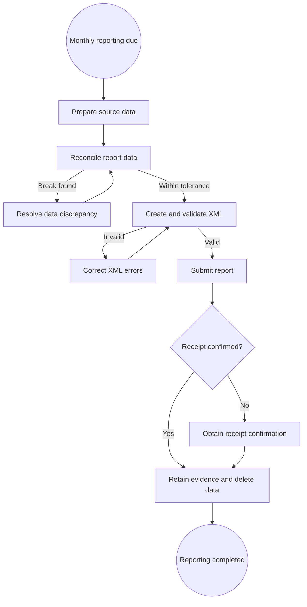
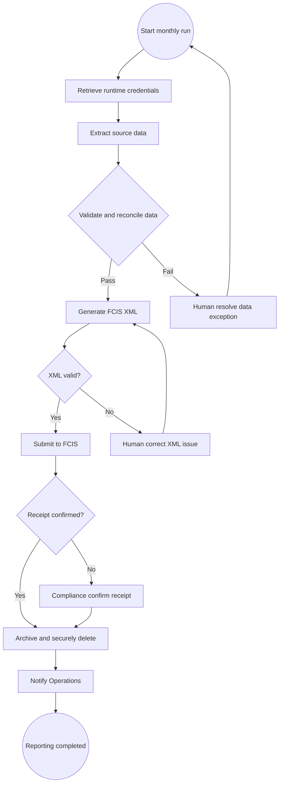

<!-- pdd:doc header="Monthly PBOC FCIS Capital-and-Position Reporting {{RUN_TOKEN}} | Process Definition Document" footer="Confidential | Shenzhen Regent Capital" client="Shenzhen Regent Capital" author="UiPath Business Analysis" date="29 September 2026" version="1.0" process="Monthly PBOC FCIS Capital-and-Position Reporting {{RUN_TOKEN}}" -->

# Monthly PBOC FCIS Capital-and-Position Reporting {{RUN_TOKEN}}

<!-- pdd:section id=business-context sources=as-is/overview.md,as-is/pain-points.md,to-be/overview.md,to-be/benefits.md reproj=g0 -->
## 1. Business Context

### 1.1 Problem Statement
Shenzhen Regent Capital must submit a monthly capital-and-position report to **PBOC FCIS** by 18:00 Beijing Time on the last business day. The source-bounded process draws data from **Hundsun O45**, **CSDC Custody System**, and **Internal Risk System**, then applies reconciliation, XML validation, submission, evidence retention, and intermediate-data deletion controls. The detailed manual operating procedure and its elapsed effort are not evidenced, but the deadline, cross-system control burden, and exception exposure create a material compliance risk.

### 1.2 Objectives
- Automate the scheduled monthly reporting path while retaining controlled human decisions for exceptions.
- Enforce the 18:00 deadline, 0.01% reconciliation threshold, FCIS Schema v3.2 validation, five-year final-record retention, and 24-hour intermediate-data deletion requirement.
- Create reproducible operational evidence for extraction, validation, submission, acknowledgement, archive, deletion, and exception handling.

### 1.3 Expected Value
The future design reduces system switching and manual handling in the standard path, improves repeatability of regulatory controls, and makes exception ownership visible. Measured targets and acceptance signals are stated in Section 10.

[Refine section](delegate:refine-section?section=business-context)

<!-- pdd:section id=scope sources=as-is/scope.md,entities/applications/ reproj=g0 -->
## 2. Scope

### 2.1 Process Identity

| Process name | Process group | Process identifier | Industry |
|---|---|---|---|
| Monthly PBOC FCIS Capital-and-Position Reporting | Regulatory reporting | Not confirmed | Financial services / capital management |

### 2.2 Scope Boundaries

| In Scope | Out of Scope |
|---|---|
| Monthly FCIS capital-and-position report | Real-time intraday regulatory reporting |
| O45 positions, CSDC transactions, IRS risk exposures | CBIRC insurance reporting |
| Reconciliation, XML validation, FCIS submission and receipt | CSRC securities reporting |
| Final-record archive and intermediate-data deletion | Other schemas and reporting processes |

### 2.3 Systems and Applications

| System | Role in Process | Access Type |
|---|---|---|
| **Hundsun O45** | Position holdings source | Read |
| **CSDC Custody System** | Transaction and custody-record source | Read |
| **Internal Risk System** | Risk-exposure source | Read |
| **PBOC FCIS** | Regulatory XML submission and acknowledgement target | Write |
| **UiPath Orchestrator** | Proposed schedule, execution, and operational logging platform | Both |
| **CyberArk** | Proposed runtime credential provider | Read |

[Refine section](delegate:refine-section?section=scope)

<!-- pdd:section id=current-state sources=as-is/overview.md,as-is/diagram.md,as-is/steps/,as-is/metrics-and-volumes.md,as-is/pain-points.md reproj=g0 -->
## 3. Current State

### 3.1 Overview
The current-state view is evidence-led and intentionally partial. The monthly task prepares source data, reconciles it, creates and validates FCIS XML, submits it, confirms receipt, archives required evidence, and deletes intermediate data; the specific manual operators, screens, approvals, and operating metrics remain open items.

### 3.2 Current Flow

| # | Current step |
|---|---|
| 1 | Initiate the monthly reporting cycle and establish the reporting deadline. |
| 2 | Prepare O45 positions, CSDC transactions, and IRS risk-exposure inputs. |
| 3 | Reconcile reporting data and investigate breaks above the 0.01% tolerance. |
| 4 | Create FCIS XML and validate it against Schema v3.2. |
| 5 | Submit to FCIS and confirm acknowledgement. |
| 6 | Archive final XML and receipt; securely delete intermediate data. |
| 7 | Invoke Compliance-led manual contingency if automation cannot meet the deadline. |

### 3.3 Metrics

| Metric | Current signal | Measurement method |
|---|---|---|
| Reporting frequency | Monthly | Regulatory requirement |
| Submission deadline | 18:00 Beijing Time, last business day | Regulatory requirement |
| Report population | Positions, settled transactions, risk exposures | Regulatory requirement |
| Manual cycle time and effort | Not confirmed | Operations / Compliance evidence required |

### 3.4 Pain Points

| Where | What breaks | Impact |
|---|---|---|
| Month-end submission | Fixed 18:00 deadline and incomplete operating evidence | Regulatory compliance exposure |
| Source preparation | Three systems with different data interfaces and formats | Manual handling and data-quality risk not yet quantified |
| Reconciliation | 0.01% tolerance requires investigation and prevents auto-correction | Submission stops pending Risk/Compliance action |
| O45 extraction | CSV-versus-API method unresolved | Future implementation blocker |

[Open AS-IS diagram](delegate:open-diagram?which=as-is&anchor=current-state)

[Refine section](delegate:refine-section?section=current-state)

<!-- pdd:section id=target-state sources=to-be/overview.md,to-be/diagram.md,to-be/delivery-model.md,to-be/steps/,to-be/exception-handling.md,to-be/benefits.md reproj=g0 -->
## 4. Future State

### 4.1 Vision
**UiPath Orchestrator** starts an unattended run at 15:00 CST, retrieves runtime credentials from **CyberArk**, prepares and controls the monthly source population, generates and validates FCIS XML, submits it, captures acknowledgement, archives final evidence, deletes intermediate data, and notifies Operations. Risk and Compliance remain responsible for stopped data, XML, receipt, and contingency decisions.

[Open TO-BE diagram](delegate:open-diagram?which=to-be&anchor=target-state)

### 4.2 Target Flow

| # | Automation unit / step | Mode | Owner or system | Input | Output | Exception path |
|---|---|---|---|---|---|---|
| 1 | Schedule and initialise | Fully Automated | UiPath Orchestrator | Business date | Run start | Alert on missed start / deadline risk |
| 2 | Retrieve credentials | Fully Automated | CyberArk | Service-account access | Runtime credentials | Halt and alert; no cached fallback |
| 3 | Extract source data | Fully Automated | O45, CSDC, IRS | Reporting date | Source extracts | Bounded retry then human escalation |
| 4 | Validate and reconcile | Fully Automated | Automation | Source extracts | Validated data / discrepancy report | Stop; Risk investigates breaks |
| 5 | Generate and validate XML | Fully Automated | Automation / FCIS schema | Validated data | Valid XML | Compliance reviews schema errors |
| 6 | Submit and track receipt | Fully Automated | FCIS | Valid XML | Receipt or rejection | Compliance reviews failed/unknown receipt |
| 7 | Archive, delete, notify | Fully Automated | Archive / Operations | Accepted XML and receipt | Evidence pack and notification | Stop/escalate archive or deletion failure |

### 4.2.1 Future Work Details
**Extract, validate and reconcile.** Trigger: scheduled run. Inputs: O45 positions, CSDC transactions, IRS exposures. Output: validated, reconciled report population. A result above the 0.01% threshold stops the run and sends a documented exception to Risk; no automatic correction is allowed.

**Generate, validate and submit XML.** Trigger: reconciled data. Inputs: Compliance-maintained mapping and validated population. Output: Schema v3.2-compliant XML, FCIS response, and acknowledgement. Invalid XML, rejection, or missing acknowledgement stays open for Compliance action.

**Archive, delete and notify.** Trigger: accepted FCIS receipt. Inputs: final XML, receipt, run evidence, intermediate files. Output: retained submission evidence, deletion confirmation, and Operations completion notification.

### 4.3 What Changes

| Area | AS-IS | TO-BE | Why | How |
|---|---|---|---|---|
| Execution | Partially evidenced manual task | Unattended scheduled run | Reduce manual handling in standard path | UiPath Orchestrator starts at 15:00 CST |
| Credentials | Current manual method not confirmed | CyberArk runtime retrieval | Prevent secret exposure and cached fallback | Retrieve immediately before each use |
| Data controls | Required but current method unconfirmed | Automated validation and reconciliation | Enforce 0.01% threshold consistently | Stop and create discrepancy evidence |
| Submission | Current submitter/process unconfirmed | Automated FCIS upload and receipt tracking | Improve deadline control and traceability | Bounded retries and acknowledgement monitoring |
| Exceptions | Manual procedure partly unknown | Explicit stopped routes to Risk/Compliance | Preserve human judgement | Human review and contingency decision points |

### 4.4 Automation Work Summary
Seven standard-path units are fully automated. Three review nodes remain for data exceptions, XML issues, and receipt/contingency decisions. The O45 interface selection remains a blocking decision.

[Refine section](delegate:refine-section?section=target-state)

<!-- pdd:section id=business-rules sources=as-is/business-rules.md,to-be/business-rules.md reproj=g0 -->
## 5. Business Rules

| Rule ID | Description |
|---|---|
| BR-001 | Submit a complete and valid FCIS report by 18:00 Beijing Time on the last business day. |
| BR-002 | Include required positions, settled transactions, and risk exposures for the reporting period. |
| BR-003 | Reconcile O45 and CSDC position values for the same valuation date. |
| BR-004 | Stop and escalate any O45/CSDC variance above 0.01%; do not auto-correct or interpolate. |
| BR-005 | Upload only XML that passes FCIS Schema v3.2 validation. |
| BR-006 | Retain accepted final XML and FCIS acknowledgement for at least five years. |
| BR-007 | Securely delete intermediate data within 24 hours of FCIS acceptance and retain destruction evidence. |
| BR-009 | Retrieve automation credentials only from CyberArk at runtime. |
| BR-010 | Use only documented bounded retries; never substitute stale, incomplete, or estimated data. |
| BR-011 | Do not implement O45 extraction until CSV versus API is formally resolved. |

[Refine section](delegate:refine-section?section=business-rules)

<!-- pdd:section id=data-model sources=entities/artifacts/,as-is/data-inputs-outputs.md reproj=g0 -->
## 6. Data Model

### 6.1 Entities
| Entity | Description |
|---|---|
| Position holdings | O45 reporting-date positions. |
| Transaction records | CSDC settled buy, sell, and transfer records. |
| Risk exposures | IRS gross/net exposure, VaR, stress loss, and concentration data. |
| FCIS XML report | Schema v3.2 submission payload. |
| FCIS acknowledgement | Receipt/rejection evidence for submission state. |

### 6.2 Data Inputs and Outputs
| Artifact | Source / Destination | Format | Consumed / Produced By |
|---|---|---|---|
| **Position holdings** | O45 to automation | CSV or JSON API, unresolved | Extraction unit |
| **Transaction records** | CSDC to automation | XML | Extraction unit |
| **Risk exposures** | IRS to automation | JSON | Extraction unit |
| **FCIS XML report** | Automation to FCIS | XML | Submission unit |
| **Submission evidence** | FCIS to archive | XML, receipt, deletion log | Archive unit |

### 6.3 Field-Level Data Dictionary
| Field | Type | Format / Pattern | Valid values / range | Mandatory | Privacy class |
|---|---|---|---|---|---|
| Security identifier | Text | ISIN or domestic code | Valid security code | Yes | Confidential |
| Market value | Decimal | CNY | Reconciled within 0.01% tolerance | Yes | Confidential |
| Trade / settlement date | Date | YYYY-MM-DD | Reporting period | Yes | Confidential |
| FCIS acknowledgement reference | Text | Portal-generated | Valid receipt reference | Yes after acceptance | Confidential |

### 6.4 Data Flow and Lineage
| # | Data movement |
|---|---|
| 1 | O45, CSDC, and IRS provide reporting-period source data. |
| 2 | Automation validates and reconciles the source population. |
| 3 | Automation transforms validated data to FCIS XML. |
| 4 | FCIS returns acknowledgement or rejection evidence. |
| 5 | Final evidence is archived; temporary processing data is deleted. |

### 6.5 Integrations
| Integration (System → System) | Fields passed | Connector / type | Endpoint + Auth |
|---|---|---|---|
| O45 → Automation | Position holdings | CSV export or REST API | Not confirmed; CyberArk credential |
| CSDC → Automation | Transactions | Browser UI / XML export | Not confirmed; CyberArk credential |
| IRS → Automation | Risk exposures | REST API | Not confirmed; CyberArk API key |
| Automation → FCIS | FCIS XML | Secure portal | Not confirmed; certificate plus credentials |

==TBD: confirm integration endpoints, interface choice, and authentication details during solution design.==

[Refine section](delegate:refine-section?section=data-model)

<!-- pdd:section id=people sources=entities/people/ reproj=g0 -->
## 7. People

### 7.1 Roles & Personas
| Stakeholder | Responsibility |
|---|---|
| UiPath Orchestrator / automation | Executes standard-path schedule, extraction, validation, XML, submission, archive, deletion, and notifications. |
| Compliance Officer | Reviews schema, receipt, manual-contingency, and deadline-risk decisions. |
| Risk Manager | Investigates material reconciliation and risk-data discrepancies. |
| Operations team | Receives completion and operational-failure notifications. |
| IT Security Officer | Receives credential and secure-deletion incidents. |
| IT Director | Escalation recipient for unresolved CyberArk availability condition. |

[Refine section](delegate:refine-section?section=people)

<!-- pdd:section id=raci sources=entities/people/ reproj=g0 -->
## 7.2 RACI

| Activity / Stage | Responsible | Accountable | Consulted | Informed |
|---|---|---|---|---|
| Standard automated run | UiPath automation | Process owner not confirmed | Operations | Compliance |
| Data discrepancy review | Risk Manager | Risk owner not confirmed | Compliance | Operations |
| XML / receipt / contingency decision | Compliance Officer | Compliance owner not confirmed | Risk, IT Security | Operations |
| Security incident response | IT Security Officer | IT Security owner not confirmed | Operations, Compliance | IT Director |

==TBD: confirm process owner, accountable roles, backup coverage, and formal RACI before go-live.==

[Refine section](delegate:refine-section?section=raci)

<!-- pdd:section id=exceptions sources=as-is/exception-handling.md,to-be/exception-handling.md reproj=g0 -->
## 8. Exceptions and Error Handling

### 8.1 Known Exceptions
| Exception | Trigger | AS-IS Handling | TO-BE Handling |
|---|---|---|---|
| Credential failure | Vault unavailable or incomplete credential | Not fully evidenced | Halt; alert Operations and IT Security; no fallback credential |
| Source extraction failure | O45/CSDC/IRS unavailable or invalid | Not fully evidenced | Bounded retries then stop and route to named owner |
| Reconciliation break | Variance above 0.01% | Risk escalation required | Stop, create discrepancy report, route to Risk and Compliance |
| XML validation failure | Schema v3.2 validation error | Not fully evidenced | Stop; Compliance authorizes correction or contingency |
| FCIS receipt issue | Rejection or no acknowledgement after 30 minutes | Not fully evidenced | Pause; Compliance confirms status before further action |
| Archive/deletion failure | Archive unavailable or deletion fails | Not fully evidenced | Retry archive once; escalate deletion incident |

### 8.2 Exception Data State Transitions
| Exception | Affected record | State on entry | State on resolution | State on terminal failure |
|---|---|---|---|---|
| Reconciliation break | Reporting run | Stopped / flagged | Revalidated and restarted | Held for Risk/Compliance disposition |
| XML failure | XML submission | Invalid | Regenerated and validated | Held for Compliance decision |
| Receipt unknown | Submission | Submitted / unknown | Acknowledged then archived | Held pending Compliance/FCIS verification |
| Deletion failure | Intermediate data | Retention action failed | Verified deleted | Security incident open |

### 8.3 Human Review Specifications
| Escalation point | Trigger | Fields surfaced | Available actions → resulting state | Task SLA | Assignee role |
|---|---|---|---|---|---|
| Data discrepancy | Variance >0.01% | Run date, source totals, variance, extracts | Investigate / authorize restart → revalidation | Deadline-driven | Risk Manager |
| XML / FCIS issue | Validation error, rejection, or missing receipt | Run ID, error, XML status, deadline remaining | Correct / contingency decision / hold → controlled disposition | Deadline-driven | Compliance Officer |
| Security incident | Credential or deletion failure | EX code, job ID, timestamp, affected system | Investigate / remediate → incident closure | Immediate | IT Security Officer |

[Refine section](delegate:refine-section?section=exceptions)

<!-- pdd:section id=compliance sources=as-is/compliance.md,to-be/business-rules.md reproj=g0 -->
## 9. Compliance and Regulatory

### 9.1 Compliance Traceability Matrix
| Requirement / Rule | Enforced at | Evidence retained |
|---|---|---|
| Monthly FCIS deadline (BR-001) | Orchestrator schedule and FCIS submission | Run timestamps and acknowledgement |
| Complete reporting population (BR-002) | Extraction and validation | Source extracts and validation results |
| Reconciliation and 0.01% threshold (BR-003/BR-004) | Reconciliation unit | Control calculation and discrepancy report |
| XML schema validation (BR-005) | XML validation unit | Validator output and XML version |
| Five-year final-record retention (BR-006) | Archive unit | Final XML and FCIS receipt |
| 24-hour intermediate-data deletion (BR-007) | Deletion unit | Destruction log and verification |
| Runtime credential control (BR-009) | CyberArk retrieval | Credential-access event reference without secret value |
| Bounded retry/no substitution (BR-010) | Exception handling | EX log, retry record, stopped-run evidence |
| O45 interface decision (BR-011) | Change control | Approved architecture/vendor decision |

### 9.2 Audit & Traceability
The future process timestamps execution, exceptions, submission attempts, acknowledgements, archive, and deletion. Final XML and FCIS acknowledgement are retained for at least five years; intermediate-data deletion must be evidenced within 24 hours of accepted submission.

[Refine section](delegate:refine-section?section=compliance)

<!-- pdd:section id=kpis sources=to-be/benefits.md reproj=g0 -->
## 10. KPIs and Acceptance Criteria

> [!WARNING]
> **Needs capture:** Operational baselines and approved performance targets must be captured with Operations and Compliance. This section will auto-fill when the benefits source is available.

### 10.1 KPIs
| KPI | Target / acceptance signal |
|---|---|
| On-time FCIS submission | Complete and valid submission by 18:00 Beijing Time on each monthly run |
| Reconciliation control | No submission when O45/CSDC variance exceeds 0.01% without documented human disposition |
| XML validity | No upload of XML that fails Schema v3.2 validation |
| Receipt capture | FCIS acknowledgement or controlled open exception for every submission |
| Data deletion | Intermediate data securely deleted within 24 hours of accepted submission |

### 10.2 Acceptance Criteria
- The scheduled run starts at 15:00 CST on the last business day.
- The bot stops on mandatory control failures and does not silently continue.
- A complete evidence package is retained for every completed or stopped run.
- Actual baseline and target metrics for duration, effort, exceptions, and rejection rate are confirmed before go-live.

[Refine section](delegate:refine-section?section=kpis)

<!-- pdd:section id=assumptions-risks sources=queries/,as-is/scope.md reproj=g0 -->
## 11. Assumptions, Constraints, Dependencies and Risks

### 11.1 Assumptions
| Assumption | Detail |
|---|---|
| Task shape | Sponsor confirmed a bounded, repetitive monthly task with stable broad systems and checks. |
| Human decision points | Risk and Compliance retain judgement for stopped exceptions and contingency. |

### 11.2 Constraints
| Constraint | Detail |
|---|---|
| Submission deadline | 18:00 Beijing Time on the last business day. |
| Reconciliation | 0.01% internal tolerance. |
| Retention and deletion | Five-year final-record retention; 24-hour intermediate-data deletion. |
| Manual procedure evidence | Not confirmed. |

==TBD: confirm current operating roles, approvals, evidence locations, and manual-contingency procedure.==

### 11.3 Dependencies
| Dependency | Type (hard/soft) | Detail |
|---|---|---|
| O45 extraction decision | Hard | CSV export versus REST API must be formally resolved. |
| O45, CSDC, IRS availability | Hard | Required reporting inputs must be accessible and complete. |
| CyberArk availability | Hard | Credentials must be retrieved at runtime. |
| FCIS availability and access | Hard | Valid submission and receipt require portal access. |
| Operations/Compliance confirmation | Hard | Open roles, procedures, evidence, KPI baselines, and contingency details require validation before go-live. |

### 11.4 Risks
| Risk | Mitigation |
|---|---|
| O45 interface ambiguity delays implementation | Obtain documented architecture/vendor decision before build. |
| Source, reconciliation, XML, or FCIS failure threatens deadline | Enforce stop/escalation routes and Compliance manual-contingency assessment. |
| Incomplete current-process evidence weakens control design | Close documented gaps with Operations and Compliance before go-live. |
| Uncontrolled retries or duplicate submission | Use documented retry limits and confirm duplicate-prevention control in solution design. |

[Refine section](delegate:refine-section?section=assumptions-risks)

<!-- pdd:section id=glossary sources=entities/ reproj=g0 -->
## 12. Glossary

| Term | Definition |
|---|---|
| CSDC | China Securities Depository and Clearing Corporation custody-data source. |
| CyberArk | Enterprise secrets vault proposed for runtime credential retrieval. |
| FCIS | PBOC Financial Information Collection and Submission System. |
| IRS | Internal Risk System, the source of risk-exposure data. |
| O45 | Hundsun O45 Trading Platform, the source of position holdings. |
| Reconciliation break | Data variance that fails a required control and stops the run. |
| Runtime credential | A credential retrieved immediately before use and not stored by the automation. |

[Refine section](delegate:refine-section?section=glossary)

<!-- pdd:section id=next-steps sources=queries/open-questions.md reproj=g0 -->
## 13. Next Steps

| # | Action item |
|---|---|
| 1 | Obtain formal decision on O45 CSV export versus REST API extraction. |
| 2 | Confirm current and future preparer, checker, approver, submitter, archive-owner, and backup roles. |
| 3 | Document current manual extraction, reconciliation, XML preparation, submission, archive, and deletion procedure. |
| 4 | Define manual-contingency checklist, approval chain, receipt evidence, and recovery process. |
| 5 | Establish workload, run-duration, exception, rejection, and contingency baselines plus approved targets. |
| 6 | Confirm endpoint, authentication, evidence-package, duplicate-prevention, monitoring, and access-control design during solution design. |

[Refine section](delegate:refine-section?section=next-steps)

<!-- pdd:section id=appendix-a sources=derived reproj=g0 -->
## Appendix A: Process Map and Diagrams

The approved current-state and future-state process maps are embedded in Sections 3 and 4. The future-state map is the operational design reference for the monthly FCIS automation.

<!-- doc:placeholder kind="integration-diagram" -->
> [!NOTE]
> **Integration Diagram Placeholder**
> Insert integration diagram showing O45, CSDC, IRS, CyberArk, UiPath Orchestrator, FCIS, archive, Operations, Risk, Compliance, and IT Security handoffs.

[Refine section](delegate:refine-section?section=appendix-a)
