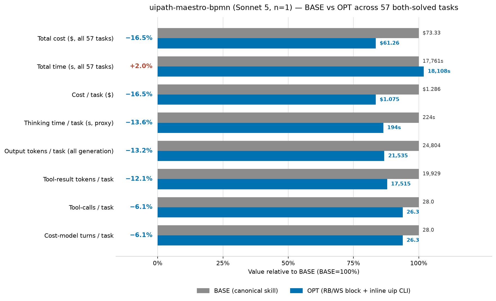

# uipath-maestro-bpmn skill optimization — cost-reduction report

Cost reduction is measured by **3 cost dimensions** — (1) thinking tokens, (2) tool-result tokens, (3) tool-calls/turns — targeted by **3 optimization techniques**:

- **Scripted skills**: turn deterministic procedures found in the skill files into scripts to cut tool-calls/turns; they also cut thinking (the agent doesn't re-derive an encoded procedure) and, for some scripts, tool-result tokens (output written to a file instead of into context).
- **Thinking budget prompt (RB1, RB2)**: softly curb reasoning to cut thinking tokens.
- **Working style prompt (WS1–WS7)**: 7 bullets, each targeting different cost dimensions.

> **Read this first — two structural facts about this run pair.**
>
> **1. n = 1.** Each arm ran **one repeat per task** (70 tasks × 1 rep). Every per-task number in this report is therefore a **point estimate**, and the outlier-exclusion step described in the methodology is inert (nothing to exclude). The four-lever real-vs-noise test is doing all the work of separating signal from run-to-run variance, and single-task percentages should not be quoted on their own.
>
> **2. Thinking tokens are not measurable in these runs.** Thinking-only assistant messages exist in quantity (1,655 in BASE / 1,551 in OPT across all 70 tasks) but every one carries `output_tokens: 0` and an **empty** `thinking` string; the reasoning tokens are folded into the following `tool_use` message's `output_tokens`. The prescribed metric (Σ `output_tokens` of thinking-only messages) therefore returns ~0 for a **schema** reason, not a behavioral one — reasoning did not vanish. Two substitutes are used throughout and are flagged wherever they appear: **total output tokens** as the generation-side lever (replacing thinking in the four-lever test, threshold 5k), and **thinking generation time** — the summed `generation_duration_ms` of thinking-only messages — as a directional proxy (12,760s → 11,031s, -13.6%). As a consequence the saving table below cannot split thinking from non-thinking output; it reports one generation bucket.

> **Arm definition.** OPT is `maestro-bpmn-optimized-inline-sonnet-5` (skill `tmp:uipath-maestro-bpmn`), BASE is `maestro-bpmn-baseline-sonnet-5` (skill `uipath:uipath-maestro-bpmn`); both on `claude-sonnet-5`. The OPT skill carries the RB1/RB2 + WS1–WS7 block at the top of `SKILL.md` and teaches three inline `uip` CLI verbs (`maestro bpmn format`, `update-metadata`, `update-metadata --dry-run`). Neither arm ships a bundled `.py`/`.sh` script, so the *scripted-skills* technique appears in CLI-verb form — see the note under [Per Task Table](#per-task-table). Note BASE reaches `update-metadata` 9 times on its own via `--help`, so that verb is not exclusive to OPT.

## Script Generation of uipath-maestro-bpmn

The skill covers five distinct work areas: authoring, validation, metadata management, operate (packaging / lifecycle), and diagnose. Below is a breakdown of each area and whether its procedures are codifiable.

**3 out of 14 areas** can be turned into scripts, and the corresponding scripts are: `generate_diagram.py` (diagram auto-layout, area 5), `scaffold_metadata.py` (package metadata scaffolding, area 8), and `check_metadata_drift.py` (package metadata drift check, area 9). Area 6 (BPMN validation) is counted separately as **already scripted** (`validator/validate-bpmn.mjs`) and excluded per instructions. In this OPT arm those three procedures are delivered as inline CLI verbs rather than bundled scripts — `format` covers area 5, `update-metadata` area 8, `update-metadata --dry-run` area 9 — which is why every per-task script-invocation count is 0 and the CLI-verb counts carry the signal instead.

Codifiability is taken from `/home/azureuser/projects/skills/tmp/experiments/classification/bpmn/classification-details-uipath-maestro-bpmn.md` (classification: **Partial**).

Many of the remaining areas are plain CLI calls — registry discovery, connector enrichment, packaging, upload/publish/deploy, run/debug/manage, and the diagnose ladder. Those are not script material, but the working-style prompt (WS2) is meant to chain them by planning the path ahead instead of discovering the CLI surface one `--help` at a time. In this pair that is exactly where the results split: it works on the authoring tasks and backfires on several others.

| # | Area | Codifiable? | Notes |
|---|------|-------------|-------|
| 1 | Registry discovery (pull / list / search / get, IS connections list) | No | CLI calls requiring user confirmation and intent mapping |
| 2 | Connector enrichment (`registry get --connection-id --object-name`) | No | CLI call; resource identifiers come from discovery or user |
| 3 | Template placeholder filling (`{id}`, `{name}`, `{incomingEdge}`, etc.) | No | Requires agent judgment for process structure and content |
| 4 | Structural BPMN authoring (process scaffold, sequence flows, gateways, events, boundary events, subprocesses, multi-instance markers) | No | Generative/creative; process shape comes from requirements |
| 5 | **Diagram generation (`bpmndi:BPMNDiagram`)** | **Yes — BUILD-MODEL** | Fixed sizes (tasks 100×80, events 36×36, gateways 50×50), left-to-right layout; fully deterministic given the process graph |
| 6 | **BPMN validation** | **Already scripted** | `validator/validate-bpmn.mjs` — runs all 19 PO.Frontend rules offline; this is an existing skill script, excluded per instructions |
| 7 | Expression authoring (`=vars.X`, `=bindings.X`, `=js:`, scoping rules) | Marginal | Rules are explicit but application is part of authoring; a post-hoc syntax checker is a VALIDATE, but minor value |
| 8 | **Package metadata scaffolding** (`project.uiproj`, `operate.json`, `entry-points.json`, `bindings_v2.json`, `package-descriptor.json`) | **Yes — FORMAT-CONVERT / BUILD-MODEL** | `local-metadata-regeneration-guide.md` gives exact JSON shapes and derivation rules from BPMN root elements |
| 9 | **Package metadata drift check** | **Yes — VALIDATE** | `local-metadata-regeneration-guide.md` §Drift Handling gives explicit rules: `entry-points.json` ids must match root `uipath:entryPointId`s; `bindings_v2.json` version must be `"2.0"`; `operate.json` must point at the correct BPMN file |
| 10 | Packaging (`uip maestro bpmn pack`) | No | CLI call |
| 11 | Upload / publish / deploy | No | CLI calls; require explicit user consent |
| 12 | Run / debug / manage instances | No | CLI calls; require explicit user consent and post-run judgment |
| 13 | Diagnose priority ladder (incidents → variables → deployed asset → element executions → package files → traces) | No | CLI reads requiring interpretation and analysis at each step |
| 14 | Agent wrapper selection (processType → extension type) | No (marginal) | A 4-row lookup table; too small to warrant a standalone script |

## Summary

### Overall Results



*Every metric normalized to BASE=100%. The top two rows are totals across all 57 both-solved tasks; the rest are **per-task means** (sum ÷ 57). Thinking time is a proxy for the unmeasurable thinking-token metric; output tokens cover all generation. Total time is the one metric that got **worse**, shown in red.*

Across the 57 both-solved tasks OPT costs **$61.26** against BASE's **$73.33** — a **16.5%** reduction — while cutting output tokens 13.2%, tool-result tokens 12.1%, tool-calls/turns 6.1% and thinking time 13.6%. **Wall-clock moved the other way: 17,761s → 18,108s (+2.0%)** — OPT is cheaper but slightly slower overall, driven by a handful of long regressions (`e2e-live-debug` alone adds 1,494s).

**Where the $12.06 saving comes from**

| bucket | Δ tokens (sum) | share | cost-model term |
|--------|----------------|-------|-----------------|
| cache-read | -23,383,020 | 58.1% | `r·(TR+G)·(T−t)` |
| output — all generation (thinking **not separable**, see note) | -186,345 | 23.2% | `g·G` = `g·(thk+cl+tc)` |
| cache-create | -646,040 | 20.1% | `w·TR` |
| uncached | +56,007 | -1.4% | `w·TR` |

The `Δ tokens` column holds **exact sums over tasks**, while the chart's per-task figures are **rounded for display** — multiplying a rounded chart delta by the task count will not exactly reproduce these sums (a small rounding gap). The exact sums and the $12.06 total (from `total_cost_usd`) are authoritative; the `share` column is the one derived split. The prescribed **thinking** and **non-thinking output** rows are merged into a single generation bucket because this run pair does not record per-message thinking tokens (see the note at the top); uncached is a small **negative** contribution (it grew).

### Where the cost comes from before optimization — and how OPT cuts it

**The BASE bill is overwhelmingly context-driven.** Over the 57 tasks BASE accumulates **123.2M cache-read tokens** and **4.04M cache-create tokens** against **1414k output tokens** and **1136k tool-result tokens** — cache-read alone is ~87× the tool-result footprint, because a 28-call average trace re-reads everything already in context on every remaining turn. The pathologies that feed it are visible in the traces, and they are different from what a to-do-heavy model does: **there is no to-do ceremony at all** in either arm (0 `TaskCreate`/`TaskUpdate` calls) and essentially no hand-written metadata JSON (1 file across the whole BASE arm). What BASE does instead is **fish**: 106 Grep/Glob calls, dominated by the same handful of queries repeated — `entryPointId` is grepped four separate times in `gateway-sequence-flows`, three times in `subprocess`, twice in `calculator`; `expr-computed-js` greps 14 times and `feet-inches` 12. It also **probes blind**: `callactivity-agentic-process` opens with 35 consecutive `Bash` calls before writing anything, `event-trigger-start` with 34, `loop-multiply` with 43. And it **reads what it should not** — in `http-weather` and `expr-computed-js` BASE reads the eval's own grader (`check_http_weather.py`, `bpmn_check.py`, `computed_js.yaml`), and in `script-jint-guidance` it reads all five generated metadata files twice.

**OPT's win is shorter, tighter traces — and it is concentrated, not uniform.** Tool-calls fall 98 (6.1%), reference reads 161→144, Grep/Glob 106→86, and inline-python drops on most authoring tasks. Because every removed call also removes its re-read tail, cache-read falls 23.4M tokens — **58% of the entire saving**, far more than the generation bucket's 23%. That is the headline mechanism here: the optimization does not mainly make the model think less per turn, it makes the trace shorter so context is re-read fewer times. `format` is invoked 33 times in OPT against 0 in BASE and `registry` probing falls 159→122, but the biggest single wins are plain trace-length collapses: `callactivity-agentic-process` 46→14 calls, `inclusive-gateway-forkjoin` 35→12, `http-weather` 83→39, `edit-update-node` 22→9.

| Mechanism (what OPT changed) | Term | Examples (Δcost) |
|------------------------------|------|------------------|
| **Plan the path instead of probing blind** — read the reference, then act, rather than opening with 30+ consecutive `Bash` probes (WS1/WS2/WS7) | `g·(cl+tc)` + `r·(TR+G)·(T−t)` | `callactivity-agentic-process` 46→14 calls (−$1.436, −74.3%); `inclusive-gateway-forkjoin` 35→12 (−$1.459, −72.7%); `event-trigger-start` 39→22 (−$0.571, −43.4%); `script-task-group-by` 43→31 (−$0.621, −40.8%) |
| **Stop fishing** — no repeated `entryPointId` greps, no reads of the eval's own grader or of generated metadata already written (WS4/WS7) | `w·TR` + `r·TR·(T−t)` | `http-weather` grader reads →0, tool-result 60,980→25,494 (−$2.343, −64.9%); `expr-computed-js` 14→7 Greps, tool-result −23,505 (−$0.682, −24.3%); `rpa-job` 8→0 Greps (−$0.941, −50.7%); `script-jint-guidance` metadata read twice→once (−$1.253, −40.8%) |
| **Inspect once; don't re-validate what you already fixed** (WS4/WS7) | `w·TR` + `r·TR·(T−t)` | `edit-add-output` 3 reads→1, tool-result −5,955 (−$0.140, −27.4%); `edit-update-node` 22→9 calls (−$0.620, −67.4%); `edit-add-node` 4 validates→2 (−$0.263, −42.8%); `edit-remove-node` tail 10→5 Bash (−$0.254, −35.3%) |
| **Skip references the task doesn't need** (WS3/WS7) | `w·TR` | `hitl-completed-wired` 18 reads→6, tool-result −20,188 (−$1.734, −50.5%); `author-validate` 4 refs→1 (−$0.350, −34.8%); `e2e-customer-escalation` tool-result −25,897 (−$0.879, −28.2%) |
| **Grep instead of dumping** — search fixtures rather than reading them whole (WS6) | `w·TR` | `script-task-map` tool-result 35,488→14,849 even while calls rise 44→57 (−$0.244, −14.3%); `calculator` sibling-file reads→greps, tool-result −6,006 (−$0.045, −2.5%) |

**Real vs. noise.** With n=1 per task, a dollar difference only counts as an optimization effect when the agent **measurably did something different**. "Different" is judged on the four levers the prompts target — tool-calls, turns, tool-result tokens, and generation tokens — with a task counting as **real** if any one moved non-trivially: **≥3 tool-calls, ≥3 turns, ≥5k tool-result tokens, or ≥5k output tokens**. The fourth threshold is the substitution described at the top: thinking tokens are unmeasurable in this pair, so total output tokens stand in, at 5k rather than the usual 1.5k to keep roughly the same relative strictness against a ~25k-per-task generation base. If all four are ~flat and only the dollars moved, the task is **noise** and is not credited. Of the **40 wins**, **27 are real** (carrying **−$16.42**) and **13 are noise** (carrying **−$1.12**). The noise wins are: `parallel-fork-join`, `debug-instance-inspect`, `safety-sanitize`, `diagnose-deployed-drift`, `operate-diagnose-minimal-fault-triage`, `dice-roller`, `debug-workflow-mocked`, `timer`, `diagnose-scoped-variables`, `timer-boundary-noninterrupting`, `diagnose-validate-fix-loop`, `edit-move-node`, `error-boundary-handler`. `hitl-brownfield-insert` (calls −3, exactly at the bar) and `diagnose-stuck-gateway` (calls +5 against a −2.0% bill) are gray-zone and want replication.

### Why cost increases in some tasks

**17 of 57 tasks cost more**, together **+$5.48** against **−$17.54** of wins. By the same four-lever test, **14 are attributable** (**+$5.23**) and **3 are noise** (**+$0.25**). Unlike the wins — which cluster on authoring tasks where BASE probed blindly — the regressions cluster where the prompt licensed *more* exploration than the task needed, and they are large: the worst three (`expr-error-mapping` +119.1%, `e2e-live-debug` +54.9%, `reading-list` +36.4%) carry $3.38 between them, 62% of all regression cost.

| Mechanism (what OPT changed) | Term | Examples (Δcost) |
|------------------------------|------|------------------|
| **Fishing spiral** — WS1's "understand first" read as license to keep searching; the same field grepped over and over before any edit (WS1/WS4/WS7 backfire) | `g·(cl+tc)` + `w·TR` | `expr-error-mapping` 24→61 calls, `entryPointId` grepped 5× plus a `*bpmn*` Glob, tool-result +9,034 (+$1.518, +119.1%); `error-event-subprocess` 2 new Greps, 13→18 calls (+$0.183, +25.4%) |
| **Inline-python sprawl** — WS5's "write code once" taken as a mandate to hand-roll shell/python instead of one CLI round trip | `g·(cl+tc)` | `reading-list` inline-python 7→19, 39→50 calls, time 400s→796s (+$0.660, +36.4%); `hitl-result-downstream` 5→11, 27→37 calls (+$0.216, +12.5%) |
| **Turn sprawl on small tasks** — extra `format`/`init` round trips and read-backs on artifacts BASE finished in one pass (WS2 backfire) | `g·(cl+tc)` + `r·G·(T−t)` | `hitl-multi-outcome-routing` 20→31 calls (+$0.343, +35.5%); `message-catch` 16→26 (+$0.149, +21.4%); `event-based-gateway` 14→19 with `format`×2 (+$0.119, +16.8%); `switch` 7→11 (+$0.103, +28.5%) |
| **Read-first over applied** — more references and fixtures pulled into context without shortening the trace (WS3 backfire) | `w·TR` | `simple-approval-bpmn` 7→24 files read, tool-result +12,633 on a flat call count (+$0.085, +2.2%); `hitl-rpa-wrappers` 3→6 reads, 20→28 calls (+$0.269, +34.0%); `subprocess` tool-result +5,300 (+$0.213, +13.8%) |
| **Live-execution spiral** — the one task that really runs a process polls it far harder | `g·G` + `w·TR` | `e2e-live-debug` `debug-instance` 3→8 plus 4 `TaskOutput` polls, 63→82 calls, **380s→1,874s** (+$1.202, +54.9%) |

**Real vs. noise (regressions).** Applying the test defined above: **14 of 17** regressions are real (**+$5.23**) and **3** are noise (**+$0.25**): `terminate`, `diagnose-incident-root-cause`, `smoke-registry-discovery`. All three noise regressions are sub-$0.10 tasks whose traces are step-for-step identical between arms — `diagnose-incident-root-cause` runs the same references and the same `incident`/`instance` calls in both — so their +23% to +31% headline percentages must not be read as backfires.

**Netting.** Across all 57 tasks, **41 are real** and **16 are noise**. The noise is *not* symmetric here: noise wins carry **−$1.12** against noise regressions of only **+$0.25**, netting **−$0.87** — about 7% of the **−$12.06** total, and in the same direction as the headline rather than cancelling. That asymmetry is the main caveat of this pair: at n=1 there is no within-task replication to average it out, so roughly one dollar in fourteen of the reported saving rests on tasks that show no measured behavior change. The real effects still carry **−$11.20** (~93% of the headline), so the conclusion holds — but it holds with a wider error bar than a 5-repeat run would give, and the per-task percentages should be treated as indicative only.

The regressions imply four remediation targets: (1) **bound WS1/WS4** — "understand first" needs a stop condition, because the worst regression is an agent grepping `entryPointId` five times before editing; (2) **bound WS5** — state that a supported CLI verb beats a hand-rolled python heredoc, since inline-python rose in every sprawl regression; (3) **make `format` a finishing step, not a probe** — the small-task regressions are mostly `format`/`init` round trips on artifacts that were already done; (4) **cap live-debug polling** — `e2e-live-debug` is the single worst wall-clock outcome in the set and explains most of the +2.0% total-time regression.

### How Are results Collected

Every figure is read from `<run>/default/<task>/<rep>/task.json` under the two run roots (`maestro-bpmn-optimized-inline-sonnet-5` and `maestro-bpmn-baseline-sonnet-5`) by `extract.py` → `rows.json` (per-task rows incl. the four lever deltas) and `reps.json` (per-rep raw), so the tables, chart and noise test all draw from the same numbers.

- **thinking tokens** — prescribed as Σ `output_tokens` over assistant messages under `iterations[].messages[]` whose `content_blocks` block-types are exactly `{"thinking"}`. **In this run pair that sum is 26 tokens in BASE and 0 in OPT**, because the messages are recorded like this:

  ```json
  {"role": "assistant", "content_blocks": [{"block_type": "thinking", "thinking": "", ...}],
   "output_tokens": 0, "generation_duration_ms": 8360.01, "tool_use_ids": []}
  ```

  The thinking text is empty and the token count is 0, while `generation_duration_ms` shows the reasoning really happened; the tokens land on the next `tool_use` message. Substitutes used: **total output tokens** (`total_token_usage.output_tokens`) for the generation lever, and **thinking time** (Σ `generation_duration_ms` over those same thinking-only messages) as a directional proxy.
- **tool-result tokens** — Σ `result_tokens` over `iterations[].commands[]`.
- **tool-calls** — `len(iterations[].commands[])`. A **script invocation** is a `commands[]` entry with `tool_name=="Bash"` whose `parameters.command` matches `python3 …/<script>.py` (a `Read`/`grep`/`cat` of the script source does not count); there are **none** in either arm. Real example:

  ```json
  {"tool_name": "Skill", "parameters": {"skill": "tmp:uipath-maestro-bpmn"},
   "result_status": "success", "result_tokens": 11, "sequence_number": 0}
  ```

- **turns T** — the cost-model agentic-step count, computed as the number of assistant messages with a non-empty `tool_use_ids`. **Caveat:** every such message carries exactly one tool call (4,485 of 4,485 have `len(tool_use_ids)==1`), so turns are numerically identical to tool-calls in both arms, and WS2's "batch into one turn" can only show up as *fewer total calls*.
- **cost and token buckets** — `total_token_usage`. Real example:

  ```json
  {"uncached_input_tokens": 62, "output_tokens": 61984, "cache_creation_input_tokens": 63931,
   "cache_read_input_tokens": 4182924, "total_cost_usd": 2.06135445, "input_tokens": 4246917}
  ```

  Bucket **token counts are read directly**; `total_cost_usd` is the only stored dollar and is authoritative. Per-bucket dollars are **derived** at output **$15/M**, cache-read **$0.30/M**, cache-create **$3.75/M**, uncached **$3/M**. These rates were not assumed: they were recovered by least-squares from the runs themselves and then verified by reconciliation on **all 140 `task.json` files**, where `output×$15/M + cache_read×$0.30/M + cache_create×$3.75/M + uncached×$3/M` equals `total_cost_usd` to a maximum error of **$2.66e-15** (exact to floating point). One `task.json` carries no `total_token_usage` at all and is excluded from the rate fit.
- **time** — `duration_seconds`. **task instruction** — `task_description`. **ordered action trace** — `iterations[].commands[]` walked in order (Skill / Read / Write / Edit / Bash / TaskCreate·Update / Glob·Grep).

**Scope and n.** Success is `final_status == "SUCCESS"`. Both runs hold **70 tasks × 1 repeat**; **57 are both-solved** and only those are compared. The 13 excluded tasks failed or errored in at least one arm (OPT: 5 `MAX_TURNS_EXHAUSTED`, 3 `ERROR`, 1 `FAILURE`; BASE: 2 `MAX_TURNS_EXHAUSTED`, 4 `ERROR`, 1 `FAILURE`, 1 `TIMEOUT`). **Because n=1, the recurring-behavior filter (drop reps deviating from the median by more than `max(floor, 3·MAD)` on any lever) has nothing to exclude and excluded 0 reps in both arms** — every per-task value is a single observation, i.e. a point estimate, and is reported as such throughout.

## Case Analysis

## Reference

### Per Task Table

**Script usage & benefit:** **0 of 57 tasks invoked a bundled skill script** — neither arm ships one, so the `scripts sc/dr/gd` column (scaffold / drift / diagram) is `0/0/0` throughout. The three codifiable procedures appear as inline CLI verbs instead: **30 tasks invoked `format` or `update-metadata`** (17 got cheaper, 13 got more expensive, 0 flat), with `format` at 33 invocations against **0 in BASE**. Unlike the previous Sonnet-4.6 pair, the CLI verb is **not the dominant driver in any task here**: no task in this run hand-writes the metadata set (BASE writes 1 metadata JSON across all 57 tasks), so `format` has almost no manual work to displace — and on several small tasks it adds a round trip that shows up as a regression. BASE itself reaches `update-metadata` 9 times via `--help`. The `CLI fmt·upd` counts are appended to the scripts column for reference.

Ranked by **percentage cost reduction**, largest reduction first. With n=1 every row is a point estimate; the `REAL` column records whether any of the four levers cleared threshold.

| # | task | Δcost | Δoutput tok ($) | Δtool-result tok | Δtool-calls | Δtime | scripts sc/dr/gd (CLI fmt·upd) | REAL | attribution (ranked) |
|---|------|-------|-----------------|------------------|-------------|-------|-------------------------------|------|----------------------|
| 1 | `callactivity-agentic-process` | $1.934→$0.498 (-74.3%) | -25,991 ($-0.390) | -13,050 | -32 | 444s→117s (-73.5%) | 0/0/0 (1·0) | yes | WS2/WS7 plan-then-act instead of blind CLI probing |
| 2 | `inclusive-gateway-forkjoin` | $2.008→$0.549 (-72.7%) | -43,406 ($-0.651) | -6,747 | -23 | 629s→140s (-77.8%) | 0/0/0 (1·0) | yes | WS2/WS7 plan-then-act > WS3 fewer refs |
| 3 | `edit-update-node` | $0.919→$0.299 (-67.4%) | -20,081 ($-0.301) | -4,241 | -13 | 336s→93s (-72.3%) | 0/0/0 (0·0) | yes | WS7 don't do anything unnecessary |
| 4 | `http-weather` | $3.608→$1.265 (-64.9%) | -39,941 ($-0.599) | -35,486 | -44 | 675s→265s (-60.7%) | 0/0/0 (1·0) | yes | WS4/WS7 stop reading the grader > WS2 shorter path |
| 5 | `rpa-job` | $1.858→$0.917 (-50.7%) | -35,759 ($-0.536) | -1,427 | -14 | 608s→198s (-67.4%) | 0/0/0 (1·0) | yes | WS4/WS7 stop grep-fishing for `entryPointId` |
| 6 | `hitl-completed-wired` | $3.434→$1.700 (-50.5%) | -37,633 ($-0.564) | -20,188 | -17 | 904s→516s (-43.0%) | 0/0/0 (2·0) | yes | WS3/WS7 skip refs > WS4 don't re-read generated metadata |
| 7 | `parallel-fork-join` | $0.460→$0.252 (-45.3%) | -1,249 ($-0.019) | +397 | -2 | 74s→69s (-6.6%) | 0/0/0 (0·0) | no | noise (levers flat) |
| 8 | `event-trigger-start` | $1.315→$0.744 (-43.4%) | -5,968 ($-0.090) | -663 | -17 | 260s→166s (-36.0%) | 0/0/0 (1·0) | yes | WS2/WS7 plan-then-act |
| 9 | `edit-add-node` | $0.616→$0.352 (-42.8%) | -7,896 ($-0.118) | -1,261 | -4 | 197s→168s (-14.7%) | 0/0/0 (0·0) | yes | WS7 fewer redundant validates |
| 10 | `script-task-group-by` | $1.524→$0.902 (-40.8%) | -12,926 ($-0.194) | +7,659 | -12 | 343s→206s (-39.9%) | 0/0/0 (1·0) | yes | WS2 plan-then-act |
| 11 | `script-jint-guidance` | $3.075→$1.822 (-40.8%) | -31,197 ($-0.468) | -9,576 | -23 | 755s→414s (-45.2%) | 0/0/0 (1·0) | yes | WS4 don't repeat work > WS3 skip refs |
| 12 | `debug-instance-inspect` | $0.492→$0.306 (-37.9%) | +3 ($+0.000) | -422 | -1 | 81s→89s (+10.9%) | 0/0/0 (0·0) | no | noise (levers flat) |
| 13 | `safety-sanitize` | $0.333→$0.213 (-36.0%) | +163 ($+0.002) | +1,256 | +1 | 60s→51s (-14.2%) | 0/0/0 (0·0) | no | noise (levers flat) |
| 14 | `edit-remove-node` | $0.720→$0.466 (-35.3%) | -4,963 ($-0.074) | -2,091 | -5 | 205s→164s (-20.0%) | 0/0/0 (0·0) | yes | WS7 stop re-validating |
| 15 | `author-validate` | $1.005→$0.655 (-34.8%) | -13,606 ($-0.204) | -5,163 | -6 | 274s→162s (-40.6%) | 0/0/0 (1·0) | yes | WS3/WS7 skip refs > WS4 less grepping |
| 16 | `registry-discovery` | $0.589→$0.387 (-34.4%) | -1,795 ($-0.027) | -2,129 | -6 | 112s→135s (+20.7%) | 0/0/0 (0·0) | yes | WS2/WS6 fewer, tighter CLI calls |
| 17 | `diagnose-job-traces` | $0.356→$0.246 (-30.9%) | -798 ($-0.012) | -87 | -3 | 72s→81s (+13.0%) | 0/0/0 (0·0) | yes | WS7 follow the ladder without extra probes |
| 18 | `diagnose-deployed-drift` | $0.310→$0.218 (-29.6%) | +1,141 ($+0.017) | +866 | +2 | 52s→78s (+49.3%) | 0/0/0 (0·0) | no | noise (levers flat) |
| 19 | `debug-not-validation` | $0.474→$0.336 (-29.0%) | -793 ($-0.012) | -1,041 | -3 | 73s→67s (-7.9%) | 0/0/0 (0·0) | yes | WS7 don't do anything unnecessary |
| 20 | `e2e-customer-escalation` | $3.118→$2.240 (-28.2%) | +11,625 ($+0.174) | -25,897 | -18 | 607s→704s (+16.0%) | 0/0/0 (0·1) | yes | WS6/WS3 less context per probe > WS2 fewer turns |
| 21 | `edit-add-output` | $0.510→$0.370 (-27.4%) | +204 ($+0.003) | -5,955 | -2 | 109s→116s (+5.6%) | 0/0/0 (0·0) | yes | WS4 inspect-once (dominant) |
| 22 | `expr-computed-js` | $2.810→$2.128 (-24.3%) | -6,455 ($-0.097) | -23,505 | -3 | 576s→536s (-6.9%) | 0/0/0 (0·0) | yes | WS4/WS7 stop fishing (including the grader)  |
| 23 | `feet-inches` | $2.854→$2.176 (-23.8%) | -25,738 ($-0.386) | +10,565 | +3 | 867s→538s (-38.0%) | 0/0/0 (1·1) | yes | WS4/WS7 stop fishing > generation-side reduction |
| 24 | `timer-start` | $0.809→$0.617 (-23.8%) | -3,746 ($-0.056) | -916 | -9 | 155s→129s (-17.0%) | 0/0/0 (1·0) | yes | WS4 stop grepping for variable types |
| 25 | `hitl-brownfield-insert` | $1.015→$0.788 (-22.3%) | -2,503 ($-0.038) | +547 | -3 | 245s→213s (-13.2%) | 0/0/0 (0·0) | yes | WS7 marginally tighter loop |
| 26 | `loop-multiply` | $2.728→$2.205 (-19.2%) | -24,737 ($-0.371) | +5,631 | -12 | 704s→438s (-37.8%) | 0/0/0 (0·0) | yes | WS5 less inline-python thrash |
| 27 | `operate-diagnose-minimal-fault-triage` | $0.375→$0.303 (-19.1%) | -1,699 ($-0.025) | +367 | +0 | 122s→83s (-32.3%) | 0/0/0 (0·0) | no | noise (levers flat) |
| 28 | `dice-roller` | $0.682→$0.564 (-17.2%) | -1,488 ($-0.022) | +152 | -2 | 160s→139s (-13.1%) | 0/0/0 (1·0) | no | noise (levers flat) |
| 29 | `debug-workflow-mocked` | $0.262→$0.217 (-17.1%) | +181 ($+0.003) | -111 | +0 | 41s→64s (+55.7%) | 0/0/0 (0·0) | no | noise (levers flat) |
| 30 | `timer` | $0.241→$0.200 (-17.1%) | -560 ($-0.008) | +526 | +0 | 35s→50s (+44.2%) | 0/0/0 (0·0) | no | noise (all four levers flat) |
| 31 | `diagnose-scoped-variables` | $0.271→$0.225 (-16.9%) | +80 ($+0.001) | -200 | +1 | 65s→55s (-15.5%) | 0/0/0 (0·0) | no | noise (levers flat) |
| 32 | `gateway-sequence-flows` | $2.661→$2.247 (-15.6%) | -20,064 ($-0.301) | -2,211 | -1 | 839s→732s (-12.8%) | 0/0/0 (2·0) | yes | WS4 less repeated grepping (generation lever only) |
| 33 | `timer-boundary-noninterrupting` | $0.718→$0.609 (-15.2%) | -1,715 ($-0.026) | -3,412 | +1 | 218s→178s (-18.6%) | 0/0/0 (0·0) | no | noise (levers flat) |
| 34 | `script-task-map` | $1.705→$1.461 (-14.3%) | -2,035 ($-0.031) | -20,639 | +13 | 296s→297s (+0.4%) | 0/0/0 (0·0) | yes | WS6 grep-instead-of-dump wins on context, WS4 backfires on turns |
| 35 | `diagnose-validate-fix-loop` | $0.177→$0.154 (-12.9%) | +55 ($+0.001) | -3 | +0 | 28s→47s (+66.1%) | 0/0/0 (0·0) | no | noise (identical traces) |
| 36 | `edit-move-node` | $0.425→$0.402 (-5.3%) | -252 ($-0.004) | +413 | +2 | 106s→116s (+9.2%) | 0/0/0 (0·0) | no | noise (levers flat) |
| 37 | `queue-create-and-wait` | $2.097→$2.001 (-4.6%) | +10,056 ($+0.151) | -4,316 | +3 | 502s→614s (+22.4%) | 0/0/0 (1·0) | yes | WS4 stop grepping, offset by WS2 turn sprawl |
| 38 | `error-boundary-handler` | $0.858→$0.823 (-4.1%) | +1,192 ($+0.018) | +4,091 | -2 | 222s→244s (+10.2%) | 0/0/0 (1·0) | no | noise (levers flat) |
| 39 | `calculator` | $1.790→$1.744 (-2.5%) | +10,154 ($+0.152) | -6,006 | +14 | 360s→508s (+41.2%) | 0/0/0 (1·0) | yes | WS6 context win vs WS2 turn sprawl — nearly cancelling |
| 40 | `diagnose-stuck-gateway` | $0.400→$0.392 (-2.0%) | +2,810 ($+0.042) | -818 | +5 | 69s→104s (+51.2%) | 0/0/0 (0·0) | yes | turn sprawl, nearly cancelling the context win |
| 41 | `simple-approval-bpmn` | $3.867→$3.952 (+2.2%) | +2,783 ($+0.042) | +12,633 | +2 | 831s→903s (+8.6%) | 0/0/0 (1·3) | yes | read-first backfire (WS3) |
| 42 | `hitl-boolean-decision` | $2.188→$2.251 (+2.9%) | +13,823 ($+0.207) | -2,866 | +7 | 531s→682s (+28.3%) | 0/0/0 (0·0) | yes | WS2/WS4 turn sprawl backfire |
| 43 | `multi-city-weather` | $2.031→$2.133 (+5.0%) | -6,996 ($-0.105) | -6,293 | +0 | 631s→586s (-7.2%) | 0/0/0 (1·0) | yes | generation-side regression despite a context win |
| 44 | `hitl-result-downstream` | $1.724→$1.940 (+12.5%) | -2,290 ($-0.034) | -1,444 | +10 | 634s→655s (+3.3%) | 0/0/0 (2·0) | yes | WS5 inline-python sprawl backfire |
| 45 | `subprocess` | $1.543→$1.755 (+13.8%) | +13,748 ($+0.206) | +5,300 | +1 | 403s→583s (+44.7%) | 0/0/0 (1·0) | yes | WS2 turn sprawl + read-first backfire |
| 46 | `event-based-gateway` | $0.704→$0.823 (+16.8%) | +4,914 ($+0.074) | +2,672 | +5 | 158s→241s (+52.9%) | 0/0/0 (2·0) | yes | `format` round trips + added fishing |
| 47 | `message-catch` | $0.696→$0.845 (+21.4%) | +1,699 ($+0.025) | -1,511 | +10 | 142s→257s (+81.6%) | 0/0/0 (1·0) | yes | WS2 turn sprawl backfire |
| 48 | `terminate` | $0.390→$0.482 (+23.6%) | +98 ($+0.001) | +515 | +2 | 87s→132s (+50.8%) | 0/0/0 (1·0) | no | noise (levers flat) |
| 49 | `error-event-subprocess` | $0.722→$0.905 (+25.4%) | +8,564 ($+0.128) | +2,347 | +5 | 216s→344s (+59.0%) | 0/0/0 (0·0) | yes | added fishing + turn sprawl |
| 50 | `switch` | $0.361→$0.465 (+28.5%) | +1,842 ($+0.028) | +3,504 | +4 | 70s→129s (+84.5%) | 0/0/0 (1·0) | yes | WS3 read-first + `format` round trip |
| 51 | `diagnose-incident-root-cause` | $0.270→$0.347 (+28.6%) | -96 ($-0.001) | +8 | +1 | 46s→72s (+55.6%) | 0/0/0 (0·0) | no | noise (levers flat) |
| 52 | `smoke-registry-discovery` | $0.259→$0.340 (+31.2%) | +464 ($+0.007) | -884 | +1 | 44s→104s (+133.3%) | 0/0/0 (0·0) | no | noise (levers flat) |
| 53 | `hitl-rpa-wrappers` | $0.793→$1.062 (+34.0%) | +16,865 ($+0.253) | +4,488 | +8 | 139s→348s (+149.7%) | 0/0/0 (1·0) | yes | WS3 read-first + WS2 turn sprawl |
| 54 | `hitl-multi-outcome-routing` | $0.966→$1.309 (+35.5%) | +13,487 ($+0.202) | +1,472 | +11 | 223s→405s (+81.3%) | 0/0/0 (1·0) | yes | WS2 turn sprawl backfire |
| 55 | `reading-list` | $1.814→$2.474 (+36.4%) | +29,016 ($+0.435) | -11,060 | +11 | 400s→796s (+99.1%) | 0/0/0 (1·0) | yes | WS5 inline-python sprawl (dominant) |
| 56 | `e2e-live-debug` | $2.190→$3.392 (+54.9%) | +9,031 ($+0.135) | +9,568 | +19 | 380s→1874s (+392.9%) | 0/0/0 (1·2) | yes | live-debug spiral (WS2/WS4 backfire on the one executing task) |
| 57 | `expr-error-mapping` | $1.275→$2.793 (+119.1%) | +44,033 ($+0.660) | +9,034 | +37 | 343s→913s (+166.2%) | 0/0/0 (1·0) | yes | `entryPointId` fishing spiral (worst regression) |

### Per Task Behavior

**skill-bpmn-callactivity-agentic-process** (-74.3%, WS2/WS7 plan-then-act instead of blind CLI probing)
- Task: Node eval: agent uses the uipath-maestro-bpmn skill to invoke a separate agentic Maestro instance via Orchestrator.StartAgenticProcess, correctly hosted on a bpmn:callActivity (a CallActivity invokes a SEPARATE instance) rather than an in-instance serviceTask. Authoring only — no cloud effects.
- Before (BASE): rep `00` — invoked the skill; read 0 reference(s); 42 Bash (`maestro bpmn registry`×3, `maestro bpmn validate`×2); 2 Write / 1 Edit; 3 inline-python; 321s thinking time.
- After (OPT): rep `00` — invoked the skill; read 2 reference(s) (structural-bpmn.md, project-layout.md); 9 Bash (`maestro bpmn registry`×3, `maestro bpmn validate`×2, `maestro bpmn format`×1); 2 Write / 0 Edit; 3 inline-python; 46s thinking time.
- **Why cheaper:** The largest win in the set and the cleanest WS2 case: the BASE trace opens `Bash`×35 **consecutively** — 35 probe calls before a single line of BPMN exists — for 46 calls total. OPT reads `structural-bpmn.md`, writes the file, and finishes in 14 calls. Tool-result falls 25,301→12,251 and every avoided call also removes its `r·(TR+G)·(T−t)` re-read tail across the remaining trace, which is why a −32-call change buys −74.3%.

**skill-bpmn-inclusive-gateway-forkjoin** (-72.7%, WS2/WS7 plan-then-act)
- Task: Structural advanced-event eval: agent uses the uipath-maestro-bpmn skill to author an INCLUSIVE (OR) gateway fork with conditioned branches and a real inclusive join. Exercises the FAKE_JOIN / SUPERFLUOUS_GATEWAY rules (join with a gateway, not by pointing two flows at one activity). Authoring only — no cloud effects.
- Before (BASE): rep `00` — invoked the skill; read 4 reference(s) (structural-bpmn.md, expression-authoring.md, public-safety.md, registry-workflow.md); 29 Bash (`maestro bpmn registry`×5, `is connections list`×2, `maestro bpmn validate`×2); 1 Write / 0 Edit; 7 inline-python; 518s thinking time.
- After (OPT): rep `00` — invoked the skill; read 3 reference(s) (registry-workflow.md, structural-bpmn.md, expression-authoring.md); 6 Bash (`maestro bpmn registry`×3, `--version 2`×1, `maestro bpmn format`×1); 1 Write / 0 Edit; **1 Grep/Glob**; 1 inline-python; 77s thinking time.
- **Why cheaper:** BASE probes in four bursts (`Bash`×9, ×4, ×4, ×9) around four reference reads, 35 calls total; OPT reads two references, greps once for the variable type, and writes — 12 calls. Tool-result −6,747 and calls −23 compound through the cached-read tail: −72.7%.

**skill-bpmn-edit-update-node** (-67.4%, WS7 don't do anything unnecessary)
- Task: Brownfield edit: change one script task's logic (a threshold constant) in an existing, valid Maestro BPMN without restructuring the process or touching any sibling node, ids, or preserve-only payloads.
- Before (BASE): rep `00` — invoked the skill; read 1 reference(s) (structural-bpmn.md); 18 Bash (`maestro bpmn validate`×4, `--version 2`×1, `uip maestro bpmn`×1); 0 Write / 1 Edit; 1 inline-python; 291s thinking time.
- After (OPT): rep `00` — invoked the skill; read 0 reference(s); 7 Bash (`maestro bpmn validate`×2, `--version 2`×1); 0 Write / 1 Edit; 1 inline-python; 57s thinking time.
- **Why cheaper:** A one-constant edit. BASE edits it in call 3 and then spends 19 more calls — `Bash`×11, a read of `structural-bpmn.md`, `Bash`×6, four `validate` runs — re-confirming a change it had already made. OPT edits and validates twice: 9 calls. Nothing was learned in BASE's extra 13 calls; they are pure `w·TR` + re-read tail. −67.4%.

**skill-bpmn-http-weather** (-64.9%, WS4/WS7 stop reading the grader)
- Task: HTTP activity eval: agent uses the uipath-maestro-bpmn skill to model a connectionless HTTP call to a public weather API (Open-Meteo) as a bpmn:sendTask with the registry Intsvc.HttpExecution wrapper in manual mode, capturing the response into a declared variable. Ports the Flow Open-Meteo weather single-node test to a connectionless BPMN HTTP node. Authoring only — no cloud effects, no live call.
- Before (BASE): rep `00` — invoked the skill; read 7 reference(s) (structural-bpmn.md, registry-workflow.md, expression-authoring.md, project-layout.md); 64 Bash (`maestro bpmn registry`×4, `maestro bpmn validate`×1); 2 Write / 0 Edit; 15 inline-python; 504s thinking time.
- After (OPT): rep `00` — invoked the skill; read 5 reference(s) (registry-workflow.md, structural-bpmn.md, public-safety.md, expression-authoring.md); 23 Bash (`maestro bpmn validate`×2, `--version 2`×1, `maestro bpmn registry`×1); 2 Write / 0 Edit; **8 Grep/Glob**; 4 inline-python; 165s thinking time.
- **Why cheaper:** BASE spends 83 calls and reads the eval's own harness — `check_http_weather.py`, `http_weather.yaml`, `bpmn_check.py` (twice) — plus six references, 15 inline-python calls and a subagent spawn. OPT reads two references, greps eight times against the fixtures, and writes: 39 calls. Tool-result collapses 60,980→25,494 (−58%), the largest absolute tool-result cut in the set.

**skill-bpmn-rpa-job** (-50.7%, WS4/WS7 stop grep-fishing for `entryPointId`)
- Task: Resource-node eval: agent uses the uipath-maestro-bpmn skill to model an RPA job invocation as a bpmn:serviceTask with the registry Orchestrator.StartJob wrapper, binding job arguments as input and capturing the job response into a declared variable. Differentiates from the hitl/rpa wrapper-presence eval by grading input/output variable binding. Authoring only — no cloud effects.
- Before (BASE): rep `00` — invoked the skill; read 6 reference(s) (structural-bpmn.md, project-layout.md, public-safety.md, expression-authoring.md); 22 Bash (`maestro bpmn registry`×6, `--version 2`×1, `maestro bpmn validate`×1); 2 Write / 0 Edit; **8 Grep/Glob**; 10 inline-python; 495s thinking time.
- After (OPT): rep `00` — invoked the skill; read 4 reference(s) (registry-workflow.md, structural-bpmn.md, project-layout.md, expression-authoring.md); 17 Bash (`maestro bpmn registry`×2, `--version 2`×1, `maestro bpmn format`×1); 2 Write / 0 Edit; 6 inline-python; 98s thinking time.
- **Why cheaper:** BASE issues 8 Greps — `entryPointId` three separate times, plus `uipath:bindings`, `inputOutput`, `Orchestrator.StartJob` — interleaved with six reference reads, 39 calls. OPT greps zero times and lands in 25. Tool-result barely moves (−1,427); the win is the 14 removed turns and the generation they carried.

**skill-bpmn-hitl-completed-wired** (-50.5%, WS3/WS7 skip refs)
- Task: Smoke test (ported from flow hitl/smoke_02): agent places an Actions.HITL user task and wires its completion outcome to a downstream step that reaches an end event — the BPMN equivalent of wiring the flow HITL "completed" port to the next node.
- Before (BASE): rep `00` — invoked the skill; read 11 reference(s) (structural-bpmn.md, registry-workflow.md, hitl-node-apptask.md, SKILL.md); 35 Bash (`maestro bpmn registry`×4, `maestro bpmn init`×2, `maestro bpmn validate`×2); 0 Write / 2 Edit; **2 Grep/Glob**; 9 inline-python; 758s thinking time.
- After (OPT): rep `00` — invoked the skill; read 6 reference(s) (structural-bpmn.md, registry-workflow.md, expression-authoring.md, public-safety.md); 29 Bash (`maestro bpmn registry`×3, `maestro bpmn validate`×3, `maestro bpmn format`×2); 2 Write / 1 Edit; **1 Grep/Glob**; 5 inline-python; 371s thinking time.
- **Why cheaper:** BASE reads 18 files: five HITL references, `SKILL.md`, and all four generated metadata JSONs (`entry-points`, `bindings_v2`, `operate`, `package-descriptor`) — then edits. OPT reads six, greps `entryPointId` once, and uses `format`×2. Calls 58→41, tool-result 52,292→32,104 (−39%). −50.5%.

**skill-bpmn-parallel-fork-join** (-45.3%, noise (levers flat))
- Task: Skill-guided evaluation: agent uses the uipath-maestro-bpmn skill to author a parallel gateway fork into two concurrent branches that a parallel gateway synchronizes (join) before the end — the BPMN analogue of a Flow parallel-sync merge. Authoring only — no cloud effects.
- Before (BASE): rep `00` — invoked the skill; read 1 reference(s) (structural-bpmn.md); 4 Bash (`2`×1); 1 Write / 0 Edit; 1 inline-python; 30s thinking time.
- After (OPT): rep `00` — invoked the skill; read 0 reference(s); 2 Bash (`maestro bpmn validate`×1); 1 Write / 0 Edit; 0 inline-python; 22s thinking time.
- **Why cheaper:** Calls −2, tool-result +397, output under the bar. BASE reads `structural-bpmn.md`; OPT reads a scratch `.txt` and writes. The −45.3% is a point-estimate swing on a 5-call task, not a measured behavior change.

**skill-bpmn-event-trigger-start** (-43.4%, WS2/WS7 plan-then-act)
- Task: Connector trigger start-event eval: agent uses the uipath-maestro-bpmn skill to start a process from an Integration Service connector event (e.g. an email received) using the registry Intsvc.EventTrigger wrapper on a bpmn:startEvent, kept as a public-safe draft because connection binding and trigger properties are CLI-owned enrichment. Ports the Flow connector-trigger inbox test to a BPMN connector-trigger start event. Authoring only — no cloud effects.
- Before (BASE): rep `00` — invoked the skill; read 0 reference(s); 36 Bash (`maestro bpmn registry`×5, `--version 2`×1); 2 Write / 0 Edit; 4 inline-python; 160s thinking time.
- After (OPT): rep `00` — invoked the skill; read 4 reference(s) (registry-workflow.md, structural-bpmn.md, project-layout.md, local-metadata-regeneration-guide.md); 13 Bash (`maestro bpmn registry`×4, `--version 2`×1, `is connections list`×1); 3 Write / 0 Edit; 5 inline-python; 68s thinking time.
- **Why cheaper:** BASE opens `Bash`×34 consecutively with no reference reads at all, then writes — 39 calls. OPT reads three references first and writes in 22, adding a `DRAFT_NOTES.md` for the enrichment handoff. Tool-result is nearly flat (−663), so this is a turn-and-generation win: −43.4%.

**skill-bpmn-edit-add-node** (-42.8%, WS7 fewer redundant validates)
- Task: Brownfield edit: insert a new script task into an existing, valid Maestro BPMN between two adjacent tasks, rewiring the sequence flow and diagram while preserving element ids, uipath:* payloads, and uipath:migrationVersion.
- Before (BASE): rep `00` — invoked the skill; read 0 reference(s); 7 Bash (`maestro bpmn validate`×4, `maestro bpmn registry`×1); 0 Write / 3 Edit; 2 inline-python; 132s thinking time.
- After (OPT): rep `00` — invoked the skill; read 0 reference(s); 4 Bash (`maestro bpmn validate`×2, `maestro bpmn registry`×1); 0 Write / 3 Edit; 1 inline-python; 83s thinking time.
- **Why cheaper:** Same three edits in both arms. BASE runs `validate` four times and re-reads `OrderIntake.bpmn` between edits (13 calls); OPT validates twice and reads once (9 calls). −42.8% on a small task where each avoided call is a large share of the trace.

**skill-bpmn-script-task-group-by** (-40.8%, WS2 plan-then-act)
- Task: Skill-guided evaluation: agent uses the uipath-maestro-bpmn skill to author a Jint-safe script task that runs a group-by with aggregation (grouping rows by a field and producing an aggregate value). Script tasks are how BPMN processes reshape data. Authoring only — no cloud effects.
- Before (BASE): rep `00` — invoked the skill; read 1 reference(s) (expression-authoring.md); 38 Bash (`maestro bpmn registry`×4, `--version 2`×1, `maestro bpmn validate`×1); 1 Write / 0 Edit; 14 inline-python; 256s thinking time.
- After (OPT): rep `00` — invoked the skill; read 3 reference(s) (registry-workflow.md, structural-bpmn.md, expression-authoring.md); 24 Bash (`maestro bpmn registry`×3, `maestro bpmn validate`×2, `--version 2`×1); 1 Write / 0 Edit; **1 Grep/Glob**; 5 inline-python; 93s thinking time.
- **Why cheaper:** BASE runs `Bash`×14 then `Bash`×18 around a single reference read, with 14 inline-python calls, for 43 calls. OPT reads three references up front and writes in 31. Tool-result actually rises (+7,659) because OPT reads more reference text, but the 12 removed turns and lower generation still net −40.8%.

**skill-bpmn-script-jint-guidance** (-40.8%, WS4 don't repeat work)
- Task: Script task eval: agent authors a BPMN script task that follows the Jint runtime boundary instead of Node.js, browser, filesystem, or network APIs.
- Before (BASE): rep `00` — invoked the skill; read 0 reference(s); 47 Bash (`maestro bpmn validate`×5, `maestro bpmn registry`×3, `maestro bpmn update-metadata`×3); 1 Write / 1 Edit; **8 Grep/Glob**; 10 inline-python; 615s thinking time.
- After (OPT): rep `00` — invoked the skill; read 4 reference(s) (structural-bpmn.md, project-layout.md, expression-authoring.md, local-metadata-regeneration-guide.md); 33 Bash (`maestro bpmn registry`×4, `maestro bpmn init`×2, `maestro bpmn validate`×2); 1 Write / 1 Edit; **1 Grep/Glob**; 6 inline-python; 292s thinking time.
- **Why cheaper:** BASE greps eight times for `entryPointId`/`elementId`/`inputOutput` variants and reads all five metadata files **twice** — once before writing and again after — for 71 calls. OPT greps once and reads the metadata set once: 48 calls, tool-result 41,051→31,475. −40.8%.

**skill-bpmn-debug-instance-inspect** (-37.9%, noise (levers flat))
- Task: Skill-guided diagnosis of a FAULTED Maestro BPMN debug instance against a mocked `uip` CLI. Given a debug-session instance id, the agent must use the `debug-instance` inspection ladder (incidents, then variables/variables-all) rather than the production `instance` verbs, and must not operate (retry / cancel) a debug instance. It identifies the faulting element id and the offending variable value in a written summary; both are only obtainable from the mocked CLI JSON.
- Before (BASE): rep `00` — invoked the skill; read 3 reference(s) (CAPABILITY.md, troubleshooting-guide.md, run.md); 8 Bash (`maestro bpmn debug-instance`×3, `maestro bpmn --help`×1, `maestro bpmn debug`×1); 1 Write / 0 Edit; 0 inline-python; 44s thinking time.
- After (OPT): rep `00` — invoked the skill; read 2 reference(s) (CAPABILITY.md, troubleshooting-guide.md); 8 Bash (`maestro bpmn debug-instance`×4, `maestro bpmn --help`×1, `maestro bpmn -h`×1); 1 Write / 0 Edit; 0 inline-python; 46s thinking time.
- **Why cheaper:** Calls −1, tool-result −422, output under the bar; both arms read the same two references and probe `--help` once. −37.9% is a point-estimate swing.

**skill-bpmn-safety-sanitize** (-36.0%, noise (levers flat))
- Task: Public-safety negative eval: a fixture .bpmn is seeded with fake-but-realistic private values (a tenant URL, a folder key, a connection id, and person names). The agent must use the uipath-maestro-bpmn skill's public-safety rules to scrub every private value to synthetic placeholders before the file could be shared or committed, while keeping the graph valid. Grades removal of every seeded string and adoption of synthetic placeholders. Authoring only — no cloud effects.
- Before (BASE): rep `00` — invoked the skill; read 1 reference(s) (public-safety.md); 2 Bash (no `uip` verbs); 0 Write / 4 Edit; 1 inline-python; 33s thinking time.
- After (OPT): rep `00` — invoked the skill; read 1 reference(s) (public-safety.md); 2 Bash (no `uip` verbs); 0 Write / 4 Edit; 1 inline-python; 23s thinking time.
- **Why cheaper:** Identical four-Edit scrub in both arms; calls +1, tool-result +1,256. The −36.0% is not attributable.

**skill-bpmn-edit-remove-node** (-35.3%, WS7 stop re-validating)
- Task: Brownfield edit: delete a middle task from an existing, valid Maestro BPMN and heal the sequence flow (source connects directly to the former successor), removing orphaned diagram interchange and preserving untouched content.
- Before (BASE): rep `00` — invoked the skill; read 0 reference(s); 10 Bash (`maestro bpmn validate`×2); 0 Write / 3 Edit; 1 inline-python; 141s thinking time.
- After (OPT): rep `00` — invoked the skill; read 0 reference(s); 5 Bash (`maestro bpmn validate`×2, `--version 2`×1); 0 Write / 3 Edit; 0 inline-python; 85s thinking time.
- **Why cheaper:** Identical edit sequence; the difference is the tail — BASE closes with `Bash`×10, OPT with `Bash`×5. Calls 16→11, tool-result −2,091. −35.3%.

**skill-bpmn-author-validate** (-34.8%, WS3/WS7 skip refs)
- Task: Skill-guided evaluation: agent uses the uipath-maestro-bpmn skill to author a small registry-driven Maestro BPMN process (start -> exclusive gateway with two conditioned branches -> end), with a BPMN diagram, then validates it with a local well-formed-XML / structural check. Authoring only — no cloud effects.
- Before (BASE): rep `00` — invoked the skill; read 4 reference(s) (structural-bpmn.md, registry-workflow.md, project-layout.md, local-metadata-regeneration-guide.md); 11 Bash (`maestro bpmn registry`×2, `--version 2`×1, `maestro bpmn validate`×1); 2 Write / 0 Edit; **3 Grep/Glob**; 1 inline-python; 207s thinking time.
- After (OPT): rep `00` — invoked the skill; read 0 reference(s); 10 Bash (`maestro bpmn registry`×3, `2`×1, `maestro bpmn format`×1); 2 Write / 0 Edit; **1 Grep/Glob**; 2 inline-python; 66s thinking time.
- **Why cheaper:** BASE reads four references and greps three times for `entryPointId`/`entryPoint` before writing (21 calls); OPT writes after five Bash calls, greps once, and reads one file back (15 calls). Tool-result 18,714→13,551. −34.8%.

**skill-bpmn-registry-discovery** (-34.4%, WS2/WS6 fewer, tighter CLI calls)
- Task: Registry discovery eval: agent uses the Maestro BPMN registry surface to discover documented agent, queue, and connector wrapper types and to save public-safe CLI evidence for the skill's supported-element map without inventing private resource metadata. Requires the `uip` CLI on PATH.
- Before (BASE): rep `00` — invoked the skill; read 0 reference(s); 16 Bash (`maestro bpmn registry`×7, `--version`×1); 0 Write / 0 Edit; 7 inline-python; 28s thinking time.
- After (OPT): rep `00` — invoked the skill; read 0 reference(s); 10 Bash (`maestro bpmn registry`×7, `--version 2`×1); 0 Write / 0 Edit; 2 inline-python; 21s thinking time.
- **Why cheaper:** Both arms run the same 7 `registry` calls; BASE wraps them in 16 Bash calls with 7 inline-python invocations, OPT in 10 with 2. Calls −6, tool-result −2,129 — the discovery itself is identical, the scaffolding around it is not. −34.4%.

**skill-bpmn-diagnose-job-traces** (-30.9%, WS7 follow the ladder without extra probes)
- Task: Diagnose coverage for the uipath-maestro-bpmn skill: a job faulted with no incident and no faulting element on the job summary. The agent follows the diagnostic priority ladder — cheaper reads (job status / incidents) first — and only then uses `job traces` as the last resort to recover the faulting element and its timing. Read-only mocked CLI; no lifecycle mutations.
- Before (BASE): rep `00` — invoked the skill; read 2 reference(s) (CAPABILITY.md, troubleshooting-guide.md); 7 Bash (`maestro bpmn instance`×4, `maestro bpmn job`×2, `maestro bpmn incident`×1); 1 Write / 0 Edit; 0 inline-python; 39s thinking time.
- After (OPT): rep `00` — invoked the skill; read 2 reference(s) (CAPABILITY.md, troubleshooting-guide.md); 4 Bash (`maestro bpmn job`×2, `maestro bpmn instance`×1, `maestro bpmn incident`×1); 1 Write / 0 Edit; 0 inline-python; 32s thinking time.
- **Why cheaper:** Same two references, same verdict. BASE runs `Bash`×7 (including an `instance` call the ladder doesn't need); OPT runs 4 and stops at `job`/`incident`. Calls 11→8. −30.9%.

**skill-bpmn-diagnose-deployed-drift** (-29.6%, noise (levers flat))
- Task: Diagnose coverage for the uipath-maestro-bpmn skill: the deployed BPMN asset that actually ran differs from the local `.bpmn` source. The agent fetches the deployed asset with `instance asset`, diffs it against the local file, and reports the drifted element as the root cause instead of assuming local source is what ran. Read-only mocked CLI; no lifecycle mutations.
- Before (BASE): rep `00` — invoked the skill; read 0 reference(s); 2 Bash (`maestro bpmn instance`×1); 1 Write / 0 Edit; 0 inline-python; 22s thinking time.
- After (OPT): rep `00` — invoked the skill; read 1 reference(s) (CAPABILITY.md); 2 Bash (`maestro bpmn instance`×1); 1 Write / 0 Edit; 1 inline-python; 39s thinking time.
- **Why cheaper:** Calls +2, tool-result +866, output under the bar. OPT reads `CAPABILITY.md` and the deployed asset JSON that BASE inferred without reading. −29.6% is a point-estimate swing on a 5-call task.

**skill-bpmn-debug-not-validation** (-29.0%, WS7 don't do anything unnecessary)
- Task: Discipline guard for the skill's "never run `uip maestro bpmn debug` as validation" rule. Given a small greenfield authoring task with a "make sure it's correct" bar, the agent must confirm correctness with LOCAL validation (`uip maestro bpmn validate`, or a well-formed-XML parse if the CLI is unavailable) and must NOT reach for a cloud debug session to prove correctness. Authoring only — no cloud side effects.
- Before (BASE): rep `00` — invoked the skill; read 1 reference(s) (structural-bpmn.md); 5 Bash (`--version 2`×1, `maestro bpmn validate`×1); 1 Write / 0 Edit; 0 inline-python; 30s thinking time.
- After (OPT): rep `00` — invoked the skill; read 1 reference(s) (structural-bpmn.md); 2 Bash (`maestro bpmn validate`×1); 1 Write / 0 Edit; 0 inline-python; 26s thinking time.
- **Why cheaper:** BASE runs `Bash`×3 before writing and `Bash`×2 after (8 calls); OPT validates once before and once after (5 calls). Same artifact, same discipline verdict — the cloud-debug trap is avoided in both. −29.0%.

**skill-bpmn-e2e-customer-escalation** (-28.2%, WS6/WS3 less context per probe)
- Task: Skill-guided e2e evaluation (ported from the Flow customer_escalation eval): agent uses the uipath-maestro-bpmn skill to author a synthetic BPMN process that classifies an inbound request with two script tasks, routes on the combined signal through an exclusive gateway, and escalates via a human user task on the high-touch path while a standard path generates a ticket in a script task. Includes full package metadata. Authoring only, public-safe, no cloud effects and no live connector.
- Before (BASE): rep `00` — invoked the skill; read 8 reference(s) (registry-workflow.md, structural-bpmn.md, public-safety.md, local-metadata-regeneration-guide.md); 39 Bash (`maestro bpmn registry`×5, `maestro bpmn validate`×3, `maestro bpmn update-metadata`×2); 2 Write / 1 Edit; **12 Grep/Glob**; 4 inline-python; 391s thinking time.
- After (OPT): rep `00` — invoked the skill; read 7 reference(s) (structural-bpmn.md, registry-workflow.md, project-layout.md, local-metadata-regeneration-guide.md); 23 Bash (`maestro bpmn registry`×3, `maestro bpmn validate`×2, `--version 2`×1); 2 Write / 0 Edit; **12 Grep/Glob**; 4 inline-python; 512s thinking time.
- **Why cheaper:** Both arms grep 12 times, so the fishing itself is unchanged; what changes is what lands in context. BASE reads nine files including `cli-conventions.md` and `CAPABILITY.md` and runs 64 calls; OPT reads eight, keeps probes tighter, and runs 46. Tool-result 54,511→28,614 (−48%) — the second-largest absolute cut. −28.2%.

**skill-bpmn-edit-add-output** (-27.4%, WS4 inspect-once (dominant))
- Task: Brownfield edit: add a new output mapping to an existing script task in a valid Maestro BPMN and declare the backing variable in BPMN.Variables, without disturbing the existing output, variables, or preserve-only payloads.
- Before (BASE): rep `00` — invoked the skill; read 1 reference(s) (structural-bpmn.md); 4 Bash (`maestro bpmn validate`×3); 0 Write / 3 Edit; 0 inline-python; 64s thinking time.
- After (OPT): rep `00` — invoked the skill; read 0 reference(s); 6 Bash (`maestro bpmn validate`×2); 0 Write / 2 Edit; 1 inline-python; 72s thinking time.
- **Why cheaper:** BASE reads `Invoicing.bpmn` three separate times — before editing, again mid-edit, and again at the end — plus `structural-bpmn.md`. OPT reads it once and does the two edits. Tool-result 11,613→5,658 (−51%), the only lever over threshold, for −27.4%. Pure `w·TR` + re-read tail.

**skill-bpmn-expr-computed-js** (-24.3%, WS4/WS7 stop fishing (including the grader))
- Task: Expression-authoring eval: agent uses the uipath-maestro-bpmn skill to author a computed inline-JavaScript expression with the exact case-sensitive `=js:` prefix (no space after the colon) inside a json-typed mapping that still emits valid JSON. Grades the `=js:` escape-hatch rules from references/expression-authoring.md. Authoring only — no cloud effects.
- Before (BASE): rep `00` — invoked the skill; read 6 reference(s) (expression-authoring.md, structural-bpmn.md, public-safety.md, project-layout.md); 31 Bash (`maestro bpmn registry`×5, `maestro bpmn validate`×1); 1 Write / 0 Edit; **14 Grep/Glob**; 10 inline-python; 437s thinking time.
- After (OPT): rep `00` — invoked the skill; read 5 reference(s) (registry-workflow.md, expression-authoring.md, structural-bpmn.md, public-safety.md); 38 Bash (`maestro bpmn registry`×3, `maestro bpmn validate`×2, `--version 2`×1); 2 Write / 0 Edit; **7 Grep/Glob**; 16 inline-python; 370s thinking time.
- **Why cheaper:** BASE greps **14 times** — `entryPointId` and `uipath:input` variants over and over — and reads the eval's own `bpmn_check.py`, `check_computed_js.py` and `computed_js.yaml`. OPT greps 7 times and reads none of the harness. Tool-result 53,178→29,673 (−44%) with calls nearly flat (−3): a context win, not a turn win. −24.3%.

**skill-bpmn-feet-inches** (-23.8%, WS4/WS7 stop fishing)
- Task: Skill-guided evaluation (ported from the Flow feet_inches eval): agent uses the uipath-maestro-bpmn skill to author a BPMN process as a sequential pipeline of script tasks that pass a value through parse, convert, and format steps. Exercises a linear script-task chain with variable passing between nodes. Authoring only — no cloud effects.
- Before (BASE): rep `00` — invoked the skill; read 7 reference(s) (structural-bpmn.md, registry-workflow.md, project-layout.md, expression-authoring.md); 35 Bash (`maestro bpmn registry`×4, `2`×1, `maestro bpmn validate`×1); 2 Write / 0 Edit; **12 Grep/Glob**; 10 inline-python; 599s thinking time.
- After (OPT): rep `00` — invoked the skill; read 1 reference(s) (structural-bpmn.md); 56 Bash (`maestro bpmn registry`×4, `maestro bpmn validate`×3, `--version 2`×1); 1 Write / 0 Edit; 6 inline-python; 388s thinking time.
- **Why cheaper:** BASE greps 12 times, reads eight files, and aborts a subagent (`TaskStop`) across 59 calls. OPT works directly against the file — `Bash`×38 then targeted reads — in 62 calls. Tool-result rises (+10,565) because OPT dumps more file content, but output tokens fall enough to net −23.8%. A mixed case: the win is generation-side, and the tool-result lever moved the wrong way.

**skill-bpmn-timer-start** (-23.8%, WS4 stop grepping for variable types)
- Task: Timer start-event eval: agent uses the uipath-maestro-bpmn skill to author a scheduled (timer) start event that fires on a recurring hourly cycle, using the registry Intsvc.TimerTrigger wrapper on a bpmn:startEvent with a bpmn:timerEventDefinition. Ports the Flow scheduled-trigger smoke test to a BPMN timer start event. Authoring only — a timer only fires in a live engine, so this validates the structure locally.
- Before (BASE): rep `00` — invoked the skill; read 4 reference(s) (structural-bpmn.md, registry-workflow.md, project-layout.md, local-metadata-regeneration-guide.md); 16 Bash (`maestro bpmn registry`×5, `--version 2`×1, `maestro bpmn validate`×1); 2 Write / 0 Edit; **4 Grep/Glob**; 6 inline-python; 91s thinking time.
- After (OPT): rep `00` — invoked the skill; read 3 reference(s) (registry-workflow.md, structural-bpmn.md, project-layout.md); 10 Bash (`maestro bpmn registry`×2, `--version 2`×1, `maestro bpmn format`×1); 2 Write / 1 Edit; 1 inline-python; 57s thinking time.
- **Why cheaper:** BASE greps four times for `variableType`/`inputOutput`/`type=` variants around 16 Bash calls (27 total); OPT reads two references and writes, with one `format` call, in 18. Tool-result −916; the win is the 9 removed turns. −23.8%.

**skill-bpmn-hitl-brownfield-insert** (-22.3%, WS7 marginally tighter loop)
- Task: Quality test (ported from flow hitl/quality_04): agent inserts a HITL approval gate into an EXISTING .bpmn (shipped as a fixture) with a surgical edit — preserving every original element ID and script, removing only the one edge it splices, and adding the HITL node with a diagram shape.
- Before (BASE): rep `00` — invoked the skill; read 1 reference(s) (hitl-node-apptask.md); 19 Bash (`maestro bpmn registry`×2, `maestro bpmn validate`×2, `--version 2`×1); 0 Write / 3 Edit; 3 inline-python; 150s thinking time.
- After (OPT): rep `00` — invoked the skill; read 0 reference(s); 17 Bash (`maestro bpmn registry`×2, `maestro bpmn validate`×2, `--version 2`×1); 0 Write / 3 Edit; 3 inline-python; 131s thinking time.
- **Why cheaper:** Same three edits, same fixture. BASE reads `hitl-node-apptask.md` mid-edit and re-reads the .bpmn at the end (26 calls); OPT front-loads its probing and skips the extra reference (23 calls). Tool-result +547 — only the call lever clears threshold, and barely. −22.3%, treat as gray-zone.

**skill-bpmn-loop-multiply** (-19.2%, WS5 less inline-python thrash)
- Task: Skill-guided evaluation (ported from the Flow loop_multiply eval): agent uses the uipath-maestro-bpmn skill to author a BPMN process that multiplies a collection of numbers using a sequential multi-instance marker over a script task. Exercises the multi-instance / loop-characteristics registry gap (sequential accumulation). Authoring only — no cloud effects.
- Before (BASE): rep `00` — invoked the skill; read 3 reference(s) (structural-bpmn.md, expression-authoring.md, project-layout.md); 54 Bash (`maestro bpmn registry`×3, `--version 2`×1, `maestro bpmn validate`×1); 2 Write / 0 Edit; 17 inline-python; 589s thinking time.
- After (OPT): rep `00` — invoked the skill; read 3 reference(s) (structural-bpmn.md, expression-authoring.md, project-layout.md); 41 Bash (`maestro bpmn registry`×3, `maestro bpmn validate`×2, `--version 2`×1); 2 Write / 0 Edit; 6 inline-python; 321s thinking time.
- **Why cheaper:** BASE runs `Bash`×43 consecutively with 17 inline-python invocations — hand-rolling checks against the file — for 60 calls. OPT uses 6 inline-python calls across 48. Tool-result rises (+5,631) as OPT reads a sibling `.bpmn` for reference, but the generation saving dominates: −19.2%.

**skill-bpmn-operate-diagnose-minimal-fault-triage** (-19.1%, noise (levers flat))
- Task: Minimal lifecycle coverage for the uipath-maestro-bpmn skill's Operate and Diagnose guidance. The agent inspects a mocked failed BPMN run, follows the diagnostic priority ladder, and recommends the safe next operate action without performing lifecycle mutations.
- Before (BASE): rep `00` — invoked the skill; read 0 reference(s); 8 Bash (`maestro bpmn job`×2, `maestro bpmn instance`×2, `maestro bpmn incident`×1); 1 Write / 0 Edit; 0 inline-python; 60s thinking time.
- After (OPT): rep `00` — invoked the skill; read 2 reference(s) (CAPABILITY.md, troubleshooting-guide.md); 6 Bash (`maestro bpmn job`×2, `maestro bpmn instance`×2, `maestro bpmn incident`×1); 1 Write / 0 Edit; 0 inline-python; 36s thinking time.
- **Why cheaper:** Call counts are identical (10 each) and tool-result moves +367. The arms differ in shape but not in size: BASE goes straight to `Bash`×8 with no reference reads, OPT reads `CAPABILITY.md` and `troubleshooting-guide.md` first and needs only 6 Bash calls. Same ladder, same recommended action, no lever over threshold — the −19.1% is a point-estimate swing.

**skill-bpmn-dice-roller** (-17.2%, noise (levers flat))
- Task: Skill-guided evaluation (ported from the Flow dice_roller eval): agent uses the uipath-maestro-bpmn skill to author a BPMN process with a script task that produces a random die value and an exclusive gateway that classifies the result. Exercises script-task randomness and gateway-on-result routing. Authoring only — no cloud effects.
- Before (BASE): rep `00` — invoked the skill; read 4 reference(s) (structural-bpmn.md, project-layout.md, expression-authoring.md, local-metadata-regeneration-guide.md); 8 Bash (`maestro bpmn registry`×3, `--version 2`×1, `maestro bpmn validate`×1); 2 Write / 0 Edit; **3 Grep/Glob**; 2 inline-python; 90s thinking time.
- After (OPT): rep `00` — invoked the skill; read 0 reference(s); 12 Bash (`maestro bpmn registry`×3, `2`×1, `maestro bpmn init`×1); 1 Write / 0 Edit; 0 inline-python; 66s thinking time.
- **Why cheaper:** Calls −2, tool-result +152. BASE greps three times for `entryPointId`/`manual`; OPT reads a scratch file instead. Nothing clears threshold — −17.2% unattributed.

**skill-bpmn-debug-workflow-mocked** (-17.1%, noise (levers flat))
- Task: Skill-guided evaluation of the correct Maestro BPMN debug workflow against a mocked `uip` CLI. The agent debugs an existing local project with inputs, captures the instance id the debug command returns, then inspects the run via the `debug-instance` commands and summarizes the runtime variable values. The summary values are only discoverable from the mocked CLI JSON, so a prose guess cannot pass. No cloud side effects — the CLI is backed by a local fixture harness.
- Before (BASE): rep `00` — invoked the skill; read 2 reference(s) (CAPABILITY.md, run.md); 3 Bash (`maestro bpmn debug`×1, `maestro bpmn debug-instance`×1); 2 Write / 0 Edit; 0 inline-python; 14s thinking time.
- After (OPT): rep `00` — invoked the skill; read 0 reference(s); 6 Bash (`--version 2`×1, `maestro bpmn debug`×1, `maestro bpmn debug-instance`×1); 1 Write / 0 Edit; 0 inline-python; 23s thinking time.
- **Why cheaper:** Calls identical (8), tool-result −111. BASE writes an `inputs.json` first; OPT passes inputs inline. −17.1% is a point-estimate swing.

**skill-bpmn-timer** (-17.1%, noise (all four levers flat))
- Task: Skill-guided evaluation: agent uses the uipath-maestro-bpmn skill to author an intermediate timer catch event (the BPMN analogue of a Flow Delay) that waits a fixed ISO-8601 duration between the start and end. Authoring only — no cloud effects.
- Before (BASE): rep `00` — invoked the skill; read 0 reference(s); 2 Bash (`maestro bpmn validate`×1); 1 Write / 0 Edit; 0 inline-python; 15s thinking time.
- After (OPT): rep `00` — invoked the skill; read 1 reference(s) (structural-bpmn.md); 1 Bash (`maestro bpmn validate`×1); 1 Write / 0 Edit; 0 inline-python; 15s thinking time.
- **Why cheaper:** Calls identical (4), tool-result +526. The most tightly matched pair in the set. −17.1% unattributed.

**skill-bpmn-diagnose-scoped-variables** (-16.9%, noise (levers flat))
- Task: Diagnose coverage for the uipath-maestro-bpmn skill: a run completed but a downstream value is semantically wrong. The agent inspects subprocess-scoped runtime state with `instance variables --parent-element-id <id>` to find the offending variable inside the child scope, proving that "completed" does not mean "semantically correct". Read-only mocked CLI; no lifecycle mutations.
- Before (BASE): rep `00` — invoked the skill; read 2 reference(s) (CAPABILITY.md, troubleshooting-guide.md); 5 Bash (`maestro bpmn instance`×5); 1 Write / 0 Edit; 0 inline-python; 28s thinking time.
- After (OPT): rep `00` — invoked the skill; read 0 reference(s); 8 Bash (`maestro bpmn instance`×5); 1 Write / 0 Edit; 0 inline-python; 24s thinking time.
- **Why cheaper:** Both arms issue the same five `instance` calls and reach the same scoped-variable verdict. Calls +1, tool-result −200. −16.9% unattributed.

**skill-bpmn-gateway-sequence-flows** (-15.6%, WS4 less repeated grepping (generation lever only))
- Task: Authoring eval: agent creates a BPMN skeleton with gateway branching, joining, default routing, sequence-flow conditions, and BPMN DI.
- Before (BASE): rep `00` — invoked the skill; read 6 reference(s) (structural-bpmn.md, project-layout.md, registry-workflow.md, expression-authoring.md); 21 Bash (`maestro bpmn registry`×3, `--version 2`×1, `maestro bpmn validate`×1); 2 Write / 0 Edit; **9 Grep/Glob**; 5 inline-python; 728s thinking time.
- After (OPT): rep `00` — invoked the skill; read 5 reference(s) (structural-bpmn.md, project-layout.md, registry-workflow.md, local-metadata-regeneration-guide.md); 22 Bash (`maestro bpmn registry`×4, `maestro bpmn init`×2, `maestro bpmn format`×2); 1 Write / 0 Edit; **6 Grep/Glob**; 2 inline-python; 561s thinking time.
- **Why cheaper:** BASE greps nine times, `entryPointId` alone four times, across 40 calls; OPT greps six times in 39. Calls are effectively flat (−1) and tool-result −2,211, so only the output-token lever clears threshold — the win is that OPT re-derives less per turn, not that it takes fewer turns. −15.6%.

**skill-bpmn-timer-boundary-noninterrupting** (-15.2%, noise (levers flat))
- Task: Structural advanced-event eval: agent uses the uipath-maestro-bpmn skill to attach a NON-INTERRUPTING timer boundary event (cancelActivity="false") to a userTask — a reminder/escalation timer that fires without cancelling the task. Exercises the boundary attachedToRef/cancelActivity contract and timer duration validity. Authoring only — no cloud effects.
- Before (BASE): rep `00` — invoked the skill; read 3 reference(s) (structural-bpmn.md, registry-workflow.md, public-safety.md); 10 Bash (`maestro bpmn registry`×7, `--version 2`×1, `maestro bpmn validate`×1); 1 Write / 0 Edit; 2 inline-python; 137s thinking time.
- After (OPT): rep `00` — invoked the skill; read 3 reference(s) (structural-bpmn.md, registry-workflow.md, public-safety.md); 9 Bash (`maestro bpmn registry`×2, `--version 2`×1, `maestro bpmn validate`×1); 1 Write / 0 Edit; 2 inline-python; 120s thinking time.
- **Why cheaper:** Calls +1, tool-result −3,412 (under the 5k bar). OPT reads two registry JSONs BASE skipped but drops five `registry` calls. −15.2% unattributed.

**skill-bpmn-script-task-map** (-14.3%, WS6 grep-instead-of-dump wins on context, WS4 backfires on turns)
- Task: Skill-guided evaluation: agent uses the uipath-maestro-bpmn skill to author a Jint-safe script task that runs a map operation (uppercasing a field over a collection). Script tasks are how BPMN processes reshape data. Authoring only — no cloud effects.
- Before (BASE): rep `00` — invoked the skill; read 3 reference(s) (structural-bpmn.md, expression-authoring.md, registry-workflow.md); 38 Bash (`maestro bpmn registry`×4, `--version 2`×1, `maestro bpmn validate`×1); 1 Write / 1 Edit; 11 inline-python; 211s thinking time.
- After (OPT): rep `00` — invoked the skill; read 2 reference(s) (structural-bpmn.md, expression-authoring.md); 23 Bash (`maestro bpmn registry`×3); 1 Write / 0 Edit; **29 Grep/Glob**; 13 inline-python; 190s thinking time.
- **Why cheaper:** The most internally contradictory task here. OPT greps **29 times** — the heaviest fishing in either arm — pushing calls 44→57 (+13). But because it greps the fixtures instead of dumping them, tool-result collapses 35,488→14,849 (−58%). The context saving outweighs the extra turns for a −14.3% net. Directionally this is WS6 working and WS4 failing in the same trace.

**skill-bpmn-diagnose-validate-fix-loop** (-12.9%, noise (identical traces))
- Task: Diagnose-and-repair loop for the uipath-maestro-bpmn skill. A pre-broken Maestro BPMN file ships two blocking defects (an exclusive-gateway branch with no condition expression, and a condition expression that references an undeclared variable). The agent runs `uip maestro bpmn validate`, reads the reported findings, fixes the root causes in BPMN source, and re-validates until the file is clean. Pure local — no cloud or mocked CLI.
- Before (BASE): rep `00` — invoked the skill; read 0 reference(s); 2 Bash (`maestro bpmn validate`×2); 0 Write / 1 Edit; 0 inline-python; 10s thinking time.
- After (OPT): rep `00` — invoked the skill; read 0 reference(s); 2 Bash (`maestro bpmn validate`×2); 0 Write / 1 Edit; 0 inline-python; 14s thinking time.
- **Why cheaper:** Byte-for-byte the same 5-call trace in both arms: validate → read → edit → validate. Calls Δ0, tool-result Δ−3. −12.9% is pure run-to-run variance and must not be credited.

**skill-bpmn-edit-move-node** (-5.3%, noise (levers flat))
- Task: Brownfield edit: reorder two adjacent tasks in an existing, valid Maestro BPMN by rewiring the sequence flows (BPMN has no positional move — the edit is a pure rewiring), keeping both node payloads and the diagram consistent.
- Before (BASE): rep `00` — invoked the skill; read 0 reference(s); 4 Bash (`maestro bpmn validate`×2); 0 Write / 2 Edit; 0 inline-python; 56s thinking time.
- After (OPT): rep `00` — invoked the skill; read 0 reference(s); 5 Bash (`maestro bpmn validate`×2); 0 Write / 3 Edit; 0 inline-python; 69s thinking time.
- **Why cheaper:** Calls +2, tool-result +413. OPT does one extra read-and-edit round. −5.3% unattributed.

**skill-bpmn-queue-create-and-wait** (-4.6%, WS4 stop grepping, offset by WS2 turn sprawl)
- Task: Node eval: agent uses the uipath-maestro-bpmn skill to model the synchronous queue wrapper Orchestrator.CreateAndWaitForQueueItem on a bpmn:serviceTask with a bound request input and a captured output — distinct from the fire-and-forget Orchestrator.CreateQueueItem that rides a bpmn:sendTask. Authoring only — no cloud effects.
- Before (BASE): rep `00` — invoked the skill; read 6 reference(s) (structural-bpmn.md, project-layout.md, registry-workflow.md, expression-authoring.md); 23 Bash (`maestro bpmn registry`×5, `maestro bpmn validate`×2); 2 Write / 1 Edit; **7 Grep/Glob**; 8 inline-python; 394s thinking time.
- After (OPT): rep `00` — invoked the skill; read 6 reference(s) (registry-workflow.md, structural-bpmn.md, public-safety.md, expression-authoring.md); 33 Bash (`maestro bpmn registry`×4, `maestro bpmn format`×1, `maestro bpmn validate`×1); 2 Write / 1 Edit; 10 inline-python; 488s thinking time.
- **Why cheaper:** BASE greps seven times for `uipath:binding`/`entryPointId` variants; OPT greps zero. But OPT spends the saving back on `Bash`×14 and 10 inline-python calls, so calls rise 41→44 while tool-result falls 4,316. Net −4.6% — the fishing win is real, the turn discipline is not.

**skill-bpmn-error-boundary-handler** (-4.1%, noise (levers flat))
- Task: Structural error-handling eval: agent uses the uipath-maestro-bpmn skill to attach an INTERRUPTING error boundary event (cancelActivity="true") with a configured error code to a service-call task, routing the caught error to a recovery path. Exercises the ERROR_BOUNDARY_EVENT_REQUIRES_ERROR_CODE and duplicate catch-all boundary rules. Authoring only — no cloud effects.
- Before (BASE): rep `00` — invoked the skill; read 4 reference(s) (structural-bpmn.md, registry-workflow.md, public-safety.md, expression-authoring.md); 14 Bash (`maestro bpmn registry`×4, `--version 2`×1, `maestro bpmn validate`×1); 1 Write / 0 Edit; 8 inline-python; 122s thinking time.
- After (OPT): rep `00` — invoked the skill; read 4 reference(s) (structural-bpmn.md, registry-workflow.md, expression-authoring.md, public-safety.md); 10 Bash (`maestro bpmn registry`×4, `--version 2`×1, `maestro bpmn format`×1); 1 Write / 0 Edit; 1 inline-python; 149s thinking time.
- **Why cheaper:** Calls −2, tool-result +4,091 (under the 5k bar). OPT reads two extra references and a registry JSON. −4.1% unattributed.

**skill-bpmn-calculator** (-2.5%, WS6 context win vs WS2 turn sprawl — nearly cancelling)
- Task: Skill-guided evaluation (ported from the Flow calculator eval): agent uses the uipath-maestro-bpmn skill to author a BPMN process that routes on an operator variable through a multi-way exclusive gateway to one script task per arithmetic operation. Exercises multi-branch exclusive-gateway routing, script tasks, and BPMN DI. Authoring only — no cloud effects.
- Before (BASE): rep `00` — invoked the skill; read 5 reference(s) (structural-bpmn.md, registry-workflow.md, expression-authoring.md, project-layout.md); 22 Bash (`maestro bpmn registry`×4, `--version 2`×1, `maestro bpmn validate`×1); 2 Write / 0 Edit; **4 Grep/Glob**; 1 inline-python; 252s thinking time.
- After (OPT): rep `00` — invoked the skill; read 1 reference(s) (structural-bpmn.md); 41 Bash (`maestro bpmn registry`×5, `--version 2`×1, `maestro bpmn format`×1); 2 Write / 0 Edit; **4 Grep/Glob**; 8 inline-python; 350s thinking time.
- **Why cheaper:** OPT runs 51 calls to BASE's 37 (`Bash`×17 and ×10 runs, 8 inline-python) yet still lands cheaper, because tool-result falls 32,854→26,848: BASE read three sibling `.bpmn` files wholesale, OPT greps `entryPointId` instead. All four levers are real and they nearly cancel: −2.5%.

**skill-bpmn-diagnose-stuck-gateway** (-2.0%, turn sprawl, nearly cancelling the context win)
- Task: Diagnose coverage for the uipath-maestro-bpmn skill: a BPMN run is stuck (not faulted) at an exclusive gateway. The agent reads element-executions and cursors, identifies the blocking element, and explains why the token cannot advance (no outgoing condition matched and no default flow). Read-only mocked CLI; no lifecycle mutations.
- Before (BASE): rep `00` — invoked the skill; read 3 reference(s) (CAPABILITY.md, troubleshooting-guide.md, failure-modes.md); 4 Bash (`maestro bpmn instance`×4); 1 Write / 0 Edit; 0 inline-python; 25s thinking time.
- After (OPT): rep `00` — invoked the skill; read 2 reference(s) (CAPABILITY.md, troubleshooting-guide.md); 10 Bash (`maestro bpmn instance`×5, `--help 2`×1, `maestro bpmn`×1); 1 Write / 0 Edit; 0 inline-python; 56s thinking time.
- **Why cheaper:** OPT takes 14 calls to BASE's 9 — including `--help` probing BASE didn't need — while tool-result falls 818. The call lever is real and points the wrong way; the −2.0% is what's left after the two offset. Gray-zone.

**skill-bpmn-simple-approval-bpmn** (+2.2%, read-first backfire (WS3))
- Task: Authoring eval: agent composes a model-authored simple approval BPMN that combines StartAgentJob, an exclusive gateway, CreateQueueItem, a script task, declared root variables, numeric migration metadata, and BPMN DI. Mirrors the manual smoke "simple approval" scenario.
- Before (BASE): rep `00` — invoked the skill; read 6 reference(s) (structural-bpmn.md, expression-authoring.md, registry-workflow.md, project-layout.md); 64 Bash (`maestro bpmn registry`×5, `maestro bpmn validate`×2, `--version 2`×1); 2 Write / 2 Edit; 10 inline-python; 628s thinking time.
- After (OPT): rep `00` — invoked the skill; read 7 reference(s) (registry-workflow.md, structural-bpmn.md, expression-authoring.md, project-layout.md); 46 Bash (`maestro bpmn validate`×6, `maestro bpmn registry`×3, `maestro bpmn update-metadata`×3); 1 Write / 6 Edit; 11 inline-python; 629s thinking time.
- **Why MORE expensive:** OPT reads **24 files** — four registry JSONs, all four generated metadata files, six references — against BASE's seven, pushing tool-result 39,767→52,400 (+12,633) at `w·TR` plus the re-read tail over a 78-call trace. Calls are flat (+2) and it still lands +2.2%. The extra reading bought no turn saving.

**skill-bpmn-hitl-boolean-decision** (+2.9%, WS2/WS4 turn sprawl backfire)
- Task: Quality test (ported from flow hitl/quality_03): agent models the approval decision as a genuine boolean — a boolean-typed HITL output bound to a boolean-typed variable — and the gateway condition treats it as a boolean (not compared to a quoted string literal / stringly-typed).
- Before (BASE): rep `00` — invoked the skill; read 8 reference(s) (structural-bpmn.md, registry-workflow.md, expression-authoring.md, hitl-node-apptask.md); 25 Bash (`maestro bpmn registry`×4, `maestro bpmn validate`×3, `--version 2`×1); 2 Write / 1 Edit; 6 inline-python; 411s thinking time.
- After (OPT): rep `00` — invoked the skill; read 6 reference(s) (registry-workflow.md, structural-bpmn.md, expression-authoring.md, SKILL.md); 29 Bash (`maestro bpmn registry`×3, `--version 2`×1, `maestro bpmn validate`×1); 2 Write / 0 Edit; **4 Grep/Glob**; 7 inline-python; 532s thinking time.
- **Why MORE expensive:** OPT adds four Greps for `Actions.HITL`/`outputSchema` and reads two sibling fixtures plus `SKILL.md`, taking 44 calls to BASE's 37. Tool-result falls 2,866 — not enough to pay for seven extra turns of generation. +2.9%.

**skill-bpmn-multi-city-weather** (+5.0%, generation-side regression despite a context win)
- Task: Skill-guided evaluation (ported from the Flow multi_city_weather eval): agent uses the uipath-maestro-bpmn skill to author a BPMN process that classifies a list of cities using a PARALLEL multi-instance marker over a per-item script task. Exercises the multi-instance / loop-characteristics registry gap (parallel fan-out with a collection output). Authoring only — no cloud effects and no live connector (the per-item work is a script task).
- Before (BASE): rep `00` — invoked the skill; read 2 reference(s) (project-layout.md, public-safety.md); 48 Bash (`maestro bpmn registry`×4, `--version 2`×1, `maestro bpmn validate`×1); 2 Write / 0 Edit; 10 inline-python; 397s thinking time.
- After (OPT): rep `00` — invoked the skill; read 4 reference(s) (structural-bpmn.md, expression-authoring.md, registry-workflow.md, project-layout.md); 44 Bash (`maestro bpmn registry`×2, `2`×1, `maestro bpmn init`×1); 1 Write / 0 Edit; **1 Grep/Glob**; 6 inline-python; 343s thinking time.
- **Why MORE expensive:** Calls are identical (55) and tool-result falls 6,293, yet cost rises 5.0% — because output tokens go up: OPT re-reads `MultiCityWeatherBpmn.bpmn` three times mid-authoring and regenerates around it. A case where the context lever and the generation lever disagree; `g·G` wins.

**skill-bpmn-hitl-result-downstream** (+12.5%, WS5 inline-python sprawl backfire)
- Task: Quality test (ported from flow hitl/quality_02): agent makes the human's decision actually drive downstream flow — an exclusive gateway condition references the HITL activity's output variable via a vars.<id> expression, and that variable is declared.
- Before (BASE): rep `00` — invoked the skill; read 0 reference(s); 22 Bash (`maestro bpmn registry`×5, `maestro bpmn init`×1, `maestro bpmn validate`×1); 1 Write / 0 Edit; **2 Grep/Glob**; 5 inline-python; 554s thinking time.
- After (OPT): rep `00` — invoked the skill; read 4 reference(s) (structural-bpmn.md, registry-workflow.md, public-safety.md, project-layout.md); 29 Bash (`maestro bpmn registry`×4, `maestro bpmn format`×2, `--version 2`×1); 2 Write / 0 Edit; 11 inline-python; 523s thinking time.
- **Why MORE expensive:** Inline-python doubles (5→11) and calls go 27→37 as OPT works the file through shell loops, with `format`×2 and `init` round trips. Tool-result falls 1,444 — far too little to cover ten extra turns. +12.5%.

**skill-bpmn-subprocess** (+13.8%, WS2 turn sprawl + read-first backfire)
- Task: Skill-guided evaluation: agent uses the uipath-maestro-bpmn skill to encapsulate logic inside a container (an embedded bpmn:subProcess or a bpmn:callActivity) — the BPMN analogue of a Flow Subflow. Authoring only — no cloud effects.
- Before (BASE): rep `00` — invoked the skill; read 0 reference(s); 22 Bash (`maestro bpmn registry`×3, `maestro bpmn validate`×1); 1 Write / 0 Edit; **8 Grep/Glob**; 3 inline-python; 325s thinking time.
- After (OPT): rep `00` — invoked the skill; read 0 reference(s); 30 Bash (`maestro bpmn registry`×2, `maestro bpmn validate`×2, `2`×1); 1 Write / 0 Edit; 6 inline-python; 464s thinking time.
- **Why MORE expensive:** BASE greps eight times but keeps the trace at 32 calls. OPT abandons grepping for `Bash`×27 consecutively (30 Bash total, 6 inline-python), and tool-result rises 18,887→24,187. Calls barely move (+1), so this is a pure context-and-generation regression: +13.8%.

**skill-bpmn-event-based-gateway** (+16.8%, `format` round trips + added fishing)
- Task: Structural advanced-event eval: agent uses the uipath-maestro-bpmn skill to author an EVENT-BASED gateway racing a message catch against a timer catch (first-catcher-wins). Exercises the event-based gateway target contract (outgoing flows target intermediate catch events). Authoring only — no cloud effects.
- Before (BASE): rep `00` — invoked the skill; read 2 reference(s) (structural-bpmn.md, registry-workflow.md); 9 Bash (`maestro bpmn registry`×5, `maestro bpmn validate`×2, `--version 2`×1); 1 Write / 1 Edit; 0 inline-python; 92s thinking time.
- After (OPT): rep `00` — invoked the skill; read 2 reference(s) (structural-bpmn.md, registry-workflow.md); 12 Bash (`maestro bpmn registry`×3, `maestro bpmn format`×2, `maestro bpmn validate`×2); 1 Write / 1 Edit; **1 Grep/Glob**; 2 inline-python; 145s thinking time.
- **Why MORE expensive:** OPT calls `format` twice and `validate` twice (BASE: none and twice), adds a Grep, and re-reads the file after editing: 19 calls to BASE's 14, tool-result +2,672. The artifact is the same race gateway in both arms. +16.8%.

**skill-bpmn-message-catch** (+21.4%, WS2 turn sprawl backfire)
- Task: Intermediate catch-event eval: agent uses the uipath-maestro-bpmn skill to add a mid-flow wait step that pauses the process until a message arrives, using the registry Maestro.ReceiveMessageEvent wrapper on a bpmn:intermediateCatchEvent while preserving the process start. Ports the Flow wait-for-email test to a BPMN intermediate catch event (internal message). Authoring only — a wait only resolves in a live engine, so this validates the structure locally.
- Before (BASE): rep `00` — invoked the skill; read 4 reference(s) (structural-bpmn.md, registry-workflow.md, project-layout.md, local-metadata-regeneration-guide.md); 8 Bash (`maestro bpmn registry`×3, `maestro bpmn validate`×2); 2 Write / 1 Edit; 0 inline-python; 78s thinking time.
- After (OPT): rep `00` — invoked the skill; read 2 reference(s) (structural-bpmn.md, registry-workflow.md); 18 Bash (`maestro bpmn registry`×3, `maestro bpmn validate`×2, `maestro bpmn format`×1); 2 Write / 2 Edit; 0 inline-python; 103s thinking time.
- **Why MORE expensive:** OPT takes 26 calls to BASE's 16 — `Bash`×5 up front, then a write, then `Bash`×5 more, then two separate edit-and-validate rounds — with `format` added. Tool-result actually falls 1,511, so the regression is entirely turns and the generation they carry. +21.4%.

**skill-bpmn-terminate** (+23.6%, noise (levers flat))
- Task: Skill-guided evaluation: agent uses the uipath-maestro-bpmn skill to author a process where one branch ends in a terminate end event (a hard stop of the whole instance) while a parallel branch ends normally. Authoring only — no cloud effects.
- Before (BASE): rep `00` — invoked the skill; read 1 reference(s) (structural-bpmn.md); 5 Bash (`maestro bpmn registry`×2, `--version 2`×1, `maestro bpmn validate`×1); 1 Write / 0 Edit; 0 inline-python; 47s thinking time.
- After (OPT): rep `00` — invoked the skill; read 0 reference(s); 6 Bash (`--version 2`×1, `maestro bpmn registry`×1, `maestro bpmn format`×1); 1 Write / 0 Edit; 0 inline-python; 50s thinking time.
- **Why MORE expensive:** Calls +2, tool-result +515. OPT reads a scratch `.txt` and re-reads the artifact. Nothing clears threshold, so the +23.6% is a point-estimate swing, not a backfire.

**skill-bpmn-error-event-subprocess** (+25.4%, added fishing + turn sprawl)
- Task: Structural error-handling eval: agent uses the uipath-maestro-bpmn skill to author a process that throws a configured error END event and catches it in an EVENT subprocess (triggeredByEvent="true") whose single interrupting error start event handles it. Exercises the ERROR_END_EVENT_MISSING_EXCEPTION and event-subprocess start-event rules. Authoring only — no cloud effects.
- Before (BASE): rep `00` — invoked the skill; read 1 reference(s) (structural-bpmn.md); 10 Bash (`maestro bpmn registry`×5, `--version 2`×1, `maestro bpmn validate`×1); 1 Write / 0 Edit; 3 inline-python; 158s thinking time.
- After (OPT): rep `00` — invoked the skill; read 2 reference(s) (structural-bpmn.md, registry-workflow.md); 12 Bash (`maestro bpmn registry`×3, `--version 2`×1, `maestro bpmn validate`×1); 1 Write / 0 Edit; **2 Grep/Glob**; 5 inline-python; 259s thinking time.
- **Why MORE expensive:** OPT greps twice (`triggeredByEvent|eventSubprocess`, then `bpmn:task` variants) and reads `registry-workflow.md` that BASE skipped: 18 calls to 13, tool-result +2,347. +25.4%.

**skill-bpmn-switch** (+28.5%, WS3 read-first + `format` round trip)
- Task: Skill-guided evaluation: agent uses the uipath-maestro-bpmn skill to author a multi-way exclusive gateway (the BPMN analogue of a Flow Switch) that maps a quarter number to a season name across 3+ conditioned branches plus a default. Authoring only — no cloud effects.
- Before (BASE): rep `00` — invoked the skill; read 1 reference(s) (structural-bpmn.md); 4 Bash (`--version 2`×1, `maestro bpmn validate`×1); 1 Write / 0 Edit; 1 inline-python; 30s thinking time.
- After (OPT): rep `00` — invoked the skill; read 2 reference(s) (structural-bpmn.md, registry-workflow.md); 6 Bash (`--version 2`×1, `maestro bpmn format`×1, `maestro bpmn validate`×1); 1 Write / 0 Edit; 0 inline-python; 58s thinking time.
- **Why MORE expensive:** A 7-call task in BASE becomes 11 in OPT: an extra `registry-workflow.md` read, a `format` call, and a read-back of the artifact. Tool-result +3,504. Small absolute cost either way, but +28.5%.

**skill-bpmn-diagnose-incident-root-cause** (+28.6%, noise (levers flat))
- Task: Diagnose coverage for the uipath-maestro-bpmn skill: given multiple incidents on one failed BPMN instance, the agent distinguishes the FIRST root fault from downstream cancellation noise using `incident get` and `incident summary`, and names the true faulting element. Read-only mocked CLI; no lifecycle mutations.
- Before (BASE): rep `00` — invoked the skill; read 2 reference(s) (CAPABILITY.md, troubleshooting-guide.md); 5 Bash (`maestro bpmn instance`×3, `maestro bpmn incident`×2); 1 Write / 0 Edit; 0 inline-python; 17s thinking time.
- After (OPT): rep `00` — invoked the skill; read 2 reference(s) (CAPABILITY.md, troubleshooting-guide.md); 6 Bash (`maestro bpmn instance`×3, `maestro bpmn incident`×2); 1 Write / 0 Edit; 0 inline-python; 29s thinking time.
- **Why MORE expensive:** Identical references, identical `incident`/`instance` calls, same root-cause verdict. Calls +1, tool-result +8. The +28.6% is a point-estimate swing and must not be blamed on the optimization.

**skill-bpmn-smoke-registry-discovery** (+31.2%, noise (levers flat))
- Task: Skill-guided evaluation: agent uses the uipath-maestro-bpmn skill to discover Maestro BPMN extension types via the registry CLI (pull, list/search, get) before authoring anything. Tests that the skill teaches the registry-driven discovery loop instead of hand-authoring uipath:* XML from prose.
- Before (BASE): rep `00` — invoked the skill; read 0 reference(s); 7 Bash (`maestro bpmn registry`×3); 0 Write / 0 Edit; 0 inline-python; 10s thinking time.
- After (OPT): rep `00` — invoked the skill; read 0 reference(s); 8 Bash (`maestro bpmn registry`×3, `--version 2`×1); 0 Write / 0 Edit; 2 inline-python; 18s thinking time.
- **Why MORE expensive:** Both arms run the same three `registry` calls; OPT adds one `--version` probe and two inline-python invocations. Calls +1, tool-result −884. +31.2% on a $0.26 task — a point-estimate swing.

**skill-bpmn-hitl-rpa-wrappers** (+34.0%, WS3 read-first + WS2 turn sprawl)
- Task: Node wrapper eval: agent models HITL and RPA as BPMN-native wrappers using documented non-Integration-Service UiPath activity shells.
- Before (BASE): rep `00` — invoked the skill; read 2 reference(s) (structural-bpmn.md, project-layout.md); 14 Bash (`maestro bpmn registry`×4, `maestro bpmn init`×3, `--version 2`×1); 1 Write / 1 Edit; 1 inline-python; 41s thinking time.
- After (OPT): rep `00` — invoked the skill; read 4 reference(s) (structural-bpmn.md, public-safety.md, project-layout.md, registry-workflow.md); 18 Bash (`maestro bpmn registry`×2, `maestro bpmn validate`×2, `--version 2`×1); 2 Write / 0 Edit; **1 Grep/Glob**; 5 inline-python; 224s thinking time.
- **Why MORE expensive:** OPT reads six files to BASE's three — including two sibling fixture `.bpmn`s and `public-safety.md` — greps once, and calls `format`: 28 calls to 20, tool-result +4,488. Time nearly triples (139s→348s). +34.0%.

**skill-bpmn-hitl-multi-outcome-routing** (+35.5%, WS2 turn sprawl backfire)
- Task: Smoke test (ported from flow hitl/smoke_03): agent routes an Actions.HITL user task's outcome through an exclusive gateway into three distinct paths (approve / reject / escalate), with conditioned branches plus a default and a BPMN diagram.
- Before (BASE): rep `00` — invoked the skill; read 4 reference(s) (structural-bpmn.md, registry-workflow.md, project-layout.md, expression-authoring.md); 13 Bash (`maestro bpmn registry`×4, `--version`×1, `maestro bpmn validate`×1); 2 Write / 0 Edit; 1 inline-python; 133s thinking time.
- After (OPT): rep `00` — invoked the skill; read 4 reference(s) (registry-workflow.md, structural-bpmn.md, expression-authoring.md, project-layout.md); 24 Bash (`maestro bpmn registry`×4, `maestro bpmn init`×2, `--version 2`×1); 1 Write / 0 Edit; 8 inline-python; 296s thinking time.
- **Why MORE expensive:** Same four references in both arms, but OPT spreads them across `Bash`×7, ×7 and ×5 runs with `init`×2 and `format`, re-reading the artifact before rewriting it: 31 calls to BASE's 20. Tool-result +1,472. +35.5%.

**skill-bpmn-reading-list** (+36.4%, WS5 inline-python sprawl (dominant))
- Task: Skill-guided evaluation (ported from the Flow reading_list eval): agent uses the uipath-maestro-bpmn skill to author a BPMN process that curates a book catalog through a filter script task then a map script task. Exercises a list-processing script composition with a hardcoded collection and staged transforms. Authoring only — no cloud effects.
- Before (BASE): rep `00` — invoked the skill; read 5 reference(s) (structural-bpmn.md, registry-workflow.md, expression-authoring.md, local-metadata-regeneration-guide.md); 22 Bash (`maestro bpmn registry`×3, `--version 2`×1, `maestro bpmn validate`×1); 2 Write / 0 Edit; **9 Grep/Glob**; 7 inline-python; 314s thinking time.
- After (OPT): rep `00` — invoked the skill; read 5 reference(s) (structural-bpmn.md, expression-authoring.md, project-layout.md, registry-workflow.md); 42 Bash (`maestro bpmn registry`×2, `maestro bpmn validate`×2, `2`×1); 2 Write / 0 Edit; 19 inline-python; 649s thinking time.
- **Why MORE expensive:** BASE greps nine times but writes after 39 calls. OPT abandons grep for shell: inline-python 7→19 across `Bash`×13, ×8 and ×11 runs, 50 calls. Tool-result falls hard (−11,060) because it stops dumping fixtures — but the generation cost of 19 hand-rolled python invocations more than covers it, and wall-clock doubles (400s→796s). +36.4%.

**skill-bpmn-e2e-live-debug** (+54.9%, live-debug spiral (WS2/WS4 backfire on the one executing task))
- Task: First Maestro BPMN eval that EXECUTES a process. The agent authors a tiny, deterministic BPMN project (manual start, one Jint script task that computes the product of the constants 6 and 7 into a `product` variable, an end event), runs a live `uip maestro bpmn debug` session against Studio Web, and inspects runtime variables via `debug-instance variables-all`. The agent saves the raw variables-all output to `debug-evidence/`, and the check asserts the debug run reached finalStatus Completed, the variables API exposed the `product` output definition, and the authored BPMN computes 42 through a script task mapped to that output. Live: no mocks; auth comes from the experiment environment. Deliberately computes from in-script constants rather than `--inputs`: CI iteration 2 showed `bpmn debug --inputs` values are not transmitted to the runtime (Start event Inputs arrive empty), so external-input grading would test that CLI gap, not the debug workflow. `--inputs` usage is covered by the mocked debug-workflow task.
- Before (BASE): rep `00` — invoked the skill; read 6 reference(s) (structural-bpmn.md, project-layout.md, CAPABILITY.md, run.md); 51 Bash (`maestro bpmn debug`×5, `maestro bpmn registry`×3, `maestro bpmn validate`×3); 2 Write / 1 Edit; **1 Grep/Glob**; 2 inline-python; 188s thinking time.
- After (OPT): rep `00` — invoked the skill; read 8 reference(s) (structural-bpmn.md, registry-workflow.md, project-layout.md, CAPABILITY.md); 63 Bash (`maestro bpmn debug-instance`×8, `maestro bpmn debug`×5, `maestro bpmn registry`×4); 2 Write / 1 Edit; 2 inline-python; 317s thinking time.
- **Why MORE expensive:** The only task that runs a real process, and the worst wall-clock regression in the set: 380s→1,874s (~5×). OPT issues `debug-instance` eight times to BASE's three and spawns four `TaskOutput` polls, for 82 calls to BASE's 63, with tool-result +9,568. BASE reached the same verdict with `update-metadata`×3 and three `debug-instance` reads. +54.9%.

**skill-bpmn-expr-error-mapping** (+119.1%, `entryPointId` fishing spiral (worst regression))
- Task: Expression-authoring eval: agent uses the uipath-maestro-bpmn skill to author a uipath:errorMapping block whose condition branches on the runtime error object via `=vars.error.code == "..."` after a failed activity. Grades the error-mapping expression shape from references/expression-authoring.md. Authoring only — no cloud effects.
- Before (BASE): rep `00` — invoked the skill; read 5 reference(s) (structural-bpmn.md, registry-workflow.md, expression-authoring.md, public-safety.md); 16 Bash (`maestro bpmn registry`×7, `is connections list`×1, `maestro bpmn validate`×1); 2 Write / 0 Edit; 2 inline-python; 252s thinking time.
- After (OPT): rep `00` — invoked the skill; read 6 reference(s) (structural-bpmn.md, registry-workflow.md, public-safety.md, expression-authoring.md); 39 Bash (`maestro bpmn registry`×7, `maestro bpmn validate`×3, `is connections list`×1); 2 Write / 5 Edit; **6 Grep/Glob**; 11 inline-python; 664s thinking time.
- **Why MORE expensive:** OPT takes **61 calls to BASE's 24** — greps `entryPointId` five times (three of them consecutive), Globs `*bpmn*`, then makes five Edits and 11 inline-python calls chasing the same field. Tool-result +9,034, time 343s→913s. BASE wrote the error mapping after four reference reads and 16 Bash calls. At +119.1% this is the single clearest example of the prompt licensing exploration instead of curbing it.

