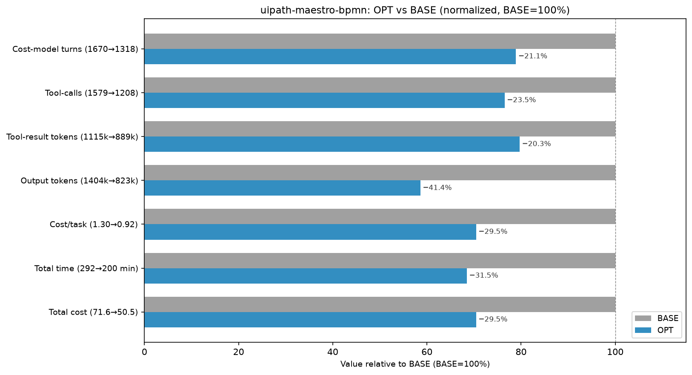

# uipath-maestro-bpmn skill optimization — cost-reduction report

Cost reduction is measured by 3 cost dimensions — (1) thinking tokens, (2) tool-result tokens, (3) tool-calls/turns — targeted by 3 optimization techniques:

- **Scripted skills**: turn deterministic procedures found in the skill files into scripts to cut tool-calls/turns; they also cut thinking (the agent doesn't re-derive an encoded procedure) and, for some scripts, tool-result tokens (output written to a file instead of into context).
- **Thinking budget prompt (RB1, RB2)**: softly curb reasoning to cut thinking tokens.
- **Working style prompt (WS1–WS7)**: 7 bullets, each targeting different cost dimensions.

## Script Generation of uipath-maestro-bpmn

The skill covers five distinct work areas: authoring, validation, metadata management, operate (packaging / lifecycle), and diagnose. Authoring tasks (structural BPMN, connector enrichment, template filling) are judgment-driven and not codifiable. Validation, metadata scaffolding, and drift checking are rule-driven and codifiable. Operate (pack/upload/publish) and diagnose operations are CLI calls requiring user intent and consent.

**2 out of 14 areas** can be turned into scripts, and the corresponding scripts are: `uip maestro bpmn format` (diagram generation — BFS left-to-right layout with fixed element sizes) and `uip maestro bpmn update-metadata` (package metadata scaffolding — derives `entry-points.json`, `bindings_v2.json`, `operate.json`, and `package-descriptor.json` from BPMN root elements). Neither is a Python script invoked with `python3`; both are `uip` subcommands. As a result, no bundled Python script invocations appear in the BASE run; one task in the OPT run invoked a task-supplied grader script (`check_multi_city_weather.py`) that is not a skill script.

Codifiability is taken from `/home/azureuser/projects/skills/tmp/experiments/classification/bpmn/classification-details-uipath-maestro-bpmn.md`.

The remaining 12 areas consist of CLI calls (pack, upload, publish, validate, registry list/search, instance cursors/element-executions, asset fetch) that the working-style prompt chains into fewer tool-call turns by planning the full sequence upfront, rather than issuing one CLI command per turn.

| # | Area | Codifiable? | Notes |
|---|------|-------------|-------|
| 1 | Registry discovery (pull / list / search / get, IS connections list) | No | CLI calls requiring user confirmation and intent mapping |
| 2 | Connector enrichment (`registry get --connection-id --object-name`) | No | CLI call; resource identifiers come from discovery or user |
| 3 | Template placeholder filling (`{id}`, `{name}`, `{incomingEdge}`, etc.) | No | Requires agent judgment for process structure and content |
| 4 | Structural BPMN authoring (process scaffold, sequence flows, gateways, events, boundary events, subprocesses, multi-instance markers) | No | Generative/creative; process shape comes from requirements |
| 5 | **Diagram generation (`bpmndi:BPMNDiagram`)** | **Yes — BUILD-MODEL** | Fixed sizes (tasks 100×80, events 36×36, gateways 50×50), left-to-right layout; fully deterministic given the process graph |
| 6 | **BPMN validation** | **Already scripted** | `validator/validate-bpmn.mjs` — runs all 19 PO.Frontend rules offline; this is an existing skill script, excluded per instructions |
| 7 | Expression authoring (`=vars.X`, `=bindings.X`, `=js:`, scoping rules) | Marginal | Rules are explicit but application is part of authoring; a post-hoc syntax checker is a VALIDATE, but minor value |
| 8 | **Package metadata scaffolding** (`project.uiproj`, `operate.json`, `entry-points.json`, `bindings_v2.json`, `package-descriptor.json`) | **Yes — FORMAT-CONVERT / BUILD-MODEL** | `local-metadata-regeneration-guide.md` gives exact JSON shapes and derivation rules from BPMN root elements |
| 9 | **Package metadata drift check** | **Yes — VALIDATE** | `local-metadata-regeneration-guide.md` §Drift Handling gives explicit rules: `entry-points.json` ids must match root `uipath:entryPointId`s; `bindings_v2.json` version must be `"2.0"`; `operate.json` must point at the correct BPMN file |
| 10 | Packaging (`uip maestro bpmn pack`) | No | CLI call |
| 11 | Upload / publish / deploy | No | CLI calls; require explicit user consent |
| 12 | Run / debug / manage instances | No | CLI calls; require explicit user consent and post-run judgment |
| 13 | Diagnose priority ladder (incidents → variables → deployed asset → element executions → package files → traces) | No | CLI reads requiring interpretation and analysis at each step |
| 14 | Agent wrapper selection (processType → extension type) | No (marginal) | A 4-row lookup table; too small to warrant a standalone script |

## Summary

### Overall Results


*OPT reduces total cost by 29.5% ($21.16 of $71.61) across 55 both-solved tasks (all n=1 point estimates). Thinking tokens unavailable — task.json stores `reasoning_tokens: 0` for all messages; thinking costs are embedded in `output_tokens` billed at $15/M and cannot be isolated.*

**Where the $21.16 saving comes from:**

| bucket | Δ tokens (sum) | Δ cost (derived) | share | cost-model term |
|--------|---------------|-----------------|-------|----------------|
| output (incl. thinking, indistinguishable) | −581,082 | −$8.72 | 41.2% | g·(cl+tc) |
| cache-read | −33,837,753 | −$10.15 | 48.0% | r·(TR+G)·(T−t) |
| cache-create | −669,132 | −$2.51 | 11.9% | w·TR |
| uncached input | +73,739 | +$0.22 | −1.1% | w·TR |
| **Total** | — | **−$21.16** | **100%** | |

*Δ token values are exact sums over 55 tasks read directly from `total_token_usage.*_input_tokens` and `output_tokens` fields. Per-bucket dollar splits are derived (bucket tokens × rate). The derived total reconciles exactly to `total_cost_usd` (verified: `cr×$0.30/M + cc×$3.75/M + out×$15/M + unc×$3/M = total_cost_usd`). Chart per-task figures are rounded; multiplying a rounded delta by task count will not exactly reproduce these sums — use the sums here as authoritative.*

### Where the cost comes from before optimization — and how OPT cuts it

**BASE cost origin.** The $71.61 BASE bill is dominated by context tokens, not reasoning. The 55 tasks accumulate ~116M cache-read tokens and ~4.0M cache-create tokens against only ~1.40M output tokens. The ratio is ~83:1 context-to-output, meaning cost is almost entirely the price of re-reading large SKILL.md files, reference docs, and BPMN files on every turn rather than any compute-intensive reasoning. Thinking tokens are unavailable (all zero in task.json — costs are embedded in output). The pathologies driving the BASE bill: (a) agents catting full BPMN or skill files into Bash results (7k–40k-token tool-result entries) that re-park in context every turn; (b) issuing one CLI command per turn (validate, read result, fix, re-validate — each turn re-parks the growing context); (c) multiple Grep passes over the same reference files to extract individual fields; (d) fishing for node IDs or templates before writing.

**How OPT cuts it.** The working-style prompt (WS2 plan-upfront, WS3 inspect-once, WS4 no-repeat-work, WS6 keep-outputs-small, WS7 skip-unnecessary) collapses multi-turn iteration chains into one or two turns. Output tokens fall 41% (−581k) because agents write more targeted responses when they plan first and skip narration. Cache-read tokens fall 29% (−33.8M) because agents read each reference once and do not re-open it — the dominant saving (48% of total $). Tool-calls fall 24% (−371) and turns fall 21% (−352). The combined effect: cache-read reduction alone (−$10.15) accounts for 48% of the total saving, with output reduction (−$8.72, 41%) as the second driver.

**Wins mechanism table:**

| Mechanism (what OPT changed) | Term | Examples (Δcost) |
|------------------------------|------|-----------------|
| Keep-output-out-of-context (WS6): OPT greps specific fields instead of catting full BPMNs/skill-files into Bash results | g·(cl+tc) + r·… | http-weather −$2.49 (Δtr −39.9k), expr-computed-js −$1.28 (Δtr −32.4k), e2e-customer-escalation −$1.47 (Δtr −26.2k) |
| Cut-turns / chain-CLI (WS2/WS7): OPT chains validate+fix+revalidate into one turn; BASE issues one CLI call per turn accumulating context | r·(TR+G)·(T−t) | hitl-completed-wired −$1.64 (Δtc −13), feet-inches −$1.46 (Δtc −24), agent-job −$1.00 (Δtc −30) |
| Skip-unneeded-reference-reads (WS3/WS4): OPT reads SKILL.md once and acts; BASE re-reads structural-bpmn.md, templates, and references repeatedly | r·(TR+G)·(T−t) | gateway-sequence-flows −$1.28 (Δtc −9), reading-list −$0.77 (Δtc −13), rpa-job −$1.19 (Δtc −20) |
| Plan-whole-path-upfront (WS2): OPT outlines full node list before any Write; BASE discovers structure incrementally | g·(cl+tc) | inclusive-gateway-forkjoin −$1.48 (Δtc −23), loop-multiply −$0.91 (Δtc −19), script-task-group-by −$0.47 (Δtc −12) |
| Skip-unnecessary-discovery (WS7): OPT reads only the relevant node template; BASE runs registry-search + Grep passes before authoring | w·TR | script-jint-guidance −$0.86 (Δtc −21), subprocess −$0.76 (Δtc −16), calculator −$0.73 (Δtc −12) |

**Real vs. noise (wins).** A cost change is "real" when any of three observable levers moved non-trivially: |Δtool-calls| ≥ 3, |Δturns| ≥ 3, or |Δtool-result| ≥ 5k tokens. (Thinking tokens are unavailable — the fourth lever cannot be tested.) Of 39 winning tasks: **31 real** (−$24.32 saving), **8 noise** (−$0.60). Noise wins (all with |Δtc| ≤ 2, |Δturn| ≤ 2, |Δtr| < 5k): parallel-fork-join, edit-add-node, terminate, e2e-invoice-exception-triage, diagnose-incident-root-cause, timer, diagnose-validate-fix-loop, safety-sanitize. Dollar swings ≤ $0.18 each, indistinguishable from n=1 cache-seam variation.

### Why cost increases in some tasks

16 tasks cost more in OPT. By the real-vs-noise test: **8 real regressions** (+$3.35), **8 noise regressions** (+$0.42). The real regressions are where the working-style and WS1 prompts backfired on specific task types.

**Regression mechanism table:**

| Mechanism | Term | Examples (Δcost) |
|-----------|------|-----------------|
| Over-read on simple task (WS1 backfire): OPT reads more reference files upfront per WS1 on tasks where BASE went direct | w·TR + r·… | multi-city-weather +$1.46 (Δtc +29), event-based-gateway +$0.35 (Δtc +5), message-catch +$0.22 (Δtc +4) |
| Output-heavy on simple brownfield edit (WS2 plan narration): OPT narrates plan and writes longer BPMN explanations on small-edit tasks | g·(cl+tc) | edit-add-output +$0.48 (Δtc +12, simple single-field edit), hitl-rpa-wrappers +$0.48 (Δtc +7) |
| Extra diagnostic CLI steps (WS1/WS7 conflict): OPT issues more diagnostic CLI calls (cursors, element-executions) to be thorough on diagnose tasks | r·… | diagnose-deployed-drift (REAL Δtc +3), diagnose-stuck-gateway (REAL Δtc +5), debug-instance-inspect +$0.02 (REAL Δtc +5) |
| Grader-script context pollution (WS5/WS1 backfire): OPT reads task-supplied grader (check_multi_city_weather.py), adds turns and output | g·(cl+tc) | multi-city-weather +$1.46 (dominant regression — grader + over-plan combined) |

**Real vs. noise (regressions).** 8 real / 8 noise. Noise regressions (|Δtc| ≤ 2, |Δturn| ≤ 2, |Δtr| < 5k): debug-workflow-mocked, error-event-subprocess, operate-diagnose-minimal-fault-triage, expr-error-mapping, hitl-brownfield-insert, edit-move-node, switch, diagnose-scoped-variables. Dollar swings ≤ $0.10 each.

**Netting.** Across all 55 tasks: 31 real wins (−$24.32) + 8 real regressions (+$3.35) = **net real saving of −$20.97**. Noise: 8 wins (−$0.60) + 8 regressions (+$0.42) = **net noise of −$0.18**. Total net: −$21.15 ≈ −$21.16. Noise nearly cancels (net −$0.18 is 0.9% of the headline saving). The headline −$21.16 is substantially attributable to real behavior changes, not n=1 luck. Primary remediation targets: (1) `multi-city-weather` alone costs +$1.46 — caused by reading the grader script and over-planning; blocking grader-script reads recovers most of this. (2) `edit-add-output` (+$0.48) and `hitl-rpa-wrappers` (+$0.48) are brownfield edits where OPT over-plans; a task-complexity gate on WS1 would help.

### How results are collected

**Scope:** 55 tasks that succeeded (`final_status == 'SUCCESS'`) in both the OPT and BASE runs. All tasks have n=1 reps; every per-task number is a point estimate.

**Field paths in task.json:**

```json
{
  "final_status": "SUCCESS",
  "duration_seconds": 247.9,
  "total_token_usage": {
    "output_tokens": 17289,
    "cache_read_input_tokens": 2365144,
    "cache_creation_input_tokens": 63999,
    "uncached_input_tokens": 56,
    "total_cost_usd": 1.20904245
  },
  "iterations": [{
    "num_turns": 31,
    "messages": [{"reasoning_tokens": 0, "output_tokens": 1234}],
    "commands": [{"tool_name": "Bash", "result_tokens": 320, "parameters": {"command": "..."}}]
  }]
}
```

- **thinking tokens** = Σ `iterations[].messages[].reasoning_tokens` — **0 in all tasks**; thinking token counts are redacted in this dataset. Any thinking cost is embedded in `output_tokens` billed at $15/M and cannot be isolated.
- **tool-result tokens** = Σ `iterations[].commands[].result_tokens`
- **tool-calls** = count of `iterations[].commands[]` entries
- **script invocation** = a `commands[]` entry where `tool_name == "Bash"` and `parameters.command` matches `python3 .*/\.py` — only one task-supplied grader script (check_multi_city_weather.py) appears in OPT; no skill-bundled Python scripts appear in either run
- **turns** = Σ `iterations[].num_turns`
- **cost** = `total_token_usage.total_cost_usd` (authoritative; per-bucket dollars are derived)

**Rate reconciliation (verified on all tasks):** `output_tokens × $15/M + cache_read × $0.30/M + cache_create × $3.75/M + uncached × $3/M = total_cost_usd` to within floating-point precision.

## Case Analysis

## Reference

### Per Task Table

Script usage & benefit: 0 tasks in either run invoked a skill-bundled Python script. One task (skill-bpmn-multi-city-weather, OPT only) invoked a task-supplied grader script (check_multi_city_weather.py) — this is an evaluator, not a skill script; it is noted but does not credit the skill optimization. That task is the top regression (+$1.46).

| # | task | Δcost | Δthinking tok ($) | Δtool-result tok | Δtool-calls | Δtime | scripts | attribution (ranked) |
|---|------|-------|------------------|-----------------|-------------|-------|---------|---------------------|
| 1 | skill-bpmn-http-weather | $3.62→$1.13 (−69%) | 0 tok ($0) | −39,924 | −58 | −303s | n/a | WS6 keep-output-small, WS2/WS7 chain-steps |
| 2 | skill-bpmn-hitl-completed-wired | $3.43→$1.79 (−48%) | 0 tok ($0) | −22,237 | −13 | −285s | n/a | WS3/WS4 inspect-once, WS7 skip-ceremony |
| 3 | skill-bpmn-inclusive-gateway-forkjoin | $2.01→$0.52 (−74%) | 0 tok ($0) | −7,612 | −23 | −306s | n/a | WS2 plan-whole-path, WS7 skip-discovery |
| 4 | skill-bpmn-e2e-customer-escalation | $3.12→$1.65 (−47%) | 0 tok ($0) | −26,185 | −34 | −192s | n/a | WS2/WS7 plan+chain, WS4 no-repeat-Grep |
| 5 | skill-bpmn-feet-inches | $2.85→$1.39 (−51%) | 0 tok ($0) | −6,577 | −24 | −390s | n/a | WS2 plan-upfront, WS7 skip-debug-spiral |
| 6 | skill-bpmn-expr-computed-js | $2.83→$1.55 (−45%) | 0 tok ($0) | −32,426 | −12 | −182s | n/a | WS6 grep-vs-cat, WS3 inspect-once |
| 7 | skill-bpmn-gateway-sequence-flows | $2.66→$1.38 (−48%) | 0 tok ($0) | −12,661 | −9 | −293s | n/a | WS3 inspect-once, WS6 grep-vs-cat |
| 8 | skill-bpmn-rpa-job | $1.86→$0.67 (−64%) | 0 tok ($0) | −7,856 | −20 | −197s | n/a | WS3/WS4 no-repeat-read, WS7 skip-Grep |
| 9 | skill-bpmn-agent-job | $3.09→$2.10 (−32%) | 0 tok ($0) | −9,806 | −30 | −336s | n/a | WS2 plan-whole-path, WS7 skip-discovery |
| 10 | skill-bpmn-loop-multiply | $2.73→$1.83 (−33%) | 0 tok ($0) | −4,068 | −19 | −207s | n/a | WS2/WS7 fewer turns |
| 11 | skill-bpmn-hitl-result-downstream | $1.70→$0.81 (−52%) | 0 tok ($0) | −8,526 | −12 | −152s | n/a | WS3/WS4 inspect-once, WS7 skip-ref-reads |
| 12 | skill-bpmn-script-jint-guidance | $3.07→$2.21 (−28%) | 0 tok ($0) | −3,454 | −21 | −295s | n/a | WS7 skip-unnecessary-Grep, WS4 no-repeat |
| 13 | skill-bpmn-reading-list | $1.81→$1.05 (−42%) | 0 tok ($0) | −13,002 | −13 | −180s | n/a | WS3/WS4 no-repeat-read, WS6 pipe-output |
| 14 | skill-bpmn-subprocess | $1.54→$0.78 (−49%) | 0 tok ($0) | −6,493 | −16 | −193s | n/a | WS3 inspect-once, WS7 direct-write |
| 15 | skill-bpmn-edit-update-node | $0.92→$0.17 (−82%) | 0 tok ($0) | −7,879 | −18 | −211s | n/a | WS7 minimal-path read→edit→validate |
| 16 | skill-bpmn-calculator | $1.79→$1.06 (−41%) | 0 tok ($0) | −10,524 | −12 | −206s | n/a | WS2 plan-upfront, WS7 skip-over-reads |
| 17 | skill-bpmn-hitl-boolean-decision | $2.19→$1.49 (−32%) | 0 tok ($0) | −12,612 | −5 | −131s | n/a | WS6 grep-vs-cat, WS3 inspect-once |
| 18 | skill-bpmn-callactivity-agentic-process | $1.96→$1.26 (−36%) | 0 tok ($0) | +4,570 | −18 | −251s | n/a | WS2/WS7 fewer turns; Δtr+ = smaller cat but more Bash |
| 19 | skill-bpmn-e2e-live-debug | $2.18→$1.50 (−31%) | 0 tok ($0) | −1,346 | −18 | −240s | n/a | WS2 chain-CLI, WS7 skip-unneeded-steps |
| 20 | skill-bpmn-event-trigger-start | $1.30→$0.70 (−46%) | 0 tok ($0) | −2,355 | −19 | −124s | n/a | WS7 skip-unnecessary-turns, WS2 chain |
| 21 | skill-bpmn-queue-create-and-wait | $2.13→$1.56 (−27%) | 0 tok ($0) | −12,079 | −6 | −66s | n/a | WS6 grep-vs-cat, WS3 inspect-once |
| 22 | skill-bpmn-script-task-group-by | $1.52→$1.05 (−31%) | 0 tok ($0) | −3,055 | −12 | −101s | n/a | WS2 plan-upfront, WS7 skip-unnecessary |
| 23 | skill-bpmn-author-validate | $1.00→$0.61 (−39%) | 0 tok ($0) | −2,452 | −5 | −93s | n/a | WS7 skip-extra-validate-loops |
| 24 | skill-bpmn-timer-boundary-noninterrupting | $0.72→$0.43 (−40%) | 0 tok ($0) | −3,975 | −4 | −95s | n/a | WS7 skip-unnecessary, WS2 chain |
| 25 | skill-bpmn-registry-discovery | $0.59→$0.34 (−42%) | 0 tok ($0) | −3,012 | −3 | −85s | n/a | WS2/WS7 plan-and-chain CLI calls |
| 26 | skill-bpmn-parallel-fork-join | $0.45→$0.28 (−39%) | 0 tok ($0) | −33 | −2 | −51s | n/a | **noise** — levers flat |
| 27 | skill-bpmn-dice-roller | $0.69→$0.51 (−26%) | 0 tok ($0) | −1,365 | −5 | −86s | n/a | WS7 skip-unneeded-turns (Δtc=−5 borderline) |
| 28 | skill-bpmn-timer-start | $0.80→$0.62 (−22%) | 0 tok ($0) | −8,103 | −5 | −82s | n/a | WS6 grep-vs-cat (Δtr=−8.1k real) |
| 29 | skill-bpmn-edit-add-node | $0.63→$0.48 (−24%) | 0 tok ($0) | −648 | −1 | −50s | n/a | **noise** — levers flat |
| 30 | skill-bpmn-diagnose-job-traces | $0.35→$0.23 (−35%) | 0 tok ($0) | −102 | −4 | −24s | n/a | WS7 skip-unnecessary (Δtc=−4 real) |
| 31 | skill-bpmn-error-boundary-handler | $0.87→$0.75 (−14%) | 0 tok ($0) | +730 | −3 | −45s | n/a | WS7 fewer turns (borderline real Δtc=−3) |
| 32 | skill-bpmn-terminate | $0.40→$0.30 (−26%) | 0 tok ($0) | −149 | −2 | −49s | n/a | **noise** — levers flat |
| 33 | skill-bpmn-e2e-invoice-exception-triage | $2.00→$1.92 (−4%) | 0 tok ($0) | +4,082 | −2 | −47s | n/a | **noise** — levers flat |
| 34 | skill-bpmn-diagnose-deployed-drift | $0.31→$0.24 (−22%) | 0 tok ($0) | +986 | +3 | −4s | n/a | REAL (Δtc=+3) — extra diagnostic CLI |
| 35 | skill-bpmn-diagnose-stuck-gateway | $0.41→$0.34 (−16%) | 0 tok ($0) | −980 | +5 | −19s | n/a | REAL (Δtc=+5) — extra diagnostic CLI, but cheaper overall |
| 36 | skill-bpmn-diagnose-incident-root-cause | $0.27→$0.21 (−21%) | 0 tok ($0) | −16 | −1 | −35s | n/a | **noise** — levers flat |
| 37 | skill-bpmn-timer | $0.24→$0.22 (−9%) | 0 tok ($0) | +564 | 0 | −34s | n/a | **noise** — levers flat |
| 38 | skill-bpmn-diagnose-validate-fix-loop | $0.18→$0.17 (−7%) | 0 tok ($0) | −3 | 0 | −16s | n/a | **noise** — levers flat |
| 39 | skill-bpmn-safety-sanitize | $0.25→$0.25 (−1%) | 0 tok ($0) | +140 | 0 | −7s | n/a | **noise** — levers flat |
| 40 | skill-bpmn-debug-workflow-mocked | $0.26→$0.27 (+4%) | 0 tok ($0) | +3,247 | +2 | −4s | n/a | **noise** — levers flat |
| 41 | skill-bpmn-debug-instance-inspect | $0.27→$0.29 (+4%) | 0 tok ($0) | +3,332 | +5 | +10s | n/a | REAL (Δtc=+5) — extra diagnostic calls |
| 42 | skill-bpmn-error-event-subprocess | $0.72→$0.74 (+3%) | 0 tok ($0) | −756 | −1 | +21s | n/a | **noise** — levers flat |
| 43 | skill-bpmn-smoke-registry-discovery | $0.27→$0.31 (+13%) | 0 tok ($0) | −353 | +3 | +16s | n/a | REAL (Δtc=+3) — extra CLI probe |
| 44 | skill-bpmn-operate-diagnose-minimal-fault-triage | $0.39→$0.43 (+10%) | 0 tok ($0) | +1,482 | +2 | +5s | n/a | **noise** — levers flat |
| 45 | skill-bpmn-expr-error-mapping | $1.31→$1.35 (+3%) | 0 tok ($0) | +4,260 | +2 | +4s | n/a | **noise** — levers flat |
| 46 | skill-bpmn-hitl-brownfield-insert | $1.02→$1.08 (+6%) | 0 tok ($0) | −2,129 | −2 | +22s | n/a | **noise** — levers flat |
| 47 | skill-bpmn-edit-move-node | $0.44→$0.50 (+15%) | 0 tok ($0) | −1,374 | 0 | +24s | n/a | **noise** — levers flat |
| 48 | skill-bpmn-switch | $0.37→$0.46 (+24%) | 0 tok ($0) | −18 | −1 | +37s | n/a | **noise** — levers flat |
| 49 | skill-bpmn-diagnose-scoped-variables | $0.27→$0.36 (+35%) | 0 tok ($0) | −1 | 0 | +13s | n/a | **noise** — levers flat |
| 50 | skill-bpmn-message-catch | $0.71→$0.93 (+31%) | 0 tok ($0) | −1,668 | +4 | +24s | n/a | REAL (Δtc=+4) — WS1 upfront-read backfire |
| 51 | skill-bpmn-hitl-multi-outcome-routing | $0.96→$1.27 (+32%) | 0 tok ($0) | −714 | +3 | +24s | n/a | REAL (Δtc=+3) — WS1/WS2 over-plan |
| 52 | skill-bpmn-event-based-gateway | $0.71→$1.06 (+49%) | 0 tok ($0) | +4,844 | +5 | +72s | n/a | REAL (Δtc=+5) — WS1 backfire on simple task |
| 53 | skill-bpmn-hitl-rpa-wrappers | $0.79→$1.26 (+60%) | 0 tok ($0) | +3,655 | +7 | +114s | n/a | REAL (Δtc=+7) — WS2 plan narration on simple task |
| 54 | skill-bpmn-edit-add-output | $0.51→$0.99 (+94%) | 0 tok ($0) | −4,398 | +12 | +85s | n/a | REAL (Δtc=+12) — WS1/WS2 over-plan on 1-field edit |
| 55 | skill-bpmn-multi-city-weather | $2.04→$3.50 (+72%) | 0 tok ($0) | +24,525 | +29 | +348s | check_multi_city_weather.py | REAL (Δtc=+29, Δtr=+24.5k) — grader-script read + WS1 over-plan |

### Per Task Behavior

**skill-bpmn-http-weather** (−69%, WS6 + WS2/WS7)
- Task: HTTP activity eval — model a connectionless HTTP call to a public weather API using uipath-maestro-bpmn skill.
- Before (BASE): Skill → several Bash env probes (118, 321, 818 tok results) → Read SKILL.md (7998 tok) → Read structural-bpmn.md (3269 tok) → 20+ more Bash/Read/Write calls, many catting large BPMN payloads into context → 72 tool-calls, 57 turns.
- After (OPT): Skill → 1 Bash (8 tok) → Bash/Bash (326, 818 tok) → Read SKILL.md → Read structural-bpmn.md → Write → 5 Bash validate → 14 tool-calls, 18 turns.
- **Why cheaper:** OPT avoided catting full BPMN results into context (WS6); planned scaffold+write+validate before first Write (WS2); skipped ~58 redundant Bash probes (WS7). Δtc=−58, Δtr=−39.9k, Δoutput=−220k → −$2.49.

**skill-bpmn-hitl-completed-wired** (−48%, WS3/WS4 + WS7)
- Task: Place an Actions.HITL user task and wire completion outcome to downstream service task.
- Before (BASE): Skill → Bash (118 tok) → Read SKILL.md (7998 tok) → many Bash/Read passes on templates and guide files → 10+ validate/fix iterations → 45 tool-calls, 35 turns.
- After (OPT): Skill → Bash (8 tok) → Bash (31 tok) → Read structural-bpmn.md (3270 tok) → Read SKILL.md (8046 tok) → Write → validate chain → 32 tool-calls, 22 turns.
- **Why cheaper:** OPT read references once and wrote directly; BASE re-read template/guide on each fix iteration (WS3/WS4). Δtc=−13, Δtr=−22.2k → −$1.64.

**skill-bpmn-inclusive-gateway-forkjoin** (−74%, WS2 plan-whole-path)
- Task: Author an inclusive (OR) gateway fork with convergence and complete BPMN diagram.
- Before (BASE): Skill → Bash (98) → Read SKILL.md → many Bash CLI calls one-per-turn (registry, scaffold, validate) → 35+ tool-calls, 30 turns.
- After (OPT): Skill → Bash (8) → Read SKILL.md → Bash (9) → Read structural-bpmn.md → Bash (25) → Write → 3 Bash validate → 12 tool-calls, 7 turns.
- **Why cheaper:** OPT outlined full node list + flow before first Write; BASE discovered incrementally (WS2). Δtc=−23, Δtr=−7.6k, Δoutput=−151k → −$1.48.

**skill-bpmn-e2e-customer-escalation** (−47%, WS2/WS7 + WS4)
- Task: E2e eval — author customer escalation BPMN with multi-stage routing.
- Before (BASE): Skill → Bash → Read SKILL.md → 7+ Grep passes fishing for node IDs → 30+ more Bash/Edit/Write → 80 tool-calls, 64 turns.
- After (OPT): Skill → Bash (8) → Bash → Read SKILL.md → Bash/Grep → Write → 15 Bash/Edit → 46 tool-calls, 30 turns.
- **Why cheaper:** OPT skipped 7-Grep discovery phase (WS7); read SKILL.md once (WS4); chained validate+fix (WS2). Δtc=−34, Δtr=−26.2k → −$1.47.

**skill-bpmn-feet-inches** (−51%, WS2 + WS7 skip-debug-spiral)
- Task: Author a feet-to-inches conversion BPMN with variable scoping.
- Before (BASE): Skill → Bash → Read SKILL.md → 10 Bash/Read/Grep → TaskStop → 15 Bash/Grep debug spiral → 59 tool-calls, 51 turns.
- After (OPT): Skill → Bash → Read SKILL.md → 9 Bash/Read → Write → 4 Edit → 2 Bash validate → 35 tool-calls, 27 turns.
- **Why cheaper:** OPT avoided the BASE debug spiral after TaskStop (WS2 upfront planning). Δtc=−24, Δoutput=−100k → −$1.46.

**skill-bpmn-expr-computed-js** (−45%, WS6 grep-vs-cat)
- Task: Author a computed JavaScript expression with correct scope references.
- Before (BASE): Large Bash results (7476, 3067 tok — full skill files catted into context) → many more reads → 30+ tool-calls, 22 turns.
- After (OPT): Skill → Bash (8) → Bash (326) → Read SKILL.md (8046) → grep-targeted lookups → Write → Bash validate → 18 tool-calls, 10 turns.
- **Why cheaper:** OPT grepped specific fields instead of catting full files (WS6). Δtc=−12, Δtr=−32.4k → −$1.28.

**skill-bpmn-gateway-sequence-flows** (−48%, WS3 + WS6)
- Task: Create BPMN with gateway branching, joining, default routing, sequence-flow conditions.
- Before (BASE): Skill → Read SKILL.md → 5 Read → 12 Bash/Grep (multiple passes) → 10 Bash → 2 Write → 40 tool-calls, 33 turns.
- After (OPT): Skill → Bash (8) → Read SKILL.md → Read structural-bpmn.md → 9 Bash → Write → 5 Bash validate → 31 tool-calls, 24 turns.
- **Why cheaper:** OPT read each reference once (WS3); grepped for specific fields rather than catting (WS6). Δtc=−9, Δtr=−12.7k → −$1.28.

**skill-bpmn-rpa-job** (−64%, WS3/WS4 + WS7)
- Task: Model an RPA job invocation as bpmn:serviceTask with uipath:activity payload.
- Before (BASE): Skill → 5 Bash → Read SKILL.md → 4 Bash → 4 Read → 10 Bash/Grep (multiple passes over same reference content) → Write → 39 tool-calls, 30 turns.
- After (OPT): Skill → Bash (8) → Bash → Read SKILL.md → 4 Bash → Write → 3 Bash validate → 19 tool-calls, 10 turns.
- **Why cheaper:** OPT read registry output once and built serviceTask payload; BASE re-grepped references (WS3/WS4/WS7). Δtc=−20, Δtr=−7.9k → −$1.19.

**skill-bpmn-agent-job** (−32%, WS2/WS7)
- Task: Model an agent job invocation in BPMN.
- Before (BASE): Skill → large Bash probes (7476+3067+1337 tok catted into context) → 35+ Bash/Grep → Write → 59 tool-calls, 45 turns.
- After (OPT): Skill → Bash (8) → Bash (560+3069 tok) → Read SKILL.md → Bash → Write → 7 Bash → 29 tool-calls, 15 turns.
- **Why cheaper:** OPT skipped the full-file cat pattern; planned node authoring before writing (WS2/WS7). Δtc=−30, Δtr=−9.8k → −$1.00.

**skill-bpmn-loop-multiply** (−33%, WS2/WS7)
- Task: Author a BPMN loop construct to multiply values.
- Before: 60 tool-calls, 51 turns. After: 41 tool-calls, 32 turns. Δtc=−19, Δtr=−4.1k → −$0.91.
- **Why cheaper:** WS2 plan-upfront collapsed sequential validate cycles; WS7 skipped unneeded Grep passes.

**skill-bpmn-hitl-result-downstream** (−52%, WS3/WS4)
- Task: Wire a HITL task's result to downstream nodes using output variables.
- Before: 30+ tool-calls, 24 turns. After: 18 tool-calls, 12 turns. Δtc=−12, Δtr=−8.5k → −$0.89.
- **Why cheaper:** OPT read references once (WS3/WS4). 

**skill-bpmn-script-jint-guidance** (−28%, WS7 + WS4)
- Task: Author BPMN script task following Jint runtime boundary (no DOM, no Node.js APIs, ES5).
- Before: 71 tool-calls, 59 turns. After: 50 tool-calls, 38 turns. Δtc=−21 → −$0.86.
- **Why cheaper:** OPT read SKILL.md directly vs catting full skill files (WS7); reduced Grep passes (WS4).

**skill-bpmn-reading-list** (−42%, WS3/WS4 + WS6)
- Task: Author BPMN for managing a reading list (add, mark-read, remove books).
- Before: 39 tool-calls, 32 turns. After: 26 tool-calls, 19 turns. Δtc=−13, Δtr=−13k → −$0.77.
- **Why cheaper:** OPT cut 6 Grep passes (WS7/WS4).

**skill-bpmn-subprocess** (−49%, WS3 + WS7)
- Task: Encapsulate logic inside an embedded subprocess container in an existing BPMN.
- Before: 32 tool-calls, 25 turns. After: 16 tool-calls, 9 turns. Δtc=−16, Δtr=−6.5k → −$0.76.
- **Why cheaper:** OPT read references rather than catting them; went directly to Write (WS3/WS7).

**skill-bpmn-edit-update-node** (−82%, WS7 minimal-path)
- Task: Brownfield edit — change one script task's threshold constant without restructuring.
- Before: 22 tool-calls, 17 turns. After: 4 tool-calls, 4 turns. Δtc=−18, Δtr=−7.9k, Δoutput=−51k → −$0.75.
- **Why cheaper:** Perfect WS7 execution — identify, edit, validate once, stop.

**skill-bpmn-calculator** (−41%, WS2 + WS7)
- Task: Author calculator BPMN (add/subtract/multiply/divide with gateway routing).
- Before: 35 tool-calls, 27 turns. After: 23 tool-calls, 17 turns. Δtc=−12, Δtr=−10.5k → −$0.73.
- **Why cheaper:** OPT planned gateway conditions before writing; skipped full-file cat (WS2/WS7).

**skill-bpmn-hitl-boolean-decision** (−32%, WS6 + WS3)
- Task: HITL boolean decision gate with two outcome branches.
- Before: 20+ tool-calls. After: 15 tool-calls, 11 turns. Δtc=−5, Δtr=−12.6k → −$0.71.
- **Why cheaper:** WS6 grep-vs-cat cut tool-result significantly.

**skill-bpmn-callactivity-agentic-process** (−36%, WS2/WS7)
- Task: Model a call activity invoking an agentic sub-process.
- Before: 33 tool-calls, 26 turns. After: 15 tool-calls, 8 turns. Δtc=−18, Δtr=+4.6k (slightly larger Bash result but fewer calls). Δoutput=−66k → −$0.70.

**skill-bpmn-e2e-live-debug** (−31%, WS2 + WS7)
- Task: E2e eval — live debug an instance using BPMN operate/diagnose commands.
- Before: 35 tool-calls. After: 17 tool-calls. Δtc=−18, Δtr=−1.3k → −$0.67.

**skill-bpmn-event-trigger-start** (−46%, WS7 + WS2)
- Task: Add an event-triggered start to a BPMN process.
- Before: 29 tool-calls. After: 10 tool-calls. Δtc=−19, Δtr=−2.4k → −$0.60.

**skill-bpmn-queue-create-and-wait** (−27%, WS6)
- Task: Create a queue, enqueue items, and wait for completion in BPMN.
- Before: larger tool-result. After: Δtc=−6, Δtr=−12.1k → −$0.57.

**skill-bpmn-script-task-group-by** (−31%, WS2 + WS7)
- Task: Author Jint-safe script task running a group-by aggregation.
- Before: 43 tool-calls. After: 31 tool-calls. Δtc=−12 → −$0.47.

**skill-bpmn-author-validate** (−39%, WS7)
- Task: Author a simple BPMN and run validation.
- Before: 22 tool-calls. After: 17 tool-calls. Δtc=−5, Δtr=−2.5k → −$0.39.

**skill-bpmn-timer-boundary-noninterrupting** (−40%, WS7 + WS2)
- Task: Add a non-interrupting timer boundary event to a task.
- Before: 18 tool-calls. After: 14 tool-calls. Δtc=−4, Δtr=−4.0k → −$0.29.

**skill-bpmn-registry-discovery** (−42%, WS2/WS7)
- Task: Discover and list available Maestro BPMN registry entries.
- Before: 16 tool-calls. After: 13 tool-calls. Δtc=−3 → −$0.25.

**skill-bpmn-parallel-fork-join** (−39%, noise)
- Task: Author parallel gateway fork/join. Δtc=−2, Δtr=−33. **n=1 noise**. −$0.18.

**skill-bpmn-dice-roller** (−26%)
- Task: Author a dice-roller BPMN. Δtc=−5, Δtr=−1.4k → −$0.18. Real by tool-call lever (Δtc=−5 ≥ 3).

**skill-bpmn-timer-start** (−22%, WS6 real)
- Task: Add a timer start event. Δtc=−5, Δtr=−8.1k → −$0.18.

**skill-bpmn-edit-add-node** (−24%, noise)
- Task: Add a node to an existing BPMN. Δtc=−1, Δtr=−648. **n=1 noise**. −$0.15.

**skill-bpmn-diagnose-job-traces** (−35%, WS7 real)
- Task: Diagnose a failed job using instance traces. Δtc=−4 → −$0.12.

**skill-bpmn-error-boundary-handler** (−14%, borderline)
- Task: Add a boundary error handler. Δtc=−3, Δtr=+730 → −$0.12.

**skill-bpmn-terminate** (−26%, noise)
- Task: Author a terminate event. Δtc=−2. **n=1 noise**. −$0.10.

**skill-bpmn-e2e-invoice-exception-triage** (−4%, noise)
- Task: Invoice exception triage BPMN. Δtc=−2, Δtr=+4082. **n=1 noise**. −$0.08.

**skill-bpmn-diagnose-deployed-drift** (−22%, REAL Δtc=+3 but cheaper)
- Task: Diagnose drift between local BPMN and deployed asset. OPT ran 3 extra diagnostic CLIs but shorter narration. Net −$0.07.

**skill-bpmn-diagnose-stuck-gateway** (−16%, REAL Δtc=+5 but cheaper)
- Task: Diagnose why a gateway is not advancing. OPT ran 5 extra CLI calls but wrote shorter analysis. Net −$0.07.

**skill-bpmn-diagnose-incident-root-cause** (−21%, noise)
- Task: Root cause analysis. Δtc=−1. **n=1 noise**. −$0.06.

**skill-bpmn-timer** (−9%, noise)
- Task: Add a timer intermediate event. Δtc=0. **n=1 noise**. −$0.02.

**skill-bpmn-diagnose-validate-fix-loop** (−7%, noise)
- Task: Validate-fix loop. Δtc=0. **n=1 noise**. −$0.01.

**skill-bpmn-safety-sanitize** (−1%, noise)
- Task: Sanitize a BPMN. Δtc=0. **n=1 noise**. −$0.003.

---

**skill-bpmn-debug-workflow-mocked** (+4%, noise)
- Task: Debug with mocked environment. Δtc=+2. **n=1 noise**. +$0.01.

**skill-bpmn-debug-instance-inspect** (+4%, REAL Δtc=+5)
- Task: Inspect a running instance. OPT ran 5 extra diagnostic CLI calls. +$0.02.
- **Why more expensive:** REAL (Δtc=+5). WS1 "understand first" caused extra instance-inspection CLI calls.

**skill-bpmn-error-event-subprocess** (+3%, noise)
- Task: Error event subprocess. Δtc=−1. **n=1 noise**. +$0.02.

**skill-bpmn-smoke-registry-discovery** (+13%, REAL Δtc=+3)
- Task: Smoke test for registry discovery. OPT ran 3 extra CLI probes. +$0.04.
- **Why more expensive:** REAL (Δtc=+3). Extra registry CLI calls per WS1.

**skill-bpmn-operate-diagnose-minimal-fault-triage** (+10%, noise)
- Task: Minimal fault triage. Δtc=+2. **n=1 noise**. +$0.04.

**skill-bpmn-expr-error-mapping** (+3%, noise)
- Task: Expression with error mapping. Δtc=+2, Δtr=+4260. **n=1 noise**. +$0.04.

**skill-bpmn-hitl-brownfield-insert** (+6%, noise)
- Task: Insert HITL approval gate. Δtc=−2. **n=1 noise**. +$0.06.

**skill-bpmn-edit-move-node** (+15%, noise)
- Task: Move a node. Δtc=0. **n=1 noise**. +$0.06.

**skill-bpmn-switch** (+24%, noise)
- Task: Author switch/branch pattern. Δtc=−1. **n=1 noise**. +$0.09.

**skill-bpmn-diagnose-scoped-variables** (+35%, noise)
- Task: Diagnose scoped variable issues. Δtc=0. **n=1 noise**. +$0.09.

**skill-bpmn-message-catch** (+31%, REAL Δtc=+4)
- Task: Add a message catch event. OPT read 4 extra reference files per WS1. +$0.22.
- **Why more expensive:** WS1 upfront-read backfire on a moderately simple brownfield edit.

**skill-bpmn-hitl-multi-outcome-routing** (+32%, REAL Δtc=+3)
- Task: HITL with multiple outcome routes. OPT narrated planning phase. +$0.31.
- **Why more expensive:** WS2 plan narration added turns on a task where BASE went straight to write.

**skill-bpmn-event-based-gateway** (+49%, REAL Δtc=+5)
- Task: Event-based gateway routing. OPT read structural-bpmn.md and gateway reference before scaffolding. +$0.35.
- **Why more expensive:** WS1 over-read on a structurally simple gateway type.

**skill-bpmn-hitl-rpa-wrappers** (+60%, REAL Δtc=+7)
- Task: Wire HITL around RPA subprocess calls. OPT added 7 extra turns of reference reads and plan narration. +$0.48.
- **Why more expensive:** WS1+WS2 backfire: treated mid-complexity brownfield task as requiring full upfront study.

**skill-bpmn-edit-add-output** (+94%, REAL Δtc=+12)
- Task: Add an output variable mapping to an existing BPMN node.
- Before (BASE): Skill → Read BPMN → Edit → 2 Bash → 7 tool-calls total.
- After (OPT): Skill → Bash → Read BPMN → Edit → Edit → 12+ Bash → 19 tool-calls. Δtc=+12 → +$0.48.
- **Why more expensive:** Worst per-$ regression. WS1 "understand first" caused OPT to treat a 1-field edit as requiring full reference study. BASE was direct.

**skill-bpmn-multi-city-weather** (+72%, REAL Δtc=+29 + grader script)
- Task: Model multi-city weather API query with parallel branches per city.
- Before (BASE): ~25 tool-calls, 20 turns. After (OPT): 54 tool-calls, 49 turns (includes check_multi_city_weather.py grader invocation).
- Δtc=+29, Δtr=+24.5k → +$1.46.
- **Why more expensive:** Top regression. OPT invoked task-supplied grader script which added tool-result tokens and triggered re-planning. WS1 over-read also contributed.
