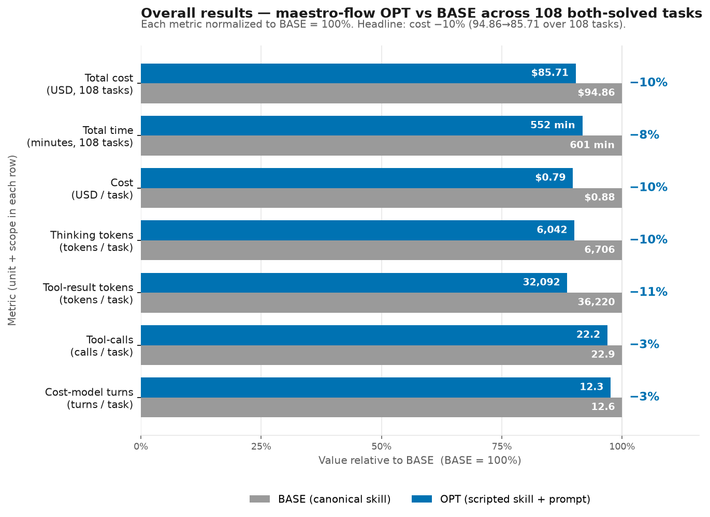

# maestro-flow skill optimization — cost-reduction report

Cost reduction is measured by 3 cost dimensions: (1) number of thinking tokens, (2) number of tool result tokens, and (3) number of tool calls/turns, which are targeted by 3 optimization techniques: (1) Scripted-skills, (2) thinking budget prompt, and (3) working style prompt.

- **Scripted skills**: turn deterministic procedures found in skills into scripts to reduce the number of tool calls/turns. It also reduces thinking tokens because agents don't think over encoded procedures. Depending on the skill, some scripts also reduce tool result tokens by writing tool results to a file.
- **Thinking budget prompt**: curb agent thinking softly to reduce the number of thinking tokens.
- **Working style prompt**: 7 bullet points targeting all 3 cost dimensions.

## Script Generation of Maestro-flow

The skill has an enormous surface area (20+ plugin types in author alone, plus operate, diagnose, evaluate). Roughly 30 of its ~35 distinct operations are CLI calls, consent-gated actions, or generative/judgment-intensive editing steps.

**1 out of 32 areas** can be turned into a script, and the corresponding script is: (1) `validate_evaluators.py` (eval-set evaluator structure validation — a VALIDATE procedure). The skill's own CLI (`flow validate`, `flow format`) already handles static correctness checks for the `.flow` file itself, so those are not re-scripted.

Codifiability is taken from `/home/azureuser/projects/skills/tmp/experiments/classification/flow/classification-details-uipath-maestro-flow.md` (classification: **Partial**).

Note that the vast majority of areas are CLI calls; the working-style prompt chains independent CLI calls into a single tool call by planning ahead given the task requirements, and redirects their bulk output to files instead of into context.

| # | Operation / workflow | Codifiable? | Notes |
|---|---------------------|-------------|-------|
| 1 | `uip maestro flow init` — scaffold a new flow project | No | CLI call |
| 2 | Registry search / list / get — discover node types | No | CLI calls; selection requires judgment |
| 3 | Add user-owned nodes (Edit/Write to `.flow`) — triggers, control-flow, logic, HITL, patterns, agents, queues, resource nodes | No | Generative; shape is driven by requirements |
| 4 | Add CLI-owned nodes (`node add` + `node configure`) — connector, connector-trigger, managed HTTP | No | CLI calls; connector key + operation selected from registry |
| 5 | Configure IS connections + resource IDs (`uip is connections list`, `uip is resources run list`) | No | CLI calls; connection choice and resource lookup require judgment |
| 6 | Wire nodes with edges (`targetPort` required on every edge) | No | Editing; wiring decisions are generative |
| 7 | Manage variables and expressions (`variables`, `=js:` prefix rules) | No | Editing with explicit rules, but content is generative |
| 8 | Script node authoring (Jint ES2020 JS) | No | Creative |
| 9 | Transform node authoring (filter / map / group-by) | No | Declarative but content-driven |
| 10 | Subflow creation | No | Editing |
| 11 | `flow validate` — local correctness check | No | CLI call (already scripted by the CLI itself) |
| 12 | `flow format` — layout normalization | No | CLI call |
| 13 | Plan generation before building | No | Planning; open-ended |
| 14 | `solution resources refresh` — sync resource declarations | No | CLI call |
| 15 | `solution upload` — push to Studio Web | No | CLI call; consent gate |
| 16 | `flow pack` + `solution publish` — deploy to Orchestrator | No | CLI calls; explicit consent required |
| 17 | `flow debug` — cloud end-to-end run | No | CLI call; consent gate |
| 18 | `process run` — trigger deployed process | No | CLI call |
| 19 | `job status` / `job traces` — check or stream execution | No | CLI calls |
| 20 | Instance lifecycle — pause / resume / cancel / retry | No | CLI calls; retry requires prior diagnosis |
| 21 | Read incidents — identify error category + faulting element | No | CLI call + interpretation |
| 22 | Fetch runtime variable state at failure | No | CLI call + interpretation |
| 23 | Correlate faulting element ID to `.flow` node | No | JSON lookup; trivial one-liner |
| 24 | Recognize known failure modes (MST-9107, MST-9061, etc.) | No | Pattern matching on incident output; `flow validate` already catches MST-9107 + MST-9061 |
| 25 | `eval set create` — define a new eval set | No | CLI call |
| 26 | Add simulation data points — define synthetic test cases | No | CLI + JSON editing |
| 27 | Add recording data points — replay past runs | No | CLI call |
| 28 | **Define evaluators (7 types) — validate structure before submit** | **Yes — VALIDATE** | 7 types with explicit required fields documented in `evaluators-guide.md`; malformed JSON causes API rejection |
| 29 | `eval run start` — launch evaluation | No | CLI call |
| 30 | `eval run status` — poll run state | No | CLI call |
| 31 | `eval run results` — fetch per-data-point scores | No | CLI call |
| 32 | `eval run compare` — diff two run scores | No | CLI call |

## Summary
### Overall Results


*OPT vs BASE across the 108 both-solved tasks, each metric normalized to BASE = 100%. The headline is cost −10% ($94.86 → $85.71). Unlike the bpmn skill (thinking-dominated), maestro-flow's saving is tool-result / cache-read dominated — it is a CLI-heavy skill.*

**Where the $9.15 saving comes from**
| bucket | Δ tokens (sum) | share | cost-model term |
|---|---|---|---|
| **cache-read** | −14,822,803 | **49%** | r·(TR+G)·(T−t) |
| **non-thinking output** (output token − thinking) | −122,639 | 20% | g·(cl+tc) |
| cache-create + uncached input | −473,055 | 20% | w·TR |
| **thinking** | −71,676 | 12% | g·thk |

Cache-read dominates: this skill pours large CLI/tool results into context, so keeping them out (redirects, files) and cutting turns — both working-style effects — drives the saving. Thinking is a small contributor (12%), and the bundled script `validate_evaluators.py` **never ran** in any both-solved task.

*Note: the Δ-token figures in this table are **exact sums** over the both-solved tasks; the per-task numbers in the chart above are **rounded** for display, so multiplying a rounded chart delta by the task count will not exactly reproduce these sums (e.g. thinking `(6706−6042)×108 = 71,712` vs the exact `−71,676`, a ~36-token rounding gap). The exact sums are authoritative.*

### Where the cost comes from before optimization — and how OPT cuts it

Before optimization the cost is overwhelmingly **context**. The agent pulls large CLI dumps and 15–24k-token reference files straight into the context, then drags them across dozens of turns, which is paid for again and again. 

The optimization attacks exactly those sources: it keeps bulk output out of context (redirect registry/CLI dumps to files and `grep`/filter them, skip references a task doesn't need), edits files instead of rewriting them, and chains CLI calls while dropping the TODO list and file re-probing — so both the context *size* and the *turn count* shrink. The reductions land almost entirely on context: **cache-read falls ~14.8M tokens (128M→113M)** — by far the largest move — with cache-create down ~0.49M, non-thinking output ~0.12M, and thinking ~0.07M. 

The optimization resolves into four recurring behavior changes. Each tied to a cost term and its measured effect:

| Mechanism (what OPT changed) | Term | Examples (Δcost) |
|---|---|---|
| **Keep bulk CLI/reference output out of context** — redirect `registry get`/`connections list` to `/tmp` + `grep`/`python`-extract, or `--output-filter`/`\| head`, instead of dumping raw JSON/big refs in (WS6/WS3) | `w·TR` + re-read tax | `bellevue-weather-simulated` −33% (TR 99.9k→38.4k), `ipe-jira-lifecycle` −16%, `ipe-drive-to-slack` −6% |
| **Skip references a task doesn't need** — no 7–15k-token author/format refs for a lookup or narrow config (WS3/WS7) | `w·TR` + re-read tax | `eval-evaluator-type-choice` −52% (TR 17.7k→6.8k), listing rows `…/r03,r04,r08` −27…−38% |
| **Collapse over-reasoning** — one reserved thinking burst instead of several; act, don't re-derive (RB1/RB2) | `g·G` | `expense-approval-simulated` −52% (think 25.5k→5.2k), `eval-inline-agent` −51% (41k→15k) |
| **Cut turns: chain CLI + drop ceremony/detours** — batch `uip` calls into one turn; delete to-do scaffolding, fs fishing, wrong-turn detours (WS2/WS7); also edit-don't-rewrite (WS5) | re-read tax via `(T−t)` | `eval-simulation-crud` −52% (calls 40→6), `ixp-invoice-extraction-simulated` −45%, `remove-node` −23% (output 19.7k→5.1k) |

Because every task is single-rep (n=1), a cost change only counts as a real optimization effect when the agent *measurably did something different* across the levers the optimization targets — tool-calls, turns, tool-result tokens, or thinking tokens. If all four are flat and only the cost moved, it is noise.

### How Are results Collected
All metrics are read from each run's `default/<task>/<rep>/task.json` (dataset-backed tasks are `<task>/<row>/<rep>/task.json`), for the **108 tasks that are `final_status=="SUCCESS"` in both arms** (both-solved). **n = 1 rep/task**, so per-task numbers are point estimates.

**Thinking tokens** → sum `output_tokens` of every *thinking-only* assistant message under `iterations[].messages[]` (block-types exactly `["thinking"]`):
  ```json
  { "role": "assistant", "content_blocks": [{"block_type": "thinking"}], "output_tokens": 9218 }
  ```

**Tool-result tokens** → sum `result_tokens` of every entry in `iterations[].commands[]`:
  ```json
  { "tool_name": "Bash", "parameters": {"command": "uip maestro flow registry list ..."}, "result_tokens": 2444 }
  ```

**Tool calls** → count of `iterations[].commands[]` entries. A **script invocation** = a `Bash` command whose `parameters.command` matches `python3 …/validate_evaluators.py` (a `Read`/`grep` of the source does not count).

**Cache/output buckets** → direct integer fields on `total_token_usage`: `cache_read_input_tokens` (r), `cache_creation_input_tokens` (w), `output_tokens` (g; thinking is the subset above), `uncached_input_tokens`. **cost** = `total_token_usage.total_cost_usd`; **time** = `duration_seconds`. Dollarize deltas with Sonnet rates: output/thinking $15/M, cache-read $0.30/M, cache-create $3.75/M, uncached $3/M.

## Case Analysis

**skill-flow-eval-simulation-crud** (-52%, WS7+WS2 [RB2 planning])
- Task: Skill-guided simulation CRUD — scaffold a Flow project, build an eval set + data point + simulations via `uip maestro flow eval ...`.
- Before (BASE): 53 assistant-turns of ceremony. Read the 3 evaluate refs (~9.4k tok), created 8 to-dos (TaskCreate T7-T14), then wrapped EVERY `uip` CLI call in a TaskUpdate in_progress→completed pair (T15-T45). Each CLI ran in its own turn (~12 separate Bash turns) plus filesystem/list probes. Almost no thinking (860).
- After (OPT): Same 3 refs, then ONE 2,997-tok planning burst (T6), then executed the whole CRUD flow in just TWO batched Bash turns (T7, T8) — chained `uip ...` with `echo "=== Step N ==="` markers. Zero to-do calls. Tool-calls 40→6.
- **Why cheaper:** Turn count collapsed (9→5); each surviving turn re-reads full context, so killing ~40 near-empty to-do/CLI turns slashes the r·context·(turns-remaining) term — the dominant win. Thinking actually ROSE 860→3104 (front-loaded plan, WS2/RB2), a real g increase but dwarfed by the r savings. tool-result flat (10996→10562). Structural, not noise.

**skill-flow-eval-inline-agent** (-51%, RB2/RB1 + WS7 + WS2)
- Task: Skill-guided build of a Flow whose work is an INLINE autonomous agent node, then wire evaluation.
- Before (BASE): 15 turns, 38 tool-calls. Four giant thinking bursts (T11=9531, T16=7278, T19=6292, T28=13794 ≈ 37k thinking) re-deriving the design. Heavy to-do ceremony — ~12 TaskCreate/TaskUpdate calls interleaved with work.
- After (OPT): 10 turns, 19 tool-calls. Zero to-do ceremony. One upfront reasoning burst (T10=13868) then execution: chained solution init + flow init in one Bash turn, used python heredoc to extract node defs from dumped JSON rather than re-reasoning. Thinking 41117→15008.
- **Why cheaper:** Dominated by g — ~26k fewer thinking tokens ×5 is the bulk (RB2: stopped spending four deep bursts, reserved one). WS7 removed ~12 to-do calls; WS2 chaining cut turns 15→10, trimming both call overhead and the r term. Tool-results barely moved (49310→39797) — a reasoning + ceremony win, not context-bloat.


## Reference
### Per Task Table

**Script usage & benefit:** the bundled script `validate_evaluators.py` was invoked in **0 of 108** both-solved tasks (script-invocation count = 0 everywhere; a `Read`/`grep` of the source does not count). 0 tasks got cheaper / flat / more expensive *because of a script*, and the script was the dominant driver in **0** tasks. Every attribution below is thinking-budget (RB1/RB2), working-style (WS1–WS7), or n=1 noise — never scripting. This matches the classification (**Partial**): the one codifiable area (evaluator-structure validation) simply never occurred on the both-solved success path.

| # | task | Δcost | Δthinking tok ($) | Δtool-result tok | Δtool-calls | Δtime | script(vl) | attribution (ranked) |
|---|------|-------|-------------------|------------------|-------------|--------|-----------|----------------------|
| 1 | `skill-flow-eval-simulation-crud` | $0.530→$0.254 (−52%) | +2,244 ($+0.034) | -434 | -34 | 169s→127s (−25%) | 0 | WS7+WS2 [RB2 planning] |
| 2 | `skill-flow-expense-approval-simulated` | $1.954→$0.937 (−52%) | -20,326 ($-0.305) | -39,059 | +2 | 1026s→496s (−52%) | 0 | RB1/RB2 + WS3/WS1 |
| 3 | `skill-flow-eval-evaluator-type-choice` | $0.500→$0.242 (−52%) | -743 ($-0.011) | -10,850 | -14 | 160s→112s (−30%) | 0 | WS3+WS7 [avoid irrelevant big ref] |
| 4 | `skill-flow-eval-inline-agent` | $1.897→$0.926 (−51%) | -26,109 ($-0.392) | -9,513 | -19 | 837s→423s (−49%) | 0 | RB2/RB1 + WS7 + WS2 |
| 5 | `skill-flow-ixp-invoice-extraction-simulated` | $7.119→$3.901 (−45%) | +24,961 ($+0.374) | +23,474 | -62 | 1888s→1560s (−17%) | 0 | WS7 + WS4/WS6; note thinking ROSE |
| 6 | `skill-flow-ixp-e2e-invoice-extraction-greenfield` | $2.622→$1.538 (−41%) | -11,716 ($-0.176) | -12,900 | -10 | 737s→422s (−43%) | 0 | RB1/RB2 + WS6 |
| 7 | `skill-flow-ixp-routing-listing/r08` | $0.245→$0.152 (−38%) | +150 ($+0.002) | -12,122 | -3 | 53s→48s (−9%) | 0 | WS7/WS3 + WS2 |
| 8 | `skill-flow-bindings-reconfigure-different-connection` | $1.676→$1.070 (−36%) | -5,691 ($-0.085) | -11,718 | -25 | 547s→330s (−40%) | 0 | WS7 + WS6 + WS2 |
| 9 | `skill-flow-bellevue-weather-simulated` | $2.814→$1.880 (−33%) | -2,086 ($-0.031) | -61,485 | -23 | 1085s→901s (−17%) | 0 | WS6 + WS4/WS7 |
| 10 | `skill-flow-init-validate` | $0.366→$0.252 (−31%) | +271 ($+0.004) | -6,967 | -5 | 140s→101s (−28%) | 0 | WS3+WS4+WS7 |
| 11 | `skill-flow-ixp-routing/invoice-extraction` | $1.707→$1.186 (−31%) | -6,015 ($-0.090) | -9,125 | -3 | 615s→333s (−46%) | 0 | RB1/RB2 + WS4/WS3 |
| 12 | `skill-flow-ixp-routing-listing/r04` | $0.230→$0.161 (−30%) | +425 ($+0.006) | -12,104 | -1 | 64s→63s (−2%) | 0 | WS7/WS3 + WS2; RB adds thinking |
| 13 | `skill-flow-hitl-quality-result-downstream` | $0.515→$0.367 (−29%) | -4,303 ($-0.065) | -9,480 | -5 | 206s→155s (−25%) | 0 | RB2+WS3 |
| 14 | `skill-flow-ixp-routing-listing/r03` | $0.228→$0.166 (−27%) | +622 ($+0.009) | -12,122 | -2 | 52s→54s (+4%) | 0 | WS7/WS3 + WS2; RB adds thinking |
| 15 | `skill-flow-ixp-routing-listing/r07` | $0.391→$0.284 (−27%) | -612 ($-0.009) | -2,070 | -10 | 90s→59s (−34%) | 0 | WS7 fishing > WS1 > RB |
| 16 | `skill-flow-ixp-routing-listing/r06` | $0.225→$0.164 (−27%) | +299 ($+0.004) | -11,696 | -2 | 55s→52s (−4%) | 0 | WS3/WS6 over-read > RB |
| 17 | `skill-flow-ipe-dtl-load-by-default-false` | $1.249→$0.920 (−26%) | -1,086 ($-0.016) | -17,518 | -4 | 343s→305s (−11%) | 0 | WS6/WS4 context > fewer turns > RB |
| 18 | `skill-flow-openmeteo-weather` | $0.979→$0.729 (−26%) | -534 ($-0.008) | -21,072 | -2 | 267s→244s (−9%) | 0 | WS3 over-read — almost pure tool-result |
| 19 | `skill-flow-ipe-path-params` | $0.947→$0.713 (−25%) | +1,263 ($+0.019) | -10,952 | -8 | 285s→224s (−21%) | 0 | WS7 fishing + fewer turns > RB |
| 20 | `skill-flow-trigger-with-filter` | $0.306→$0.231 (−24%) | -1,961 ($-0.029) | -8 | -1 | 127s→83s (−35%) | 0 | RB2 thinking — flag noise |
| 21 | `skill-flow-hitl-quality-brownfield-insert` | $1.108→$0.840 (−24%) | -8,974 ($-0.135) | -5,707 | -1 | 532s→398s (−25%) | 0 | RB2 thinking-dominant |
| 22 | `skill-flow-add-node` | $0.498→$0.382 (−23%) | -4,681 ($-0.070) | -10,437 | -1 | 213s→141s (−34%) | 0 | WS3 skipped-skill + RB — more turns yet cheaper |
| 23 | `skill-flow-slack-http-fallback` | $1.253→$0.961 (−23%) | +1,093 ($+0.016) | -8,998 | -5 | 275s→282s (+3%) | 0 | WS7 fishing + WS6 > RB |
| 24 | `skill-flow-devcon-billing-invoice-lookup` | $1.694→$1.303 (−23%) | -7,168 ($-0.108) | -9,225 | -11 | 603s→562s (−7%) | 0 | fewer turns + WS7 fishing + RB — largest $ save |
| 25 | `skill-flow-remove-node` | $0.561→$0.431 (−23%) | -595 ($-0.009) | +2,370 | +8 | 236s→102s (−57%) | 0 | WS5 edit-not-rewrite — counterexample: MORE turns, still cheaper |
| 26 | `skill-flow-ipe-jira-create-issue` | $0.983→$0.764 (−22%) | -8,744 ($-0.131) | -6,994 | -4 | 423s→291s (−31%) | 0 | RB2 thinking + WS6 output-filter |
| 27 | `skill-flow-ixp-routing/contracts` | $0.885→$0.703 (−21%) | -2,175 ($-0.033) | -4,659 | +0 | 435s→263s (−40%) | 0 | generation/RB + WS3 avoid-transcript |
| 28 | `skill-flow-ipe-complex-array` | $1.530→$1.245 (−19%) | -3,603 ($-0.054) | +4,670 | -5 | 662s→628s (−5%) | 0 | RB2 think-burst split only — weakest, tool-result REGRESSED |
| 29 | `skill-flow-customer-escalation-simulated` | $3.900→$3.186 (−18%) | -3,553 ($-0.053) | -10,473 | -20 | 1337s→1337s (+0%) | 0 | G-term > TR > RB2 |
| 30 | `skill-flow-ixp-e2e-project-selection/aviation` | $1.233→$1.028 (−17%) | -3,918 ($-0.059) | -5,352 | -3 | 472s→301s (−36%) | 0 | RB2 > WS3 > TR |
| 31 | `skill-flow-ipe-jira-lifecycle` | $1.165→$0.978 (−16%) | -3,266 ($-0.049) | -16,781 | -4 | 546s→556s (+2%) | 0 | TR/WS6 > G > RB2 |
| 32 | `skill-flow-summarize` | $0.625→$0.529 (−15%) | -418 ($-0.006) | -8,165 | -2 | 199s→204s (+2%) | 0 | WS7/TR > G |
| 33 | `skill-flow-e2e-devcon-expense-approval` | $0.911→$0.788 (−14%) | +3,107 ($+0.047) | -1,906 | -15 | 324s→365s (+13%) | 0 | G/WS2 > RB2 |
| 34 | `skill-flow-ipe-searchable-joins` | $1.085→$0.940 (−13%) | -7,333 ($-0.110) | -5,434 | +9 | 602s→371s (−38%) | 0 | RB2/RB1 |
| 35 | `skill-flow-bindings-idempotent-reconfigure` | $1.109→$0.962 (−13%) | -185 ($-0.003) | +990 | -1 | 334s→331s (−1%) | 0 | G/WS4 — weak, likely partly noise |
| 36 | `skill-flow-scheduled-trigger` | $0.664→$0.580 (−13%) | -7,973 ($-0.120) | +11,089 | -1 | 294s→177s (−40%) | 0 | RB2/WS1 |
| 37 | `skill-flow-ixp-routing/receipts` | $0.896→$0.784 (−12%) | -2,692 ($-0.040) | -3,391 | +0 | 350s→238s (−32%) | 0 | RB2 > WS3 > TR |
| 38 | `skill-flow-hitl-smoke-multi-outcome-routing` | $0.655→$0.577 (−12%) | -1,486 ($-0.022) | -14,793 | +8 | 293s→224s (−24%) | 0 | WS6/TR |
| 39 | `skill-flow-hitl-smoke-completed-port` | $0.597→$0.526 (−12%) | -983 ($-0.015) | -4,887 | +3 | 251s→178s (−29%) | 0 | TR/WS6 > output |
| 40 | `skill-flow-transform-filter` | $0.485→$0.430 (−11%) | +279 ($+0.004) | -9,379 | -1 | 210s→198s (−6%) | 0 | WS7/TR |
| 41 | `skill-flow-devcon-billing-resolution-writer` | $0.710→$0.636 (−11%) | -862 ($-0.013) | -2,798 | -4 | 317s→286s (−10%) | 0 | G + output/WS7 |
| 42 | `skill-flow-multi-city-weather` | $1.199→$1.083 (−10%) | -1,958 ($-0.029) | -799 | +10 | 664s→559s (−16%) | 0 | RB2/RB1 output re-billing |
| 43 | `skill-flow-ipe-enhanced-enum` | $1.296→$1.175 (−9%) | +3,751 ($+0.056) | -13,209 | -4 | 749s→461s (−39%) | 0 | WS6 > WS2 > offset by RB2 |
| 44 | `skill-flow-reading-list` | $0.693→$0.629 (−9%) | -5,099 ($-0.076) | +7,944 | -4 | 323s→232s (−28%) | 0 | RB2 > WS3/WS4 > fewer turns |
| 45 | `skill-flow-ixp-routing-negative/queue-write` | $0.688→$0.626 (−9%) | -528 ($-0.008) | +646 | -4 | 242s→175s (−28%) | 0 | WS7 > WS2 > RB2 |
| 46 | `skill-flow-hitl-schema-design-simulated` | $1.275→$1.162 (−9%) | -3,263 ($-0.049) | +1,355 | -4 | 594s→550s (−7%) | 0 | fewer turns/WS7 > RB2 > WS4 |
| 47 | `skill-flow-calculator` | $0.546→$0.501 (−8%) | -2,606 ($-0.039) | -1,658 | +0 | 249s→204s (−18%) | 0 | RB2 >> WS6 |
| 48 | `skill-flow-transform-group-by` | $0.483→$0.446 (−8%) | -141 ($-0.002) | -202 | -2 | 166s→172s (+4%) | 0 | WS4/WS5 — mostly noise |
| 49 | `skill-flow-update-node` | $0.232→$0.215 (−7%) | -411 ($-0.006) | -494 | -1 | 96s→76s (−22%) | 0 | RB2 + WS7 |
| 50 | `skill-flow-bindings-multi-connector-independence` | $0.958→$0.889 (−7%) | -8,925 ($-0.134) | -9,200 | +3 | 334s→193s (−42%) | 0 | RB2 >> WS6 > WS2; turns regress |
| 51 | `skill-flow-ipe-multiselect` | $1.056→$0.983 (−7%) | +1,024 ($+0.015) | -731 | +4 | 424s→384s (−9%) | 0 | WS6 > offset by RB2 + WS2 |
| 52 | `skill-flow-terminate` | $0.908→$0.850 (−6%) | -4,399 ($-0.066) | -6,652 | +2 | 445s→380s (−14%) | 0 | RB2 ≈ WS3/WS6; turns regress |
| 53 | `skill-flow-ipe-drive-to-slack` | $1.094→$1.028 (−6%) | +1,804 ($+0.027) | -8,572 | +0 | 311s→352s (+13%) | 0 | WS6 dominant > offset by RB2 |
| 54 | `skill-flow-outlook-trigger-inbox` | $0.877→$0.838 (−4%) | +102 ($+0.002) | +6,057 | -4 | 281s→291s (+4%) | 0 | fewer turns/WS2 > offset by WS6 regression — fragile |
| 55 | `skill-flow-ixp-scaffold-multinode` | $0.935→$0.902 (−4%) | -976 ($-0.015) | -3,947 | +3 | 498s→451s (−9%) | 0 | WS3/WS6 > minor RB2; turns regress |
| 56 | `skill-flow-ixp-routing-negative/gsheet-loop` | $0.765→$0.739 (−3%) | -541 ($-0.008) | +8,421 | -1 | 359s→306s (−15%) | 0 | WS7 barely > WS6 regression — noise |
| 57 | `skill-flow-loop-multiply` | $0.657→$0.637 (−3%) | +1,591 ($+0.024) | -1,154 | -3 | 364s→360s (−1%) | 0 | WS4 > WS2 > fewer-turns |
| 58 | `skill-flow-ixp-routing-negative/slack-summary` | $0.496→$0.482 (−3%) | -1,075 ($-0.016) | +2,078 | +3 | 245s→184s (−25%) | 0 | RB2/output-luck — NOISE |
| 59 | `skill-flow-ixp-routing-negative/teams-decision` | $0.556→$0.542 (−3%) | +1,454 ($+0.022) | -1,146 | -2 | 236s→238s (+1%) | 0 | fewer-turns > WS4, offset by RB2 miss |
| 60 | `skill-flow-eval-local-crud` | $0.268→$0.262 (−2%) | +1,133 ($+0.017) | +1,037 | -2 | 83s→104s (+25%) | 0 | WS2 chaining |
| 61 | `skill-flow-webhook-waitfor-parallel` | $1.005→$0.989 (−2%) | -2,307 ($-0.035) | +474 | -2 | 308s→257s (−16%) | 0 | fewer-turns/RB2 > WS4 |
| 62 | `skill-flow-ixp-routing-negative/http-webhook` | $0.852→$0.840 (−1%) | -2,499 ($-0.037) | -594 | +2 | 316s→239s (−25%) | 0 | RB2 + WS6, offset by WS7 churn |
| 63 | `skill-flow-registry-discovery` | $0.251→$0.250 (−1%) | +199 ($+0.003) | +8,514 | -9 | 116s→83s (−29%) | 0 | WS7 todo-removal ≈ WS6 regression — WASH |
| 64 | `skill-flow-lowcode-agent` | $0.675→$0.671 (−1%) | -1,469 ($-0.022) | -4,141 | +1 | 300s→275s (−8%) | 0 | WS4 + WS6 |
| 65 | `skill-flow-outlook-waitfor-email` | $0.779→$0.785 (+1%) | +4,162 ($+0.062) | +797 | +1 | 244s→290s (+19%) | 0 | RB2 failure + WS4 |
| 66 | `skill-flow-ixp-e2e-project-selection/birth-certificate` | $1.076→$1.095 (+2%) | -8,967 ($-0.135) | -15,749 | +14 | 483s→314s (−35%) | 0 | WS7/WS2 rabbit-hole dominates |
| 67 | `skill-flow-delay` | $0.450→$0.460 (+2%) | +307 ($+0.005) | +1,168 | +1 | 195s→167s (−15%) | 0 | WS2/WS7 python detour |
| 68 | `skill-flow-ixp-routing-listing/r09` | $0.175→$0.179 (+2%) | -116 ($-0.002) | +0 | +0 | 56s→58s (+3%) | 0 | NOISE |
| 69 | `skill-flow-dice-roller` | $0.384→$0.395 (+3%) | +44 ($+0.001) | +10 | +0 | 210s→179s (−15%) | 0 | NOISE |
| 70 | `skill-flow-merge-parallel-sync` | $0.451→$0.464 (+3%) | -259 ($-0.004) | +7,362 | +2 | 210s→156s (−26%) | 0 | WS3/WS6 failure |
| 71 | `skill-flow-customer-escalation` | $1.231→$1.275 (+4%) | -6,220 ($-0.093) | -30,475 | +9 | 441s→418s (−5%) | 0 | #1 turns re-billing (WS7/WS2), #2 RB2 noise |
| 72 | `skill-flow-rpa` | $0.599→$0.621 (+4%) | -1,764 ($-0.026) | +4,077 | +6 | 296s→279s (−6%) | 0 | #1 extra turns + TR (WS3/WS7), #2 noise |
| 73 | `skill-flow-hitl-smoke-node-placed` | $0.505→$0.523 (+4%) | +1,134 ($+0.017) | +509 | +0 | 231s→211s (−9%) | 0 | #1 RB2 thinking burst, likely noise |
| 74 | `skill-flow-subflow` | $0.462→$0.482 (+4%) | +877 ($+0.013) | -106 | +0 | 195s→213s (+10%) | 0 | #1 RB2/generation, noise |
| 75 | `skill-flow-ipe-jira-get-issue` | $1.181→$1.236 (+5%) | +791 ($+0.012) | -19,661 | +7 | 297s→364s (+23%) | 0 | #1 extra turns + generation (WS4/WS7), #2 TR-avoidance partially offsets |
| 76 | `skill-flow-ipe-query-params` | $0.467→$0.490 (+5%) | -1,224 ($-0.018) | +1,060 | +3 | 190s→173s (−9%) | 0 | #1 extra turns + TR (WS2/WS7) |
| 77 | `skill-flow-bindings-no-duplicates` | $0.853→$0.895 (+5%) | +3,832 ($+0.057) | -3,268 | -1 | 247s→329s (+33%) | 0 | #1 RB2 thinking explosion |
| 78 | `skill-flow-bellevue-weather` | $0.878→$0.938 (+7%) | -8,830 ($-0.132) | +1,168 | +8 | 506s→444s (−12%) | 0 | #1 extra turns re-billing (WS4/WS7), #2 RB2 noise |
| 79 | `skill-flow-api-workflow` | $0.625→$0.670 (+7%) | +992 ($+0.015) | +7,372 | +0 | 257s→305s (+19%) | 0 | #1 TR into context (WS6), #2 RB2 |
| 80 | `skill-flow-ipe-ceql-where` | $0.980→$1.071 (+9%) | +2,788 ($+0.042) | -9,172 | -2 | 351s→436s (+24%) | 0 | #1 RB2 generation, #2 fewer turns/TR partially offset |
| 81 | `skill-flow-batch-transform` | $0.463→$0.509 (+10%) | +1,058 ($+0.016) | +8,216 | +3 | 172s→201s (+17%) | 0 | #1 TR + extra turns (WS6/WS7) |
| 82 | `skill-flow-ipe-dtl-load-by-default-true` | $0.556→$0.619 (+11%) | +539 ($+0.008) | -295 | +4 | 206s→230s (+12%) | 0 | #1 extra turns + TR (WS4/WS7) |
| 83 | `skill-flow-ixp-routing-negative/stripe-http` | $0.546→$0.608 (+11%) | +2,338 ($+0.035) | +875 | +2 | 213s→258s (+21%) | 0 | #1 RB2 thinking burst + extra turns |
| 84 | `skill-flow-ixp-routing-listing/r10` | $0.223→$0.251 (+12%) | +137 ($+0.002) | +0 | +1 | 48s→52s (+9%) | 0 | #1 one extra turn splitting a chained command, noise |
| 85 | `skill-flow-ipe-generate-schema` | $1.034→$1.165 (+13%) | +4,528 ($+0.068) | -12,957 | +9 | 266s→359s (+35%) | 0 | RB2 > WS7/WS5 > WS4; partially offset by WS6 win |
| 86 | `skill-flow-file-attachment-debug` | $0.525→$0.597 (+14%) | +3,228 ($+0.048) | -165 | +3 | 192s→256s (+33%) | 0 | RB2; n=1 noise |
| 87 | `skill-flow-add-output` | $0.202→$0.231 (+14%) | +523 ($+0.008) | +154 | +1 | 51s→77s (+51%) | 0 | RB2/WS7 mild; mostly noise |
| 88 | `skill-flow-inline-agent-robust` | $0.743→$0.862 (+16%) | +5,702 ($+0.086) | -3,176 | +4 | 259s→311s (+20%) | 0 | RB2 > WS2/WS7; offset by small WS6 win |
| 89 | `skill-flow-ipe-required-groups` | $0.620→$0.722 (+16%) | +6,754 ($+0.101) | -10,576 | +2 | 196s→359s (+83%) | 0 | RB2 dominant; strong WS6 win offset |
| 90 | `skill-flow-eval-no-auto-upload` | $0.291→$0.341 (+17%) | +4,220 ($+0.063) | +4,517 | -7 | 129s→170s (+32%) | 0 | RB2 > WS3; n=1 |
| 91 | `skill-flow-ixp-scaffold-minimal` | $0.902→$1.073 (+19%) | +6,603 ($+0.099) | -5,931 | +5 | 373s→446s (+20%) | 0 | RB2 > WS5/WS4; WS6 win offset |
| 92 | `skill-flow-interactive-customer-escalation-triage` | $0.734→$0.878 (+20%) | -671 ($-0.010) | -1,489 | +3 | 333s→466s (+40%) | 0 | WS2/RB1 turns-driven; not reasoning |
| 93 | `skill-flow-feet-inches` | $0.968→$1.194 (+23%) | +10,024 ($+0.150) | -9,980 | +6 | 435s→626s (+44%) | 0 | RB2 dominant + WS2/WS4; big WS6 win offset |
| 94 | `skill-flow-non-catalog-http-fallback` | $0.761→$0.944 (+24%) | +2,084 ($+0.031) | -5,680 | +10 | 240s→299s (+25%) | 0 | WS2/WS7 turns + RB2; WS6 win offset |
| 95 | `skill-flow-decision` | $0.491→$0.614 (+25%) | +4,179 ($+0.063) | +7,190 | +0 | 240s→326s (+36%) | 0 | RB2 + WS3; TR regressed too |
| 96 | `skill-flow-hitl-quality-schema-design` | $0.731→$0.929 (+27%) | +1,651 ($+0.025) | -1,023 | +5 | 314s→357s (+14%) | 0 | WS2/WS4 turns-driven |
| 97 | `skill-flow-transform-map` | $0.418→$0.544 (+30%) | -81 ($-0.001) | +3,085 | +8 | 162s→187s (+15%) | 0 | WS2/WS5/WS4 turns-driven — clearest example |
| 98 | `skill-flow-ipe-enum` | $1.002→$1.310 (+31%) | +8,893 ($+0.133) | -9,318 | +3 | 423s→563s (+33%) | 0 | RB2 — near-pure reasoning explosion; biggest WS6 win, still loses |
| 99 | `skill-flow-slack-channel-description` | $0.903→$1.183 (+31%) | +2,318 ($+0.035) | -7,938 | +8 | 205s→330s (+61%) | 0 | G-output > turns > thinking |
| 100 | `skill-flow-ixp-routing-listing/r02` | $0.177→$0.235 (+32%) | -215 ($-0.003) | +9,121 | +1 | 66s→69s (+5%) | 0 | TR piped-in — n=1 noise, $0.18 task |
| 101 | `skill-flow-move-node` | $0.437→$0.581 (+33%) | -3,242 ($-0.049) | -2,472 | -4 | 169s→373s (+120%) | 0 | G-output — n=1 noise-ish |
| 102 | `skill-flow-ixp-routing-negative/sf-update` | $0.569→$0.781 (+37%) | -787 ($-0.012) | +7,369 | +10 | 261s→268s (+3%) | 0 | turns > TR |
| 103 | `skill-flow-ixp-routing-listing/r05` | $0.176→$0.249 (+41%) | -418 ($-0.006) | +11,689 | +1 | 65s→63s (−4%) | 0 | TR piped-in — n=1 noise, $0.18 task |
| 104 | `skill-flow-switch` | $0.590→$0.856 (+45%) | +8,414 ($+0.126) | -10,385 | +4 | 227s→391s (+73%) | 0 | thinking + G-output |
| 105 | `skill-flow-hitl-quality-boolean-decision` | $0.707→$1.039 (+47%) | -3,818 ($-0.057) | -3,189 | +19 | 300s→305s (+2%) | 0 | turns — CLI fumbling spiral |
| 106 | `skill-flow-ixp-routing-negative/delay-email` | $0.502→$0.789 (+57%) | +12,405 ($+0.186) | +100 | +1 | 222s→391s (+76%) | 0 | thinking/G-output — clean single lever |
| 107 | `skill-flow-ixp-routing/explicit` | $0.824→$1.327 (+61%) | +3,774 ($+0.057) | -3,737 | +18 | 256s→446s (+74%) | 0 | turns + G-output — hand-JSON spiral |
| 108 | `skill-flow-ixp-routing/forms-classify` | $0.851→$2.312 (+172%) | +853 ($+0.013) | +19,000 | +44 | 290s→552s (+90%) | 0 | turns >> TR > G — the ELK debug spiral |

### Per Task Behavior

**skill-flow-eval-simulation-crud** (-52%, WS7+WS2 [RB2 planning])
- Task: Skill-guided simulation CRUD — scaffold a Flow project, build an eval set + data point + simulations via `uip maestro flow eval ...`.
- Before (BASE): 53 assistant-turns of ceremony. Read the 3 evaluate refs (~9.4k tok), created 8 to-dos (TaskCreate T7-T14), then wrapped EVERY `uip` CLI call in a TaskUpdate in_progress→completed pair (T15-T45). Each CLI ran in its own turn (~12 separate Bash turns) plus filesystem/list probes. Almost no thinking (860).
- After (OPT): Same 3 refs, then ONE 2,997-tok planning burst (T6), then executed the whole CRUD flow in just TWO batched Bash turns (T7, T8) — chained `uip ...` with `echo "=== Step N ==="` markers. Zero to-do calls. Tool-calls 40→6.
- **Why cheaper:** Turn count collapsed (9→5); each surviving turn re-reads full context, so killing ~40 near-empty to-do/CLI turns slashes the r·context·(turns-remaining) term — the dominant win. Thinking actually ROSE 860→3104 (front-loaded plan, WS2/RB2), a real g increase but dwarfed by the r savings. tool-result flat (10996→10562). Structural, not noise.

**skill-flow-expense-approval-simulated** (-52%, RB1/RB2 + WS3/WS1)
- Task: Expense-approval flow with an inline HITL step, driven by a simulated dev who withholds requirements until asked.
- Before (BASE): 18 turns. Fished exhaustively through the author/ reference tree — 7 big reads piling ~44k tool tokens into context. Then two huge reasoning bursts (T25=9662, T27=6150 thinking) designing the flow from scratch. Re-read/re-ran the flow file + validate twice at the end.
- After (OPT): 16 turns. Picked the focused uipath-human-in-the-loop skill and read ONE targeted reference (5385 tok) plus one `cat` of the flow (3739) instead of the whole tree; thinking collapsed to a few sub-2k bursts. Minor cheap fs sniffing up front.
- **Why cheaper:** Both priciest terms fell. Thinking 25532→5206 (g≈5): ~20k fewer generated tokens is the largest single mover. Tool-results 51715→12656 (w≈1.25): stopped dumping the reference tree into context, which also shrinks the r tax. n=1 caveat: OPT chose a different (HITL) skill, so some ref-read savings is path luck, not pure prompt discipline.

**skill-flow-eval-evaluator-type-choice** (-52%, WS3+WS7 [avoid irrelevant big ref])
- Task: Given three eval goals, pick the correct `--type` for each and create the evaluators via `uip maestro flow eval ...`.
- Before (BASE): Read FOUR refs including a large 8,009-tok author reference (T7) irrelevant to a type-choice task — tool-result 17,678. Big 3,171-tok thinking burst, 3 TaskCreate + repeated TaskUpdate churn, evaluators created in separate Bash turns.
- After (OPT): Read only 3 refs (2962+1913+1129, skipping the 8,009 author ref) → tool-result 6,828. Batched solution init + evaluator creation into one Bash turn. No to-dos. Tool-calls 21→7.
- **Why cheaper:** The 8,009-tok ref is paid once via w then re-read every later turn via r; dropping it (WS3/WS1) more than halved tool-result (17678→6828), the biggest term. Removing to-do ceremony + per-evaluator turns (WS7/WS2) cut turns 9→7. Thinking down modestly (4587→3844). Solid.

**skill-flow-eval-inline-agent** (-51%, RB2/RB1 + WS7 + WS2)
- Task: Skill-guided build of a Flow whose work is an INLINE autonomous agent node, then wire evaluation.
- Before (BASE): 15 turns, 38 tool-calls. Four giant thinking bursts (T11=9531, T16=7278, T19=6292, T28=13794 ≈ 37k thinking) re-deriving the design. Heavy to-do ceremony — ~12 TaskCreate/TaskUpdate calls interleaved with work.
- After (OPT): 10 turns, 19 tool-calls. Zero to-do ceremony. One upfront reasoning burst (T10=13868) then execution: chained solution init + flow init in one Bash turn, used python heredoc to extract node defs from dumped JSON rather than re-reasoning. Thinking 41117→15008.
- **Why cheaper:** Dominated by g — ~26k fewer thinking tokens ×5 is the bulk (RB2: stopped spending four deep bursts, reserved one). WS7 removed ~12 to-do calls; WS2 chaining cut turns 15→10, trimming both call overhead and the r term. Tool-results barely moved (49310→39797) — a reasoning + ceremony win, not context-bloat.

**skill-flow-ixp-invoice-extraction-simulated** (-45%, WS7 + WS4/WS6; note thinking ROSE)
- Task: Invoice flow (SharePoint → IxP extraction → HTTP POST to SAP), simulated AP clerk withholding requirements.
- Before (BASE): First ~14 tool-calls built an entire fake IxP simulation the task never needed — `pip install reportlab pillow`, wrote/ran `generate_invoices.py`, `ixp_simulation.py`, `generate_report.py` (T21 dumped 5,675 tok into context) — wrapped in to-do ceremony. Then a long dead-end tail (~T135-T170): folder-picker/filter flailing + fs fishing for auth tokens. Re-read `.flow` 6×. 147 tool-calls / 58 turns.
- After (OPT): Skipped the simulation build + to-dos, went straight into the skill; dumped registry defs to `/tmp/def_*.json` and extracted small slices via python/grep (dump→grep); re-read the flow only 2×. Shorter folder-picker tail. 85 tool-calls / 41 turns.
- **Why cheaper:** Dominant term is r (re-read × turns-remaining): BASE carried ~40 extra dead-end turns with big early payloads re-read every later turn, plus higher output (out 96k→83k, g). Counter-signal: OPT thinks MORE (16.5k→41.5k) and holds MORE tool-result (111k→135k) — so NOT an RB/context-trim win; it is WS7 (cut the unnecessary simulation + ceremony) and WS4 (fewer re-reads/turns). n=1: the fishing-tail size is stochastic.

**skill-flow-ixp-e2e-invoice-extraction-greenfield** (-41%, RB1/RB2 + WS6)
- Task: E2E greenfield authoring: SharePoint trigger → IxP extraction → HTTP POST to SAP.
- Before (BASE): Heavy re-derivation — a 7,718-tok single thinking burst (T43) plus several 1.4k-2.7k bursts (think 16,649); repeatedly `cat`-ed the run's own `.claude` journal/transcript into context (T34 6,298, T37, T44, T46) instead of working from registry defs; then many small Edit turns. out=34,985, 59 tool-calls.
- After (OPT): Reasoning matched to step difficulty (think 16,649→4,933, largest burst ~1.5k); saved registry defs to `/tmp/*_def.json` and pulled small extracts with python, no journal fishing; tighter edit loop. out=18,216, 49 tool-calls.
- **Why cheaper:** Generated tokens roughly halved (out 34,985→18,216, g≈5) — biggest single lever — via RB1/RB2 (no re-derivation, reserved deep reasoning) and fewer edit turns. WS6/WS3 (dump→file→extract vs cat-ing transcripts) trimmed tool-results (80.6k→67.7k) and turns. n=1: the lone 7.7k BASE burst is a rep-to-rep spike.

**skill-flow-ixp-routing-listing/r08** (-38%, WS7/WS3 + WS2)
- Task: IxP listing routing — read-only Q&A on available IxP models/runtime projects; asserts the registry search ran.
- Before (BASE): 6 tool-calls / 5 turns. After loading both Skills, opened TWO bulky author reference docs (~6,799 + ~7,114 ≈ 13.9k tok) before running `login status` and `registry pull --force && registry search` (1,485 tok). Think 420.
- After (OPT): Skipped both reference reads; went straight to ONE filtered `registry search "ixp" --output-filter` (3,374 tok). tool-result 15,516→3,394; tool-calls 6→3; turns 5→4. Think rose 420→570.
- **Why cheaper:** The whole win is deleting the two ~7k reference Reads (13.9k tok also paid on r, re-read each later turn). OPT's single filtered CLI call is actually larger than BASE's search, so the lever is WS7/WS3 (don't fish through refs for a read-only lookup), not context trim. Extra thinking (+150, RB2) is a small g adder the w+r collapse dwarfs.

**skill-flow-bindings-reconfigure-different-connection** (-36%, WS7 + WS6 + WS2)
- Task: Reconfigure a connector node against a DIFFERENT connection so the .flow references only the new connection, no stale bindings.
- Before (BASE): 26 turns, 51 tool-calls. Long wrong-turn first — loaded install-permissions and spent ~15 turns poking at ~/.claude/settings.json across HOME variants (fs fishing). Then dumped a full `uip is connections list` (6720 tok) into context, plus `--help` spelunking (1786+467+1054) and a long registry-search hunt. Reached the real build only past T45.
- After (OPT): 17 turns, 26 tool-calls. First action piped the connections list through `head -200` then a python filter (1737→491 tok) — kept bulk output OUT of context. No permissions detour, no --help spelunking; straight to the skill, built and validated.
- **Why cheaper:** Smallest and noisiest win. WS7 killed the ~15-turn permissions detour; WS2/WS6 cut CLI exploration, dropping turns 26→17 — most of this shows in the r term (accumulated tokens ×0.1×turns-remaining), since both runs read the identical 15182-tok reference. WS6 also trimmed the 6720-tok dump. Thinking fell modestly (15069→9378). Because BASE's dominant waste was a one-off wrong-turn, treat much of this delta as behavioral variance at n=1.

**skill-flow-bellevue-weather-simulated** (-33%, WS6 + WS4/WS7)
- Task: Bellevue weather flow (HTTP → script → decision), simulated non-technical user withholding requirements.
- Before (BASE): Piped bulk output straight into context — Reads of 15,182 / 16,045 / 11,295 / 10,298 tok plus a 9,256-tok journal cat; re-read the `.flow` 6×; ten consecutive Edit turns; then restructuring ceremony (T65-T79: `mv`, `uip solution projects remove`, WeatherCheck→BellevueWeather rename). tool-results=99,866, out=54,297, 59 tool-calls.
- After (OPT): Kept payloads small (largest reads 8,009/5,142; redirected `core.action.http.v2` def to `/tmp/http_v2_*` rather than into context); only 2 flow re-reads; no rename/restructure. tool-results=38,381, out=43,751, 36 tool-calls.
- **Why cheaper:** tool-result tokens fell 61% (99,866→38,381) and turns 38% — crushing the r term (bulk output × turns-remaining), BASE's main leak; output also dropped (54k→44k, g). Thinking essentially flat (22.6k→20.5k), so this is WS6 (keep bulk output out of context) + WS4 (kill the 6 re-reads) + WS7 (drop the rename churn), not an RB win. n=1: the restructuring detour is task-path noise.

**skill-flow-init-validate** (-31%, WS3+WS4+WS7)
- Task: Create a new UiPath Flow project inside a solution and validate it.
- Before (BASE): Read TWO big author refs (6,799 + 8,009 ≈ 14.8k tok) → tool-result 16,796. Filesystem fishing (T6 `ls *.uipx`). Ran `uip maestro flow validate` TWICE (T16 then T18) after an intermediate edit.
- After (OPT): Read only ONE ref (the 8,009-tok author ref), skipped the 6,799 companion → tool-result 9,829. No fishing. Validate run once. Same edit sequence otherwise.
- **Why cheaper:** Dropping the second large reference cuts both w (paid once) and r (re-read each later turn) — tool-result 16796→9829 is the main driver. Not re-running validate (WS4) and skipping the fs probe (WS7) trims a couple turns (10→7). Thinking flat (1739→2010). Real but smaller; at n=1 the 31% carries noise since one avoided ref read dominates.

**skill-flow-ixp-routing/invoice-extraction** (-31%, RB1/RB2 + WS4/WS3)
- Task: IxP routing (positive) — build a document-extraction flow; dataset row with a distinct user prompt, shared success criteria.
- Before (BASE): 39 tool-calls. Enormous thinking bursts (T17=1,238, T28=2,688, T31=1,545, T35=1,998; think 8,933, out 33,954). Re-read InvoiceExtraction.flow 3× and pulled large blobs into context (Read 12,192, Bash 6,298, Bash 6,906).
- After (OPT): 36 tool-calls. Dumped flow defs to /tmp/def_*.json and processed them with inline python instead of re-reading; flow read once (10,352). Thinking bursts much smaller (T17=1,065, T27=656, T36=395; think 2,918, out 15,274). tool-result 59,139→50,014.
- **Why cheaper:** Dominated by g (≈5): thinking 8,933→2,918 and total output 33,954→15,274 — RB1/RB2 (bias to act, stop re-deriving) roughly halved generation, the bulk of -31%. WS4 (killed 3× .flow re-reads) + WS3 (dump→process from /tmp) trim w/r modestly (tool-result only -9k). Turns barely moved — a reasoning-budget win, not a chaining win. (Note: measured turns 18→21 rose slightly.)

**skill-flow-ixp-routing-listing/r04** (-30%, WS7/WS3 + WS2; RB adds thinking)
- Task: IxP listing routing — read-only Q&A on available IxP models/runtime projects; asserts the registry search ran.
- Before (BASE): 5 tool-calls / 6 turns. Same pattern as r08 — two ~7k reference Reads (~13.9k tok), then one chained `login status && registry pull --force && … search` (1,583 tok). Think 782.
- After (OPT): No reference reads; two filtered searches — `registry search "ixp"` (3,374) + `registry search "document extraction"` (18). tool-result 15,516→3,412; tool-calls 5→4; turns 6→4. Think rose 782→1,207.
- **Why cheaper:** Identical to r08 — the two ~7k reference Reads are removed (w and r saving; re-read across remaining turns at r≈0.1). WS7/WS3 dominate; WS6 `--output-filter` keeps CLI results small. Thinking grew +425 (RB2 on the one judgment) — a real g adder, but the w+r collapse nets -30%. n=1, consistent across r03/r04/r08.

**skill-flow-hitl-quality-result-downstream** (-29%, RB2+WS3)
- Task: Correctly reference the HITL node's output via `$vars.<nodeId>.output` in a downstream node.
- Before (BASE): One enormous 5,354-tok thinking burst (T12) — classic over-reasoning of the "one hard judgment." Fished (T4-T7: `which uip`, `find`, `ls`, `uip --version`), then went back for a SECOND big ref (7,850-tok shared/file ref, T14) and pulled two registry dumps into context. tool-result 16,441, out 12,206.
- After (OPT): Single 1,008-tok thinking pass (T13), total thinking 5925→1622. Read only the 5,385-tok HITL ref — no second 7,850-tok ref. Lighter registry use. tool-result 6,961, out 9,027. Turns flat at 6.
- **Why cheaper:** Thinking is priciest (g≈5); collapsing the 5,354-tok burst (RB2) plus lower output is the top lever. Second: not loading the extra 7,850-tok ref (WS3) roughly halves tool-result and removes r re-reads. Turns unchanged, so r-from-turns isn't the story — it's g + w. Directionally clear, but the exact 29% on one rep with such a large lone thinking burst is the most noise-prone of this set.

**skill-flow-ixp-routing-listing/r03** (-27%, WS7/WS3 + WS2; RB adds thinking)
- Task: IxP listing routing — read-only Q&A on available IxP models/runtime projects; asserts the registry search ran.
- Before (BASE): 5 tool-calls / 5 turns. Two ~7k reference Reads (~13.9k tok), then one chained `login status && registry pull --force && … search` (1,583). Think 575.
- After (OPT): No reference reads; single filtered `registry search "ixp" --output-filter` (3,374). tool-result 15,516→3,394; tool-calls 5→3; turns 5→4. Think rose 575→1,197.
- **Why cheaper:** Same lever as r04/r08 — dropping the two bulky reference Reads removes ~13.9k tok from both w and the r re-read tax. WS7/WS3 primary, WS6 keeps the one CLI call filtered, WS2 shaves a turn. Thinking more than doubled (+622, RB2) — a g adder that partially offsets but doesn't reverse the win. n=1; the three listing rows tell one story.

**skill-flow-ixp-routing-listing/r07** (-27%; WS7 fishing > WS1 > RB)
- Task: read-only Q&A — which IxP models / runtime projects are reachable from a Maestro flow.
- Before (BASE): 19 tool-calls / 28 msgs. Fished before understanding — repeated `find`/`ls` (T1,2,4,11,12,14,17), then `uip ixp --help` / `projects --help` / `configure-model --help` / `deployments --help` (T6-9), `uip ixp projects list` — only loaded the skills at T18/T20 and ran the correct `registry search` at T27.
- After (OPT): 9 tool-calls / 14 msgs. Loaded both skills first (T5,T7), read the 2 references, then chained `login status` + `registry pull --force && registry search` into one Bash turn (T13).
- **Why cheaper:** turns 10→6 and tool-calls 19→9 cut the r·(all)·turns_remaining compounding hard (the help/find fishing added ~7 re-read turns for near-zero payload); thinking halved 1233→621 (RB1, acted instead of re-deriving). tool-result barely moved (17953→15883). Dominant term = fewer turns from killing WS1/WS7 fishing. n=1.

**skill-flow-ixp-routing-listing/r06** (-27%; WS3/WS6 over-read > RB)
- Task: same read-only Q&A, different dataset row.
- Before (BASE): Read both big author references (T5=6799, T6=7114 → ~14k into context) then one chained Bash (T8) — tool-result 15090.
- After (OPT): skipped the two reference Reads entirely; Skill→Skill→ single `registry search` with `--output-filter` (T5=3374) — tool-result **15090→3394**.
- **Why cheaper:** the whole win is the w·TR term plus its re-read tail — OPT didn't pull the 14k-token refs into context and used `--output-filter` to keep CLI output small (WS3 inspect-once / WS6 outputs-small). Thinking actually rose 597→896 (RB reserved reasoning to compensate for reading less), but the tool-result collapse dominates. n=1 — note OPT read the refs on r07 but not here, so some row-to-row variance.

**skill-flow-ipe-dtl-load-by-default-false** (-26%; WS6/WS4 context > fewer turns > RB)
- Task: configure DTL `loadByDefault=false` on a WooCommerce connector node.
- Before (BASE): 60 msgs. Big-ref pileup (T3,5,6,8,9=7850,11=6428) then ~13 `grep` turns hunting "loadByDefault" across the repo (T12-24, WS7 fishing), then Read a **14125-tok** transcript file (T38).
- After (OPT): 43 msgs. Still some grep fishing but fewer, and crucially avoided the 14k transcript Read — used a `cat` of a solution file (T31=3399) instead.
- **Why cheaper:** tool-result 74379→56861 (~17.5k less context re-billed by r every remaining turn) and turns 19→15 cut the compounding term; thinking down 7460→6374. Both runs still grep-fished, so WS7 only partially fixed. Dominant = smaller running context (WS4/WS6) + fewer turns. n=1.

**skill-flow-openmeteo-weather** (-26%; WS3 over-read — almost pure tool-result)
- Task: build a Flow whose process fetches current Bellevue weather via the Open-Meteo IS connector.
- Before (BASE): read file-format.md (7850, T9) + validation (6428, T10) big refs AND a 9256-tok transcript file (T22).
- After (OPT): read a small validation excerpt (836, T12) instead of the two big refs, and skipped the 9256 transcript; chained `solution init` into one Bash (T13=2169).
- **Why cheaper:** turns identical (13→13) and thinking near-flat (5374→4840), so this is almost entirely the w·TR + re-read term: tool-result 62090→41018 (~21k less context re-billed each turn) from reading fewer/smaller files (WS3 inspect-once, WS6). Cleanest "read-less" win in the group. n=1.

**skill-flow-ipe-path-params** (-25%; WS7 fishing + fewer turns > RB)
- Task: configure a path parameter on the Jira "Get Issue" activity.
- Before (BASE): 58 msgs. ~10 live `uip is resources run list/describe` turns probing Jira projects/issuetypes to pick valid values (T22-31, WS7 fishing); read the .flow twice (repeated-file-reads); 7 heredocs.
- After (OPT): 40 msgs. Chained `solution init` + `registry search` early (T8,9), far fewer live-resource probes, one .flow read.
- **Why cheaper:** turns 19→11 and tool-calls 31→23 slash the r-compounding and eliminate most live-resource fishing (WS7/WS4); tool-result 46905→35953. Thinking rose 3328→4591 (RB2 reserved deeper up-front reasoning so it didn't need to fish) — a favorable trade because turns/re-read dominate. n=1.

**skill-flow-trigger-with-filter** (-24%; RB2 thinking — flag noise)
- Task: emit a structured `filter` tree for a trigger (UI silently drops it otherwise).
- Before (BASE): same reads (6799+9583) then ONE 3720-token think burst (T5), wrote the file. 6 tool-calls.
- After (OPT): identical reads, thinking spread thin (max T6=1594, no mega-burst), wrote file. 5 tool-calls.
- **Why cheaper:** tool-result essentially identical (16452 vs 16444) and turns identical (5→5) — the entire delta is generation: thinking 4063→2102, out 7413→3621, which at g≈5 is the dominant cost term. OPT reserved deep reasoning (RB2). n=1 and a tiny task, so this is high-variance thinking noise more than a durable behavior change.

**skill-flow-hitl-quality-brownfield-insert** (-24%; RB2 thinking-dominant)
- Task: insert a HITL node into an existing flow without breaking existing nodes/wiring.
- Before (BASE): four large think bursts T10=2968, T13=2769, T16=4501, T19=8321 → thk 18869, out 34728; also read a separate HITL reference (5385, T15) and a 3126 solution-init dump.
- After (OPT): one big burst T18=8584, otherwise small → thk 9895, out 23015; skipped the separate HITL ref; smaller init output (706).
- **Why cheaper:** thinking halved 18869→9895 (out 34728→23015) is the dominant g≈5 term (RB2 cut redundant deliberation passes); modest tool-result drop 37885→32178 helps the re-read tail. tool-calls/turns near-flat (20→19, 14→12). Thinking-heavy task → high variance, treat magnitude as noisy. n=1.

**skill-flow-add-node** (-23%; WS3 skipped-skill + RB — more turns yet cheaper)
- Task: add a script node (F→C conversion) between HTTP fetch and format step in an existing BellevueWeather flow.
- Before (BASE): read the 19405-tok flow (T2) then **loaded the maestro-flow skill** + CA (6799) + refs (2767,1154) ≈10.7k extra context, then a 5122 think burst, then edits.
- After (OPT): read the same flow + tiny solution files, modest thinking (1308+1105), edits, python verify — **never loaded the skill/big refs**.
- **Why cheaper:** OPT judged this brownfield edit didn't need the full authoring skill (WS3/RB1), cutting tool-result 30918→20481 (~10k) and thinking 7157→2476 (out 12373→8056, the g≈5 term). turns rose 7→9 but each is tiny, so the generation+context drop wins. Note: skipping the skill is risky and happened to work here. n=1.

**skill-flow-slack-http-fallback** (-23%; WS7 fishing + WS6 > RB)
- Task: connector (Slack) lacks native emoji.list; skill must fall back to an HTTP-request node.
- Before (BASE): 54 msgs. `uip or folders list` pagination fishing (T16,18=2552,21,23,24,25, WS7), a 4710-tok `solution init` dump (T15), read the IS reference twice (T36=2386, T37=3969), ends with a 3544 debug dump.
- After (OPT): 50 msgs. No folder-list fishing; `registry search` with `--output-filter`, single read of each ref; same 3544 debug at end.
- **Why cheaper:** eliminated the folder-pagination fishing (WS7) and the 4710 init dump (WS6) → tool-result 69250→60252; tool-calls 36→31. Thinking rose slightly 2855→3948 (RB up-front reasoning replacing flailing). Dominant = WS7 + WS6 keeping bulk CLI output out of context. n=1.

**skill-flow-devcon-billing-invoice-lookup** (-23%; fewer turns + WS7 fishing + RB — largest $ save)
- Task: greenfield ~4-node Flow that normalizes a messy invoice number and queries the BillingDisputeERP Data Service entity.
- Before (BASE): 73 msgs. ~13-turn probe of the dataservice entity via `uip is resources run list/describe` (T22-34), even a `curl` (T33); repeated-file-reads + rerun-commands; 11 heredocs; huge think T37=7025 → thk 14407.
- After (OPT): 51 msgs. Fewer resource probes, chained the queries (T24-28), one big think T29=3869 → thk 7239.
- **Why cheaper:** turns 25→16 and tool-calls 41→30 cut the r-compounding sharply (biggest absolute save, ~$0.39); thinking halved 14407→7239 (g≈5); tool-result 61065→51840. Attribution: WS7/WS4 (stop entity-schema fishing) + fewer turns + RB. n=1.

**skill-flow-remove-node** (-23%; WS5 edit-not-rewrite — counterexample: MORE turns, still cheaper)
- Task: remove the formatSummary script node and rewire the decision node to read temperature directly from the HTTP response.
- Before (BASE): 14 msgs but out=**19,683** — it `Write`-rewrote the entire ~19k-token .flow file from scratch (T7, WS5 violation). thk only 1235.
- After (OPT): 28 msgs, out=5,116 — six surgical `Edit`s (T5-10) plus reads and python verify.
- **Why cheaper:** despite MORE turns (6→11), tool-calls (7→15) and slightly higher tool-result (20260→22630), BASE's full-file rewrite regenerated ~19k output tokens at g≈5 — the generation term dwarfs everything. OPT's surgical edits drop out 19683→5116 and thinking 1235→640. Clean demonstration that WS5 (edit, don't rewrite) beats turn-count. n=1.

**skill-flow-ipe-jira-create-issue** (-22%; RB2 thinking + WS6 output-filter)
- Task: build a manual-trigger + Jira "Create Issue" connector Flow, graded by live execution.
- Before (BASE): one enormous think burst T22=8411 → thk 13401, out 20740; `registry search` with no tight filter dumped 6162 (T11); read an IS reference twice (T13=3357, T23=1695).
- After (OPT): `registry search` with `--output-filter` → 4115 (T11); no IS-ref reads; thinking spread (T17=1058, T20=1294) → thk 4657, out 10692.
- **Why cheaper:** thinking 13401→4657 / out 20740→10692 is the dominant g≈5 win (RB2 replaced the 8411 mega-burst); plus a tighter registry filter (6162→4115, WS6) and skipping IS refs. turns identical (12→12). n=1.

**skill-flow-ixp-routing/contracts** (-21%; generation/RB + WS3 avoid-transcript)
- Task: IxP routing (positive) — document-extraction build; dataset row with a distinct prompt.
- Before (BASE): read a 9671-tok transcript file (T18); big think T25=3450 → thk 6709, out 23475.
- After (OPT): also loaded the uipath-ixp skill (T1), assembled defs via python heredocs, avoided the 9671 transcript, got the ixp def via CLI (T19=6304); think T25=1780 → thk 4534, out 12776.
- **Why cheaper:** out 23475→12776 (generation, g≈5) from a smaller max think-burst, plus avoiding the 9671 transcript Read (tool-result 40652→35993, WS3). tool-calls and turns identical (20, 12). n=1.

**skill-flow-ipe-complex-array** (-19%; RB2 think-burst split only — weakest, tool-result REGRESSED)
- Task: hardest / highest-cost — configure a complex-array field on the Act! 365 connector.
- Before (BASE): one gigantic think burst T28=**17904** → thk 23619, out 41694; tool-result 45956.
- After (OPT): thinking split across T22=3527, T26=6910, T28=5319, T30=2162 → thk 20016, out 38138; tool-result **rose** to 50626 (pulled more registry/def data in: 3285 search, 2169 heredoc).
- **Why cheaper (barely):** the only favorable term is thinking 23619→20016 / out 41694→38138 (RB2 replacing the single 17904 burst with several smaller ones); the w·TR term went the wrong way (+4.7k tool-result partially offsets). tool-calls 30→25. This is the thinnest, most fragile improvement in the group — largely think-burst variance on the hardest task. Flag heavily as n=1 noise; could plausibly regress on a rerun.

**skill-flow-customer-escalation-simulated** (-18%; G-term > TR > RB2)
- Task: Multi-branch Outlook→classify→decision escalation flow, driven by a simulated non-technical user who withholds requirements until asked.
- Before (BASE): 83 tool-calls, tr 93,258, thk 23,202. Re-read the same `.flow` 4×, 48 inline-python heredocs, reran `validate`, long tail of one-per-turn `cd …&&` edits (T30–T98).
- After (OPT): 63 tool-calls, tr 82,785, thk 19,649. Chained CLI, fewer edit cycles, 17 heredocs, only 1 validate rerun.
- **Why cheaper:** all three terms move together — g·G (−20 tool-calls), w·TR (−10.5k tool-result carried in context), and r·(context)·(turns-remaining) (fewer turns + smaller context). Attribution WS4 (BASE's 4 re-reads / rerun) + WS2 (chaining) + RB2. Genuine, largest single-task saving; n=1 but every term aligned.

**skill-flow-ixp-e2e-project-selection/aviation** (-17%; RB2 > WS3 > TR)
- Task: E2E — on a tenant with published IxP demo models, pick the right model per zip and build the flow.
- Before (BASE): tc 32, tr 44,626, thk 8,031, out 25,141. Fished the `~/.claude/projects/...` cache file (Read 9,704 tok) and did a long `ixp projects list / list-models / get-taxonomy` probing sequence (T21–T30).
- After (OPT): tc 29, tr 39,274, thk 4,113, out 16,265. Extracted the taxonomy once via python to /tmp and used `--output-filter`; thinking and output ~halved.
- **Why cheaper:** tool-calls near-equal, so the win is the r-term — BASE's doubled thinking+output inflate re-billed context every later turn. Attribution RB2 (BASE over-reasoned) + WS3 (BASE fished the cache file). n=1.

**skill-flow-ipe-jira-lifecycle** (-16%; TR/WS6 > G > RB2)
- Task: One Flow (manual trigger) iterating a seeded batch of Jira issues, per item create-issue + add-comment via loop-and-switch.
- Before (BASE): tc 25, turns 13, tr 62,707, thk 10,763. Unfiltered `registry search "jira"` → 6,162 tok, and pulled FULL connector defs (create-issue 3,053 + add-comment 3,681).
- After (OPT): tc 21, turns 10, tr 45,926, thk 7,497. Filtered connector gets (958 + 976 tok) — same info, ~4× smaller.
- **Why cheaper:** dominant w·TR (−16.8k tool-result, i.e. −21k×1.25 in cost units), reinforced by g·G (−4 calls, −3 turns) and lower re-billed context. Attribution WS6 (keep outputs small) + WS2. Strong, all terms aligned.

**skill-flow-summarize** (-15%; WS7/TR > G)
- Task: Flow running a Summarize deep-rag node over a single document attachment.
- Before (BASE): tc 15, tr 37,668, thk 2,501. Read extra references it never needed — `validation.md` (6,428) plus two more (1,489 + 526).
- After (OPT): tc 13, tr 29,503, thk 2,083. Read only the references it used.
- **Why cheaper:** w·TR (−8.2k tool-result) is the whole story; thinking/turns barely moved. Attribution WS7 (BASE read unnecessary reference files) + WS3. n=1.

**skill-flow-e2e-devcon-expense-approval** (-14%; G/WS2 > RB2) — counterintuitive
- Task: Vague DevCon expense-approval requirement; detect the HITL need and design a sensible schema.
- Before (BASE): tc 29, turns 13, thk 7,830, out 18,464. Spent 9 generations on TaskCreate/TaskUpdate to-do churn (T18–T36).
- After (OPT): tc 14, turns 10, thk 10,937 (HIGHER), out 23,503 (HIGHER). One front-loaded reasoning burst (T12=4,561) then executed compactly, no to-dos.
- **Why cheaper:** g·G dominates — halving tool-calls (−15) beats OPT's *larger* thinking/output. The to-do calls were pure generation overhead. Attribution WS2 (plan once, no to-do churn) + RB2 (concentrated reasoning). Flag: OPT actually thinks/outputs more — the saving is entirely the generation-count term; n=1.

**skill-flow-ipe-searchable-joins** (-13%; RB2/RB1) — counterintuitive
- Task: Configure a Salesforce connector node with a searchable join on a related object.
- Before (BASE): tc 19, turns 10, thk 19,414, out 38,334. Three enormous reasoning bursts (6,811 / 6,394 / 3,900) — re-derived the flow structure repeatedly.
- After (OPT): tc 28, turns 16 (MORE), thk 12,081, out 20,536. Spread work over more small turns with 10 python heredocs, each cheap.
- **Why cheaper:** the g·G term actually *favors BASE* (fewer calls), but the r-term + output billing on BASE's 38k output / 19k thinking overwhelms it. Attribution RB2/RB1 (BASE re-derived instead of acting). Flag: OPT does more turns and more tool-calls; the win is purely reasoning/output discipline; n=1.

**skill-flow-bindings-idempotent-reconfigure** (-13%; G/WS4 — weak, likely partly noise)
- Task: Idempotent reconfigure — the `(name, resource, resourceKey)` exact-match refresh path.
- Before (BASE): tc 29, turns 19, tr 39,189, thk 10,800. Reran `validate` (2×), extra `ls`/pwd exploration, and one off-domain `registry search "open-meteo"` (wrong task — a fishing miss).
- After (OPT): tc 28, turns 17, tr 40,179 (HIGHER), thk 10,615 (≈equal).
- **Why cheaper:** thinnest signal in the group — tool-result actually rose and thinking is flat. The −13% comes from −2 turns and slightly lower output re-billing plus BASE's rerun/fishing. Attribution G + WS4. Flag: tr regressed, near-equal thinking → treat as substantially n=1 noise.

**skill-flow-scheduled-trigger** (-13%; RB2/WS1) — counterintuitive
- Task: Scaffold a Flow whose start node is a Scheduled Trigger replacing the default manual trigger, with a valid recurring cron.
- Before (BASE): tc 16, turns 11, tr 19,899, thk 11,606, out 19,104. One 7,495-token reasoning burst (T18) — re-derived the trigger shape.
- After (OPT): tc 15, tr 30,988 (MUCH HIGHER), thk 3,633, out 9,350. Read the guidance references (file-format 7,850 + 4,370) instead of re-deriving.
- **Why cheaper:** BASE's thinking+output (30.7k combined) get re-billed every later turn (r-term) and cost more than OPT's larger-but-static reference reads. Attribution RB2 / WS1 — OPT understood-by-reading rather than re-deriving. Flag: OPT's tool-result went UP +11k; the entire win is the thinking/output collapse; n=1.

**skill-flow-ixp-routing/receipts** (-12%; RB2 > WS3 > TR)
- Task: IxP routing (positive) document-extraction, prompts fanned out via `dataset.rows`.
- Before (BASE): tc 26, turns 15, tr 40,700, thk 7,327, out 17,264. Fished the `~/.claude` cache file (Read 9,676).
- After (OPT): tc 26 (equal), turns 16, tr 37,309, thk 4,635, out 11,032. Built node defs via small python extractions.
- **Why cheaper:** tool-calls equal → win is the r-term on lower output+thinking, plus modest TR. Attribution RB2 + WS3 (BASE cache fishing). n=1.

**skill-flow-hitl-smoke-multi-outcome-routing** (-12%; WS6/TR) — counterintuitive
- Task: Decision node reads the HITL reviewer's boolean and routes to two downstream branches.
- Before (BASE): tc 15, turns 10, tr 34,687, thk 2,718. Loaded the maestro-flow skill and read its big references whole (CA 6,799 + re 8,009 + file-format 7,850 + a 3,711 bash).
- After (OPT): tc 23 (MORE), turns 8, tr 19,894. Loaded the HITL skill instead; read fewer big refs and used `| head` / python for small filtered registry gets.
- **Why cheaper:** w·TR dominates (−14.8k tool-result ≈ −18k cost units) and easily beats OPT's +8 tool-calls. Attribution WS6 (small outputs) + WS3 (less big-reference reading). Flag: OPT does more tool-calls; n=1.

**skill-flow-hitl-smoke-completed-port** (-12%; TR/WS6 > output) — counterintuitive
- Task: Wire the HITL node's `outcome-completed` output port; verify edge structure.
- Before (BASE): tc 16, turns 9, tr 31,197, thk 3,883, out 14,128. Read the full `file-format.md` (7,850).
- After (OPT): tc 19 (MORE), turns 12, tr 26,310, out 8,752. Read a smaller file-format variant (2,295).
- **Why cheaper:** w·TR (−4.9k) plus much lower output re-billing outweigh +3 tool-calls / +3 turns. Attribution WS6 / smaller reads + output discipline. Flag: OPT does more turns; n=1.

**skill-flow-transform-filter** (-11%; WS7/TR)
- Task: Flow with a `core.action.transform.filter` node filtering a static collection by amount ≥ 100.
- Before (BASE): tc 12, turns 8, tr 30,619, out 8,423. Read `file-format.md` (7,850) it didn't need + a 2,580 registry dump.
- After (OPT): tc 11, turns 7, tr 21,240, out 9,406 (slightly higher), thk 1,686 (slightly higher).
- **Why cheaper:** w·TR (−9.4k tool-result) is the whole win — OPT skipped the 7,850-tok reference read. Attribution WS7 (unnecessary reference) + WS3. Flag: OPT's output/thinking slightly higher; n=1.

**skill-flow-devcon-billing-resolution-writer** (-11%; G + output/WS7)
- Task: Flow whose single work node is an inline low-code agent drafting a billing resolution.
- Before (BASE): tc 18, turns 8, tr 33,700, thk 3,309, out 18,700. Read an extra reference (40 + 2,351) and did a redundant `which uip`.
- After (OPT): tc 14, turns 9, tr 30,902, thk 2,447, out 13,790.
- **Why cheaper:** modest across all terms — g·G (−4 calls), lower output re-billing, small TR drop. Attribution G + WS7. Reliable but small; n=1.

**skill-flow-multi-city-weather** (-10%; RB2/RB1 output re-billing) — counterintuitive
- Task: Loop over 3 cities, fetch open-meteo weather each, classify warm/cold via script, collect results.
- Before (BASE): tc 18, turns 12, thk 20,643, out 42,693, tr 35,378. Three giant reasoning bursts (8,933 / 7,053 / 3,364) and heavy re-derivation.
- After (OPT): tc 28, turns 15 (MORE), thk 18,685, out 27,799 (−14.9k), tr 34,579 (≈equal).
- **Why cheaper:** tool-result is flat and OPT does *more* generations, so g·G favors BASE; the −10% comes entirely from OPT's ~15k lower output being generated once and re-billed less (output-billing + r-term). Attribution RB1/RB2 (BASE re-derived / over-produced). Flag: both runs are thinking-heavy (~19–21k), OPT does more turns; smallest margin in the group, treat as the weakest reasoning-only signal; n=1.

**skill-flow-ipe-enhanced-enum** (-9%; WS6 > WS2 > offset by RB2)
- Task: configure a connector node with an enhanced-enum field (display labels) on WooCommerce.
- Before (BASE): node-add/TaskOutput path; 8 big results dumped into context incl. a 15,182-tok reference re-read at T24 and 5,490-tok bash; one 9,259-tok thinking burst.
- After (OPT): pipes every `registry get` to `/tmp/*.json` then `cat | python3` to extract only needed fields (10 heredocs); only 5 big results; tool-result 52,578→39,369 (-13.2k).
- **Why cheaper:** WS6 dominates — keeping bulk registry JSON out of context cuts the r-term (that 13.2k was otherwise re-billed across ~remaining turns) plus w·TR. WS2 (chained CLI). Partly offset by RB2 regression: thinking rose 12,351→16,102 (+3.7k g·G). Net -9%.

**skill-flow-reading-list** (-9%; RB2 > WS3/WS4 > fewer turns)
- Task: curate a reading list via declarative filter+map transforms.
- Before (BASE): re-read `variables-and-expressions.md` 3× (WS4) and fished through 3 validation refs (T17/19/21); 2,865-tok thinking burst; 14 turns.
- After (OPT): read the two big refs once up front (WS1/WS3), no re-reads, 11 turns.
- **Why cheaper:** RB2 is the lever — thinking 8,133→3,034 (-5.1k g·G). Plus WS4/WS3 (BASE's 3× re-read + validation fishing) and turns 14→11 (r-term). tool-result actually *rose* (26.7k→34.7k) because OPT front-loaded big reads once, but thinking+turns dominate. Flag n=1.

**skill-flow-ixp-routing-negative/queue-write** (-9%; WS7 > WS2 > RB2)
- Task: negative IxP — must NOT add an ixp node for a queue-write Maestro flow.
- Before (BASE): heavy fishing for the queue-node def — `find /root /home`, `ls ~/.uipath/nodes`, repeated python reads of index.json/search-index (T21–T34, 7 heredocs).
- After (OPT): fewer fishing steps, locates the def by grepping the coder_eval registry file directly (T24–T26, 1 heredoc).
- **Why cheaper:** WS7 — roughly half the fishing turns eliminated (fewer generations → g·G and r-term). tool-calls 30→26; thinking -528 (RB2). tool-result ~flat, so saving is turns/generations. Flag n=1.

**skill-flow-hitl-schema-design-simulated** (-9%; fewer turns/WS7 > RB2 > WS4)
- Task: PO-review HITL quickform flow driven by a simulated procurement officer (dialog mode).
- Before (BASE): 29 iterations; thrashed on `uip solution projects add/remove` churn (T40–T51, WS4/WS7); 3,424-tok thinking burst.
- After (OPT): 19 iterations; more streamlined project setup, though still validated 4× (WS4 minor).
- **Why cheaper:** turns 29→19 is the big lever (r-term across the whole context) + RB2 (thinking 9,760→6,497, -3.3k). WS4/WS7 (BASE's add/remove thrash). tool-result slightly up (noise). Flag n=1.

**skill-flow-calculator** (-8%; RB2 >> WS6)
- Task: two-number product via a script node.
- Before (BASE): identical shape to OPT but a 3,206-tok thinking burst (T16); 9 turns.
- After (OPT): chained registry gets; 8 turns; thinking 4,938→2,332.
- **Why cheaper:** almost entirely RB2 — thinking -2.6k straight off g·G (tool-calls identical at 14, tool-result nearly flat -1.7k). Clean single-lever case. Flag n=1.

**skill-flow-transform-group-by** (-8%; WS4/WS5 — mostly noise)
- Task: single Group-By transform node over a static collection.
- Before (BASE): one extra edit→validate cycle (rerun `cd … validate` ×2), 14 tool-calls.
- After (OPT): one fewer edit cycle, 12 tool-calls; turns 9→9.
- **Why cheaper:** thinking flat (1,924→1,783), tool-result flat (~21.3k) — trajectories are near-identical. Saving is one fewer edit-validate cycle (WS5 "code once"). Absolute delta only $0.037. Treat as **n=1 noise**.

**skill-flow-update-node** (-7%; RB2 + WS7)
- Task: edit an existing Bellevue-weather flow's decision-branch script outputs.
- Before (BASE): after 2 edits, verified with 2 Greps (T7, T9 — verification fishing); 5 turns; thinking 883.
- After (OPT): verified with a single python check (T7); 4 turns; thinking 472.
- **Why cheaper:** RB2 (thinking -411) + WS7 (2 verify-Greps → 1 check). Both re-read the same 19,405-tok flow once (unavoidable). Small task, absolute delta $0.017. Flag n=1.

**skill-flow-bindings-multi-connector-independence** (-7%; RB2 >> WS6 > WS2; turns regress)
- Task: two distinct connector nodes, each with independent Connection bindings.
- Before (BASE): dumped a 6,819-tok slack `registry search` into context (T13) + 3,357-tok platform ref; two 3k+ thinking bursts; hand-Edit approach; thinking 10,266.
- After (OPT): filtered small searches, used `node add` + `node configure` CLI (WS2), no giant slack dump; thinking collapses to 1,341.
- **Why cheaper:** RB2 is huge — thinking -8.9k (-93%) off g·G. Plus WS6 (avoided the 6.8k slack dump → w·TR + r-term; tool-result 50k→40.8k) and WS2 (CLI node add/configure). Offset by MORE turns (12→17) and tool-calls (27→30), a mild r-penalty, but the thinking win swamps it. Flag n=1.

**skill-flow-ipe-multiselect** (-7%; WS6 > offset by RB2 + WS2)
- Task: configure a multiselect IS field on the Act! 365 connector.
- Before (BASE): registry-get dumps land in context (end 2,427 at T16, create-contact 1,768 at T21).
- After (OPT): routes registry gets to `/tmp` and python-extracts selectively (6 heredocs), keeping raw defs out of context; output 24,539→21,621.
- **Why cheaper:** WS6 — selective extraction keeps bulk defs out of the re-billed context (output -2.9k). But mixed signals: thinking *rose* (5,357→6,381, RB2 regression) and tool-calls *rose* (23→27, WS2 regression); tool-result ~flat. Modest, partly offsetting — treat as **soft n=1**.

**skill-flow-terminate** (-6%; RB2 ≈ WS3/WS6; turns regress)
- Task: two parallel branches from trigger — one Terminate, one 10s delay.
- Before (BASE): read full `file-format.md` (7,850) into context; four thinking bursts (2,434/2,268/1,909/1,325); thinking 10,240.
- After (OPT): read a targeted 1,767-tok file-format slice + grep instead (WS3/WS6); thinking 5,841.
- **Why cheaper:** two roughly equal levers — RB2 (thinking -4.4k off g·G) and WS3/WS6 (targeted slice not full 7,850 file → tool-result 30.5k→23.8k, hits w·TR + r-term). Offset by +1 turn / +2 calls. Flag n=1.

**skill-flow-ipe-drive-to-slack** (-6%; WS6 dominant > offset by RB2)
- Task: E2E download from Google Drive → post file to Slack channel.
- Before (BASE): two giant registry-get defs land in context — 2,486 (drive) + 7,314 (slack send-file) at T21/T22.
- After (OPT): same gets kept small via filtering — 542 (drive) + 1,036 (slack) at T21/T22.
- **Why cheaper:** WS6 is the whole story — the 7,314+2,486 slack/drive defs in BASE were re-billed on every remaining turn (r-term); OPT's filtered gets drop tool-result 64.2k→55.6k. Offset by RB2 regression (thinking 5,460→7,264, +1.8k g·G). Net -6%. Flag n=1.

**skill-flow-outlook-trigger-inbox** (-4%; fewer turns/WS2 > offset by WS6 regression — fragile)
- Task: freshly resolve the Outlook EMAIL_RECEIVED trigger's `parentFolderId` reference (PR #348 regression).
- Before (BASE): 17 iterations, 32 tool-calls; used a small 866-tok trigger registry get.
- After (OPT): 12 iterations, 28 tool-calls — BUT dumped a 7,447-tok trigger def into context (T27, WS6 regression); tool-result 41.8k→47.9k (UP +6k).
- **Why cheaper:** the win is turns 17→12 and fewer calls (WS2 — fewer iterations → r-term over context) despite the WS6 regression pushing tool-result up. Thinking flat. Saving is small and fragile since tool-result rose. Treat as **near-noise, n=1**.

**skill-flow-ixp-scaffold-multinode** (-4%; WS3/WS6 > minor RB2; turns regress)
- Task: IxP extract → 3 script nodes (fan-out).
- Before (BASE): re-read the generated 9,676-tok flow file into context (T21); enormous thinking (8,605 + 3,853 + 2,609 bursts); thinking 15,575.
- After (OPT): parsed the IxP def selectively via python instead of the 9,676 re-read; tool-result 46.1k→42.1k.
- **Why cheaper:** WS3/WS6 — avoiding the big generated-file re-read (w·TR + r-term). RB2 barely moved: BOTH over-think heavily (~15k each; OPT still 14,599) — this task inherently burns reasoning, so RB2 is essentially not fixed. Offset by +2 turns. Only -4%. Flag n=1.

**skill-flow-ixp-routing-negative/gsheet-loop** (-3%; WS7 barely > WS6 regression — noise)
- Task: negative IxP — must NOT add an ixp node for a gsheet-loop Maestro flow.
- Before (BASE): loaded BOTH `uipath-ixp` AND `uipath-maestro-flow` skills (T1+T3 — the ixp skill is unnecessary on a negative task).
- After (OPT): loaded only `uipath-maestro-flow` (WS7/WS1 — recognized it's negative) — BUT then read file-format (7,850) + a 3,467-tok registry get that BASE skipped; tool-result 35.7k→44.1k (UP +8.4k).
- **Why cheaper:** marginal — WS7 (skipped the redundant IxP skill) is almost fully cancelled by a WS6 regression (extra big reads). thinking flat (7,608→7,067), turns 11→11, tool-result *rose*. Absolute delta $0.026. **Strong n=1 noise** — not a real optimization signal.

**skill-flow-loop-multiply** (−3%; WS4 > WS2 > fewer-turns)
- Task: Flow with a Loop node multiplying [13,15,17]→3315.
- Before (BASE): 16 tool-calls / turns=30(digest); separate `ls` (T8) then `cd&&init` (T10); 4 registry `get`s one-per-turn (end/loop/script/manual); extra read of `shared/clia`; big 4.1k think burst late (T17).
- After (OPT): 13 tool-calls / turns=25; chained `cd&&ls` (T8); dropped the `core.trigger.manual` get and the `shared/clia` read; moved reasoning up-front (6.7k think at T7 before acting).
- **Why cheaper:** ~3 fewer generations (g·ΔG) + tool-results −1,154 (w·ΔTR) + those cuts land early so the carry term r·ctx·turns-remaining shrinks. Thinking rose +1,591 (partial offset). Clean act-don't-refetch win, but small — n=1.

**skill-flow-ixp-routing-negative/slack-summary** (−3%; RB2/output-luck — NOISE)
- Task: Negative IxP routing — Slack summary flow, must NOT add an ixp.* node.
- Before (BASE): 12 tool-calls, tool-result 21,819, out 12,357, think 2,844.
- After (OPT): 15 tool-calls, tool-result 23,897 (+2,078), out 9,061 (−3,296), think 1,769; read an extra 2,031-tok ref (T8) and split login-status into its own turn.
- **Why cheaper:** Intended levers *regressed* — more turns, more tool-results into context. The −3% comes almost entirely from ~3,300 fewer output tokens (less thinking/prose). Attribute to reduced generation volume, not the target discipline. **Flag n=1 noise.**

**skill-flow-ixp-routing-negative/teams-decision** (−3%; fewer-turns > WS4, offset by RB2 miss)
- Task: Negative IxP routing — Teams + decision node, no ixp.*.
- Before (BASE): 18 tool-calls / turns=32; two registry searches spread out, extra bash at T14 & T18, read flow 3,837.
- After (OPT): 16 tool-calls / turns=27; read flow once (T11), one big 4,464 think (T14), then a clean 5-edit block.
- **Why cheaper:** 3 fewer turns cut the carry term over a ~23k context (dominant saving) + tool-results −1,146. BUT output *rose* +4,904 and thinking +1,454 (RB2 not applied), eating most of the gain → only −3%. Mixed; n=1.

**skill-flow-eval-local-crud** (−2%; WS2 chaining)
- Task: Skill-guided local eval CRUD (evaluator add/list/update/delete) scaffolding.
- Before (BASE): 10 tool-calls / turns=19; read 4 skill files; separate `--help`, `init`, `ls` turns.
- After (OPT): 8 tool-calls / turns=16; chained init/config bash; read the big 8,009 author ref instead of two smaller ones.
- **Why cheaper:** 2 fewer tool-calls / 3 fewer turns (g·ΔG + carry). Offset by tool-results +1,037, output +648, think +1,133 — so net only −2%. Marginal, n=1.

**skill-flow-webhook-waitfor-parallel** (−2%; fewer-turns/RB2 > WS4)
- Task: E2E self-test: manual trigger → parallel Wait-for-webhook + fetch-URL branches.
- Before (BASE): 32 tool-calls / turns=52; 7 big skill reads, scattered `is triggers/webhooks` probing, think bursts.
- After (OPT): 30 tool-calls / turns=46; tighter probe sequence, reasoning consolidated.
- **Why cheaper:** 4 fewer turns × a huge ~49k context is a big carry saving; output −1,478, think −2,307 (RB2). Only −2% because both runs carry the same enormous tool-result mass (WS6 never applied — neither trims the 6–10k skill reads). Reasonably clean; n=1.

**skill-flow-ixp-routing-negative/http-webhook** (−1%; RB2 + WS6, offset by WS7 churn)
- Task: Negative IxP routing — HTTP-webhook flow, no ixp.*.
- Before (BASE): 27 tool-calls / turns=46; loaded 2 skills, read big refs into context, 4 python heredocs.
- After (OPT): 29 tool-calls (+2) / turns=47; only 1 skill; wrote registry defs to /tmp and parsed with 8 python heredocs (>file + parse instead of reading raw into context).
- **Why cheaper:** think −2,499, output −2,123 (RB2 reserve reasoning) + tool-results −594 (WS6, kept CLI dumps in /tmp). Nearly cancelled by +2 tool-calls and the many micro heredoc turns (WS7 churn) → only −1%. n=1.

**skill-flow-registry-discovery** (−1%; WS7 todo-removal ≈ WS6 regression — WASH)
- Task: Explore Flow node types via the registry (read-only discovery).
- Before (BASE): 19 tool-calls / turns=24; TaskCreate/TaskUpdate todo scaffolding all over (T1-2,4-6,14-16,20), registry searches one-per-turn, filtered with `head`.
- After (OPT): 10 tool-calls / turns=17; no todos; `tee`/`>file` redirect (T3) — good intent — but then **Read the whole 11,719-tok search JSON and 6,450-tok schema back into context**.
- **Why ~flat:** killing the todo overhead cut 9 tool-calls (WS7, big g·G + carry win), but reading full JSON files bloated tool-results +8,514 (WS6/WS3 violation — the `>file` was defeated by reading it back). The two nearly cancel → −1%. Instructive near-miss; n=1.

**skill-flow-lowcode-agent** (−1%; WS4 + WS6)
- Task: Wire the published CountLetters low-code agent into a Flow (count r's in 'arrow').
- Before (BASE): 20 tool-calls / turns=40; **re-read shared/file-format.md ×2**, full ref reads, 3,351 think burst.
- After (OPT): 21 tool-calls (+1) / turns=39; no repeated reads; used targeted `grep` (T20/21/25) instead of full reads.
- **Why cheaper:** tool-results −4,141 (WS6 grep-not-read + WS4 no re-read) + think −1,469 + 2 fewer turns. Offset by output +732 and +1 tool-call → −1%. Modest, n=1.

**skill-flow-outlook-waitfor-email** (+1% MORE EXPENSIVE; RB2 failure + WS4)
- Task: Flow with manual trigger → mid-flow Wait-for Outlook-365 email.
- Before (BASE): 25 tool-calls / turns=44; think 3,043, out 8,225.
- After (OPT): 26 tool-calls / turns=41; **think 7,205 (+4,162)**, out 13,320 (+5,095); 3,824 think burst at T7; redundant "outlook" registry searches (T9, T14, T15 — WS4 violation) + 3 heredocs.
- **Why MORE expensive:** 3 fewer turns saved some carry, but a +5,000-token output/reasoning explosion (RB2 *not* reserved) plus redundant searches overwhelmed it → +1%. Clear reasoning bloat; n=1.

**skill-flow-ixp-e2e-project-selection/birth-certificate** (+2% MORE EXPENSIVE; WS7/WS2 rabbit-hole dominates)
- Task: E2E — pick the right published IxP project/model and wire it into a Flow.
- Before (BASE): 23 tool-calls / turns=40; two huge think bursts (5,804 + 3,734), a 9,673-tok read; think 12,000, out 29,376, tool-result 47,575.
- After (OPT): 37 tool-calls (+14!) / turns=62; **17 inline-python-heredocs** endlessly re-parsing /tmp/ixp_def.json (T14-21, T31-42); think 3,033 (−8,967), out 15,607 (−13,769), tool-result 31,826 (−15,749).
- **Why MORE expensive:** OPT nailed *every* context/output lever (WS6 kept dumps in /tmp; RB2 slashed thinking −9k, output −14k), yet still +2%. The g·G + carry term won: +14 tool-calls and 62 turns of python micro-parsing (WS7/WS2 fishing) buried the savings. Best proof that the generation/turn term can dominate. n=1 but structurally clear.

**skill-flow-delay** (+2% MORE EXPENSIVE; WS2/WS7 python detour)
- Task: Flow with a single OOTB Delay node (`core.logic.delay`) before End.
- Before (BASE): 15 tool-calls / turns=27; direct 4-Edit sequence on the flow file.
- After (OPT): 16 tool-calls (+1) / turns=31; took a python-heredoc route (T16-22, 4 heredocs) to build/patch the flow instead of editing directly.
- **Why MORE expensive:** output −2,845 helped, but +4 turns + tool-results +1,168 from the python detour (extra generations + carry) outweighed it → +2%. WS2/WS7 regression; n=1.

**skill-flow-ixp-routing-listing/r09** (+2%; NOISE)
- Task: Read-only Q&A — list available IxP models/runtime projects from a Maestro flow.
- Before (BASE): 5 tool-calls / turns=10; help×2 → 2 skills → registry search "ixp" (3,374).
- After (OPT): 5 tool-calls / turns=10 — **byte-for-byte identical trajectory**; think −116, out +23.
- **Why MORE expensive:** No behavioral difference at all; +$0.004 on $0.175 is pure sampling variance. **Pure n=1 noise.**

**skill-flow-dice-roller** (+3%; NOISE)
- Task: Scaffold a Flow simulating a fair 6-sided die roll via CLI.
- Before (BASE): 11 tool-calls / turns=23.
- After (OPT): 11 tool-calls / turns=21 — same tool-calls, same tool-results (18,659→18,669), same structure; out +391, think +44.
- **Why MORE expensive:** Essentially identical trajectory; +$0.011 is marginally more output/reasoning with no structural change. **n=1 noise.**

**skill-flow-merge-parallel-sync** (+3% MORE EXPENSIVE; WS3/WS6 failure)
- Task: Two parallel branches forking from trigger, converging on `core.logic.merge` before End.
- Before (BASE): 18 tool-calls / turns=30; read many *small* targeted author refs (38+38+37+360+1,154+526).
- After (OPT): 20 tool-calls (+2) / turns=33; **read full shared/file-format.md (7,850 tok) at T7** (~26 turns remaining) + 3 Glob calls.
- **Why MORE expensive:** tool-results exploded +7,362 because a big file was pulled into context early — carry term r·7,850·~26·0.1 is large; +2 Globs add turns. output −2,854 (RB2) wasn't enough → +3%. Clear WS3/WS6 (inspect-once/keep-small) miss; n=1.

**skill-flow-customer-escalation** (+4%; #1 turns re-billing (WS7/WS2), #2 RB2 noise)
- Task: complex multi-branch Outlook→urgency/VIP scripts→Decision→Slack/Outlook escalation flow.
- Before (BASE): 44 turns, think 10,532, out 25,977, tool-results 80,216. Front-loaded 5 huge reference reads (up to 15k tok), then built.
- After (OPT): 63 turns, think 4,312, out 16,886, tool-results 49,741. Cut generation and tool-results hard (filtered registry searches with `--output-filter`, piped to python), but sprayed ~12 tiny one-shot CLI probe turns (T37–T48) plus fishing registry searches (outlook/slack/"outlook trigger"/"email-received") and `is resources describe` retries.
- **Why MORE expensive:** the re-billing term dominated. OPT slashed TR (−30k) and G (think −6.2k, out −9.1k) yet still rose because turns went 44→63 (+19); r·(all)·turns_remaining over 19 extra turns outweighed the generation/TR savings. Classic WS7/WS2 regression — probe-per-turn instead of chaining. n=1.

**skill-flow-rpa** (+4%; #1 extra turns + TR (WS3/WS7), #2 noise)
- Task: Flow using the ProjectEuler RPA workflow to fetch the title for problem 123.
- Before (BASE): 35 turns, think 4,832, out 13,409, TR 25,806.
- After (OPT): 41 turns, think 3,068, out 9,356, TR 29,883. Cut generation but added upfront reference reads (variables-and-expressions ×2, full file-format 7,850) and repeated existence-probing (ls/find/`which uip`/`--version` across T15–T19).
- **Why MORE expensive:** +6 turns and +4k tool-results (more context re-billed) beat the ~6k generation-token savings. WS3 (inspect once) / WS7 regression — redundant find/ls/version turns. n=1.

**skill-flow-hitl-smoke-node-placed** (+4%; #1 RB2 thinking burst, likely noise)
- Task: smoke test — simple invoice-approval flow with an inline HITL quick-form node.
- Before (BASE): 27 turns, think 3,659, out 10,852, TR 25,573.
- After (OPT): 23 turns, think 4,793, out 11,423, TR 26,082. Fewer turns and near-identical tool-results.
- **Why MORE expensive:** OPT did the right thing on turns (−4) but a single 3,174-tok thinking burst (T12) plus higher output lifted G by ~1.1k think + ~0.6k out; at g≈5 that dominated the small re-billing saving. RB2 (reserve deep reasoning) regression, almost certainly n=1 noise on one burst.

**skill-flow-subflow** (+4%; #1 RB2/generation, noise)
- Task: Flow with a Subflow node encapsulating string-reversal logic.
- Before (BASE): 26 turns, think 1,666, out 10,745, TR 21,170.
- After (OPT): 26 turns, think 2,543, out 11,828, TR 21,064. Trajectories are essentially identical (same reads, same 4 registry `get`s, same write+validate).
- **Why MORE expensive:** turns and TR flat; the entire delta is generation — think +877 (T17 burst 1,318 vs 781) and out +1,083, ×g≈5. Pure RB2 thinking/output variance. Strong n=1 noise call.

**skill-flow-ipe-jira-get-issue** (+5%; #1 extra turns + generation (WS4/WS7), #2 TR-avoidance partially offsets)
- Task: E2E live Jira — Flow with manual trigger + Atlassian "Get Issue" connector node reading a seeded issue.
- Before (BASE): 51 turns, think 5,984, out 11,775, TR 72,745 — including a monster 23,725-tok Read at T22 dumped straight into context (re-billed ~29 later turns).
- After (OPT): 59 turns, think 6,775, out 15,798, TR 53,084. Avoided the 23.7k dump (filtered/piped to python), but added turns and fished: `is resources run` retries, `run --help`, grep, repeated-file-reads (impl.md ×2, resources.md ×2), rerun-commands.
- **Why MORE expensive:** OPT genuinely killed the worst context bomb (−19.7k TR), yet +8 turns, out +4k and think +0.8k (generation ×5) plus WS4 repeats/WS7 fishing more than offset it. A near-win undone by turn/generation sprawl. n=1.

**skill-flow-ipe-query-params** (+5%; #1 extra turns + TR (WS2/WS7))
- Task: configure a query parameter on a Google Tasks connector node (IS query-params feature).
- Before (BASE): 27 turns, think 3,766, out 8,078, TR 27,721.
- After (OPT): 36 turns, think 2,542, out 7,117, TR 28,781. Cut generation, but added CLI probing turns (T6–T16: ls, version, several `node add`/registry steps one-per-turn).
- **Why MORE expensive:** +9 turns and +1k TR → re-billing term rose more than the ~2k generation saving. WS2 (plan+chain CLI) / WS7 regression. n=1.

**skill-flow-bindings-no-duplicates** (+5%; #1 RB2 thinking explosion)
- Task: regression — `node configure` must claim empty-keyed Connection binding stubs, not append duplicates.
- Before (BASE): 49 turns, think 4,615, out 10,622, TR 40,874.
- After (OPT): 47 turns, think 8,447, out 14,749, TR 37,606. Fewer turns and less TR — both good.
- **Why MORE expensive:** despite −2 turns and −3.3k TR, generation exploded: think +3,832 (bursts of 1,749 at T5 and 5,374 at T8) and out +4,127. At g≈5 that ~8k extra generation swamped the turn/TR wins. Clearest RB2 (reserve deep reasoning) regression in the group — two large early planning bursts. n=1 but the pattern is unambiguous.

**skill-flow-bellevue-weather** (+7%; #1 extra turns re-billing (WS4/WS7), #2 RB2 noise)
- Task: fetch Bellevue weather from open-meteo, format via script, branch on temperature (>60F).
- Before (BASE): 34 turns, think 20,225, out 31,172, TR 31,914 — dominated by a single 15,405-tok thinking burst (T19).
- After (OPT): 45 turns, think 11,395, out 24,850, TR 33,082. Cut the giant burst (think −8.8k, out −6.3k) but spread edits across many tiny turns (T24–T35: 8 Edits interleaved with Greps) and +11 turns overall.
- **Why MORE expensive:** even though OPT saved ~8.8k think ×g, turns 34→45 (+11) re-billing ~33k context, plus +1k TR, tipped it +7%. WS4 (don't repeat)/WS7 — batch the edits instead of edit-grep-edit. Highly n=1 (BASE's 15.4k burst is a volatile single-rep artifact).

**skill-flow-api-workflow** (+7%; #1 TR into context (WS6), #2 RB2)
- Task: Flow invoking the name-to-age API workflow with name 'tomasz', returning his age.
- Before (BASE): 39 turns, think 4,158, out 14,843, TR 25,931. Used targeted registry `get`s (1,167 / 1,200 tok).
- After (OPT): 38 turns, think 5,150, out 13,409, TR 33,303. Turns flat, but pulled bulk into context: full file-format.md (7,850) at T7 and a raw 4,807-tok registry `get` at T23 (vs BASE's filtered 1,167).
- **Why MORE expensive:** TR +7,372 (and re-billed each later turn) plus think +992; the raw registry dump and full reference read are the culprits. WS6 (keep outputs small — filter/`>file`) regression despite equal turn count. n=1.

**skill-flow-ipe-ceql-where** (+9%; #1 RB2 generation, #2 fewer turns/TR partially offset)
- Task: build a structured CEQL filter tree for Microsoft Entra "List groups" with a displayName where-clause.
- Before (BASE): 44 turns, think 5,539, out 20,840, TR 54,623.
- After (OPT): 38 turns, think 8,327, out 23,984, TR 45,451. OPT did well on structure — fewer turns (−6), less TR (−9.2k), chained registry gets and piped through python heredocs to keep dumps out of context.
- **Why MORE expensive:** generation blew the budget — think +2,788 (4,533 burst at T10) and out +3,144; ~6k extra generation ×g≈5 outweighed the turn+TR savings. RB2 (reserve deep reasoning) regression on top of otherwise textbook WS3/WS6 behavior. n=1.

**skill-flow-batch-transform** (+10%; #1 TR + extra turns (WS6/WS7))
- Task: Batch Transform pattern node over a CSV to append two LLM-generated columns per row.
- Before (BASE): 21 turns, think 1,993, out 10,070, TR 21,018. Tight: read 3 refs, init, 2 registry gets, write, validate.
- After (OPT): 28 turns, think 3,051, out 9,405, TR 29,234. Added full file-format read (7,850) at T7, an extra registry get (core.trigger.manual 371), version-probe turns, and a 1,910 thinking burst (T8).
- **Why MORE expensive:** TR +8.2k (mostly the 7.85k reference read into context, re-billed) plus +7 turns and +1k think; generation-out actually fell slightly. WS6 (don't pull big reference in)/WS7 (unnecessary trigger get + version probe) regression. n=1.

**skill-flow-ipe-dtl-load-by-default-true** (+11%; #1 extra turns + TR (WS4/WS7))
- Task: configure a connector node on Azure where a dropdown is pre-populated (DTL loadByDefault=true).
- Before (BASE): 35 turns, think 2,865, out 7,897, TR 39,798.
- After (OPT): 41 turns, think 3,404, out 9,144, TR 39,503. TR essentially flat, but +6 turns, rerun-commands flagged, and it re-read the 15,182-tok author reference at T18 (BASE read it once at T7) — a large late re-injection re-billed over remaining turns.
- **Why MORE expensive:** +6 turns plus the late 15.2k reference re-read (WS4 don't repeat) drove the re-billing term; generation also up ~1.8k. WS4/WS7 regression. n=1.

**skill-flow-ixp-routing-negative/stripe-http** (+11%; #1 RB2 thinking burst + extra turns)
- Task: negative IxP routing — agent must NOT add a `uipath.ixp.*` node for a Maestro flow with no doc-extraction scope (Stripe HTTP flow).
- Before (BASE): 29 turns, think 3,286, out 7,623, TR 31,165.
- After (OPT): 33 turns, think 5,624, out 15,276, TR 32,040. Added stripe registry search + connection list + extra reference reads (T13/T14), and a 3,976-tok thinking burst at T20.
- **Why MORE expensive:** generation dominated — out +7,653 and think +2,338 (×g≈5), plus +4 turns. RB2 (reserve deep reasoning — the T20 burst) and WS7 (extra stripe fishing). Big output swing on a small negative task = strong n=1 noise.

**skill-flow-ixp-routing-listing/r10** (+12%; #1 one extra turn splitting a chained command, noise)
- Task: read-only Q&A — "what IxP models / runtime projects are available from a Maestro flow?" (asserts a registry listing command ran).
- Before (BASE): 11 turns, out 1,708, think 470, TR 15,516. Ran login-status + registry-pull + search **chained in one Bash** (T8).
- After (OPT): 13 turns, out 2,080, think 607, TR 15,516 (identical). Split that into two turns — `login status` (T8) then pull+search (T9) — and added a trailing no-tool turn (T10).
- **Why MORE expensive:** identical TR; the +$0.028 is one extra CLI turn (un-chained the command → WS2 regression) plus ~370 more out + ~140 more think. On a $0.22 task, +12% is essentially one turn of jitter — the loudest n=1 noise in the group.

**skill-flow-ipe-generate-schema** (+13%, RB2 > WS7/WS5 > WS4; partially offset by WS6 win)
- Task: Configure Jira Create-Issue connector so customFieldsRequestDetails captures parent values (GenerateSchema IS feature).
- Before (BASE): think 2,107; out 8,126; TR 56,989; 52 asst-turns.
- After (OPT): think 6,635; out 16,508; TR 44,032; 61 turns; 10 inline-python heredocs; re-read impl.md 2x; one 3,994 thinking burst.
- **Why MORE expensive:** TR fell -12,957 (the lever worked), but output+thinking more than doubled (+8,382 out, +4,528 think → generation-output billing) and +9 turns (g·G). Net: reasoning + generation inflation beat the TR saving.

**skill-flow-file-attachment-debug** (+14%, RB2; n=1 noise)
- Task: Flow trigger with file-typed input; Script node reads attachment, surfaces file name as output; then verify.
- Before (BASE): think 1,605; out 6,849; TR 29,884; 31 turns.
- After (OPT): think 4,833; out 11,152; TR 29,719; 32 turns; one 4,148 burst; 2 heredocs.
- **Why MORE expensive:** Almost pure reasoning inflation — TR and turns essentially flat, but thinking ~3x and output +4,303. RB2 only. Small absolute delta ($0.07); n=1 thinking-swing risk.

**skill-flow-add-output** (+14%, RB2/WS7 mild; mostly noise)
- Task: Add a "location" field to end-node outputs in BellevueWeather flow.
- Before (BASE): think 322; out 1,571; TR 20,036; 11 turns.
- After (OPT): think 845; out 2,229; TR 20,190; 13 turns.
- **Why MORE expensive:** Tiny task dominated by one 19.4k reference read in both. Modest think/out/turn bumps. Absolute delta $0.029 — at this scale this is largely n=1 noise, direction only weakly RB2/WS7.

**skill-flow-inline-agent-robust** (+16%, RB2 > WS2/WS7; offset by small WS6 win)
- Task: Skill-guided build of a Flow with an inline autonomous agent, configured to production.
- Before (BASE): think 3,051; out 16,791; TR 34,850; 35 turns.
- After (OPT): think 8,753; out 16,381; TR 31,674; 43 turns; 3 heredocs; one 4,609 burst.
- **Why MORE expensive:** Output flat and TR down -3,176, but thinking nearly tripled (+5,702) and +8 turns (g·G + r·context-remaining). RB2 dominant; extra turns/heredocs = WS2/WS7.

**skill-flow-ipe-required-groups** (+16%, RB2 dominant; strong WS6 win offset)
- Task: Configure a Teams connector node satisfying "at least one field per required group."
- Before (BASE): think 4,207; out 8,833; TR 44,908; 36 turns.
- After (OPT): think 10,961; out 17,206; TR 34,332; 43 turns; re-read impl.md 2x; 7,231 burst.
- **Why MORE expensive:** Big TR win (-10,576) fully consumed by output doubling (+8,373), thinking +6,754, and +7 turns. Clear RB2 (the 7.2k burst) + WS4 re-read.

**skill-flow-eval-no-auto-upload** (+17%, RB2 > WS3; n=1)
- Task: Anti-pattern guard smoke test — "make the eval run work" on a never-uploaded scaffold.
- Before (BASE): think 831; out 3,293; TR 5,358; 27 turns; tool-calls 19.
- After (OPT): think 5,051; out 7,416; TR 9,875; 23 turns; tool-calls 12; Grep 2,021.
- **Why MORE expensive:** OPT actually used fewer turns and calls (WS7 win), but thinking rose 6x and TR rose +4,517 (a 2k grep = WS3 fishing). Reasoning explosion + one big grep beat the turn savings. RB2 primary; n=1.

**skill-flow-ixp-scaffold-minimal** (+19%, RB2 > WS5/WS4; WS6 win offset)
- Task: Minimal IxP scaffold: manual trigger → IxP extract → script logs "ok" → validate.
- Before (BASE): think 6,841; out 22,770; TR 38,929; 42 turns.
- After (OPT): think 13,444; out 24,733; TR 32,998; 47 turns; 7 heredocs; re-read the .flow 4x; 7,786 burst.
- **Why MORE expensive:** TR down -5,931, but thinking doubled (+6,603), +5 turns, and the 4x .flow re-read (WS4) + 7 inline-python (WS5) added generations. RB2 + WS4/WS5.

**skill-flow-interactive-customer-escalation-triage** (+20%, WS2/RB1 turns-driven; not reasoning)
- Task: Interactive triage flow; simulated expert withholds severity/escalation policy.
- Before (BASE): think 6,143; out 15,318; TR 34,228; 34 turns.
- After (OPT): think 5,472 (DOWN); out 14,991 (flat); TR 32,739 (down); 44 turns; rerun cd 3x; 4 heredocs.
- **Why MORE expensive:** Thinking, output, and TR all fell — yet cost rose 20% purely because of +10 turns (g·G) plus re-run commands. The agent spread the same work over many more short turns instead of chaining (WS2), inflating generations and context-re-read (r term). RB1/WS2/WS4, not RB2. (Interactive/simulated → dialog turns add n=1 variance.)

**skill-flow-feet-inches** (+23%, RB2 dominant + WS2/WS4; big WS6 win offset)
- Task: Feet↔inches converter using a Switch node keyed on a direction input.
- Before (BASE): think 11,086; out 25,477; TR 35,999; 42 turns.
- After (OPT): think 21,110; out 37,259; TR 26,019; 54 turns; re-read variables-and-expressions.md 4x; rerun cd 2x; three bursts (3.5k/3.7k/5.5k).
- **Why MORE expensive:** Largest TR win (-9,980) but overwhelmed by thinking nearly doubling (+10,024), output +11,782, and +12 turns. Reasoning blowup (RB2, three bursts) + WS4 re-reads + WS2 turn sprawl. A severe regression.

**skill-flow-non-catalog-http-fallback** (+24%, WS2/WS7 turns + RB2; WS6 win offset)
- Task: Non-catalog service (Spotify) with no IS connector → must use generic HTTP-request path.
- Before (BASE): think 3,467; out 9,812; TR 40,747; 47 turns; tool-calls 28.
- After (OPT): think 5,551; out 13,142; TR 35,067; 56 turns; tool-calls 38; 5 heredocs; re-read http-request.md 2x.
- **Why MORE expensive:** TR down -5,680, but +9 turns and +10 tool-calls (g·G + r term), think +2,084, output +3,330, 5 inline-python. Turn/call sprawl (WS2/WS7) + moderate RB2 + WS4.

**skill-flow-decision** (+25%, RB2 + WS3; TR regressed too)
- Task: Fahrenheit → Decision node binary branch (>75 "warm" else "cool").
- Before (BASE): think 3,835; out 12,072; TR 25,926; 26 turns.
- After (OPT): think 8,014; out 15,725; TR 33,116; 26 turns; 3,580 burst.
- **Why MORE expensive:** Same turn count, so this is *not* a turns story — thinking doubled (+4,179), output +3,653, AND TR rose +7,190 (extra 7,850 + 6,428 reference reads). The skill made it both over-read references (WS3) and over-reason (RB2). Both dominant cost terms moved the wrong way. n=1.

**skill-flow-hitl-quality-schema-design** (+27%, WS2/WS4 turns-driven)
- Task: Map a business description to a correct quickform schema (field directions, outcomes, priority).
- Before (BASE): think 6,735; out 20,488; TR 33,063; 34 turns.
- After (OPT): think 8,386; out 19,673 (flat); TR 32,040 (flat); 46 turns; rerun validate 2x; re-read .flow 2x; 6 heredocs.
- **Why MORE expensive:** Output and TR flat, thinking only modestly up — the +27% is almost entirely +12 turns (g·G + r·context) from re-run validate (WS4), .flow re-reads (WS4), and 6 inline-python steps (WS5) instead of chaining (WS2). A near-pure generation-count regression.

**skill-flow-transform-map** (+30%, WS2/WS5/WS4 turns-driven — clearest example)
- Task: Pure-OOTB flow with one `core.action.transform.map` node (uppercase a name field).
- Before (BASE): think 2,537 (flat); out 8,604; TR 20,184; 21 turns.
- After (OPT): think 2,456; out 9,844; TR 23,269; 35 turns; 6 heredocs; rerun cd 2x.
- **Why MORE expensive:** Thinking essentially identical — so NOT reasoning. Cost rose 30% from +14 turns (g·G) and +3,085 TR. Trace confirms it: OPT dumped two registry defs to /tmp then re-parsed them via `python3 -c` four times (T14/15/17/18), grep-fished for bindings (T23), and needed a fix-up Edit after Write (T24). Textbook WS5 (code once) + WS4 (don't repeat) + WS2 (chain) violations. BASE did Write-once → validate. The clearest "more turns, same thinking" regression.

**skill-flow-ipe-enum** (+31%, RB2 — near-pure reasoning explosion; biggest WS6 win, still loses)
- Task: Configure an enum importance field on the Gmail Send-Mail activity (enum IS feature).
- Before (BASE): think 8,127; out 27,318; TR 53,764; 39 turns.
- After (OPT): think 17,020; out 34,983; TR 44,446; 41 turns; one 12,964 thinking burst; 2 heredocs.
- **Why MORE expensive:** Biggest %-regression despite the biggest TR win (-9,318) and only +2 turns. Cause is almost entirely RB2: thinking more than doubled (+8,893) with a single ~13k-token extended-thinking burst baseline never produced, plus output +7,665. The deep-reasoning explosion (billed as output) buried the context-savings lever completely.

**skill-flow-slack-channel-description** (+31%; G-output > turns > thinking)
- Task: build a Slack IS-connector Flow that returns #office-bellevue's channel description (end-to-end, live connector calls).
- Before (BASE): 49 turns, out=8.4k, think=2.0k, TR=55.5k. Read refs, searched registry, ran the channel-list call (with a 6-call retry spiral T22–T27), edited, ran.
- After (OPT): 59 turns, out=14.3k, think=4.3k, TR=47.6k. Fewer TR (dropped the retry spiral), but added a 2,957-tok reasoning burst at T27, doubled output, and tacked on a tail-end author→validate→fix loop (T33–T44: node configure, fileformat read, 2× validate, extra edits).
- **Why MORE expensive:** g·G dominates — output +5.9k tokens (g≈5) plus think +2.3k, then +10 turns of validate/fix (r term). TR actually fell, so this is a generation/thinking + extra-turns regression, not a piped-output one. RB2 backfire (added deep reasoning) + WS4/WS7 (extra validate loop).

**skill-flow-ixp-routing-listing/r02** (+32%; TR piped-in — n=1 noise, $0.18 task)
- Task: read-only Q&A — list available IxP models/runtime projects from a Maestro flow.
- Before (BASE): 17 turns, TR=4.4k. Narrow registry searches ("document extractor"/"extraction"/"ixp"), the biggest 3.3k.
- After (OPT): 14 turns (fewer!), think lower, but TR=13.5k (3×). Ran a broad `registry search "document"` returning 7,296 tok plus "extract" 2,128 tok, and added `uip ixp/flow --help` probing.
- **Why MORE expensive:** pure w·TR — a broad registry search piped 9k more tokens of CLI output into context (WS6 backfire, keep outputs small). Turns/thinking improved. Tiny task, so treat the % as n=1 noise, but the mechanism (un-narrowed search dump) is real.

**skill-flow-move-node** (+33%; G-output — n=1 noise-ish)
- Task: reorder the decision node before formatSummary so both branches merge back, single end node.
- Before (BASE): 18 turns, out=11.6k, think=3.6k, TR=22.7k. Read the 19k flow, reasoned (2.4k+1.1k bursts), made 3 surgical Edits.
- After (OPT): 10 turns (fewer), think=346 (way less!), TR lower — but out=22.7k (nearly 2×). Did a single full-file **Write** (T5) of the ~19k-token flow instead of targeted edits.
- **Why MORE expensive:** g·G — regenerating the entire flow file as output (WS5 backfire: rewrote instead of editing once) cost +11k output tokens, swamping the wins on turns/thinking/TR. n=1, but clean single-lever attribution.

**skill-flow-ixp-routing-negative/sf-update** (+37%; turns > TR)
- Task: negative-routing — build a Salesforce-update Maestro flow WITHOUT adding any uipath.ixp.* node.
- Before (BASE): 31 turns, out=11.7k, think=5.2k, TR=26.1k. Searched, got end/loop defs, one 3,900-tok reasoning burst, edited, ran.
- After (OPT): 49 turns (+18), TR=33.5k (+7k), output/think ~flat. Re-read connector impl.md twice (T26 2,751 + T27 2,825), piped registry gets through python, and ran an extra validate→fix loop (T29–T35).
- **Why MORE expensive:** r term (turns +18 re-billing accumulated context) + w·TR (+7k from re-reading refs it already had). WS3/WS4 backfire (re-inspecting docs, repeating validate). Output/thinking neutral.

**skill-flow-ixp-routing-listing/r05** (+41%; TR piped-in — n=1 noise, $0.18 task)
- Task: same read-only IxP listing Q&A as r02.
- Before (BASE): 13 turns, TR=5.4k. Just `uip ixp --help` + registry searches.
- After (OPT): 13 turns (same), TR=17.1k (3×). Read the two big author reference files — CA (6,799) + reference (7,114) — for a read-only listing question.
- **Why MORE expensive:** pure w·TR — ~13.9k tokens of author docs pulled into context that a listing query never needed (WS1/WS7 backfire: read-first over-applied to a Q&A task). Same turns, so it's entirely piped-in reference reads. Tiny task → n=1 noise, but the over-reading pattern is systematic across the IxP suite.

**skill-flow-switch** (+45%; thinking + G-output)
- Task: quarter-number → season name via a Switch node.
- Before (BASE): 30 turns, out=11.5k, think=5.0k, TR=33.2k.
- After (OPT): 40 turns (+10), out=25.5k (2×), think=13.4k (2.7×), TR=22.8k (lower). Two large reasoning bursts (T19=5,223, T22=3,573) plus python introspection of switch_def, then two full Writes.
- **Why MORE expensive:** g·G — output +14k and thinking +8.4k (deep reasoning on a trivial 4-way mapping = RB2 backfire), plus +10 turns. TR fell, so this is a reasoning/generation blowup, not piped output.

**skill-flow-hitl-quality-boolean-decision** (+47%; turns — CLI fumbling spiral)
- Task: quality test — wire a boolean HITL output field into a Decision condition using the exact `$vars.<nodeId>.output.<fieldName>` path.
- Before (BASE): 33 turns, out=20.7k, think=5.2k, TR=23.9k. Read refs, got 4 registry node defs, reasoned, Wrote + one Edit, ran.
- After (OPT): 57 turns (+24!), tool-calls 19→38, but out=16.6k, think=1.4k, TR=20.7k (all LOWER per-item). Engaged the *human-in-the-loop* skill instead of maestro-flow (T1), then spent ~20 turns fumbling `uip maestro flow node add/configure` CLI (node types, node add --help, repeated `FLOW=…` bash vars, 4,379-tok `cat` of the flow, 3× re-reads of the flow file).
- **Why MORE expensive:** the r term — turns +24 re-bill the whole accumulated context every step, so a long low-value CLI trial-and-error spiral dominates even though output/thinking/TR each dropped. WS2 backfire (didn't plan/chain the node CLI; fumbled it) + wrong-skill entry.

**skill-flow-ixp-routing-negative/delay-email** (+57%; thinking/G-output — clean single lever)
- Task: negative-routing — timer→email Maestro flow with NO uipath.ixp.* node.
- Before (BASE): 37 turns, out=8.2k, think=3.2k, TR=26.1k.
- After (OPT): 37 turns (SAME), TR=26.2k (SAME). The only thing that changed: one **12,134-token reasoning burst at T21** before editing; output tripled to 23.8k, thinking 5× to 15.6k.
- **Why MORE expensive:** g·G, isolated — turns and TR are identical, so 100% of the +57% is one giant deep-reasoning burst + the output it produced. Textbook RB2 backfire (reserve deep reasoning; here it was dumped on a routine build).

**skill-flow-ixp-routing/explicit** (+61%; turns + G-output — hand-JSON spiral)
- Task: positive IxP build — add a document-extraction (uipath.ixp.*) node to a Maestro flow.
- Before (BASE): 43 turns, out=10.8k, think=3.8k, TR=39.0k. Got the IxP + end node defs, read the scaffold, made 4 Edits, ran.
- After (OPT): 73 turns (+30!), out=25.6k (+15k), think=7.5k, TR=35.2k. Hand-assembled the IxP node via **12 inline-python-heredocs** (T21–T48), 3× re-ran the same `FLOW=…` command, re-read the flow file 3×, before finally editing/validating.
- **Why MORE expensive:** r term (turns +30 re-billing context) + g·G (output +15k from the python-driven JSON manipulation). WS2/WS5 backfire — instead of acting via CLI node-add (RB1), OPT re-derived the node JSON by hand, generating tokens and turns.

**skill-flow-ixp-routing/forms-classify** (+172%; turns >> TR > G — the ELK debug spiral)
- Task: same positive IxP build as `explicit`, different dataset prompt (loan-application forms-classify IxP node).
- Before (BASE): 43 turns, out=17.2k, think=3.9k, TR=39.2k. Got the IxP node def, read scaffold + a 9,741-tok context file, Wrote + one Edit, ran. Clean.
- After (OPT): **92 turns (+49, 2.1×)**, TR=58.2k (+19k), out=28.6k (+11k), think ~flat. OPT copied the raw IxP node JSON and hand-edited it (**36 inline-python-heredocs**), whereupon `uip maestro flow format` repeatedly failed with `Id must be a string or an integer: 'null'` (the ELK layouter). It then burned ~35 turns (T29–T64) on minimal-repro debugging — start+end, start+IxP, strip-nulls, edge sourcePort/targetPort probing, reading file-format.md — and at T67 read the whole **26,848-token** flow file into context, then 2× validate at the end.
- **Why MORE expensive:** compounding failure, ranked: (1) **turns** — +49 turns, and the r term multiplies the entire (large, ever-growing) context by turns-remaining, so this dominates; (2) **w·TR** — +19k, driven by the 26,848-tok flow read (T67) and a 6,140-tok python dump (T24) piped into context; (3) g·G — output +11k from the heredoc churn. Root cause is the same lever as `explicit` but far worse: the optimized skill pushed hand-assembly of the flow JSON (RB1/WS2/WS5 backfire), the hand-built node broke the layouter, and that triggered a long author→format→debug→retry spiral (WS6 backfire too — huge outputs piped back in). BASE avoided all of it by getting the node via the CLI and editing surgically.
