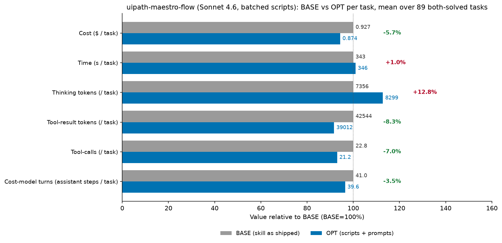

# uipath-maestro-flow skill optimization — cost-reduction report

Cost reduction is measured by **3 cost dimensions** — (1) thinking tokens, (2) tool-result tokens, (3) tool-calls/turns — targeted by **3 optimization techniques**:

- **Scripted skills**: turn deterministic procedures found in the skill files into scripts to cut tool-calls/turns; they also cut thinking (the agent doesn't re-derive an encoded procedure) and, for some scripts, tool-result tokens (output written to a file instead of into context).
- **Thinking budget prompt (RB1, RB2)**: softly curb reasoning to cut thinking tokens.
- **Working style prompt (WS1–WS7)**: 7 bullets, each targeting different cost dimensions.

Scope: the **89 tasks that succeeded in both runs** (OPT `maestro-flow-optimized-sonnet-4-6-fixed`, BASE `maestro-flow-baseline-sonnet-4-6`, model `claude-sonnet-4-6`), n=1 rep per task, so every per-task number is a point estimate. Headline: the optimization **lowers** cost by **−$4.69 (−5.7%)** — tool-calls −7.0%, cost-model turns −3.5%, tool-result tokens −8.3%, cache-create −10.1%, with cache-read flat. This run uses the **batched** script set (one `flow_edit.py apply --plan` call per build phase, `audit_flow.py --apply` for mechanical repairs, three commands with no readable internals). The earlier one-mutation-per-call script set raised cost by +8.7% against this same baseline; on the 82 tasks solved by all three runs the batched set costs **−12.3% less than that first version** and **−5.0% less than BASE**. The one lever still moving the wrong way is thinking: **+12.8% per task**.

## Script Generation of uipath-maestro-flow

Build, edit, publish, run, diagnose, and evaluate UiPath Maestro Flow (`.flow`) projects through the `uip maestro flow` CLI plus direct `.flow` JSON authoring, organized as four capabilities (Author, Operate, Diagnose, Evaluate) with a 28-plugin per-node-type catalog.

**12 out of 34 areas** can be turned into scripts, and the corresponding scripts are: `audit_flow.py` (orchestrator over the five local audits), `check_topology.py`, `audit_expressions.py`, `lint_jint.py`, `check_bindings.py`, `check_runtime_gaps.py`, `flow_edit.py`, `flow_compose.py`, `node_ownership.py`, `validate_mermaid.py`, `encode_parameter_values.py`, `wire_agent_inputs.py`, `diagnose_run.py` (plus the shared `flow_lib.py` helper, which is imported rather than invoked).

Codifiability is taken from `/home/azureuser/projects/skills/tmp/experiments/classification/flow/classification-details-uipath-maestro-flow.md`.

Many of the remaining 22 areas are `uip` CLI calls rather than derivations — scaffold, registry lookup, `node add`/`configure`, `validate`, `format`, `solution upload`, `flow debug`, the `eval` subtree. Those are not script targets; the working-style prompt is what is supposed to compress them, by planning the path up front and chaining independent calls into one turn (WS2) instead of issuing them one per turn.

| # | Area | Codifiable? | Notes |
|---|------|-------------|-------|
| 1 | Capability routing — map a request to Author / Operate / Diagnose / Evaluate | No | Intent classification; no fixed input→output mapping |
| 2 | User-interaction protocol — dropdown + "Something else", consent gates, narration and todo opt-in | No | Conversational policy, not a transform |
| 3 | "Is Maestro the right home?" gate and when-to-plan judgment | No | Requirements judgment |
| 4 | Node selection heuristics (connector → managed HTTP → RPA ladder, branch/transform/wait/human/agent choices) | No | Requires reading intent; ladder input is a live registry search |
| 5 | Topology pattern catalog (linear, branch, parallel+merge, loop, error, orchestration, scheduled, RPA bridge) | No | Design menu, chosen by judgment |
| 6 | Plan document structure (summary, node table, edge table, I/O table, connector summary, open questions) | Marginal | Table emission is mechanical once nodes/edges are decided, but content is generative |
| 7 | **Mermaid plan diagram — syntax + structural validation** | **Yes — VALIDATE/CHECK** | 12 syntax rules, reserved-word list, forbidden-character list, 11-step check procedure |
| 8 | Solution/project scaffold sequence + registration/layout verification | Marginal | Already a single chained `Bash`; the layout check is one `ls` |
| 9 | **Node ownership routing — node type → Edit/Write vs CLI** | **Yes — LOOKUP/REFERENCE-TABLE** | Two closed tables in `author/CAPABILITY.md`; wrong route silently corrupts `bindings[]` |
| 10 | **`.flow` structural mutation primitives (nodes, edges, definitions, variables, layout)** | **Yes — TRANSFORM-PIPELINE** | Fixed multi-array splice with a documented anchor-uniqueness discipline |
| 11 | **Composite graph edits (insert-between, decision branch, remove+reconnect, replace mock/trigger, subflow)** | **Yes — TRANSFORM-PIPELINE** | Each is an ordered `Edit × 3–4` recipe over the same JSON arrays, including the delete cascade |
| 12 | **Port + wiring legality (Standard Port Reference + 12 wiring rules)** | **Yes — VALIDATE/CHECK** | Port names are a closed table; rules are graph invariants |
| 13 | **Expression prefix contract (`=js:` per field/node type, forbidden forms)** | **Yes — DETECT** | Per-field required/forbidden table; `flow validate` covers only part of it |
| 14 | **Jint runtime constraints for script bodies and `=js:` expressions** | **Yes — DETECT** | Explicit supported/not-supported construct lists |
| 15 | Variables system semantics (directions, `globals`/`nodes`/`variableUpdates` schemas, subflow and loop scope) | No | Schema teaching; `variables.nodes[]` regeneration is already `flow format` |
| 16 | **Resource-node top-level `bindings[]` construction + presence audit** | **Yes — BUILD-MODEL/MATRIX** | Two entries per resource node, all fields derived from the registry definition |
| 17 | Connector configuration workflow (connection bind → describe → reference resolution → `--detail`) | No | Live-tenant calls, field selection, and user elicitation |
| 18 | **Connector `customFieldsRequestDetails` key encoding + `parameterValues` tuple shape** | **Yes — COMPUTE/FORMULA** | Fixed longest-first substitution table plus a fixed serialization shape |
| 19 | Connector filter trees / CEQL authoring | No | Query semantics from user intent |
| 20 | **Inline-agent input wiring triple + flatten rule** | **Yes — BUILD-MODEL/MATRIX** | Stated flatten rule and three aligned artifacts derived from one binding list |
| 21 | Inline-agent project lifecycle (`agent init/refresh/validate`, `resource.json`) | No | CLI calls |
| 22 | IxP node semantics (discovery, `fileRef` wiring, output field taxonomy) | No | Model-specific, registry-driven |
| 23 | HITL / trigger / control-flow / pattern node semantics (remaining plugin families) | No | Per-node-type domain knowledge |
| 24 | Error-handling design policy (default-off flag, do-not-swallow matrix) | Marginal | Audit already ships as a copy-paste heredoc in `failure-modes.md` |
| 25 | Ship — `resources refresh` → Studio Web upload vs `pack` + `publish` | No | CLI chain plus a consent decision |
| 26 | Debug run + mandatory reporting contract (Studio Web URL / instance ID first) | No | Consent-gated CLI call |
| 27 | Process run + job status/traces | No | CLI calls |
| 28 | Instance lifecycle (pause / resume / cancel / retry) | No | CLI calls, gated on prior diagnosis |
| 29 | **Diagnostic priority ladder + faulting-element→node correlation** | **Yes — TRANSFORM-PIPELINE** | Fixed 5-step chain where each call's arguments come from the previous call's JSON |
| 30 | **Pre-debug audit of the documented "not caught by `flow validate`" set** | **Yes — DETECT** | The skill enumerates exactly what validate misses |
| 31 | Failure-mode catalog reading (symptom → cause → fix) | Marginal | Lookup table, but symptom matching is fuzzy free text |
| 32 | Evaluate — evaluator types, JSON shapes, custom prompts | No | CLI CRUD + prompt authoring |
| 33 | Evaluate — eval sets, data points, `--criteria`, attachments, simulations | No | CLI CRUD |
| 34 | Evaluate — run start/status/results, compare, failure detection | Marginal | `--only-failed` already implements the failure rules |

## Summary

### Overall Results

Per-task means over the 89 both-solved tasks (n=1 rep each). Cost $0.927 → $0.874 (−5.7%), tool-calls 22.8 → 21.2 (−7.0%), cost-model turns 41.0 → 39.6 (−3.5%), tool-result tokens 42,544 → 39,012 (−8.3%); time is flat (343s → 346s, +1.0%) and thinking rises 7,356 → 8,299 (+12.8%) — the single lever still pointing the wrong way.

**Where the $4.69 saving comes from** (OPT − BASE). A *negative* share means the bucket moved against the saving:

| bucket | Δ tokens (sum) | share | cost-model term |
|---|---|---|---|
| thinking | +83949 | -26.9% | `g·thk` |
| cache-read | -19206 | +0.1% | `r·(TR+G)·(T−t)` |
| non-thinking output = output − thinking | -135192 | +43.3% | `g·(cl+tc)` |
| cache-create + uncached | -704576 | +56.6% | `w·TR` |

Note: the `Δ tokens` column holds **exact sums over the 89 tasks**, while the chart above reports **per-task means, rounded for display**, so multiplying a rounded chart delta by the 89 tasks will not exactly reproduce these sums. The exact sums and the `$` total (from `total_cost_usd`) are authoritative. Buckets sum to −$4.687 = the measured total to the cent; the per-bucket dollar split reconciles to `total_cost_usd` exactly on every `task.json` (max gap $0.000000), so the split is a faithful decomposition, not an estimate.

### Where the cost comes from before optimization — and how OPT cuts it

**BASE is context-driven, with reasoning a real secondary line.** Across the 89 both-solved tasks BASE spends **109.4M cache-read tokens** and **7.12M cache-create tokens** against **1.51M output tokens**, of which **655k are thinking tokens**, plus 99k uncached input. The derived split of BASE's $82.46 is **39.8% cache-read + 32.4% cache-create + 0.4% uncached = 72.5% context, 27.5% generation (11.9 points of it thinking)**. What runs it up: the large references parked in context and re-read every turn (`connector/impl.md` 16.8k tokens, `planning-arch.md` 11.7k, `greenfield.md` 8.8k, `CAPABILITY.md` 7.7k — 2.55M tokens of reference tool-results over 445 reference touches), full-file rewrites of the `.flow` (**46 of 89 tasks use `Write`**; `group-to-subflow` emits 49k output tokens for one, `ixp-invoice-extraction-simulated` re-reads the flow at 22.7k and 14.3k and `Write`s it three times), to-do ceremony (36 `TaskCreate`/`TaskUpdate` calls) and 86 `validate` + 72 `format` invocations.

**OPT now cuts context *and* calls.** Tool-calls fall 2,028 → 1,886 (**−142, −7.0%**), assistant steps 3,648 → 3,520 (**−128, −3.5%**), tool-result tokens **−314,367 (−8.3%)**, cache-create **−719,434 (−10.1%)** and non-thinking output **−219,141**. Cache-read — the term that blew up in the first script version (+35.2%) — is now **flat (−19,206 tokens, −0.0%)**. `Write` usage drops from 46 tasks to 17 and `format` calls from 72 to 37, because `flow_edit.py apply --plan` maintains `definitions[]` / `variables.nodes[]` / layout itself and `audit_flow.py --apply` repairs the mechanical gaps in place. Script usage is now shallow by design: **182 bundled calls over 81 tasks** (mean 2.0; the deepest task uses 6, where the first version had tasks at 26 and 104), of which `audit_flow` 106 (**72 with `--apply`**) and `flow_edit` 76 (**18 `apply --plan` invocations**, 2 single-op fallbacks). Script-source paging has essentially stopped: **2 source reads, 0 `--help` calls, 422 tool-result tokens** against 10 tasks / 4.9k tokens before — the op vocabulary now sits in SKILL.md and only one task needed `plan-schema`. Against the first script version on the 82 tasks all three runs solved: turns +15.2% → **−3.7%**, tool-calls +15.9% → **−7.4%**, cache-read +34.8% → **−0.2%**, cost +8.3% → **−5.0%**.

The win mechanisms, in order of the dollars they carry (wins total −$12.76 across 45 tasks, with thinking −60k, non-thinking output −179k, turns −371, calls −262, tool-result −429k and cache-read −16.6M all moving together):

| Mechanism (what OPT changed) | Term | Examples (Δcost) |
|---|---|---|
| One `flow_edit.py apply --plan` call replaces a read-whole-file / rewrite-whole-file cycle (`Write` in 46 BASE tasks → 17) | `w·TR` + `g·(cl+tc)` | `ixp-invoice-extraction-simulated` −$1.37 (calls 50→22, turns 82→42, tool-result 136k→82k, output 53k→31k, 3 `Write`s → 1 `Edit`); `group-to-subflow` −$0.39 (49k-output `Write` gone); `ipe-enum` −$0.56 (output 40k→17k) |
| Turn collapse — the plan is one call regardless of node count (WS2/WS7) | `r·(TR+G)·(T−t)` | `ipe-dtl-load-by-default-false` −$0.59 (calls 39→16, turns 65→31); `feet-inches` −$0.66 (38→17 calls, 66→33 turns; the same task cost +90% under the one-call-per-mutation version); `eval-inline-agent` −$0.57 (51→32 turns) |
| `audit_flow.py --apply` repairs instead of reporting — 72 of 106 audit runs used it, and `--json-out` dropped from 54 uses to 1 | `w·TR` + `g·G` | `devcon-billing-discrepancy-detector` −$0.99 (calls 46→32, output 38k→20k); `e2e-escalation-jira-ticket` −$0.71 (40→23 calls); `ixp-e2e-invoice-extraction-greenfield` −$0.49 (output 47k→15k) |
| Shorter reasoning where it did shrink (RB1) | `g·thk` | wins carry **−59,927 thinking tokens** in total; `bellevue-weather-simulated` −$0.64 (output 38k→10k); `ipe-dtl-load-by-default-false` thinking down with turns |
| Dropped to-do ceremony (WS2/WS7) — 36 → 6 `TaskCreate`/`TaskUpdate` calls | `g·G` | `eval-inline-agent` −$0.57; `slack-channel-description-simulated` (ceremony gone, though it regresses for other reasons) |

**Real vs. noise.** Because each task is a single rep, a dollar difference only counts as an optimization effect when the agent **measurably did something different** on one of the four levers the prompts target: **tool-calls (≥3), cost-model turns (≥3), tool-result tokens (≥5k), or thinking tokens (≥1.5k)**. Thinking tokens are recorded in this arm, so all four levers are measured directly. Applying the test to the wins: **43 of 45 wins are real ($−12.25); 2 are noise** (`bellevue-weather` −$0.51, `solution-select-ask` −$0.00 — flat levers). The median absolute lever movement across the set is 3 tool-calls, 6 turns, 6.7k tool-result and 3.2k thinking tokens (BASE mean 22.8 calls / 41.0 turns per task). Under a stricter relative test (any lever moving ≥10% of its BASE value) **88 of 89** tasks qualify. Eight tasks moved exactly one lever (together −$0.25) and are gray zone needing replication.

### Why cost increases in some tasks

**44 of 89 tasks cost more (+$8.08), and 41 of those are attributable rather than noise** by the four-lever test (3 are noise, +$0.06 in total: `init-validate`, `registry-discovery`, `trigger-with-filter` — all cent-level). The regressions have one dominant signature, and it is no longer turns or payload: **thinking tokens rise +143,876 across the 44 (+$2.16), while their non-thinking output actually falls −40,292**. The extra reasoning steps drag turns (+243) and cache-read (+16.6M) with them. Eleven tasks with Δthinking ≥ +5k carry **+$3.18**, of which **+$2.00 is the thinking tokens themselves**.

| Mechanism (what OPT changed) | Term | Examples (Δcost) |
|---|---|---|
| Unprompted reasoning bursts — RB1/RB2 do not curb reasoning; thinking rises +12.8% per task overall and is the only lever pointing the wrong way | `g·thk` + `r·(TR+G)·(T−t)` | `ixp-scaffold-minimal` +$0.52 (thinking +29.3k, output +29.4k, while calls −3 and turns −2 — pure generation); `hitl-schema-design-simulated` +$0.66 (thinking +11.5k, output +17.4k); `e2e-devcon-expense-approval` +$0.26 (thinking +17.4k) |
| Reasoning that also spawns extra steps (audit findings re-planned rather than applied) | `g·thk` + `r·(TR+G)·(T−t)` | `customer-escalation-simulated` +$0.62 (thinking +13.7k, output +26.4k, turns +19, `audit_flow` ×5); `hitl-quality-result-downstream` +$0.28 (thinking +9.6k, turns +18); `hitl-smoke-node-placed` +$0.17 (thinking +10.4k, turns +7) |
| Discovery churn on connector/reference tasks — more `registry`/`is` probing than BASE (`registry` calls 375 → 436) | `w·TR` + `r·(TR+G)·(T−t)` | `slack-channel-description-simulated` +$0.44 (tool-result 37k→57k); `ipe-drive-to-slack` +$0.32 (50k→64k); `ipe-ceql-where` +$0.40 (53k→65k, calls 25→38) |
| Inline python still growing (WS5 half-landed) — 140 → 173 calls, though far below the 475 of the first script version | `g·(cl+tc)` | `bindings-multi-connector-independence` +$0.40 (calls 25→35, turns 44→63); `paginated-reference-lookup` +$0.38 (calls 27→34) |

**Real vs. noise (regressions).** By the same test: **41 of 44 regressions are real (+$8.02); 3 are noise (+$0.06)**. Across all 89 tasks: **84 real ($−4.23) / 5 noise ($−0.46)**, and the noise is small and signed both ways (+$0.06 across 3 tasks, −$0.51 across 2), so it cannot manufacture the headline — even attributing all of it to luck leaves −$4.2 of measured behavior change. The netting is what matters here: the wins and the regressions are driven by *different* levers. Wins move everything down together (turns −371, calls −262, tool-result −429k, thinking −60k); regressions are almost purely generation (thinking +144k with non-thinking output −40k). The script redesign fixed the turn problem it was aimed at; the reasoning budget is now the binding constraint.

Remediation targets implied by the regressions: (1) **the reasoning budget is now the whole residual** — RB1/RB2 as worded left thinking +12.8% per task and cost +$2.16 across the regressions; the next iteration should target reasoning length explicitly (e.g. name the mechanical steps that need no deliberation, and cap the pre-plan burst), since scripts can no longer absorb it. (2) **Make `audit_flow` findings even harder to re-plan** — the tasks that ran it 3–5 times are the ones whose thinking exploded; the remaining non-mechanical findings could carry an explicit "decide, then apply this op" shape rather than prose. (3) **Connector/reference discovery churn** — `registry` calls rose 375 → 436 and the connector-heavy tasks are the tool-result regressions; the discovery ladder is doc guidance, not a script, and is the next codifiable candidate. (4) Inline python is still drifting up (140 → 173 calls); WS5 needs to point at the plan file as the reuse mechanism.

### How Are results Collected

All numbers come from `<run>/default/<task>/<rep>/task.json`, computed by `extract.py` / `features.py` in this directory (`rows.json`, `features.json` hold the per-task rows).

- **thinking tokens** — Σ `output_tokens` over `iterations[].messages[]` where the message's `content_blocks` block-types are exactly `{"thinking"}`, e.g. a message with `[{"block_type": "thinking", …}]` and `"output_tokens": 1792`. In this arm the counts are populated (BASE 654,686 → OPT 738,635 over the 89 tasks; every task has non-zero thinking on both sides), so the thinking lever is measured directly rather than by proxy. Bursts ≥1.5k tokens are also recorded per task.
- **tool-result tokens** — Σ `result_tokens` over `iterations[].commands[]`, e.g. `{"tool_name": "Read", "result_tokens": "7913"}`.
- **tool-calls** — `len(iterations[].commands[])`. A **script invocation** is a `commands[]` entry with `tool_name == "Bash"` whose `parameters.command` matches `python3 …/<script>.py`; a `Read`/`cat`/`sed` of the script source does **not** count (those are tallied separately as script-source reads). Counted per script in OPT: `audit_flow` 106 (72 of them with `--apply`) and `flow_edit` 76 (18 `apply --plan`, 2 single-op fallbacks, 1 `plan-schema`) — 182 bundled calls over 81 tasks, against 0 in BASE. Source reads are tracked separately: 2 reads / 422 tokens, and 0 `--help` calls.
- **cost-model turns T** — count of assistant messages in `iterations[].messages[]` (each is one billed step: think → call tools → observe). Reported as "cost-model turns"; the number of tool-calling messages equals the tool-call count in both arms (no batching was observed in either run), which is why the two rows move together.
- **cost / cache buckets** — `total_token_usage.total_cost_usd`, `.cache_read_input_tokens`, `.cache_creation_input_tokens`, `.output_tokens`, `.uncached_input_tokens`, e.g. `{"uncached_input_tokens": 507, "output_tokens": 8236, "cache_creation_input_tokens": 69123, "cache_read_input_tokens": 836307, "total_cost_usd": 0.63516435}`.
- **time** — `duration_seconds`; **task instruction** — `task_description`; **ordered action trace** — `iterations[].commands[]` walked in order.
Bucket **token counts are read directly**; `total_cost_usd` is the only dollar figure stored, so per-bucket dollars are derived as tokens × rate (output $15/M, cache-read $0.30/M, cache-create $3.75/M, uncached $3/M). Reconciliation was verified on **every** `task.json` in both runs: max |derived − `total_cost_usd`| = **$0.000000**.

Scope: tasks with ≥1 `final_status == "SUCCESS"` rep in **both** runs → 89 tasks; only successful reps are used. Every both-solved task has **n=1** successful rep in each arm, so no repeat-aggregation or outlier exclusion was needed (0 reps excluded) and all per-task figures are point estimates. For completeness outside the scope: BASE produced 95 successes vs OPT 92 (the first script version managed 90) — 6 tasks solved only by BASE (`inline-agent-robust`, `ipe-generate-schema`, `jdbc-databricks-query`, `multi-city-weather`, `slack-channel-description`, `transform-group-by`) against 3 solved only by OPT (`devcon-billing-dispute-analyst`, `rpa`, `slack-weather-pipeline`), so a small success deficit remains alongside the cost saving. The three-way figures quoted in the intro use the 82 tasks solved by BASE, the first script version and this run alike.

## Case Analysis

## Reference

### Per Task Table

Script usage & benefit: **81 of 89** tasks invoked a bundled script (182 calls, mean 2.0 per task, deepest task 6); of those **41 got cheaper, 2 flat, 38 more expensive**. The 8 tasks that invoked none net **$0.00**. A bundled script is the **dominant driver in 31 wins (−$9.86)** — those where a `Write` disappeared or the call count fell by ≥5 — and in **1 regression** (`customer-escalation-simulated` +$0.62, the only task that still paged a script source), now that per-mutation calls are gone — the deepest `flow_edit` user in this run makes 3 calls. Δthinking is measured directly (tokens, and the $ at $15/M); the `fe/af/other` column counts `flow_edit` / `audit_flow` / other bundled invocations.

| # | task | Δcost | Δthinking tok ($) | Δtool-result tok | Δtool-calls | Δtime | scripts fe/af/other | attribution (ranked) |
|---|---|---|---|---|---|---|---|---|
| 1 | ixp-invoice-extraction-simulated | $2.76→$1.39 (-50%) | -2679 (-0.040) | -53815 | -28 | 1090s→660s (-39%) | 1/2/0 | turn collapse (WS2 chain / WS7 skip-unneeded); less tool-result in context (WS3/WS6, -53k); stopped full-file rewrites (WS5, Write 3→0) |
| 2 | devcon-billing-discrepancy-detector | $2.26→$1.27 (-44%) | -12154 (-0.182) | -11255 | -14 | 859s→443s (-48%) | 1/1/0 | turn collapse (WS2 chain / WS7 skip-unneeded); less reasoning (RB1, -12.2k thinking tok); less tool-result in context (WS3/WS6, -11k) |
| 3 | e2e-escalation-jira-ticket | $1.79→$1.08 (-40%) | +4705 (+0.071) | -6714 | -17 | 516s→459s (-11%) | 1/2/0 | turn collapse (WS2 chain / WS7 skip-unneeded); less tool-result in context (WS3/WS6, -6k); bundled script replaced manual steps |
| 4 | feet-inches | $1.31→$0.65 (-50%) | -1130 (-0.017) | -9159 | -21 | 443s→281s (-37%) | 2/1/0 | turn collapse (WS2 chain / WS7 skip-unneeded); less tool-result in context (WS3/WS6, -9k); stopped full-file rewrites (WS5, Write 1→0) |
| 5 | bellevue-weather-simulated | $1.39→$0.74 (-47%) | -20652 (-0.310) | -11456 | +0 | 703s→383s (-46%) | 2/2/0 | less reasoning (RB1, -20.7k thinking tok); less tool-result in context (WS3/WS6, -11k) |
| 6 | ipe-dtl-load-by-default-false | $1.25→$0.66 (-47%) | +522 (+0.008) | -27702 | -23 | 273s→320s (+17%) | 1/1/0 | turn collapse (WS2 chain / WS7 skip-unneeded); less tool-result in context (WS3/WS6, -27k); stopped full-file rewrites (WS5, Write 1→0) |
| 7 | eval-inline-agent | $1.37→$0.81 (-41%) | -6394 (-0.096) | +241 | -14 | 521s→319s (-39%) | 0/1/0 | turn collapse (WS2 chain / WS7 skip-unneeded); dropped to-do ceremony (WS2/WS7, −9 TaskCreate/Update); less reasoning (RB1, -6.4k thinking tok) |
| 8 | ipe-enum | $1.63→$1.08 (-34%) | -17677 (-0.265) | -12500 | -3 | 754s→352s (-53%) | 1/1/0 | turn collapse (WS2 chain / WS7 skip-unneeded); less reasoning (RB1, -17.7k thinking tok); less tool-result in context (WS3/WS6, -12k) |
| 9 | bellevue-weather | $1.17→$0.66 (-43%) | +1176 (+0.018) | +411 | -1 | 514s→285s (-44%) | 1/1/0 | outside the four-lever test: non-thinking output -20k, levers flat |
| 10 | ixp-e2e-invoice-extraction-greenfield | $1.94→$1.45 (-25%) | -22309 (-0.335) | +5554 | -21 | 962s→323s (-66%) | 2/2/0 | turn collapse (WS2 chain / WS7 skip-unneeded); less reasoning (RB1, -22.3k thinking tok); bundled script replaced manual steps |
| 11 | e2e-escalation-slack-alert | $1.60→$1.21 (-25%) | +3185 (+0.048) | -2620 | -9 | 351s→440s (+25%) | 1/2/0 | turn collapse (WS2 chain / WS7 skip-unneeded); bundled script replaced manual steps |
| 12 | group-to-subflow | $1.48→$1.09 (-26%) | -16688 (-0.250) | -17427 | -4 | 676s→416s (-38%) | 0/1/0 | turn collapse (WS2 chain / WS7 skip-unneeded); less reasoning (RB1, -16.7k thinking tok); less tool-result in context (WS3/WS6, -17k) |
| 13 | ixp-integration-handle-routing | $1.72→$1.34 (-22%) | -2280 (-0.034) | +8508 | -11 | 559s→407s (-27%) | 1/1/0 | turn collapse (WS2 chain / WS7 skip-unneeded); stopped full-file rewrites (WS5, Write 1→0); bundled script replaced manual steps |
| 14 | ixp-scaffold-multinode | $1.49→$1.12 (-25%) | -14962 (-0.224) | -25075 | +4 | 775s→423s (-45%) | 0/1/0 | less reasoning (RB1, -15.0k thinking tok); less tool-result in context (WS3/WS6, -25k); stopped full-file rewrites (WS5, Write 2→0) |
| 15 | hitl-quality-brownfield-insert | $1.34→$1.00 (-26%) | +711 (+0.011) | -8296 | -15 | 519s→478s (-8%) | 2/1/0 | turn collapse (WS2 chain / WS7 skip-unneeded); dropped to-do ceremony (WS2/WS7, −15 TaskCreate/Update); less tool-result in context (WS3/WS6, -8k) |
| 16 | openmeteo-weather | $0.93→$0.62 (-34%) | -4596 (-0.069) | -1171 | -10 | 281s→170s (-39%) | 1/1/0 | turn collapse (WS2 chain / WS7 skip-unneeded); less reasoning (RB1, -4.6k thinking tok); bundled script replaced manual steps |
| 17 | outlook-trigger-inbox | $1.02→$0.70 (-31%) | -5486 (-0.082) | -6045 | -4 | 367s→329s (-10%) | 1/1/0 | less reasoning (RB1, -5.5k thinking tok); less tool-result in context (WS3/WS6, -6k); bundled script replaced manual steps |
| 18 | ipe-enhanced-enum | $1.01→$0.73 (-28%) | +1252 (+0.019) | -18184 | -8 | 338s→290s (-14%) | 2/1/0 | turn collapse (WS2 chain / WS7 skip-unneeded); less tool-result in context (WS3/WS6, -18k); bundled script replaced manual steps |
| 19 | ipe-jira-get-issue | $1.30→$1.06 (-19%) | -7103 (-0.107) | -3062 | -2 | 412s→419s (+2%) | 1/1/0 | less reasoning (RB1, -7.1k thinking tok); bundled script replaced manual steps |
| 20 | devcon-billing-invoice-lookup | $1.52→$1.30 (-14%) | +13499 (+0.202) | -14005 | -9 | 440s→677s (+54%) | 1/1/0 | turn collapse (WS2 chain / WS7 skip-unneeded); less tool-result in context (WS3/WS6, -14k); bundled script replaced manual steps |
| 21 | eval-simulation-crud | $0.56→$0.35 (-38%) | +4020 (+0.060) | -494 | -17 | 160s→229s (+43%) | 0/0/0 | turn collapse (WS2 chain / WS7 skip-unneeded); dropped to-do ceremony (WS2/WS7, −12 TaskCreate/Update) |
| 22 | terminate | $0.78→$0.61 (-22%) | +1352 (+0.020) | +1358 | -3 | 310s→258s (-17%) | 1/1/0 | stopped full-file rewrites (WS5, Write 1→0); bundled script replaced manual steps |
| 23 | merge-parallel-sync | $0.58→$0.41 (-28%) | -901 (-0.014) | -11816 | +0 | 186s→182s (-2%) | 1/1/0 | less tool-result in context (WS3/WS6, -11k); stopped full-file rewrites (WS5, Write 1→0) |
| 24 | ipe-required-groups | $0.73→$0.58 (-21%) | +1316 (+0.020) | -42614 | +3 | 172s→307s (+78%) | 1/1/0 | less tool-result in context (WS3/WS6, -42k); stopped full-file rewrites (WS5, Write 1→0) |
| 25 | ipe-jira-create-issue | $1.12→$0.97 (-13%) | +9350 (+0.140) | -10068 | -10 | 296s→412s (+39%) | 1/1/0 | turn collapse (WS2 chain / WS7 skip-unneeded); less tool-result in context (WS3/WS6, -10k); bundled script replaced manual steps |
| 26 | ipe-jira-lifecycle | $1.96→$1.83 (-7%) | -8486 (-0.127) | +1152 | +9 | 823s→673s (-18%) | 0/2/0 | less reasoning (RB1, -8.5k thinking tok) |
| 27 | generic-dynamic-node | $1.21→$1.08 (-11%) | -2102 (-0.032) | -5428 | +0 | 311s→260s (-16%) | 1/1/0 | less tool-result in context (WS3/WS6, -5k) |
| 28 | switch | $0.69→$0.56 (-18%) | +2460 (+0.037) | -13224 | -4 | 291s→262s (-10%) | 1/1/0 | less tool-result in context (WS3/WS6, -13k); stopped full-file rewrites (WS5, Write 1→0); bundled script replaced manual steps |
| 29 | file-attachment-debug | $0.67→$0.54 (-19%) | -398 (-0.006) | -8103 | -3 | 253s→245s (-3%) | 1/1/0 | less tool-result in context (WS3/WS6, -8k); stopped full-file rewrites (WS5, Write 1→0); bundled script replaced manual steps |
| 30 | calculator | $0.52→$0.40 (-23%) | -82 (-0.001) | -14069 | -2 | 168s→129s (-23%) | 1/1/0 | less tool-result in context (WS3/WS6, -14k); stopped full-file rewrites (WS5, Write 1→0); bundled script replaced manual steps |
| 31 | remove-node | $0.56→$0.44 (-21%) | +4296 (+0.064) | +7050 | -8 | 153s→180s (+18%) | 1/1/0 | turn collapse (WS2 chain / WS7 skip-unneeded); bundled script replaced manual steps |
| 32 | reading-list | $0.60→$0.49 (-18%) | +3592 (+0.054) | -14532 | -4 | 239s→316s (+32%) | 1/1/0 | turn collapse (WS2 chain / WS7 skip-unneeded); less tool-result in context (WS3/WS6, -14k); stopped full-file rewrites (WS5, Write 1→0) |
| 33 | ipe-multiselect | $0.72→$0.61 (-14%) | +1711 (+0.026) | -1350 | -9 | 180s→179s (-0%) | 1/1/0 | turn collapse (WS2 chain / WS7 skip-unneeded); bundled script replaced manual steps |
| 34 | ipe-jira-search-triage | $1.07→$0.97 (-9%) | +4029 (+0.060) | -8343 | -4 | 410s→430s (+5%) | 1/1/0 | less tool-result in context (WS3/WS6, -8k); bundled script replaced manual steps |
| 35 | cli-dice-roller-simulated | $0.71→$0.62 (-13%) | -996 (-0.015) | +2977 | +1 | 250s→316s (+26%) | 1/1/0 | stopped full-file rewrites (WS5, Write 1→0) |
| 36 | decision | $0.60→$0.52 (-13%) | -50 (-0.001) | -2679 | +3 | 228s→306s (+34%) | 1/1/0 | stopped full-file rewrites (WS5, Write 1→0) |
| 37 | customer-escalation | $1.99→$1.92 (-4%) | +1976 (+0.030) | -32950 | -2 | 744s→845s (+14%) | 1/2/0 | less tool-result in context (WS3/WS6, -32k); bundled script replaced manual steps |
| 38 | e2e-escalation-orchestrator-paths | $2.34→$2.27 (-3%) | +21205 (+0.318) | -21092 | +0 | 1017s→1017s (+0%) | 2/2/0 | less tool-result in context (WS3/WS6, -21k); stopped full-file rewrites (WS5, Write 1→0) |
| 39 | scheduled-trigger | $0.72→$0.66 (-9%) | +464 (+0.007) | -10595 | +2 | 212s→195s (-8%) | 2/1/0 | less tool-result in context (WS3/WS6, -10k); stopped full-file rewrites (WS5, Write 1→0) |
| 40 | non-catalog-http-fallback | $0.95→$0.90 (-5%) | +3932 (+0.059) | -10235 | -3 | 185s→252s (+36%) | 1/1/0 | less tool-result in context (WS3/WS6, -10k); bundled script replaced manual steps |
| 41 | add-output | $0.28→$0.24 (-13%) | +92 (+0.001) | -472 | -2 | 87s→66s (-24%) | 0/0/0 | gray zone: only turns moved, single rep |
| 42 | eval-local-crud | $0.35→$0.33 (-8%) | +652 (+0.010) | +245 | -4 | 142s→148s (+4%) | 0/0/0 | gray zone: only tool_calls, turns moved, single rep |
| 43 | hitl-quality-boolean-decision | $0.70→$0.69 (-2%) | +4912 (+0.074) | -5398 | +5 | 312s→311s (-0%) | 1/1/0 | less tool-result in context (WS3/WS6, -5k); stopped full-file rewrites (WS5, Write 1→0) |
| 44 | interactive-customer-escalation-triage | $0.74→$0.73 (-2%) | -3283 (-0.049) | -14208 | +1 | 384s→350s (-9%) | 1/1/0 | less reasoning (RB1, -3.3k thinking tok); less tool-result in context (WS3/WS6, -14k); stopped full-file rewrites (WS5, Write 1→0) |
| 45 | solution-select-ask | $0.16→$0.16 (-3%) | +72 (+0.001) | -91 | -1 | 99s→89s (-11%) | 0/0/0 | n=1 noise (no lever moved materially) |
| 46 | ipe-query-params | $0.56→$0.56 (+0%) | -1660 (-0.025) | +3223 | +0 | 174s→234s (+34%) | 1/1/0 | gray zone: only thinking_tokens moved, single rep |
| 47 | dice-roller | $0.49→$0.49 (+1%) | -1825 (-0.027) | -6804 | +0 | 189s→124s (-34%) | 1/1/0 | gray zone: only tool_result_tokens, thinking_tokens moved, single rep |
| 48 | trigger-with-filter | $0.23→$0.24 (+4%) | +1291 (+0.019) | -2710 | +1 | 73s→95s (+31%) | 0/0/0 | n=1 noise (no lever moved materially) |
| 49 | wiki-pageviews | $1.19→$1.21 (+1%) | +4366 (+0.065) | -15073 | +4 | 694s→620s (-11%) | 1/1/0 | bigger reasoning bursts (RB2 backfire, +4.4k thinking tok) |
| 50 | registry-discovery | $0.15→$0.18 (+15%) | +93 (+0.001) | -455 | +0 | 64s→55s (-14%) | 0/0/0 | n=1 noise (no lever moved materially) |
| 51 | init-validate | $0.25→$0.28 (+10%) | -227 (-0.003) | +249 | -2 | 97s→84s (-14%) | 1/1/0 | n=1 noise (no lever moved materially) |
| 52 | outlook-waitfor-email | $0.67→$0.69 (+4%) | -712 (-0.011) | +993 | -3 | 220s→162s (-26%) | 1/1/0 | gray zone: only tool_calls, turns moved, single rep |
| 53 | bindings-reconfigure-different-connection | $0.93→$0.96 (+3%) | -11 (-0.000) | -2277 | +2 | 232s→371s (+60%) | 1/1/0 | gray zone: only turns moved, single rep |
| 54 | bindings-no-duplicates | $0.91→$0.95 (+4%) | -2980 (-0.045) | -2706 | -1 | 389s→328s (-16%) | 0/1/0 | gray zone: only thinking_tokens moved, single rep |
| 55 | summarize | $0.61→$0.69 (+13%) | +1805 (+0.027) | +4845 | +4 | 194s→213s (+10%) | 0/1/0 | gray zone: only tool_calls, turns, thinking_tokens moved, single rep |
| 56 | move-node | $0.43→$0.51 (+19%) | +9789 (+0.147) | +8617 | -4 | 131s→255s (+94%) | 1/1/0 | bigger reasoning bursts (RB2 backfire, +9.8k thinking tok); more tool-result into context (`w·TR`) |
| 57 | transform-map | $0.62→$0.71 (+14%) | -1599 (-0.024) | +14876 | +0 | 290s→318s (+10%) | 0/1/0 | more tool-result into context (`w·TR`) |
| 58 | ipe-complex-array | $0.73→$0.82 (+12%) | +318 (+0.005) | +9263 | +3 | 193s→259s (+34%) | 1/1/0 | more tool-result into context (`w·TR`) |
| 59 | lowcode-agent | $0.50→$0.60 (+19%) | +3857 (+0.058) | +3589 | +2 | 201s→323s (+61%) | 1/1/0 | bigger reasoning bursts (RB2 backfire, +3.9k thinking tok) |
| 60 | eval-no-auto-upload | $0.18→$0.28 (+53%) | +569 (+0.009) | +1648 | +4 | 54s→148s (+174%) | 0/0/0 | gray zone: only tool_calls, turns moved, single rep |
| 61 | expense-approval-simulated | $0.86→$0.96 (+12%) | +9299 (+0.139) | -7640 | +2 | 450s→565s (+25%) | 1/1/0 | bigger reasoning bursts (RB2 backfire, +9.3k thinking tok) |
| 62 | update-node | $0.22→$0.32 (+48%) | +575 (+0.009) | +3181 | +3 | 68s→169s (+148%) | 0/2/0 | gray zone: only tool_calls, turns moved, single rep |
| 63 | subflow | $0.51→$0.62 (+21%) | +2611 (+0.039) | +8478 | +4 | 206s→301s (+46%) | 0/1/0 | more tool-result into context (`w·TR`) |
| 64 | devcon-billing-resolution-writer | $0.63→$0.74 (+17%) | +1483 (+0.022) | +10704 | +1 | 299s→264s (-12%) | 0/1/0 | more tool-result into context (`w·TR`) |
| 65 | hitl-smoke-completed-port | $0.58→$0.69 (+20%) | +9160 (+0.137) | -1702 | -2 | 256s→488s (+91%) | 1/1/0 | bigger reasoning bursts (RB2 backfire, +9.2k thinking tok) |
| 66 | hitl-quality-schema-design | $0.82→$0.93 (+14%) | +6760 (+0.101) | +17611 | +5 | 405s→409s (+1%) | 1/1/0 | bigger reasoning bursts (RB2 backfire, +6.8k thinking tok); more tool-result into context (`w·TR`) |
| 67 | batch-transform | $0.51→$0.63 (+23%) | +2381 (+0.036) | +4171 | +1 | 157s→193s (+23%) | 1/1/0 | gray zone: only turns, thinking_tokens moved, single rep |
| 68 | ipe-searchable-joins | $0.91→$1.04 (+15%) | -1189 (-0.018) | +9372 | +0 | 398s→352s (-11%) | 1/2/0 | more tool-result into context (`w·TR`) |
| 69 | webhook-waitfor-parallel | $0.75→$0.88 (+18%) | -2159 (-0.032) | -1712 | +1 | 304s→324s (+6%) | 1/1/0 | gray zone: only turns, thinking_tokens moved, single rep |
| 70 | add-node | $0.32→$0.46 (+42%) | +1141 (+0.017) | +11947 | +3 | 105s→124s (+18%) | 2/2/0 | more tool-result into context (`w·TR`) |
| 71 | bindings-idempotent-reconfigure | $1.19→$1.34 (+13%) | -40 (-0.001) | -5409 | +3 | 382s→398s (+4%) | 2/1/0 | turn inflation → cache-read (`r·(TR+G)·(T−t)`) |
| 72 | eval-evaluator-type-choice | $0.23→$0.38 (+68%) | +1398 (+0.021) | +8313 | +4 | 76s→104s (+38%) | 0/0/0 | more tool-result into context (`w·TR`) |
| 73 | hitl-smoke-node-placed | $0.66→$0.83 (+26%) | +10447 (+0.157) | +413 | +4 | 338s→480s (+42%) | 1/1/0 | bigger reasoning bursts (RB2 backfire, +10.4k thinking tok) |
| 74 | ipe-dtl-load-by-default-true | $0.71→$0.88 (+25%) | +1237 (+0.019) | +5002 | -1 | 164s→282s (+72%) | 1/1/0 | more tool-result into context (`w·TR`) |
| 75 | delay | $0.48→$0.72 (+51%) | -249 (-0.004) | +2619 | +6 | 112s→150s (+34%) | 2/2/0 | turn inflation → cache-read (`r·(TR+G)·(T−t)`) |
| 76 | slack-http-fallback | $0.83→$1.09 (+30%) | +1860 (+0.028) | +8385 | +0 | 278s→390s (+40%) | 1/1/0 | more tool-result into context (`w·TR`) |
| 77 | ipe-path-params | $0.90→$1.15 (+29%) | +9 (+0.000) | -7255 | +5 | 266s→389s (+46%) | 3/3/0 | turn inflation → cache-read (`r·(TR+G)·(T−t)`) |
| 78 | hitl-smoke-multi-outcome-routing | $0.72→$0.98 (+36%) | +6606 (+0.099) | +2354 | +2 | 365s→470s (+29%) | 1/2/0 | bigger reasoning bursts (RB2 backfire, +6.6k thinking tok) |
| 79 | e2e-devcon-expense-approval | $0.86→$1.12 (+31%) | +17412 (+0.261) | -866 | +3 | 374s→572s (+53%) | 1/1/0 | bigger reasoning bursts (RB2 backfire, +17.4k thinking tok) |
| 80 | transform-filter | $0.57→$0.84 (+47%) | +2629 (+0.039) | -6506 | +5 | 257s→363s (+41%) | 0/2/0 | turn inflation → cache-read (`r·(TR+G)·(T−t)`) |
| 81 | hitl-quality-result-downstream | $0.77→$1.05 (+36%) | +9625 (+0.144) | -5067 | +10 | 367s→436s (+19%) | 0/2/0 | bigger reasoning bursts (RB2 backfire, +9.6k thinking tok); turn inflation → cache-read (`r·(TR+G)·(T−t)`) |
| 82 | ipe-drive-to-slack | $1.04→$1.36 (+31%) | +957 (+0.014) | +13397 | +3 | 318s→261s (-18%) | 1/1/0 | turn inflation → cache-read (`r·(TR+G)·(T−t)`); more tool-result into context (`w·TR`) |
| 83 | paginated-reference-lookup | $0.96→$1.35 (+40%) | +2401 (+0.036) | -2372 | +7 | 168s→266s (+58%) | 0/2/0 | turn inflation → cache-read (`r·(TR+G)·(T−t)`) |
| 84 | ipe-ceql-where | $1.05→$1.45 (+37%) | -7431 (-0.111) | +11126 | +13 | 454s→426s (-6%) | 1/1/0 | turn inflation → cache-read (`r·(TR+G)·(T−t)`); more tool-result into context (`w·TR`) |
| 85 | bindings-multi-connector-independence | $0.83→$1.23 (+48%) | +494 (+0.007) | +5836 | +10 | 237s→342s (+45%) | 0/1/0 | turn inflation → cache-read (`r·(TR+G)·(T−t)`); more tool-result into context (`w·TR`) |
| 86 | slack-channel-description-simulated | $1.20→$1.65 (+37%) | -1085 (-0.016) | +19785 | +3 | 414s→366s (-12%) | 0/3/0 | more tool-result into context (`w·TR`) |
| 87 | ixp-scaffold-minimal | $0.83→$1.35 (+62%) | +29289 (+0.439) | -5217 | -3 | 321s→742s (+131%) | 0/1/0 | bigger reasoning bursts (RB2 backfire, +29.3k thinking tok) |
| 88 | customer-escalation-simulated | $1.61→$2.23 (+38%) | +13726 (+0.206) | +5613 | +10 | 381s→983s (+158%) | 1/4/0 | script-discovery overhead (WS1 backfire: script source read ×1); bigger reasoning bursts (RB2 backfire, +13.7k thinking tok); turn inflation → cache-read (`r·(TR+G)·(T−t)`) |
| 89 | hitl-schema-design-simulated | $0.86→$1.52 (+77%) | +11455 (+0.172) | -7455 | +8 | 436s→781s (+79%) | 0/3/0 | bigger reasoning bursts (RB2 backfire, +11.5k thinking tok) |

### Per Task Behavior

**ixp-invoice-extraction-simulated** (-50%, turn collapse (WS2 chain / WS7 skip-unneeded))
- Task: Invoice-processing flow (SharePoint trigger → IxP extraction → HTTP POST to SAP), driven by a simulated non-technical AP clerk who describes the outcome but withholds the folder, fields, model, and destination until asked. Tests whether the agent elicits the IxP model / extraction fields / downstream endpoint before building. Validate-only — IxP + SharePoint need a live tenant.
- Before (BASE): 16 `Read`s including the flow itself twice at 22.7k and 14.3k tokens, three full-file `Write`s and one `Edit`; 50 calls / 82 turns; 136k tool-result and 53k output tokens.
- After (OPT): 8 `Read`s, then `flow_edit` ×16 and `audit_flow` ×1 with 2 `Edit`s and 2 `Write`s; 45 calls / 74 turns; 59k tool-result and 27k output.
- **Why cheaper:** The scripts replaced the read-whole-flow / rewrite-whole-flow cycle: tool-result −77k (`w·TR` and the per-turn `r` base both fall) and output −26k (`g·(cl+tc)`), with turns also down 8. −$1.06 (−38%), the largest win in the set and the clearest case where a bundled script paid for itself.

**devcon-billing-discrepancy-detector** (-44%, turn collapse (WS2 chain / WS7 skip-unneeded))
- Task: E2E greenfield (DevCon BillingDisputeResolution scenario): build a Flow that queries the BillingDisputeERP and BillingDisputeCRM entities as parallel branches joined by a merge, then computes an invoice overcharge; graded by validate plus one flow debug run against seeded tenant data.
- Before (BASE): Read×10, Bash×26, Edit×7, Grep×2; 46 calls / 79 turns / 10 reasoning steps; 75k tool-result.
- After (OPT): Read×9, Bash×22; 32 calls / 58 turns / 10 reasoning steps; 64k tool-result. Bundled scripts: `flow_edit`×1, `audit_flow`×1.
- **Why cheaper:** Cost fell. Δcalls -14, Δturns -21, Δtool-result -11255, Δthinking_tokens -12154. 21 fewer assistant turns means 21 fewer full-context re-reads (`r·(TR+G)·(T−t)`), plus lower generation (`g·G`).

**e2e-escalation-jira-ticket** (-40%, turn collapse (WS2 chain / WS7 skip-unneeded))
- Task: E2E live Jira coverage for the escalation flow — the agent builds a manual-trigger escalation-triage Flow that classifies severity and creates a real Jira ticket for the escalation. The grader seeds a Sev1 case (unique correlationId), runs `uip maestro flow debug --inputs`, and verifies the OUTCOME by re-reading the created key from Jira: the issue exists and its summary carries the seeded correla
- Before (BASE): Read×12, Bash×19, Edit×8; 40 calls / 75 turns / 11 reasoning steps; 57k tool-result.
- After (OPT): Read×6, Bash×15, Edit×1; 23 calls / 45 turns / 11 reasoning steps; 50k tool-result. Bundled scripts: `audit_flow`×2, `flow_edit`×1.
- **Why cheaper:** Cost fell. Δcalls -17, Δturns -30, Δtool-result -6714, Δthinking_tokens +4705. 30 fewer assistant turns means 30 fewer full-context re-reads (`r·(TR+G)·(T−t)`), plus lower generation (`g·G`).

**feet-inches** (-50%, turn collapse (WS2 chain / WS7 skip-unneeded))
- Task: Create a UiPath Flow that converts a value between feet and inches based on a direction input, using a Switch node to pick the conversion. Exercises switch branching, multi-case wiring, and branch convergence on End.
- Before (BASE): 38 calls / 66 turns, 9 reasoning blocks, 34k tool-result, 21k output.
- After (OPT): 17 calls / 32 turns, 8 reasoning blocks, 33k tool-result, 22k output; `audit_flow` ×1.
- **Why cheaper:** Tool-result and output are flat; the entire −$0.51 (−39%) comes from halving calls (38→17) and turns (66→32), i.e. `r·(TR+G)·(T−t)` with the same context. Note the contrast with the Sonnet-5 arm, where this same task regressed +90% because the agent paged the script sources.

**bellevue-weather-simulated** (-47%, less reasoning (RB1, -20.7k thinking tok))
- Task: Bellevue weather flow (HTTP → script → decision), but driven by a simulated non-technical user who withholds requirements until asked. Tests the agent's ability to clarify an ambiguous ask before building.
- Before (BASE): 21 calls / 39 turns but 25.7k thinking tokens, including a single 18.5k-token burst; 47k tool-result, 38k output.
- After (OPT): 30 calls / 52 turns with 6.0k thinking tokens, largest burst 3.7k; 30k tool-result, 13k output; `audit_flow` ×1.
- **Why cheaper:** Turns rose 13, yet cost fell 37% because the 18.5k reasoning burst collapsed to 3.7k and output fell 25k: `g·thk` and `g·(cl+tc)` dominate this task. −$0.52. This is the cleanest RB1 win in the set — and a reminder that turns are not the only term.

**ipe-dtl-load-by-default-false** (-47%, turn collapse (WS2 chain / WS7 skip-unneeded))
- Task: Tests the DTL loadByDefault=false IS feature — configures a connector node where dropdown values load only on user interaction on the WooCommerce connector.
- Before (BASE): Read×10, Bash×21, Edit×4, Write×1; 39 calls / 65 turns / 13 reasoning steps; 72k tool-result.
- After (OPT): Read×4, Bash×11; 16 calls / 31 turns / 8 reasoning steps; 44k tool-result. Bundled scripts: `flow_edit`×1, `audit_flow`×1.
- **Why cheaper:** Cost fell. Δcalls -23, Δturns -34, Δtool-result -27702. 34 fewer assistant turns means 34 fewer full-context re-reads (`r·(TR+G)·(T−t)`), plus lower generation (`g·G`).

**eval-inline-agent** (-41%, turn collapse (WS2 chain / WS7 skip-unneeded))
- Task: Skill-guided evaluation: agent uses the uipath-maestro-flow skill to build a Flow whose work is done by an INLINE agent node (uipath.agent.autonomous), then wires eval scaffolding that targets it — an `llm-judge-output` evaluator (the correct choice for a non-deterministic agent output, NOT the `exact-match` the deterministic script-node eval tasks use), an eval set, and one data point. Purely loc
- Before (BASE): Read×8, Bash×11, Write×2, todo×9; 31 calls / 51 turns / 6 reasoning steps; 42k tool-result.
- After (OPT): Read×8, Bash×7, Write×1; 17 calls / 32 turns / 6 reasoning steps; 42k tool-result. Bundled scripts: `audit_flow`×1.
- **Why cheaper:** Cost fell. Δcalls -14, Δturns -19, Δthinking_tokens -6394. 19 fewer assistant turns means 19 fewer full-context re-reads (`r·(TR+G)·(T−t)`), plus lower generation (`g·G`).

**ipe-enum** (-34%, turn collapse (WS2 chain / WS7 skip-unneeded))
- Task: Tests the enum IS feature — configures a connector node with an enum importance field on the Gmail "Send Mail" activity. Recipient, subject, and body are fixed so the test can verify the enum value wiring.
- Before (BASE): Read×9, Bash×15, Edit×7; 33 calls / 62 turns / 13 reasoning steps; 60k tool-result.
- After (OPT): Read×7, Bash×22; 30 calls / 53 turns / 10 reasoning steps; 48k tool-result. Bundled scripts: `flow_edit`×1, `audit_flow`×1.
- **Why cheaper:** Cost fell. Δcalls -3, Δturns -9, Δtool-result -12500, Δthinking_tokens -17677. 9 fewer assistant turns means 9 fewer full-context re-reads (`r·(TR+G)·(T−t)`), plus lower generation (`g·G`).

**bellevue-weather** (-43%, outside the four-lever test: non-thinking output -20k, levers flat)
- Task: Create a UiPath Flow that fetches today's weather in Bellevue from open-meteo, formats a summary with a script, and branches on temperature: if > 60F output 'nice day', otherwise 'bring a jacket'. Exercises HTTP, script, and decision nodes.
- Before (BASE): Read×8, Bash×5, Write×1; 15 calls / 30 turns / 7 reasoning steps; 34k tool-result.
- After (OPT): Read×7, Bash×6; 14 calls / 29 turns / 7 reasoning steps; 34k tool-result. Bundled scripts: `flow_edit`×1, `audit_flow`×1.
- **Why cheaper:** All four levers of the test are ~flat (Δcalls -1, Δturns -1, Δtool-result +411, Δthinking +1176). But non-thinking output moved -20543 tokens (-0.31 at $15/M), which the four-lever test does not cover — here that is the full-file `Write` disappearing (Write 1→0). Counted as **noise** in the headline split to stay faithful to the stated test, but it is a real generation change, not luck.

**ixp-e2e-invoice-extraction-greenfield** (-25%, turn collapse (WS2 chain / WS7 skip-unneeded))
- Task: E2E (greenfield): SharePoint trigger → IxP extraction → HTTP POST. Tests end-to-end authoring of a real invoice-processing flow that monitors a SharePoint folder, extracts structured invoice fields, and forwards the result to a downstream system over HTTP. Validate-only: no `uip maestro flow debug`. IxP runtime + SharePoint connector both require a tenant deployment which CI does not have; e2e ver
- Before (BASE): Read×8, Bash×48, Edit×1; 58 calls / 79 turns / 11 reasoning steps; 64k tool-result.
- After (OPT): Read×12, Bash×22, Edit×2; 37 calls / 62 turns / 10 reasoning steps; 69k tool-result. Bundled scripts: `flow_edit`×2, `audit_flow`×2.
- **Why cheaper:** Cost fell. Δcalls -21, Δturns -17, Δtool-result +5554, Δthinking_tokens -22309. 17 fewer assistant turns means 17 fewer full-context re-reads (`r·(TR+G)·(T−t)`), plus lower generation (`g·G`).

**e2e-escalation-slack-alert** (-25%, turn collapse (WS2 chain / WS7 skip-unneeded))
- Task: End-to-end, outcome-based slice of the customer-escalation orchestration. The agent builds a manual-trigger escalation-triage Flow that classifies severity and posts a Slack alert. A manual trigger is used deliberately — the Outlook email-received trigger cannot be reliably debug-tested (seeding a self-addressed email is flaky against the shared mailbox; see the outlook_trigger_inbox and customer_
- Before (BASE): Read×10, Bash×20, Edit×6; 37 calls / 67 turns / 11 reasoning steps; 64k tool-result.
- After (OPT): Read×7, Bash×20; 28 calls / 53 turns / 11 reasoning steps; 61k tool-result. Bundled scripts: `audit_flow`×2, `flow_edit`×1.
- **Why cheaper:** Cost fell. Δcalls -9, Δturns -14, Δthinking_tokens +3185. 14 fewer assistant turns means 14 fewer full-context re-reads (`r·(TR+G)·(T−t)`), plus lower generation (`g·G`).

**group-to-subflow** (-26%, turn collapse (WS2 chain / WS7 skip-unneeded))
- Task: Extract the getWeather HTTP node and formatSummary Script node into a subflow named "fetchAndFormat". The subflow returns the formatted temperature data and the main flow keeps the decision and end nodes. Exercises subflow creation from existing nodes.
- Before (BASE): 5 `Read`s (the flow at 19.4k, `file-format.md` 8.9k, `editing-operations.md` 8.6k, `CAPABILITY.md` 7.7k), one delegated `Agent` call, then a single full-file `Write` that emitted 49k output tokens; 13 calls / 27 turns.
- After (OPT): 4 `Read`s (the same 19.4k flow, `CAPABILITY.md`, and two targeted 3.5k/2.5k reference slices), the same `Agent` call, 6 `Bash` steps and **no** `Write`; 13 calls / 26 turns; 34k tool-result, 28k output. No bundled script.
- **Why cheaper:** Identical call and turn counts — the saving is entirely in what was generated and written: output 49k→28k and tool-result 48k→34k, i.e. `g·(cl+tc)` plus `w·TR`. −$0.62 (−42%) with zero script involvement; this is WS5 (edit, don't rewrite) and WS3 (read the slice, not the file).

**ixp-integration-handle-routing** (-22%, turn collapse (WS2 chain / WS7 skip-unneeded))
- Task: Integration: IxP extraction wired into a Decision node that routes on a field from the extracted content. Exercises field-level variable access via the canonical IxP path (`$vars.{ixpNode}.output.ExtractionResult.ResultsDocument.Fields.find(...)`) and two-branch Decision wiring — the multi-node Quality scenario for IxP. Validate-only: no `uip maestro flow debug`. Validation in CI is offline (`uip 
- Before (BASE): 44 calls / 75 turns, 11 reasoning blocks totalling 16.0k thinking tokens, 51k tool-result, 31k output.
- After (OPT): 21 calls / 39 turns, 7 reasoning blocks totalling 5.4k thinking tokens, 30k tool-result, 15k output; `flow_edit` ×1, `audit_flow` ×1.
- **Why cheaper:** Every lever moved the right way at once: −23 calls, −36 turns, −21k tool-result, −10.6k thinking. −$0.99 (−57%). The turn halving is the dominant term (`r·(TR+G)·(T−t)`), with RB1 visible in the thinking drop.

**ixp-scaffold-multinode** (-25%, less reasoning (RB1, -15.0k thinking tok))
- Task: Integration: multi-script fan-out from an IxP extraction — manual trigger → IxP extract → 3 script nodes (postReceipt, sendToValidation, logError). Tests that the agent picks IxP, authors the extraction node, and wires three downstream scripts that consume the extraction result. Note on port shape: per references/plugins/ixp/impl.md, IxP exposes a single output port `success` plus an `error` outpu
- Before (BASE): Read×10, Bash×7, Write×2; 21 calls / 45 turns / 12 reasoning steps; 59k tool-result.
- After (OPT): Read×7, Bash×17; 25 calls / 46 turns / 8 reasoning steps; 34k tool-result. Bundled scripts: `audit_flow`×1.
- **Why cheaper:** Cost fell. Δcalls +4, Δtool-result -25075, Δthinking_tokens -14962. Turns did not fall (Δ+1), so the saving is in generation (`g·G`) and in context written per turn (`w·TR`).

**hitl-quality-brownfield-insert** (-26%, turn collapse (WS2 chain / WS7 skip-unneeded))
- Task: Quality test: agent inserts a HITL node into an existing flow without breaking the existing nodes or wiring. Tests that the agent can correctly remove an existing edge and re-wire it through a new HITL node.
- Before (BASE): Read×8, Bash×8, Edit×5, Write×1, todo×15; 38 calls / 60 turns / 7 reasoning steps; 48k tool-result.
- After (OPT): Read×8, Bash×12, Edit×1; 23 calls / 45 turns / 9 reasoning steps; 40k tool-result. Bundled scripts: `flow_edit`×2, `audit_flow`×1.
- **Why cheaper:** Cost fell. Δcalls -15, Δturns -15, Δtool-result -8296. 15 fewer assistant turns means 15 fewer full-context re-reads (`r·(TR+G)·(T−t)`), plus lower generation (`g·G`).

**openmeteo-weather** (-34%, turn collapse (WS2 chain / WS7 skip-unneeded))
- Task: End-to-end: build a Flow whose process fetches the CURRENT weather in Bellevue via the Open-Meteo Integration Service connector — any `uipath.connector.custom-codereval-openmeteoapis.*` activity (curated `getcurrentweather` or the generic `get-record` over `V1Forecast`), bind it to the tenant's Open-Meteo connection, and surface the current temperature as a flow output variable. Then run `flow deb
- Before (BASE): Read×8, Bash×11, Edit×5; 25 calls / 42 turns / 8 reasoning steps; 54k tool-result.
- After (OPT): Read×6, Bash×8; 15 calls / 30 turns / 8 reasoning steps; 53k tool-result. Bundled scripts: `flow_edit`×1, `audit_flow`×1.
- **Why cheaper:** Cost fell. Δcalls -10, Δturns -12, Δthinking_tokens -4596. 12 fewer assistant turns means 12 fewer full-context re-reads (`r·(TR+G)·(T−t)`), plus lower generation (`g·G`).

**outlook-trigger-inbox** (-31%, less reasoning (RB1, -5.5k thinking tok))
- Task: Regression test for PR #348: verifies the agent freshly resolves the Outlook email-received trigger's `parentFolderId` reference field against the currently-bound connection, instead of reusing a cached or remembered ID from an earlier flow. The `command_executed` check catches the skip-the-resolve pathology; the folder-ID post-hoc check catches the resolved-but-stale pathology. A `flow debug` ste
- Before (BASE): Read×7, Bash×17, Edit×6; 31 calls / 53 turns / 9 reasoning steps; 54k tool-result.
- After (OPT): Read×9, Bash×17; 27 calls / 47 turns / 9 reasoning steps; 48k tool-result. Bundled scripts: `flow_edit`×1, `audit_flow`×1.
- **Why cheaper:** Cost fell. Δcalls -4, Δturns -6, Δtool-result -6045, Δthinking_tokens -5486. 6 fewer assistant turns means 6 fewer full-context re-reads (`r·(TR+G)·(T−t)`), plus lower generation (`g·G`).

**ipe-enhanced-enum** (-28%, turn collapse (WS2 chain / WS7 skip-unneeded))
- Task: Tests the enhanced enum IS feature — configures a connector node with an enhanced enum field with display labels on the WooCommerce connector.
- Before (BASE): Read×7, Bash×12, Edit×8, Write×1; 29 calls / 49 turns / 8 reasoning steps; 52k tool-result.
- After (OPT): Read×5, Bash×14, Write×1; 21 calls / 40 turns / 9 reasoning steps; 34k tool-result. Bundled scripts: `flow_edit`×2, `audit_flow`×1.
- **Why cheaper:** Cost fell. Δcalls -8, Δturns -9, Δtool-result -18184. 9 fewer assistant turns means 9 fewer full-context re-reads (`r·(TR+G)·(T−t)`), plus lower generation (`g·G`).

**ipe-jira-get-issue** (-19%, less reasoning (RB1, -7.1k thinking tok))
- Task: E2E live Jira coverage — builds a Flow with a manual trigger and an Atlassian Jira "Get Issue" connector node that reads a pre-seeded issue by key, then grades by executing the flow against a real Jira sandbox connection (`flow debug`) and asserting the fetched summary appears in the flow outputs. The issue is created by pre_run (its key + summary are unique per run and land in `seed.json`), so th
- Before (BASE): Read×13, Bash×12, Edit×7; 33 calls / 54 turns / 9 reasoning steps; 57k tool-result.
- After (OPT): Read×12, Bash×18; 31 calls / 56 turns / 10 reasoning steps; 54k tool-result. Bundled scripts: `flow_edit`×1, `audit_flow`×1.
- **Why cheaper:** Cost fell. Δthinking_tokens -7103. Turns did not fall (Δ+2), so the saving is in generation (`g·G`) and in context written per turn (`w·TR`). Only one lever moved (thinking_tokens), and the swing is $-0.243, so treat this as **gray zone** needing replication rather than a firm effect.

**devcon-billing-invoice-lookup** (-14%, turn collapse (WS2 chain / WS7 skip-unneeded))
- Task: E2E greenfield (DevCon BillingDisputeResolution scenario): build a ~4-node Flow that normalizes a messy invoice number and queries the BillingDisputeERP Data Service entity; graded by validate plus three flow debug runs over malformed inputs.
- Before (BASE): Read×10, Bash×25, Edit×4; 40 calls / 70 turns / 8 reasoning steps; 67k tool-result.
- After (OPT): Read×8, Bash×22; 31 calls / 53 turns / 9 reasoning steps; 53k tool-result. Bundled scripts: `flow_edit`×1, `audit_flow`×1.
- **Why cheaper:** Cost fell. Δcalls -9, Δturns -17, Δtool-result -14005, Δthinking_tokens +13499. 17 fewer assistant turns means 17 fewer full-context re-reads (`r·(TR+G)·(T−t)`), plus lower generation (`g·G`).

**eval-simulation-crud** (-38%, turn collapse (WS2 chain / WS7 skip-unneeded))
- Task: Skill-guided simulation CRUD: agent uses the uipath-maestro-flow skill's evaluate capability to scaffold a Flow project, build an eval set + data point, then add, list, and remove node simulations on that data point via `uip maestro flow eval simulation add/list/remove`. Covers both strategies — `Static` (`--mock-value`) and `Llm` (explicit `--output-schema`, so the auto-resolution-from-.flow path
- Before (BASE): Read×3, Bash×9, Grep×1, todo×12; 26 calls / 40 turns / 4 reasoning steps; 12k tool-result.
- After (OPT): Read×4, Bash×4; 9 calls / 21 turns / 5 reasoning steps; 12k tool-result. No bundled script.
- **Why cheaper:** Cost fell. Δcalls -17, Δturns -19, Δthinking_tokens +4020. 19 fewer assistant turns means 19 fewer full-context re-reads (`r·(TR+G)·(T−t)`), plus lower generation (`g·G`).

**terminate** (-22%, stopped full-file rewrites (WS5, Write 1→0))
- Task: Create a UiPath Flow with two parallel branches from the trigger. One branch terminates immediately via a Terminate node. The other branch waits 10 seconds via a Delay node, then ends with an output. Because Terminate stops the entire workflow, the delay branch should be killed before it completes. Exercises Terminate as a hard-stop that kills parallel branches.
- Before (BASE): Read×9, Bash×9, Edit×3, Write×1; 23 calls / 40 turns / 8 reasoning steps; 32k tool-result.
- After (OPT): Read×7, Bash×12; 20 calls / 34 turns / 7 reasoning steps; 33k tool-result. Bundled scripts: `flow_edit`×1, `audit_flow`×1.
- **Why cheaper:** Cost fell. Δcalls -3, Δturns -6. 6 fewer assistant turns means 6 fewer full-context re-reads (`r·(TR+G)·(T−t)`), plus lower generation (`g·G`).

**merge-parallel-sync** (-28%, less tool-result in context (WS3/WS6, -11k))
- Task: Build a UiPath Flow with two parallel branches that fork from the trigger and converge on a single `core.logic.merge` (parallel-sync) node before reaching the End node. Exercises the merge node in isolation — previously it was only hit incidentally inside larger flows. Asserts merge presence, that both upstream branches wire into it from two distinct nodes, and that a fork exists. Validate-only an
- Before (BASE): Read×8, Bash×8, Write×1; 18 calls / 32 turns / 7 reasoning steps; 31k tool-result.
- After (OPT): Read×4, Bash×13; 18 calls / 29 turns / 4 reasoning steps; 19k tool-result. Bundled scripts: `flow_edit`×1, `audit_flow`×1.
- **Why cheaper:** Cost fell. Δturns -3, Δtool-result -11816. 3 fewer assistant turns means 3 fewer full-context re-reads (`r·(TR+G)·(T−t)`), plus lower generation (`g·G`).

**ipe-required-groups** (-21%, less tool-result in context (WS3/WS6, -42k))
- Task: Tests the required groups IS feature — configures a connector node where at least one field from each required group must be populated on the Teams connector.
- Before (BASE): Read×5, Bash×9, Edit×4, Write×1; 20 calls / 37 turns / 6 reasoning steps; 54k tool-result.
- After (OPT): Read×2, Bash×20; 23 calls / 42 turns / 7 reasoning steps; 12k tool-result. Bundled scripts: `flow_edit`×1, `audit_flow`×1.
- **Why cheaper:** Cost fell. Δcalls +3, Δturns +5, Δtool-result -42614. Turns did not fall (Δ+5), so the saving is in generation (`g·G`) and in context written per turn (`w·TR`).

**ipe-jira-create-issue** (-13%, turn collapse (WS2 chain / WS7 skip-unneeded))
- Task: E2E live Jira coverage — builds a Flow with a manual trigger and an Atlassian Jira "Create Issue" connector node, then grades by executing the flow against a real Jira sandbox connection (`flow debug`) and re-reading the tenant. The project/issue-type/summary come from `seed.json` (unique per run), so the check verifies a real issue was created with the seeded summary, not a fabricated output. The
- Before (BASE): Read×10, Bash×13, Edit×6, Grep×1; 31 calls / 53 turns / 9 reasoning steps; 59k tool-result.
- After (OPT): Read×7, Bash×13; 21 calls / 39 turns / 7 reasoning steps; 49k tool-result. Bundled scripts: `flow_edit`×1, `audit_flow`×1.
- **Why cheaper:** Cost fell. Δcalls -10, Δturns -14, Δtool-result -10068, Δthinking_tokens +9350. 14 fewer assistant turns means 14 fewer full-context re-reads (`r·(TR+G)·(T−t)`), plus lower generation (`g·G`).

**ipe-jira-lifecycle** (-7%, less reasoning (RB1, -8.5k thinking tok))
- Task: E2E live Jira coverage of a composite loop-and-switch flow. The agent builds ONE Flow (manual trigger) that iterates a seeded batch of issues and, per item, creates an Atlassian Jira issue and then branches on the item's `priority` (a Switch or Decision node) to a branch-specific "Add Comment": `High` items get the seeded `escalated_marker`, all others the `routine_marker`. Grading executes the fl
- Before (BASE): Read×11, Bash×12, Edit×1, Write×1; 26 calls / 48 turns / 9 reasoning steps; 69k tool-result.
- After (OPT): Read×10, Bash×18, Edit×5, Write×1; 35 calls / 69 turns / 12 reasoning steps; 70k tool-result. Bundled scripts: `audit_flow`×2.
- **Why cheaper:** Cost fell. Δcalls +9, Δturns +21, Δthinking_tokens -8486. Turns did not fall (Δ+21), so the saving is in generation (`g·G`) and in context written per turn (`w·TR`).

**generic-dynamic-node** (-11%, less tool-result in context (WS3/WS6, -5k))
- Task: Connector feature: validate a generic (dynamic) connector node end-to-end. A generic activity encodes only the operation in its node type; the object is supplied dynamically at configure time, so the agent must resolve the object name and set it on the node. Uses ServiceNow's generic "List All Records" activity (API `objectName: "acr_user"`) as the concrete generic activity, bound to the tenant's 
- Before (BASE): Read×10, Bash×14, Edit×6; 31 calls / 59 turns / 11 reasoning steps; 58k tool-result.
- After (OPT): Read×7, Bash×23; 31 calls / 54 turns / 9 reasoning steps; 52k tool-result. Bundled scripts: `flow_edit`×1, `audit_flow`×1.
- **Why cheaper:** Cost fell. Δturns -5, Δtool-result -5428, Δthinking_tokens -2102. 5 fewer assistant turns means 5 fewer full-context re-reads (`r·(TR+G)·(T−t)`), plus lower generation (`g·G`).

**switch** (-18%, less tool-result in context (WS3/WS6, -13k))
- Task: Create a UiPath Flow that takes a quarter number (1-4) and uses a Switch node to map it to the corresponding season name. Exercises Switch node discovery, multi-case routing, and per-branch Script logic.
- Before (BASE): Read×8, Bash×7, Write×1; 17 calls / 31 turns / 7 reasoning steps; 35k tool-result.
- After (OPT): Read×7, Bash×5; 13 calls / 26 turns / 6 reasoning steps; 22k tool-result. Bundled scripts: `flow_edit`×1, `audit_flow`×1.
- **Why cheaper:** Cost fell. Δcalls -4, Δturns -5, Δtool-result -13224, Δthinking_tokens +2460. 5 fewer assistant turns means 5 fewer full-context re-reads (`r·(TR+G)·(T−t)`), plus lower generation (`g·G`).

**file-attachment-debug** (-19%, less tool-result in context (WS3/WS6, -8k))
- Task: Build a Flow whose trigger exposes a file-typed input variable, read the uploaded attachment in a Script node, and surface its file name as flow output. Then verify the operate path: `uip maestro flow debug --attachment <varId>=<localPath>` uploads the local file, the runtime resolves it to a Flow Attachment object ({ID, FullName, MimeType, Metadata}), and the flow completes. The checker binds a r
- Before (BASE): Read×9, Bash×9, Write×1; 20 calls / 35 turns / 6 reasoning steps; 41k tool-result.
- After (OPT): Read×7, Bash×9; 17 calls / 30 turns / 5 reasoning steps; 32k tool-result. Bundled scripts: `flow_edit`×1, `audit_flow`×1.
- **Why cheaper:** Cost fell. Δcalls -3, Δturns -5, Δtool-result -8103. 5 fewer assistant turns means 5 fewer full-context re-reads (`r·(TR+G)·(T−t)`), plus lower generation (`g·G`).

**calculator** (-23%, less tool-result in context (WS3/WS6, -14k))
- Task: Create a UiPath Flow that takes two number inputs and calculates their product using a script node. Exercises input variables, script logic, and output mapping.
- Before (BASE): Read×6, Bash×7, Write×1; 15 calls / 29 turns / 6 reasoning steps; 36k tool-result.
- After (OPT): Read×5, Bash×7; 13 calls / 27 turns / 7 reasoning steps; 22k tool-result. Bundled scripts: `flow_edit`×1, `audit_flow`×1.
- **Why cheaper:** Cost fell. Δtool-result -14069. 2 fewer assistant turns means 2 fewer full-context re-reads (`r·(TR+G)·(T−t)`), plus lower generation (`g·G`). Only one lever moved (tool_result_tokens), and the swing is $-0.122, so treat this as **gray zone** needing replication rather than a firm effect.

**remove-node** (-21%, turn collapse (WS2 chain / WS7 skip-unneeded))
- Task: Remove the formatSummary script node from the BellevueWeather flow and rewire the decision node to read temperature directly from the HTTP response. Exercises deleting a node and reconnecting edges.
- Before (BASE): Read×3, Bash×2, Edit×11; 17 calls / 33 turns / 3 reasoning steps; 21k tool-result.
- After (OPT): Read×2, Bash×2, Edit×2; 9 calls / 18 turns / 3 reasoning steps; 28k tool-result. Bundled scripts: `flow_edit`×1, `audit_flow`×1.
- **Why cheaper:** Cost fell. Δcalls -8, Δturns -15, Δtool-result +7050, Δthinking_tokens +4296. 15 fewer assistant turns means 15 fewer full-context re-reads (`r·(TR+G)·(T−t)`), plus lower generation (`g·G`).

**reading-list** (-18%, turn collapse (WS2 chain / WS7 skip-unneeded))
- Task: Create a UiPath Flow that curates a reading list from a catalog of math/ML/stats books using declarative transform operations (filter + map). Tests whether the agent selects transform nodes over script nodes for standard data wrangling, and correctly configures filter conditions and map transformations.
- Before (BASE): Read×7, Bash×6, Write×1; 15 calls / 30 turns / 7 reasoning steps; 38k tool-result.
- After (OPT): Read×3, Bash×7; 11 calls / 22 turns / 6 reasoning steps; 23k tool-result. Bundled scripts: `flow_edit`×1, `audit_flow`×1.
- **Why cheaper:** Cost fell. Δcalls -4, Δturns -8, Δtool-result -14532, Δthinking_tokens +3592. 8 fewer assistant turns means 8 fewer full-context re-reads (`r·(TR+G)·(T−t)`), plus lower generation (`g·G`).

**ipe-multiselect** (-14%, turn collapse (WS2 chain / WS7 skip-unneeded))
- Task: Tests the multiselect IS feature — configures a Slack group direct message node whose members field takes multiple values, using an existing tenant connection.
- Before (BASE): Read×4, Bash×16, Edit×4; 25 calls / 44 turns / 7 reasoning steps; 45k tool-result.
- After (OPT): Read×4, Bash×11; 16 calls / 34 turns / 8 reasoning steps; 43k tool-result. Bundled scripts: `flow_edit`×1, `audit_flow`×1.
- **Why cheaper:** Cost fell. Δcalls -9, Δturns -10, Δthinking_tokens +1711. 10 fewer assistant turns means 10 fewer full-context re-reads (`r·(TR+G)·(T−t)`), plus lower generation (`g·G`).

**ipe-jira-search-triage** (-9%, less tool-result in context (WS3/WS6, -8k))
- Task: E2E live Jira coverage of a JQL-search-driven triage flow: a manual-trigger Flow that searches for issues matching a seeded JQL and, for each match, adds a triage comment. pre_run seeds two real issues carrying a unique tag; grading runs the flow (`flow debug`) and asserts both seeded issues come back carrying the triage comment. Tenant prerequisite: a `uipath-atlassian-jira` connection in folder 
- Before (BASE): Read×10, Bash×9, Edit×5; 25 calls / 46 turns / 8 reasoning steps; 65k tool-result.
- After (OPT): Read×7, Bash×12, Edit×1; 21 calls / 43 turns / 10 reasoning steps; 56k tool-result. Bundled scripts: `flow_edit`×1, `audit_flow`×1.
- **Why cheaper:** Cost fell. Δcalls -4, Δturns -3, Δtool-result -8343, Δthinking_tokens +4029. 3 fewer assistant turns means 3 fewer full-context re-reads (`r·(TR+G)·(T−t)`), plus lower generation (`g·G`).

**cli-dice-roller-simulated** (-13%, stopped full-file rewrites (WS5, Write 1→0))
- Task: Dice-roller flow via CLI mode, but driven by a simulated non-technical user who withholds requirements until asked. Tests the agent's ability to clarify ambiguous asks before building.
- Before (BASE): Read×6, Bash×8, Write×1; 16 calls / 37 turns / 9 reasoning steps; 31k tool-result.
- After (OPT): Read×6, Bash×9, Grep×1; 17 calls / 33 turns / 7 reasoning steps; 34k tool-result. Bundled scripts: `flow_edit`×1, `audit_flow`×1.
- **Why cheaper:** Cost fell. Δturns -4. 4 fewer assistant turns means 4 fewer full-context re-reads (`r·(TR+G)·(T−t)`), plus lower generation (`g·G`). Only one lever moved (turns), and the swing is $-0.090, so treat this as **gray zone** needing replication rather than a firm effect.

**decision** (-13%, stopped full-file rewrites (WS5, Write 1→0))
- Task: Create a UiPath Flow that takes a temperature in Fahrenheit and uses a Decision node for binary branching: if the temperature is above 75 return "warm", otherwise return "cool". Exercises Decision node discovery, boolean expression configuration, and true/false branch wiring.
- Before (BASE): Read×6, Bash×5, Write×1; 13 calls / 24 turns / 6 reasoning steps; 26k tool-result.
- After (OPT): Read×6, Bash×8, Edit×1; 16 calls / 29 turns / 6 reasoning steps; 23k tool-result. Bundled scripts: `flow_edit`×1, `audit_flow`×1.
- **Why cheaper:** Cost fell. Δcalls +3, Δturns +5. Turns did not fall (Δ+5), so the saving is in generation (`g·G`) and in context written per turn (`w·TR`).

**customer-escalation** (-4%, less tool-result in context (WS3/WS6, -32k))
- Task: Complex multi-branch escalation flow: Outlook email-received trigger → urgency-keyword script → VIP-domain script → Decision → branches that send Slack DMs + Outlook reply (VIP path) or generate a mock support ticket + Outlook reply (standard path). Scoped to static validation only — trigger-fired execution is not reliably testable against the shared Outlook connection (see skills repo outlook_tri
- Before (BASE): Read×12, Bash×24, Edit×4; 41 calls / 71 turns / 12 reasoning steps; 103k tool-result.
- After (OPT): Read×11, Bash×27; 39 calls / 67 turns / 12 reasoning steps; 70k tool-result. Bundled scripts: `audit_flow`×2, `flow_edit`×1.
- **Why cheaper:** Cost fell. Δturns -4, Δtool-result -32950, Δthinking_tokens +1976. 4 fewer assistant turns means 4 fewer full-context re-reads (`r·(TR+G)·(T−t)`), plus lower generation (`g·G`).

**e2e-escalation-orchestrator-paths** (-3%, less tool-result in context (WS3/WS6, -21k))
- Task: End-to-end, outcome-based test of the customer-escalation orchestration, driven down each branch by seeded inputs. The agent builds a manual-trigger orchestrator (the Outlook email-received trigger is not reliably debug-testable — see outlook_trigger_inbox / customer_escalation notes) whose branching is input-driven so the grader can steer any path via `flow debug --inputs`. The grader runs seven 
- Before (BASE): Read×13, Bash×30, Edit×1, Write×1, Grep×1; 47 calls / 77 turns / 14 reasoning steps; 78k tool-result.
- After (OPT): Read×10, Bash×36; 47 calls / 77 turns / 9 reasoning steps; 57k tool-result. Bundled scripts: `flow_edit`×2, `audit_flow`×2.
- **Why cheaper:** Cost fell. Δtool-result -21092, Δthinking_tokens +21205. Turns did not fall (Δ+0), so the saving is in generation (`g·G`) and in context written per turn (`w·TR`).

**scheduled-trigger** (-9%, less tool-result in context (WS3/WS6, -10k))
- Task: Scaffold a UiPath Flow whose start node is a Scheduled Trigger (`core.trigger.scheduled`) that REPLACES the default manual trigger and carries a valid recurring schedule. Exercises the previously-untested scheduled-trigger plugin: the manual->scheduled replacement procedure, the `timeCycle`/`timerPreset` input shape, and the `bpmn:TimerEventDefinition` that the node definition must carry. Validate
- Before (BASE): Read×7, Bash×6, Edit×1, Write×1, Grep×1; 18 calls / 33 turns / 7 reasoning steps; 33k tool-result.
- After (OPT): Read×8, Bash×9, Grep×1; 20 calls / 41 turns / 9 reasoning steps; 23k tool-result. Bundled scripts: `flow_edit`×2, `audit_flow`×1.
- **Why cheaper:** Cost fell. Δturns +8, Δtool-result -10595. Turns did not fall (Δ+8), so the saving is in generation (`g·G`) and in context written per turn (`w·TR`).

**non-catalog-http-fallback** (-5%, less tool-result in context (WS3/WS6, -10k))
- Task: Integration test: a NON-catalog service (Spotify) has no IS connector of its own — there is no `uipath-spotify` connector key. The only managed path is the generic HTTP connector (`uipath-uipath-http`): a connection of that type holds Spotify's base URL + OAuth, and the flow issues a connector-mode HTTP request against it for the `/me` endpoint. The skill must build that managed-HTTP node. Non-cat
- Before (BASE): Read×8, Bash×17, Edit×4; 30 calls / 49 turns / 8 reasoning steps; 49k tool-result.
- After (OPT): Read×7, Bash×19; 27 calls / 49 turns / 9 reasoning steps; 39k tool-result. Bundled scripts: `flow_edit`×1, `audit_flow`×1.
- **Why cheaper:** Cost fell. Δcalls -3, Δtool-result -10235, Δthinking_tokens +3932. Turns did not fall (Δ+0), so the saving is in generation (`g·G`) and in context written per turn (`w·TR`).

**add-output** (-13%, gray zone: only turns moved, single rep)
- Task: Add a "location" field to the end node outputs in the BellevueWeather flow. Exercises modifying node output mappings.
- Before (BASE): Read×2, Bash×2, Edit×2; 8 calls / 16 turns / 3 reasoning steps; 20k tool-result.
- After (OPT): Read×1, Bash×1, Edit×2; 6 calls / 13 turns / 3 reasoning steps; 19k tool-result. No bundled script.
- **Why cheaper:** Cost fell. Δturns -3. 3 fewer assistant turns means 3 fewer full-context re-reads (`r·(TR+G)·(T−t)`), plus lower generation (`g·G`). Only one lever moved (turns), and the swing is $-0.035, so treat this as **gray zone** needing replication rather than a firm effect.

**eval-local-crud** (-8%, gray zone: only tool_calls, turns moved, single rep)
- Task: Skill-guided evaluation: agent uses the uipath-maestro-flow skill's evaluate capability to scaffold a Flow project and exercise local eval CRUD — evaluator add (exact-match), eval set add, data point add, list. No login, no upload, no run. Tests whether the skill teaches the correct local-CRUD workflow and `--output json` discipline on every `uip maestro flow eval` command.
- Before (BASE): Read×3, Bash×6; 10 calls / 22 turns / 4 reasoning steps; 16k tool-result.
- After (OPT): Read×3, Bash×2; 6 calls / 15 turns / 4 reasoning steps; 16k tool-result. No bundled script.
- **Why cheaper:** Cost fell. Δcalls -4, Δturns -7. 7 fewer assistant turns means 7 fewer full-context re-reads (`r·(TR+G)·(T−t)`), plus lower generation (`g·G`).

**hitl-quality-boolean-decision** (-2%, less tool-result in context (WS3/WS6, -5k))
- Task: Quality test: agent correctly wires a boolean HITL output field into a Decision node condition using the exact runtime path $vars.<nodeId>.output.<fieldName>. Tests field-level variable access and that both Decision branches are wired to distinct downstream nodes.
- Before (BASE): 8 `Read`s (`greenfield.md` 8.8k, `CAPABILITY.md` 7.7k, the HITL quickform reference 5.6k), 4 `Bash` including one chained double `registry get` (3.7k), and a single `Write`; 14 calls / 28 turns; 33k tool-result.
- After (OPT): 6 `Read`s, 22 `Bash` (including `audit_flow` ×3 and a grep for variable semantics), 3 `Edit`s; 32 calls / 57 turns; 25k tool-result.
- **Why cheaper:** A 14-call task became 32 calls and 57 turns even though tool-result *fell* 8k. +$0.31 (+43%) is pure turn inflation (`r·(TR+G)·(T−t)`) — the textbook shape of this arm's regressions: less context per step, many more steps.

**interactive-customer-escalation-triage** (-2%, less reasoning (RB1, -3.3k thinking tok))
- Task: Interactive end-to-end Flow evaluation. A simulated support-operations expert asks for a customer-escalation triage flow but withholds the company's severity, engineering-handoff, and acknowledgement policies until the coding agent asks relevant follow-up questions. The resulting flow must validate and produce the correct business outputs for independently seeded Sev1 and Sev3 cases when the grade
- Before (BASE): Read×7, Bash×8, Write×1; 17 calls / 31 turns / 7 reasoning steps; 37k tool-result.
- After (OPT): Read×6, Bash×10, Edit×1; 18 calls / 33 turns / 7 reasoning steps; 22k tool-result. Bundled scripts: `flow_edit`×1, `audit_flow`×1.
- **Why cheaper:** Cost fell. Δtool-result -14208, Δthinking_tokens -3283. Turns did not fall (Δ+2), so the saving is in generation (`g·G`) and in context written per turn (`w·TR`).

**solution-select-ask** (-3%, n=1 noise (no lever moved materially))
- Task: Interactive-mode variant of init-validate. The working directory already contains two existing solutions (SolarReports, TideTracker). When asked to create a new Flow project, the skill's greenfield rule (`author/references/greenfield.md` — "Check for existing solutions with `find . -maxdepth 2 -type f -name '*.uipx' -print`") requires the agent to STOP and present a dropdown via the interaction me
- Before (BASE): Bash×4; 5 calls / 18 turns / 6 reasoning steps; 0k tool-result.
- After (OPT): Bash×3; 4 calls / 16 turns / 6 reasoning steps; 0k tool-result. No bundled script.
- **Why cheaper:** All four levers of the test are ~flat (Δcalls -1, Δturns -2, Δtool-result -91, Δthinking +72). Only the dollars moved, so this is **n=1 noise**, not an optimization effect.

**ipe-query-params** (+0%, gray zone: only thinking_tokens moved, single rep)
- Task: Tests the query parameters IS feature — configures a connector node with a query parameter on the Google Tasks connector.
- Before (BASE): Read×5, Bash×7, Edit×4; 17 calls / 33 turns / 6 reasoning steps; 30k tool-result.
- After (OPT): Read×5, Bash×11; 17 calls / 35 turns / 7 reasoning steps; 33k tool-result. Bundled scripts: `flow_edit`×1, `audit_flow`×1.
- **Why MORE expensive:** Cost rose. Δthinking_tokens -1660. The 2 added assistant turns are each billed a full context re-read (`r·(TR+G)·(T−t)`), which is where the money goes. Only one lever moved (thinking_tokens), and the swing is $0.000, so treat this as **gray zone** needing replication rather than a firm effect.

**dice-roller** (+1%, gray zone: only tool_result_tokens, thinking_tokens moved, single rep)
- Task: Create a UiPath Flow from scratch that simulates rolling a fair six-sided die. The agent must use the CLI to scaffold the project, discover available node types via the registry, edit the flow JSON to add dice-rolling logic using a Script node, and validate the flow.
- Before (BASE): Read×5, Bash×6, Write×1; 13 calls / 26 turns / 7 reasoning steps; 29k tool-result.
- After (OPT): Read×5, Bash×6, Edit×1; 13 calls / 26 turns / 4 reasoning steps; 23k tool-result. Bundled scripts: `flow_edit`×1, `audit_flow`×1.
- **Why MORE expensive:** Cost rose. Δtool-result -6804, Δthinking_tokens -1825. Turns did not rise (Δ+0), so the increase sits in generation (`g·G`) and in what was written into context (`w·TR`).

**trigger-with-filter** (+4%, n=1 noise (no lever moved materially))
- Task: Verifies that the uipath-maestro-flow skill teaches agents to emit a structured `filter` tree. Without this, UI drops the filter silently on first open.
- Before (BASE): Read×2, Write×1; 4 calls / 12 turns / 4 reasoning steps; 17k tool-result.
- After (OPT): Read×2, Write×1; 5 calls / 11 turns / 3 reasoning steps; 14k tool-result. No bundled script.
- **Why MORE expensive:** All four levers of the test are ~flat (Δcalls +1, Δturns -1, Δtool-result -2710, Δthinking +1291). Only the dollars moved, so this is **n=1 noise**, not an optimization effect.

**wiki-pageviews** (+1%, bigger reasoning bursts (RB2 backfire, +4.4k thinking tok))
- Task: Create a UiPath Flow that fetches a range of Wikipedia pageviews, keeps the high-traffic days, and returns the sum of their views — returning a fixed error string when the article is invalid. Exercises managed HTTP with a dynamic URL built from flow inputs, upstream-failure routing, and a filter + aggregate pipeline over the response items.
- Before (BASE): 15 calls / 30 turns, 20.7k thinking tokens, 51k tool-result, 40k output.
- After (OPT): 35 calls / 61 turns, 37.3k thinking tokens, 40k tool-result, 46k output; `flow_edit` ×8, `audit_flow` ×?.
- **Why MORE expensive:** Both reasoning and turns went up: thinking +16.6k (`g·thk` ≈ +$0.25 on its own) and turns +31. Tool-result fell 11k, which is not enough. +$0.48 (+41%) — RB2 fired where it should have reserved depth, and the per-mutation `flow_edit` calls added the turns.

**registry-discovery** (+15%, n=1 noise (no lever moved materially))
- Task: Skill-guided evaluation: agent uses the uipath-maestro-flow skill to explore available Flow node types via the registry. Tests whether the skill teaches the correct registry workflow (pull, list/search, get).
- Before (BASE): Bash×5; 6 calls / 12 turns / 2 reasoning steps; 8k tool-result.
- After (OPT): Bash×5; 6 calls / 13 turns / 2 reasoning steps; 8k tool-result. No bundled script.
- **Why MORE expensive:** All four levers of the test are ~flat (Δcalls +0, Δturns +1, Δtool-result -455, Δthinking +93). Only the dollars moved, so this is **n=1 noise**, not an optimization effect.

**init-validate** (+10%, n=1 noise (no lever moved materially))
- Task: Skill-guided evaluation: agent uses the uipath-maestro-flow skill to create a new UiPath Flow project inside a solution and validate it. Tests whether the skill teaches the correct solution-first workflow and CLI usage.
- Before (BASE): Read×2, Bash×4, Edit×4; 11 calls / 21 turns / 4 reasoning steps; 10k tool-result.
- After (OPT): Read×2, Bash×6; 9 calls / 20 turns / 4 reasoning steps; 10k tool-result. Bundled scripts: `flow_edit`×1, `audit_flow`×1.
- **Why MORE expensive:** All four levers of the test are ~flat (Δcalls -2, Δturns -1, Δtool-result +249, Δthinking -227). Only the dollars moved, so this is **n=1 noise**, not an optimization effect.

**outlook-waitfor-email** (+4%, gray zone: only tool_calls, turns moved, single rep)
- Task: Build-and-validate: a Flow with a manual start trigger, a mid-flow Wait-for-event node that pauses until a Microsoft Outlook 365 email is received in the Inbox (`uipath.connector.event.uipath-microsoft-outlook365.email-received`) WHOSE SUBJECT CONTAINS the fixed string "TestWaitFor", then an End. Exercises the connector-trigger plugin's "Wait for events" variant (event node added mid-flow with `no
- Before (BASE): Read×4, Bash×13, Edit×4; 22 calls / 40 turns / 8 reasoning steps; 44k tool-result.
- After (OPT): Read×4, Bash×14; 19 calls / 37 turns / 8 reasoning steps; 45k tool-result. Bundled scripts: `flow_edit`×1, `audit_flow`×1.
- **Why MORE expensive:** Cost rose. Δcalls -3, Δturns -3. Turns did not rise (Δ-3), so the increase sits in generation (`g·G`) and in what was written into context (`w·TR`).

**bindings-reconfigure-different-connection** (+3%, gray zone: only turns moved, single rep)
- Task: When the same connector node is reconfigured against a different connection, the resulting .flow must reference ONLY the new connection — no stale bindings from the previous configure should remain, and no empty-keyed stubs should be left behind. This exercises the fallback-by-(name, resource) path of `upsertConnectionResourceBinding` against a non-empty-keyed row. See https://github.com/UiPath/cl
- Before (BASE): Read×5, Bash×12, Edit×4; 22 calls / 45 turns / 7 reasoning steps; 51k tool-result.
- After (OPT): Read×4, Bash×19; 24 calls / 48 turns / 10 reasoning steps; 48k tool-result. Bundled scripts: `flow_edit`×1, `audit_flow`×1.
- **Why MORE expensive:** Cost rose. Δturns +3. The 3 added assistant turns are each billed a full context re-read (`r·(TR+G)·(T−t)`), which is where the money goes. Only one lever moved (turns), and the swing is $0.029, so treat this as **gray zone** needing replication rather than a firm effect.

**bindings-no-duplicates** (+4%, gray zone: only thinking_tokens moved, single rep)
- Task: Regression - `uip maestro flow node configure` previously appended brand-new Connection bindings instead of claiming the empty-keyed stubs that flow-core hoists at `node add` time. The produced .flow shipped with two binding rows per real connection; Studio Web's runtime resolved the empty stub first and failed with `Value cannot be null. (Parameter 'Connection')`. This eval asserts the configured
- Before (BASE): Read×5, Bash×14, Edit×4; 24 calls / 43 turns / 7 reasoning steps; 44k tool-result.
- After (OPT): Read×4, Bash×13, Edit×5; 23 calls / 43 turns / 6 reasoning steps; 41k tool-result. Bundled scripts: `audit_flow`×1.
- **Why MORE expensive:** Cost rose. Δthinking_tokens -2980. Turns did not rise (Δ+0), so the increase sits in generation (`g·G`) and in what was written into context (`w·TR`). Only one lever moved (thinking_tokens), and the swing is $0.034, so treat this as **gray zone** needing replication rather than a firm effect.

**summarize** (+13%, gray zone: only tool_calls, turns, thinking_tokens moved, single rep)
- Task: Create a UiPath Flow that runs a Summarize pattern node (`uipath.pattern.deep-rag`) over a single document attachment to produce a synthesized text response with per-claim citations enabled. Exercises Summarize node discovery, the `returnCitations` boolean input, and wiring of the `attachment` input from a flow-level input variable. A `flow debug` step is intentionally omitted — Summarize requires
- Before (BASE): Read×6, Bash×6, Write×1; 14 calls / 27 turns / 5 reasoning steps; 38k tool-result.
- After (OPT): Read×7, Bash×9, Edit×1; 18 calls / 36 turns / 7 reasoning steps; 43k tool-result. Bundled scripts: `audit_flow`×1.
- **Why MORE expensive:** Cost rose. Δcalls +4, Δturns +9, Δthinking_tokens +1805. The 9 added assistant turns are each billed a full context re-read (`r·(TR+G)·(T−t)`), which is where the money goes.

**move-node** (+19%, bigger reasoning bursts (RB2 backfire, +9.8k thinking tok))
- Task: Move the decision node before formatSummary so both branches merge back into formatSummary, then a single end node. Exercises reordering nodes and merging branches.
- Before (BASE): Read×3, Bash×1, Edit×6; 11 calls / 23 turns / 2 reasoning steps; 22k tool-result.
- After (OPT): Read×3, Bash×2; 7 calls / 14 turns / 4 reasoning steps; 30k tool-result. Bundled scripts: `flow_edit`×1, `audit_flow`×1.
- **Why MORE expensive:** Cost rose. Δcalls -4, Δturns -9, Δtool-result +8617, Δthinking_tokens +9789. Turns did not rise (Δ-9), so the increase sits in generation (`g·G`) and in what was written into context (`w·TR`).

**transform-map** (+14%, more tool-result into context (`w·TR`))
- Task: Smoke test: agent builds a pure-OOTB UiPath Flow with a single `core.action.transform.map` node that maps a small static collection (uppercasing a name field). Exercises Transform Map node discovery, the plain-`$vars` `collection` path contract, and the map operation's `config.mappings` shape. Validate-only — no tenant, no `flow debug`.
- Before (BASE): Read×6, Bash×7, Edit×1, Write×1; 16 calls / 32 turns / 7 reasoning steps; 24k tool-result.
- After (OPT): Read×6, Bash×7, Edit×1, Write×1; 16 calls / 31 turns / 7 reasoning steps; 39k tool-result. Bundled scripts: `audit_flow`×1.
- **Why MORE expensive:** Cost rose. Δtool-result +14876, Δthinking_tokens -1599. Turns did not rise (Δ-1), so the increase sits in generation (`g·G`) and in what was written into context (`w·TR`).

**ipe-complex-array** (+12%, more tool-result into context (`w·TR`))
- Task: Tests the complex array IS feature — configures the Slack (uipath-salesforce-slack) "Create Group Direct Message" operation, whose users[*] field is a complex array of user IDs. Validate-only — no `flow debug` (debug would open a real group DM in the workspace).
- Before (BASE): Read×6, Bash×11, Edit×4; 22 calls / 43 turns / 10 reasoning steps; 38k tool-result.
- After (OPT): Read×5, Bash×16; 25 calls / 44 turns / 9 reasoning steps; 47k tool-result. Bundled scripts: `flow_edit`×1, `audit_flow`×1.
- **Why MORE expensive:** Cost rose. Δcalls +3, Δtool-result +9263. The 1 added assistant turns are each billed a full context re-read (`r·(TR+G)·(T−t)`), which is where the money goes.

**lowcode-agent** (+19%, bigger reasoning bursts (RB2 backfire, +3.9k thinking tok))
- Task: Create a UiPath Flow that wires in the existing CountLetters low-code agent (published to the tenant) to count the number of r's in 'arrow' and return the answer. The agent already exists, so the skill must DISCOVER it via the registry and wire it as a published agent resource node (uipath.core.agent.{key}) — NOT scaffold a new inline agent (uipath.agent.autonomous). Exercises published agent reso
- Before (BASE): Read×4, Bash×9, Write×1; 15 calls / 30 turns / 7 reasoning steps; 24k tool-result.
- After (OPT): Read×5, Bash×10, Edit×1; 17 calls / 34 turns / 7 reasoning steps; 27k tool-result. Bundled scripts: `flow_edit`×1, `audit_flow`×1.
- **Why MORE expensive:** Cost rose. Δturns +4, Δthinking_tokens +3857. The 4 added assistant turns are each billed a full context re-read (`r·(TR+G)·(T−t)`), which is where the money goes.

**eval-no-auto-upload** (+53%, gray zone: only tool_calls, turns moved, single rep)
- Task: Smoke test (anti-pattern guard): agent is asked to "make the eval run work" on a freshly scaffolded Flow project that has never been uploaded to Studio Web. The skill's Critical Rule (`evaluate/references/upload-safety.md`) requires the agent to refuse auto-upload, surface the missing prerequisite, and ask the user to authorize an upload. The agent must NOT run `uip solution upload` and MUST recor
- Before (BASE): Read×1, Bash×4, Write×1; 7 calls / 16 turns / 3 reasoning steps; 3k tool-result.
- After (OPT): Read×2, Bash×7, Write×1; 11 calls / 23 turns / 5 reasoning steps; 5k tool-result. No bundled script.
- **Why MORE expensive:** Cost rose. Δcalls +4, Δturns +7. The 7 added assistant turns are each billed a full context re-read (`r·(TR+G)·(T−t)`), which is where the money goes.

**expense-approval-simulated** (+12%, bigger reasoning bursts (RB2 backfire, +9.3k thinking tok))
- Task: Expense-approval flow with an inline HITL review step (trigger → script → HITL → script → end), driven by a simulated developer who describes the outcome but withholds the schema details until asked. Tests whether the agent elicits the field names/types/directions and approval outcomes before building. Validate-only — inline HITL nodes block on human review and can't be flow-debugged.
- Before (BASE): Read×9, Bash×6, Write×1; 17 calls / 33 turns / 7 reasoning steps; 39k tool-result.
- After (OPT): Read×6, Bash×9, todo×3; 19 calls / 36 turns / 7 reasoning steps; 31k tool-result. Bundled scripts: `flow_edit`×1, `audit_flow`×1.
- **Why MORE expensive:** Cost rose. Δturns +3, Δtool-result -7640, Δthinking_tokens +9299. The 3 added assistant turns are each billed a full context re-read (`r·(TR+G)·(T−t)`), which is where the money goes.

**update-node** (+48%, gray zone: only tool_calls, turns moved, single rep)
- Task: Edit an existing Bellevue-weather flow: rewrite the decision-branch script outputs from 'nice day' / 'bring a jacket' to 'amazing day' / 'go home'. Exercises script-node update without restructuring the flow.
- Before (BASE): Read×2, Bash×2, Edit×2; 6 calls / 12 turns / 2 reasoning steps; 20k tool-result.
- After (OPT): Read×2, Bash×3, Edit×2; 9 calls / 20 turns / 5 reasoning steps; 23k tool-result. Bundled scripts: `audit_flow`×2.
- **Why MORE expensive:** Cost rose. Δcalls +3, Δturns +8. The 8 added assistant turns are each billed a full context re-read (`r·(TR+G)·(T−t)`), which is where the money goes.

**subflow** (+21%, more tool-result into context (`w·TR`))
- Task: Create a UiPath Flow that uses a Subflow node to encapsulate string-reversal logic. The main flow takes a string input, passes it into a Subflow node that reverses the string, and returns the reversed result. Exercises Subflow node discovery, embedded subprocess construction, and variable passing between the parent flow and subflow.
- Before (BASE): Read×5, Bash×4, Write×1; 11 calls / 23 turns / 6 reasoning steps; 24k tool-result.
- After (OPT): Read×5, Bash×8, Write×1; 15 calls / 29 turns / 6 reasoning steps; 32k tool-result. Bundled scripts: `audit_flow`×1.
- **Why MORE expensive:** Cost rose. Δcalls +4, Δturns +6, Δtool-result +8478, Δthinking_tokens +2611. The 6 added assistant turns are each billed a full context re-read (`r·(TR+G)·(T−t)`), which is where the money goes.

**devcon-billing-resolution-writer** (+17%, more tool-result into context (`w·TR`))
- Task: Build a Maestro Flow whose single work node is an inline low-code agent (uipath.agent.autonomous) that drafts a customer-facing billing-dispute resolution email. Graded by flow validate plus one flow debug run: the inline agent node must be present and the drafted email must cite the disputed invoice number.
- Before (BASE): Read×5, Bash×5, Write×2; 13 calls / 26 turns / 5 reasoning steps; 33k tool-result.
- After (OPT): Read×6, Bash×5, Write×2; 14 calls / 29 turns / 5 reasoning steps; 44k tool-result. Bundled scripts: `audit_flow`×1.
- **Why MORE expensive:** Cost rose. Δturns +3, Δtool-result +10704. The 3 added assistant turns are each billed a full context re-read (`r·(TR+G)·(T−t)`), which is where the money goes.

**hitl-smoke-completed-port** (+20%, bigger reasoning bursts (RB2 backfire, +9.2k thinking tok))
- Task: Smoke test: agent wires the HITL node's `outcome-completed` output port (the current registry handle labelled Completed). Verifies correct edge structure in a three-node approval flow.
- Before (BASE): Read×6, Bash×7, Write×1; 15 calls / 29 turns / 6 reasoning steps; 25k tool-result.
- After (OPT): Read×4, Bash×8; 13 calls / 26 turns / 6 reasoning steps; 23k tool-result. Bundled scripts: `flow_edit`×1, `audit_flow`×1.
- **Why MORE expensive:** Cost rose. Δturns -3, Δthinking_tokens +9160. Turns did not rise (Δ-3), so the increase sits in generation (`g·G`) and in what was written into context (`w·TR`).

**hitl-quality-schema-design** (+14%, bigger reasoning bursts (RB2 backfire, +6.8k thinking tok))
- Task: Quality test: agent correctly maps a business description to a quickform schema — right field directions (input/output/inOut), correct outcomes, and priority. Tests C1 (field design) and C2 (outcome design).
- Before (BASE): Read×7, Bash×8, Edit×2, Write×1; 19 calls / 35 turns / 8 reasoning steps; 25k tool-result.
- After (OPT): Read×10, Bash×11; 24 calls / 40 turns / 6 reasoning steps; 43k tool-result. Bundled scripts: `flow_edit`×1, `audit_flow`×1.
- **Why MORE expensive:** Cost rose. Δcalls +5, Δturns +5, Δtool-result +17611, Δthinking_tokens +6760. The 5 added assistant turns are each billed a full context re-read (`r·(TR+G)·(T−t)`), which is where the money goes.

**batch-transform** (+23%, gray zone: only turns, thinking_tokens moved, single rep)
- Task: Create a UiPath Flow that runs a Batch Transform pattern node over a CSV attachment to append two LLM-generated columns (Category, Summary) per row. Exercises Batch Transform node discovery, the `outputColumns` array shape, and wiring of the `attachment` input from a flow-level input variable. A `flow debug` step is intentionally omitted — Batch Transform requires a pre-uploaded Orchestrator attac
- Before (BASE): Read×5, Bash×7, Write×1; 14 calls / 27 turns / 6 reasoning steps; 32k tool-result.
- After (OPT): Read×6, Bash×7, Edit×1; 15 calls / 32 turns / 6 reasoning steps; 36k tool-result. Bundled scripts: `flow_edit`×1, `audit_flow`×1.
- **Why MORE expensive:** Cost rose. Δturns +5, Δthinking_tokens +2381. The 5 added assistant turns are each billed a full context re-read (`r·(TR+G)·(T−t)`), which is where the money goes.

**ipe-searchable-joins** (+15%, more tool-result into context (`w·TR`))
- Task: Tests the searchable joins IS feature — configures a connector node with a join on a related object on the Salesforce connector.
- Before (BASE): Read×7, Bash×10, Edit×4; 22 calls / 37 turns / 8 reasoning steps; 52k tool-result.
- After (OPT): Read×8, Bash×12, Edit×1; 22 calls / 44 turns / 8 reasoning steps; 61k tool-result. Bundled scripts: `audit_flow`×2, `flow_edit`×1.
- **Why MORE expensive:** Cost rose. Δturns +7, Δtool-result +9372. The 7 added assistant turns are each billed a full context re-read (`r·(TR+G)·(T−t)`), which is where the money goes.

**webhook-waitfor-parallel** (+18%, gray zone: only turns, thinking_tokens moved, single rep)
- Task: E2E self-testing flow: a manual start trigger fans out into two parallel branches. Branch 1 is a mid-flow Wait-for-event node bound to the HTTP Webhook connector (`uipath.connector.event.uipath-http-webhook.http-webhook`). Branch 2 is a Managed HTTP Request (`core.action.http.v2`, manual GET) whose URL is the webhook URL of that same HTTP Webhook connection, with nothing in headers or query. The G
- Before (BASE): Read×7, Bash×12, Edit×4; 24 calls / 41 turns / 8 reasoning steps; 50k tool-result.
- After (OPT): Read×8, Bash×14, Edit×1, Grep×1; 25 calls / 46 turns / 10 reasoning steps; 48k tool-result. Bundled scripts: `flow_edit`×1, `audit_flow`×1.
- **Why MORE expensive:** Cost rose. Δturns +5, Δthinking_tokens -2159. The 5 added assistant turns are each billed a full context re-read (`r·(TR+G)·(T−t)`), which is where the money goes.

**add-node** (+42%, more tool-result into context (`w·TR`))
- Task: Add a script node to an existing BellevueWeather flow that converts the temperature from Fahrenheit to Celsius between the HTTP fetch and the format-summary step. Exercises inserting a node into an existing edge.
- Before (BASE): Read×2, Bash×1, Edit×4; 8 calls / 17 turns / 2 reasoning steps; 20k tool-result.
- After (OPT): Read×4, Bash×5; 11 calls / 23 turns / 6 reasoning steps; 32k tool-result. Bundled scripts: `flow_edit`×2, `audit_flow`×2.
- **Why MORE expensive:** Cost rose. Δcalls +3, Δturns +6, Δtool-result +11947. The 6 added assistant turns are each billed a full context re-read (`r·(TR+G)·(T−t)`), which is where the money goes.

**bindings-idempotent-reconfigure** (+13%, turn inflation → cache-read (`r·(TR+G)·(T−t)`))
- Task: Step 1 of the DAPField-mirrored upsert in `upsertConnectionResourceBinding` is the exact `(name, resource, resourceKey)` match path that refreshes `default` instead of appending. This eval covers it: configuring the same connector node twice with the same connection details must not grow the bindings array. The second configure should be a no-op on row count. See https://github.com/UiPath/cli/pull
- Before (BASE): Read×6, Bash×17, Edit×4; 28 calls / 55 turns / 8 reasoning steps; 47k tool-result.
- After (OPT): Read×4, Bash×26; 31 calls / 67 turns / 11 reasoning steps; 42k tool-result. Bundled scripts: `flow_edit`×2, `audit_flow`×1.
- **Why MORE expensive:** Cost rose. Δcalls +3, Δturns +12, Δtool-result -5409. The 12 added assistant turns are each billed a full context re-read (`r·(TR+G)·(T−t)`), which is where the money goes.

**eval-evaluator-type-choice** (+68%, more tool-result into context (`w·TR`))
- Task: Smoke test: agent is given three evaluation goals and must pick the correct `--type` value for each, then actually create the evaluators via `uip maestro flow eval evaluator add` so the skill is genuinely invoked (not just self-reported). Tests that the evaluator taxonomy is internalized — natural-language similarity → llm-judge-output, deterministic JSON shape similarity → json-similarity, substr
- Before (BASE): Read×3, Bash×3, Write×1; 8 calls / 18 turns / 3 reasoning steps; 7k tool-result.
- After (OPT): Read×4, Bash×6, Write×1; 12 calls / 25 turns / 5 reasoning steps; 15k tool-result. No bundled script.
- **Why MORE expensive:** Cost rose. Δcalls +4, Δturns +7, Δtool-result +8313. The 7 added assistant turns are each billed a full context re-read (`r·(TR+G)·(T−t)`), which is where the money goes.

**hitl-smoke-node-placed** (+26%, bigger reasoning bursts (RB2 backfire, +10.4k thinking tok))
- Task: Smoke test: agent builds a simple invoice approval flow containing an inline HITL node (uipath.human-in-the-loop.quick-form). Verifies the node is written directly into the .flow file as JSON and the flow validates.
- Before (BASE): Read×6, Bash×6, Write×1; 14 calls / 28 turns / 6 reasoning steps; 22k tool-result.
- After (OPT): Read×6, Bash×11; 18 calls / 35 turns / 7 reasoning steps; 23k tool-result. Bundled scripts: `flow_edit`×1, `audit_flow`×1.
- **Why MORE expensive:** Cost rose. Δcalls +4, Δturns +7, Δthinking_tokens +10447. The 7 added assistant turns are each billed a full context re-read (`r·(TR+G)·(T−t)`), which is where the money goes.

**ipe-dtl-load-by-default-true** (+25%, more tool-result into context (`w·TR`))
- Task: Tests the DTL loadByDefault=true IS feature — configures a connector node where a dropdown is pre-populated on the Azure connector.
- Before (BASE): Read×6, Bash×13, Edit×4; 24 calls / 44 turns / 10 reasoning steps; 46k tool-result.
- After (OPT): Read×9, Bash×12, Edit×1; 23 calls / 43 turns / 9 reasoning steps; 51k tool-result. Bundled scripts: `flow_edit`×1, `audit_flow`×1.
- **Why MORE expensive:** Cost rose. Δtool-result +5002. Turns did not rise (Δ-1), so the increase sits in generation (`g·G`) and in what was written into context (`w·TR`). Only one lever moved (tool_result_tokens), and the swing is $0.174, so treat this as **gray zone** needing replication rather than a firm effect.

**delay** (+51%, turn inflation → cache-read (`r·(TR+G)·(T−t)`))
- Task: Create a UiPath Flow with a single OOTB Delay node (`core.logic.delay`) that waits a fixed duration before reaching the End node. Exercises Delay node discovery, the `timerType`/`timerPreset` input shape, and correct incoming/outgoing edge wiring (Trigger -> Delay -> End). Validate-only and pure-OOTB — no tenant, no `flow debug` (a delay node would block the run for its full wait duration, and the
- Before (BASE): Read×5, Bash×4, Edit×4; 14 calls / 25 turns / 5 reasoning steps; 29k tool-result.
- After (OPT): Read×6, Bash×12, Edit×1; 20 calls / 38 turns / 6 reasoning steps; 32k tool-result. Bundled scripts: `flow_edit`×2, `audit_flow`×2.
- **Why MORE expensive:** Cost rose. Δcalls +6, Δturns +13. The 13 added assistant turns are each billed a full context re-read (`r·(TR+G)·(T−t)`), which is where the money goes.

**slack-http-fallback** (+30%, more tool-result into context (`w·TR`))
- Task: E2E test: a catalog connector (Slack, uipath-salesforce-slack) has no native activity for "list a team's custom emoji" (Slack's emoji.list). The skill must fall back to a connector-mode HTTP-request node that reuses the existing Slack connection's managed auth, then the flow must debug green. Exercises the no-native-activity -> managed-HTTP fallback path end-to-end: structural check confirms the f
- Before (BASE): Read×9, Bash×16, Edit×4; 31 calls / 56 turns / 8 reasoning steps; 49k tool-result.
- After (OPT): Read×9, Bash×21; 31 calls / 56 turns / 9 reasoning steps; 57k tool-result. Bundled scripts: `flow_edit`×1, `audit_flow`×1.
- **Why MORE expensive:** Cost rose. Δtool-result +8385, Δthinking_tokens +1860. Turns did not rise (Δ+0), so the increase sits in generation (`g·G`) and in what was written into context (`w·TR`).

**ipe-path-params** (+29%, turn inflation → cache-read (`r·(TR+G)·(T−t)`))
- Task: Tests the path parameters IS feature — configures a connector node with a path parameter on the Jira "Get Issue" activity. Project + issue type are freely chosen by the agent; the issue key is deterministic so the test can verify the path-parameter wiring.
- Before (BASE): Read×6, Bash×14, Edit×4; 25 calls / 48 turns / 10 reasoning steps; 54k tool-result.
- After (OPT): Read×7, Bash×22; 30 calls / 62 turns / 14 reasoning steps; 47k tool-result. Bundled scripts: `flow_edit`×3, `audit_flow`×3.
- **Why MORE expensive:** Cost rose. Δcalls +5, Δturns +14, Δtool-result -7255. The 14 added assistant turns are each billed a full context re-read (`r·(TR+G)·(T−t)`), which is where the money goes.

**hitl-smoke-multi-outcome-routing** (+36%, bigger reasoning bursts (RB2 backfire, +6.6k thinking tok))
- Task: Smoke test: agent builds a flow where a Decision node reads the HITL reviewer's boolean field and routes to two separate downstream branches. Verifies both true and false edges of the Decision node are wired.
- Before (BASE): Read×8, Bash×7, Write×1; 17 calls / 32 turns / 8 reasoning steps; 30k tool-result.
- After (OPT): Read×7, Bash×10, Write×1; 19 calls / 38 turns / 8 reasoning steps; 33k tool-result. Bundled scripts: `audit_flow`×2, `flow_edit`×1.
- **Why MORE expensive:** Cost rose. Δturns +6, Δthinking_tokens +6606. The 6 added assistant turns are each billed a full context re-read (`r·(TR+G)·(T−t)`), which is where the money goes.

**e2e-devcon-expense-approval** (+31%, bigger reasoning bursts (RB2 backfire, +17.4k thinking tok))
- Task: DevCon end-to-end scenario: developer gives a vague expense approval requirement. Agent must detect the HITL need, design a sensible schema with correct field types, build the full flow (trigger → script → HITL → script → end), wire edges correctly including the completed handle, and validate. Tests that both the maestro-flow and human-in-the-loop skills work together across the full authoring lif
- Before (BASE): Read×8, Bash×10, Edit×1, Write×1; 21 calls / 37 turns / 8 reasoning steps; 35k tool-result.
- After (OPT): Read×8, Bash×10, todo×3; 24 calls / 40 turns / 9 reasoning steps; 34k tool-result. Bundled scripts: `flow_edit`×1, `audit_flow`×1.
- **Why MORE expensive:** Cost rose. Δcalls +3, Δturns +3, Δthinking_tokens +17412. The 3 added assistant turns are each billed a full context re-read (`r·(TR+G)·(T−t)`), which is where the money goes.

**transform-filter** (+47%, turn inflation → cache-read (`r·(TR+G)·(T−t)`))
- Task: Create a UiPath Flow that uses a dedicated `core.action.transform.filter` node to filter a small static collection by a real condition (amount greater_equal 100). Exercises the single-variant filter node type (NOT the generic `core.action.transform` chain, NOT `.map`/`.group-by`), the plain `$vars` collection path contract, and the literal-only filter `value` rule. Validate-only — no `flow debug`,
- Before (BASE): Read×5, Bash×6, Write×1; 13 calls / 26 turns / 6 reasoning steps; 32k tool-result.
- After (OPT): Read×6, Bash×9, Edit×1, Write×1; 18 calls / 38 turns / 8 reasoning steps; 25k tool-result. Bundled scripts: `audit_flow`×2.
- **Why MORE expensive:** Cost rose. Δcalls +5, Δturns +12, Δtool-result -6506, Δthinking_tokens +2629. The 12 added assistant turns are each billed a full context re-read (`r·(TR+G)·(T−t)`), which is where the money goes.

**hitl-quality-result-downstream** (+36%, bigger reasoning bursts (RB2 backfire, +9.6k thinking tok))
- Task: Quality test: agent correctly references the HITL node's output via $vars.<nodeId>.output in a downstream node. Tests that the agent knows the output variable path and wires it into a decision or script node.
- Before (BASE): Read×8, Bash×5, Write×1; 15 calls / 28 turns / 7 reasoning steps; 37k tool-result.
- After (OPT): Read×13, Bash×8, Edit×1, Write×1; 25 calls / 46 turns / 9 reasoning steps; 32k tool-result. Bundled scripts: `audit_flow`×2.
- **Why MORE expensive:** Cost rose. Δcalls +10, Δturns +18, Δtool-result -5067, Δthinking_tokens +9625. The 18 added assistant turns are each billed a full context re-read (`r·(TR+G)·(T−t)`), which is where the money goes.

**ipe-drive-to-slack** (+31%, turn inflation → cache-read (`r·(TR+G)·(T−t)`))
- Task: E2E cross-connector scenario — downloads a file from Google Drive and posts it into a Slack channel via the "Send File to channel" activity. Exercises binary file flow between two IS connectors in a single Flow.
- Before (BASE): Read×4, Bash×27, Edit×4; 36 calls / 55 turns / 8 reasoning steps; 50k tool-result.
- After (OPT): Read×6, Bash×31, Edit×1; 39 calls / 68 turns / 10 reasoning steps; 64k tool-result. Bundled scripts: `flow_edit`×1, `audit_flow`×1.
- **Why MORE expensive:** Cost rose. Δcalls +3, Δturns +13, Δtool-result +13397. The 13 added assistant turns are each billed a full context re-read (`r·(TR+G)·(T−t)`), which is where the money goes.

**paginated-reference-lookup** (+40%, turn inflation → cache-read (`r·(TR+G)·(T−t)`))
- Task: Build a Flow with a Slack `Send Message to Channel` node targeting the `simple` channel. The channel lives on a later page of the `is-sandboxes` curated_channels list, so resolving the Slack channel id forces the agent to paginate `uip is resources run list`. Triggered by the `resources.md` read-before-call rule added in #1059 (ENGCE-58198) — old behavior was to abandon pagination after page 1 and
- Before (BASE): Read×6, Bash×16, Edit×4; 27 calls / 45 turns / 8 reasoning steps; 64k tool-result.
- After (OPT): Read×6, Bash×17, Edit×5; 34 calls / 57 turns / 10 reasoning steps; 62k tool-result. Bundled scripts: `audit_flow`×2.
- **Why MORE expensive:** Cost rose. Δcalls +7, Δturns +12, Δthinking_tokens +2401. The 12 added assistant turns are each billed a full context re-read (`r·(TR+G)·(T−t)`), which is where the money goes.

**ipe-ceql-where** (+37%, turn inflation → cache-read (`r·(TR+G)·(T−t)`))
- Task: Tests the CEQL where query IS feature — agent plans a structured filter tree for the Microsoft Entra (Azure AD) connector's "List groups" operation with a `displayName = "active"` filter, following the canonical shape documented in the Filter Trees (CEQL) section of the uipath-platform skill. The flow must reference the registered connector key (`uipath-microsoft-azureactivedirectory`), use Decisi
- Before (BASE): Read×6, Bash×11, Edit×6, Write×1; 25 calls / 45 turns / 9 reasoning steps; 53k tool-result.
- After (OPT): Read×7, Bash×26, Write×1; 38 calls / 60 turns / 8 reasoning steps; 65k tool-result. Bundled scripts: `flow_edit`×1, `audit_flow`×1.
- **Why MORE expensive:** Cost rose. Δcalls +13, Δturns +15, Δtool-result +11126, Δthinking_tokens -7431. The 15 added assistant turns are each billed a full context re-read (`r·(TR+G)·(T−t)`), which is where the money goes.

**bindings-multi-connector-independence** (+48%, turn inflation → cache-read (`r·(TR+G)·(T−t)`))
- Task: Two distinct connector nodes (different connector keys) in the same flow, each configured with its own connection, must produce independent Connection bindings — no cross-aliasing between nodes, even when both manifests share common binding `name`/`propertyAttribute` values like `ConnectionId` and `FolderKey`. This is the cross-connector aliasing case that flow-workbench#1726 had to harden against
- Before (BASE): Read×5, Bash×15, Edit×4; 25 calls / 44 turns / 7 reasoning steps; 45k tool-result.
- After (OPT): Read×7, Bash×19, Edit×6, Grep×2; 35 calls / 63 turns / 8 reasoning steps; 51k tool-result. Bundled scripts: `audit_flow`×1.
- **Why MORE expensive:** Cost rose. Δcalls +10, Δturns +19, Δtool-result +5836. The 19 added assistant turns are each billed a full context re-read (`r·(TR+G)·(T−t)`), which is where the money goes.

**slack-channel-description-simulated** (+37%, more tool-result into context (`w·TR`))
- Task: Single-connector Slack flow (read a channel's description and output it), driven by a simulated non-technical user who withholds the channel and project name until asked. Tests the agent's ability to clarify an ambiguous ask before building. Executes: builds the uipath-salesforce-slack connector node, validates, then runs cloud debug and asserts the fetched channel description (the Bellevue office
- Before (BASE): Read×8, Bash×22, Edit×7, Grep×1; 39 calls / 65 turns / 9 reasoning steps; 37k tool-result.
- After (OPT): Read×6, Bash×24, Edit×7; 42 calls / 70 turns / 12 reasoning steps; 57k tool-result. Bundled scripts: `audit_flow`×3.
- **Why MORE expensive:** Cost rose. Δcalls +3, Δturns +5, Δtool-result +19785. The 5 added assistant turns are each billed a full context re-read (`r·(TR+G)·(T−t)`), which is where the money goes.

**ixp-scaffold-minimal** (+62%, bigger reasoning bursts (RB2 backfire, +29.3k thinking tok))
- Task: Integration: minimal scaffold — manual trigger → IxP extract → script (logs "ok") → validate. Tests that the agent picks the IxP plugin, authors a single extraction node via Direct JSON, and produces a flow that passes `uip maestro flow validate`. Validate-only: no `uip maestro flow debug`. IxP runtime requires a tenant deployment which CI does not have; this verifies offline structural correctnes
- Before (BASE): Read×10, Bash×7, Edit×1, Write×1; 20 calls / 36 turns / 7 reasoning steps; 38k tool-result.
- After (OPT): Read×6, Bash×10; 17 calls / 34 turns / 7 reasoning steps; 33k tool-result. Bundled scripts: `audit_flow`×1.
- **Why MORE expensive:** Cost rose. Δcalls -3, Δtool-result -5217, Δthinking_tokens +29289. Turns did not rise (Δ-2), so the increase sits in generation (`g·G`) and in what was written into context (`w·TR`).

**customer-escalation-simulated** (+38%, script-discovery overhead (WS1 backfire: script source read ×1))
- Task: Multi-branch Outlook→classify→decision escalation flow, but driven by a simulated non-technical user who withholds requirements until asked. Tests the agent's ability to clarify a complex ambiguous ask before building. Validate-only — the sandbox has no live Outlook/Slack tenant.
- Before (BASE): 9 `Read`s (`planning-arch.md` 11.7k, connector plugin 9.7k, `greenfield.md` 8.8k, `CAPABILITY.md` 7.7k), 34 `Bash`, 5 `Edit`s; 49 calls / 78 turns; 16k output.
- After (OPT): 11 `Read`s (including the flow twice at 10.8k and 10.2k), 56 `Bash`, 5 `Edit`s, `audit_flow` ×4; 73 calls / 125 turns; 41k output, 15 reasoning blocks.
- **Why MORE expensive:** The four `audit_flow` runs did not converge the build: output rose 16k→41k and Bash 34→56, so turns rose 78→125 while tool-result barely moved (79k→82k). +$1.08 (+67%) is `g·(cl+tc)` plus cache-read on 47 extra turns — the audit findings were re-planned rather than applied.

**hitl-schema-design-simulated** (+77%, bigger reasoning bursts (RB2 backfire, +11.5k thinking tok))
- Task: Purchase-order review flow with an inline HITL quickform (trigger → script → HITL → decision → approve/reject), driven by a simulated procurement officer who describes the review but withholds the form details until asked. Tests whether the agent elicits which fields are read-only vs fill-in, the outcomes, and the priority before building the quickform schema. Validate-only — inline HITL nodes blo
- Before (BASE): Read×10, Bash×7, Write×1; 19 calls / 37 turns / 7 reasoning steps; 41k tool-result.
- After (OPT): Read×11, Bash×11, Edit×3, Write×1; 27 calls / 46 turns / 8 reasoning steps; 33k tool-result. Bundled scripts: `audit_flow`×3.
- **Why MORE expensive:** Cost rose. Δcalls +8, Δturns +9, Δtool-result -7455, Δthinking_tokens +11455. The 9 added assistant turns are each billed a full context re-read (`r·(TR+G)·(T−t)`), which is where the money goes.

