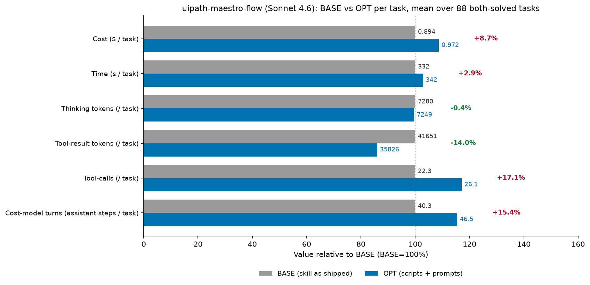

# uipath-maestro-flow skill optimization — cost-reduction report

Cost reduction is measured by **3 cost dimensions** — (1) thinking tokens, (2) tool-result tokens, (3) tool-calls/turns — targeted by **3 optimization techniques**:

- **Scripted skills**: turn deterministic procedures found in the skill files into scripts to cut tool-calls/turns; they also cut thinking (the agent doesn't re-derive an encoded procedure) and, for some scripts, tool-result tokens (output written to a file instead of into context).
- **Thinking budget prompt (RB1, RB2)**: softly curb reasoning to cut thinking tokens.
- **Working style prompt (WS1–WS7)**: 7 bullets, each targeting different cost dimensions.

Scope: the **88 tasks that succeeded in both runs** (OPT `maestro-flow-optimized-sonnet-4-6`, BASE `maestro-flow-baseline-sonnet-4-6`, model `claude-sonnet-4-6`), n=1 rep per task, so every per-task number is a point estimate. Headline: the optimization hit three of its four target levers — tool-result tokens **−14.0%**, output **−6.5%**, thinking **−0.4%** — and still **raised** cost by **+$6.84 (+8.7%)**, because cost-model turns rose **+15.4%** and cache-read is the dominant cost term.

## Script Generation of uipath-maestro-flow

Build, edit, publish, run, diagnose, and evaluate UiPath Maestro Flow (`.flow`) projects through the `uip maestro flow` CLI plus direct `.flow` JSON authoring, organized as four capabilities (Author, Operate, Diagnose, Evaluate) with a 28-plugin per-node-type catalog.

**12 out of 34 areas** can be turned into scripts, and the corresponding scripts are: `audit_flow.py` (orchestrator over the five local audits), `check_topology.py`, `audit_expressions.py`, `lint_jint.py`, `check_bindings.py`, `check_runtime_gaps.py`, `flow_edit.py`, `flow_compose.py`, `node_ownership.py`, `validate_mermaid.py`, `encode_parameter_values.py`, `wire_agent_inputs.py`, `diagnose_run.py` (plus the shared `flow_lib.py` helper, which is imported rather than invoked).

Codifiability is taken from `/home/azureuser/projects/skills/tmp/experiments/classification/flow/classification-details-uipath-maestro-flow.md`.

Many of the remaining 22 areas are `uip` CLI calls rather than derivations — scaffold, registry lookup, `node add`/`configure`, `validate`, `format`, `solution upload`, `flow debug`, the `eval` subtree. Those are not script targets; the working-style prompt is what is supposed to compress them, by planning the path up front and chaining independent calls into one turn (WS2) instead of issuing them one per turn.

| # | Area | Codifiable? | Notes |
|---|------|-------------|-------|
| 1 | Capability routing — map a request to Author / Operate / Diagnose / Evaluate | No | Intent classification; no fixed input→output mapping |
| 2 | User-interaction protocol — dropdown + "Something else", consent gates, narration and todo opt-in | No | Conversational policy, not a transform |
| 3 | "Is Maestro the right home?" gate and when-to-plan judgment | No | Requirements judgment |
| 4 | Node selection heuristics (connector → managed HTTP → RPA ladder, branch/transform/wait/human/agent choices) | No | Requires reading intent; ladder input is a live registry search |
| 5 | Topology pattern catalog (linear, branch, parallel+merge, loop, error, orchestration, scheduled, RPA bridge) | No | Design menu, chosen by judgment |
| 6 | Plan document structure (summary, node table, edge table, I/O table, connector summary, open questions) | Marginal | Table emission is mechanical once nodes/edges are decided, but content is generative |
| 7 | **Mermaid plan diagram — syntax + structural validation** | **Yes — VALIDATE/CHECK** | 12 syntax rules, reserved-word list, forbidden-character list, 11-step check procedure |
| 8 | Solution/project scaffold sequence + registration/layout verification | Marginal | Already a single chained `Bash`; the layout check is one `ls` |
| 9 | **Node ownership routing — node type → Edit/Write vs CLI** | **Yes — LOOKUP/REFERENCE-TABLE** | Two closed tables in `author/CAPABILITY.md`; wrong route silently corrupts `bindings[]` |
| 10 | **`.flow` structural mutation primitives (nodes, edges, definitions, variables, layout)** | **Yes — TRANSFORM-PIPELINE** | Fixed multi-array splice with a documented anchor-uniqueness discipline |
| 11 | **Composite graph edits (insert-between, decision branch, remove+reconnect, replace mock/trigger, subflow)** | **Yes — TRANSFORM-PIPELINE** | Each is an ordered `Edit × 3–4` recipe over the same JSON arrays, including the delete cascade |
| 12 | **Port + wiring legality (Standard Port Reference + 12 wiring rules)** | **Yes — VALIDATE/CHECK** | Port names are a closed table; rules are graph invariants |
| 13 | **Expression prefix contract (`=js:` per field/node type, forbidden forms)** | **Yes — DETECT** | Per-field required/forbidden table; `flow validate` covers only part of it |
| 14 | **Jint runtime constraints for script bodies and `=js:` expressions** | **Yes — DETECT** | Explicit supported/not-supported construct lists |
| 15 | Variables system semantics (directions, `globals`/`nodes`/`variableUpdates` schemas, subflow and loop scope) | No | Schema teaching; `variables.nodes[]` regeneration is already `flow format` |
| 16 | **Resource-node top-level `bindings[]` construction + presence audit** | **Yes — BUILD-MODEL/MATRIX** | Two entries per resource node, all fields derived from the registry definition |
| 17 | Connector configuration workflow (connection bind → describe → reference resolution → `--detail`) | No | Live-tenant calls, field selection, and user elicitation |
| 18 | **Connector `customFieldsRequestDetails` key encoding + `parameterValues` tuple shape** | **Yes — COMPUTE/FORMULA** | Fixed longest-first substitution table plus a fixed serialization shape |
| 19 | Connector filter trees / CEQL authoring | No | Query semantics from user intent |
| 20 | **Inline-agent input wiring triple + flatten rule** | **Yes — BUILD-MODEL/MATRIX** | Stated flatten rule and three aligned artifacts derived from one binding list |
| 21 | Inline-agent project lifecycle (`agent init/refresh/validate`, `resource.json`) | No | CLI calls |
| 22 | IxP node semantics (discovery, `fileRef` wiring, output field taxonomy) | No | Model-specific, registry-driven |
| 23 | HITL / trigger / control-flow / pattern node semantics (remaining plugin families) | No | Per-node-type domain knowledge |
| 24 | Error-handling design policy (default-off flag, do-not-swallow matrix) | Marginal | Audit already ships as a copy-paste heredoc in `failure-modes.md` |
| 25 | Ship — `resources refresh` → Studio Web upload vs `pack` + `publish` | No | CLI chain plus a consent decision |
| 26 | Debug run + mandatory reporting contract (Studio Web URL / instance ID first) | No | Consent-gated CLI call |
| 27 | Process run + job status/traces | No | CLI calls |
| 28 | Instance lifecycle (pause / resume / cancel / retry) | No | CLI calls, gated on prior diagnosis |
| 29 | **Diagnostic priority ladder + faulting-element→node correlation** | **Yes — TRANSFORM-PIPELINE** | Fixed 5-step chain where each call's arguments come from the previous call's JSON |
| 30 | **Pre-debug audit of the documented "not caught by `flow validate`" set** | **Yes — DETECT** | The skill enumerates exactly what validate misses |
| 31 | Failure-mode catalog reading (symptom → cause → fix) | Marginal | Lookup table, but symptom matching is fuzzy free text |
| 32 | Evaluate — evaluator types, JSON shapes, custom prompts | No | CLI CRUD + prompt authoring |
| 33 | Evaluate — eval sets, data points, `--criteria`, attachments, simulations | No | CLI CRUD |
| 34 | Evaluate — run start/status/results, compare, failure detection | Marginal | `--only-failed` already implements the failure rules |

## Summary

### Overall Results

Per-task means over the 88 both-solved tasks (n=1 rep each). Mixed directions, and the two that fell are the two that cost least: tool-result tokens 41,651 → 35,826 (−14.0%) and thinking tokens 7,280 → 7,249 (−0.4%), against tool-calls 22.3 → 26.1 (+17.1%), cost-model turns 40.3 → 46.5 (+15.4%), time 332s → 342s (+2.9%) and cost $0.894 → $0.972 (+8.7%).

**Where the $6.84 *increase* comes from** (OPT − BASE; three of the four buckets fell, and the fourth outweighs all of them):

| bucket | Δ tokens (sum) | share | cost-model term |
|---|---|---|---|
| thinking | -2799 | -0.6% | `g·thk` |
| cache-read | +36653445 | +160.9% | `r·(TR+G)·(T−t)` |
| non-thinking output = output − thinking | -93309 | -20.5% | `g·(cl+tc)` |
| cache-create + uncached | -739149 | -40.4% | `w·TR` |

Note: the `Δ tokens` column holds **exact sums over the 88 tasks**, while the chart above reports **per-task means, rounded for display**, so multiplying a rounded chart delta by the 88 tasks will not exactly reproduce these sums. The exact sums and the `$` total (from `total_cost_usd`) are authoritative. Buckets sum to $6.835 = the measured total to the cent; the per-bucket dollar split reconciles to `total_cost_usd` exactly on every `task.json` (max gap $0.000000), so the split is a faithful decomposition, not an estimate.

### Where the cost comes from before optimization — and how OPT cuts it

**BASE is context-driven, but reasoning is not negligible here.** Across the 88 both-solved tasks BASE spends **104.2M cache-read tokens** and **6.82M cache-create tokens** against **1.44M output tokens**, of which **641k are thinking tokens**, plus 87k uncached input. The derived split of BASE's $78.68 is **39.7% cache-read + 32.5% cache-create + 0.3% uncached = 72.5% context, 27.5% generation (12.2 points of it thinking)** — so unlike the Sonnet-5 arm, reasoning is a real line item, but context still dominates. What runs it up: the large references parked in context and re-read every turn (`connector/impl.md` 16.8k tokens, `planning-arch.md` 11.7k, `greenfield.md` 8.8k, `CAPABILITY.md` 7.7k — 2.55M tokens of reference tool-results across 445 reference touches), full-file rewrites of the `.flow` (`group-to-subflow` emits 49k output tokens for one `Write`; `ixp-invoice-extraction-simulated` re-reads the flow at 22.7k and 14.3k tokens and `Write`s it 3 times), to-do ceremony (36 `TaskCreate`/`TaskUpdate` calls) and 86 `validate` + 73 `format` invocations.

**OPT cut the context per call and then spent the saving on turns.** Tool-result tokens fell **−512,588 (−14.0%)** and tool-result per call fell 1,871 → 1,374; output fell **−93,309 (−6.5%)**; cache-create fell **−724,780 (−10.6%)** and uncached −14,369; thinking fell **−2,799 (−0.4%)**. Those four movements are worth −$4.16 together. But assistant steps rose 3,548 → 4,095 (**+547, +15.4%**) and tool-calls 1,959 → 2,294 (**+335, +17.1%**), and cache-read per turn *also* grew 29.4k → 34.4k, so cache-read rose **+36.65M tokens (+35.2%) = +$11.00** and swamped them. The clearest evidence that turns, not context, decide the bill: **40 regressions had tool-result *fall* and still cost +$8.21 more**, adding +433 turns between them; conversely **15 of the 22 wins are tasks whose tool-result dropped >5k, carrying −$5.39 of the −$6.54 win total**. Δturns correlates with Δcost at **r = 0.788**, ΔTR only at **r = 0.378**.

Where OPT won, it won by shrinking what enters context per step — and here the scripts did contribute, unlike in the Sonnet-5 arm:

| Mechanism (what OPT changed) | Term | Examples (Δcost) |
|---|---|---|
| Scripts replaced full-file rewrites and whole-file re-reads (WS5 edit-don't-rewrite + WS6 keep-outputs-small) | `w·TR` + `g·(cl+tc)` | `ixp-invoice-extraction-simulated` −$1.06 (tool-result 136k→59k, output 53k→27k, 3 `Write`s → `flow_edit` ×16); `ixp-scaffold-multinode` −$0.44 (59k→32k); `bindings-idempotent-reconfigure` −$0.46 (47k→30k) |
| Turn collapse — plan the path, then chain (WS2/WS7) | `r·(TR+G)·(T−t)` | `ixp-integration-handle-routing` −$0.99 (75→39 turns, 44→21 calls); `feet-inches` −$0.51 (66→32 turns, 38→17 calls); `eval-simulation-crud` −$0.28 (40→19 turns, 26→10 calls) |
| Stopped rewriting the whole flow file (WS5), even with no script involved | `w·TR` + `g·G` | `group-to-subflow` −$0.62 (one 49k-output `Write` → none, tool-result 48k→34k, zero bundled calls); `scheduled-trigger` −$0.22 (33k→22k) |
| Shorter reasoning bursts (RB1) — measurable here because thinking tokens are recorded | `g·thk` | `bellevue-weather-simulated` −$0.52 (thinking 25.7k→6.0k, largest burst 18.5k→3.7k); `ixp-integration-handle-routing` 16.0k→5.4k; `ipe-enum` −$0.15 (25.9k→12.0k) |
| Dropped to-do ceremony (WS2/WS7) — 36 → 6 `TaskCreate`/`TaskUpdate` calls overall | `g·G` | `slack-channel-description` −$0.37; `eval-inline-agent` −$0.22 |

**Real vs. noise.** Because each task is a single rep, a dollar difference only counts as an optimization effect when the agent **measurably did something different** on one of the four levers the prompts target: **tool-calls (≥3), cost-model turns (≥3), tool-result tokens (≥5k), or thinking tokens (≥1.5k)**. Thinking tokens *are* recorded in this arm (unlike the Sonnet-5 dump), so all four levers are measurable and the thinking lever fires on 52 of 88 tasks. Applying the test to the wins: **21 of 22 wins are real ($−6.53); 1 is noise** (`trigger-with-filter` −$0.01). The median absolute lever movement across the set is 4 tool-calls, 7 turns, 6.6k tool-result and 3.3k thinking tokens (BASE mean 22 calls / 40 turns per task). Under a stricter relative test (any lever moving ≥10% of its BASE value) 85 of 88 tasks qualify; the 3 marginal ones are `bindings-reconfigure-different-connection`, `bindings-no-duplicates` and `interactive-customer-escalation-triage`. Nine tasks moved exactly one lever (together +$0.21) and should be treated as gray zone needing replication, especially the six whose only mover is a single thinking or output swing.

### Why cost increases in some tasks

**66 of 88 tasks cost more (+$13.38), and 59 of those are attributable rather than noise** by the four-lever test (7 are noise, +$0.35 in total: `add-output`, `bindings-no-duplicates`, `eval-no-auto-upload`, `hitl-smoke-completed-port`, `init-validate`, `outlook-waitfor-email`, `registry-discovery` — all cent-level). The regression profile is different from the Sonnet-5 arm: script-source snooping is rare here (7 tasks read `scripts/*.py`, 6 called `--help`, 4.9k tool-result tokens in total, +$1.81 on those tasks), and the damage is instead **turn sprawl** — the agent decomposes work that BASE did in one `Write`/`Edit` into many small `Bash` steps, with inline python rising 125 → 475 calls and `validate` 86 → 121. In **40 of the 66 regressions the tool-result tokens actually fell** while cost still rose (+$8.21, +433 turns), which is the signature of paying `r·(TR+G)·(T−t)` on extra steps rather than `w·TR` on bigger payloads.

| Mechanism (what OPT changed) | Term | Examples (Δcost) |
|---|---|---|
| Turn sprawl — one `Write`/`Edit` in BASE becomes many small `Bash` steps in OPT (WS2/WS5/WS7 backfire); inline python 125 → 475 calls, `validate` 86 → 121 | `r·(TR+G)·(T−t)` | `hitl-quality-boolean-decision` +$0.31 (14→32 calls, 28→57 turns, while tool-result *fell* 33k→25k); `ipe-jira-search-triage` +$0.76 (46→87 turns, tool-result 65k→59k); `ipe-generate-schema` +$0.79 (25→46 calls, Bash 15→35, tool-result 53k→46k) |
| Script granularity — `flow_edit.py` is one mutation per invocation (146 calls over 73 tasks), so an N-node flow costs N turns where BASE used a couple of batched `Edit`s | `r·(TR+G)·(T−t)` | `ixp-e2e-invoice-extraction-greenfield` +$0.67 (`flow_edit` ×19, 79→98 turns); `wiki-pageviews` +$0.48 (×8, 30→61 turns); `ipe-drive-to-slack` +$0.34 (×5, 55→73 turns) |
| Unprompted reasoning bursts where RB2 should have reserved depth — aggregate thinking is flat (−0.4%) but the per-task spread is wide | `g·thk` + `r·(TR+G)·(T−t)` | `wiki-pageviews` thinking 20.7k→37.3k (+$0.48); `hitl-schema-design-simulated` 9.7k→19.8k (+$0.18); `decision` 3.7k→12.9k (+$0.03) |
| More generation per task despite fewer tool-results (`audit_flow` findings re-planned rather than applied) | `g·(cl+tc)` | `customer-escalation-simulated` +$1.08 (output 16k→41k, Bash 34→56, `audit_flow` ×4); `lowcode-agent` +$0.42 (output 9k→18k); `e2e-escalation-slack-alert` +$0.43 (output 15k→24k) |

**Real vs. noise (regressions).** By the same four-lever test: **59 of 66 regressions are real (+$13.03); 7 are noise (+$0.35)**. Across all 88 tasks: **80 real ($+6.49) / 8 noise ($+0.34)** — the noise is 5% of the headline and mildly asymmetric (7 positive, 1 negative), which is worth stating plainly rather than claiming perfect cancellation; even attributing all of it to luck leaves +$6.5 of measured behavior change. Under the stricter ≥10%-relative test, 85 of 88 tasks qualify. The direction is the finding: this optimization delivered on three of the four levers it targets and still lost, because it traded −$4.16 of context/generation savings for +$11.00 of cache-read on 547 extra turns.

Remediation targets implied by the regressions: (1) **batch the mutation script** — one `flow_edit` call per node/edge is the wrong unit; accept a whole node/edge/variable plan from a single JSON file so an N-node flow costs one turn (this alone addresses the 146 `flow_edit` calls and the 40 tool-result-fell-but-cost-rose tasks); (2) **make `audit_flow` findings directly actionable** (emit an apply-patch or exact edit list) so a clean audit does not turn into a re-planning loop — `validate` calls rose 86 → 121 and output rose on several regressions; (3) **discourage decomposing a single edit into many `Bash` steps** — the WS bullets currently reward small steps and inline python (125 → 475 calls) without penalising the turn count they create; (4) keep the RB wording, which is roughly neutral here (thinking −0.4% overall), but add an explicit ceiling for the outlier bursts (`wiki-pageviews` 20.7k → 37.3k).

### How Are results Collected

All numbers come from `<run>/default/<task>/<rep>/task.json`, computed by `extract.py` / `features.py` in this directory (`rows.json`, `features.json` hold the per-task rows).

- **thinking tokens** — Σ `output_tokens` over `iterations[].messages[]` where the message's `content_blocks` block-types are exactly `{"thinking"}`, e.g. a message with `[{"block_type": "thinking", …}]` and `"output_tokens": 1792`. In this arm the counts are populated (BASE 640,678 → OPT 637,879 over the 88 tasks; every task has non-zero thinking on both sides), so the thinking lever is measured directly rather than by proxy. Bursts ≥1.5k tokens are also recorded per task (largest single burst: 18,538 tokens in BASE `bellevue-weather-simulated`).
- **tool-result tokens** — Σ `result_tokens` over `iterations[].commands[]`, e.g. `{"tool_name": "Read", "result_tokens": "7913"}`.
- **tool-calls** — `len(iterations[].commands[])`. A **script invocation** is a `commands[]` entry with `tool_name == "Bash"` whose `parameters.command` matches `python3 …/<script>.py`; a `Read`/`cat`/`sed` of the script source does **not** count (those are tallied separately as script-source reads). Counted per script in OPT: `flow_edit` 146, `audit_flow` 119, `encode_parameter_values` 4, `flow_compose` 3, `node_ownership` 1 — 273 bundled calls in total, against 0 in BASE; the agent's own scripts (one `build_flow.py`) are tracked apart from the bundled ones.
- **cost-model turns T** — count of assistant messages in `iterations[].messages[]` (each is one billed step: think → call tools → observe). Reported as "cost-model turns"; the number of tool-calling messages equals the tool-call count in both arms (no batching was observed in either run), which is why the two rows move together.
- **cost / cache buckets** — `total_token_usage.total_cost_usd`, `.cache_read_input_tokens`, `.cache_creation_input_tokens`, `.output_tokens`, `.uncached_input_tokens`, e.g. `{"uncached_input_tokens": 507, "output_tokens": 8236, "cache_creation_input_tokens": 69123, "cache_read_input_tokens": 836307, "total_cost_usd": 0.63516435}`.
- **time** — `duration_seconds`; **task instruction** — `task_description`; **ordered action trace** — `iterations[].commands[]` walked in order.
Bucket **token counts are read directly**; `total_cost_usd` is the only dollar figure stored, so per-bucket dollars are derived as tokens × rate (output $15/M, cache-read $0.30/M, cache-create $3.75/M, uncached $3/M). Reconciliation was verified on **every** `task.json` in both runs: max |derived − `total_cost_usd`| = **$0.000000**.

Scope: tasks with ≥1 `final_status == "SUCCESS"` rep in **both** runs → 88 tasks; only successful reps are used. Every both-solved task has **n=1** successful rep in each arm, so no repeat-aggregation or outlier exclusion was needed (0 reps excluded) and all per-task figures are point estimates. For completeness outside the scope: BASE produced 95 successes vs OPT 90 — 7 tasks solved only by BASE (`devcon-billing-discrepancy-detector`, `e2e-escalation-orchestrator-paths`, `ipe-ceql-where`, `ipe-jira-lifecycle`, `non-catalog-http-fallback`, `remove-node`, `switch`) against 2 solved only by OPT (`devcon-billing-dispute-analyst`, `rpa`), so the cost regression comes with a small success-rate regression as well.

## Case Analysis

## Reference

### Per Task Table

Script usage & benefit: **73 of 88** tasks invoked a bundled script; of those **14 got cheaper, 2 flat, 57 more expensive**. The 15 tasks that invoked no bundled script net **−$1.08**. A bundled script (per-mutation `flow_edit`, or the `--help`/source-reading detour needed to use one) is the **dominant driver in 8 regressions**; the largest single win (`ixp-invoice-extraction-simulated`, −$1.06) is also script-driven, so the script effect is genuinely two-sided in this arm. Δthinking is measured directly here (tokens, and the $ at $15/M).

| # | task | Δcost | Δthinking tok ($) | Δtool-result tok | Δtool-calls | Δtime | scripts fe/af/other | attribution (ranked) |
|---|---|---|---|---|---|---|---|---|
| 1 | ixp-invoice-extraction-simulated | $2.76→$1.70 (-38%) | -8999 (-0.135) | -76242 | -5 | 1090s→636s (-42%) | 16/1/0 | turn collapse (WS2 chain / WS7 skip-unneeded); less reasoning (RB1, -9.0k thinking tok); less tool-result in context (WS3/WS6, -76k) |
| 2 | ixp-integration-handle-routing | $1.72→$0.73 (-57%) | -10563 (-0.158) | -20988 | -23 | 559s→314s (-44%) | 0/2/0 | turn collapse (WS2 chain / WS7 skip-unneeded); less reasoning (RB1, -10.6k thinking tok); less tool-result in context (WS3/WS6, -20k) |
| 3 | group-to-subflow | $1.48→$0.85 (-42%) | -3863 (-0.058) | -13860 | +0 | 676s→454s (-33%) | 0/0/0 | less reasoning (RB1, -3.9k thinking tok); less tool-result in context (WS3/WS6, -13k); stopped full-file rewrites (WS5, Write 1→0) |
| 4 | bellevue-weather-simulated | $1.39→$0.87 (-37%) | -19655 (-0.295) | -17008 | +9 | 703s→372s (-47%) | 0/1/0 | less reasoning (RB1, -19.7k thinking tok); less tool-result in context (WS3/WS6, -17k) |
| 5 | feet-inches | $1.31→$0.80 (-39%) | +513 (+0.008) | -1086 | -21 | 443s→430s (-3%) | 0/1/0 | turn collapse (WS2 chain / WS7 skip-unneeded); bundled script replaced manual steps |
| 6 | bindings-idempotent-reconfigure | $1.19→$0.73 (-39%) | -8533 (-0.128) | -17486 | -6 | 382s→258s (-32%) | 0/0/0 | turn collapse (WS2 chain / WS7 skip-unneeded); less reasoning (RB1, -8.5k thinking tok); less tool-result in context (WS3/WS6, -17k) |
| 7 | ixp-scaffold-multinode | $1.49→$1.05 (-30%) | -6435 (-0.097) | -26714 | +2 | 775s→565s (-27%) | 0/0/0 | less reasoning (RB1, -6.4k thinking tok); less tool-result in context (WS3/WS6, -26k); stopped full-file rewrites (WS5, Write 2→0) |
| 8 | slack-channel-description | $1.20→$0.83 (-31%) | -1242 (-0.019) | -10315 | -4 | 358s→265s (-26%) | 0/1/0 | turn collapse (WS2 chain / WS7 skip-unneeded); less tool-result in context (WS3/WS6, -10k); bundled script replaced manual steps |
| 9 | eval-simulation-crud | $0.56→$0.29 (-49%) | -92 (-0.001) | -821 | -16 | 160s→94s (-41%) | 0/0/0 | turn collapse (WS2 chain / WS7 skip-unneeded); dropped to-do ceremony (WS2/WS7, −12 TaskCreate/Update) |
| 10 | e2e-escalation-jira-ticket | $1.79→$1.54 (-14%) | +8330 (+0.125) | -5209 | +2 | 516s→594s (+15%) | 26/2/1 | less tool-result in context (WS3/WS6, -5k) |
| 11 | scheduled-trigger | $0.72→$0.50 (-31%) | -721 (-0.011) | -11302 | -3 | 212s→180s (-15%) | 0/0/1 | less tool-result in context (WS3/WS6, -11k); stopped full-file rewrites (WS5, Write 1→0); bundled script replaced manual steps |
| 12 | eval-inline-agent | $1.37→$1.16 (-16%) | -1119 (-0.017) | -1191 | -6 | 521s→454s (-13%) | 0/1/0 | dropped to-do ceremony (WS2/WS7, −9 TaskCreate/Update); bundled script replaced manual steps |
| 13 | ipe-enum | $1.63→$1.49 (-9%) | -13872 (-0.208) | -16575 | +3 | 754s→505s (-33%) | 0/2/0 | less reasoning (RB1, -13.9k thinking tok); less tool-result in context (WS3/WS6, -16k) |
| 14 | merge-parallel-sync | $0.58→$0.46 (-21%) | +615 (+0.009) | -10645 | +0 | 186s→168s (-10%) | 0/0/0 | less tool-result in context (WS3/WS6, -10k) |
| 15 | hitl-quality-result-downstream | $0.77→$0.66 (-15%) | -4546 (-0.068) | -12271 | +2 | 367s→295s (-20%) | 0/2/0 | less reasoning (RB1, -4.5k thinking tok); less tool-result in context (WS3/WS6, -12k) |
| 16 | bellevue-weather | $1.17→$1.10 (-6%) | +23172 (+0.348) | +5930 | +5 | 514s→680s (+32%) | 16/1/0 | stopped full-file rewrites (WS5, Write 1→0) |
| 17 | bindings-reconfigure-different-connection | $0.93→$0.87 (-7%) | -126 (-0.002) | -2980 | -2 | 232s→278s (+20%) | 3/0/0 | bundled script replaced manual steps |
| 18 | openmeteo-weather | $0.93→$0.87 (-6%) | +92 (+0.001) | -11776 | -2 | 281s→353s (+26%) | 0/2/0 | less tool-result in context (WS3/WS6, -11k); bundled script replaced manual steps |
| 19 | ipe-required-groups | $0.73→$0.72 (-2%) | +6219 (+0.093) | -9313 | -1 | 172s→286s (+66%) | 3/1/0 | less tool-result in context (WS3/WS6, -9k); bundled script replaced manual steps |
| 20 | trigger-with-filter | $0.23→$0.22 (-5%) | +506 (+0.008) | -4201 | +1 | 73s→71s (-2%) | 0/0/0 | n=1 noise (no lever moved materially) |
| 21 | transform-map | $0.62→$0.62 (-1%) | -633 (-0.009) | +3327 | -2 | 290s→237s (-18%) | 0/2/0 | bundled script replaced manual steps |
| 22 | eval-local-crud | $0.35→$0.35 (-1%) | +2945 (+0.044) | -6959 | -2 | 142s→179s (+25%) | 0/0/0 | less tool-result in context (WS3/WS6, -6k) |
| 23 | hitl-smoke-completed-port | $0.58→$0.59 (+1%) | -411 (-0.006) | -257 | -1 | 256s→273s (+7%) | 0/2/0 | n=1 noise (no lever moved materially) |
| 24 | ipe-query-params | $0.56→$0.57 (+3%) | -2690 (-0.040) | -415 | +2 | 174s→153s (-12%) | 0/3/0 | gray zone: only turns, thinking_tokens moved, single rep |
| 25 | hitl-quality-schema-design | $0.82→$0.83 (+2%) | -5985 (-0.090) | +7100 | +7 | 405s→219s (-46%) | 0/2/0 | turn inflation → cache-read (`r·(TR+G)·(T−t)`); more tool-result into context (`w·TR`) |
| 26 | ipe-jira-create-issue | $1.12→$1.14 (+2%) | +1550 (+0.023) | -12122 | +0 | 296s→369s (+25%) | 8/1/2 | script-discovery overhead (WS1 backfire: `--help` ×1); script granularity: `flow_edit` ×8 (one call per mutation) |
| 27 | decision | $0.60→$0.62 (+4%) | +9143 (+0.137) | +83 | -2 | 228s→430s (+88%) | 0/1/0 | bigger reasoning bursts (RB2 backfire, +9.1k thinking tok) |
| 28 | jdbc-databricks-query | $1.51→$1.54 (+2%) | -13567 (-0.204) | -9755 | +10 | 605s→379s (-37%) | 0/2/0 | gray zone: only tool_calls, turns, tool_result_tokens, thinking_tokens moved, single rep |
| 29 | ixp-scaffold-minimal | $0.83→$0.86 (+4%) | +2732 (+0.041) | +265 | +0 | 321s→297s (-8%) | 0/2/0 | gray zone: only turns, thinking_tokens moved, single rep |
| 30 | delay | $0.48→$0.51 (+7%) | -32 (-0.000) | -10226 | +4 | 112s→156s (+39%) | 0/2/0 | gray zone: only tool_calls, turns, tool_result_tokens moved, single rep |
| 31 | init-validate | $0.25→$0.29 (+14%) | -53 (-0.001) | +169 | +0 | 97s→104s (+7%) | 0/0/0 | n=1 noise (no lever moved materially) |
| 32 | terminate | $0.78→$0.82 (+5%) | +3995 (+0.060) | -692 | -4 | 310s→398s (+29%) | 0/3/0 | bigger reasoning bursts (RB2 backfire, +4.0k thinking tok) |
| 33 | outlook-waitfor-email | $0.67→$0.71 (+7%) | -1384 (-0.021) | -2839 | +1 | 220s→174s (-21%) | 0/1/0 | n=1 noise (no lever moved materially) |
| 34 | reading-list | $0.60→$0.65 (+8%) | +801 (+0.012) | -206 | -1 | 239s→267s (+11%) | 0/1/0 | gray zone: only turns moved, single rep |
| 35 | eval-no-auto-upload | $0.18→$0.23 (+26%) | +875 (+0.013) | +1505 | +1 | 54s→91s (+69%) | 0/0/0 | n=1 noise (no lever moved materially) |
| 36 | hitl-quality-brownfield-insert | $1.34→$1.40 (+4%) | -5659 (-0.085) | -18408 | +0 | 519s→446s (-14%) | 0/4/2 | script-discovery overhead (WS1 backfire: `--help` ×1) |
| 37 | transform-group-by | $0.52→$0.58 (+10%) | -487 (-0.007) | +1500 | +4 | 190s→191s (+0%) | 0/2/0 | script-discovery overhead (WS1 backfire: script source read ×1) |
| 38 | add-output | $0.28→$0.33 (+20%) | +275 (+0.004) | +343 | +1 | 87s→105s (+21%) | 0/1/0 | n=1 noise (no lever moved materially) |
| 39 | transform-filter | $0.57→$0.63 (+10%) | -3713 (-0.056) | +993 | +4 | 257s→198s (-23%) | 0/2/0 | gray zone: only tool_calls, turns, thinking_tokens moved, single rep |
| 40 | registry-discovery | $0.15→$0.22 (+45%) | +292 (+0.004) | -1024 | +1 | 64s→76s (+20%) | 0/0/0 | n=1 noise (no lever moved materially) |
| 41 | ipe-dtl-load-by-default-true | $0.71→$0.78 (+10%) | +3063 (+0.046) | -14333 | -2 | 164s→310s (+89%) | 5/1/0 | script granularity: `flow_edit` ×5 (one call per mutation); bigger reasoning bursts (RB2 backfire, +3.1k thinking tok) |
| 42 | hitl-smoke-node-placed | $0.66→$0.74 (+12%) | -5489 (-0.082) | +4907 | +4 | 338s→289s (-15%) | 0/3/0 | turn inflation → cache-read (`r·(TR+G)·(T−t)`) |
| 43 | batch-transform | $0.51→$0.59 (+16%) | +1368 (+0.021) | -7104 | +1 | 157s→240s (+53%) | 0/2/0 | gray zone: only turns, tool_result_tokens moved, single rep |
| 44 | bindings-no-duplicates | $0.91→$1.01 (+10%) | +6 (+0.000) | -2348 | -1 | 389s→346s (-11%) | 0/2/0 | n=1 noise (no lever moved materially) |
| 45 | add-node | $0.32→$0.42 (+30%) | +826 (+0.012) | -578 | +2 | 105s→136s (+30%) | 0/0/0 | gray zone: only turns moved, single rep |
| 46 | bindings-multi-connector-independence | $0.83→$0.93 (+12%) | +8424 (+0.126) | -2438 | -1 | 237s→333s (+41%) | 4/0/0 | bigger reasoning bursts (RB2 backfire, +8.4k thinking tok) |
| 47 | calculator | $0.52→$0.62 (+20%) | -330 (-0.005) | -9743 | +2 | 168s→265s (+58%) | 0/2/0 | gray zone: only turns, tool_result_tokens moved, single rep |
| 48 | multi-city-weather | $1.25→$1.35 (+9%) | -4874 (-0.073) | +8583 | +7 | 738s→752s (+2%) | 0/2/0 | turn inflation → cache-read (`r·(TR+G)·(T−t)`); more tool-result into context (`w·TR`) |
| 49 | interactive-customer-escalation-triage | $0.74→$0.87 (+17%) | +2798 (+0.042) | -1308 | +0 | 384s→478s (+24%) | 0/2/0 | gray zone: only turns, thinking_tokens moved, single rep |
| 50 | solution-select-ask | $0.16→$0.29 (+79%) | +231 (+0.003) | +10120 | +6 | 99s→147s (+48%) | 0/0/0 | more tool-result into context (`w·TR`) |
| 51 | outlook-trigger-inbox | $1.02→$1.16 (+14%) | -6465 (-0.097) | -16798 | +8 | 367s→273s (-26%) | 0/1/0 | gray zone: only tool_calls, tool_result_tokens, thinking_tokens moved, single rep |
| 52 | ipe-path-params | $0.90→$1.04 (+16%) | +6 (+0.000) | -9578 | +5 | 266s→303s (+14%) | 0/1/0 | turn inflation → cache-read (`r·(TR+G)·(T−t)`) |
| 53 | ipe-complex-array | $0.73→$0.88 (+19%) | -872 (-0.013) | +7069 | +9 | 193s→213s (+10%) | 0/1/0 | more tool-result into context (`w·TR`) |
| 54 | subflow | $0.51→$0.67 (+30%) | -950 (-0.014) | +8813 | +9 | 206s→224s (+9%) | 0/2/0 | turn inflation → cache-read (`r·(TR+G)·(T−t)`); more tool-result into context (`w·TR`) |
| 55 | file-attachment-debug | $0.67→$0.82 (+23%) | +5275 (+0.079) | -9303 | +1 | 253s→347s (+37%) | 0/2/0 | bigger reasoning bursts (RB2 backfire, +5.3k thinking tok) |
| 56 | ipe-searchable-joins | $0.91→$1.06 (+17%) | -7779 (-0.117) | -7418 | +8 | 398s→293s (-26%) | 0/1/0 | turn inflation → cache-read (`r·(TR+G)·(T−t)`) |
| 57 | eval-evaluator-type-choice | $0.23→$0.38 (+70%) | +4971 (+0.075) | +241 | +5 | 76s→163s (+116%) | 0/0/0 | bigger reasoning bursts (RB2 backfire, +5.0k thinking tok); turn inflation → cache-read (`r·(TR+G)·(T−t)`) |
| 58 | inline-agent-robust | $0.73→$0.89 (+22%) | +2821 (+0.042) | -259 | +7 | 318s→325s (+2%) | 0/0/0 | turn inflation → cache-read (`r·(TR+G)·(T−t)`) |
| 59 | update-node | $0.22→$0.38 (+74%) | +259 (+0.004) | +10211 | +3 | 68s→101s (+48%) | 0/0/0 | more tool-result into context (`w·TR`) |
| 60 | slack-http-fallback | $0.83→$1.00 (+20%) | +3144 (+0.047) | +11873 | -3 | 278s→297s (+7%) | 0/1/0 | bigger reasoning bursts (RB2 backfire, +3.1k thinking tok); more tool-result into context (`w·TR`) |
| 61 | devcon-billing-resolution-writer | $0.63→$0.80 (+27%) | +122 (+0.002) | +7341 | +8 | 299s→235s (-21%) | 0/1/0 | turn inflation → cache-read (`r·(TR+G)·(T−t)`); more tool-result into context (`w·TR`) |
| 62 | hitl-schema-design-simulated | $0.86→$1.04 (+21%) | +10067 (+0.151) | +2566 | +1 | 436s→595s (+36%) | 0/1/0 | bigger reasoning bursts (RB2 backfire, +10.1k thinking tok) |
| 63 | ipe-multiselect | $0.72→$0.91 (+27%) | +3478 (+0.052) | -20161 | +10 | 180s→288s (+60%) | 3/2/0 | bigger reasoning bursts (RB2 backfire, +3.5k thinking tok); turn inflation → cache-read (`r·(TR+G)·(T−t)`) |
| 64 | dice-roller | $0.49→$0.68 (+40%) | -282 (-0.004) | -6331 | +6 | 189s→249s (+32%) | 0/2/0 | turn inflation → cache-read (`r·(TR+G)·(T−t)`) |
| 65 | slack-channel-description-simulated | $1.20→$1.40 (+16%) | -3262 (-0.049) | +13765 | -2 | 414s→383s (-7%) | 0/2/0 | more tool-result into context (`w·TR`) |
| 66 | move-node | $0.43→$0.63 (+46%) | +6972 (+0.105) | +1512 | +3 | 131s→273s (+108%) | 0/1/0 | bigger reasoning bursts (RB2 backfire, +7.0k thinking tok) |
| 67 | e2e-devcon-expense-approval | $0.86→$1.08 (+26%) | +4289 (+0.064) | +2059 | +6 | 374s→495s (+32%) | 0/3/0 | bigger reasoning bursts (RB2 backfire, +4.3k thinking tok); turn inflation → cache-read (`r·(TR+G)·(T−t)`) |
| 68 | cli-dice-roller-simulated | $0.71→$0.93 (+32%) | +707 (+0.011) | -4080 | +8 | 250s→345s (+38%) | 0/4/0 | gray zone: only tool_calls, turns moved, single rep |
| 69 | paginated-reference-lookup | $0.96→$1.20 (+24%) | -1314 (-0.020) | -18211 | +11 | 168s→202s (+20%) | 0/1/0 | turn inflation → cache-read (`r·(TR+G)·(T−t)`) |
| 70 | webhook-waitfor-parallel | $0.75→$0.99 (+33%) | -384 (-0.006) | -2869 | +6 | 304s→284s (-7%) | 0/1/0 | gray zone: only tool_calls, turns moved, single rep |
| 71 | summarize | $0.61→$0.88 (+43%) | +4561 (+0.068) | +591 | +4 | 194s→313s (+62%) | 0/2/0 | bigger reasoning bursts (RB2 backfire, +4.6k thinking tok) |
| 72 | ipe-enhanced-enum | $1.01→$1.28 (+27%) | -1897 (-0.028) | -2792 | +7 | 338s→335s (-1%) | 10/1/0 | script granularity: `flow_edit` ×10 (one call per mutation); turn inflation → cache-read (`r·(TR+G)·(T−t)`) |
| 73 | devcon-billing-invoice-lookup | $1.52→$1.79 (+18%) | +2531 (+0.038) | -27678 | +19 | 440s→582s (+32%) | 0/1/0 | turn inflation → cache-read (`r·(TR+G)·(T−t)`) |
| 74 | customer-escalation | $1.99→$2.28 (+14%) | -10390 (-0.156) | -55331 | +31 | 744s→506s (-32%) | 19/1/0 | script granularity: `flow_edit` ×19 (one call per mutation); turn inflation → cache-read (`r·(TR+G)·(T−t)`) |
| 75 | ipe-jira-get-issue | $1.30→$1.59 (+22%) | -6889 (-0.103) | -8352 | +10 | 412s→384s (-7%) | 0/1/1 | turn inflation → cache-read (`r·(TR+G)·(T−t)`) |
| 76 | generic-dynamic-node | $1.21→$1.50 (+25%) | +708 (+0.011) | -4429 | +10 | 311s→434s (+40%) | 0/1/0 | gray zone: only tool_calls, turns moved, single rep |
| 77 | hitl-quality-boolean-decision | $0.70→$1.01 (+43%) | +714 (+0.011) | -8669 | +18 | 312s→326s (+4%) | 0/3/0 | turn inflation → cache-read (`r·(TR+G)·(T−t)`) |
| 78 | hitl-smoke-multi-outcome-routing | $0.72→$1.05 (+46%) | +5526 (+0.083) | -4266 | +7 | 365s→456s (+25%) | 0/2/0 | bigger reasoning bursts (RB2 backfire, +5.5k thinking tok); turn inflation → cache-read (`r·(TR+G)·(T−t)`) |
| 79 | ipe-drive-to-slack | $1.04→$1.39 (+33%) | +2086 (+0.031) | +496 | +11 | 318s→374s (+18%) | 4/1/0 | turn inflation → cache-read (`r·(TR+G)·(T−t)`) |
| 80 | expense-approval-simulated | $0.86→$1.26 (+47%) | -915 (-0.014) | -5368 | +13 | 450s→469s (+4%) | 0/2/0 | turn inflation → cache-read (`r·(TR+G)·(T−t)`) |
| 81 | lowcode-agent | $0.50→$0.93 (+84%) | +5258 (+0.079) | +1589 | +9 | 201s→387s (+93%) | 0/3/0 | bigger reasoning bursts (RB2 backfire, +5.3k thinking tok); turn inflation → cache-read (`r·(TR+G)·(T−t)`) |
| 82 | e2e-escalation-slack-alert | $1.60→$2.03 (+27%) | +6364 (+0.095) | -11350 | +13 | 351s→542s (+54%) | 0/2/0 | bigger reasoning bursts (RB2 backfire, +6.4k thinking tok); turn inflation → cache-read (`r·(TR+G)·(T−t)`) |
| 83 | ipe-dtl-load-by-default-false | $1.25→$1.68 (+34%) | +2747 (+0.041) | -11861 | +6 | 273s→408s (+49%) | 0/1/0 | turn inflation → cache-read (`r·(TR+G)·(T−t)`) |
| 84 | wiki-pageviews | $1.19→$1.68 (+41%) | +16614 (+0.249) | -11193 | +20 | 694s→891s (+28%) | 7/1/0 | script-discovery overhead (WS1 backfire: `--help` ×2, script source read ×1); script granularity: `flow_edit` ×7 (one call per mutation); bigger reasoning bursts (RB2 backfire, +16.6k thinking tok) |
| 85 | ixp-e2e-invoice-extraction-greenfield | $1.94→$2.61 (+35%) | -8738 (-0.131) | +1339 | +6 | 962s→794s (-18%) | 17/2/0 | script-discovery overhead (WS1 backfire: `--help` ×1, script source read ×1); script granularity: `flow_edit` ×17 (one call per mutation); turn inflation → cache-read (`r·(TR+G)·(T−t)`) |
| 86 | ipe-jira-search-triage | $1.07→$1.83 (+71%) | -1782 (-0.027) | -5249 | +21 | 410s→464s (+13%) | 5/1/0 | script granularity: `flow_edit` ×5 (one call per mutation); turn inflation → cache-read (`r·(TR+G)·(T−t)`) |
| 87 | ipe-generate-schema | $0.83→$1.61 (+95%) | -2211 (-0.033) | -7033 | +21 | 301s→335s (+11%) | 0/1/1 | turn inflation → cache-read (`r·(TR+G)·(T−t)`) |
| 88 | customer-escalation-simulated | $1.61→$2.69 (+67%) | +8413 (+0.126) | +2439 | +24 | 381s→906s (+138%) | 0/4/0 | script-discovery overhead (WS1 backfire: script source read ×1); bigger reasoning bursts (RB2 backfire, +8.4k thinking tok); turn inflation → cache-read (`r·(TR+G)·(T−t)`) |

### Per Task Behavior

**ixp-invoice-extraction-simulated** (-38%, turn collapse (WS2 chain / WS7 skip-unneeded))
- Task: Invoice-processing flow (SharePoint trigger → IxP extraction → HTTP POST to SAP), driven by a simulated non-technical AP clerk who describes the outcome but withholds the folder, fields, model, and destination until asked. Tests whether the agent elicits the IxP model / extraction fields / downstream endpoint before building. Validate-only — IxP + SharePoint need a live tenant.
- Before (BASE): 16 `Read`s including the flow itself twice at 22.7k and 14.3k tokens, three full-file `Write`s and one `Edit`; 50 calls / 82 turns; 136k tool-result and 53k output tokens.
- After (OPT): 8 `Read`s, then `flow_edit` ×16 and `audit_flow` ×1 with 2 `Edit`s and 2 `Write`s; 45 calls / 74 turns; 59k tool-result and 27k output.
- **Why cheaper:** The scripts replaced the read-whole-flow / rewrite-whole-flow cycle: tool-result −77k (`w·TR` and the per-turn `r` base both fall) and output −26k (`g·(cl+tc)`), with turns also down 8. −$1.06 (−38%), the largest win in the set and the clearest case where a bundled script paid for itself.

**ixp-integration-handle-routing** (-57%, turn collapse (WS2 chain / WS7 skip-unneeded))
- Task: Integration: IxP extraction wired into a Decision node that routes on a field from the extracted content. Exercises field-level variable access via the canonical IxP path (`$vars.{ixpNode}.output.ExtractionResult.ResultsDocument.Fields.find(...)`) and two-branch Decision wiring — the multi-node Quality scenario for IxP. Validate-only: no `uip maestro flow debug`. Validation in CI is offline (`uip 
- Before (BASE): 44 calls / 75 turns, 11 reasoning blocks totalling 16.0k thinking tokens, 51k tool-result, 31k output.
- After (OPT): 21 calls / 39 turns, 7 reasoning blocks totalling 5.4k thinking tokens, 30k tool-result, 15k output; `flow_edit` ×1, `audit_flow` ×1.
- **Why cheaper:** Every lever moved the right way at once: −23 calls, −36 turns, −21k tool-result, −10.6k thinking. −$0.99 (−57%). The turn halving is the dominant term (`r·(TR+G)·(T−t)`), with RB1 visible in the thinking drop.

**group-to-subflow** (-42%, less reasoning (RB1, -3.9k thinking tok))
- Task: Extract the getWeather HTTP node and formatSummary Script node into a subflow named "fetchAndFormat". The subflow returns the formatted temperature data and the main flow keeps the decision and end nodes. Exercises subflow creation from existing nodes.
- Before (BASE): 5 `Read`s (the flow at 19.4k, `file-format.md` 8.9k, `editing-operations.md` 8.6k, `CAPABILITY.md` 7.7k), one delegated `Agent` call, then a single full-file `Write` that emitted 49k output tokens; 13 calls / 27 turns.
- After (OPT): 4 `Read`s (the same 19.4k flow, `CAPABILITY.md`, and two targeted 3.5k/2.5k reference slices), the same `Agent` call, 6 `Bash` steps and **no** `Write`; 13 calls / 26 turns; 34k tool-result, 28k output. No bundled script.
- **Why cheaper:** Identical call and turn counts — the saving is entirely in what was generated and written: output 49k→28k and tool-result 48k→34k, i.e. `g·(cl+tc)` plus `w·TR`. −$0.62 (−42%) with zero script involvement; this is WS5 (edit, don't rewrite) and WS3 (read the slice, not the file).

**bellevue-weather-simulated** (-37%, less reasoning (RB1, -19.7k thinking tok))
- Task: Bellevue weather flow (HTTP → script → decision), but driven by a simulated non-technical user who withholds requirements until asked. Tests the agent's ability to clarify an ambiguous ask before building.
- Before (BASE): 21 calls / 39 turns but 25.7k thinking tokens, including a single 18.5k-token burst; 47k tool-result, 38k output.
- After (OPT): 30 calls / 52 turns with 6.0k thinking tokens, largest burst 3.7k; 30k tool-result, 13k output; `audit_flow` ×1.
- **Why cheaper:** Turns rose 13, yet cost fell 37% because the 18.5k reasoning burst collapsed to 3.7k and output fell 25k: `g·thk` and `g·(cl+tc)` dominate this task. −$0.52. This is the cleanest RB1 win in the set — and a reminder that turns are not the only term.

**feet-inches** (-39%, turn collapse (WS2 chain / WS7 skip-unneeded))
- Task: Create a UiPath Flow that converts a value between feet and inches based on a direction input, using a Switch node to pick the conversion. Exercises switch branching, multi-case wiring, and branch convergence on End.
- Before (BASE): 38 calls / 66 turns, 9 reasoning blocks, 34k tool-result, 21k output.
- After (OPT): 17 calls / 32 turns, 8 reasoning blocks, 33k tool-result, 22k output; `audit_flow` ×1.
- **Why cheaper:** Tool-result and output are flat; the entire −$0.51 (−39%) comes from halving calls (38→17) and turns (66→32), i.e. `r·(TR+G)·(T−t)` with the same context. Note the contrast with the Sonnet-5 arm, where this same task regressed +90% because the agent paged the script sources.

**bindings-idempotent-reconfigure** (-39%, turn collapse (WS2 chain / WS7 skip-unneeded))
- Task: Step 1 of the DAPField-mirrored upsert in `upsertConnectionResourceBinding` is the exact `(name, resource, resourceKey)` match path that refreshes `default` instead of appending. This eval covers it: configuring the same connector node twice with the same connection details must not grow the bindings array. The second configure should be a no-op on row count. See https://github.com/UiPath/cli/pull
- Before (BASE): Read×6, Bash×17, Edit×4; 28 calls / 55 turns / 8 reasoning steps; 47k tool-result.
- After (OPT): Read×5, Bash×12, Edit×4; 22 calls / 47 turns / 9 reasoning steps; 30k tool-result. No bundled script.
- **Why cheaper:** Cost fell. Δcalls -6, Δturns -8, Δtool-result -17486, Δthinking_tokens -8533. 8 fewer assistant turns means 8 fewer full-context re-reads (`r·(TR+G)·(T−t)`), plus lower generation (`g·G`).

**ixp-scaffold-multinode** (-30%, less reasoning (RB1, -6.4k thinking tok))
- Task: Integration: multi-script fan-out from an IxP extraction — manual trigger → IxP extract → 3 script nodes (postReceipt, sendToValidation, logError). Tests that the agent picks IxP, authors the extraction node, and wires three downstream scripts that consume the extraction result. Note on port shape: per references/plugins/ixp/impl.md, IxP exposes a single output port `success` plus an `error` outpu
- Before (BASE): Read×10, Bash×7, Write×2; 21 calls / 45 turns / 12 reasoning steps; 59k tool-result.
- After (OPT): Read×7, Bash×14, Edit×1; 23 calls / 43 turns / 8 reasoning steps; 32k tool-result. No bundled script.
- **Why cheaper:** Cost fell. Δtool-result -26714, Δthinking_tokens -6435. 2 fewer assistant turns means 2 fewer full-context re-reads (`r·(TR+G)·(T−t)`), plus lower generation (`g·G`).

**slack-channel-description** (-31%, turn collapse (WS2 chain / WS7 skip-unneeded))
- Task: Create a UiPath Flow that uses the Slack IS connector to retrieve the channel description of #office-bellevue and outputs it. This is an end-to-end test that exercises connector discovery, connection binding, reference resolution, node configuration, and cloud debug execution.
- Before (BASE): Read×5, Bash×18, Edit×7; 31 calls / 54 turns / 10 reasoning steps; 52k tool-result.
- After (OPT): Read×4, Bash×17, Edit×5; 27 calls / 44 turns / 6 reasoning steps; 42k tool-result. Bundled scripts: `audit_flow`×1.
- **Why cheaper:** Cost fell. Δcalls -4, Δturns -10, Δtool-result -10315. 10 fewer assistant turns means 10 fewer full-context re-reads (`r·(TR+G)·(T−t)`), plus lower generation (`g·G`).

**eval-simulation-crud** (-49%, turn collapse (WS2 chain / WS7 skip-unneeded))
- Task: Skill-guided simulation CRUD: agent uses the uipath-maestro-flow skill's evaluate capability to scaffold a Flow project, build an eval set + data point, then add, list, and remove node simulations on that data point via `uip maestro flow eval simulation add/list/remove`. Covers both strategies — `Static` (`--mock-value`) and `Llm` (explicit `--output-schema`, so the auto-resolution-from-.flow path
- Before (BASE): Read×3, Bash×9, Grep×1, todo×12; 26 calls / 40 turns / 4 reasoning steps; 12k tool-result.
- After (OPT): Read×4, Bash×5; 10 calls / 19 turns / 3 reasoning steps; 11k tool-result. No bundled script.
- **Why cheaper:** Cost fell. Δcalls -16, Δturns -21. 21 fewer assistant turns means 21 fewer full-context re-reads (`r·(TR+G)·(T−t)`), plus lower generation (`g·G`).

**e2e-escalation-jira-ticket** (-14%, less tool-result in context (WS3/WS6, -5k))
- Task: E2E live Jira coverage for the escalation flow — the agent builds a manual-trigger escalation-triage Flow that classifies severity and creates a real Jira ticket for the escalation. The grader seeds a Sev1 case (unique correlationId), runs `uip maestro flow debug --inputs`, and verifies the OUTCOME by re-reading the created key from Jira: the issue exists and its summary carries the seeded correla
- Before (BASE): Read×12, Bash×19, Edit×8; 40 calls / 75 turns / 11 reasoning steps; 57k tool-result.
- After (OPT): Read×9, Bash×32; 42 calls / 73 turns / 11 reasoning steps; 51k tool-result. Bundled scripts: `flow_edit`×26, `audit_flow`×2, `encode_parameter_values`×1.
- **Why cheaper:** Cost fell. Δtool-result -5209, Δthinking_tokens +8330. 2 fewer assistant turns means 2 fewer full-context re-reads (`r·(TR+G)·(T−t)`), plus lower generation (`g·G`).

**scheduled-trigger** (-31%, less tool-result in context (WS3/WS6, -11k))
- Task: Scaffold a UiPath Flow whose start node is a Scheduled Trigger (`core.trigger.scheduled`) that REPLACES the default manual trigger and carries a valid recurring schedule. Exercises the previously-untested scheduled-trigger plugin: the manual->scheduled replacement procedure, the `timeCycle`/`timerPreset` input shape, and the `bpmn:TimerEventDefinition` that the node definition must carry. Validate
- Before (BASE): Read×7, Bash×6, Edit×1, Write×1, Grep×1; 18 calls / 33 turns / 7 reasoning steps; 33k tool-result.
- After (OPT): Read×6, Bash×6, Edit×1; 15 calls / 31 turns / 7 reasoning steps; 22k tool-result. Bundled scripts: `flow_compose`×1.
- **Why cheaper:** Cost fell. Δcalls -3, Δtool-result -11302. 2 fewer assistant turns means 2 fewer full-context re-reads (`r·(TR+G)·(T−t)`), plus lower generation (`g·G`).

**eval-inline-agent** (-16%, dropped to-do ceremony (WS2/WS7, −9 TaskCreate/Update))
- Task: Skill-guided evaluation: agent uses the uipath-maestro-flow skill to build a Flow whose work is done by an INLINE agent node (uipath.agent.autonomous), then wires eval scaffolding that targets it — an `llm-judge-output` evaluator (the correct choice for a non-deterministic agent output, NOT the `exact-match` the deterministic script-node eval tasks use), an eval set, and one data point. Purely loc
- Before (BASE): Read×8, Bash×11, Write×2, todo×9; 31 calls / 51 turns / 6 reasoning steps; 42k tool-result.
- After (OPT): Read×9, Bash×12, Edit×1, Write×2; 25 calls / 45 turns / 6 reasoning steps; 40k tool-result. Bundled scripts: `audit_flow`×1.
- **Why cheaper:** Cost fell. Δcalls -6, Δturns -6. 6 fewer assistant turns means 6 fewer full-context re-reads (`r·(TR+G)·(T−t)`), plus lower generation (`g·G`).

**ipe-enum** (-9%, less reasoning (RB1, -13.9k thinking tok))
- Task: Tests the enum IS feature — configures a connector node with an enum importance field on the Gmail "Send Mail" activity. Recipient, subject, and body are fixed so the test can verify the enum value wiring.
- Before (BASE): Read×9, Bash×15, Edit×7; 33 calls / 62 turns / 13 reasoning steps; 60k tool-result.
- After (OPT): Read×8, Bash×21, Edit×5; 36 calls / 67 turns / 13 reasoning steps; 44k tool-result. Bundled scripts: `audit_flow`×2.
- **Why cheaper:** Cost fell. Δcalls +3, Δturns +5, Δtool-result -16575, Δthinking_tokens -13872. Turns did not fall (Δ+5), so the saving is in generation (`g·G`) and in context written per turn (`w·TR`).

**merge-parallel-sync** (-21%, less tool-result in context (WS3/WS6, -10k))
- Task: Build a UiPath Flow with two parallel branches that fork from the trigger and converge on a single `core.logic.merge` (parallel-sync) node before reaching the End node. Exercises the merge node in isolation — previously it was only hit incidentally inside larger flows. Asserts merge presence, that both upstream branches wire into it from two distinct nodes, and that a fork exists. Validate-only an
- Before (BASE): Read×8, Bash×8, Write×1; 18 calls / 32 turns / 7 reasoning steps; 31k tool-result.
- After (OPT): Read×3, Bash×13, Write×1; 18 calls / 30 turns / 5 reasoning steps; 20k tool-result. No bundled script.
- **Why cheaper:** Cost fell. Δtool-result -10645. 2 fewer assistant turns means 2 fewer full-context re-reads (`r·(TR+G)·(T−t)`), plus lower generation (`g·G`). Only one lever moved (tool_result_tokens), and the swing is $-0.119, so treat this as **gray zone** needing replication rather than a firm effect.

**hitl-quality-result-downstream** (-15%, less reasoning (RB1, -4.5k thinking tok))
- Task: Quality test: agent correctly references the HITL node's output via $vars.<nodeId>.output in a downstream node. Tests that the agent knows the output variable path and wires it into a decision or script node.
- Before (BASE): Read×8, Bash×5, Write×1; 15 calls / 28 turns / 7 reasoning steps; 37k tool-result.
- After (OPT): Read×5, Bash×10, Write×1; 17 calls / 33 turns / 6 reasoning steps; 25k tool-result. Bundled scripts: `audit_flow`×2.
- **Why cheaper:** Cost fell. Δturns +5, Δtool-result -12271, Δthinking_tokens -4546. Turns did not fall (Δ+5), so the saving is in generation (`g·G`) and in context written per turn (`w·TR`).

**bellevue-weather** (-6%, stopped full-file rewrites (WS5, Write 1→0))
- Task: Create a UiPath Flow that fetches today's weather in Bellevue from open-meteo, formats a summary with a script, and branches on temperature: if > 60F output 'nice day', otherwise 'bring a jacket'. Exercises HTTP, script, and decision nodes.
- Before (BASE): Read×8, Bash×5, Write×1; 15 calls / 30 turns / 7 reasoning steps; 34k tool-result.
- After (OPT): Read×7, Bash×12; 20 calls / 39 turns / 9 reasoning steps; 39k tool-result. Bundled scripts: `flow_edit`×16, `audit_flow`×1.
- **Why cheaper:** Cost fell. Δcalls +5, Δturns +9, Δtool-result +5930, Δthinking_tokens +23172. Turns did not fall (Δ+9), so the saving is in generation (`g·G`) and in context written per turn (`w·TR`).

**bindings-reconfigure-different-connection** (-7%, bundled script replaced manual steps)
- Task: When the same connector node is reconfigured against a different connection, the resulting .flow must reference ONLY the new connection — no stale bindings from the previous configure should remain, and no empty-keyed stubs should be left behind. This exercises the fallback-by-(name, resource) path of `upsertConnectionResourceBinding` against a non-empty-keyed row. See https://github.com/UiPath/cl
- Before (BASE): Read×5, Bash×12, Edit×4; 22 calls / 45 turns / 7 reasoning steps; 51k tool-result.
- After (OPT): Read×4, Bash×15; 20 calls / 42 turns / 7 reasoning steps; 48k tool-result. Bundled scripts: `flow_edit`×3.
- **Why cheaper:** Cost fell. Δturns -3. 3 fewer assistant turns means 3 fewer full-context re-reads (`r·(TR+G)·(T−t)`), plus lower generation (`g·G`). Only one lever moved (turns), and the swing is $-0.063, so treat this as **gray zone** needing replication rather than a firm effect.

**openmeteo-weather** (-6%, less tool-result in context (WS3/WS6, -11k))
- Task: End-to-end: build a Flow whose process fetches the CURRENT weather in Bellevue via the Open-Meteo Integration Service connector — any `uipath.connector.custom-codereval-openmeteoapis.*` activity (curated `getcurrentweather` or the generic `get-record` over `V1Forecast`), bind it to the tenant's Open-Meteo connection, and surface the current temperature as a flow output variable. Then run `flow deb
- Before (BASE): Read×8, Bash×11, Edit×5; 25 calls / 42 turns / 8 reasoning steps; 54k tool-result.
- After (OPT): Read×5, Bash×9, Edit×8; 23 calls / 43 turns / 8 reasoning steps; 42k tool-result. Bundled scripts: `audit_flow`×2.
- **Why cheaper:** Cost fell. Δtool-result -11776. Turns did not fall (Δ+1), so the saving is in generation (`g·G`) and in context written per turn (`w·TR`). Only one lever moved (tool_result_tokens), and the swing is $-0.059, so treat this as **gray zone** needing replication rather than a firm effect.

**ipe-required-groups** (-2%, less tool-result in context (WS3/WS6, -9k))
- Task: Tests the required groups IS feature — configures a connector node where at least one field from each required group must be populated on the Teams connector.
- Before (BASE): Read×5, Bash×9, Edit×4, Write×1; 20 calls / 37 turns / 6 reasoning steps; 54k tool-result.
- After (OPT): Read×4, Bash×13, Write×1; 19 calls / 34 turns / 7 reasoning steps; 45k tool-result. Bundled scripts: `flow_edit`×3, `audit_flow`×1.
- **Why cheaper:** Cost fell. Δturns -3, Δtool-result -9313, Δthinking_tokens +6219. 3 fewer assistant turns means 3 fewer full-context re-reads (`r·(TR+G)·(T−t)`), plus lower generation (`g·G`).

**trigger-with-filter** (-5%, n=1 noise (no lever moved materially))
- Task: Verifies that the uipath-maestro-flow skill teaches agents to emit a structured `filter` tree. Without this, UI drops the filter silently on first open.
- Before (BASE): Read×2, Write×1; 4 calls / 12 turns / 4 reasoning steps; 17k tool-result.
- After (OPT): Read×2, Write×1; 5 calls / 11 turns / 3 reasoning steps; 13k tool-result. No bundled script.
- **Why cheaper:** All four levers are ~flat (Δcalls +1, Δturns -1, Δtool-result -4201, Δthinking +506); only the dollars moved, so this is **n=1 noise**, not an optimization effect.

**transform-map** (-1%, bundled script replaced manual steps)
- Task: Smoke test: agent builds a pure-OOTB UiPath Flow with a single `core.action.transform.map` node that maps a small static collection (uppercasing a name field). Exercises Transform Map node discovery, the plain-`$vars` `collection` path contract, and the map operation's `config.mappings` shape. Validate-only — no tenant, no `flow debug`.
- Before (BASE): Read×6, Bash×7, Edit×1, Write×1; 16 calls / 32 turns / 7 reasoning steps; 24k tool-result.
- After (OPT): Read×5, Bash×5, Edit×1, Write×1, Grep×1; 14 calls / 28 turns / 5 reasoning steps; 27k tool-result. Bundled scripts: `audit_flow`×2.
- **Why cheaper:** Cost fell. Δturns -4. 4 fewer assistant turns means 4 fewer full-context re-reads (`r·(TR+G)·(T−t)`), plus lower generation (`g·G`). Only one lever moved (turns), and the swing is $-0.004, so treat this as **gray zone** needing replication rather than a firm effect.

**eval-local-crud** (-1%, less tool-result in context (WS3/WS6, -6k))
- Task: Skill-guided evaluation: agent uses the uipath-maestro-flow skill's evaluate capability to scaffold a Flow project and exercise local eval CRUD — evaluator add (exact-match), eval set add, data point add, list. No login, no upload, no run. Tests whether the skill teaches the correct local-CRUD workflow and `--output json` discipline on every `uip maestro flow eval` command.
- Before (BASE): Read×3, Bash×6; 10 calls / 22 turns / 4 reasoning steps; 16k tool-result.
- After (OPT): Read×2, Bash×5; 8 calls / 16 turns / 3 reasoning steps; 9k tool-result. No bundled script.
- **Why cheaper:** Cost fell. Δturns -6, Δtool-result -6959, Δthinking_tokens +2945. 6 fewer assistant turns means 6 fewer full-context re-reads (`r·(TR+G)·(T−t)`), plus lower generation (`g·G`).

**hitl-smoke-completed-port** (+1%, n=1 noise (no lever moved materially))
- Task: Smoke test: agent wires the HITL node's `outcome-completed` output port (the current registry handle labelled Completed). Verifies correct edge structure in a three-node approval flow.
- Before (BASE): Read×6, Bash×7, Write×1; 15 calls / 29 turns / 6 reasoning steps; 25k tool-result.
- After (OPT): Read×5, Bash×7, Write×1; 14 calls / 30 turns / 8 reasoning steps; 24k tool-result. Bundled scripts: `audit_flow`×2.
- **Why MORE expensive:** All four levers are ~flat (Δcalls -1, Δturns +1, Δtool-result -257, Δthinking -411); only the dollars moved, so this is **n=1 noise**, not an optimization effect.

**ipe-query-params** (+3%, gray zone: only turns, thinking_tokens moved, single rep)
- Task: Tests the query parameters IS feature — configures a connector node with a query parameter on the Google Tasks connector.
- Before (BASE): Read×5, Bash×7, Edit×4; 17 calls / 33 turns / 6 reasoning steps; 30k tool-result.
- After (OPT): Read×4, Bash×8, Edit×6; 19 calls / 36 turns / 6 reasoning steps; 29k tool-result. Bundled scripts: `audit_flow`×3.
- **Why MORE expensive:** Cost rose. Δturns +3, Δthinking_tokens -2690. The 3 added assistant turns are each billed a full context re-read (`r·(TR+G)·(T−t)`), which is where the money goes.

**hitl-quality-schema-design** (+2%, turn inflation → cache-read (`r·(TR+G)·(T−t)`))
- Task: Quality test: agent correctly maps a business description to a quickform schema — right field directions (input/output/inOut), correct outcomes, and priority. Tests C1 (field design) and C2 (outcome design).
- Before (BASE): Read×7, Bash×8, Edit×2, Write×1; 19 calls / 35 turns / 8 reasoning steps; 25k tool-result.
- After (OPT): Read×9, Bash×15, Edit×1; 26 calls / 47 turns / 7 reasoning steps; 32k tool-result. Bundled scripts: `audit_flow`×2.
- **Why MORE expensive:** Cost rose. Δcalls +7, Δturns +12, Δtool-result +7100, Δthinking_tokens -5985. The 12 added assistant turns are each billed a full context re-read (`r·(TR+G)·(T−t)`), which is where the money goes.

**ipe-jira-create-issue** (+2%, script-discovery overhead (WS1 backfire: `--help` ×1))
- Task: E2E live Jira coverage — builds a Flow with a manual trigger and an Atlassian Jira "Create Issue" connector node, then grades by executing the flow against a real Jira sandbox connection (`flow debug`) and re-reading the tenant. The project/issue-type/summary come from `seed.json` (unique per run), so the check verifies a real issue was created with the seeded summary, not a fabricated output. The
- Before (BASE): Read×10, Bash×13, Edit×6, Grep×1; 31 calls / 53 turns / 9 reasoning steps; 59k tool-result.
- After (OPT): Read×7, Bash×23; 31 calls / 55 turns / 8 reasoning steps; 47k tool-result. Bundled scripts: `flow_edit`×8, `node_ownership`×1, `encode_parameter_values`×1, `audit_flow`×1.
- **Why MORE expensive:** Cost rose. Δtool-result -12122, Δthinking_tokens +1550. The 2 added assistant turns are each billed a full context re-read (`r·(TR+G)·(T−t)`), which is where the money goes.

**decision** (+4%, bigger reasoning bursts (RB2 backfire, +9.1k thinking tok))
- Task: Create a UiPath Flow that takes a temperature in Fahrenheit and uses a Decision node for binary branching: if the temperature is above 75 return "warm", otherwise return "cool". Exercises Decision node discovery, boolean expression configuration, and true/false branch wiring.
- Before (BASE): Read×6, Bash×5, Write×1; 13 calls / 24 turns / 6 reasoning steps; 26k tool-result.
- After (OPT): Read×5, Bash×5; 11 calls / 23 turns / 6 reasoning steps; 26k tool-result. Bundled scripts: `audit_flow`×1.
- **Why MORE expensive:** Cost rose. Δthinking_tokens +9143. Turns did not rise (Δ-1), so the increase sits in generation (`g·G`) and in what was written into context (`w·TR`). Only one lever moved (thinking_tokens), and the swing is $0.026, so treat this as **gray zone** needing replication rather than a firm effect.

**jdbc-databricks-query** (+2%, gray zone: only tool_calls, turns, tool_result_tokens, thinking_tokens moved, single rep)
- Task: Databricks-via-JDBC coverage (Maestro Flow connector, special SDK case): builds a Flow whose Execute Query Synchronously node (`uipath-uipath-jdbc.execute-query-synchronously`) runs a complex aggregate SQL query (GROUP BY / HAVING / AVG / ORDER BY — expressible only via raw SQL, not the generic record activities) against the `employees` table on a Databricks database, exposing the result as a flow
- Before (BASE): Read×12, Bash×16, Edit×5; 34 calls / 65 turns / 13 reasoning steps; 62k tool-result.
- After (OPT): Read×9, Bash×23, Edit×6, todo×3; 44 calls / 69 turns / 8 reasoning steps; 52k tool-result. Bundled scripts: `audit_flow`×2.
- **Why MORE expensive:** Cost rose. Δcalls +10, Δturns +4, Δtool-result -9755, Δthinking_tokens -13567. The 4 added assistant turns are each billed a full context re-read (`r·(TR+G)·(T−t)`), which is where the money goes.

**ixp-scaffold-minimal** (+4%, gray zone: only turns, thinking_tokens moved, single rep)
- Task: Integration: minimal scaffold — manual trigger → IxP extract → script (logs "ok") → validate. Tests that the agent picks the IxP plugin, authors a single extraction node via Direct JSON, and produces a flow that passes `uip maestro flow validate`. Validate-only: no `uip maestro flow debug`. IxP runtime requires a tenant deployment which CI does not have; this verifies offline structural correctnes
- Before (BASE): Read×10, Bash×7, Edit×1, Write×1; 20 calls / 36 turns / 7 reasoning steps; 38k tool-result.
- After (OPT): Read×6, Bash×13; 20 calls / 40 turns / 6 reasoning steps; 39k tool-result. Bundled scripts: `audit_flow`×2.
- **Why MORE expensive:** Cost rose. Δturns +4, Δthinking_tokens +2732. The 4 added assistant turns are each billed a full context re-read (`r·(TR+G)·(T−t)`), which is where the money goes.

**delay** (+7%, gray zone: only tool_calls, turns, tool_result_tokens moved, single rep)
- Task: Create a UiPath Flow with a single OOTB Delay node (`core.logic.delay`) that waits a fixed duration before reaching the End node. Exercises Delay node discovery, the `timerType`/`timerPreset` input shape, and correct incoming/outgoing edge wiring (Trigger -> Delay -> End). Validate-only and pure-OOTB — no tenant, no `flow debug` (a delay node would block the run for its full wait duration, and the
- Before (BASE): Read×5, Bash×4, Edit×4; 14 calls / 25 turns / 5 reasoning steps; 29k tool-result.
- After (OPT): Read×4, Bash×13; 18 calls / 34 turns / 7 reasoning steps; 19k tool-result. Bundled scripts: `audit_flow`×2.
- **Why MORE expensive:** Cost rose. Δcalls +4, Δturns +9, Δtool-result -10226. The 9 added assistant turns are each billed a full context re-read (`r·(TR+G)·(T−t)`), which is where the money goes.

**init-validate** (+14%, n=1 noise (no lever moved materially))
- Task: Skill-guided evaluation: agent uses the uipath-maestro-flow skill to create a new UiPath Flow project inside a solution and validate it. Tests whether the skill teaches the correct solution-first workflow and CLI usage.
- Before (BASE): Read×2, Bash×4, Edit×4; 11 calls / 21 turns / 4 reasoning steps; 10k tool-result.
- After (OPT): Read×2, Bash×4, Edit×4; 11 calls / 22 turns / 4 reasoning steps; 10k tool-result. No bundled script.
- **Why MORE expensive:** All four levers are ~flat (Δcalls +0, Δturns +1, Δtool-result +169, Δthinking -53); only the dollars moved, so this is **n=1 noise**, not an optimization effect.

**terminate** (+5%, bigger reasoning bursts (RB2 backfire, +4.0k thinking tok))
- Task: Create a UiPath Flow with two parallel branches from the trigger. One branch terminates immediately via a Terminate node. The other branch waits 10 seconds via a Delay node, then ends with an output. Because Terminate stops the entire workflow, the delay branch should be killed before it completes. Exercises Terminate as a hard-stop that kills parallel branches.
- Before (BASE): Read×9, Bash×9, Edit×3, Write×1; 23 calls / 40 turns / 8 reasoning steps; 32k tool-result.
- After (OPT): Read×8, Bash×8, Edit×1, Write×1; 19 calls / 39 turns / 10 reasoning steps; 31k tool-result. Bundled scripts: `audit_flow`×3.
- **Why MORE expensive:** Cost rose. Δcalls -4, Δthinking_tokens +3995. Turns did not rise (Δ-1), so the increase sits in generation (`g·G`) and in what was written into context (`w·TR`).

**outlook-waitfor-email** (+7%, n=1 noise (no lever moved materially))
- Task: Build-and-validate: a Flow with a manual start trigger, a mid-flow Wait-for-event node that pauses until a Microsoft Outlook 365 email is received in the Inbox (`uipath.connector.event.uipath-microsoft-outlook365.email-received`) WHOSE SUBJECT CONTAINS the fixed string "TestWaitFor", then an End. Exercises the connector-trigger plugin's "Wait for events" variant (event node added mid-flow with `no
- Before (BASE): Read×4, Bash×13, Edit×4; 22 calls / 40 turns / 8 reasoning steps; 44k tool-result.
- After (OPT): Read×5, Bash×13, Edit×4; 23 calls / 42 turns / 6 reasoning steps; 41k tool-result. Bundled scripts: `audit_flow`×1.
- **Why MORE expensive:** All four levers are ~flat (Δcalls +1, Δturns +2, Δtool-result -2839, Δthinking -1384); only the dollars moved, so this is **n=1 noise**, not an optimization effect.

**reading-list** (+8%, gray zone: only turns moved, single rep)
- Task: Create a UiPath Flow that curates a reading list from a catalog of math/ML/stats books using declarative transform operations (filter + map). Tests whether the agent selects transform nodes over script nodes for standard data wrangling, and correctly configures filter conditions and map transformations.
- Before (BASE): Read×7, Bash×6, Write×1; 15 calls / 30 turns / 7 reasoning steps; 38k tool-result.
- After (OPT): Read×6, Bash×6, Write×1; 14 calls / 27 turns / 7 reasoning steps; 38k tool-result. Bundled scripts: `audit_flow`×1.
- **Why MORE expensive:** Cost rose. Δturns -3. Turns did not rise (Δ-3), so the increase sits in generation (`g·G`) and in what was written into context (`w·TR`). Only one lever moved (turns), and the swing is $0.047, so treat this as **gray zone** needing replication rather than a firm effect.

**eval-no-auto-upload** (+26%, n=1 noise (no lever moved materially))
- Task: Smoke test (anti-pattern guard): agent is asked to "make the eval run work" on a freshly scaffolded Flow project that has never been uploaded to Studio Web. The skill's Critical Rule (`evaluate/references/upload-safety.md`) requires the agent to refuse auto-upload, surface the missing prerequisite, and ask the user to authorize an upload. The agent must NOT run `uip solution upload` and MUST recor
- Before (BASE): Read×1, Bash×4, Write×1; 7 calls / 16 turns / 3 reasoning steps; 3k tool-result.
- After (OPT): Read×2, Bash×4, Write×1; 8 calls / 18 turns / 4 reasoning steps; 5k tool-result. No bundled script.
- **Why MORE expensive:** All four levers are ~flat (Δcalls +1, Δturns +2, Δtool-result +1505, Δthinking +875); only the dollars moved, so this is **n=1 noise**, not an optimization effect.

**hitl-quality-brownfield-insert** (+4%, script-discovery overhead (WS1 backfire: `--help` ×1))
- Task: Quality test: agent inserts a HITL node into an existing flow without breaking the existing nodes or wiring. Tests that the agent can correctly remove an existing edge and re-wire it through a new HITL node.
- Before (BASE): Read×8, Bash×8, Edit×5, Write×1, todo×15; 38 calls / 60 turns / 7 reasoning steps; 48k tool-result.
- After (OPT): Read×7, Bash×26, Edit×3, Write×1; 38 calls / 69 turns / 8 reasoning steps; 30k tool-result. Bundled scripts: `audit_flow`×4, `flow_compose`×2.
- **Why MORE expensive:** Cost rose. Δturns +9, Δtool-result -18408, Δthinking_tokens -5659. The 9 added assistant turns are each billed a full context re-read (`r·(TR+G)·(T−t)`), which is where the money goes.

**transform-group-by** (+10%, script-discovery overhead (WS1 backfire: script source read ×1))
- Task: Create a UiPath Flow with a single Group By transform node (`core.action.transform.group-by`) that groups a small static collection by a field and produces at least one aggregation (e.g. a count). Exercises Group By transform node discovery, the `operations`/`groupBy` op shape (`groupByField` + `aggregations`), and the rule that `inputs.collection` is a plain `$vars` path (never wrapped in `=js:` 
- Before (BASE): Read×4, Bash×7, Write×1; 13 calls / 26 turns / 4 reasoning steps; 23k tool-result.
- After (OPT): Read×6, Bash×10; 17 calls / 31 turns / 5 reasoning steps; 24k tool-result. Bundled scripts: `audit_flow`×2.
- **Why MORE expensive:** Cost rose. Δcalls +4, Δturns +5. The 5 added assistant turns are each billed a full context re-read (`r·(TR+G)·(T−t)`), which is where the money goes.

**add-output** (+20%, n=1 noise (no lever moved materially))
- Task: Add a "location" field to the end node outputs in the BellevueWeather flow. Exercises modifying node output mappings.
- Before (BASE): Read×2, Bash×2, Edit×2; 8 calls / 16 turns / 3 reasoning steps; 20k tool-result.
- After (OPT): Read×1, Bash×4, Edit×2; 9 calls / 18 turns / 4 reasoning steps; 20k tool-result. Bundled scripts: `audit_flow`×1.
- **Why MORE expensive:** All four levers are ~flat (Δcalls +1, Δturns +2, Δtool-result +343, Δthinking +275); only the dollars moved, so this is **n=1 noise**, not an optimization effect.

**transform-filter** (+10%, gray zone: only tool_calls, turns, thinking_tokens moved, single rep)
- Task: Create a UiPath Flow that uses a dedicated `core.action.transform.filter` node to filter a small static collection by a real condition (amount greater_equal 100). Exercises the single-variant filter node type (NOT the generic `core.action.transform` chain, NOT `.map`/`.group-by`), the plain `$vars` collection path contract, and the literal-only filter `value` rule. Validate-only — no `flow debug`,
- Before (BASE): Read×5, Bash×6, Write×1; 13 calls / 26 turns / 6 reasoning steps; 32k tool-result.
- After (OPT): Read×5, Bash×8, Edit×2, Write×1; 17 calls / 32 turns / 5 reasoning steps; 33k tool-result. Bundled scripts: `audit_flow`×2.
- **Why MORE expensive:** Cost rose. Δcalls +4, Δturns +6, Δthinking_tokens -3713. The 6 added assistant turns are each billed a full context re-read (`r·(TR+G)·(T−t)`), which is where the money goes.

**registry-discovery** (+45%, n=1 noise (no lever moved materially))
- Task: Skill-guided evaluation: agent uses the uipath-maestro-flow skill to explore available Flow node types via the registry. Tests whether the skill teaches the correct registry workflow (pull, list/search, get).
- Before (BASE): Bash×5; 6 calls / 12 turns / 2 reasoning steps; 8k tool-result.
- After (OPT): Bash×6; 7 calls / 14 turns / 3 reasoning steps; 7k tool-result. No bundled script.
- **Why MORE expensive:** All four levers are ~flat (Δcalls +1, Δturns +2, Δtool-result -1024, Δthinking +292); only the dollars moved, so this is **n=1 noise**, not an optimization effect.

**ipe-dtl-load-by-default-true** (+10%, script granularity: `flow_edit` ×5 (one call per mutation))
- Task: Tests the DTL loadByDefault=true IS feature — configures a connector node where a dropdown is pre-populated on the Azure connector.
- Before (BASE): Read×6, Bash×13, Edit×4; 24 calls / 44 turns / 10 reasoning steps; 46k tool-result.
- After (OPT): Read×5, Bash×16; 22 calls / 48 turns / 11 reasoning steps; 32k tool-result. Bundled scripts: `flow_edit`×5, `audit_flow`×1.
- **Why MORE expensive:** Cost rose. Δturns +4, Δtool-result -14333, Δthinking_tokens +3063. The 4 added assistant turns are each billed a full context re-read (`r·(TR+G)·(T−t)`), which is where the money goes.

**hitl-smoke-node-placed** (+12%, turn inflation → cache-read (`r·(TR+G)·(T−t)`))
- Task: Smoke test: agent builds a simple invoice approval flow containing an inline HITL node (uipath.human-in-the-loop.quick-form). Verifies the node is written directly into the .flow file as JSON and the flow validates.
- Before (BASE): Read×6, Bash×6, Write×1; 14 calls / 28 turns / 6 reasoning steps; 22k tool-result.
- After (OPT): Read×7, Bash×8, Edit×1, Write×1; 18 calls / 38 turns / 9 reasoning steps; 27k tool-result. Bundled scripts: `audit_flow`×3.
- **Why MORE expensive:** Cost rose. Δcalls +4, Δturns +10, Δthinking_tokens -5489. The 10 added assistant turns are each billed a full context re-read (`r·(TR+G)·(T−t)`), which is where the money goes.

**batch-transform** (+16%, gray zone: only turns, tool_result_tokens moved, single rep)
- Task: Create a UiPath Flow that runs a Batch Transform pattern node over a CSV attachment to append two LLM-generated columns (Category, Summary) per row. Exercises Batch Transform node discovery, the `outputColumns` array shape, and wiring of the `attachment` input from a flow-level input variable. A `flow debug` step is intentionally omitted — Batch Transform requires a pre-uploaded Orchestrator attac
- Before (BASE): Read×5, Bash×7, Write×1; 14 calls / 27 turns / 6 reasoning steps; 32k tool-result.
- After (OPT): Read×5, Bash×7, Write×1; 15 calls / 30 turns / 6 reasoning steps; 24k tool-result. Bundled scripts: `audit_flow`×2.
- **Why MORE expensive:** Cost rose. Δturns +3, Δtool-result -7104. The 3 added assistant turns are each billed a full context re-read (`r·(TR+G)·(T−t)`), which is where the money goes.

**bindings-no-duplicates** (+10%, n=1 noise (no lever moved materially))
- Task: Regression - `uip maestro flow node configure` previously appended brand-new Connection bindings instead of claiming the empty-keyed stubs that flow-core hoists at `node add` time. The produced .flow shipped with two binding rows per real connection; Studio Web's runtime resolved the empty stub first and failed with `Value cannot be null. (Parameter 'Connection')`. This eval asserts the configured
- Before (BASE): Read×5, Bash×14, Edit×4; 24 calls / 43 turns / 7 reasoning steps; 44k tool-result.
- After (OPT): Read×4, Bash×14, Edit×4; 23 calls / 44 turns / 7 reasoning steps; 42k tool-result. Bundled scripts: `audit_flow`×2.
- **Why MORE expensive:** All four levers are ~flat (Δcalls -1, Δturns +1, Δtool-result -2348, Δthinking +6); only the dollars moved, so this is **n=1 noise**, not an optimization effect.

**add-node** (+30%, gray zone: only turns moved, single rep)
- Task: Add a script node to an existing BellevueWeather flow that converts the temperature from Fahrenheit to Celsius between the HTTP fetch and the format-summary step. Exercises inserting a node into an existing edge.
- Before (BASE): Read×2, Bash×1, Edit×4; 8 calls / 17 turns / 2 reasoning steps; 20k tool-result.
- After (OPT): Read×1, Bash×2, Edit×5; 10 calls / 21 turns / 3 reasoning steps; 19k tool-result. No bundled script.
- **Why MORE expensive:** Cost rose. Δturns +4. The 4 added assistant turns are each billed a full context re-read (`r·(TR+G)·(T−t)`), which is where the money goes. Only one lever moved (turns), and the swing is $0.097, so treat this as **gray zone** needing replication rather than a firm effect.

**bindings-multi-connector-independence** (+12%, bigger reasoning bursts (RB2 backfire, +8.4k thinking tok))
- Task: Two distinct connector nodes (different connector keys) in the same flow, each configured with its own connection, must produce independent Connection bindings — no cross-aliasing between nodes, even when both manifests share common binding `name`/`propertyAttribute` values like `ConnectionId` and `FolderKey`. This is the cross-connector aliasing case that flow-workbench#1726 had to harden against
- Before (BASE): Read×5, Bash×15, Edit×4; 25 calls / 44 turns / 7 reasoning steps; 45k tool-result.
- After (OPT): Read×4, Bash×19; 24 calls / 43 turns / 7 reasoning steps; 43k tool-result. Bundled scripts: `flow_edit`×4.
- **Why MORE expensive:** Cost rose. Δthinking_tokens +8424. Turns did not rise (Δ-1), so the increase sits in generation (`g·G`) and in what was written into context (`w·TR`). Only one lever moved (thinking_tokens), and the swing is $0.098, so treat this as **gray zone** needing replication rather than a firm effect.

**calculator** (+20%, gray zone: only turns, tool_result_tokens moved, single rep)
- Task: Create a UiPath Flow that takes two number inputs and calculates their product using a script node. Exercises input variables, script logic, and output mapping.
- Before (BASE): Read×6, Bash×7, Write×1; 15 calls / 29 turns / 6 reasoning steps; 36k tool-result.
- After (OPT): Read×7, Bash×7, Write×2; 17 calls / 33 turns / 6 reasoning steps; 26k tool-result. Bundled scripts: `audit_flow`×2.
- **Why MORE expensive:** Cost rose. Δturns +4, Δtool-result -9743. The 4 added assistant turns are each billed a full context re-read (`r·(TR+G)·(T−t)`), which is where the money goes.

**multi-city-weather** (+9%, turn inflation → cache-read (`r·(TR+G)·(T−t)`))
- Task: Loop over 3 cities, fetch weather from open-meteo for each, classify warm/cold with a script, collect results. Exercises Loop → HTTP → Script chaining with data flowing between nodes across iterations.
- Before (BASE): Read×6, Bash×8, Edit×5; 20 calls / 38 turns / 8 reasoning steps; 36k tool-result.
- After (OPT): Read×7, Bash×9, Edit×10; 27 calls / 49 turns / 8 reasoning steps; 45k tool-result. Bundled scripts: `audit_flow`×2.
- **Why MORE expensive:** Cost rose. Δcalls +7, Δturns +11, Δtool-result +8583, Δthinking_tokens -4874. The 11 added assistant turns are each billed a full context re-read (`r·(TR+G)·(T−t)`), which is where the money goes.

**interactive-customer-escalation-triage** (+17%, gray zone: only turns, thinking_tokens moved, single rep)
- Task: Interactive end-to-end Flow evaluation. A simulated support-operations expert asks for a customer-escalation triage flow but withholds the company's severity, engineering-handoff, and acknowledgement policies until the coding agent asks relevant follow-up questions. The resulting flow must validate and produce the correct business outputs for independently seeded Sev1 and Sev3 cases when the grade
- Before (BASE): Read×7, Bash×8, Write×1; 17 calls / 31 turns / 7 reasoning steps; 37k tool-result.
- After (OPT): Read×6, Bash×9, Write×1; 17 calls / 34 turns / 6 reasoning steps; 35k tool-result. Bundled scripts: `audit_flow`×2.
- **Why MORE expensive:** Cost rose. Δturns +3, Δthinking_tokens +2798. The 3 added assistant turns are each billed a full context re-read (`r·(TR+G)·(T−t)`), which is where the money goes.

**solution-select-ask** (+79%, more tool-result into context (`w·TR`))
- Task: Interactive-mode variant of init-validate. The working directory already contains two existing solutions (SolarReports, TideTracker). When asked to create a new Flow project, the skill's greenfield rule (`author/references/greenfield.md` — "Check for existing solutions with `find . -maxdepth 2 -type f -name '*.uipx' -print`") requires the agent to STOP and present a dropdown via the interaction me
- Before (BASE): Bash×4; 5 calls / 18 turns / 6 reasoning steps; 0k tool-result.
- After (OPT): Read×2, Bash×4, Edit×4; 11 calls / 23 turns / 6 reasoning steps; 10k tool-result. No bundled script.
- **Why MORE expensive:** Cost rose. Δcalls +6, Δturns +5, Δtool-result +10120. The 5 added assistant turns are each billed a full context re-read (`r·(TR+G)·(T−t)`), which is where the money goes.

**outlook-trigger-inbox** (+14%, gray zone: only tool_calls, tool_result_tokens, thinking_tokens moved, single rep)
- Task: Regression test for PR #348: verifies the agent freshly resolves the Outlook email-received trigger's `parentFolderId` reference field against the currently-bound connection, instead of reusing a cached or remembered ID from an earlier flow. The `command_executed` check catches the skip-the-resolve pathology; the folder-ID post-hoc check catches the resolved-but-stale pathology. A `flow debug` ste
- Before (BASE): Read×7, Bash×17, Edit×6; 31 calls / 53 turns / 9 reasoning steps; 54k tool-result.
- After (OPT): Read×7, Bash×25, Edit×6; 39 calls / 55 turns / 9 reasoning steps; 38k tool-result. Bundled scripts: `audit_flow`×1.
- **Why MORE expensive:** Cost rose. Δcalls +8, Δtool-result -16798, Δthinking_tokens -6465. The 2 added assistant turns are each billed a full context re-read (`r·(TR+G)·(T−t)`), which is where the money goes.

**ipe-path-params** (+16%, turn inflation → cache-read (`r·(TR+G)·(T−t)`))
- Task: Tests the path parameters IS feature — configures a connector node with a path parameter on the Jira "Get Issue" activity. Project + issue type are freely chosen by the agent; the issue key is deterministic so the test can verify the path-parameter wiring.
- Before (BASE): Read×6, Bash×14, Edit×4; 25 calls / 48 turns / 10 reasoning steps; 54k tool-result.
- After (OPT): Read×5, Bash×20, Edit×4; 30 calls / 58 turns / 12 reasoning steps; 45k tool-result. Bundled scripts: `audit_flow`×1.
- **Why MORE expensive:** Cost rose. Δcalls +5, Δturns +10, Δtool-result -9578. The 10 added assistant turns are each billed a full context re-read (`r·(TR+G)·(T−t)`), which is where the money goes.

**ipe-complex-array** (+19%, more tool-result into context (`w·TR`))
- Task: Tests the complex array IS feature — configures the Slack (uipath-salesforce-slack) "Create Group Direct Message" operation, whose users[*] field is a complex array of user IDs. Validate-only — no `flow debug` (debug would open a real group DM in the workspace).
- Before (BASE): Read×6, Bash×11, Edit×4; 22 calls / 43 turns / 10 reasoning steps; 38k tool-result.
- After (OPT): Read×6, Bash×18, Edit×4; 31 calls / 51 turns / 7 reasoning steps; 45k tool-result. Bundled scripts: `audit_flow`×1.
- **Why MORE expensive:** Cost rose. Δcalls +9, Δturns +8, Δtool-result +7069. The 8 added assistant turns are each billed a full context re-read (`r·(TR+G)·(T−t)`), which is where the money goes.

**subflow** (+30%, turn inflation → cache-read (`r·(TR+G)·(T−t)`))
- Task: Create a UiPath Flow that uses a Subflow node to encapsulate string-reversal logic. The main flow takes a string input, passes it into a Subflow node that reverses the string, and returns the reversed result. Exercises Subflow node discovery, embedded subprocess construction, and variable passing between the parent flow and subflow.
- Before (BASE): Read×5, Bash×4, Write×1; 11 calls / 23 turns / 6 reasoning steps; 24k tool-result.
- After (OPT): Read×7, Bash×12; 20 calls / 37 turns / 5 reasoning steps; 32k tool-result. Bundled scripts: `audit_flow`×2.
- **Why MORE expensive:** Cost rose. Δcalls +9, Δturns +14, Δtool-result +8813. The 14 added assistant turns are each billed a full context re-read (`r·(TR+G)·(T−t)`), which is where the money goes.

**file-attachment-debug** (+23%, bigger reasoning bursts (RB2 backfire, +5.3k thinking tok))
- Task: Build a Flow whose trigger exposes a file-typed input variable, read the uploaded attachment in a Script node, and surface its file name as flow output. Then verify the operate path: `uip maestro flow debug --attachment <varId>=<localPath>` uploads the local file, the runtime resolves it to a Flow Attachment object ({ID, FullName, MimeType, Metadata}), and the flow completes. The checker binds a r
- Before (BASE): Read×9, Bash×9, Write×1; 20 calls / 35 turns / 6 reasoning steps; 41k tool-result.
- After (OPT): Read×7, Bash×13; 21 calls / 41 turns / 6 reasoning steps; 31k tool-result. Bundled scripts: `audit_flow`×2.
- **Why MORE expensive:** Cost rose. Δturns +6, Δtool-result -9303, Δthinking_tokens +5275. The 6 added assistant turns are each billed a full context re-read (`r·(TR+G)·(T−t)`), which is where the money goes.

**ipe-searchable-joins** (+17%, turn inflation → cache-read (`r·(TR+G)·(T−t)`))
- Task: Tests the searchable joins IS feature — configures a connector node with a join on a related object on the Salesforce connector.
- Before (BASE): Read×7, Bash×10, Edit×4; 22 calls / 37 turns / 8 reasoning steps; 52k tool-result.
- After (OPT): Read×5, Bash×20, Edit×4; 30 calls / 55 turns / 9 reasoning steps; 44k tool-result. Bundled scripts: `audit_flow`×1.
- **Why MORE expensive:** Cost rose. Δcalls +8, Δturns +18, Δtool-result -7418, Δthinking_tokens -7779. The 18 added assistant turns are each billed a full context re-read (`r·(TR+G)·(T−t)`), which is where the money goes.

**eval-evaluator-type-choice** (+70%, bigger reasoning bursts (RB2 backfire, +5.0k thinking tok))
- Task: Smoke test: agent is given three evaluation goals and must pick the correct `--type` value for each, then actually create the evaluators via `uip maestro flow eval evaluator add` so the skill is genuinely invoked (not just self-reported). Tests that the evaluator taxonomy is internalized — natural-language similarity → llm-judge-output, deterministic JSON shape similarity → json-similarity, substr
- Before (BASE): Read×3, Bash×3, Write×1; 8 calls / 18 turns / 3 reasoning steps; 7k tool-result.
- After (OPT): Read×3, Bash×7, Write×1, Grep×1; 13 calls / 28 turns / 6 reasoning steps; 7k tool-result. No bundled script.
- **Why MORE expensive:** Cost rose. Δcalls +5, Δturns +10, Δthinking_tokens +4971. The 10 added assistant turns are each billed a full context re-read (`r·(TR+G)·(T−t)`), which is where the money goes.

**inline-agent-robust** (+22%, turn inflation → cache-read (`r·(TR+G)·(T−t)`))
- Task: Skill-guided evaluation: agent uses the uipath-maestro-flow skill to build a Flow with an inline (uipath.agent.autonomous) agent and configure it to a production bar — overriding the stale gpt-4o scaffold default, writing a non-placeholder system prompt, and declaring a typed outputSchema. Guards against shipping the toy scaffold a customer would otherwise inherit.
- Before (BASE): Read×6, Bash×7, Write×2; 16 calls / 30 turns / 7 reasoning steps; 35k tool-result.
- After (OPT): Read×8, Bash×11, Edit×1, Write×2; 23 calls / 45 turns / 9 reasoning steps; 35k tool-result. No bundled script.
- **Why MORE expensive:** Cost rose. Δcalls +7, Δturns +15, Δthinking_tokens +2821. The 15 added assistant turns are each billed a full context re-read (`r·(TR+G)·(T−t)`), which is where the money goes.

**update-node** (+74%, more tool-result into context (`w·TR`))
- Task: Edit an existing Bellevue-weather flow: rewrite the decision-branch script outputs from 'nice day' / 'bring a jacket' to 'amazing day' / 'go home'. Exercises script-node update without restructuring the flow.
- Before (BASE): Read×2, Bash×2, Edit×2; 6 calls / 12 turns / 2 reasoning steps; 20k tool-result.
- After (OPT): Read×3, Bash×1, Edit×2; 9 calls / 18 turns / 4 reasoning steps; 30k tool-result. No bundled script.
- **Why MORE expensive:** Cost rose. Δcalls +3, Δturns +6, Δtool-result +10211. The 6 added assistant turns are each billed a full context re-read (`r·(TR+G)·(T−t)`), which is where the money goes.

**slack-http-fallback** (+20%, bigger reasoning bursts (RB2 backfire, +3.1k thinking tok))
- Task: E2E test: a catalog connector (Slack, uipath-salesforce-slack) has no native activity for "list a team's custom emoji" (Slack's emoji.list). The skill must fall back to a connector-mode HTTP-request node that reuses the existing Slack connection's managed auth, then the flow must debug green. Exercises the no-native-activity -> managed-HTTP fallback path end-to-end: structural check confirms the f
- Before (BASE): Read×9, Bash×16, Edit×4; 31 calls / 56 turns / 8 reasoning steps; 49k tool-result.
- After (OPT): Read×10, Bash×13, Edit×4; 28 calls / 51 turns / 8 reasoning steps; 60k tool-result. Bundled scripts: `audit_flow`×1.
- **Why MORE expensive:** Cost rose. Δcalls -3, Δturns -5, Δtool-result +11873, Δthinking_tokens +3144. Turns did not rise (Δ-5), so the increase sits in generation (`g·G`) and in what was written into context (`w·TR`).

**devcon-billing-resolution-writer** (+27%, turn inflation → cache-read (`r·(TR+G)·(T−t)`))
- Task: Build a Maestro Flow whose single work node is an inline low-code agent (uipath.agent.autonomous) that drafts a customer-facing billing-dispute resolution email. Graded by flow validate plus one flow debug run: the inline agent node must be present and the drafted email must cite the disputed invoice number.
- Before (BASE): Read×5, Bash×5, Write×2; 13 calls / 26 turns / 5 reasoning steps; 33k tool-result.
- After (OPT): Read×7, Bash×11, Edit×1, Write×1; 21 calls / 39 turns / 6 reasoning steps; 40k tool-result. Bundled scripts: `audit_flow`×1.
- **Why MORE expensive:** Cost rose. Δcalls +8, Δturns +13, Δtool-result +7341. The 13 added assistant turns are each billed a full context re-read (`r·(TR+G)·(T−t)`), which is where the money goes.

**hitl-schema-design-simulated** (+21%, bigger reasoning bursts (RB2 backfire, +10.1k thinking tok))
- Task: Purchase-order review flow with an inline HITL quickform (trigger → script → HITL → decision → approve/reject), driven by a simulated procurement officer who describes the review but withholds the form details until asked. Tests whether the agent elicits which fields are read-only vs fill-in, the outcomes, and the priority before building the quickform schema. Validate-only — inline HITL nodes blo
- Before (BASE): Read×10, Bash×7, Write×1; 19 calls / 37 turns / 7 reasoning steps; 41k tool-result.
- After (OPT): Read×11, Bash×7, Write×1; 20 calls / 37 turns / 8 reasoning steps; 43k tool-result. Bundled scripts: `audit_flow`×1.
- **Why MORE expensive:** Cost rose. Δthinking_tokens +10067. Turns did not rise (Δ+0), so the increase sits in generation (`g·G`) and in what was written into context (`w·TR`). Only one lever moved (thinking_tokens), and the swing is $0.182, so treat this as **gray zone** needing replication rather than a firm effect.

**ipe-multiselect** (+27%, bigger reasoning bursts (RB2 backfire, +3.5k thinking tok))
- Task: Tests the multiselect IS feature — configures a Slack group direct message node whose members field takes multiple values, using an existing tenant connection.
- Before (BASE): Read×4, Bash×16, Edit×4; 25 calls / 44 turns / 7 reasoning steps; 45k tool-result.
- After (OPT): Read×9, Bash×25; 35 calls / 59 turns / 11 reasoning steps; 24k tool-result. Bundled scripts: `flow_edit`×3, `audit_flow`×2.
- **Why MORE expensive:** Cost rose. Δcalls +10, Δturns +15, Δtool-result -20161, Δthinking_tokens +3478. The 15 added assistant turns are each billed a full context re-read (`r·(TR+G)·(T−t)`), which is where the money goes.

**dice-roller** (+40%, turn inflation → cache-read (`r·(TR+G)·(T−t)`))
- Task: Create a UiPath Flow from scratch that simulates rolling a fair six-sided die. The agent must use the CLI to scaffold the project, discover available node types via the registry, edit the flow JSON to add dice-rolling logic using a Script node, and validate the flow.
- Before (BASE): Read×5, Bash×6, Write×1; 13 calls / 26 turns / 7 reasoning steps; 29k tool-result.
- After (OPT): Read×7, Bash×7, Edit×2, Write×1, Grep×1; 19 calls / 37 turns / 7 reasoning steps; 23k tool-result. Bundled scripts: `audit_flow`×2.
- **Why MORE expensive:** Cost rose. Δcalls +6, Δturns +11, Δtool-result -6331. The 11 added assistant turns are each billed a full context re-read (`r·(TR+G)·(T−t)`), which is where the money goes.

**slack-channel-description-simulated** (+16%, more tool-result into context (`w·TR`))
- Task: Single-connector Slack flow (read a channel's description and output it), driven by a simulated non-technical user who withholds the channel and project name until asked. Tests the agent's ability to clarify an ambiguous ask before building. Executes: builds the uipath-salesforce-slack connector node, validates, then runs cloud debug and asserts the fetched channel description (the Bellevue office
- Before (BASE): Read×8, Bash×22, Edit×7, Grep×1; 39 calls / 65 turns / 9 reasoning steps; 37k tool-result.
- After (OPT): Read×9, Bash×21, Edit×6; 37 calls / 65 turns / 8 reasoning steps; 51k tool-result. Bundled scripts: `audit_flow`×2.
- **Why MORE expensive:** Cost rose. Δtool-result +13765, Δthinking_tokens -3262. Turns did not rise (Δ+0), so the increase sits in generation (`g·G`) and in what was written into context (`w·TR`).

**move-node** (+46%, bigger reasoning bursts (RB2 backfire, +7.0k thinking tok))
- Task: Move the decision node before formatSummary so both branches merge back into formatSummary, then a single end node. Exercises reordering nodes and merging branches.
- Before (BASE): Read×3, Bash×1, Edit×6; 11 calls / 23 turns / 2 reasoning steps; 22k tool-result.
- After (OPT): Read×2, Bash×3, Edit×7; 14 calls / 29 turns / 4 reasoning steps; 23k tool-result. Bundled scripts: `audit_flow`×1.
- **Why MORE expensive:** Cost rose. Δcalls +3, Δturns +6, Δthinking_tokens +6972. The 6 added assistant turns are each billed a full context re-read (`r·(TR+G)·(T−t)`), which is where the money goes.

**e2e-devcon-expense-approval** (+26%, bigger reasoning bursts (RB2 backfire, +4.3k thinking tok))
- Task: DevCon end-to-end scenario: developer gives a vague expense approval requirement. Agent must detect the HITL need, design a sensible schema with correct field types, build the full flow (trigger → script → HITL → script → end), wire edges correctly including the completed handle, and validate. Tests that both the maestro-flow and human-in-the-loop skills work together across the full authoring lif
- Before (BASE): Read×8, Bash×10, Edit×1, Write×1; 21 calls / 37 turns / 8 reasoning steps; 35k tool-result.
- After (OPT): Read×10, Bash×10, Edit×2, Write×1, todo×3; 27 calls / 49 turns / 9 reasoning steps; 37k tool-result. Bundled scripts: `audit_flow`×3.
- **Why MORE expensive:** Cost rose. Δcalls +6, Δturns +12, Δthinking_tokens +4289. The 12 added assistant turns are each billed a full context re-read (`r·(TR+G)·(T−t)`), which is where the money goes.

**cli-dice-roller-simulated** (+32%, gray zone: only tool_calls, turns moved, single rep)
- Task: Dice-roller flow via CLI mode, but driven by a simulated non-technical user who withholds requirements until asked. Tests the agent's ability to clarify ambiguous asks before building.
- Before (BASE): Read×6, Bash×8, Write×1; 16 calls / 37 turns / 9 reasoning steps; 31k tool-result.
- After (OPT): Read×8, Bash×11, Edit×2, Write×1, Grep×1; 24 calls / 46 turns / 9 reasoning steps; 27k tool-result. Bundled scripts: `audit_flow`×4.
- **Why MORE expensive:** Cost rose. Δcalls +8, Δturns +9. The 9 added assistant turns are each billed a full context re-read (`r·(TR+G)·(T−t)`), which is where the money goes.

**paginated-reference-lookup** (+24%, turn inflation → cache-read (`r·(TR+G)·(T−t)`))
- Task: Build a Flow with a Slack `Send Message to Channel` node targeting the `simple` channel. The channel lives on a later page of the `is-sandboxes` curated_channels list, so resolving the Slack channel id forces the agent to paginate `uip is resources run list`. Triggered by the `resources.md` read-before-call rule added in #1059 (ENGCE-58198) — old behavior was to abandon pagination after page 1 and
- Before (BASE): Read×6, Bash×16, Edit×4; 27 calls / 45 turns / 8 reasoning steps; 64k tool-result.
- After (OPT): Read×5, Bash×25, Edit×4; 38 calls / 57 turns / 5 reasoning steps; 46k tool-result. Bundled scripts: `audit_flow`×1.
- **Why MORE expensive:** Cost rose. Δcalls +11, Δturns +12, Δtool-result -18211. The 12 added assistant turns are each billed a full context re-read (`r·(TR+G)·(T−t)`), which is where the money goes.

**webhook-waitfor-parallel** (+33%, gray zone: only tool_calls, turns moved, single rep)
- Task: E2E self-testing flow: a manual start trigger fans out into two parallel branches. Branch 1 is a mid-flow Wait-for-event node bound to the HTTP Webhook connector (`uipath.connector.event.uipath-http-webhook.http-webhook`). Branch 2 is a Managed HTTP Request (`core.action.http.v2`, manual GET) whose URL is the webhook URL of that same HTTP Webhook connection, with nothing in headers or query. The G
- Before (BASE): Read×7, Bash×12, Edit×4; 24 calls / 41 turns / 8 reasoning steps; 50k tool-result.
- After (OPT): Read×6, Bash×19, Edit×4; 30 calls / 50 turns / 10 reasoning steps; 47k tool-result. Bundled scripts: `audit_flow`×1.
- **Why MORE expensive:** Cost rose. Δcalls +6, Δturns +9. The 9 added assistant turns are each billed a full context re-read (`r·(TR+G)·(T−t)`), which is where the money goes.

**summarize** (+43%, bigger reasoning bursts (RB2 backfire, +4.6k thinking tok))
- Task: Create a UiPath Flow that runs a Summarize pattern node (`uipath.pattern.deep-rag`) over a single document attachment to produce a synthesized text response with per-claim citations enabled. Exercises Summarize node discovery, the `returnCitations` boolean input, and wiring of the `attachment` input from a flow-level input variable. A `flow debug` step is intentionally omitted — Summarize requires
- Before (BASE): Read×6, Bash×6, Write×1; 14 calls / 27 turns / 5 reasoning steps; 38k tool-result.
- After (OPT): Read×7, Bash×7, Edit×1, Write×1; 18 calls / 36 turns / 8 reasoning steps; 39k tool-result. Bundled scripts: `audit_flow`×2.
- **Why MORE expensive:** Cost rose. Δcalls +4, Δturns +9, Δthinking_tokens +4561. The 9 added assistant turns are each billed a full context re-read (`r·(TR+G)·(T−t)`), which is where the money goes.

**ipe-enhanced-enum** (+27%, script granularity: `flow_edit` ×10 (one call per mutation))
- Task: Tests the enhanced enum IS feature — configures a connector node with an enhanced enum field with display labels on the WooCommerce connector.
- Before (BASE): Read×7, Bash×12, Edit×8, Write×1; 29 calls / 49 turns / 8 reasoning steps; 52k tool-result.
- After (OPT): Read×5, Bash×27, Edit×3; 36 calls / 61 turns / 8 reasoning steps; 49k tool-result. Bundled scripts: `flow_edit`×10, `audit_flow`×1.
- **Why MORE expensive:** Cost rose. Δcalls +7, Δturns +12, Δthinking_tokens -1897. The 12 added assistant turns are each billed a full context re-read (`r·(TR+G)·(T−t)`), which is where the money goes.

**devcon-billing-invoice-lookup** (+18%, turn inflation → cache-read (`r·(TR+G)·(T−t)`))
- Task: E2E greenfield (DevCon BillingDisputeResolution scenario): build a ~4-node Flow that normalizes a messy invoice number and queries the BillingDisputeERP Data Service entity; graded by validate plus three flow debug runs over malformed inputs.
- Before (BASE): Read×10, Bash×25, Edit×4; 40 calls / 70 turns / 8 reasoning steps; 67k tool-result.
- After (OPT): Read×7, Bash×41, Edit×8, Write×1, Grep×1; 59 calls / 90 turns / 8 reasoning steps; 39k tool-result. Bundled scripts: `audit_flow`×1.
- **Why MORE expensive:** Cost rose. Δcalls +19, Δturns +20, Δtool-result -27678, Δthinking_tokens +2531. The 20 added assistant turns are each billed a full context re-read (`r·(TR+G)·(T−t)`), which is where the money goes.

**customer-escalation** (+14%, script granularity: `flow_edit` ×19 (one call per mutation))
- Task: Complex multi-branch escalation flow: Outlook email-received trigger → urgency-keyword script → VIP-domain script → Decision → branches that send Slack DMs + Outlook reply (VIP path) or generate a mock support ticket + Outlook reply (standard path). Scoped to static validation only — trigger-fired execution is not reliably testable against the shared Outlook connection (see skills repo outlook_tri
- Before (BASE): Read×12, Bash×24, Edit×4; 41 calls / 71 turns / 12 reasoning steps; 103k tool-result.
- After (OPT): Read×9, Bash×57, Edit×1, Grep×4; 72 calls / 103 turns / 10 reasoning steps; 48k tool-result. Bundled scripts: `flow_edit`×19, `audit_flow`×1.
- **Why MORE expensive:** Cost rose. Δcalls +31, Δturns +32, Δtool-result -55331, Δthinking_tokens -10390. The 32 added assistant turns are each billed a full context re-read (`r·(TR+G)·(T−t)`), which is where the money goes.

**ipe-jira-get-issue** (+22%, turn inflation → cache-read (`r·(TR+G)·(T−t)`))
- Task: E2E live Jira coverage — builds a Flow with a manual trigger and an Atlassian Jira "Get Issue" connector node that reads a pre-seeded issue by key, then grades by executing the flow against a real Jira sandbox connection (`flow debug`) and asserting the fetched summary appears in the flow outputs. The issue is created by pre_run (its key + summary are unique per run and land in `seed.json`), so th
- Before (BASE): Read×13, Bash×12, Edit×7; 33 calls / 54 turns / 9 reasoning steps; 57k tool-result.
- After (OPT): Read×6, Bash×28, Edit×6; 43 calls / 74 turns / 10 reasoning steps; 49k tool-result. Bundled scripts: `encode_parameter_values`×1, `audit_flow`×1.
- **Why MORE expensive:** Cost rose. Δcalls +10, Δturns +20, Δtool-result -8352, Δthinking_tokens -6889. The 20 added assistant turns are each billed a full context re-read (`r·(TR+G)·(T−t)`), which is where the money goes.

**generic-dynamic-node** (+25%, gray zone: only tool_calls, turns moved, single rep)
- Task: Connector feature: validate a generic (dynamic) connector node end-to-end. A generic activity encodes only the operation in its node type; the object is supplied dynamically at configure time, so the agent must resolve the object name and set it on the node. Uses ServiceNow's generic "List All Records" activity (API `objectName: "acr_user"`) as the concrete generic activity, bound to the tenant's 
- Before (BASE): Read×10, Bash×14, Edit×6; 31 calls / 59 turns / 11 reasoning steps; 58k tool-result.
- After (OPT): Read×8, Bash×26, Edit×6; 41 calls / 67 turns / 9 reasoning steps; 53k tool-result. Bundled scripts: `audit_flow`×1.
- **Why MORE expensive:** Cost rose. Δcalls +10, Δturns +8. The 8 added assistant turns are each billed a full context re-read (`r·(TR+G)·(T−t)`), which is where the money goes.

**hitl-quality-boolean-decision** (+43%, turn inflation → cache-read (`r·(TR+G)·(T−t)`))
- Task: Quality test: agent correctly wires a boolean HITL output field into a Decision node condition using the exact runtime path $vars.<nodeId>.output.<fieldName>. Tests field-level variable access and that both Decision branches are wired to distinct downstream nodes.
- Before (BASE): 8 `Read`s (`greenfield.md` 8.8k, `CAPABILITY.md` 7.7k, the HITL quickform reference 5.6k), 4 `Bash` including one chained double `registry get` (3.7k), and a single `Write`; 14 calls / 28 turns; 33k tool-result.
- After (OPT): 6 `Read`s, 22 `Bash` (including `audit_flow` ×3 and a grep for variable semantics), 3 `Edit`s; 32 calls / 57 turns; 25k tool-result.
- **Why MORE expensive:** A 14-call task became 32 calls and 57 turns even though tool-result *fell* 8k. +$0.31 (+43%) is pure turn inflation (`r·(TR+G)·(T−t)`) — the textbook shape of this arm's regressions: less context per step, many more steps.

**hitl-smoke-multi-outcome-routing** (+46%, bigger reasoning bursts (RB2 backfire, +5.5k thinking tok))
- Task: Smoke test: agent builds a flow where a Decision node reads the HITL reviewer's boolean field and routes to two separate downstream branches. Verifies both true and false edges of the Decision node are wired.
- Before (BASE): Read×8, Bash×7, Write×1; 17 calls / 32 turns / 8 reasoning steps; 30k tool-result.
- After (OPT): Read×8, Bash×13, Edit×2; 24 calls / 43 turns / 8 reasoning steps; 26k tool-result. Bundled scripts: `audit_flow`×2.
- **Why MORE expensive:** Cost rose. Δcalls +7, Δturns +11, Δthinking_tokens +5526. The 11 added assistant turns are each billed a full context re-read (`r·(TR+G)·(T−t)`), which is where the money goes.

**ipe-drive-to-slack** (+33%, turn inflation → cache-read (`r·(TR+G)·(T−t)`))
- Task: E2E cross-connector scenario — downloads a file from Google Drive and posts it into a Slack channel via the "Send File to channel" activity. Exercises binary file flow between two IS connectors in a single Flow.
- Before (BASE): Read×4, Bash×27, Edit×4; 36 calls / 55 turns / 8 reasoning steps; 50k tool-result.
- After (OPT): Read×5, Bash×41; 47 calls / 73 turns / 8 reasoning steps; 51k tool-result. Bundled scripts: `flow_edit`×4, `audit_flow`×1.
- **Why MORE expensive:** Cost rose. Δcalls +11, Δturns +18, Δthinking_tokens +2086. The 18 added assistant turns are each billed a full context re-read (`r·(TR+G)·(T−t)`), which is where the money goes.

**expense-approval-simulated** (+47%, turn inflation → cache-read (`r·(TR+G)·(T−t)`))
- Task: Expense-approval flow with an inline HITL review step (trigger → script → HITL → script → end), driven by a simulated developer who describes the outcome but withholds the schema details until asked. Tests whether the agent elicits the field names/types/directions and approval outcomes before building. Validate-only — inline HITL nodes block on human review and can't be flow-debugged.
- Before (BASE): Read×9, Bash×6, Write×1; 17 calls / 33 turns / 7 reasoning steps; 39k tool-result.
- After (OPT): Read×14, Bash×9, Edit×4, Write×1, Grep×1; 30 calls / 56 turns / 10 reasoning steps; 34k tool-result. Bundled scripts: `audit_flow`×2.
- **Why MORE expensive:** Cost rose. Δcalls +13, Δturns +23, Δtool-result -5368. The 23 added assistant turns are each billed a full context re-read (`r·(TR+G)·(T−t)`), which is where the money goes.

**lowcode-agent** (+84%, bigger reasoning bursts (RB2 backfire, +5.3k thinking tok))
- Task: Create a UiPath Flow that wires in the existing CountLetters low-code agent (published to the tenant) to count the number of r's in 'arrow' and return the answer. The agent already exists, so the skill must DISCOVER it via the registry and wire it as a published agent resource node (uipath.core.agent.{key}) — NOT scaffold a new inline agent (uipath.agent.autonomous). Exercises published agent reso
- Before (BASE): Read×4, Bash×9, Write×1; 15 calls / 30 turns / 7 reasoning steps; 24k tool-result.
- After (OPT): Read×7, Bash×12, Edit×3, Write×1; 24 calls / 46 turns / 9 reasoning steps; 25k tool-result. Bundled scripts: `audit_flow`×3.
- **Why MORE expensive:** Cost rose. Δcalls +9, Δturns +16, Δthinking_tokens +5258. The 16 added assistant turns are each billed a full context re-read (`r·(TR+G)·(T−t)`), which is where the money goes.

**e2e-escalation-slack-alert** (+27%, bigger reasoning bursts (RB2 backfire, +6.4k thinking tok))
- Task: End-to-end, outcome-based slice of the customer-escalation orchestration. The agent builds a manual-trigger escalation-triage Flow that classifies severity and posts a Slack alert. A manual trigger is used deliberately — the Outlook email-received trigger cannot be reliably debug-tested (seeding a self-addressed email is flaky against the shared mailbox; see the outlook_trigger_inbox and customer_
- Before (BASE): Read×10, Bash×20, Edit×6; 37 calls / 67 turns / 11 reasoning steps; 64k tool-result.
- After (OPT): Read×12, Bash×30, Edit×7; 50 calls / 85 turns / 11 reasoning steps; 53k tool-result. Bundled scripts: `audit_flow`×2.
- **Why MORE expensive:** Cost rose. Δcalls +13, Δturns +18, Δtool-result -11350, Δthinking_tokens +6364. The 18 added assistant turns are each billed a full context re-read (`r·(TR+G)·(T−t)`), which is where the money goes.

**ipe-dtl-load-by-default-false** (+34%, turn inflation → cache-read (`r·(TR+G)·(T−t)`))
- Task: Tests the DTL loadByDefault=false IS feature — configures a connector node where dropdown values load only on user interaction on the WooCommerce connector.
- Before (BASE): Read×10, Bash×21, Edit×4, Write×1; 39 calls / 65 turns / 13 reasoning steps; 72k tool-result.
- After (OPT): Read×10, Bash×28, Edit×6; 45 calls / 77 turns / 10 reasoning steps; 60k tool-result. Bundled scripts: `audit_flow`×1.
- **Why MORE expensive:** Cost rose. Δcalls +6, Δturns +12, Δtool-result -11861, Δthinking_tokens +2747. The 12 added assistant turns are each billed a full context re-read (`r·(TR+G)·(T−t)`), which is where the money goes.

**wiki-pageviews** (+41%, script-discovery overhead (WS1 backfire: `--help` ×2, script source read ×1))
- Task: Create a UiPath Flow that fetches a range of Wikipedia pageviews, keeps the high-traffic days, and returns the sum of their views — returning a fixed error string when the article is invalid. Exercises managed HTTP with a dynamic URL built from flow inputs, upstream-failure routing, and a filter + aggregate pipeline over the response items.
- Before (BASE): 15 calls / 30 turns, 20.7k thinking tokens, 51k tool-result, 40k output.
- After (OPT): 35 calls / 61 turns, 37.3k thinking tokens, 40k tool-result, 46k output; `flow_edit` ×8, `audit_flow` ×?.
- **Why MORE expensive:** Both reasoning and turns went up: thinking +16.6k (`g·thk` ≈ +$0.25 on its own) and turns +31. Tool-result fell 11k, which is not enough. +$0.48 (+41%) — RB2 fired where it should have reserved depth, and the per-mutation `flow_edit` calls added the turns.

**ixp-e2e-invoice-extraction-greenfield** (+35%, script-discovery overhead (WS1 backfire: `--help` ×1, script source read ×1))
- Task: E2E (greenfield): SharePoint trigger → IxP extraction → HTTP POST. Tests end-to-end authoring of a real invoice-processing flow that monitors a SharePoint folder, extracts structured invoice fields, and forwards the result to a downstream system over HTTP. Validate-only: no `uip maestro flow debug`. IxP runtime + SharePoint connector both require a tenant deployment which CI does not have; e2e ver
- Before (BASE): Read×8, Bash×48, Edit×1; 58 calls / 79 turns / 11 reasoning steps; 64k tool-result.
- After (OPT): Read×10, Bash×51, Edit×2; 64 calls / 98 turns / 9 reasoning steps; 65k tool-result. Bundled scripts: `flow_edit`×17, `audit_flow`×2.
- **Why MORE expensive:** Cost rose. Δcalls +6, Δturns +19, Δthinking_tokens -8738. The 19 added assistant turns are each billed a full context re-read (`r·(TR+G)·(T−t)`), which is where the money goes.

**ipe-jira-search-triage** (+71%, script granularity: `flow_edit` ×5 (one call per mutation))
- Task: E2E live Jira coverage of a JQL-search-driven triage flow: a manual-trigger Flow that searches for issues matching a seeded JQL and, for each match, adds a triage comment. pre_run seeds two real issues carrying a unique tag; grading runs the flow (`flow debug`) and asserts both seeded issues come back carrying the triage comment. Tenant prerequisite: a `uipath-atlassian-jira` connection in folder 
- Before (BASE): Read×10, Bash×9, Edit×5; 25 calls / 46 turns / 8 reasoning steps; 65k tool-result.
- After (OPT): Read×10, Bash×29, Edit×6; 46 calls / 87 turns / 12 reasoning steps; 59k tool-result. Bundled scripts: `flow_edit`×5, `audit_flow`×1.
- **Why MORE expensive:** Cost rose. Δcalls +21, Δturns +41, Δtool-result -5249, Δthinking_tokens -1782. The 41 added assistant turns are each billed a full context re-read (`r·(TR+G)·(T−t)`), which is where the money goes.

**ipe-generate-schema** (+95%, turn inflation → cache-read (`r·(TR+G)·(T−t)`))
- Task: Tests the GenerateSchema IS feature — configures the Atlassian Jira "Create Issue" connector node so that customFieldsRequestDetails captures the parent values (project key + issue type id) that drive the schema fetch, and bodyParameters carries the required fields.summary value.
- Before (BASE): 5 `Read`s (connector plugin 16.8k, `greenfield.md`, `CAPABILITY.md`), a `registry search` returning 4.1k, 15 `Bash`, 4 `Edit`s; 25 calls / 49 turns; 53k tool-result.
- After (OPT): 6 `Read`s, 35 `Bash` (including `encode_parameter_values` ×1 and `audit_flow` ×1), 4 `Edit`s; 46 calls / 72 turns; 46k tool-result.
- **Why MORE expensive:** Tool-result fell 7k, so context per step improved — but the work was decomposed into 20 more Bash steps and 23 more turns. +$0.79 (+95%): the added `r·(TR+G)·(T−t)` on those turns more than cancels the smaller payloads. `encode_parameter_values` was used correctly and is not the cause; the turn sprawl around it is.

**customer-escalation-simulated** (+67%, script-discovery overhead (WS1 backfire: script source read ×1))
- Task: Multi-branch Outlook→classify→decision escalation flow, but driven by a simulated non-technical user who withholds requirements until asked. Tests the agent's ability to clarify a complex ambiguous ask before building. Validate-only — the sandbox has no live Outlook/Slack tenant.
- Before (BASE): 9 `Read`s (`planning-arch.md` 11.7k, connector plugin 9.7k, `greenfield.md` 8.8k, `CAPABILITY.md` 7.7k), 34 `Bash`, 5 `Edit`s; 49 calls / 78 turns; 16k output.
- After (OPT): 11 `Read`s (including the flow twice at 10.8k and 10.2k), 56 `Bash`, 5 `Edit`s, `audit_flow` ×4; 73 calls / 125 turns; 41k output, 15 reasoning blocks.
- **Why MORE expensive:** The four `audit_flow` runs did not converge the build: output rose 16k→41k and Bash 34→56, so turns rose 78→125 while tool-result barely moved (79k→82k). +$1.08 (+67%) is `g·(cl+tc)` plus cache-read on 47 extra turns — the audit findings were re-planned rather than applied.

