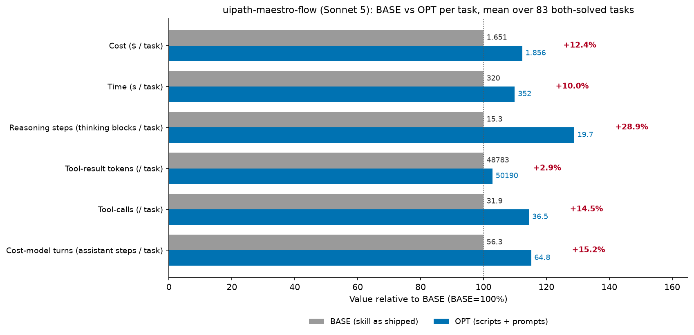

# uipath-maestro-flow skill optimization — cost-reduction report

Cost reduction is measured by **3 cost dimensions** — (1) thinking tokens, (2) tool-result tokens, (3) tool-calls/turns — targeted by **3 optimization techniques**:

- **Scripted skills**: turn deterministic procedures found in the skill files into scripts to cut tool-calls/turns; they also cut thinking (the agent doesn't re-derive an encoded procedure) and, for some scripts, tool-result tokens (output written to a file instead of into context).
- **Thinking budget prompt (RB1, RB2)**: softly curb reasoning to cut thinking tokens.
- **Working style prompt (WS1–WS7)**: 7 bullets, each targeting different cost dimensions.

Scope: the **83 tasks that succeeded in both runs** (OPT `maestro-flow-optimized-sonnet-5-full`, BASE `maestro-flow-baseline-sonnet-5`), n=1 rep per task, so every per-task number is a point estimate. Headline: the optimization **raised** cost by **+$16.95 (+12.4%)** on this set.

## Script Generation of uipath-maestro-flow

Build, edit, publish, run, diagnose, and evaluate UiPath Maestro Flow (`.flow`) projects through the `uip maestro flow` CLI plus direct `.flow` JSON authoring, organized as four capabilities (Author, Operate, Diagnose, Evaluate) with a 28-plugin per-node-type catalog.

**12 out of 34 areas** can be turned into scripts, and the corresponding scripts are: `audit_flow.py` (orchestrator over the five local audits), `check_topology.py`, `audit_expressions.py`, `lint_jint.py`, `check_bindings.py`, `check_runtime_gaps.py`, `flow_edit.py`, `flow_compose.py`, `node_ownership.py`, `validate_mermaid.py`, `encode_parameter_values.py`, `wire_agent_inputs.py`, `diagnose_run.py` (plus the shared `flow_lib.py` helper, which is imported rather than invoked).

Codifiability is taken from `/home/azureuser/projects/skills/tmp/experiments/classification/flow/classification-details-uipath-maestro-flow.md`.

Many of the remaining 22 areas are `uip` CLI calls rather than derivations — scaffold, registry lookup, `node add`/`configure`, `validate`, `format`, `solution upload`, `flow debug`, the `eval` subtree. Those are not script targets; the working-style prompt is what is supposed to compress them, by planning the path up front and chaining independent calls into one turn (WS2) instead of issuing them one per turn.

| # | Area | Codifiable? | Notes |
|---|------|-------------|-------|
| 1 | Capability routing — map a request to Author / Operate / Diagnose / Evaluate | No | Intent classification; no fixed input→output mapping |
| 2 | User-interaction protocol — dropdown + "Something else", consent gates, narration and todo opt-in | No | Conversational policy, not a transform |
| 3 | "Is Maestro the right home?" gate and when-to-plan judgment | No | Requirements judgment |
| 4 | Node selection heuristics (connector → managed HTTP → RPA ladder, branch/transform/wait/human/agent choices) | No | Requires reading intent; ladder input is a live registry search |
| 5 | Topology pattern catalog (linear, branch, parallel+merge, loop, error, orchestration, scheduled, RPA bridge) | No | Design menu, chosen by judgment |
| 6 | Plan document structure (summary, node table, edge table, I/O table, connector summary, open questions) | Marginal | Table emission is mechanical once nodes/edges are decided, but content is generative |
| 7 | **Mermaid plan diagram — syntax + structural validation** | **Yes — VALIDATE/CHECK** | 12 syntax rules, reserved-word list, forbidden-character list, 11-step check procedure |
| 8 | Solution/project scaffold sequence + registration/layout verification | Marginal | Already a single chained `Bash`; the layout check is one `ls` |
| 9 | **Node ownership routing — node type → Edit/Write vs CLI** | **Yes — LOOKUP/REFERENCE-TABLE** | Two closed tables in `author/CAPABILITY.md`; wrong route silently corrupts `bindings[]` |
| 10 | **`.flow` structural mutation primitives (nodes, edges, definitions, variables, layout)** | **Yes — TRANSFORM-PIPELINE** | Fixed multi-array splice with a documented anchor-uniqueness discipline |
| 11 | **Composite graph edits (insert-between, decision branch, remove+reconnect, replace mock/trigger, subflow)** | **Yes — TRANSFORM-PIPELINE** | Each is an ordered `Edit × 3–4` recipe over the same JSON arrays, including the delete cascade |
| 12 | **Port + wiring legality (Standard Port Reference + 12 wiring rules)** | **Yes — VALIDATE/CHECK** | Port names are a closed table; rules are graph invariants |
| 13 | **Expression prefix contract (`=js:` per field/node type, forbidden forms)** | **Yes — DETECT** | Per-field required/forbidden table; `flow validate` covers only part of it |
| 14 | **Jint runtime constraints for script bodies and `=js:` expressions** | **Yes — DETECT** | Explicit supported/not-supported construct lists |
| 15 | Variables system semantics (directions, `globals`/`nodes`/`variableUpdates` schemas, subflow and loop scope) | No | Schema teaching; `variables.nodes[]` regeneration is already `flow format` |
| 16 | **Resource-node top-level `bindings[]` construction + presence audit** | **Yes — BUILD-MODEL/MATRIX** | Two entries per resource node, all fields derived from the registry definition |
| 17 | Connector configuration workflow (connection bind → describe → reference resolution → `--detail`) | No | Live-tenant calls, field selection, and user elicitation |
| 18 | **Connector `customFieldsRequestDetails` key encoding + `parameterValues` tuple shape** | **Yes — COMPUTE/FORMULA** | Fixed longest-first substitution table plus a fixed serialization shape |
| 19 | Connector filter trees / CEQL authoring | No | Query semantics from user intent |
| 20 | **Inline-agent input wiring triple + flatten rule** | **Yes — BUILD-MODEL/MATRIX** | Stated flatten rule and three aligned artifacts derived from one binding list |
| 21 | Inline-agent project lifecycle (`agent init/refresh/validate`, `resource.json`) | No | CLI calls |
| 22 | IxP node semantics (discovery, `fileRef` wiring, output field taxonomy) | No | Model-specific, registry-driven |
| 23 | HITL / trigger / control-flow / pattern node semantics (remaining plugin families) | No | Per-node-type domain knowledge |
| 24 | Error-handling design policy (default-off flag, do-not-swallow matrix) | Marginal | Audit already ships as a copy-paste heredoc in `failure-modes.md` |
| 25 | Ship — `resources refresh` → Studio Web upload vs `pack` + `publish` | No | CLI chain plus a consent decision |
| 26 | Debug run + mandatory reporting contract (Studio Web URL / instance ID first) | No | Consent-gated CLI call |
| 27 | Process run + job status/traces | No | CLI calls |
| 28 | Instance lifecycle (pause / resume / cancel / retry) | No | CLI calls, gated on prior diagnosis |
| 29 | **Diagnostic priority ladder + faulting-element→node correlation** | **Yes — TRANSFORM-PIPELINE** | Fixed 5-step chain where each call's arguments come from the previous call's JSON |
| 30 | **Pre-debug audit of the documented "not caught by `flow validate`" set** | **Yes — DETECT** | The skill enumerates exactly what validate misses |
| 31 | Failure-mode catalog reading (symptom → cause → fix) | Marginal | Lookup table, but symptom matching is fuzzy free text |
| 32 | Evaluate — evaluator types, JSON shapes, custom prompts | No | CLI CRUD + prompt authoring |
| 33 | Evaluate — eval sets, data points, `--criteria`, attachments, simulations | No | CLI CRUD |
| 34 | Evaluate — run start/status/results, compare, failure detection | Marginal | `--only-failed` already implements the failure rules |

## Summary

### Overall Results

Per-task means over the 83 both-solved tasks (n=1 rep each). Every measured dimension moved the wrong way: cost $1.651 → $1.856 (+12.4%), time 320s → 352s (+10.0%), reasoning steps 15.3 → 19.7 blocks (+28.9%), tool-result tokens 48,783 → 50,190 (+2.9%), tool-calls 31.9 → 36.5 (+14.5%), cost-model turns 56.3 → 64.8 (+15.2%).

**Where the $16.95 *increase* comes from** (OPT − BASE; a negative Δ is the only bucket that improved):

| bucket | Δ tokens (sum) | share | cost-model term |
|---|---|---|---|
| thinking (unmeasurable in this dump — see methodology) | +0 | +0.0% | `g·thk` |
| cache-read | +48921338 | +86.6% | `r·(TR+G)·(T−t)` |
| non-thinking output = output − thinking | +287625 | +25.5% | `g·(cl+tc)` |
| cache-create + uncached | -525495 | -12.1% | `w·TR` |

Note: the `Δ tokens` column holds **exact sums over the 83 tasks**, while the chart above reports **per-task means, rounded for display**, so multiplying a rounded chart delta by the 83 tasks will not exactly reproduce these sums. The exact sums and the `$` total (from `total_cost_usd`) are authoritative. Buckets sum to $16.947 = the measured total to the cent; the per-bucket dollar split reconciles to `total_cost_usd` exactly on every `task.json` (max gap $0.000000), so the split is a faithful decomposition, not an estimate.

### Where the cost comes from before optimization — and how OPT cuts it

**BASE is context-driven, not reasoning-driven.** Across the 83 both-solved tasks BASE spends **247.8M cache-read tokens** and **10.1M cache-create tokens** against **1.67M output tokens** and only **10.3k uncached** input tokens. Two orders of magnitude more context is re-read than is generated, because this skill's references are large (`connector/impl.md` 16.8k tokens, `file-format.md` 8.9k, `greenfield.md` 8.8k, `CAPABILITY.md` 7.7k) and a task pulls 4–10 of them into context in the first few turns, after which every later turn pays `r` on the whole pile. BASE's own pathologies add turns on top: to-do ceremony (173 `TaskCreate`/`TaskUpdate` calls), grep fishing through the references (e.g. 12 greps in `interactive-customer-escalation-triage`), scaffold-then-`rm -rf`-then-rescaffold thrash (`bindings-reconfigure-different-connection`), and 136 `validate` + 73 `format` invocations. With 4,673 assistant steps over 2,647 tool calls, the derived split of BASE's $137.07 is **54.2% cache-read + 27.5% cache-create + 0.02% uncached = 81.8% context, against 18.2% generation** — the bill is a context bill, and turns are its multiplier.

**OPT did not cut that; it added to it.** Reference loading barely moved (2.64M → 2.49M tool-result tokens spent on skill references), while assistant steps rose 4,673 → 5,382 (+709) and tool calls 2,647 → 3,031 (+384). Cache-read therefore rose **+48.9M tokens (+19.7%)** — 86.6% of the cost increase — and output rose **+287.6k (+17.3%)**. The one genuine improvement is cache-create: **−623k tokens (−6.2%)**, i.e. the scripts really did keep some bulk output out of context (`audit_flow --json-out`, `registry get > /tmp/def.json`), but that saving (−$2.34) is swamped by the extra re-reads (+$14.68). The mechanism is visible in the dose-response: tasks that never called a bundled script (9 tasks) average **−$0.25**, tasks with 1–3 bundled calls **+$0.13**, and tasks with 15+ bundled calls **+$1.02**. Δturns correlates with Δcost at **r = 0.898**.

Where OPT *did* win, it won by the working-style bullets, not by the scripts:

| Mechanism (what OPT changed) | Term | Examples (Δcost) |
|---|---|---|
| Turn collapse — plan the path, then chain (WS2) instead of exploring turn-by-turn | `r·(TR+G)·(T−t)` | `bindings-reconfigure-different-connection` −$1.67 (97→53 turns); `ipe-ceql-where` −$0.79 (108→77); `merge-parallel-sync` −$0.39 (44→27) |
| Dropped to-do ceremony (WS2/WS7) — 173 → 138 `TaskCreate`/`TaskUpdate` calls overall, 13 → 10 tasks | `g·G` + `r·(TR+G)·(T−t)` | `bellevue-weather-simulated` −$1.47 (12 → 0); `ipe-ceql-where` −$0.79 (12 → 0); `ipe-dtl-load-by-default-false` −$0.25 (13 → 0) |
| Stopped fishing / re-reading (WS4/WS7) | `r·(TR+G)·(T−t)` | `interactive-customer-escalation-triage` −$1.01 (Grep 12→0, turns 60→32); only 2 wins show a Grep drop ≥4, so this mechanism is real but narrow |
| Fewer reasoning steps per task (RB1) — every removed reasoning step is one fewer billed assistant turn | `g·thk` + `r·(TR+G)·(T−t)` | `bindings-reconfigure-different-connection` 30→17 blocks (−$1.67); `ipe-required-groups` 28→18 (−$0.84); `slack-channel-description` 24→16 (−$0.64); `paginated-reference-lookup` 20→13 (−$0.52) |
| Bulk output to a file instead of context (WS6, `audit_flow --json-out`, `registry get > /tmp/*.json`) | `w·TR` + `r·(TR+G)·(T−t)` | `bindings-idempotent-reconfigure` −$0.45 (tool-result 45k→20k, the largest drop in the set, despite turns rising 62→83); `merge-parallel-sync` −$0.39 (29k→12k); `paginated-reference-lookup` −$0.52 (68k→50k) |

**Real vs. noise.** Because each task is a single rep, a dollar difference only counts as an optimization effect when the agent **measurably did something different** on one of the four levers the prompts target: **tool-calls (≥3), cost-model turns (≥3), tool-result tokens (≥5k), or generation/thinking tokens (≥1.5k output)**. Applying that test to the wins: **35 of 35 wins are real ($−12.63); 0 are noise**, though 5 of them sit in a **gray zone** where exactly one lever moved (`transform-group-by` −$0.23, `init-validate` −$0.19, `ipe-path-params` −$0.06, `solution-select-ask` −$0.05, `eval-local-crud` −$0.01, together −$0.53). The median absolute lever movement across the set is 7 tool-calls, 14 turns, 8.6k tool-result and 4.2k output tokens, so essentially every task in this comparison changed behavior materially — this is a set of long tasks (BASE mean 32 calls / 56 turns per task), not a set of coin-flips. Under a stricter relative test (any lever moving ≥10% of its BASE value) 82 of 83 tasks still qualify; the single marginal task is `ipe-path-params` (Δ$−0.06). Note that thinking tokens themselves cannot be measured in this dump (see methodology), so the reasoning lever is judged by **thinking-block count** and total output tokens; single-burst reasoning changes are therefore gray-zone and would need replication.

### Why cost increases in some tasks

**48 of 83 tasks cost more (+$29.58), and all 48 are attributable rather than noise** by the four-lever test — 2 of them only marginally (`decision` +$0.02, moved output +1.9k only; `registry-discovery` +$0.04, moved turns +6 only), so those two are gray zone rather than firm effects. The regressions are concentrated: the **30 tasks in which the agent inspected the shipped scripts** (`--help` ×39, `scripts/*.py` source read ×76, 48.8k tool-result tokens of script source) carry **+$17.47** — more than the entire net regression — while the other 53 tasks net **−$0.52**.

| Mechanism (what OPT changed) | Term | Examples (Δcost) |
|---|---|---|
| Script-discovery overhead — WS1 "understand the scripts before you act" turned into `--help` calls and paging `flow_edit.py` / `flow_lib.py` / `audit_expressions.py` source, then re-deriving the rules anyway | `w·TR` + `r·(TR+G)·(T−t)` + `g·G` | `feet-inches` +$0.98 (2 `--help`, 5.4k of source); `remove-node` +$1.00 (paged `audit_expressions.py`, never called a mutation script); `ixp-scaffold-minimal` +$0.74 |
| Script granularity — `flow_edit.py` is one mutation per invocation, so an N-node flow costs N turns where BASE used 2–7 batched `Edit`s | `r·(TR+G)·(T−t)` | `devcon-billing-dispute-resolution` +$1.36 (`flow_edit` ×104 vs BASE's one self-written `build_flow.py`); `devcon-billing-invoice-lookup` +$2.95 (×26 vs 7 Edits); `multi-city-weather` +$1.26 (×16 vs 7 Edits) |
| Reasoning-budget backfire — RB1/RB2 did not reduce reasoning frequency; thinking blocks rose 1,268 → 1,634 (+28.9%), and each extra reasoning step is another assistant turn billed a full context re-read | `g·thk` + `r·(TR+G)·(T−t)` | 22 tasks with ≥+8 thinking blocks carry **+$22.91**: `devcon-billing-invoice-lookup` 24→63; `e2e-escalation-orchestrator-paths` 19→48; `devcon-billing-discrepancy-detector` 25→58 |
| Ceremony re-introduced instead of removed (WS2/WS7 not firing) | `g·G` | `e2e-escalation-orchestrator-paths` +$2.18 (0 → 16 to-do calls); `devcon-billing-discrepancy-detector` +$3.13 (103→149 turns) |

**Real vs. noise (regressions).** By the same four-lever test: **48 of 48 regressions are real (+$29.58); 0 are noise**. Across all 83 tasks: **83 real / 0 noise** under the absolute test, and 82/83 under the stricter ≥10%-of-BASE relative test. The residual gray zone — the **7 tasks where exactly one lever moved** — nets **−$0.48** and is near-symmetric (+$0.05 across 2 tasks, −$0.53 across 5), i.e. ~3% of the headline in the *opposite* direction, so it cannot explain the regression. The direction is what matters here — this optimization is a net regression on this skill, and the attribution says why: the script set traded a small `w·TR` saving for a large `r·(TR+G)·(T−t)` cost by adding turns.

Remediation targets implied by the regressions: (1) **batch the mutation script** — replace per-node/per-edge `flow_edit` invocations with one call that applies a whole node/edge/variable plan from a single JSON file, so an N-node flow costs one turn, not N; (2) **make the scripts self-describing in SKILL.md** so WS1 is satisfied without `--help` calls or source paging (the 30 inspection tasks are the whole regression); (3) **stop shipping a script whose job the agent still has to re-derive** — `remove-node` paged `audit_expressions.py` and then hand-edited anyway; (4) revisit RB1/RB2 wording, which increased reasoning-step count by 29% instead of curbing it.

### How Are results Collected

All numbers come from `<run>/default/<task>/<rep>/task.json`, computed by `extract.py` / `features.py` in this directory (`rows.json`, `features.json` hold the per-task rows).

- **thinking tokens** — Σ `output_tokens` over `iterations[].messages[]` where the message's `content_blocks` block-types are exactly `{"thinking"}`. In this dump every thinking block is **redacted** and carries no tokens, e.g. `{"block_type": "thinking", "text": null, "thinking": null, "signature": "EpYCCnIIEBABGAIqQ…"}` with `"output_tokens": 0` and `"reasoning_tokens": 0`; the sum is therefore **0 in both arms** (BASE 14 thinking messages carry any tokens at all) and message-level `output_tokens` already sums to within 12k of `total_token_usage.output_tokens`. Thinking cost is consequently **not separable** here: this report uses **thinking-block count** (BASE 1,268 → OPT 1,634) as the reasoning-frequency proxy and total `output_tokens` as the generation lever.
- **tool-result tokens** — Σ `result_tokens` over `iterations[].commands[]`, e.g. `{"tool_name": "Read", "result_tokens": "7913"}`.
- **tool-calls** — `len(iterations[].commands[])`. A **script invocation** is a `commands[]` entry with `tool_name == "Bash"` whose `parameters.command` matches `python3 …/<script>.py`; a `Read`/`cat`/`sed` of the script source does **not** count (those are tallied separately as script-source reads). Counted per script: `flow_edit` 373, `audit_flow` 139, `wire_agent_inputs` 10, `node_ownership` 4, `encode_parameter_values` 3, `flow_compose` 1 in OPT; the agent's own scripts (`find_channel`, `paginate_drive`, `paginate_slack_channels`) are tracked apart from the bundled ones.
- **cost-model turns T** — count of assistant messages in `iterations[].messages[]` (each is one billed step: think → call tools → observe). Reported as "cost-model turns"; the number of tool-calling messages equals the tool-call count in both arms (no batching was observed in either run), which is why the two rows move together.
- **cost / cache buckets** — `total_token_usage.total_cost_usd`, `.cache_read_input_tokens`, `.cache_creation_input_tokens`, `.output_tokens`, `.uncached_input_tokens`, e.g. `{"uncached_input_tokens": 507, "output_tokens": 8236, "cache_creation_input_tokens": 69123, "cache_read_input_tokens": 836307, "total_cost_usd": 0.63516435}`.
- **time** — `duration_seconds`; **task instruction** — `task_description`; **ordered action trace** — `iterations[].commands[]` walked in order.
Bucket **token counts are read directly**; `total_cost_usd` is the only dollar figure stored, so per-bucket dollars are derived as tokens × rate (output $15/M, cache-read $0.30/M, cache-create $3.75/M, uncached $3/M). Reconciliation was verified on **every** `task.json` in both runs: max |derived − `total_cost_usd`| = **$0.000000**.

Scope: tasks with ≥1 `final_status == "SUCCESS"` rep in **both** runs → 83 tasks; only successful reps are used. Every both-solved task has **n=1** successful rep in each arm, so no repeat-aggregation or outlier exclusion was needed (0 reps excluded) and all per-task figures are point estimates. For completeness outside the scope: BASE produced 92 successes vs OPT 84 — 9 tasks solved only by BASE (`bindings-no-duplicates`, `file-attachment-debug`, `group-to-subflow`, `ipe-jira-lifecycle`, `ipe-searchable-joins`, `ixp-e2e-invoice-extraction-greenfield`, `move-node`, `scheduled-trigger`, `wiki-pageviews`) against 1 solved only by OPT (`customer-escalation`), so the cost regression comes with a success-rate regression.

## Case Analysis

## Reference

### Per Task Table

Script usage & benefit: **74 of 83** tasks invoked a bundled script; of those **26 got cheaper, 1 flat, 47 more expensive**. The 9 tasks that invoked no bundled script net **−$2.21**. A bundled script (per-mutation `flow_edit`, or the `--help`/source-reading detour needed to use one) is the **dominant driver in 21 regressions**. Δthinking column reports **thinking-block count** and the $ of the Δ**output** tokens, because thinking tokens are 0/unrecoverable in this dump (see methodology).

| # | task | Δcost | Δthinking blk (Δoutput $) | Δtool-result tok | Δtool-calls | Δtime | scripts fe/af/other | attribution (ranked) |
|---|---|---|---|---|---|---|---|---|
| 1 | bindings-reconfigure-different-connection | $3.20→$1.53 (-52%) | -13 (-0.415) | -19116 | -22 | 579s→278s (-52%) | 0/0/0 | turn collapse (WS2 chain / WS7 skip-unneeded); fewer reasoning steps (RB1, -13 thinking blocks); less tool-result in context (WS3/WS6) |
| 2 | bellevue-weather-simulated | $3.26→$1.79 (-45%) | -10 (-0.076) | -9630 | -24 | 552s→541s (-2%) | 9/2/0 | turn collapse (WS2 chain / WS7 skip-unneeded); dropped to-do ceremony (WS2/WS7, −12 TaskCreate/Update); fewer reasoning steps (RB1, -10 thinking blocks) |
| 3 | interactive-customer-escalation-triage | $2.00→$0.99 (-51%) | -11 (-0.401) | -11756 | -16 | 601s→289s (-52%) | 0/1/0 | turn collapse (WS2 chain / WS7 skip-unneeded); stopped fishing (WS4/WS7, Grep 12→0); fewer reasoning steps (RB1, -11 thinking blocks) |
| 4 | ipe-required-groups | $2.43→$1.59 (-35%) | -10 (-0.235) | -34 | -5 | 615s→319s (-48%) | 0/2/0 | turn collapse (WS2 chain / WS7 skip-unneeded); fewer reasoning steps (RB1, -10 thinking blocks); bundled script replaced manual steps |
| 5 | ipe-ceql-where | $3.13→$2.34 (-25%) | -2 (-0.069) | -14646 | -25 | 521s→438s (-16%) | 5/2/0 | turn collapse (WS2 chain / WS7 skip-unneeded); dropped to-do ceremony (WS2/WS7, −12 TaskCreate/Update); less tool-result in context (WS3/WS6) |
| 6 | slack-channel-description | $2.19→$1.54 (-29%) | -8 (-0.065) | -10905 | -9 | 349s→246s (-29%) | 0/1/0 | turn collapse (WS2 chain / WS7 skip-unneeded); fewer reasoning steps (RB1, -8 thinking blocks); less tool-result in context (WS3/WS6) |
| 7 | jdbc-databricks-query | $2.22→$1.58 (-29%) | -5 (-0.049) | +50 | -3 | 448s→298s (-33%) | 0/1/0 | turn collapse (WS2 chain / WS7 skip-unneeded); fewer reasoning steps (RB1, -5 thinking blocks); bundled script replaced manual steps |
| 8 | cli-dice-roller-simulated | $1.56→$0.95 (-39%) | +1 (+0.018) | -11252 | -5 | 255s→249s (-2%) | 0/2/0 | less tool-result in context (WS3/WS6); bundled script replaced manual steps |
| 9 | paginated-reference-lookup | $1.67→$1.15 (-31%) | -7 (-0.017) | -17448 | -5 | 225s→178s (-21%) | 0/1/0 | turn collapse (WS2 chain / WS7 skip-unneeded); fewer reasoning steps (RB1, -7 thinking blocks); less tool-result in context (WS3/WS6) |
| 10 | bindings-idempotent-reconfigure | $1.86→$1.41 (-24%) | -1 (-0.073) | -25113 | +16 | 424s→302s (-29%) | 7/0/0 | less tool-result in context (WS3/WS6) |
| 11 | customer-escalation-simulated | $5.46→$5.06 (-7%) | +6 (+0.404) | +3346 | -5 | 626s→905s (+45%) | 15/3/0 | turn collapse (WS2 chain / WS7 skip-unneeded); bundled script replaced manual steps |
| 12 | merge-parallel-sync | $0.89→$0.50 (-43%) | -4 (-0.083) | -17374 | -12 | 160s→85s (-47%) | 3/1/0 | turn collapse (WS2 chain / WS7 skip-unneeded); less tool-result in context (WS3/WS6); bundled script replaced manual steps |
| 13 | webhook-waitfor-parallel | $1.78→$1.41 (-21%) | +1 (-0.013) | -7492 | -7 | 259s→238s (-8%) | 0/2/0 | turn collapse (WS2 chain / WS7 skip-unneeded); less tool-result in context (WS3/WS6); bundled script replaced manual steps |
| 14 | slack-http-fallback | $2.07→$1.74 (-16%) | -2 (+0.010) | +8826 | -6 | 394s→301s (-24%) | 0/1/0 | turn collapse (WS2 chain / WS7 skip-unneeded); bundled script replaced manual steps |
| 15 | ipe-query-params | $1.17→$0.90 (-23%) | -7 (-0.055) | -2703 | -5 | 215s→163s (-24%) | 0/1/0 | turn collapse (WS2 chain / WS7 skip-unneeded); fewer reasoning steps (RB1, -7 thinking blocks); bundled script replaced manual steps |
| 16 | ipe-dtl-load-by-default-false | $2.39→$2.14 (-10%) | -2 (-0.088) | +211 | -20 | 502s→710s (+41%) | 0/2/0 | turn collapse (WS2 chain / WS7 skip-unneeded); dropped to-do ceremony (WS2/WS7, −13 TaskCreate/Update); bundled script replaced manual steps |
| 17 | rpa | $1.51→$1.27 (-16%) | -6 (-0.049) | +20278 | -10 | 371s→301s (-19%) | 0/2/0 | turn collapse (WS2 chain / WS7 skip-unneeded); fewer reasoning steps (RB1, -6 thinking blocks); bundled script replaced manual steps |
| 18 | lowcode-agent | $1.06→$0.83 (-22%) | -1 (+0.069) | -10675 | -6 | 225s→295s (+31%) | 0/2/0 | turn collapse (WS2 chain / WS7 skip-unneeded); less tool-result in context (WS3/WS6); bundled script replaced manual steps |
| 19 | transform-group-by | $1.04→$0.81 (-22%) | +2 (-0.031) | +1580 | -1 | 200s→140s (-30%) | 0/2/0 | bundled script replaced manual steps |
| 20 | summarize | $0.80→$0.60 (-25%) | +0 (-0.033) | -5635 | +0 | 132s→119s (-10%) | 0/2/0 | less tool-result in context (WS3/WS6) |
| 21 | init-validate | $0.36→$0.18 (-52%) | +1 (-0.003) | -101 | -1 | 67s→36s (-47%) | 0/0/0 | gray zone: only turns moved, single rep |
| 22 | eval-simulation-crud | $0.67→$0.49 (-27%) | -4 (-0.008) | -364 | -4 | 153s→99s (-35%) | 0/0/0 | turn collapse (WS2 chain / WS7 skip-unneeded) |
| 23 | transform-filter | $0.94→$0.81 (-14%) | +1 (-0.045) | -11151 | +1 | 181s→153s (-16%) | 0/2/0 | less tool-result in context (WS3/WS6) |
| 24 | hitl-schema-design-simulated | $1.95→$1.82 (-7%) | +0 (-0.110) | +11265 | +0 | 666s→526s (-21%) | 0/1/0 | gray zone: only tool_result_tokens, output moved, single rep |
| 25 | terminate | $1.42→$1.34 (-5%) | +5 (-0.003) | -10180 | +9 | 295s→282s (-4%) | 14/2/0 | stopped fishing (WS4/WS7, Grep 4→0); less tool-result in context (WS3/WS6) |
| 26 | trigger-with-filter | $0.46→$0.39 (-15%) | -4 (-0.010) | +6845 | -1 | 69s→52s (-25%) | 0/0/0 | gray zone: only turns, tool_result_tokens moved, single rep |
| 27 | ipe-path-params | $1.52→$1.46 (-4%) | +5 (-0.017) | -3857 | +2 | 242s→207s (-14%) | 0/1/0 | gray zone: only turns moved, single rep |
| 28 | ipe-complex-array | $1.21→$1.15 (-5%) | -4 (+0.033) | -6164 | -2 | 191s→163s (-15%) | 0/1/0 | less tool-result in context (WS3/WS6); bundled script replaced manual steps |
| 29 | eval-evaluator-type-choice | $0.55→$0.49 (-10%) | +0 (-0.006) | +9125 | +0 | 136s→85s (-37%) | 0/0/0 | gray zone: only turns, tool_result_tokens moved, single rep |
| 30 | solution-select-ask | $0.26→$0.21 (-18%) | +2 (+0.003) | -65 | -1 | 92s→84s (-9%) | 0/0/0 | gray zone: only turns moved, single rep |
| 31 | hitl-smoke-node-placed | $1.93→$1.88 (-2%) | -11 (+0.313) | +9210 | -5 | 360s→500s (+39%) | 5/2/0 | turn collapse (WS2 chain / WS7 skip-unneeded); fewer reasoning steps (RB1, -11 thinking blocks); bundled script replaced manual steps |
| 32 | eval-no-auto-upload | $0.57→$0.53 (-6%) | -2 (-0.005) | -7291 | +5 | 99s→93s (-5%) | 0/0/0 | less tool-result in context (WS3/WS6) |
| 33 | hitl-quality-brownfield-insert | $1.48→$1.45 (-2%) | +6 (+0.039) | -2354 | +7 | 310s→295s (-5%) | 10/2/1 | gray zone: only tool_calls, turns, output moved, single rep |
| 34 | eval-local-crud | $0.49→$0.48 (-2%) | +3 (+0.046) | +968 | +2 | 93s→111s (+20%) | 0/0/0 | gray zone: only output moved, single rep |
| 35 | subflow | $0.93→$0.93 (-0%) | +3 (+0.061) | -2427 | +5 | 174s→188s (+8%) | 0/2/0 | gray zone: only tool_calls, turns, output moved, single rep |
| 36 | hitl-quality-result-downstream | $1.38→$1.39 (+1%) | -4 (-0.001) | +12537 | +3 | 321s→295s (-8%) | 0/2/0 | more tool-result into context (`w·TR`) |
| 37 | decision | $0.87→$0.89 (+2%) | -1 (+0.028) | +2987 | +0 | 182s→167s (-8%) | 0/1/0 | gray zone: only output moved, single rep |
| 38 | generic-dynamic-node | $1.67→$1.69 (+1%) | +13 (+0.071) | -17881 | +19 | 233s→332s (+43%) | 9/2/1 | script-discovery overhead (WS1 backfire: `--help` ×2, script source read ×4); script granularity: `flow_edit` ×9 (one call per mutation); more reasoning steps (RB1/RB2 backfire, +13 thinking blocks) |
| 39 | dice-roller | $0.60→$0.63 (+4%) | +2 (+0.004) | +2311 | +4 | 102s→126s (+23%) | 0/2/0 | gray zone: only tool_calls, turns moved, single rep |
| 40 | registry-discovery | $0.25→$0.28 (+15%) | +4 (+0.013) | -1333 | +2 | 78s→67s (-14%) | 0/0/0 | gray zone: only turns moved, single rep |
| 41 | add-node | $0.56→$0.64 (+14%) | +1 (+0.037) | +379 | +3 | 106s→127s (+20%) | 0/1/0 | gray zone: only tool_calls, turns, output moved, single rep |
| 42 | update-node | $0.44→$0.52 (+19%) | +3 (+0.018) | +981 | +3 | 68s→108s (+58%) | 0/2/0 | gray zone: only tool_calls, turns moved, single rep |
| 43 | reading-list | $1.43→$1.51 (+6%) | +3 (-0.025) | +1364 | +6 | 387s→287s (-26%) | 0/3/0 | gray zone: only tool_calls, turns, output moved, single rep |
| 44 | transform-map | $0.81→$0.92 (+14%) | +0 (+0.024) | -7396 | +6 | 142s→149s (+5%) | 0/2/0 | turn inflation → cache-read (`r·(TR+G)·(T−t)`) |
| 45 | add-output | $0.38→$0.51 (+36%) | +5 (+0.038) | +947 | +4 | 71s→129s (+82%) | 0/2/0 | gray zone: only tool_calls, turns, output moved, single rep |
| 46 | batch-transform | $0.83→$0.98 (+18%) | +1 (+0.024) | -13403 | +10 | 150s→181s (+21%) | 0/2/0 | turn inflation → cache-read (`r·(TR+G)·(T−t)`) |
| 47 | calculator | $0.91→$1.09 (+19%) | -1 (+0.015) | +12124 | +2 | 146s→155s (+6%) | 0/3/0 | more tool-result into context (`w·TR`) |
| 48 | e2e-devcon-expense-approval | $2.26→$2.47 (+9%) | +11 (+0.063) | -4194 | +11 | 519s→565s (+9%) | 0/2/0 | more reasoning steps (RB1/RB2 backfire, +11 thinking blocks); turn inflation → cache-read (`r·(TR+G)·(T−t)`) |
| 49 | bindings-multi-connector-independence | $2.26→$2.48 (+10%) | +4 (+0.041) | -13777 | +4 | 388s→371s (-4%) | 0/1/0 | turn inflation → cache-read (`r·(TR+G)·(T−t)`) |
| 50 | outlook-trigger-inbox | $1.46→$1.71 (+17%) | +0 (+0.078) | +4025 | +8 | 217s→240s (+10%) | 0/2/0 | turn inflation → cache-read (`r·(TR+G)·(T−t)`) |
| 51 | inline-agent-robust | $1.75→$1.99 (+14%) | +13 (-0.055) | -18655 | +14 | 280s→338s (+21%) | 20/2/4 | script-discovery overhead (WS1 backfire: `--help` ×3, script source read ×3); script granularity: `flow_edit` ×20 (one call per mutation); more reasoning steps (RB1/RB2 backfire, +13 thinking blocks) |
| 52 | slack-channel-description-simulated | $1.39→$1.64 (+18%) | +2 (+0.089) | +17680 | +8 | 251s→314s (+25%) | 0/2/0 | more tool-result into context (`w·TR`) |
| 53 | e2e-escalation-slack-alert | $3.06→$3.32 (+9%) | -2 (-0.020) | +11754 | +7 | 520s→461s (-11%) | 0/3/0 | script-discovery overhead (WS1 backfire: script source read ×5); more tool-result into context (`w·TR`) |
| 54 | hitl-smoke-multi-outcome-routing | $1.70→$1.98 (+16%) | +4 (+0.094) | +8643 | +7 | 379s→445s (+17%) | 5/2/0 | script-discovery overhead (WS1 backfire: `--help` ×3, script source read ×1); turn inflation → cache-read (`r·(TR+G)·(T−t)`); more tool-result into context (`w·TR`) |
| 55 | openmeteo-weather | $1.18→$1.49 (+26%) | +7 (+0.055) | -1859 | +9 | 180s→235s (+30%) | 0/2/0 | turn inflation → cache-read (`r·(TR+G)·(T−t)`) |
| 56 | hitl-quality-boolean-decision | $1.28→$1.61 (+26%) | +3 (+0.114) | +10613 | +7 | 256s→337s (+32%) | 0/2/0 | turn inflation → cache-read (`r·(TR+G)·(T−t)`); more tool-result into context (`w·TR`) |
| 57 | ixp-integration-handle-routing | $2.94→$3.30 (+12%) | +5 (+0.207) | +47934 | +4 | 626s→690s (+10%) | 23/2/0 | script-discovery overhead (WS1 backfire: `--help` ×2, script source read ×1); script granularity: `flow_edit` ×23 (one call per mutation); more tool-result into context (`w·TR`) |
| 58 | ipe-jira-create-issue | $1.63→$1.99 (+23%) | +7 (+0.086) | +13025 | +6 | 256s→284s (+11%) | 0/2/1 | more tool-result into context (`w·TR`) |
| 59 | outlook-waitfor-email | $1.02→$1.40 (+37%) | +8 (+0.059) | +3259 | +8 | 173s→211s (+22%) | 0/2/0 | script-discovery overhead (WS1 backfire: script source read ×1); more reasoning steps (RB1/RB2 backfire, +8 thinking blocks); turn inflation → cache-read (`r·(TR+G)·(T−t)`) |
| 60 | bellevue-weather | $1.27→$1.67 (+32%) | +10 (-0.059) | -3790 | +9 | 316s→314s (-1%) | 17/2/0 | script-discovery overhead (WS1 backfire: `--help` ×1, script source read ×2); script granularity: `flow_edit` ×17 (one call per mutation); more reasoning steps (RB1/RB2 backfire, +10 thinking blocks) |
| 61 | delay | $0.60→$1.01 (+69%) | +10 (+0.073) | +12474 | +11 | 103s→165s (+59%) | 0/3/0 | script-discovery overhead (WS1 backfire: script source read ×3); more reasoning steps (RB1/RB2 backfire, +10 thinking blocks); turn inflation → cache-read (`r·(TR+G)·(T−t)`) |
| 62 | expense-approval-simulated | $1.43→$1.88 (+32%) | +6 (+0.235) | +2228 | +9 | 379s→506s (+33%) | 0/2/0 | turn inflation → cache-read (`r·(TR+G)·(T−t)`) |
| 63 | ipe-drive-to-slack | $1.98→$2.44 (+23%) | +6 (-0.020) | +11064 | +5 | 451s→399s (-12%) | 0/2/0 | turn inflation → cache-read (`r·(TR+G)·(T−t)`); more tool-result into context (`w·TR`) |
| 64 | hitl-smoke-completed-port | $1.13→$1.60 (+42%) | +5 (+0.220) | +1374 | +6 | 253s→398s (+58%) | 0/2/0 | turn inflation → cache-read (`r·(TR+G)·(T−t)`) |
| 65 | ipe-jira-get-issue | $1.95→$2.43 (+24%) | +5 (+0.238) | +20568 | -4 | 309s→422s (+36%) | 0/2/1 | more tool-result into context (`w·TR`) |
| 66 | hitl-quality-schema-design | $1.19→$1.82 (+53%) | +10 (+0.267) | +4004 | +15 | 303s→486s (+61%) | 0/2/0 | more reasoning steps (RB1/RB2 backfire, +10 thinking blocks); turn inflation → cache-read (`r·(TR+G)·(T−t)`) |
| 67 | switch | $1.00→$1.64 (+64%) | +7 (+0.088) | +7862 | +12 | 227s→287s (+26%) | 0/4/0 | turn inflation → cache-read (`r·(TR+G)·(T−t)`); more tool-result into context (`w·TR`) |
| 68 | eval-inline-agent | $2.09→$2.74 (+31%) | +5 (+0.071) | +20150 | +10 | 315s→348s (+11%) | 0/2/1 | script-discovery overhead (WS1 backfire: script source read ×1); turn inflation → cache-read (`r·(TR+G)·(T−t)`); more tool-result into context (`w·TR`) |
| 69 | ipe-generate-schema | $1.39→$2.11 (+52%) | +13 (+0.092) | +5417 | +15 | 192s→260s (+35%) | 0/1/1 | more reasoning steps (RB1/RB2 backfire, +13 thinking blocks); turn inflation → cache-read (`r·(TR+G)·(T−t)`); more tool-result into context (`w·TR`) |
| 70 | ipe-enhanced-enum | $1.65→$2.37 (+44%) | +10 (+0.077) | +2454 | +24 | 422s→407s (-4%) | 0/2/0 | more reasoning steps (RB1/RB2 backfire, +10 thinking blocks); turn inflation → cache-read (`r·(TR+G)·(T−t)`) |
| 71 | ipe-jira-search-triage | $2.09→$2.83 (+35%) | +12 (+0.097) | -8886 | +3 | 414s→533s (+29%) | 7/2/0 | script-discovery overhead (WS1 backfire: script source read ×2); more reasoning steps (RB1/RB2 backfire, +12 thinking blocks); turn inflation → cache-read (`r·(TR+G)·(T−t)`) |
| 72 | ixp-scaffold-minimal | $1.31→$2.05 (+57%) | +12 (+0.123) | -20810 | +21 | 218s→347s (+59%) | 12/2/0 | script-discovery overhead (WS1 backfire: `--help` ×2, script source read ×2); script granularity: `flow_edit` ×12 (one call per mutation); more reasoning steps (RB1/RB2 backfire, +12 thinking blocks) |
| 73 | non-catalog-http-fallback | $0.96→$1.70 (+78%) | +13 (+0.148) | +17050 | +20 | 163s→279s (+71%) | 0/1/0 | more reasoning steps (RB1/RB2 backfire, +13 thinking blocks); turn inflation → cache-read (`r·(TR+G)·(T−t)`); more tool-result into context (`w·TR`) |
| 74 | devcon-billing-resolution-writer | $2.07→$2.84 (+37%) | +12 (+0.041) | +7375 | +20 | 403s→469s (+16%) | 5/1/1 | script-discovery overhead (WS1 backfire: `--help` ×2, script source read ×2); more reasoning steps (RB1/RB2 backfire, +12 thinking blocks); turn inflation → cache-read (`r·(TR+G)·(T−t)`) |
| 75 | feet-inches | $1.09→$2.07 (+90%) | +16 (+0.265) | +17119 | +24 | 233s→457s (+96%) | 25/2/0 | script-discovery overhead (WS1 backfire: `--help` ×2); script granularity: `flow_edit` ×25 (one call per mutation); more reasoning steps (RB1/RB2 backfire, +16 thinking blocks) |
| 76 | remove-node | $0.82→$1.82 (+123%) | +14 (+0.231) | +9608 | +26 | 189s→371s (+96%) | 0/2/0 | script-discovery overhead (WS1 backfire: script source read ×2); more reasoning steps (RB1/RB2 backfire, +14 thinking blocks); turn inflation → cache-read (`r·(TR+G)·(T−t)`) |
| 77 | ipe-enum | $1.89→$2.99 (+58%) | +15 (+0.438) | +547 | +6 | 366s→692s (+89%) | 0/2/0 | script-discovery overhead (WS1 backfire: script source read ×5); more reasoning steps (RB1/RB2 backfire, +15 thinking blocks); turn inflation → cache-read (`r·(TR+G)·(T−t)`) |
| 78 | multi-city-weather | $1.29→$2.56 (+98%) | +16 (+0.250) | +17019 | +17 | 403s→626s (+55%) | 16/2/0 | script-discovery overhead (WS1 backfire: `--help` ×2, script source read ×1); script granularity: `flow_edit` ×16 (one call per mutation); more reasoning steps (RB1/RB2 backfire, +16 thinking blocks) |
| 79 | devcon-billing-dispute-resolution | $10.94→$12.30 (+12%) | +32 (-0.526) | +15506 | +12 | 2052s→1835s (-11%) | 104/3/6 | script-discovery overhead (WS1 backfire: `--help` ×3, script source read ×17); script granularity: `flow_edit` ×104 (one call per mutation); more reasoning steps (RB1/RB2 backfire, +32 thinking blocks) |
| 80 | e2e-escalation-orchestrator-paths | $2.52→$4.69 (+86%) | +29 (+0.417) | +1239 | +37 | 549s→913s (+66%) | 7/3/0 | script-discovery overhead (WS1 backfire: `--help` ×1, script source read ×6); more reasoning steps (RB1/RB2 backfire, +29 thinking blocks); turn inflation → cache-read (`r·(TR+G)·(T−t)`) |
| 81 | devcon-billing-dispute-analyst | $2.31→$4.52 (+96%) | +26 (+0.535) | +12811 | +29 | 392s→823s (+110%) | 0/2/0 | script-discovery overhead (WS1 backfire: script source read ×11); more reasoning steps (RB1/RB2 backfire, +26 thinking blocks); turn inflation → cache-read (`r·(TR+G)·(T−t)`) |
| 82 | devcon-billing-invoice-lookup | $2.77→$5.72 (+106%) | +39 (+0.365) | +4560 | +41 | 551s→929s (+69%) | 26/2/0 | script-discovery overhead (WS1 backfire: `--help` ×2); script granularity: `flow_edit` ×26 (one call per mutation); more reasoning steps (RB1/RB2 backfire, +39 thinking blocks) |
| 83 | devcon-billing-discrepancy-detector | $2.90→$6.04 (+108%) | +33 (+0.556) | +23793 | +14 | 579s→1092s (+89%) | 29/2/1 | script-discovery overhead (WS1 backfire: `--help` ×2); script granularity: `flow_edit` ×29 (one call per mutation); more reasoning steps (RB1/RB2 backfire, +33 thinking blocks) |

### Per Task Behavior

**bindings-reconfigure-different-connection** (-52%, turn collapse (WS2 chain / WS7 skip-unneeded))
- Task: When the same connector node is reconfigured against a different connection, the resulting .flow must reference ONLY the new connection — no stale bindings from the previous configure should remain, and no empty-keyed stubs should be left behind. This exercises the fallback-by-(name, resource) path of `upsertConnectionResourceBinding` against a non-empty-keyed row. See https://github.com/UiPath/cl
- Before (BASE): Read `CAPABILITY.md` + `greenfield.md`, then thrashed: scaffolded the solution, `rm -rf`'d it, re-scaffolded under a second name, read the task YAML and the grader's `check_bindings.py`, hunted `flow_files` layout by grep — 48 calls / 97 turns / 30 reasoning steps before the 3 binding Edits.
- After (OPT): Pulled the connection list first, read one reference (`greenfield.md`), grepped once for the `project.uiproj` layout, scaffolded once, configured the connector, then 3 Edits — 26 calls / 53 turns / 17 reasoning steps. No bundled script.
- **Why cheaper:** Turns fell 97→53 and calls 48→26, so the whole context is re-read 44 fewer times: cache-read carries the `r·(TR+G)·(T−t)` saving. Output tokens fell 43k→15k as well. This is a pure working-style win (WS2 plan-then-chain, WS7 skip-unneeded) with no script involvement.

**bellevue-weather-simulated** (-45%, turn collapse (WS2 chain / WS7 skip-unneeded))
- Task: Bellevue weather flow (HTTP → script → decision), but driven by a simulated non-technical user who withholds requirements until asked. Tests the agent's ability to clarify an ambiguous ask before building.
- Before (BASE): Ran a 12-call to-do ceremony (`TaskCreate`×5, `TaskUpdate`×7) around the build, `sed`-paged 250 lines of connector reference, 9 Edits, 65 calls / 127 turns / 33 reasoning steps.
- After (OPT): No to-do calls at all; read three references once, then `flow_edit` ×9 for the nodes/edges and `audit_flow` ×2 — 41 calls / 72 turns / 23 reasoning steps.
- **Why cheaper:** Dropping the to-do ceremony and the re-paged reference removed 24 calls and 55 turns; cache-read shrinks with `(T−t)`. The bundled scripts did not reduce the call count here (9 mutation calls ≈ the 9 BASE Edits) — the saving is WS2/WS7 turn collapse.

**interactive-customer-escalation-triage** (-51%, turn collapse (WS2 chain / WS7 skip-unneeded))
- Task: Interactive end-to-end Flow evaluation. A simulated support-operations expert asks for a customer-escalation triage flow but withholds the company's severity, engineering-handoff, and acknowledgement policies until the coding agent asks relevant follow-up questions. The resulting flow must validate and produce the correct business outputs for independently seeded Sev1 and Sev3 cases when the grade
- Before (BASE): Fished through the skill with `Grep`×12 plus 9 reference `Read`s, 32 calls / 60 turns / 21 reasoning steps, 46k output tokens.
- After (OPT): Zero greps, 6 reference reads, one `audit_flow` call, 16 calls / 32 turns / 10 reasoning steps, 19k output.
- **Why cheaper:** The grep fishing and half the reasoning steps disappeared (WS4 don't-repeat, WS7 don't-do-unnecessary): −16 calls, −28 turns, −12k tool-result, −27k output. Both `g·G` and `r·(TR+G)·(T−t)` fall.

**ipe-required-groups** (-35%, turn collapse (WS2 chain / WS7 skip-unneeded))
- Task: Tests the required groups IS feature — configures a connector node where at least one field from each required group must be populated on the Teams connector.
- Before (BASE): Read×8, Bash×26, Edit×3; 38 calls / 74 turns / 28 reasoning steps; 57k tool-result.
- After (OPT): Read×6, Bash×21, Edit×4, Write×1; 33 calls / 58 turns / 18 reasoning steps; 57k tool-result. Bundled scripts: `audit_flow`×2.
- **Why cheaper:** Cost fell. Δcalls -5, Δturns -16, Δoutput tok -15648. 16 fewer assistant turns means 16 fewer full-context re-reads (`r·(TR+G)·(T−t)`), plus lower generation (`g·G`).

**ipe-ceql-where** (-25%, turn collapse (WS2 chain / WS7 skip-unneeded))
- Task: Tests the CEQL where query IS feature — agent plans a structured filter tree for the Microsoft Entra (Azure AD) connector's "List groups" operation with a `displayName = "active"` filter, following the canonical shape documented in the Filter Trees (CEQL) section of the uipath-platform skill. The flow must reference the registered connector key (`uipath-microsoft-azureactivedirectory`), use Decisi
- Before (BASE): Read×14, Bash×31, Edit×5, Write×1, todo×12; 64 calls / 108 turns / 26 reasoning steps; 82k tool-result.
- After (OPT): Read×7, Bash×28, Write×1, Grep×2; 39 calls / 77 turns / 24 reasoning steps; 67k tool-result. Bundled scripts: `flow_edit`×5, `audit_flow`×2.
- **Why cheaper:** Cost fell. Δcalls -25, Δturns -31, Δtool-result -14646, Δoutput tok -4633. 31 fewer assistant turns means 31 fewer full-context re-reads (`r·(TR+G)·(T−t)`), plus lower generation (`g·G`).

**slack-channel-description** (-29%, turn collapse (WS2 chain / WS7 skip-unneeded))
- Task: Create a UiPath Flow that uses the Slack IS connector to retrieve the channel description of #office-bellevue and outputs it. This is an end-to-end test that exercises connector discovery, connection binding, reference resolution, node configuration, and cloud debug execution.
- Before (BASE): Read×8, Bash×28, Edit×4; 41 calls / 76 turns / 24 reasoning steps; 66k tool-result.
- After (OPT): Read×7, Bash×19, Edit×5; 32 calls / 55 turns / 16 reasoning steps; 55k tool-result. Bundled scripts: `audit_flow`×1.
- **Why cheaper:** Cost fell. Δcalls -9, Δturns -21, Δtool-result -10905, Δoutput tok -4313. 21 fewer assistant turns means 21 fewer full-context re-reads (`r·(TR+G)·(T−t)`), plus lower generation (`g·G`).

**jdbc-databricks-query** (-29%, turn collapse (WS2 chain / WS7 skip-unneeded))
- Task: Databricks-via-JDBC coverage (Maestro Flow connector, special SDK case): builds a Flow whose Execute Query Synchronously node (`uipath-uipath-jdbc.execute-query-synchronously`) runs a complex aggregate SQL query (GROUP BY / HAVING / AVG / ORDER BY — expressible only via raw SQL, not the generic record activities) against the `employees` table on a Databricks database, exposing the result as a flow
- Before (BASE): Read×14, Bash×20, Edit×5; 40 calls / 70 turns / 23 reasoning steps; 61k tool-result.
- After (OPT): Read×9, Bash×22, Edit×5; 37 calls / 61 turns / 18 reasoning steps; 61k tool-result. Bundled scripts: `audit_flow`×1.
- **Why cheaper:** Cost fell. Δcalls -3, Δturns -9, Δoutput tok -3252. 9 fewer assistant turns means 9 fewer full-context re-reads (`r·(TR+G)·(T−t)`), plus lower generation (`g·G`).

**cli-dice-roller-simulated** (-39%, less tool-result in context (WS3/WS6))
- Task: Dice-roller flow via CLI mode, but driven by a simulated non-technical user who withholds requirements until asked. Tests the agent's ability to clarify ambiguous asks before building.
- Before (BASE): Read×9, Bash×12, Edit×4; 26 calls / 47 turns / 9 reasoning steps; 42k tool-result.
- After (OPT): Read×6, Bash×10, Edit×4; 21 calls / 40 turns / 10 reasoning steps; 30k tool-result. Bundled scripts: `audit_flow`×2.
- **Why cheaper:** Cost fell. Δcalls -5, Δturns -7, Δtool-result -11252. 7 fewer assistant turns means 7 fewer full-context re-reads (`r·(TR+G)·(T−t)`), plus lower generation (`g·G`).

**paginated-reference-lookup** (-31%, turn collapse (WS2 chain / WS7 skip-unneeded))
- Task: Build a Flow with a Slack `Send Message to Channel` node targeting the `simple` channel. The channel lives on a later page of the `is-sandboxes` curated_channels list, so resolving the Slack channel id forces the agent to paginate `uip is resources run list`. Triggered by the `resources.md` read-before-call rule added in #1059 (ENGCE-58198) — old behavior was to abandon pagination after page 1 and
- Before (BASE): Read×5, Bash×21, Edit×3; 30 calls / 58 turns / 20 reasoning steps; 68k tool-result.
- After (OPT): Read×5, Bash×15, Edit×4; 25 calls / 48 turns / 13 reasoning steps; 50k tool-result. Bundled scripts: `audit_flow`×1.
- **Why cheaper:** Cost fell. Δcalls -5, Δturns -10, Δtool-result -17448. 10 fewer assistant turns means 10 fewer full-context re-reads (`r·(TR+G)·(T−t)`), plus lower generation (`g·G`).

**bindings-idempotent-reconfigure** (-24%, less tool-result in context (WS3/WS6))
- Task: Step 1 of the DAPField-mirrored upsert in `upsertConnectionResourceBinding` is the exact `(name, resource, resourceKey)` match path that refreshes `default` instead of appending. This eval covers it: configuring the same connector node twice with the same connection details must not grow the bindings array. The second configure should be a no-op on row count. See https://github.com/UiPath/cli/pull
- Before (BASE): Read×5, Bash×22, Edit×4, Grep×1; 33 calls / 62 turns / 22 reasoning steps; 45k tool-result.
- After (OPT): Read×3, Bash×33, Write×1, todo×11; 49 calls / 83 turns / 21 reasoning steps; 20k tool-result. Bundled scripts: `flow_edit`×7.
- **Why cheaper:** Cost fell. Δcalls +16, Δturns +21, Δtool-result -25113, Δoutput tok -4878. Turns did not fall (Δ+21), so the saving is in generation (`g·G`) and in context written per turn (`w·TR`).

**customer-escalation-simulated** (-7%, turn collapse (WS2 chain / WS7 skip-unneeded))
- Task: Multi-branch Outlook→classify→decision escalation flow, but driven by a simulated non-technical user who withholds requirements until asked. Tests the agent's ability to clarify a complex ambiguous ask before building. Validate-only — the sandbox has no live Outlook/Slack tenant.
- Before (BASE): Read×11, Bash×54, Edit×2, Write×6, todo×17; 91 calls / 160 turns / 37 reasoning steps; 114k tool-result.
- After (OPT): Read×20, Bash×51, todo×14; 86 calls / 145 turns / 43 reasoning steps; 117k tool-result. Bundled scripts: `flow_edit`×15, `audit_flow`×3.
- **Why cheaper:** Cost fell. Δcalls -5, Δturns -15, Δoutput tok +26942. 15 fewer assistant turns means 15 fewer full-context re-reads (`r·(TR+G)·(T−t)`), plus lower generation (`g·G`).

**merge-parallel-sync** (-43%, turn collapse (WS2 chain / WS7 skip-unneeded))
- Task: Build a UiPath Flow with two parallel branches that fork from the trigger and converge on a single `core.logic.merge` (parallel-sync) node before reaching the End node. Exercises the merge node in isolation — previously it was only hit incidentally inside larger flows. Asserts merge presence, that both upstream branches wire into it from two distinct nodes, and that a fork exists. Validate-only an
- Before (BASE): Read×4, Bash×19, Edit×4; 28 calls / 44 turns / 8 reasoning steps; 29k tool-result.
- After (OPT): Read×1, Bash×14; 16 calls / 27 turns / 4 reasoning steps; 12k tool-result. Bundled scripts: `flow_edit`×3, `audit_flow`×1.
- **Why cheaper:** Cost fell. Δcalls -12, Δturns -17, Δtool-result -17374, Δoutput tok -5513. 17 fewer assistant turns means 17 fewer full-context re-reads (`r·(TR+G)·(T−t)`), plus lower generation (`g·G`).

**webhook-waitfor-parallel** (-21%, turn collapse (WS2 chain / WS7 skip-unneeded))
- Task: E2E self-testing flow: a manual start trigger fans out into two parallel branches. Branch 1 is a mid-flow Wait-for-event node bound to the HTTP Webhook connector (`uipath.connector.event.uipath-http-webhook.http-webhook`). Branch 2 is a Managed HTTP Request (`core.action.http.v2`, manual GET) whose URL is the webhook URL of that same HTTP Webhook connection, with nothing in headers or query. The G
- Before (BASE): Read×11, Bash×19, Edit×4, Grep×6; 42 calls / 72 turns / 20 reasoning steps; 58k tool-result.
- After (OPT): Read×6, Bash×19, Edit×3, Grep×6; 35 calls / 60 turns / 21 reasoning steps; 50k tool-result. Bundled scripts: `audit_flow`×2.
- **Why cheaper:** Cost fell. Δcalls -7, Δturns -12, Δtool-result -7492. 12 fewer assistant turns means 12 fewer full-context re-reads (`r·(TR+G)·(T−t)`), plus lower generation (`g·G`).

**slack-http-fallback** (-16%, turn collapse (WS2 chain / WS7 skip-unneeded))
- Task: E2E test: a catalog connector (Slack, uipath-salesforce-slack) has no native activity for "list a team's custom emoji" (Slack's emoji.list). The skill must fall back to a connector-mode HTTP-request node that reuses the existing Slack connection's managed auth, then the flow must debug green. Exercises the no-native-activity -> managed-HTTP fallback path end-to-end: structural check confirms the f
- Before (BASE): Read×8, Bash×34, Edit×1; 44 calls / 78 turns / 17 reasoning steps; 57k tool-result.
- After (OPT): Read×6, Bash×27, Edit×4; 38 calls / 68 turns / 15 reasoning steps; 66k tool-result. Bundled scripts: `audit_flow`×1.
- **Why cheaper:** Cost fell. Δcalls -6, Δturns -10, Δtool-result +8826. 10 fewer assistant turns means 10 fewer full-context re-reads (`r·(TR+G)·(T−t)`), plus lower generation (`g·G`).

**ipe-query-params** (-23%, turn collapse (WS2 chain / WS7 skip-unneeded))
- Task: Tests the query parameters IS feature — configures a connector node with a query parameter on the Google Tasks connector.
- Before (BASE): Read×8, Bash×14, Edit×4; 27 calls / 52 turns / 18 reasoning steps; 42k tool-result.
- After (OPT): Read×8, Bash×9, Edit×4; 22 calls / 38 turns / 11 reasoning steps; 40k tool-result. Bundled scripts: `audit_flow`×1.
- **Why cheaper:** Cost fell. Δcalls -5, Δturns -14, Δoutput tok -3640. 14 fewer assistant turns means 14 fewer full-context re-reads (`r·(TR+G)·(T−t)`), plus lower generation (`g·G`).

**ipe-dtl-load-by-default-false** (-10%, turn collapse (WS2 chain / WS7 skip-unneeded))
- Task: Tests the DTL loadByDefault=false IS feature — configures a connector node where dropdown values load only on user interaction on the WooCommerce connector.
- Before (BASE): Read×7, Bash×31, Edit×5, Write×1, Grep×1, todo×13; 59 calls / 93 turns / 27 reasoning steps; 58k tool-result.
- After (OPT): Read×9, Bash×22, Edit×5, Write×1; 39 calls / 74 turns / 25 reasoning steps; 58k tool-result. Bundled scripts: `audit_flow`×2.
- **Why cheaper:** Cost fell. Δcalls -20, Δturns -19, Δoutput tok -5852. 19 fewer assistant turns means 19 fewer full-context re-reads (`r·(TR+G)·(T−t)`), plus lower generation (`g·G`).

**rpa** (-16%, turn collapse (WS2 chain / WS7 skip-unneeded))
- Task: Create a UiPath Flow that uses the ProjectEuler RPA workflow to retrieve the title for problem 123. Exercises RPA resource node discovery, registry get, and node wiring.
- Before (BASE): Read×6, Bash×28, Edit×3; 38 calls / 71 turns / 21 reasoning steps; 26k tool-result.
- After (OPT): Read×10, Bash×14, Edit×3; 28 calls / 51 turns / 15 reasoning steps; 46k tool-result. Bundled scripts: `audit_flow`×2.
- **Why cheaper:** Cost fell. Δcalls -10, Δturns -20, Δtool-result +20278, Δoutput tok -3296. 20 fewer assistant turns means 20 fewer full-context re-reads (`r·(TR+G)·(T−t)`), plus lower generation (`g·G`).

**lowcode-agent** (-22%, turn collapse (WS2 chain / WS7 skip-unneeded))
- Task: Create a UiPath Flow that wires in the existing CountLetters low-code agent (published to the tenant) to count the number of r's in 'arrow' and return the answer. The agent already exists, so the skill must DISCOVER it via the registry and wire it as a published agent resource node (uipath.core.agent.{key}) — NOT scaffold a new inline agent (uipath.agent.autonomous). Exercises published agent reso
- Before (BASE): Read×8, Bash×10, Edit×3; 22 calls / 38 turns / 11 reasoning steps; 45k tool-result.
- After (OPT): Read×6, Bash×8, Write×1; 16 calls / 27 turns / 10 reasoning steps; 34k tool-result. Bundled scripts: `audit_flow`×2.
- **Why cheaper:** Cost fell. Δcalls -6, Δturns -11, Δtool-result -10675, Δoutput tok +4573. 11 fewer assistant turns means 11 fewer full-context re-reads (`r·(TR+G)·(T−t)`), plus lower generation (`g·G`).

**transform-group-by** (-22%, bundled script replaced manual steps)
- Task: Create a UiPath Flow with a single Group By transform node (`core.action.transform.group-by`) that groups a small static collection by a field and produces at least one aggregation (e.g. a count). Exercises Group By transform node discovery, the `operations`/`groupBy` op shape (`groupByField` + `aggregations`), and the rule that `inputs.collection` is a plain `$vars` path (never wrapped in `=js:` 
- Before (BASE): Read×7, Bash×8, Write×2; 18 calls / 30 turns / 7 reasoning steps; 29k tool-result.
- After (OPT): Read×6, Bash×9, Write×1; 17 calls / 32 turns / 9 reasoning steps; 31k tool-result. Bundled scripts: `audit_flow`×2.
- **Why cheaper:** Cost fell. Δoutput tok -2082. Turns did not fall (Δ+2), so the saving is in generation (`g·G`) and in context written per turn (`w·TR`). Only one lever moved (output), and the swing is $-0.226, so treat this as **gray zone** needing replication rather than a firm effect.

**summarize** (-25%, less tool-result in context (WS3/WS6))
- Task: Create a UiPath Flow that runs a Summarize pattern node (`uipath.pattern.deep-rag`) over a single document attachment to produce a synthesized text response with per-claim citations enabled. Exercises Summarize node discovery, the `returnCitations` boolean input, and wiring of the `attachment` input from a flow-level input variable. A `flow debug` step is intentionally omitted — Summarize requires
- Before (BASE): Read×4, Bash×10, Write×1; 16 calls / 30 turns / 6 reasoning steps; 29k tool-result.
- After (OPT): Read×4, Bash×7, Edit×4; 16 calls / 26 turns / 6 reasoning steps; 24k tool-result. Bundled scripts: `audit_flow`×2.
- **Why cheaper:** Cost fell. Δturns -4, Δtool-result -5635, Δoutput tok -2206. 4 fewer assistant turns means 4 fewer full-context re-reads (`r·(TR+G)·(T−t)`), plus lower generation (`g·G`).

**init-validate** (-52%, gray zone: only turns moved, single rep)
- Task: Skill-guided evaluation: agent uses the uipath-maestro-flow skill to create a new UiPath Flow project inside a solution and validate it. Tests whether the skill teaches the correct solution-first workflow and CLI usage.
- Before (BASE): Bash×5; 6 calls / 14 turns / 1 reasoning steps; 0k tool-result.
- After (OPT): Bash×4; 5 calls / 10 turns / 2 reasoning steps; 0k tool-result. No bundled script.
- **Why cheaper:** Cost fell. Δturns -4. 4 fewer assistant turns means 4 fewer full-context re-reads (`r·(TR+G)·(T−t)`), plus lower generation (`g·G`). Only one lever moved (turns), and the swing is $-0.188, so treat this as **gray zone** needing replication rather than a firm effect.

**eval-simulation-crud** (-27%, turn collapse (WS2 chain / WS7 skip-unneeded))
- Task: Skill-guided simulation CRUD: agent uses the uipath-maestro-flow skill's evaluate capability to scaffold a Flow project, build an eval set + data point, then add, list, and remove node simulations on that data point via `uip maestro flow eval simulation add/list/remove`. Covers both strategies — `Static` (`--mock-value`) and `Llm` (explicit `--output-schema`, so the auto-resolution-from-.flow path
- Before (BASE): Read×4, Bash×15; 20 calls / 36 turns / 10 reasoning steps; 13k tool-result.
- After (OPT): Read×3, Bash×12; 16 calls / 27 turns / 6 reasoning steps; 12k tool-result. No bundled script.
- **Why cheaper:** Cost fell. Δcalls -4, Δturns -9. 9 fewer assistant turns means 9 fewer full-context re-reads (`r·(TR+G)·(T−t)`), plus lower generation (`g·G`).

**transform-filter** (-14%, less tool-result in context (WS3/WS6))
- Task: Create a UiPath Flow that uses a dedicated `core.action.transform.filter` node to filter a small static collection by a real condition (amount greater_equal 100). Exercises the single-variant filter node type (NOT the generic `core.action.transform` chain, NOT `.map`/`.group-by`), the plain `$vars` collection path contract, and the literal-only filter `value` rule. Validate-only — no `flow debug`,
- Before (BASE): Read×7, Bash×7, Edit×4; 19 calls / 33 turns / 9 reasoning steps; 39k tool-result.
- After (OPT): Read×3, Bash×15, Write×1; 20 calls / 34 turns / 10 reasoning steps; 28k tool-result. Bundled scripts: `audit_flow`×2.
- **Why cheaper:** Cost fell. Δtool-result -11151, Δoutput tok -2985. Turns did not fall (Δ+1), so the saving is in generation (`g·G`) and in context written per turn (`w·TR`).

**hitl-schema-design-simulated** (-7%, gray zone: only tool_result_tokens, output moved, single rep)
- Task: Purchase-order review flow with an inline HITL quickform (trigger → script → HITL → decision → approve/reject), driven by a simulated procurement officer who describes the review but withholds the form details until asked. Tests whether the agent elicits which fields are read-only vs fill-in, the outcomes, and the priority before building the quickform schema. Validate-only — inline HITL nodes blo
- Before (BASE): Read×9, Bash×16, Edit×4; 31 calls / 55 turns / 17 reasoning steps; 43k tool-result.
- After (OPT): Read×12, Bash×14, Write×1, Grep×3; 31 calls / 56 turns / 17 reasoning steps; 55k tool-result. Bundled scripts: `audit_flow`×1.
- **Why cheaper:** Cost fell. Δtool-result +11265, Δoutput tok -7320. Turns did not fall (Δ+1), so the saving is in generation (`g·G`) and in context written per turn (`w·TR`).

**terminate** (-5%, stopped fishing (WS4/WS7, Grep 4→0))
- Task: Create a UiPath Flow with two parallel branches from the trigger. One branch terminates immediately via a Terminate node. The other branch waits 10 seconds via a Delay node, then ends with an output. Because Terminate stops the entire workflow, the delay branch should be killed before it completes. Exercises Terminate as a hard-stop that kills parallel branches.
- Before (BASE): Read×11, Bash×10, Write×1, Grep×4; 27 calls / 47 turns / 15 reasoning steps; 46k tool-result.
- After (OPT): Read×1, Bash×34; 36 calls / 62 turns / 20 reasoning steps; 36k tool-result. Bundled scripts: `flow_edit`×14, `audit_flow`×2.
- **Why cheaper:** Cost fell. Δcalls +9, Δturns +15, Δtool-result -10180. Turns did not fall (Δ+15), so the saving is in generation (`g·G`) and in context written per turn (`w·TR`).

**trigger-with-filter** (-15%, gray zone: only turns, tool_result_tokens moved, single rep)
- Task: Verifies that the uipath-maestro-flow skill teaches agents to emit a structured `filter` tree. Without this, UI drops the filter silently on first open.
- Before (BASE): Read×3, Write×1, Grep×2; 7 calls / 16 turns / 8 reasoning steps; 21k tool-result.
- After (OPT): Read×3, Bash×1, Write×1; 6 calls / 11 turns / 4 reasoning steps; 28k tool-result. No bundled script.
- **Why cheaper:** Cost fell. Δturns -5, Δtool-result +6845. 5 fewer assistant turns means 5 fewer full-context re-reads (`r·(TR+G)·(T−t)`), plus lower generation (`g·G`).

**ipe-path-params** (-4%, gray zone: only turns moved, single rep)
- Task: Tests the path parameters IS feature — configures a connector node with a path parameter on the Jira "Get Issue" activity. Project + issue type are freely chosen by the agent; the issue key is deterministic so the test can verify the path-parameter wiring.
- Before (BASE): Read×5, Bash×21, Edit×3; 30 calls / 56 turns / 13 reasoning steps; 56k tool-result.
- After (OPT): Read×5, Bash×22, Edit×4; 32 calls / 60 turns / 18 reasoning steps; 52k tool-result. Bundled scripts: `audit_flow`×1.
- **Why cheaper:** Cost fell. Δturns +4. Turns did not fall (Δ+4), so the saving is in generation (`g·G`) and in context written per turn (`w·TR`). Only one lever moved (turns), and the swing is $-0.058, so treat this as **gray zone** needing replication rather than a firm effect.

**ipe-complex-array** (-5%, less tool-result in context (WS3/WS6))
- Task: Tests the complex array IS feature — configures the Slack (uipath-salesforce-slack) "Create Group Direct Message" operation, whose users[*] field is a complex array of user IDs. Validate-only — no `flow debug` (debug would open a real group DM in the workspace).
- Before (BASE): Read×6, Bash×17, Edit×4; 28 calls / 48 turns / 16 reasoning steps; 55k tool-result.
- After (OPT): Read×6, Bash×16, Edit×3; 26 calls / 43 turns / 12 reasoning steps; 49k tool-result. Bundled scripts: `audit_flow`×1.
- **Why cheaper:** Cost fell. Δturns -5, Δtool-result -6164, Δoutput tok +2188. 5 fewer assistant turns means 5 fewer full-context re-reads (`r·(TR+G)·(T−t)`), plus lower generation (`g·G`).

**eval-evaluator-type-choice** (-10%, gray zone: only turns, tool_result_tokens moved, single rep)
- Task: Smoke test: agent is given three evaluation goals and must pick the correct `--type` value for each, then actually create the evaluators via `uip maestro flow eval evaluator add` so the skill is genuinely invoked (not just self-reported). Tests that the evaluator taxonomy is internalized — natural-language similarity → llm-judge-output, deterministic JSON shape similarity → json-similarity, substr
- Before (BASE): Bash×14, Write×2; 17 calls / 32 turns / 7 reasoning steps; 3k tool-result.
- After (OPT): Bash×15, Write×1; 17 calls / 29 turns / 7 reasoning steps; 12k tool-result. No bundled script.
- **Why cheaper:** Cost fell. Δturns -3, Δtool-result +9125. 3 fewer assistant turns means 3 fewer full-context re-reads (`r·(TR+G)·(T−t)`), plus lower generation (`g·G`).

**solution-select-ask** (-18%, gray zone: only turns moved, single rep)
- Task: Interactive-mode variant of init-validate. The working directory already contains two existing solutions (SolarReports, TideTracker). When asked to create a new Flow project, the skill's greenfield rule (`author/references/greenfield.md` — "Check for existing solutions with `find . -maxdepth 2 -type f -name '*.uipx' -print`") requires the agent to STOP and present a dropdown via the interaction me
- Before (BASE): Bash×4; 5 calls / 13 turns / 4 reasoning steps; 0k tool-result.
- After (OPT): Bash×3; 4 calls / 16 turns / 6 reasoning steps; 0k tool-result. No bundled script.
- **Why cheaper:** Cost fell. Δturns +3. Turns did not fall (Δ+3), so the saving is in generation (`g·G`) and in context written per turn (`w·TR`). Only one lever moved (turns), and the swing is $-0.046, so treat this as **gray zone** needing replication rather than a firm effect.

**hitl-smoke-node-placed** (-2%, turn collapse (WS2 chain / WS7 skip-unneeded))
- Task: Smoke test: agent builds a simple invoice approval flow containing an inline HITL node (uipath.human-in-the-loop.quick-form). Verifies the node is written directly into the .flow file as JSON and the flow validates.
- Before (BASE): Read×7, Bash×23, Edit×4; 35 calls / 70 turns / 26 reasoning steps; 41k tool-result.
- After (OPT): Read×9, Bash×14, Write×1, Grep×1; 30 calls / 54 turns / 15 reasoning steps; 50k tool-result. Bundled scripts: `flow_edit`×5, `audit_flow`×2.
- **Why cheaper:** Cost fell. Δcalls -5, Δturns -16, Δtool-result +9210, Δoutput tok +20884. 16 fewer assistant turns means 16 fewer full-context re-reads (`r·(TR+G)·(T−t)`), plus lower generation (`g·G`).

**eval-no-auto-upload** (-6%, less tool-result in context (WS3/WS6))
- Task: Smoke test (anti-pattern guard): agent is asked to "make the eval run work" on a freshly scaffolded Flow project that has never been uploaded to Studio Web. The skill's Critical Rule (`evaluate/references/upload-safety.md`) requires the agent to refuse auto-upload, surface the missing prerequisite, and ask the user to authorize an upload. The agent must NOT run `uip solution upload` and MUST recor
- Before (BASE): Read×2, Bash×10, Write×1; 14 calls / 31 turns / 7 reasoning steps; 14k tool-result.
- After (OPT): Read×2, Bash×15, Write×1; 19 calls / 37 turns / 5 reasoning steps; 7k tool-result. No bundled script.
- **Why cheaper:** Cost fell. Δcalls +5, Δturns +6, Δtool-result -7291. Turns did not fall (Δ+6), so the saving is in generation (`g·G`) and in context written per turn (`w·TR`).

**hitl-quality-brownfield-insert** (-2%, gray zone: only tool_calls, turns, output moved, single rep)
- Task: Quality test: agent inserts a HITL node into an existing flow without breaking the existing nodes or wiring. Tests that the agent can correctly remove an existing edge and re-wire it through a new HITL node.
- Before (BASE): Read×10, Bash×9, Edit×6, Write×1; 27 calls / 49 turns / 12 reasoning steps; 43k tool-result.
- After (OPT): Read×10, Bash×22, Write×1; 34 calls / 59 turns / 18 reasoning steps; 40k tool-result. Bundled scripts: `flow_edit`×10, `audit_flow`×2, `flow_compose`×1.
- **Why cheaper:** Cost fell. Δcalls +7, Δturns +10, Δoutput tok +2582. Turns did not fall (Δ+10), so the saving is in generation (`g·G`) and in context written per turn (`w·TR`).

**eval-local-crud** (-2%, gray zone: only output moved, single rep)
- Task: Skill-guided evaluation: agent uses the uipath-maestro-flow skill's evaluate capability to scaffold a Flow project and exercise local eval CRUD — evaluator add (exact-match), eval set add, data point add, list. No login, no upload, no run. Tests whether the skill teaches the correct local-CRUD workflow and `--output json` discipline on every `uip maestro flow eval` command.
- Before (BASE): Read×2, Bash×11; 14 calls / 28 turns / 5 reasoning steps; 10k tool-result.
- After (OPT): Read×1, Bash×14; 16 calls / 29 turns / 8 reasoning steps; 11k tool-result. No bundled script.
- **Why cheaper:** Cost fell. Δoutput tok +3070. Turns did not fall (Δ+1), so the saving is in generation (`g·G`) and in context written per turn (`w·TR`). Only one lever moved (output), and the swing is $-0.011, so treat this as **gray zone** needing replication rather than a firm effect.

**subflow** (-0%, gray zone: only tool_calls, turns, output moved, single rep)
- Task: Create a UiPath Flow that uses a Subflow node to encapsulate string-reversal logic. The main flow takes a string input, passes it into a Subflow node that reverses the string, and returns the reversed result. Exercises Subflow node discovery, embedded subprocess construction, and variable passing between the parent flow and subflow.
- Before (BASE): Read×6, Bash×7, Edit×2, Write×1; 17 calls / 32 turns / 10 reasoning steps; 32k tool-result.
- After (OPT): Read×5, Bash×15, Write×1; 22 calls / 38 turns / 13 reasoning steps; 30k tool-result. Bundled scripts: `audit_flow`×2.
- **Why cheaper:** Cost fell. Δcalls +5, Δturns +6, Δoutput tok +4084. Turns did not fall (Δ+6), so the saving is in generation (`g·G`) and in context written per turn (`w·TR`).

**hitl-quality-result-downstream** (+1%, more tool-result into context (`w·TR`))
- Task: Quality test: agent correctly references the HITL node's output via $vars.<nodeId>.output in a downstream node. Tests that the agent knows the output variable path and wires it into a decision or script node.
- Before (BASE): Read×8, Bash×12, Write×1; 22 calls / 43 turns / 17 reasoning steps; 38k tool-result.
- After (OPT): Read×9, Bash×14, Write×1; 25 calls / 43 turns / 13 reasoning steps; 51k tool-result. Bundled scripts: `audit_flow`×2.
- **Why MORE expensive:** Cost rose. Δcalls +3, Δtool-result +12537. Turns did not rise (Δ+0), so the increase sits in generation (`g·G`) and in what was written into context (`w·TR`).

**decision** (+2%, gray zone: only output moved, single rep)
- Task: Create a UiPath Flow that takes a temperature in Fahrenheit and uses a Decision node for binary branching: if the temperature is above 75 return "warm", otherwise return "cool". Exercises Decision node discovery, boolean expression configuration, and true/false branch wiring.
- Before (BASE): Read×7, Bash×9, Write×1, Grep×1; 19 calls / 32 turns / 9 reasoning steps; 36k tool-result.
- After (OPT): Read×8, Bash×9, Write×1; 19 calls / 31 turns / 8 reasoning steps; 39k tool-result. Bundled scripts: `audit_flow`×1.
- **Why MORE expensive:** Cost rose. Δoutput tok +1865. Turns did not rise (Δ-1), so the increase sits in generation (`g·G`) and in what was written into context (`w·TR`). Only one lever moved (output), and the swing is $0.017, so treat this as **gray zone** needing replication rather than a firm effect.

**generic-dynamic-node** (+1%, script-discovery overhead (WS1 backfire: `--help` ×2, script source read ×4))
- Task: Connector feature: validate a generic (dynamic) connector node end-to-end. A generic activity encodes only the operation in its node type; the object is supplied dynamically at configure time, so the agent must resolve the object name and set it on the node. Uses ServiceNow's generic "List All Records" activity (API `objectName: "acr_user"`) as the concrete generic activity, bound to the tenant's 
- Before (BASE): Read×8, Bash×21, Edit×3, todo×3; 36 calls / 67 turns / 16 reasoning steps; 62k tool-result.
- After (OPT): Read×3, Bash×33, Grep×2, todo×16; 55 calls / 93 turns / 29 reasoning steps; 44k tool-result. Bundled scripts: `flow_edit`×9, `audit_flow`×2, `node_ownership`×1.
- **Why MORE expensive:** Cost rose. Δcalls +19, Δturns +26, Δtool-result -17881, Δoutput tok +4711. The 26 added assistant turns are each billed a full context re-read (`r·(TR+G)·(T−t)`), which is where the money goes.

**dice-roller** (+4%, gray zone: only tool_calls, turns moved, single rep)
- Task: Create a UiPath Flow from scratch that simulates rolling a fair six-sided die. The agent must use the CLI to scaffold the project, discover available node types via the registry, edit the flow JSON to add dice-rolling logic using a Script node, and validate the flow.
- Before (BASE): Read×6, Bash×5, Write×1; 13 calls / 24 turns / 6 reasoning steps; 27k tool-result.
- After (OPT): Read×6, Bash×7, Edit×3; 17 calls / 28 turns / 8 reasoning steps; 29k tool-result. Bundled scripts: `audit_flow`×2.
- **Why MORE expensive:** Cost rose. Δcalls +4, Δturns +4. The 4 added assistant turns are each billed a full context re-read (`r·(TR+G)·(T−t)`), which is where the money goes.

**registry-discovery** (+15%, gray zone: only turns moved, single rep)
- Task: Skill-guided evaluation: agent uses the uipath-maestro-flow skill to explore available Flow node types via the registry. Tests whether the skill teaches the correct registry workflow (pull, list/search, get).
- Before (BASE): Bash×4; 5 calls / 11 turns / 2 reasoning steps; 9k tool-result.
- After (OPT): Bash×6; 7 calls / 17 turns / 6 reasoning steps; 7k tool-result. No bundled script.
- **Why MORE expensive:** Cost rose. Δturns +6. The 6 added assistant turns are each billed a full context re-read (`r·(TR+G)·(T−t)`), which is where the money goes. Only one lever moved (turns), and the swing is $0.036, so treat this as **gray zone** needing replication rather than a firm effect.

**add-node** (+14%, gray zone: only tool_calls, turns, output moved, single rep)
- Task: Add a script node to an existing BellevueWeather flow that converts the temperature from Fahrenheit to Celsius between the HTTP fetch and the format-summary step. Exercises inserting a node into an existing edge.
- Before (BASE): Read×4, Bash×2, Edit×3; 10 calls / 19 turns / 4 reasoning steps; 31k tool-result.
- After (OPT): Read×4, Bash×5, Edit×3; 13 calls / 26 turns / 5 reasoning steps; 31k tool-result. Bundled scripts: `audit_flow`×1.
- **Why MORE expensive:** Cost rose. Δcalls +3, Δturns +7, Δoutput tok +2492. The 7 added assistant turns are each billed a full context re-read (`r·(TR+G)·(T−t)`), which is where the money goes.

**update-node** (+19%, gray zone: only tool_calls, turns moved, single rep)
- Task: Edit an existing Bellevue-weather flow: rewrite the decision-branch script outputs from 'nice day' / 'bring a jacket' to 'amazing day' / 'go home'. Exercises script-node update without restructuring the flow.
- Before (BASE): Read×2, Bash×3, Edit×2; 8 calls / 16 turns / 4 reasoning steps; 27k tool-result.
- After (OPT): Read×2, Bash×6, Edit×2; 11 calls / 23 turns / 7 reasoning steps; 28k tool-result. Bundled scripts: `audit_flow`×2.
- **Why MORE expensive:** Cost rose. Δcalls +3, Δturns +7. The 7 added assistant turns are each billed a full context re-read (`r·(TR+G)·(T−t)`), which is where the money goes.

**reading-list** (+6%, gray zone: only tool_calls, turns, output moved, single rep)
- Task: Create a UiPath Flow that curates a reading list from a catalog of math/ML/stats books using declarative transform operations (filter + map). Tests whether the agent selects transform nodes over script nodes for standard data wrangling, and correctly configures filter conditions and map transformations.
- Before (BASE): Read×7, Bash×8, Edit×3, Write×1, Grep×3; 23 calls / 43 turns / 15 reasoning steps; 38k tool-result.
- After (OPT): Read×6, Bash×16, Edit×4, Write×2; 29 calls / 52 turns / 18 reasoning steps; 39k tool-result. Bundled scripts: `audit_flow`×3.
- **Why MORE expensive:** Cost rose. Δcalls +6, Δturns +9, Δoutput tok -1659. The 9 added assistant turns are each billed a full context re-read (`r·(TR+G)·(T−t)`), which is where the money goes.

**transform-map** (+14%, turn inflation → cache-read (`r·(TR+G)·(T−t)`))
- Task: Smoke test: agent builds a pure-OOTB UiPath Flow with a single `core.action.transform.map` node that maps a small static collection (uppercasing a name field). Exercises Transform Map node discovery, the plain-`$vars` `collection` path contract, and the map operation's `config.mappings` shape. Validate-only — no tenant, no `flow debug`.
- Before (BASE): Read×6, Bash×6, Edit×4; 17 calls / 30 turns / 9 reasoning steps; 37k tool-result.
- After (OPT): Read×5, Bash×13, Edit×4; 23 calls / 40 turns / 9 reasoning steps; 30k tool-result. Bundled scripts: `audit_flow`×2.
- **Why MORE expensive:** Cost rose. Δcalls +6, Δturns +10, Δtool-result -7396, Δoutput tok +1626. The 10 added assistant turns are each billed a full context re-read (`r·(TR+G)·(T−t)`), which is where the money goes.

**add-output** (+36%, gray zone: only tool_calls, turns, output moved, single rep)
- Task: Add a "location" field to the end node outputs in the BellevueWeather flow. Exercises modifying node output mappings.
- Before (BASE): Read×1, Bash×3, Edit×2; 7 calls / 12 turns / 3 reasoning steps; 19k tool-result.
- After (OPT): Read×1, Bash×7, Edit×2; 11 calls / 21 turns / 8 reasoning steps; 20k tool-result. Bundled scripts: `audit_flow`×2.
- **Why MORE expensive:** Cost rose. Δcalls +4, Δturns +9, Δoutput tok +2514. The 9 added assistant turns are each billed a full context re-read (`r·(TR+G)·(T−t)`), which is where the money goes.

**batch-transform** (+18%, turn inflation → cache-read (`r·(TR+G)·(T−t)`))
- Task: Create a UiPath Flow that runs a Batch Transform pattern node over a CSV attachment to append two LLM-generated columns (Category, Summary) per row. Exercises Batch Transform node discovery, the `outputColumns` array shape, and wiring of the `attachment` input from a flow-level input variable. A `flow debug` step is intentionally omitted — Batch Transform requires a pre-uploaded Orchestrator attac
- Before (BASE): Read×7, Bash×7, Write×1; 16 calls / 28 turns / 5 reasoning steps; 38k tool-result.
- After (OPT): Read×5, Bash×12, Edit×5, Grep×3; 26 calls / 43 turns / 6 reasoning steps; 25k tool-result. Bundled scripts: `audit_flow`×2.
- **Why MORE expensive:** Cost rose. Δcalls +10, Δturns +15, Δtool-result -13403, Δoutput tok +1597. The 15 added assistant turns are each billed a full context re-read (`r·(TR+G)·(T−t)`), which is where the money goes.

**calculator** (+19%, more tool-result into context (`w·TR`))
- Task: Create a UiPath Flow that takes two number inputs and calculates their product using a script node. Exercises input variables, script logic, and output mapping.
- Before (BASE): Read×6, Bash×8, Edit×6; 21 calls / 39 turns / 11 reasoning steps; 28k tool-result.
- After (OPT): Read×8, Bash×8, Edit×6; 23 calls / 44 turns / 10 reasoning steps; 40k tool-result. Bundled scripts: `audit_flow`×3.
- **Why MORE expensive:** Cost rose. Δturns +5, Δtool-result +12124. The 5 added assistant turns are each billed a full context re-read (`r·(TR+G)·(T−t)`), which is where the money goes.

**e2e-devcon-expense-approval** (+9%, more reasoning steps (RB1/RB2 backfire, +11 thinking blocks))
- Task: DevCon end-to-end scenario: developer gives a vague expense approval requirement. Agent must detect the HITL need, design a sensible schema with correct field types, build the full flow (trigger → script → HITL → script → end), wire edges correctly including the completed handle, and validate. Tests that both the maestro-flow and human-in-the-loop skills work together across the full authoring lif
- Before (BASE): Read×13, Bash×17, Edit×1, Write×1, Grep×7; 40 calls / 74 turns / 20 reasoning steps; 51k tool-result.
- After (OPT): Read×12, Bash×23, Write×1, Grep×14; 51 calls / 90 turns / 31 reasoning steps; 46k tool-result. Bundled scripts: `audit_flow`×2.
- **Why MORE expensive:** Cost rose. Δcalls +11, Δturns +16, Δoutput tok +4180. The 16 added assistant turns are each billed a full context re-read (`r·(TR+G)·(T−t)`), which is where the money goes.

**bindings-multi-connector-independence** (+10%, turn inflation → cache-read (`r·(TR+G)·(T−t)`))
- Task: Two distinct connector nodes (different connector keys) in the same flow, each configured with its own connection, must produce independent Connection bindings — no cross-aliasing between nodes, even when both manifests share common binding `name`/`propertyAttribute` values like `ConnectionId` and `FolderKey`. This is the cross-connector aliasing case that flow-workbench#1726 had to harden against
- Before (BASE): Read×7, Bash×33, Edit×3; 44 calls / 82 turns / 27 reasoning steps; 63k tool-result.
- After (OPT): Read×6, Bash×36, Edit×5; 48 calls / 92 turns / 31 reasoning steps; 50k tool-result. Bundled scripts: `audit_flow`×1.
- **Why MORE expensive:** Cost rose. Δcalls +4, Δturns +10, Δtool-result -13777, Δoutput tok +2758. The 10 added assistant turns are each billed a full context re-read (`r·(TR+G)·(T−t)`), which is where the money goes.

**outlook-trigger-inbox** (+17%, turn inflation → cache-read (`r·(TR+G)·(T−t)`))
- Task: Regression test for PR #348: verifies the agent freshly resolves the Outlook email-received trigger's `parentFolderId` reference field against the currently-bound connection, instead of reusing a cached or remembered ID from an earlier flow. The `command_executed` check catches the skip-the-resolve pathology; the folder-ID post-hoc check catches the resolved-but-stale pathology. A `flow debug` ste
- Before (BASE): Read×7, Bash×23, Edit×2; 33 calls / 58 turns / 18 reasoning steps; 49k tool-result.
- After (OPT): Read×9, Bash×25, Edit×3, Grep×3; 41 calls / 69 turns / 18 reasoning steps; 53k tool-result. Bundled scripts: `audit_flow`×2.
- **Why MORE expensive:** Cost rose. Δcalls +8, Δturns +11, Δoutput tok +5181. The 11 added assistant turns are each billed a full context re-read (`r·(TR+G)·(T−t)`), which is where the money goes.

**inline-agent-robust** (+14%, script-discovery overhead (WS1 backfire: `--help` ×3, script source read ×3))
- Task: Skill-guided evaluation: agent uses the uipath-maestro-flow skill to build a Flow with an inline (uipath.agent.autonomous) agent and configure it to a production bar — overriding the stale gpt-4o scaffold default, writing a non-placeholder system prompt, and declaring a typed outputSchema. Guards against shipping the toy scaffold a customer would otherwise inherit.
- Before (BASE): Read×16, Bash×11, Edit×3, Write×1; 32 calls / 55 turns / 11 reasoning steps; 63k tool-result.
- After (OPT): Read×10, Bash×24, Write×1, todo×10; 46 calls / 82 turns / 24 reasoning steps; 44k tool-result. Bundled scripts: `flow_edit`×20, `wire_agent_inputs`×3, `audit_flow`×2, `node_ownership`×1.
- **Why MORE expensive:** Cost rose. Δcalls +14, Δturns +27, Δtool-result -18655, Δoutput tok -3685. The 27 added assistant turns are each billed a full context re-read (`r·(TR+G)·(T−t)`), which is where the money goes.

**slack-channel-description-simulated** (+18%, more tool-result into context (`w·TR`))
- Task: Single-connector Slack flow (read a channel's description and output it), driven by a simulated non-technical user who withholds the channel and project name until asked. Tests the agent's ability to clarify an ambiguous ask before building. Executes: builds the uipath-salesforce-slack connector node, validates, then runs cloud debug and asserts the fetched channel description (the Bellevue office
- Before (BASE): Read×5, Bash×16, Edit×4; 26 calls / 52 turns / 15 reasoning steps; 58k tool-result.
- After (OPT): Read×8, Bash×20, Edit×5; 34 calls / 60 turns / 17 reasoning steps; 76k tool-result. Bundled scripts: `audit_flow`×2.
- **Why MORE expensive:** Cost rose. Δcalls +8, Δturns +8, Δtool-result +17680, Δoutput tok +5925. The 8 added assistant turns are each billed a full context re-read (`r·(TR+G)·(T−t)`), which is where the money goes.

**e2e-escalation-slack-alert** (+9%, script-discovery overhead (WS1 backfire: script source read ×5))
- Task: End-to-end, outcome-based slice of the customer-escalation orchestration. The agent builds a manual-trigger escalation-triage Flow that classifies severity and posts a Slack alert. A manual trigger is used deliberately — the Outlook email-received trigger cannot be reliably debug-tested (seeding a self-addressed email is flaky against the shared mailbox; see the outlook_trigger_inbox and customer_
- Before (BASE): Read×13, Bash×26, Edit×6, Grep×3; 49 calls / 92 turns / 31 reasoning steps; 83k tool-result.
- After (OPT): Read×15, Bash×34, Edit×6; 56 calls / 94 turns / 29 reasoning steps; 95k tool-result. Bundled scripts: `audit_flow`×3.
- **Why MORE expensive:** Cost rose. Δcalls +7, Δtool-result +11754. The 2 added assistant turns are each billed a full context re-read (`r·(TR+G)·(T−t)`), which is where the money goes.

**hitl-smoke-multi-outcome-routing** (+16%, script-discovery overhead (WS1 backfire: `--help` ×3, script source read ×1))
- Task: Smoke test: agent builds a flow where a Decision node reads the HITL reviewer's boolean field and routes to two separate downstream branches. Verifies both true and false edges of the Decision node are wired.
- Before (BASE): Read×11, Bash×14, Write×1; 29 calls / 50 turns / 14 reasoning steps; 47k tool-result.
- After (OPT): Read×13, Bash×19, Write×1; 36 calls / 65 turns / 18 reasoning steps; 56k tool-result. Bundled scripts: `flow_edit`×5, `audit_flow`×2.
- **Why MORE expensive:** Cost rose. Δcalls +7, Δturns +15, Δtool-result +8643, Δoutput tok +6289. The 15 added assistant turns are each billed a full context re-read (`r·(TR+G)·(T−t)`), which is where the money goes.

**openmeteo-weather** (+26%, turn inflation → cache-read (`r·(TR+G)·(T−t)`))
- Task: End-to-end: build a Flow whose process fetches the CURRENT weather in Bellevue via the Open-Meteo Integration Service connector — any `uipath.connector.custom-codereval-openmeteoapis.*` activity (curated `getcurrentweather` or the generic `get-record` over `V1Forecast`), bind it to the tenant's Open-Meteo connection, and surface the current temperature as a flow output variable. Then run `flow deb
- Before (BASE): Read×8, Bash×11, Edit×4; 24 calls / 42 turns / 10 reasoning steps; 59k tool-result.
- After (OPT): Read×6, Bash×21, Edit×5; 33 calls / 61 turns / 17 reasoning steps; 57k tool-result. Bundled scripts: `audit_flow`×2.
- **Why MORE expensive:** Cost rose. Δcalls +9, Δturns +19, Δoutput tok +3660. The 19 added assistant turns are each billed a full context re-read (`r·(TR+G)·(T−t)`), which is where the money goes.

**hitl-quality-boolean-decision** (+26%, turn inflation → cache-read (`r·(TR+G)·(T−t)`))
- Task: Quality test: agent correctly wires a boolean HITL output field into a Decision node condition using the exact runtime path $vars.<nodeId>.output.<fieldName>. Tests field-level variable access and that both Decision branches are wired to distinct downstream nodes.
- Before (BASE): Read×12, Bash×10, Write×1; 29 calls / 46 turns / 11 reasoning steps; 51k tool-result.
- After (OPT): Read×13, Bash×13, Write×1, Grep×5; 36 calls / 61 turns / 14 reasoning steps; 61k tool-result. Bundled scripts: `audit_flow`×2.
- **Why MORE expensive:** Cost rose. Δcalls +7, Δturns +15, Δtool-result +10613, Δoutput tok +7600. The 15 added assistant turns are each billed a full context re-read (`r·(TR+G)·(T−t)`), which is where the money goes.

**ixp-integration-handle-routing** (+12%, script-discovery overhead (WS1 backfire: `--help` ×2, script source read ×1))
- Task: Integration: IxP extraction wired into a Decision node that routes on a field from the extracted content. Exercises field-level variable access via the canonical IxP path (`$vars.{ixpNode}.output.ExtractionResult.ResultsDocument.Fields.find(...)`) and two-branch Decision wiring — the multi-node Quality scenario for IxP. Validate-only: no `uip maestro flow debug`. Validation in CI is offline (`uip 
- Before (BASE): Read×8, Bash×42, Edit×3; 54 calls / 104 turns / 33 reasoning steps; 53k tool-result.
- After (OPT): Read×11, Bash×45, Edit×1; 58 calls / 104 turns / 38 reasoning steps; 101k tool-result. Bundled scripts: `flow_edit`×23, `audit_flow`×2.
- **Why MORE expensive:** Cost rose. Δcalls +4, Δtool-result +47934, Δoutput tok +13827. Turns did not rise (Δ+0), so the increase sits in generation (`g·G`) and in what was written into context (`w·TR`).

**ipe-jira-create-issue** (+23%, more tool-result into context (`w·TR`))
- Task: E2E live Jira coverage — builds a Flow with a manual trigger and an Atlassian Jira "Create Issue" connector node, then grades by executing the flow against a real Jira sandbox connection (`flow debug`) and re-reading the tenant. The project/issue-type/summary come from `seed.json` (unique per run), so the check verifies a real issue was created with the seeded summary, not a fabricated output. The
- Before (BASE): Read×6, Bash×22, Edit×5; 34 calls / 62 turns / 18 reasoning steps; 59k tool-result.
- After (OPT): Read×12, Bash×22, Edit×4, Write×1; 40 calls / 70 turns / 25 reasoning steps; 72k tool-result. Bundled scripts: `audit_flow`×2, `encode_parameter_values`×1.
- **Why MORE expensive:** Cost rose. Δcalls +6, Δturns +8, Δtool-result +13025, Δoutput tok +5720. The 8 added assistant turns are each billed a full context re-read (`r·(TR+G)·(T−t)`), which is where the money goes.

**outlook-waitfor-email** (+37%, script-discovery overhead (WS1 backfire: script source read ×1))
- Task: Build-and-validate: a Flow with a manual start trigger, a mid-flow Wait-for-event node that pauses until a Microsoft Outlook 365 email is received in the Inbox (`uipath.connector.event.uipath-microsoft-outlook365.email-received`) WHOSE SUBJECT CONTAINS the fixed string "TestWaitFor", then an End. Exercises the connector-trigger plugin's "Wait for events" variant (event node added mid-flow with `no
- Before (BASE): Read×4, Bash×16, Edit×3; 24 calls / 44 turns / 11 reasoning steps; 46k tool-result.
- After (OPT): Read×3, Bash×24, Edit×3, Write×1; 32 calls / 54 turns / 19 reasoning steps; 49k tool-result. Bundled scripts: `audit_flow`×2.
- **Why MORE expensive:** Cost rose. Δcalls +8, Δturns +10, Δoutput tok +3948. The 10 added assistant turns are each billed a full context re-read (`r·(TR+G)·(T−t)`), which is where the money goes.

**bellevue-weather** (+32%, script-discovery overhead (WS1 backfire: `--help` ×1, script source read ×2))
- Task: Create a UiPath Flow that fetches today's weather in Bellevue from open-meteo, formats a summary with a script, and branches on temperature: if > 60F output 'nice day', otherwise 'bring a jacket'. Exercises HTTP, script, and decision nodes.
- Before (BASE): Read×11, Bash×10, Edit×5; 27 calls / 41 turns / 9 reasoning steps; 52k tool-result.
- After (OPT): Read×7, Bash×28; 36 calls / 62 turns / 19 reasoning steps; 48k tool-result. Bundled scripts: `flow_edit`×17, `audit_flow`×2.
- **Why MORE expensive:** Cost rose. Δcalls +9, Δturns +21, Δoutput tok -3916. The 21 added assistant turns are each billed a full context re-read (`r·(TR+G)·(T−t)`), which is where the money goes.

**delay** (+69%, script-discovery overhead (WS1 backfire: script source read ×3))
- Task: Create a UiPath Flow with a single OOTB Delay node (`core.logic.delay`) that waits a fixed duration before reaching the End node. Exercises Delay node discovery, the `timerType`/`timerPreset` input shape, and correct incoming/outgoing edge wiring (Trigger -> Delay -> End). Validate-only and pure-OOTB — no tenant, no `flow debug` (a delay node would block the run for its full wait duration, and the
- Before (BASE): Read×4, Bash×7, Edit×4; 16 calls / 27 turns / 6 reasoning steps; 20k tool-result.
- After (OPT): Read×7, Bash×13, Edit×5, Grep×1; 27 calls / 49 turns / 16 reasoning steps; 33k tool-result. Bundled scripts: `audit_flow`×3.
- **Why MORE expensive:** Cost rose. Δcalls +11, Δturns +22, Δtool-result +12474, Δoutput tok +4874. The 22 added assistant turns are each billed a full context re-read (`r·(TR+G)·(T−t)`), which is where the money goes.

**expense-approval-simulated** (+32%, turn inflation → cache-read (`r·(TR+G)·(T−t)`))
- Task: Expense-approval flow with an inline HITL review step (trigger → script → HITL → script → end), driven by a simulated developer who describes the outcome but withholds the schema details until asked. Tests whether the agent elicits the field names/types/directions and approval outcomes before building. Validate-only — inline HITL nodes block on human review and can't be flow-debugged.
- Before (BASE): Read×11, Bash×10, Write×1, Grep×2; 25 calls / 44 turns / 12 reasoning steps; 48k tool-result.
- After (OPT): Read×12, Bash×20, Write×1; 34 calls / 56 turns / 18 reasoning steps; 50k tool-result. Bundled scripts: `audit_flow`×2.
- **Why MORE expensive:** Cost rose. Δcalls +9, Δturns +12, Δoutput tok +15658. The 12 added assistant turns are each billed a full context re-read (`r·(TR+G)·(T−t)`), which is where the money goes.

**ipe-drive-to-slack** (+23%, turn inflation → cache-read (`r·(TR+G)·(T−t)`))
- Task: E2E cross-connector scenario — downloads a file from Google Drive and posts it into a Slack channel via the "Send File to channel" activity. Exercises binary file flow between two IS connectors in a single Flow.
- Before (BASE): Read×5, Bash×28, Edit×4; 38 calls / 68 turns / 24 reasoning steps; 59k tool-result.
- After (OPT): Read×9, Bash×30, Edit×3; 43 calls / 82 turns / 30 reasoning steps; 70k tool-result. Bundled scripts: `audit_flow`×2.
- **Why MORE expensive:** Cost rose. Δcalls +5, Δturns +14, Δtool-result +11064. The 14 added assistant turns are each billed a full context re-read (`r·(TR+G)·(T−t)`), which is where the money goes.

**hitl-smoke-completed-port** (+42%, turn inflation → cache-read (`r·(TR+G)·(T−t)`))
- Task: Smoke test: agent wires the HITL node's `outcome-completed` output port (the current registry handle labelled Completed). Verifies correct edge structure in a three-node approval flow.
- Before (BASE): Read×10, Bash×8, Write×1, Grep×1; 21 calls / 33 turns / 11 reasoning steps; 47k tool-result.
- After (OPT): Read×10, Bash×13, Write×1, Grep×2; 27 calls / 49 turns / 16 reasoning steps; 48k tool-result. Bundled scripts: `audit_flow`×2.
- **Why MORE expensive:** Cost rose. Δcalls +6, Δturns +16, Δoutput tok +14692. The 16 added assistant turns are each billed a full context re-read (`r·(TR+G)·(T−t)`), which is where the money goes.

**ipe-jira-get-issue** (+24%, more tool-result into context (`w·TR`))
- Task: E2E live Jira coverage — builds a Flow with a manual trigger and an Atlassian Jira "Get Issue" connector node that reads a pre-seeded issue by key, then grades by executing the flow against a real Jira sandbox connection (`flow debug`) and asserting the fetched summary appears in the flow outputs. The issue is created by pre_run (its key + summary are unique per run and land in `seed.json`), so th
- Before (BASE): Read×9, Bash×25, Edit×6, todo×7; 48 calls / 81 turns / 19 reasoning steps; 63k tool-result.
- After (OPT): Read×9, Bash×29, Edit×5; 44 calls / 75 turns / 24 reasoning steps; 84k tool-result. Bundled scripts: `audit_flow`×2, `encode_parameter_values`×1.
- **Why MORE expensive:** Cost rose. Δcalls -4, Δturns -6, Δtool-result +20568, Δoutput tok +15862. Turns did not rise (Δ-6), so the increase sits in generation (`g·G`) and in what was written into context (`w·TR`).

**hitl-quality-schema-design** (+53%, more reasoning steps (RB1/RB2 backfire, +10 thinking blocks))
- Task: Quality test: agent correctly maps a business description to a quickform schema — right field directions (input/output/inOut), correct outcomes, and priority. Tests C1 (field design) and C2 (outcome design).
- Before (BASE): Read×10, Bash×8, Write×1; 20 calls / 35 turns / 9 reasoning steps; 40k tool-result.
- After (OPT): Read×5, Bash×27, Edit×1, Write×1; 35 calls / 62 turns / 19 reasoning steps; 44k tool-result. Bundled scripts: `audit_flow`×2.
- **Why MORE expensive:** Cost rose. Δcalls +15, Δturns +27, Δoutput tok +17788. The 27 added assistant turns are each billed a full context re-read (`r·(TR+G)·(T−t)`), which is where the money goes.

**switch** (+64%, turn inflation → cache-read (`r·(TR+G)·(T−t)`))
- Task: Create a UiPath Flow that takes a quarter number (1-4) and uses a Switch node to map it to the corresponding season name. Exercises Switch node discovery, multi-case routing, and per-branch Script logic.
- Before (BASE): Read×9, Bash×9, Write×1, Grep×3; 23 calls / 37 turns / 9 reasoning steps; 36k tool-result.
- After (OPT): Read×18, Bash×10, Edit×6; 35 calls / 59 turns / 16 reasoning steps; 44k tool-result. Bundled scripts: `audit_flow`×4.
- **Why MORE expensive:** Cost rose. Δcalls +12, Δturns +22, Δtool-result +7862, Δoutput tok +5884. The 22 added assistant turns are each billed a full context re-read (`r·(TR+G)·(T−t)`), which is where the money goes.

**eval-inline-agent** (+31%, script-discovery overhead (WS1 backfire: script source read ×1))
- Task: Skill-guided evaluation: agent uses the uipath-maestro-flow skill to build a Flow whose work is done by an INLINE agent node (uipath.agent.autonomous), then wires eval scaffolding that targets it — an `llm-judge-output` evaluator (the correct choice for a non-deterministic agent output, NOT the `exact-match` the deterministic script-node eval tasks use), an eval set, and one data point. Purely loc
- Before (BASE): Read×11, Bash×18, Edit×3, Write×1, todo×15; 49 calls / 83 turns / 17 reasoning steps; 52k tool-result.
- After (OPT): Read×12, Bash×28, Write×2, todo×16; 59 calls / 101 turns / 22 reasoning steps; 72k tool-result. Bundled scripts: `audit_flow`×2, `wire_agent_inputs`×1.
- **Why MORE expensive:** Cost rose. Δcalls +10, Δturns +18, Δtool-result +20150, Δoutput tok +4740. The 18 added assistant turns are each billed a full context re-read (`r·(TR+G)·(T−t)`), which is where the money goes.

**ipe-generate-schema** (+52%, more reasoning steps (RB1/RB2 backfire, +13 thinking blocks))
- Task: Tests the GenerateSchema IS feature — configures the Atlassian Jira "Create Issue" connector node so that customFieldsRequestDetails captures the parent values (project key + issue type id) that drive the schema fetch, and bodyParameters carries the required fields.summary value.
- Before (BASE): Read×5, Bash×19, Edit×4; 29 calls / 52 turns / 13 reasoning steps; 54k tool-result.
- After (OPT): Read×4, Bash×35, Edit×4; 44 calls / 80 turns / 26 reasoning steps; 59k tool-result. Bundled scripts: `encode_parameter_values`×1, `audit_flow`×1.
- **Why MORE expensive:** Cost rose. Δcalls +15, Δturns +28, Δtool-result +5417, Δoutput tok +6125. The 28 added assistant turns are each billed a full context re-read (`r·(TR+G)·(T−t)`), which is where the money goes.

**ipe-enhanced-enum** (+44%, more reasoning steps (RB1/RB2 backfire, +10 thinking blocks))
- Task: Tests the enhanced enum IS feature — configures a connector node with an enhanced enum field with display labels on the WooCommerce connector.
- Before (BASE): Read×8, Bash×14, Edit×5, Write×1; 29 calls / 50 turns / 13 reasoning steps; 63k tool-result.
- After (OPT): Read×11, Bash×21, Edit×4, Write×1, Grep×15; 53 calls / 89 turns / 23 reasoning steps; 66k tool-result. Bundled scripts: `audit_flow`×2.
- **Why MORE expensive:** Cost rose. Δcalls +24, Δturns +39, Δoutput tok +5114. The 39 added assistant turns are each billed a full context re-read (`r·(TR+G)·(T−t)`), which is where the money goes.

**ipe-jira-search-triage** (+35%, script-discovery overhead (WS1 backfire: script source read ×2))
- Task: E2E live Jira coverage of a JQL-search-driven triage flow: a manual-trigger Flow that searches for issues matching a seeded JQL and, for each match, adds a triage comment. pre_run seeds two real issues carrying a unique tag; grading runs the flow (`flow debug`) and asserts both seeded issues come back carrying the triage comment. Tenant prerequisite: a `uipath-atlassian-jira` connection in folder 
- Before (BASE): Read×11, Bash×16, Edit×6, Grep×1, todo×14; 49 calls / 73 turns / 16 reasoning steps; 81k tool-result.
- After (OPT): Read×10, Bash×40, Edit×1; 52 calls / 96 turns / 28 reasoning steps; 72k tool-result. Bundled scripts: `flow_edit`×7, `audit_flow`×2.
- **Why MORE expensive:** Cost rose. Δcalls +3, Δturns +23, Δtool-result -8886, Δoutput tok +6452. The 23 added assistant turns are each billed a full context re-read (`r·(TR+G)·(T−t)`), which is where the money goes.

**ixp-scaffold-minimal** (+57%, script-discovery overhead (WS1 backfire: `--help` ×2, script source read ×2))
- Task: Integration: minimal scaffold — manual trigger → IxP extract → script (logs "ok") → validate. Tests that the agent picks the IxP plugin, authors a single extraction node via Direct JSON, and produces a flow that passes `uip maestro flow validate`. Validate-only: no `uip maestro flow debug`. IxP runtime requires a tenant deployment which CI does not have; this verifies offline structural correctnes
- Before (BASE): Read×9, Bash×12; 22 calls / 37 turns / 11 reasoning steps; 91k tool-result.
- After (OPT): Read×10, Bash×30, Edit×2; 43 calls / 77 turns / 23 reasoning steps; 70k tool-result. Bundled scripts: `flow_edit`×12, `audit_flow`×2.
- **Why MORE expensive:** Cost rose. Δcalls +21, Δturns +40, Δtool-result -20810, Δoutput tok +8179. The 40 added assistant turns are each billed a full context re-read (`r·(TR+G)·(T−t)`), which is where the money goes.

**non-catalog-http-fallback** (+78%, more reasoning steps (RB1/RB2 backfire, +13 thinking blocks))
- Task: Integration test: a NON-catalog service (Spotify) has no IS connector of its own — there is no `uipath-spotify` connector key. The only managed path is the generic HTTP connector (`uipath-uipath-http`): a connection of that type holds Spotify's base URL + OAuth, and the flow issues a connector-mode HTTP request against it for the `/me` endpoint. The skill must build that managed-HTTP node. Non-cat
- Before (BASE): Read×6, Bash×15, Edit×3; 25 calls / 43 turns / 13 reasoning steps; 36k tool-result.
- After (OPT): Read×7, Bash×33, Edit×4; 45 calls / 79 turns / 26 reasoning steps; 53k tool-result. Bundled scripts: `audit_flow`×1.
- **Why MORE expensive:** Cost rose. Δcalls +20, Δturns +36, Δtool-result +17050, Δoutput tok +9854. The 36 added assistant turns are each billed a full context re-read (`r·(TR+G)·(T−t)`), which is where the money goes.

**devcon-billing-resolution-writer** (+37%, script-discovery overhead (WS1 backfire: `--help` ×2, script source read ×2))
- Task: Build a Maestro Flow whose single work node is an inline low-code agent (uipath.agent.autonomous) that drafts a customer-facing billing-dispute resolution email. Graded by flow validate plus one flow debug run: the inline agent node must be present and the drafted email must cite the disputed invoice number.
- Before (BASE): Read×11, Bash×15, Edit×3, Write×1, todo×11; 42 calls / 73 turns / 15 reasoning steps; 66k tool-result.
- After (OPT): Read×14, Bash×35, Write×1, todo×11; 62 calls / 103 turns / 27 reasoning steps; 73k tool-result. Bundled scripts: `flow_edit`×5, `wire_agent_inputs`×1, `audit_flow`×1.
- **Why MORE expensive:** Cost rose. Δcalls +20, Δturns +30, Δtool-result +7375, Δoutput tok +2719. The 30 added assistant turns are each billed a full context re-read (`r·(TR+G)·(T−t)`), which is where the money goes.

**feet-inches** (+90%, script-discovery overhead (WS1 backfire: `--help` ×2))
- Task: Create a UiPath Flow that converts a value between feet and inches based on a direction input, using a Switch node to pick the conversion. Exercises switch branching, multi-case wiring, and branch convergence on End.
- Before (BASE): Read 9 references, scaffolded in one chained Bash, 3 `registry get`s, then 2 Edits authored every node and edge; validate → format → validate; 22 calls / 39 turns / 8 reasoning steps.
- After (OPT): `cat`/`sed`-paged the same references through Bash, called `flow_edit.py --help` twice, paged 400 lines of `flow_edit.py` source (3.8k) and 250 lines of `flow_lib.py` (1.6k), grepped the references for Jint/merge/optional-chaining details, wrote 4 input JSON files, then ran `flow_edit` per node/edge; 46 calls / 78 turns / 24 reasoning steps.
- **Why MORE expensive:** The script-discovery detour (2 `--help` + 2 source pages ≈ 6.3k tool-result tokens) plus per-mutation calls turned a 2-Edit build into 46 calls. +$0.98 (+90%). WS1 ("understand the scripts before you act") is the direct cause of the source reads.

**remove-node** (+123%, script-discovery overhead (WS1 backfire: script source read ×2))
- Task: Remove the formatSummary script node from the BellevueWeather flow and rewire the decision node to read temperature directly from the HTTP response. Exercises deleting a node and reconnecting edges.
- Before (BASE): Read the flow once (19.4k) and `editing-operations.md`, then removed the node with 6 Edits; 15 calls / 31 turns / 9 reasoning steps.
- After (OPT): Read the flow, then grepped the references for expression semantics (3.1k), paged `scripts/audit_expressions.py` source (1.5k), read `node-output-wiring.md`, ran `audit_flow` ×2 and still hand-Edited 7 times; 41 calls / 76 turns / 23 reasoning steps.
- **Why MORE expensive:** A 6-Edit task became a 41-call investigation because the agent inspected script source and re-derived the expression rules instead of applying them. +$1.00 (+123%) with turns +45 — script-discovery overhead with no offsetting automation (`flow_edit` was never called).

**ipe-enum** (+58%, script-discovery overhead (WS1 backfire: script source read ×5))
- Task: Tests the enum IS feature — configures a connector node with an enum importance field on the Gmail "Send Mail" activity. Recipient, subject, and body are fixed so the test can verify the enum value wiring.
- Before (BASE): Read×11, Bash×24, Edit×5, todo×17; 58 calls / 84 turns / 18 reasoning steps; 64k tool-result.
- After (OPT): Read×10, Bash×35, Edit×5, Grep×1, todo×12; 64 calls / 109 turns / 33 reasoning steps; 64k tool-result. Bundled scripts: `audit_flow`×2.
- **Why MORE expensive:** Cost rose. Δcalls +6, Δturns +25, Δoutput tok +29180. The 25 added assistant turns are each billed a full context re-read (`r·(TR+G)·(T−t)`), which is where the money goes.

**multi-city-weather** (+98%, script-discovery overhead (WS1 backfire: `--help` ×2, script source read ×1))
- Task: Loop over 3 cities, fetch weather from open-meteo for each, classify warm/cold with a script, collect results. Exercises Loop → HTTP → Script chaining with data flowing between nodes across iterations.
- Before (BASE): 10 reference reads, then 7 Edits to author the flow; 26 calls / 39 turns / 8 reasoning steps.
- After (OPT): Same 10 reads, then `flow_edit` ×16 + `audit_flow` ×2; 43 calls / 75 turns / 24 reasoning steps.
- **Why MORE expensive:** Sixteen one-mutation script calls replaced seven batched Edits, nearly doubling turns (39→75) and tripling reasoning steps. +$1.26 (+98%), all of it cache-read on the added turns.

**devcon-billing-dispute-resolution** (+12%, script-discovery overhead (WS1 backfire: `--help` ×3, script source read ×17))
- Task: E2E (DevCon BillingDisputeResolution scenario): build the full end-to-end billing-dispute flow — IxP invoice extraction, Data Service ERP/CRM lookups, an inline analyst agent grounded on the Billing Dispute SOP index, switch + decision routing, an API-workflow financial-posting call, and an inline writer agent. This is more or less the full DevCon demo flow, with two edits: the human-in-the-loop a
- Before (BASE): Wrote its own `build_flow.py` once and ran it (WS5-style batching before the prompt existed), plus 4 `Write`s and 23 reference reads; 137 calls / 232 turns; $10.94 — the most expensive task in the set.
- After (OPT): Called the bundled `flow_edit` **104 times** plus `wire_agent_inputs` ×5, `audit_flow` ×3, `node_ownership` ×1; 149 calls / 261 turns / 89 reasoning steps.
- **Why MORE expensive:** The bundled primitive replaced a single agent-authored batch script with 104 separate turns. Output tokens actually fell (165k→130k) because the agent stopped hand-writing JSON, but the extra 29 turns of full-context re-read outweigh it: +$1.36. This is the clearest case that per-mutation granularity is the wrong unit.

**e2e-escalation-orchestrator-paths** (+86%, script-discovery overhead (WS1 backfire: `--help` ×1, script source read ×6))
- Task: End-to-end, outcome-based test of the customer-escalation orchestration, driven down each branch by seeded inputs. The agent builds a manual-trigger orchestrator (the Outlook email-received trigger is not reliably debug-testable — see outlook_trigger_inbox / customer_escalation notes) whose branching is input-driven so the grader can steer any path via `flow debug --inputs`. The grader runs seven 
- Before (BASE): 26 Bash + 11 reads + 7 Edits, no to-do calls; 45 calls / 73 turns / 19 reasoning steps.
- After (OPT): Added a 16-call to-do ceremony (`TaskCreate`×6, `TaskUpdate`×10), 13 reads, `flow_edit` ×7, `audit_flow` ×3, 49 Bash; 82 calls / 148 turns / 48 reasoning steps.
- **Why MORE expensive:** OPT doubled turns (73→148) and re-introduced exactly the ceremony WS2/WS7 are meant to remove, while reasoning steps went 19→48. +$2.18 (+86%): cache-read on 75 extra turns dominates.

**devcon-billing-dispute-analyst** (+96%, script-discovery overhead (WS1 backfire: script source read ×11))
- Task: Build a Maestro Flow whose single work node is an inline low-code agent (uipath.agent.autonomous) grounded on the existing "Billing Dispute SOP Index" semantic index via its context handle (a uipath.agent.resource.context.index node). Graded by flow validate plus one flow debug run: both nodes must be present and the agent must return a non-empty determination.
- Before (BASE): Read×11, Bash×22, Edit×1, Write×3, todo×16; 54 calls / 85 turns / 15 reasoning steps; 60k tool-result.
- After (OPT): Read×17, Bash×50, Write×2, todo×13; 83 calls / 145 turns / 41 reasoning steps; 73k tool-result. Bundled scripts: `audit_flow`×2.
- **Why MORE expensive:** Cost rose. Δcalls +29, Δturns +60, Δtool-result +12811, Δoutput tok +35680. The 60 added assistant turns are each billed a full context re-read (`r·(TR+G)·(T−t)`), which is where the money goes.

**devcon-billing-invoice-lookup** (+106%, script-discovery overhead (WS1 backfire: `--help` ×2))
- Task: E2E greenfield (DevCon BillingDisputeResolution scenario): build a ~4-node Flow that normalizes a messy invoice number and queries the BillingDisputeERP Data Service entity; graded by validate plus three flow debug runs over malformed inputs.
- Before (BASE): Read the connector plugin (16.8k), `greenfield.md`, `CAPABILITY.md`, built the flow with 7 Edits, 46 calls / 78 turns / 24 reasoning steps.
- After (OPT): Read the same references (16.9k + 9.1k + 9.0k + 7.9k), then drove the build through `flow_edit` ×26 and `audit_flow` ×2 — 87 calls / 167 turns / 63 reasoning steps, and 77 of 87 calls were Bash.
- **Why MORE expensive:** Same references, same artifact, but the per-mutation script turned 7 Edits into 26 script calls and the turn count more than doubled (78→167). Cache-read is charged on every one of those extra turns, so `r·(TR+G)·(T−t)` explodes: +$2.95 (+106%). Reasoning steps also went 24→63, i.e. the reasoning-budget bullets did not curb per-step thinking here.

**devcon-billing-discrepancy-detector** (+108%, script-discovery overhead (WS1 backfire: `--help` ×2))
- Task: E2E greenfield (DevCon BillingDisputeResolution scenario): build a Flow that queries the BillingDisputeERP and BillingDisputeCRM entities as parallel branches joined by a merge, then computes an invoice overcharge; graded by validate plus one flow debug run against seeded tenant data.
- Before (BASE): Read×13, Bash×30, Edit×5, todo×14; 67 calls / 103 turns / 25 reasoning steps; 87k tool-result.
- After (OPT): Read×12, Bash×67, Write×1; 81 calls / 149 turns / 58 reasoning steps; 111k tool-result. Bundled scripts: `flow_edit`×29, `audit_flow`×2, `node_ownership`×1.
- **Why MORE expensive:** Cost rose. Δcalls +14, Δturns +46, Δtool-result +23793, Δoutput tok +37088. The 46 added assistant turns are each billed a full context re-read (`r·(TR+G)·(T−t)`), which is where the money goes.

