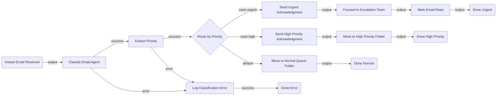

# CustomerEmailEscalation — Flow Architecture Plan

## 1. Summary

This flow monitors the support inbox in real time. The moment an email arrives, an inline AI agent classifies it as **urgent**, **high-priority**, or **normal**. Urgent emails are immediately acknowledged and forwarded to the escalation team; high-priority emails are acknowledged and moved to a priority queue folder; normal emails are filed for standard processing. Every path ends cleanly with full error handling on the classification step.

---

## 2. Flow Diagram

---

## 3. Node Table

| # | Node ID | Name | Category | Node Type | Inputs | Outputs | Notes |
|---|---|---|---|---|---|---|---|
| 1 | `emailTrigger` | Instant Email Received | trigger | `uipath.connector.trigger.uipath-mock-outlook.instant-email-received` | connection (mock-outlook) | `output` — email payload (subject, body, sender, messageId) | webhook mode — fires instantly; requires mock-outlook connection |
| 2 | `classifyAgent` | Classify Email Agent | agent | `uipath.agent.autonomous` | email subject + body from trigger output | `output.content` — JSON string `{priority, summary, customerName}`, `error` | inline agent; scaffold with `uip agent init --inline-in-flow`; Phase 2: author system prompt |
| 3 | `extractPriority` | Extract Priority | action | `core.action.script` | script parses `$vars.classifyAgent.output.content` | `output.priority` (urgent/high/normal), `output.summary`, `output.customerName` | JS: `return JSON.parse($vars.classifyAgent.output.content)` |
| 4 | `routePriority` | Route by Priority | control | `core.logic.switch` | cases on `$vars.extractPriority.output.priority` | `case-urgent`, `case-high`, `default` | 2 explicit cases + default for normal |
| 5 | `sendUrgentAck` | Send Urgent Acknowledgment | action | `uipath.connector.uipath-mock-outlook.reply-to-email` | messageId, body: "We've received your urgent request and are escalating immediately" | `output` | Phase 2: bind connection, resolve message ID field |
| 6 | `forwardEscalation` | Forward to Escalation Team | action | `uipath.connector.uipath-mock-outlook.forward-email` | messageId, toRecipients: `<ESCALATION_TEAM_EMAIL>`, comment | `output` | Phase 2: escalation team email address needed |
| 7 | `markUrgentRead` | Mark Email Read | action | `uipath.connector.uipath-mock-outlook.mark-email-read-or-unread` | messageId, isRead: true | `output` | Prevents duplicate processing |
| 8 | `doneUrgent` | Done Urgent | control | `core.control.end` | — | — | Terminal node for urgent path |
| 9 | `sendHighAck` | Send High Priority Acknowledgment | action | `uipath.connector.uipath-mock-outlook.reply-to-email` | messageId, body: "Your request has been prioritized. Expect a response within 4 hours." | `output` | Phase 2: bind connection |
| 10 | `moveHighFolder` | Move to High Priority Folder | action | `uipath.connector.uipath-mock-outlook.move-email` | messageId, destinationFolderId: `<HIGH_PRIORITY_FOLDER_ID>` | `output` | Phase 2: resolve folder ID via `uip is resources run` |
| 11 | `doneHigh` | Done High Priority | control | `core.control.end` | — | — | Terminal node for high-priority path |
| 12 | `moveNormalFolder` | Move to Normal Queue Folder | action | `uipath.connector.uipath-mock-outlook.move-email` | messageId, destinationFolderId: `<NORMAL_QUEUE_FOLDER_ID>` | `output` | Phase 2: resolve folder ID |
| 13 | `doneNormal` | Done Normal | control | `core.control.end` | — | — | Terminal node for normal path |
| 14 | `logClassifyError` | Log Classification Error | action | `core.action.script` | error from classifyAgent or extractPriority | `output.logged: true` | `return { logged: true, error: $vars.classifyAgent.error }` |
| 15 | `doneError` | Done Error | control | `core.control.end` | — | — | Terminal node for error path |

---

## 4. Edge Table

| # | Source Node | Source Port | Target Node | Target Port | Label |
|---|---|---|---|---|---|
| 1 | `emailTrigger` | `output` | `classifyAgent` | `input` | New email received |
| 2 | `classifyAgent` | `success` | `extractPriority` | `input` | Agent classified |
| 3 | `classifyAgent` | `error` | `logClassifyError` | `input` | Agent failed |
| 4 | `extractPriority` | `success` | `routePriority` | `input` | Priority extracted |
| 5 | `extractPriority` | `error` | `logClassifyError` | `input` | Parse failed |
| 6 | `routePriority` | `case-urgent` | `sendUrgentAck` | `input` | Urgent |
| 7 | `routePriority` | `case-high` | `sendHighAck` | `input` | High priority |
| 8 | `routePriority` | `default` | `moveNormalFolder` | `input` | Normal |
| 9 | `sendUrgentAck` | `output` | `forwardEscalation` | `input` | Ack sent |
| 10 | `forwardEscalation` | `output` | `markUrgentRead` | `input` | Forwarded |
| 11 | `markUrgentRead` | `output` | `doneUrgent` | `input` | Done |
| 12 | `sendHighAck` | `output` | `moveHighFolder` | `input` | Ack sent |
| 13 | `moveHighFolder` | `output` | `doneHigh` | `input` | Done |
| 14 | `moveNormalFolder` | `output` | `doneNormal` | `input` | Done |
| 15 | `logClassifyError` | `success` | `doneError` | `input` | Error logged |

---

## 5. Inputs & Outputs

| Direction | Name | Type | Description |
|---|---|---|---|
| `in` | escalationTeamEmail | `string` | Email address the flow forwards urgent emails to |
| `in` | highPriorityFolderId | `string` | Outlook folder ID for high-priority emails |
| `in` | normalQueueFolderId | `string` | Outlook folder ID for normal emails |

---

## 6. Connector Summary

| Node ID | Service | Intended Operation | Phase 2 Action |
|---|---|---|---|
| `emailTrigger` | Mock Outlook 365 | Instant Email Received (webhook trigger) | Bind connection, configure trigger |
| `sendUrgentAck` | Mock Outlook 365 | Reply To Email | Bind connection, resolve message ID field from trigger output |
| `forwardEscalation` | Mock Outlook 365 | Forward Email | Bind connection, resolve message ID + escalation recipients |
| `markUrgentRead` | Mock Outlook 365 | Mark Email Read or Unread | Bind connection, set isRead: true |
| `sendHighAck` | Mock Outlook 365 | Reply To Email | Bind connection |
| `moveHighFolder` | Mock Outlook 365 | Move Email | Bind connection, resolve high-priority folder ID |
| `moveNormalFolder` | Mock Outlook 365 | Move Email | Bind connection, resolve normal queue folder ID |

---

## 7. Open Questions

- **[REQUIRED]** No connection found for `uipath-mock-outlook` on this tenant. You'll need to create one in Integration Service before the trigger and all Outlook actions can run. *(For production, the real `uipath-microsoft-outlook365` connector would be used instead.)*
- **[REQUIRED]** What email address should urgent emails be forwarded to? (Your escalation team / manager mailbox)
- **[REQUIRED]** Which Outlook folder should high-priority emails be moved to? (e.g., "High Priority Queue")
- **[REQUIRED]** Which Outlook folder should normal emails be moved to? (e.g., "Support Queue")
- **[OPTIONAL]** Should the acknowledgment reply text be customized per priority tier?
- **[OPTIONAL]** Should normal emails also receive an auto-acknowledgment reply, or just be silently routed?
