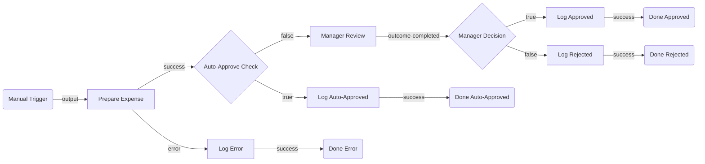

# ExpenseApproval — Architectural Plan

## 1. Summary

An expense approval flow that accepts a submitted expense report (employee name, description, amount, receipt URL) and automatically approves low-value expenses below a configurable threshold. For higher-value expenses it pauses and sends a manager a quick-form task to approve or reject, then logs the final decision so every outcome is captured as a structured output.

---

## 2. Flow Diagram

---

## 3. Node Table

| # | Node ID | Name | Category | Node Type | Inputs | Outputs | Notes |
|---|---|---|---|---|---|---|---|
| 1 | `trigger` | Manual Trigger | trigger | `core.trigger.manual` | — | Flow starts | Entry point; caller passes flow `in` variables |
| 2 | `prepareExpense` | Prepare Expense | action | `core.action.script` | `$vars.employeeName`, `$vars.expenseDescription`, `$vars.amount`, `$vars.receiptUrl`, `$vars.autoApproveThreshold` | `output.summary` (formatted string), `output.isValid` (bool) | Validates required fields, trims whitespace, builds a human-readable summary line |
| 3 | `checkThreshold` | Auto-Approve Check | control | `core.logic.decision` | `expression: $vars.amount <= $vars.autoApproveThreshold` | `true` → auto-approve path, `false` → manager path | Threshold is a flow `in` variable (default: 50) |
| 4 | `hitlManagerReview` | Manager Review | human-task | `uipath.human-in-the-loop.quick-form` | inputs: `[employeeName, expenseDescription, amount, receiptUrl, summary]`; outputs: `[managerComments]`; outcomes: `[Approve, Reject]`; priority: `Low` | `output.managerComments`, `status` (outcome name) | Sends an Action Center / Email task to the assigned manager group |
| 5 | `checkManagerDecision` | Manager Decision | control | `core.logic.decision` | `expression: $vars.hitlManagerReview.status === "Approve"` | `true` → approved path, `false` → rejected path | Branches on the outcome the manager selected |
| 6 | `logAutoApproved` | Log Auto-Approved | action | `core.action.script` | `$vars.employeeName`, `$vars.amount` | `output.approvalStatus` (`"AutoApproved"`), `output.managerComments` (`""`) | Returns the final status object for the auto-approve path |
| 7 | `logApproved` | Log Approved | action | `core.action.script` | `$vars.hitlManagerReview.output.managerComments`, `$vars.employeeName`, `$vars.amount` | `output.approvalStatus` (`"Approved"`), `output.managerComments` | Returns the final status object for the manager-approved path |
| 8 | `logRejected` | Log Rejected | action | `core.action.script` | `$vars.hitlManagerReview.output.managerComments`, `$vars.employeeName`, `$vars.amount` | `output.approvalStatus` (`"Rejected"`), `output.managerComments` | Returns the final status object for the rejected path |
| 9 | `logError` | Log Error | action | `core.action.script` | `$vars.prepareExpense.error` | `output.approvalStatus` (`"Error"`), `output.errorMessage` | Captures any validation or script exception from `prepareExpense` |
| 10 | `doneAutoApproved` | Done Auto-Approved | terminal | `core.control.end` | — | — | Maps `approvalStatus` and `managerComments` out-vars |
| 11 | `doneApproved` | Done Approved | terminal | `core.control.end` | — | — | Maps `approvalStatus` and `managerComments` out-vars |
| 12 | `doneRejected` | Done Rejected | terminal | `core.control.end` | — | — | Maps `approvalStatus` and `managerComments` out-vars |
| 13 | `doneError` | Done Error | terminal | `core.control.end` | — | — | Maps `approvalStatus` out-var; `managerComments` maps to `""` |

---

## 4. Edge Table

| # | Source Node | Source Port | Target Node | Target Port | Condition / Label |
|---|---|---|---|---|---|
| 1 | `trigger` | `output` | `prepareExpense` | `input` | — |
| 2 | `prepareExpense` | `success` | `checkThreshold` | `input` | Validation passed |
| 3 | `prepareExpense` | `error` | `logError` | `input` | Script exception / missing fields |
| 4 | `checkThreshold` | `true` | `logAutoApproved` | `input` | Amount is at or below threshold |
| 5 | `checkThreshold` | `false` | `hitlManagerReview` | `input` | Amount exceeds threshold |
| 6 | `hitlManagerReview` | `outcome-completed` | `checkManagerDecision` | `input` | Manager submitted the form |
| 7 | `checkManagerDecision` | `true` | `logApproved` | `input` | Manager selected Approve |
| 8 | `checkManagerDecision` | `false` | `logRejected` | `input` | Manager selected Reject |
| 9 | `logAutoApproved` | `success` | `doneAutoApproved` | `input` | — |
| 10 | `logApproved` | `success` | `doneApproved` | `input` | — |
| 11 | `logRejected` | `success` | `doneRejected` | `input` | — |
| 12 | `logError` | `success` | `doneError` | `input` | — |

---

## 5. Inputs & Outputs

| Direction | Name | Type | Description |
|---|---|---|---|
| `in` | `employeeName` | `string` | Full name of the employee submitting the expense |
| `in` | `expenseDescription` | `string` | Description / purpose of the expense |
| `in` | `amount` | `number` | Expense amount in USD |
| `in` | `receiptUrl` | `string` | URL or file path to the receipt (may be empty) |
| `in` | `autoApproveThreshold` | `number` | USD amount at-or-below which expenses are auto-approved (e.g. `50`) |
| `out` | `approvalStatus` | `string` | Final decision: `"AutoApproved"`, `"Approved"`, `"Rejected"`, or `"Error"` |
| `out` | `managerComments` | `string` | Free-text comments from the manager (empty on auto-approve / error paths) |

---

## 6. Open Questions

- **[OPTIONAL]** Should the flow notify the employee of the outcome (e.g. via email)? If so, which email connector / service should be used? This can be added as a connector node after the log nodes.
- **[OPTIONAL]** Who should the HITL task be assigned to — a specific user, a group name, or resolved dynamically from the expense data? (Default plan: assigns to the generic manager group; the HITL node's `assignee` can be changed to a named group or a `$vars` expression at build time.)
- **[OPTIONAL]** Should rejected expenses trigger a notification back to the submitter?
