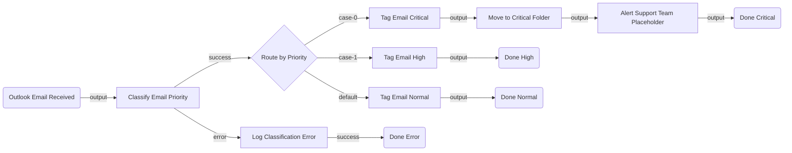

# EmailTriage — Architectural Plan

## 1. Summary

This flow monitors an Outlook 365 inbox for incoming support emails, classifies each message as **Critical**, **High**, or **Normal** priority using keyword-based logic, and routes it accordingly. Critical emails are flagged, moved to a dedicated folder, and trigger an alert to the support team. High-priority emails are flagged for follow-up. Normal emails are tagged and archived cleanly — so the important ones always surface at the top.

---

## 2. Flow Diagram



---

## 3. Node Table

| # | Node ID | Name | Category | Node Type | Inputs | Outputs | Notes |
|---|---|---|---|---|---|---|---|
| 1 | `emailTrigger` | Outlook Email Received | trigger | `uipath.connector.trigger.uipath-microsoft-outlook365.email-received` | connection: `dd657127-91f5-4568-a3a3-c024bc03fb0f` | `output.Id`, `output.Subject`, `output.BodyPreview`, `output.From`, `output.ReceivedDateTime` | CLI-owned. Phase 2: configure folder filter and event mode. |
| 2 | `classifyEmail` | Classify Email Priority | action | `core.action.script` | `emailSubject: =js:$vars.emailTrigger.output.Subject`, `emailBody: =js:$vars.emailTrigger.output.BodyPreview` | `output.priority` ("critical" / "high" / "normal"), `output.reason` | User-owned. Keyword-based classification logic in Jint JS. |
| 3 | `routePriority` | Route by Priority | control | `core.logic.switch` | case-0 expr: `$vars.classifyEmail.output.priority === "critical"` / case-1 expr: `$vars.classifyEmail.output.priority === "high"` | `case-0`, `case-1`, `default` | User-owned. |
| 4 | `markCritical` | Tag Email Critical | action | `uipath.connector.uipath-microsoft-outlook365.set-email-categories` | `emailId: =js:$vars.emailTrigger.output.Id`, `categories: ["🔴 Critical"]` | `output` | CLI-owned. Phase 2: configure via node configure. |
| 5 | `moveToFolder` | Move to Critical Folder | action | `uipath.connector.uipath-microsoft-outlook365.move-email` | `emailId: =js:$vars.emailTrigger.output.Id`, `destinationFolderId: <CRITICAL_FOLDER_ID>` | `output` | CLI-owned. Phase 2: resolve folder ID via `uip is resources run`. |
| 6 | `alertTeam` | Alert Support Team | action | `core.logic.mock` | `input` | `output` | **Placeholder** — replace with Teams `send-channel-message` once a Teams connection is created. See Open Questions. |
| 7 | `markHigh` | Tag Email High | action | `uipath.connector.uipath-microsoft-outlook365.set-email-categories` | `emailId: =js:$vars.emailTrigger.output.Id`, `categories: ["🟡 High"]` | `output` | CLI-owned. Phase 2: configure via node configure. |
| 8 | `markNormal` | Tag Email Normal | action | `uipath.connector.uipath-microsoft-outlook365.set-email-categories` | `emailId: =js:$vars.emailTrigger.output.Id`, `categories: ["🟢 Normal"]` | `output` | CLI-owned. Phase 2: configure via node configure. |
| 9 | `handleClassifyError` | Log Classification Error | action | `core.action.script` | `error: =js:$vars.classifyEmail.error` | `output.message` | User-owned. Logs error for diagnostics; flow ends gracefully. |
| 10 | `doneCritical` | Done — Critical Path | control | `core.control.end` | `input` | — | User-owned. |
| 11 | `doneHigh` | Done — High Path | control | `core.control.end` | `input` | — | User-owned. |
| 12 | `doneNormal` | Done — Normal Path | control | `core.control.end` | `input` | — | User-owned. |
| 13 | `doneError` | Done — Error Path | control | `core.control.end` | `input` | — | User-owned. |

---

## 4. Edge Table

| # | Source Node | Source Port | Target Node | Target Port | Label |
|---|---|---|---|---|---|
| 1 | `emailTrigger` | `output` | `classifyEmail` | `input` | New email received |
| 2 | `classifyEmail` | `success` | `routePriority` | `input` | Classification succeeded |
| 3 | `classifyEmail` | `error` | `handleClassifyError` | `input` | Classification threw an exception |
| 4 | `routePriority` | `case-0` | `markCritical` | `input` | Priority is critical |
| 5 | `routePriority` | `case-1` | `markHigh` | `input` | Priority is high |
| 6 | `routePriority` | `default` | `markNormal` | `input` | Priority is normal |
| 7 | `markCritical` | `output` | `moveToFolder` | `input` | Email tagged critical |
| 8 | `moveToFolder` | `output` | `alertTeam` | `input` | Email moved to critical folder |
| 9 | `alertTeam` | `output` | `doneCritical` | `input` | Alert sent |
| 10 | `markHigh` | `output` | `doneHigh` | `input` | Email tagged high |
| 11 | `markNormal` | `output` | `doneNormal` | `input` | Email tagged normal |
| 12 | `handleClassifyError` | `success` | `doneError` | `input` | Error logged |

---

## 5. Inputs & Outputs

No flow-level `in`/`out` variables required — all data flows through node outputs via `$vars.<nodeId>.output.*`.

---

## 6. Connector Summary

| Node ID | Service | Connector Key | Intended Operation | Connection ID | Phase 2 Action |
|---|---|---|---|---|---|
| `emailTrigger` | Microsoft Outlook 365 | `uipath-microsoft-outlook365` | Email received (trigger) | `dd657127-91f5-4568-a3a3-c024bc03fb0f` | Configure folder filter (Inbox); check event mode for webhooks vs polling |
| `markCritical` | Microsoft Outlook 365 | `uipath-microsoft-outlook365` | Set email categories | `dd657127-91f5-4568-a3a3-c024bc03fb0f` | Configure with emailId + category array |
| `moveToFolder` | Microsoft Outlook 365 | `uipath-microsoft-outlook365` | Move email | `dd657127-91f5-4568-a3a3-c024bc03fb0f` | Resolve "Critical" folder ID via `uip is resources run` |
| `markHigh` | Microsoft Outlook 365 | `uipath-microsoft-outlook365` | Set email categories | `dd657127-91f5-4568-a3a3-c024bc03fb0f` | Configure with emailId + category array |
| `markNormal` | Microsoft Outlook 365 | `uipath-microsoft-outlook365` | Set email categories | `dd657127-91f5-4568-a3a3-c024bc03fb0f` | Configure with emailId + category array |

---

## 7. Classification Script Logic (Phase 2 — `classifyEmail`)

```javascript
var subject = (emailSubject || "").toLowerCase();
var body = (emailBody || "").toLowerCase();
var combined = subject + " " + body;

var criticalKeywords = ["outage", "down", "critical", "p1", "urgent", "production down",
  "blocking", "data loss", "breach", "emergency", "asap", "immediately"];
var highKeywords = ["not working", "broken", "error", "failed", "issue", "problem",
  "cannot", "unable", "stopped", "slow", "broken", "crash"];

var isCritical = criticalKeywords.some(function(k) { return combined.indexOf(k) !== -1; });
var isHigh = !isCritical && highKeywords.some(function(k) { return combined.indexOf(k) !== -1; });

var priority = isCritical ? "critical" : (isHigh ? "high" : "normal");
var reason = isCritical ? "Critical keyword detected in subject/body"
  : isHigh ? "High-priority issue keyword detected"
  : "No urgency keywords found";

return { priority: priority, reason: reason };
```

---

## 8. Open Questions

- **[REQUIRED]** Which email folder/inbox should the trigger monitor? (Default: Inbox — confirm or provide a specific folder name.)
- **[REQUIRED]** Should the "Critical Folder" be an existing Outlook folder, or should we create one? (Phase 2 will resolve the folder ID; if it doesn't exist, we'll use Inbox as a fallback destination.)
- **[OPTIONAL]** Do you want Microsoft Teams alerts for critical emails? A Teams connection will need to be created in UiPath Integration Service first — no Teams connection is currently available on this tenant. The `alertTeam` mock node will be replaced once a connection is set up. Alternatively, we can replace it with an Outlook auto-reply to the sender.
- **[OPTIONAL]** Should critical/high emails also receive an auto-reply acknowledging receipt? (Adds a `reply-to-email` node on those branches.)
- **[OPTIONAL]** Should normal emails be marked as read automatically, or left unread?
