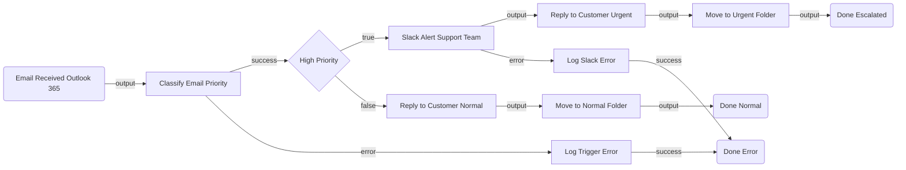

# CustomerEmailEscalation — Architectural Plan

## 1. Summary

This flow monitors a Microsoft Outlook 365 support inbox in real time. When a new email arrives, an inline script classifies it as high or normal priority based on subject and body keywords. High-priority emails trigger an immediate Slack alert to the support team channel, an auto-reply to the customer promising fast attention, and a move to an "Urgent" folder. Normal emails receive a standard acknowledgment and are filed in a "Normal" folder.

---

## 2. Flow Diagram

---

## 3. Node Table

| # | Node ID | Name | Category | Node Type | Inputs | Outputs | Notes |
|---|---------|------|----------|-----------|--------|---------|-------|
| 1 | emailTrigger | Email Received | trigger | `uipath.connector.trigger.uipath-microsoft-outlook365.email-received` | Outlook connection, inbox folder | Email subject, body, sender, emailId | CLI-owned. Phase 2: resolve Inbox folder ID, configure connection |
| 2 | classifyEmail | Classify Email Priority | action | `core.action.script` | `$vars.emailTrigger.output.subject`, `$vars.emailTrigger.output.bodyPreview` | `{ priority: "high"\|"normal", category: string, reason: string }` | Keyword-based classifier; returns priority + category |
| 3 | isHighPriority | High Priority? | control | `core.logic.decision` | `$vars.classifyEmail.output.priority === "high"` | `true` / `false` | Routes high vs normal paths |
| 4 | slackAlert | Slack Alert — Support Team | action | `uipath.connector.uipath-salesforce-slack.send-message-to-channel` | channel: `<SUPPORT_CHANNEL_ID>`, message with sender/subject/priority | `output` (ok) | CLI-owned. Phase 2: resolve channel ID, bind Slack connection |
| 5 | replyUrgent | Auto-Reply — Urgent | action | `uipath.connector.uipath-microsoft-outlook365.reply-to-email` | emailId from trigger, urgent SLA message | `output` | CLI-owned. Phase 2: bind Outlook connection |
| 6 | moveUrgent | Move to Urgent Folder | action | `uipath.connector.uipath-microsoft-outlook365.move-email` | emailId, destination `<URGENT_FOLDER_ID>` | `output` | CLI-owned. Phase 2: resolve Urgent folder ID |
| 7 | replyNormal | Auto-Reply — Standard | action | `uipath.connector.uipath-microsoft-outlook365.reply-to-email` | emailId, standard acknowledgment message | `output` | CLI-owned. Phase 2: bind Outlook connection |
| 8 | moveNormal | Move to Normal Folder | action | `uipath.connector.uipath-microsoft-outlook365.move-email` | emailId, destination `<NORMAL_FOLDER_ID>` | `output` | CLI-owned. Phase 2: resolve Normal folder ID |
| 9 | handleTriggerError | Log Script Error | action | `core.action.script` | `$vars.classifyEmail.error` | `{ logged: true }` | Logs classification failure |
| 10 | handleSlackError | Log Slack Error | action | `core.action.script` | `$vars.slackAlert.error` | `{ logged: true }` | Logs Slack failure without stopping the flow |
| 11 | doneEscalated | Done — Escalated | control | `core.control.end` | — | — | Terminal for high-priority path |
| 12 | doneNormal | Done — Normal | control | `core.control.end` | — | — | Terminal for normal path |
| 13 | doneError | Done — Error | control | `core.control.end` | — | — | Terminal for error paths |

---

## 4. Edge Table

| # | Source Node | Source Port | Target Node | Target Port | Label |
|---|-------------|-------------|-------------|-------------|-------|
| 1 | emailTrigger | output | classifyEmail | input | Email received |
| 2 | classifyEmail | success | isHighPriority | input | Classification done |
| 3 | classifyEmail | error | handleTriggerError | input | Classification failed |
| 4 | isHighPriority | true | slackAlert | input | High priority |
| 5 | isHighPriority | false | replyNormal | input | Normal priority |
| 6 | slackAlert | output | replyUrgent | input | Slack sent |
| 7 | slackAlert | error | handleSlackError | input | Slack failed |
| 8 | replyUrgent | output | moveUrgent | input | Urgent reply sent |
| 9 | moveUrgent | output | doneEscalated | input | Moved to Urgent |
| 10 | replyNormal | output | moveNormal | input | Normal reply sent |
| 11 | moveNormal | output | doneNormal | input | Moved to Normal |
| 12 | handleTriggerError | success | doneError | input | Error logged |
| 13 | handleSlackError | success | doneError | input | Error logged |

---

## 5. Inputs & Outputs

| Direction | Name | Type | Description |
|-----------|------|------|-------------|
| `out` | lastEmailProcessed | `string` | Subject of the last email processed (optional observability) |

---

## 6. Connector Summary

| Node ID | Service | Intended Operation | Phase 2 Action |
|---------|---------|-------------------|----------------|
| emailTrigger | Microsoft Outlook 365 | Email Received (trigger) | Run `triggers objects` + `triggers describe`; resolve Inbox folder ID; bind connection `75dfafb4` (folder `uipath-maestro-flow`) |
| slackAlert | Slack | Send Message to Channel | Resolve channel ID for support channel; bind connection `849e85d8` (folder `uipath-maestro-flow`) |
| replyUrgent | Microsoft Outlook 365 | Reply to Email | Bind connection `75dfafb4`; resolve reply body fields from `registry get` |
| replyNormal | Microsoft Outlook 365 | Reply to Email | Same as replyUrgent |
| moveUrgent | Microsoft Outlook 365 | Move Email | Resolve Urgent folder ID via `is resources run list` |
| moveNormal | Microsoft Outlook 365 | Move Email | Resolve Normal folder ID via `is resources run list` |

---

## 7. Open Questions

- **[REQUIRED]** Which Outlook mailbox / inbox folder should be monitored for incoming support emails? (Default: primary Inbox of connection account)
- **[REQUIRED]** What Slack channel should receive escalation alerts? (e.g., `#support-escalations`)
- **[REQUIRED]** Do "Urgent" and "Normal" mail folders already exist in the support mailbox, or should the flow use existing folders by a different name? Alternatively, the flow can move to any existing folder you name.
- **[OPTIONAL]** Are there specific keywords or senders that should always count as high priority? (The flow defaults to common keywords: "urgent", "critical", "down", "outage", "broken", "emergency", "ASAP", "refund", "fraud", "account suspended", "locked out")
- **[OPTIONAL]** Should the auto-reply for high-priority emails mention a specific SLA (e.g., "within 1 hour")?
