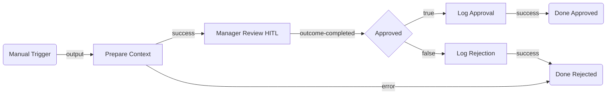

# Expense Approval Flow — Architectural Plan

## 1. Summary

An expense report is submitted manually (via trigger), with all relevant details passed as flow inputs. The flow pauses at a HITL quick-form node where a manager reviews the expense and clicks **Approve** or **Reject**. After the manager decides, a Script node logs the decision (timestamp, employee, amount, outcome) and the flow ends gracefully on both paths.

---

## 2. Flow Diagram

---

## 3. Node Table

| # | Node ID | Name | Category | Node Type | Inputs | Outputs | Notes |
|---|---|---|---|---|---|---|---|
| 1 | `trigger` | Manual Trigger | trigger | `core.trigger.manual` | Flow inputs: `employeeId`, `employeeName`, `expenseDescription`, `amount` | — | Start node; carries expense data as flow `in` variables |
| 2 | `prepareContext` | Prepare Context | action | `core.action.script` | `$vars.trigger.*` globals: `employeeId`, `employeeName`, `expenseDescription`, `amount` | `output.summary` (formatted string for the HITL form) | Builds a readable summary string for the manager form |
| 3 | `managerReview` | Manager Review | human-task | `uipath.human-in-the-loop.quick-form` | inputs: `[employeeName (string), expenseDescription (string), amount (number), summary (string)]`; outputs: `[comments (string)]`; outcomes: `[Approve, Reject]` | `output.comments`, `status` (outcome action value) | Manager reads expense details and chooses Approve or Reject |
| 4 | `decideOutcome` | Approved? | control | `core.logic.decision` | expression: `$vars.managerReview.status === "Approve"` | Routes to `true` or `false` | Branches on manager's chosen outcome |
| 5 | `logApproval` | Log Approval | action | `core.action.script` | `$vars` globals: employee, amount, comments | `output.logEntry` | Builds structured approval log entry; stores in `approvalLog` out variable |
| 6 | `logRejection` | Log Rejection | action | `core.action.script` | `$vars` globals: employee, amount, comments | `output.logEntry` | Builds structured rejection log entry; stores in `approvalLog` out variable |
| 7 | `doneApproved` | Done — Approved | control | `core.control.end` | — | — | Terminal node for approval path |
| 8 | `doneRejected` | Done — Rejected | control | `core.control.end` | — | — | Terminal node for rejection path and script error fallback |

---

## 4. Edge Table

| # | Source Node | Source Port | Target Node | Target Port | Condition / Label |
|---|---|---|---|---|---|
| 1 | `trigger` | `output` | `prepareContext` | `input` | Flow starts |
| 2 | `prepareContext` | `success` | `managerReview` | `input` | Context built |
| 3 | `prepareContext` | `error` | `doneRejected` | `input` | Script error fallback |
| 4 | `managerReview` | `outcome-completed` | `decideOutcome` | `input` | Manager submitted form |
| 5 | `decideOutcome` | `true` | `logApproval` | `input` | Approved |
| 6 | `decideOutcome` | `false` | `logRejection` | `input` | Rejected |
| 7 | `logApproval` | `success` | `doneApproved` | `input` | Logged |
| 8 | `logRejection` | `success` | `doneRejected` | `input` | Logged |

---

## 5. Inputs & Outputs

| Direction | Name | Type | Description |
|---|---|---|---|
| `in` | `employeeId` | `string` | Unique identifier for the submitting employee |
| `in` | `employeeName` | `string` | Display name of the employee |
| `in` | `expenseDescription` | `string` | Description of the expense (e.g., "Flight to NYC — client meeting") |
| `in` | `amount` | `number` | Expense amount in the team's currency |
| `out` | `approvalLog` | `object` | Final log entry: `{ employee, amount, decision, comments, timestamp }` |

---

## 6. Open Questions

- **[OPTIONAL]** Should the log entry be written somewhere (e.g., a spreadsheet, database, or queue) rather than only returned as a flow output variable? If yes, that would add a connector node (e.g., Google Sheets, Dataverse) or a queue node after the log scripts — specify the target system and I'll add it to the plan.
- **[OPTIONAL]** Should rejected expenses trigger a notification back to the employee? If yes, a connector node (e.g., email via Outlook or a message via Slack/Teams) would go on the rejection path.
- **[OPTIONAL]** Is there a spending threshold below which expenses can be auto-approved without manager review? If yes, a Decision node can be added before the HITL to skip it when `amount < threshold`.
