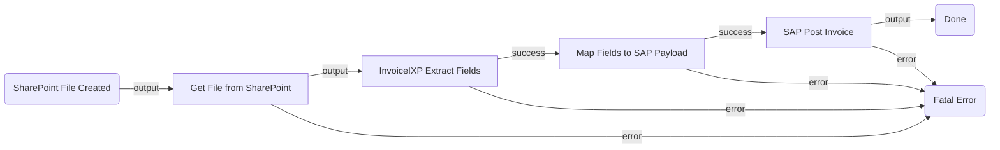

# Invoice Automation — Architecture Plan

## 1. Summary

A SharePoint file-drop triggers the flow whenever a new PDF invoice arrives. The flow downloads the file, runs it through a published IxP extraction model to pull out the key fields, maps those fields into a SAP-compatible payload via a script, and posts the invoice record directly into SAP — fully automated, no human in the loop.

---

## 2. Flow Diagram

---

## 3. Node Table

| # | Node ID | Name | Category | Node Type | Inputs | Outputs | Notes |
|---|---------|------|----------|-----------|--------|---------|-------|
| 1 | `fileTrigger` | SharePoint File Created | trigger | `uipath.connector.trigger.uipath-microsoft-onedrive.file-created` | Site: `<SHAREPOINT_SITE>`, Folder: `<FOLDER_PATH>` | File metadata (id, name, path) | Polling mode. Phase 2: bind OneDrive connection, resolve site/folder IDs |
| 2 | `getFile` | Get File from SharePoint | connector | `uipath.connector.uipath-microsoft-onedrive.get-file-or-folder` | File ID from `$vars.fileTrigger.output` | File binary/URL for IxP | Phase 2: bind connection, resolve itemId from trigger output |
| 3 | `extractInvoice` | Extract Invoice Fields | ixp | `uipath.ixp.invoiceixp-cef0d447-ixp.ff973488-5d89-8035-86ac-f980b4be6deb-c4359cde-55f0-4f0e-9322-c6cdce74ab4c` | File content from `getFile` output | `ExtractionResult` with invoice number, vendor, date, total, line items | Published model `InvoiceIXP` already available on tenant |
| 4 | `mapFields` | Map Fields to SAP Payload | action | `core.action.script` | `$vars.extractInvoice.output.ExtractionResult` | SAP-shaped object | Jint JS: reads Fields[], builds SAP payload |
| 5 | `postToSap` | Post Invoice to SAP | connector | `uipath.connector.uipath-sap-bapi.execute-bapi-rfc` | BAPI name, vendor invoice fields from `mapFields` | Transaction ID / document number | Phase 2: bind SAP BAPI connection, confirm BAPI name (e.g. `BAPI_INCOMINGINVOICE_CREATE`) |
| 6 | `doneSuccess` | Done | control | `core.control.end` | — | — | Happy path termination |
| 7 | `terminateFatal` | Fatal Error | control | `core.logic.terminate` | — | — | Catches any connector/extraction failure |

---

## 4. Edge Table

| # | Source Node | Source Port | Target Node | Target Port | Condition / Label |
|---|-------------|------------|-------------|-------------|-------------------|
| 1 | `fileTrigger` | `output` | `getFile` | `input` | New file created in SharePoint |
| 2 | `getFile` | `output` | `extractInvoice` | `input` | File fetched |
| 3 | `getFile` | `error` | `terminateFatal` | `input` | Could not retrieve file |
| 4 | `extractInvoice` | `success` | `mapFields` | `input` | Extraction succeeded |
| 5 | `extractInvoice` | `error` | `terminateFatal` | `input` | Extraction failed |
| 6 | `mapFields` | `success` | `postToSap` | `input` | Fields mapped to SAP payload |
| 7 | `mapFields` | `error` | `terminateFatal` | `input` | Script error |
| 8 | `postToSap` | `output` | `doneSuccess` | `input` | Invoice posted to SAP |
| 9 | `postToSap` | `error` | `terminateFatal` | `input` | SAP call failed |

---

## 5. Inputs & Outputs

| Direction | Name | Type | Description |
|-----------|------|------|-------------|
| (none — flow is fully event-driven; all data flows from the trigger through internal variables) | | | |

---

## 6. Connector Summary

| Node ID | Service | Connector Key | Intended Operation | Phase 2 Action |
|---------|---------|---------------|--------------------|----------------|
| `fileTrigger` | Microsoft OneDrive & SharePoint | `uipath-microsoft-onedrive` | File created in folder | Bind connection, resolve SharePoint site + folder IDs |
| `getFile` | Microsoft OneDrive & SharePoint | `uipath-microsoft-onedrive` | Get file / folder content | Same connection as trigger; resolve itemId field mapping |
| `postToSap` | SAP BAPI | `uipath-sap-bapi` | Execute BAPI/RFC | Bind SAP BAPI connection; confirm BAPI name + field mapping |

---

## 7. Open Questions

- **[REQUIRED]** Which SharePoint site and folder should the trigger monitor? (e.g. `https://yourcompany.sharepoint.com/sites/Finance`, folder `/Incoming Invoices`)
- **[REQUIRED]** Which SAP module do you use for vendor invoice posting? Options:
  1. **SAP BAPI / RFC** (ERP, ECC, S/4HANA on-premise) — the plan uses `BAPI_INCOMINGINVOICE_CREATE`
  2. **SAP OData** (S/4HANA Cloud) — would use the `uipath-sap-odata` connector instead
  3. Something else (custom RFC, middleware, etc.)
- **[OPTIONAL]** The `InvoiceIXP` model found on the tenant is a shared/generic model. For higher accuracy on your specific vendors, consider training a custom IxP project (the `uipath-ixp` skill can do this). For now the plan uses the existing `InvoiceIXP` model — is that acceptable as a starting point?
