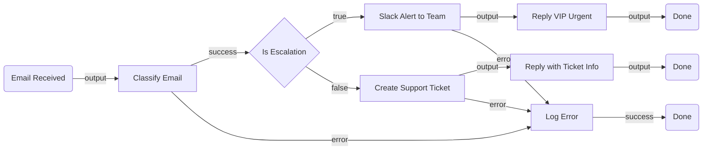

# CustomerEscalation — Architectural Plan (v3)

## 1. Summary

This flow fires when a new email arrives in Outlook 365. A Script node evaluates two signals — VIP sender domain and urgent keyword presence — and produces a single boolean: `isEscalation` (true only when BOTH conditions are met). A Decision node routes accordingly: escalation emails get an immediate Slack team alert plus a priority customer reply; everything else gets a Zendesk support ticket created and a reply to the customer with their ticket reference number.

---

## 2. Priority Logic

| Condition | Outcome |
|---|---|
| VIP sender **AND** urgent keywords | **Escalate** → Slack alert + priority reply to customer |
| Anything else | **Standard** → Zendesk ticket + reply with ticket number |

### Default urgency keywords
`urgent, outage, down, critical, broken, not working, emergency, ASAP, immediately, crash, refund, cancel, churn, legal, lawsuit, escalate, complaint, furious, disappointed`

### Default VIP domains
`acme.com, globex.com, initech.com, umbrella-corp.com, hooli.com`
*(Replace with real enterprise account domains before go-live)*

---

## 3. Flow Diagram (Mermaid)

---

## 4. Node Table

| # | Node ID | Name | Category | Node Type | Key Inputs | Notes |
|---|---|---|---|---|---|---|
| 1 | trigger | Email Received | trigger | `uipath.connector.trigger.uipath-microsoft-outlook365.email-received` | Folder: Inbox | CLI-owned; connection: `dd657127-…` (default) |
| 2 | classifyEmail | Classify Email | action | `core.action.script` | subject, body, sender from trigger; vipDomains + urgentKeywords from flow vars | Returns `{ isVip, isUrgent, isEscalation, reason }` |
| 3 | checkEscalation | Is Escalation | control | `core.logic.decision` | `$vars.classifyEmail.output.isEscalation` | true → Slack lane; false → Zendesk lane |
| 4 | slackAlert | Slack Alert to Team | action | `uipath.connector.uipath-salesforce-slack.send-message-to-channel` | channel: `<SLACK_CHANNEL>`, message with subject/sender/reason | CLI-owned; connection: `e03f734e-…` (default); **Slack channel ID needed** |
| 5 | replyEscalation | Reply VIP Urgent | action | `uipath.connector.uipath-microsoft-outlook365.reply-to-email` | messageId from trigger, escalation reply body | CLI-owned; same Outlook connection |
| 6 | createTicket | Create Support Ticket | action | `uipath.connector.uipath-zendesk-zendesk.create-ticket` | subject + body from trigger email | CLI-owned; **Zendesk connection missing — must be created** |
| 7 | replyStandard | Reply with Ticket Info | action | `uipath.connector.uipath-microsoft-outlook365.reply-to-email` | messageId, reply body with ticket ID/number | CLI-owned; same Outlook connection |
| 8 | logError | Log Error | action | `core.action.script` | error details from failed node | Captures classify/Slack/Zendesk errors |
| 9 | doneEscalation | Done | control | `core.control.end` | — | Terminal: escalation path |
| 10 | doneStandard | Done | control | `core.control.end` | — | Terminal: standard path |
| 11 | doneError | Done | control | `core.control.end` | — | Terminal: error path |

---

## 5. Edge Table

| # | Source | Source Port | Target | Target Port |
|---|---|---|---|---|
| 1 | trigger | output | classifyEmail | input |
| 2 | classifyEmail | success | checkEscalation | input |
| 3 | classifyEmail | error | logError | input |
| 4 | checkEscalation | true | slackAlert | input |
| 5 | checkEscalation | false | createTicket | input |
| 6 | slackAlert | output | replyEscalation | input |
| 7 | slackAlert | error | logError | input |
| 8 | replyEscalation | output | doneEscalation | input |
| 9 | createTicket | output | replyStandard | input |
| 10 | createTicket | error | logError | input |
| 11 | replyStandard | output | doneStandard | input |
| 12 | logError | success | doneError | input |

---

## 6. Flow Variables

| Direction | Name | Type | Description |
|---|---|---|---|
| `in` | slackChannelId | `string` | Slack channel ID for escalation alerts |
| `in` | vipDomains | `string` | Comma-separated VIP domains (default list above) |
| `in` | urgentKeywords | `string` | Comma-separated urgent keywords (default list above) |

---

## 7. Connector Summary

| Service | Connection | Status |
|---|---|---|
| Outlook 365 (trigger + reply nodes) | `dd657127-…` (default, enabled) | ✅ Ready |
| Slack (alert node) | `e03f734e-…` (default, enabled) | ✅ Ready — channel ID needed |
| Zendesk (ticket node) | None found | ❌ Connection must be created before configure |

---

## 8. Open Questions

- **[REQUIRED]** Zendesk connection must be created in Integration Service before the ticket node can be configured. After creating it, run `uip maestro flow node configure` on the `createTicket` node.
- **[REQUIRED]** Slack channel ID — which channel should escalation alerts post to?
- **[OPTIONAL]** Replace placeholder VIP domains with real account domains before go-live.
