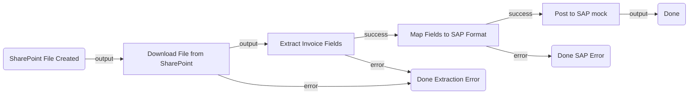

# VendorInvoiceProcessing — Architectural Plan

## 1. Summary

When a new PDF invoice lands in a SharePoint folder, the flow automatically downloads
it, runs it through an IxP extraction model to pull structured invoice fields, maps
those fields into an SAP-compatible payload, and posts the invoice to SAP — fully
unattended, end-to-end.

## 2. Flow Diagram

## 3. Node Table

| # | Node ID | Name | Category | Node Type | Inputs | Outputs | Notes |
|---|---------|------|----------|-----------|--------|---------|-------|
| 1 | `trigger` | SharePoint File Created | trigger | `uipath.connector.trigger.uipath-microsoft-onedrive.file-created` | Auto — configured with folder path | `output.fileId`, `output.driveId`, file metadata | connector: uipath-microsoft-onedrive; connection: ae311606-25b7-43ef-9cd0-f3dc0b3a9b58 (Productivity O365 OneDrive). Phase 2: configure folder path filter. |
| 2 | `downloadFile` | Download File from SharePoint | action | `uipath.connector.uipath-microsoft-onedrive.download-file` | `fileId: =js:$vars.trigger.output.fileId`, `driveId: =js:$vars.trigger.output.driveId` | `output.fileRef` (file reference for IxP) | CLI-owned. Phase 2: bind connection, resolve field names from registry get. |
| 3 | `extractInvoice` | Extract Invoice Fields | action | `uipath.ixp.<INVOICE_MODEL>` | `fileRef: =js:$vars.downloadFile.output.fileRef` | `output.ExtractionResult.ResultsDocument.Fields[]` | Resource: TBD invoice IxP model — see Open Questions. User-owned (Direct JSON edit). |
| 4 | `mapFields` | Map Fields to SAP Format | action | `core.action.script` | `$vars.extractInvoice.output` | `output.sapPayload` | Script maps Fields[] array by FieldName to a flat SAP-ready object. User-owned. |
| 5 | `postToSap` | Post to SAP | action | `core.logic.mock` | `=js:$vars.mapFields.output.sapPayload` | `output` | **MOCK** — replace with `uipath.connector.uipath-sap-bapi.execute-bapi-rfc` (or SAP OData) once a connection is created. See Open Questions. |
| 6 | `doneSuccess` | Done | control | `core.control.end` | — | — | Success path. |
| 7 | `doneExtractErr` | Done — Extraction Error | control | `core.control.end` | — | — | SharePoint download or IxP extraction failure. |
| 8 | `doneSapErr` | Done — SAP Error | control | `core.control.end` | — | — | Script map or SAP post failure. |

## 4. Edge Table

| # | Source | Source Port | Target | Target Port | Label |
|---|--------|-------------|--------|-------------|-------|
| 1 | `trigger` | `output` | `downloadFile` | `input` | New file event |
| 2 | `downloadFile` | `output` | `extractInvoice` | `input` | File downloaded |
| 3 | `downloadFile` | `error` | `doneExtractErr` | `input` | Download failed |
| 4 | `extractInvoice` | `success` | `mapFields` | `input` | Fields extracted |
| 5 | `extractInvoice` | `error` | `doneExtractErr` | `input` | Extraction failed |
| 6 | `mapFields` | `success` | `postToSap` | `input` | Payload ready |
| 7 | `mapFields` | `error` | `doneSapErr` | `input` | Mapping failed |
| 8 | `postToSap` | `output` | `doneSuccess` | `input` | Invoice posted |

## 5. Inputs & Outputs

_No flow-level in/out variables — fully event-driven, no caller arguments._

## 6. Connector Summary

| Node | Service | Connector Key | Operation | Connection |
|------|---------|---------------|-----------|------------|
| `trigger` | SharePoint / OneDrive | `uipath-microsoft-onedrive` | file-created trigger | ae311606 — Productivity O365 OneDrive ✅ |
| `downloadFile` | SharePoint / OneDrive | `uipath-microsoft-onedrive` | download-file | ae311606 — same ✅ |
| `postToSap` | SAP | `uipath-sap-bapi` or `uipath-sap-odata` | insert invoice | ❌ No connection found — MOCK until created |

## 7. Open Questions

**[REQUIRED] Which IxP invoice extraction model should the flow use?**

Three invoice-focused models are published on this tenant:

| Option | DisplayName | Location |
|--------|-------------|----------|
| A | InvoiceIXP | Shared |
| B | invoices-billing | Shared/uipath-maestro-flow/BillingDispute |
| C | idp-benchmark---invoices | Shared (benchmark/test) |

**[REQUIRED] Which SAP interface to use for posting the invoice?**

Two SAP connectors are available — no connection exists for either yet:

| Option | Connector | Best For |
|--------|-----------|----------|
| A | SAP BAPI (`uipath-sap-bapi`) | Direct RFC/BAPI calls (e.g. BAPI_INCOMINGINVOICE_CREATE) |
| B | SAP OData (`uipath-sap-odata`) | REST-style API (S/4HANA OData services) |

A SAP connection must be created in Integration Service before the `postToSap` mock can be replaced with a real connector node.
