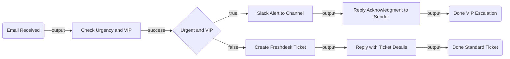

# CustomerEmailEscalation — Architectural Plan

## 1. Summary

This flow triggers whenever a new email lands in an Outlook inbox. It evaluates each email on two criteria — urgency (keywords in subject/body) and VIP sender status — and routes accordingly: if both flags are true it posts a Slack alert and sends the sender an acknowledgment reply; otherwise it opens a Freshdesk support ticket and replies to the sender with the ticket ID.

---

## 2. Flow Diagram (Mermaid)

---

## 3. Node Table

| # | Node ID | Name | Category | Node Type | Inputs | Outputs | Notes |
|---|---|---|---|---|---|---|---|
| 1 | emailTrigger | Email Received | trigger | `uipath.connector.trigger.uipath-mock-outlook.email-received` | connection: uipath-mock-outlook | subject, body, from, id | CLI-owned. Phase 2: bind connection (Open Q #3) |
| 2 | checkUrgencyAndVip | Check Urgency and VIP | action | `core.action.script` | `$vars.emailTrigger.output.subject`, `$vars.emailTrigger.output.body`, `$vars.emailTrigger.output.from` | `{ isUrgent, isVip, fromEmail, subject }` | Checks urgency keywords (Open Q #1) and VIP list (Open Q #2) |
| 3 | routeDecision | Urgent and VIP | control | `core.logic.decision` | expression: `$vars.checkUrgencyAndVip.output.isUrgent && $vars.checkUrgencyAndVip.output.isVip` | `true`, `false` | Both conditions must hold for VIP path |
| 4 | notifySlack | Slack Alert to Channel | action | `uipath.connector.uipath-salesforce-slack.send-message-to-channel` | channelId: `<SLACK_CHANNEL_ID>`, message text | output | CLI-owned. Phase 2: resolve channel ID (Open Q #4) |
| 5 | replyAcknowledge | Reply Acknowledgment to Sender | action | `uipath.connector.uipath-mock-outlook.reply-to-email` | emailId: `$vars.emailTrigger.output.id`, body: acknowledgment text | output | CLI-owned. Phase 2: bind connection (Open Q #3) |
| 6 | createTicket | Create Freshdesk Ticket | action | `uipath.connector.uipath-freshworks-freshdesk.create-ticket` | subject, description from email | ticketId | CLI-owned. Connection available in folder `uipath-rpa-isActivities` |
| 7 | replyTicket | Reply with Ticket Details | action | `uipath.connector.uipath-mock-outlook.reply-to-email` | emailId: `$vars.emailTrigger.output.id`, body including ticket ID | output | CLI-owned. Phase 2: bind connection (Open Q #3) |
| 8 | doneVip | Done VIP Escalation | control | `core.control.end` | — | — | Terminal for the VIP escalation path |
| 9 | doneStandard | Done Standard Ticket | control | `core.control.end` | — | — | Terminal for the standard ticket path |

---

## 4. Edge Table

| # | Source Node | Source Port | Target Node | Target Port | Condition/Label |
|---|---|---|---|---|---|
| 1 | emailTrigger | output | checkUrgencyAndVip | input | Email received |
| 2 | checkUrgencyAndVip | success | routeDecision | input | Script evaluated |
| 3 | routeDecision | true | notifySlack | input | Urgent AND VIP |
| 4 | notifySlack | output | replyAcknowledge | input | Slack message sent |
| 5 | replyAcknowledge | output | doneVip | input | Acknowledgment sent |
| 6 | routeDecision | false | createTicket | input | Not urgent OR not VIP |
| 7 | createTicket | output | replyTicket | input | Ticket created |
| 8 | replyTicket | output | doneStandard | input | Ticket reply sent |

---

## 5. Inputs & Outputs

This flow is event-driven and has no declared `in`/`out` variables — the trigger payload carries all inputs and no outputs are needed beyond the side effects (Slack post, email replies, ticket).

---

## 6. Connector Summary

| Node ID | Service | Connector Key | Intended Operation | Connection Status |
|---|---|---|---|---|
| emailTrigger | Outlook (mock) | `uipath-mock-outlook` | Trigger on new email received | No connection — must be created (Open Q #3) |
| notifySlack | Slack | `uipath-salesforce-slack` | Send message to channel | Enabled connection found in folder `uipath-maestro-flow` |
| replyAcknowledge | Outlook (mock) | `uipath-mock-outlook` | Reply to email | No connection — same as trigger (Open Q #3) |
| createTicket | Freshdesk | `uipath-freshworks-freshdesk` | Create ticket | Enabled connection found in folder `uipath-rpa-isActivities` |
| replyTicket | Outlook (mock) | `uipath-mock-outlook` | Reply to email | No connection — same as trigger (Open Q #3) |

---

## 7. Open Questions

**[REQUIRED] #1 — Urgency detection rule**
How should the flow decide whether an email is urgent? Options:
- Keywords in subject/body (e.g. "urgent", "critical", "asap")
- A specific priority header set by the sender's email client
- Subject-line prefix like `[URGENT]`
- Something else

**[REQUIRED] #2 — VIP customer identification**
How should the flow determine whether the sender is a VIP? Options:
- Hardcoded list of email addresses in the script
- Hardcoded list of email domains (e.g. `bigclient.com`)
- Lookup in an external system (CRM, spreadsheet, etc.)
- Something else

**[REQUIRED] #3 — Outlook connection**
No connection exists for the `uipath-mock-outlook` connector. The email trigger, acknowledgment reply, and ticket reply nodes all need one. This connection must be created in Integration Service before the flow can be configured or run.

**[REQUIRED] #4 — Slack channel**
Which Slack channel should the VIP escalation alert be posted to? (e.g. `#support-escalations`, `#vip-alerts`)

**[OPTIONAL] #5 — Acknowledgment and ticket reply content**
What should the acknowledgment reply to VIP senders say? What should the ticket reply to non-VIP senders include (just the ticket ID, a URL, more context)?
